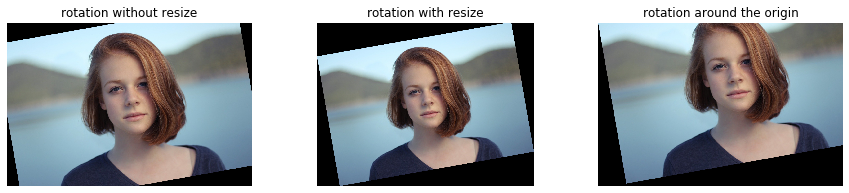

# 画像変形

```python
import numpy as np

import matplotlib.pyplot as plt
%matplotlib inline
plt.gray();
from matplotlib.pyplot import imshow

import skimage
from skimage.io import imread, imsave
from skimage.transform import rotate, resize
from skimage.filters import gaussian
from skimage.transform import AffineTransform, ProjectiveTransform, warp

from ipywidgets import interact, interactive, fixed, RadioButtons
import ipywidgets as widgets
from IPython.display import display
```

```python
im = imread('girl.jpg')

# @interact(angle=(-180, 180, 10))

def g(angle=0):
    """
    Param:
    angle:角度
    """
    fig = plt.figure(figsize=(15,3))
    
    fig.add_subplot(1, 3, 1)
    # sckit-imageの画像の角度変換、resize=Falseにし、元の画像の表示設定のまま表示
    im_rot = rotate(im, angle=angle, resize=False)
    imshow(im_rot)
    plt.axis('off')
    plt.title('rotation without resize')

    fig.add_subplot(1, 3, 2)
    # sckit-imageの画像の角度変換、resize=Trueにし、変換後の画像をすべて表示する設定
    im_rot = rotate(im, angle=angle, resize=True)
    imshow(im_rot)
    plt.axis('off')
    plt.title('rotation with resize')


    fig.add_subplot(1, 3, 3)
    # 線形変換の実行
    angle = np.deg2rad(angle)
    A = np.array([[np.cos(angle), -np.sin(angle), 0],
                  [np.sin(angle), np.cos(angle), 0],
                  [ 0,  0, 1]])
    # warpで変形する元画像、変換オブジェクト（affine変換オブジェクト）を指定
    # 原点を中心に回転
    imshow(warp(im, AffineTransform(A)))
    plt.axis('off')
    plt.title('rotation around the origin')
    

    plt.show()

# 10°で回転
g(10)
```



