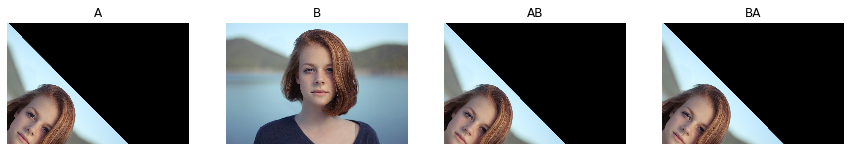

# スケーリング，回転，鏡映

```python
import numpy as np

import matplotlib.pyplot as plt
%matplotlib inline
plt.gray();
from matplotlib.pyplot import imshow

import skimage
from skimage.io import imread, imsave
from skimage.transform import rotate, resize
from skimage.filters import gaussian
from skimage.transform import AffineTransform, ProjectiveTransform, warp

from ipywidgets import interact, interactive, fixed, RadioButtons
import ipywidgets as widgets
from IPython.display import display
```


```python
im = imread('girl.jpg')


# @interact(angle=(-180, 180, 10), 
#           tx=(0, im.shape[1], 50),
#           ty=(0, im.shape[0], 50),
#          )
def g(angle=0, tx=0, ty=0):

    angle = np.deg2rad(angle)
    # 回転行列を作成
    A = np.array([[np.cos(angle), -np.sin(angle), 0],
                  [np.sin(angle), np.cos(angle), 0],
                  [ 0,  0, 1]])
    # 平進移動をする行列を作成
    B = np.array([[ 1,  0, tx],
                  [ 0,  1, ty],
                  [ 0,  0, 1]])

    fig = plt.figure(figsize=(15,3))
    
    fig.add_subplot(1, 4, 1)
    imshow(warp(im, AffineTransform(A).inverse))
    plt.axis('off')
    plt.title('A')


    fig.add_subplot(1, 4, 2)
    imshow(warp(im, AffineTransform(B).inverse))
    plt.axis('off')
    plt.title('B')


    fig.add_subplot(1, 4, 3)
    imshow(warp(im, AffineTransform(A @ B).inverse))
    plt.axis('off')
    plt.title('AB')


    fig.add_subplot(1, 4, 4)
    imshow(warp(im, AffineTransform(B @ A).inverse))
    plt.axis('off')
    plt.title('BA')


    

    plt.show()
    
g(angle=45, tx=2, ty=-2)
```





