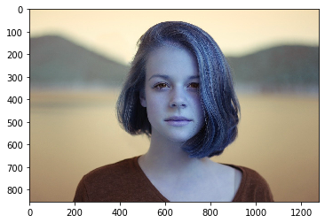
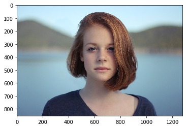
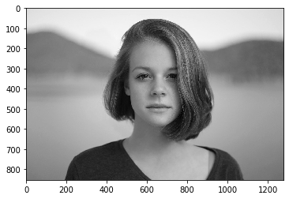

# 画像の表示 imread()


```python
import cv2
import numpy as np
import matplotlib.pyplot as plt
import seaborn as sns
%matplotlib inline
```

## cv2.imread()


```python
im = cv2.imread('../../data/girl.jpg')
```


```python
# 形状の確認
im.shape
```


    (853, 1280, 3)


```python
# ndarrayを画像として表示 (RGBで表示)
plt.imshow(im)
```


    <matplotlib.image.AxesImage at 0x7f9addf6fb50>





opencvのデフォルトのチャネルの並びはBGRなので表示される画像の色はおかしくなります。

## cv2.cvtColor()

画像の色空間を変える関数です。

- `cv2.COLOR_BGR2RGB`を設定することで画像がBGR → RGBに変換されます。


```python
im = cv2.cvtColor(im, cv2.COLOR_BGR2RGB)
plt.imshow(im)
```


    <matplotlib.image.AxesImage at 0x7f9addf24910>





また、グレースケールは以下のように記載します。


```python
# 白黒　(gray scale)
gray = cv2.cvtColor(im, cv2.COLOR_RGB2GRAY)
plt.imshow(gray, cmap='gray')
```


    <matplotlib.image.AxesImage at 0x7f9ad6379950>




