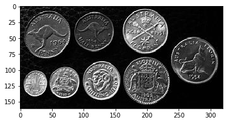
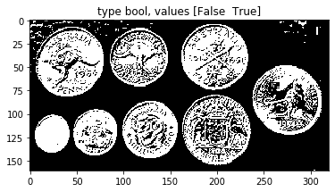
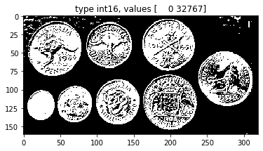
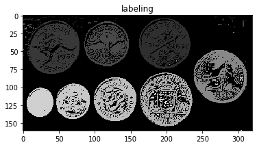
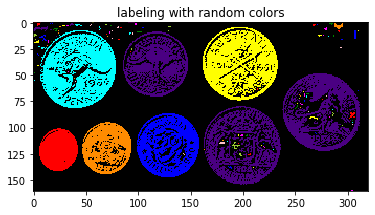
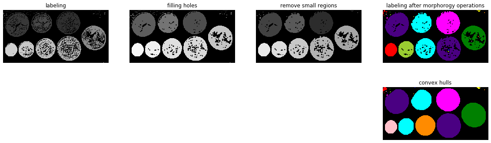

# 二値画像のラベリング

```python
img = rgb2gray(imread('coins.jpg'))
imshow(img)
```



```python
block_size = 121

img2 = img > threshold_local(img, block_size)
imshow(img2)
plt.title('type {0}, values {1}'.format(img2.dtype, np.unique(img2)))
plt.show()

img2i = skimage.img_as_int(img2)
imshow(img2i)
plt.title('type {0}, values {1}'.format(img2i.dtype, np.unique(img2i)))
plt.show()
```



```python
img2il = measure.label(img2i) # ラベリング

imshow(img2il) # ラベリング結果の表示．輝度値はラベル番号
plt.title('labeling')
plt.show()

imshow(color.label2rgb(img2il, bg_label=0)) # ラベリング結果をカラーで表示．
plt.title('labeling with random colors')
plt.show()
```




## モルフォロジー処理

```python
@interact(element=['disk', 'square'],
          size=(1, 10, 1)
         )
def g(element='disk', size=1):

    if element == 'square':
        disk = morphology.square(size)
    else:
        disk = morphology.disk(size)

    fig = plt.figure(figsize=(20, 6))

    fig.add_subplot(2, 4, 1)
    imshow(img2il) # ラベリング結果の表示．輝度値はラベル番号
    plt.title('labeling')
    plt.axis('off')

    img2im = img2il.copy()

    fig.add_subplot(2, 4, 2)
    img2im = morphology.binary_dilation(img2im, disk)
    img2im = morphology.binary_erosion(img2im, disk)
    imshow( measure.label(img2im) )
    plt.title('filling holes')
    plt.axis('off')

    fig.add_subplot(2, 4, 3)
    img2im = morphology.binary_erosion(img2im, disk)
    img2im = morphology.binary_dilation(img2im, disk)
    imshow( measure.label(img2im) )
    plt.title('remove small regions')
    plt.axis('off')

    fig.add_subplot(2, 4, 4)
    imshow(color.label2rgb(measure.label(img2im), bg_label=0))
    plt.title('labeling after morphorogy operations')
    plt.axis('off')

    fig.add_subplot(2, 4, 8)
    # 各物体の凸包を求めると，もっときれいになる
    img2im = measure.label(morphology.convex_hull_object(img2im))
    imshow(color.label2rgb(img2im, bg_label=0))
    plt.title('convex hulls')
    plt.axis('off')

    plt.show()
```


