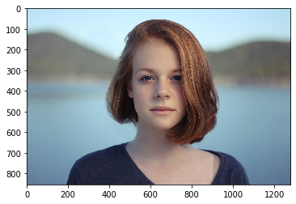
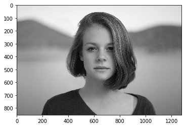

# カラー画像とグレースケール

### カラー画像の表示
```python
import cv2

import skimage
from skimage.io import imread, imsave

from skimage.color import rgb2gray
from skimage.transform import resize
from skimage.filters import threshold_otsu, threshold_local
from skimage.exposure import histogram, adjust_gamma
from skimage.morphology import square
from skimage import measure, color, morphology
# 警告の非表示
import warnings
warnings.filterwarnings('ignore')

# カラー画像の表示
im = imread('./girl.jpg')    # 画像の読み込み
imshow(im)    # 画像の表示

# shapeの確認
print('shape: ', im.shape)    # 3次元配列であることがわかる
rows, columns, channels = im.shape    # 3次元配列の取得
print('row: ', rows)
print('col: ', columns)
print('chn: ', channels)
```
    shape:  (853, 1280, 3)
    row:  853
    col:  1280
    chn:  3



### グレースケール画像の表示

```python
# グレースケール画像の表示
im = rgb2gray(imread('./girl.jpg'))    # グレースケールで画像の読み込み
imshow(im)    # 画像の表示

# shapeの確認
print('shape: ', im.shape)    # 3次元配列であることがわかる
rows, columns = im.shape    # 3次元配列の取得
print('row: ', rows)
print('col: ', columns)
```
    shape:  (853, 1280)
    row:  853
    col:  1280


