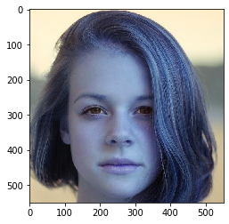
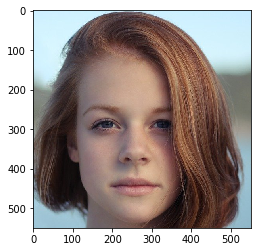

# cropped 切り取り 画像の保存 image[] cv2.imwrite()

スライシングで画像を切り取ることができます。<br>Numpy形式で処理が行えるのでNumpyファイルとして保存すればよく、画像を画像ファイルとして保存することは少ないと思うけれど、ついでなので記載します。


```python
import cv2
import numpy as np
import matplotlib.pyplot as plt
import seaborn as sns
%matplotlib inline
```

## 画像の切り取り


```python
im = cv2.imread('../../data/girl.jpg')
im.shape
```


    (853, 1280, 3)


```python
# crop
crop = im[50:600, 400:950, :]
plt.imshow(crop)
```


    <matplotlib.image.AxesImage at 0x7feed83affd0>





## cv2.imwrite()


```python
# 保存された画像はRGB形式になります
cv2.imwrite('Cropped_girl.png', crop)
```


    True


保存した画像の読み込み


```python
# read again (BGR)
cropped_im = cv2.imread('Cropped_girl.png')
plt.imshow(cropped_im)
```


    <matplotlib.image.AxesImage at 0x7feed604d910>


### RGB形式で保存する

RGB形式に変換した状態で画像を保存すると`BGR`形式で保存されるので注意が必要です。


```python
cropped_im = cv2.imread('Cropped_girl.png')
cropped_im_rgb = cv2.cvtColor(cropped_im, cv2.COLOR_BGR2RGB)
plt.imshow(cropped_im_rgb)
```


    <matplotlib.image.AxesImage at 0x7feed4942ed0>





```python
# save (BGR)
cv2.imwrite('cropped_girl_rgb.png', cropped_im_rgb)
```


    True


```python
cropped_im_rgb_load = cv2.imread('cropped_girl_rgb.png')
# チャネルが入れ替わるので注意
plt.imshow(cropped_im_rgb_load)
```


    <matplotlib.image.AxesImage at 0x7feed4e1abd0>


実際の業務では、Numpyの`np.save()`を使用してNumpy配列として保存することが多いです。
