```python
# plt.show()で可視化されない場合
%matplotlib inline
```

#  CNNを用いた画像認識の基礎

- **[1.1 深層学習画像認識](#1.1-深層学習画像認識)**
    - **[1.1.1 画像認識](#1.1.1-画像認識)**
<br>
- **[1.2 CNN](#1.2-CNN)**
    - **[1.2.1 CNNの概要](#1.2.1-CNNの概要)**
    - **[1.2.2 畳み込み層](#1.2.2-畳み込み層)**
    - **[1.2.3 プーリング層](#1.2.3-プーリング層)**
    - **[1.2.4 CNNの実装](#1.2.4-CNNの実装)**
    - **[1.2.5 CNNを用いた分類（MNIST）](#1.2.5-CNNを用いた分類（MNIST）)**
    - **[1.2.6 CNNを用いた分類（CIFAR-10）](#1.2.6-CNNを用いた分類（cifar10）)**
<br>
- **[1.3 ハイパーパラメータ](#1.3-ハイパーパラメータ)**
    - **[1.3.1 filters （Conv層）](#1.3.1-filters-（Conv層）)**
    - **[1.3.2 kernel_size （Conv層）](#1.3.2-kernel_size-（Conv層）)**
    - **[1.3.3 strides （Conv層）](#1.3.3-strides-（Conv層）)**
    - **[1.3.4 padding （Conv層）](#1.3.4-padding-（Conv層）)**
    - **[1.3.5 pool_size （Pool層）](#1.3.5-pool_size-（Pool層）)**
    - **[1.3.6 strides （Pool層）](#1.3.6-strides-（Pool層）)**
    - **[1.3.7 padding （Pool層）](#1.3.7-padding-（Pool層）)**

***

## 1.1 深層学習画像認識

### 1.1.1 画像認識

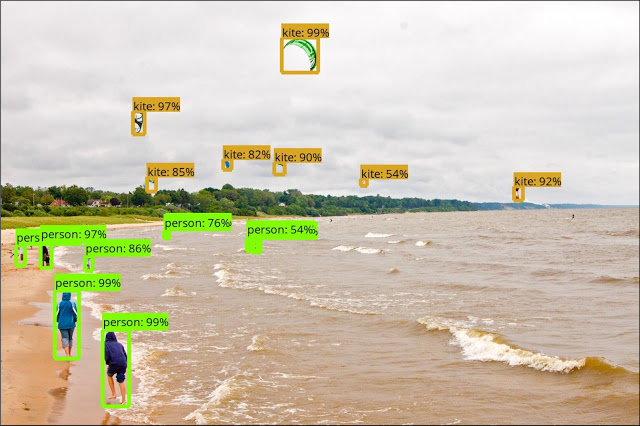

<center>図1.1.1-1 画像の分類、位置の検出 (出典: <a href="https://research.googleblog.com/2017/06/supercharge-your-computer-vision-models.html" target="_blank">[Google: Research Blog]</a>)</center>

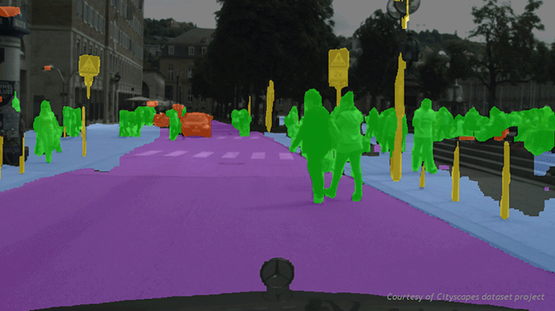

<center>図1.1.1-2 画像の領域分割 (出典: <a href="https://blogs.nvidia.com/blog/2016/01/05/eyes-on-the-road-how-autonomous-cars-understand-what-theyre-seeing/" target="_blank">[NVIDIA: News]</a>)</center>

<b style='color: #AA0000'>画像認識</b>とは、画像や映像に映る文字や顔などといった **「モノ」** や **「特徴」** を検出する技術です。より具体的には、画像の分類や、モノの位置の推定（図1.1.1-1）、画像の領域分割（図1.1.1-２）など様々な認識技術が挙げられます。  
2012年にトロント大学のチームがディープラーニングを用いた高精度の画像認識に関する研究を発表したことで、ディープラーニングに対する関心が一層高まり、現在文字認識、顔認識、自動運転、家庭用ロボットなど様々な分野で実用化が進んでいます。

このコースでは、 ***CNN*** （Convolutional Neural Network、畳み込みニューラルネットワーク）と呼ばれる、画像認識に広く使われるディープニューラルネットワークを用いた深層学習手法を学んでいきます。

<!-- 
画像認識の説明の参考
MathWorks
https://jp.mathworks.com/discovery/image-recognition.html
-->

## 1.2 CNN

### 1.2.1 CNNの概要


<center>図1.2.1-1 CNNの構造 (出典: <a href="http://cs231n.stanford.edu/" target="_blank">[Stanford University: Course Description]</a>)</center>


<center>図1.2.1-2 CNNの全体モデル (出典: <a href="http://deeplearning.net/tutorial/lenet.html#the-full-model-lenet" target="_blank">[theano: Convolutional Neural Networks]</a>)</center>

<b style='color: #AA0000'>CNN</b>（Convolutional Neural Network、畳み込みニューラルネットワーク）とは、人間の脳の視覚野と似た構造を持つ **「畳み込み層」** という層を使って特徴抽出を行うニューラルネットワークです。
全結合層のみのニューラルネットワークと比べ、画像認識等の分野でより高い性能を発揮します。

**畳み込み層** は全結合層と同じように特徴の抽出を行う層ですが、全結合層とは違い2次元のままの画像データを処理し特徴の抽出が行えるため、線や角といった  **2次元的な特徴** を抽出するのに優れています。

またCNNでは多くの場合、畳み込み層と共に **「プーリング層」** という層が使われます。 **プーリング層** で **畳み込み層** から得た情報を縮約し、最終的に画像の分類などを行います。（図1.2.1-1）

次のセッションからは各層について学び、図２のようなCNNモデルを構築して実際に画像の分類を行います。

### 1.2.2 畳み込み層


<center>図1.2.2-1 畳み込み層とプーリング層 (出典: <a href='https://deepage.net/deep_learning/2016/11/07/convolutional_neural_network.html' target='_blank'>[DeepAge]</a>)</center>


   <b style='color: #AA0000'>畳み込み層</b>は、図1.2.2-1のように **入力データの一部分に注目しその部分画像の特徴を調べる層** と言えます。
どのような特徴に注目すれば良いかは、学習用のデータや損失関数等を適切に定めることによって **自動的に** 学習されます。
例えば顔認識をするCNNの場合適切に学習が進むと、 **入力層に近い畳み込み層では線や点といった低次元な概念の特徴に、出力層に近い層では目や鼻といった高次元な概念の特徴に注目するようになります** 。  （実際には、目や鼻のような高次の概念は元の入力画像から直接検出されるのではなく、入力層に近い層で検出された低次な概念の位置的な組み合わせをもとに検出されます。）
注目すべき特徴はプログラム内部では **フィルター(カーネル)** と呼ばれる重み行列として扱われ、各特徴につき一つのフィルターを用います。

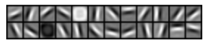

<center>図1.2.2-2 入力層に最も近い畳み込み層の学習済みフィルターの例</center>

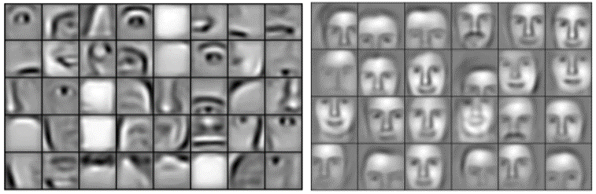

<center>図1.2.2-3 出力層に近い畳み込み層の学習済みフィルターの例（わかりやすく可視化されています）(出典: <a href='https://www.cs.princeton.edu/~rajeshr/papers/icml09-ConvolutionalDeepBeliefNetworks.pdf' target='_blank'>[Convolutional Deep Belief Networks for Scalable Unsupervised Learning of Hierarchical Representations]</a>)</center>

図1.2.2-4は、9×9×3（縦×横×チャンネル数(R,G,Bの3チャンネル)）の画像に対し、3×3×3（縦x横xチャンネル数）のフィルターで畳み込みを行っている様子です。<br>1つの3×3×3のフィルターを使って新しく4×4×1の特徴マップ（白黒画像のようなもの）を作っています。<br>
さらにそれぞれ異なるいくつかのフィルターを使って、全部でN枚の4×4×1のマップを作ります。<br>
全体としてこの畳み込み層では、9×9×3の画像が、4×4×Nの特徴マップに変換されます。<br>

（このセッションの以下の問題も含め、畳み込み層の説明として2次元のフィルターが例として使われることが多いですが、実際には下の図のように3次元のフィルターが用いられることが多いです。）

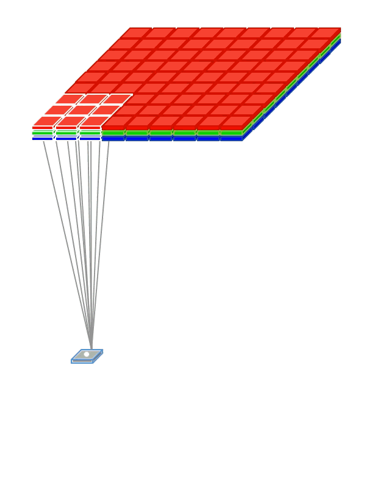 

<center>図1.2.2-4 畳み込みの様子 (出典: <a href='https://cntk.ai/pythondocs/CNTK_103D_MNIST_ConvolutionalNeuralNetwork.html' target='_blank'>[Python API for CNTK]</a>)</center>

#### 問題

- ここからは、畳み込み層やプーリング層で具体的にどのようなの処理が行われるのかを見ていくために、numpyで実装されたコードを使いアルゴリズムの中身を理解するため、Keras+TensorFlowなどのライブラリを使わずに実装してみます。


- 上の円の画像（10x10サイズのモノクロ画像）に対して以下のようなフィルターを用いて畳み込みを行い、縦、横、斜めの直線を検出します。

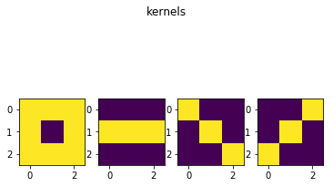

```python
import numpy as np
import matplotlib.pyplot as plt
import urllib.request

# ごくシンプルな畳み込み層を定義しています
class Conv:
    # シンプルな例を考えるため、Wは3x3で固定し、後のセッションで扱うstridesやpaddingは考えません
    def __init__(self, W):
        self.W = W
    # Forward Propagation （順伝播）の略
    def f_prop(self, X):
        out = np.zeros((X.shape[0]-2, X.shape[1]-2))
        for i in range(out.shape[0]):
            for j in range(out.shape[1]):
                x = X[i:i+3, j:j+3]
                # 要素ごとの積の合計をとる
                out[i,j] = np.dot(self.W.flatten(), x.flatten())
        return out

X = np.load('./circle.npy')

plt.imshow(X)
plt.title("base image", fontsize=12)
plt.show()

# カーネルを適切に設定してください
W1 = np.array([[1,1,1],
               [1,0,1],
               [1,1,1]])
W2 = np.array([[0,0,0],
               [1,1,1],
               [0,0,0]])
W3 = np.array([[1,0,0],
               [0,1,0],
               [0,0,1]])
W4 = np.array([[0,0,1],
               [0,1,0],
               [1,0,0]])

plt.subplot(1,4,1); plt.imshow(W1)
plt.subplot(1,4,2); plt.imshow(W2)
plt.subplot(1,4,3); plt.imshow(W3)
plt.subplot(1,4,4); plt.imshow(W4)
plt.suptitle("kernels", fontsize=12)
plt.show()

# 畳み込み
conv1 = Conv(W1); C1 = conv1.f_prop(X)
conv2 = Conv(W2); C2 = conv2.f_prop(X)
conv3 = Conv(W3); C3 = conv3.f_prop(X)
conv4 = Conv(W4); C4 = conv4.f_prop(X)

plt.subplot(1,4,1); plt.imshow(C1)
plt.subplot(1,4,2); plt.imshow(C2)
plt.subplot(1,4,3); plt.imshow(C3)
plt.subplot(1,4,4); plt.imshow(C4)
plt.suptitle("convolution results", fontsize=12)
plt.show()
```


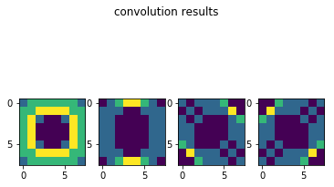


#### ヒント

- 畳み込み結果の画像を見ると、特徴が検出された場所が明るくなっていることがわかります。

***

### 1.2.3 プーリング層


<center>図1.2.3-1 畳み込み層とプーリング層 (出典: <a href="https://deepage.net/deep_learning/2016/11/07/convolutional_neural_network.html" target="_blank">[DeepAge]</a>)</center>
　　　　　　 　　　　　　　　　　　　　　　　　　

 <b style='color: #AA0000'>プーリング層</b>は図1のように **畳み込み層の出力を縮約しデータの量を削減する層** と言えます。  
図2のように、特徴マップの部分区間の最大値を取ったり（ **Maxプーリング** ）、あるいは平均を取ったり（ **Averageプーリング** ）することでデータの圧縮を実現します。

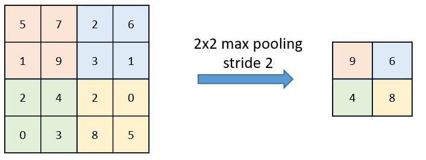

<center>図1.2.3-2 Maxプーリング　(出典: <a href="https://cntk.ai/pythondocs/CNTK_103D_MNIST_ConvolutionalNeuralNetwork.html " target="_blank">[Python API for CNTK]</a>)</center>

「畳み込み層」セッションで扱った畳み込みを行うと、画像の中の特徴量の分布を調べることができますが、同じ特徴は同じような場所にかたまって分布していることが多く、また時に特徴が見つからない場所が広く分布していることもあるなど、畳み込み層から出力される特徴マップにはそのデータの大きさに対して無駄が多くあります。
プーリングはそのようなデータの無駄を削減し、情報の損失を抑えながらデータを圧縮することができます。
その反面、プーリングによって細かい位置情報は削除されてしまいますが、逆にこれは、プーリング層によって抽出された特徴が元画像の平行移動などでも影響を受けないようなロバスト性を与える役割を果たします。例えば、写真に映る手書き数字の分類を行う場合、数字の位置は重要ではありませんが、プーリングによってそのようなあまり重要でない情報を削除し、入力画像に対する被検出物の位置の変化に強いモデルを構築することができます。

下の図は、5×5（縦×横）の特徴マップに対し、3×3（縦×横）のごとにプーリングを行っている様子です。


<div style="text-align: center;">

<center>図1.2.3-3 Maxプーリング</center>
</div>

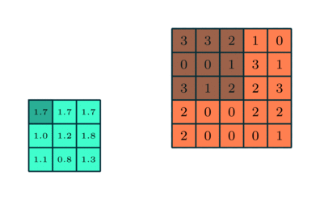

<div style="text-align: center;">

<center>図1.2.3-4 Averageプーリング</center>
</div>

<center>(出典: <a href="https://cntk.ai/pythondocs/CNTK_103D_MNIST_ConvolutionalNeuralNetwork.html " target="_blank">[Python API for CNTK]</a>)</center>


#### 問題

- さて、今回もKeras+TensorFlowを用いずプーリング層を定義し、どのようにプーリングが行われるのか実装しながら理解していきましょう。
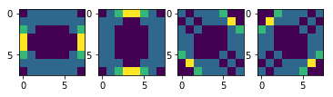
- この特徴マップに対してMaxプーリングを行います。正しくMaxプーリングが行われると以下のような特徴マップに変換されます。（後のセッションで扱ういくつかのプーリングのパラメータは、コード中で適当に定めています）
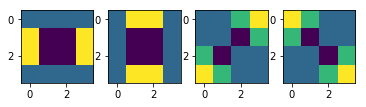
- ヒントを参考にコード中の `Pool` クラスの空欄を適切に埋めて、正しくMaxプーリングを実行してください。


#### ヒント

- `X[i*l:(i+1)*l, j*l:(j+1)*l]` は、特徴マップの部分区間を表しています。
- 行列の最大値（部分区間の最大値）は、 `np.max()` で取得できます。

#### 例


```python
import numpy as np
import matplotlib.pyplot as plt
import urllib.request

# ごくシンプルな畳み込み層を定義
class Conv:
    # シンプルな例を考えるため、Wは3x3で固定し、後のセッションで扱うstridesやpaddingは考えない
    def __init__(self, W):
        self.W = W
    def f_prop(self, X):
        out = np.zeros((X.shape[0]-2, X.shape[1]-2))
        for i in range(out.shape[0]):
            for j in range(out.shape[1]):
                x = X[i:i+3, j:j+3]
                out[i,j] = np.dot(self.W.flatten(), x.flatten())
        return out

# ごくシンプルなプーリング層を定義
class Pool:
    # シンプルな例を考えるため、stridesやpaddingは考えない
    def __init__(self, l):
        self.l = l
    def f_prop(self, X):
        l = self.l
        out = np.zeros((X.shape[0]//self.l, X.shape[1]//self.l))
        for i in range(out.shape[0]):
            for j in range(out.shape[1]):
                out[i,j] = np.max(X[i*l:(i+1)*l, j*l:(j+1)*l])
        return out

X = np.load('./circle.npy')

plt.imshow(X)
plt.title('base image', fontsize=12)
plt.show()

# カーネル
W1 = np.array([[0,1,0],
              [0,1,0],
              [0,1,0]])
W2 = np.array([[0,0,0],
              [1,1,1],
              [0,0,0]])
W3 = np.array([[1,0,0],
              [0,1,0],
              [0,0,1]])
W4 = np.array([[0,0,1],
              [0,1,0],
              [1,0,0]])

# 畳み込み
conv1 = Conv(W1); C1 = conv1.f_prop(X)
conv2 = Conv(W2); C2 = conv2.f_prop(X)
conv3 = Conv(W3); C3 = conv3.f_prop(X)
conv4 = Conv(W4); C4 = conv4.f_prop(X)

plt.subplot(1,4,1); plt.imshow(C1)
plt.subplot(1,4,2); plt.imshow(C2)
plt.subplot(1,4,3); plt.imshow(C3)
plt.subplot(1,4,4); plt.imshow(C4)
plt.suptitle('convolution results', fontsize=12)
plt.show()

# プーリング
pool = Pool(2)
P1 = pool.f_prop(C1)
P2 = pool.f_prop(C2)
P3 = pool.f_prop(C3)
P4 = pool.f_prop(C4)

plt.subplot(1,4,1); plt.imshow(P1)
plt.subplot(1,4,2); plt.imshow(P2)
plt.subplot(1,4,3); plt.imshow(P3)
plt.subplot(1,4,4); plt.imshow(P4)
plt.suptitle('pooling results', fontsize=12)
plt.show()
```


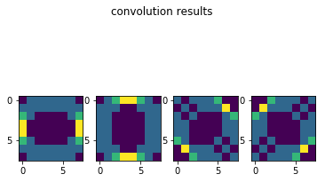


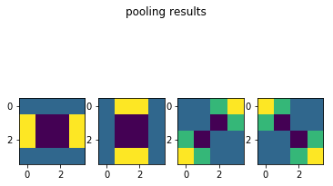


***

### 1.2.4 CNNの実装


<div style="text-align: center;">
図1.2.4 CNNの層の実装
</div>

さて、今回はKeras+TensorFlowを使ってCNNを実装します。
Kerasでは、まずモデルを管理する **インスタンス** を作り、addメソッドで層を一層ずつ定義していきます。

**インスタンス** を作ります。
```python
model = Sequential()
```
以下のようにaddメソッドを用いてモデルの層を一層ずつ追加します。
全結合層は以下のように定義するのでした。
```python
model.add(Dense(128))
```
**畳み込み層** は以下のようにして追加します。パラメーターは後のセッションで学びます。
```python
model.add(Conv2D(filters=64, kernel_size=(3, 3)))
```
**プーリング層** は以下のようにして追加します。パラメーターは後のセッションで学びます。
```python
model.add(MaxPooling2D(pool_size=(2, 2)))
```
最後に **コンパイル** を行い、ニューラルネットワークモデルの生成が終了します。
```python
model.compile(optimizer=sgd, loss="categorical_crossentropy", metrics=["accuracy"])
```
以下のようにすると、問題にあるようなモデル構造の表が出力されます。
```python
model.summary()
```

#### 問題

- 下図のネットワークモデルを実装します。
 - Conv2D(input_shape=(28, 28, 1), filters=32, kernel_size=(2, 2), strides=(1, 1), padding="same")
 - MaxPooling2D(pool_size=(2, 2), strides=(1, 1), padding="same")
 - Conv2D(filters=32, kernel_size=(2, 2), strides=(1, 1), padding="same")
 - MaxPooling2D(pool_size=(2, 2), strides=(1,1))

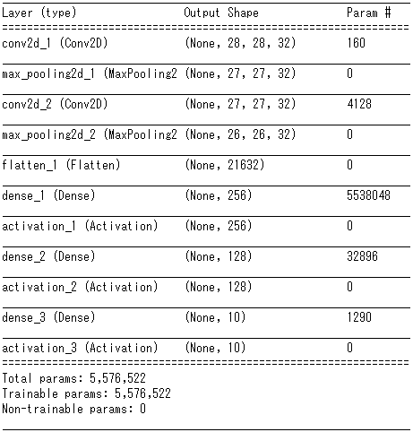

<!--
import json
 
json_string = model.to_json()
j = json.loads(json_string)

for i in range(len(j["config"])): del j["config"][i]["config"]["name"]
j["config"]
-->


#### ヒント

- `model.summary()` でモデルの構造を出力しています。この出力が問題の図と一致するように、モデルを定義します。

#### 例


```python
from keras.layers import Activation, Conv2D, Dense, Flatten, MaxPooling2D
from keras.models import Sequential, load_model
from keras.utils.np_utils import to_categorical

# モデルの定義
model = Sequential()
model.add(Conv2D(input_shape=(28, 28, 1), 
                 filters=32,
                 kernel_size=(2, 2), 
                 strides=(1, 1), 
                 padding="same"))
model.add(MaxPooling2D(pool_size=(2, 2), 
                       strides=(1,1)))
model.add(Conv2D(filters=32, 
                 kernel_size=(2, 2), 
                 strides=(1, 1), 
                 padding="same"))
model.add(MaxPooling2D(pool_size=(2, 2), 
                       strides=(1,1)))
model.add(Flatten())
model.add(Dense(256))
model.add(Activation('sigmoid'))
model.add(Dense(128))
model.add(Activation('sigmoid'))
model.add(Dense(10))
model.add(Activation('softmax'))

model.summary() 
```

    _________________________________________________________________
    Layer (type)                 Output Shape              Param #   
    =================================================================
    conv2d_5 (Conv2D)            (None, 28, 28, 32)        160       
    _________________________________________________________________
    max_pooling2d_5 (MaxPooling2 (None, 27, 27, 32)        0         
    _________________________________________________________________
    conv2d_6 (Conv2D)            (None, 27, 27, 32)        4128      
    _________________________________________________________________
    max_pooling2d_6 (MaxPooling2 (None, 26, 26, 32)        0         
    _________________________________________________________________
    flatten_3 (Flatten)          (None, 21632)             0         
    _________________________________________________________________
    dense_7 (Dense)              (None, 256)               5538048   
    _________________________________________________________________
    activation_7 (Activation)    (None, 256)               0         
    _________________________________________________________________
    dense_8 (Dense)              (None, 128)               32896     
    _________________________________________________________________
    activation_8 (Activation)    (None, 128)               0         
    _________________________________________________________________
    dense_9 (Dense)              (None, 10)                1290      
    _________________________________________________________________
    activation_9 (Activation)    (None, 10)                0         
    =================================================================
    Total params: 5,576,522
    Trainable params: 5,576,522
    Non-trainable params: 0
    _________________________________________________________________
    

***

### 1.2.5 CNNを用いた分類（MNIST）

<b style='color: #AA0000'>MNIST (エムニスト)</b>　とは、下図のような手書き数字のデータセットのことです。
各画像はサイズが28ピクセルx28ピクセルで1チャンネル（モノクロ）のデータとなっており、それぞれ0~9のクラスラベルがつけられています。

CNNを使ってMNISTデータセットの分類を行います。

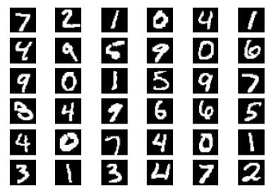

<div style="text-align: center;">
図1.2.5 MNIST(出典: <a href="http://corochann.com/mnist-inference-code-1202.html" target="_blank">[MNIST]</a>)
</div>

<!--
コード参考
keras/examples/mnist_cnn.py
-->

#### 問題

- 空欄に次の層を追加して、Kerasで下図のような構造のモデルを構築し、実行します。
- ただし、各層のパラメータは以下に従ってください。
 - Conv2D(filters=32, kernel_size=(3, 3), input_shape=(28,28,1))
 - Activation('relu')
 - Conv2D(filters=64, kernel_size=(3, 3))
 - Activation('relu')
 - MaxPooling2D(pool_size=(2, 2))
 - Dropout(0.25)
 - Flatten()
 - Dense(128)
 - Activation('relu')
 - Dropout(0.5)
 - Dense(10)

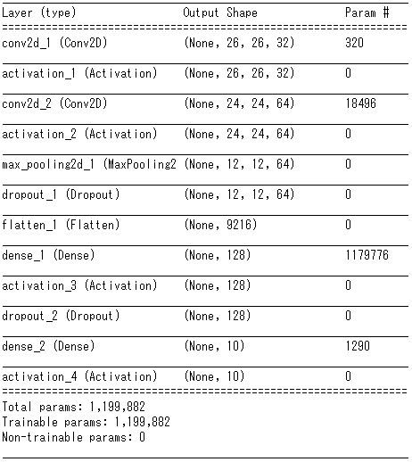

<!--
# モデル構造の出力
plot_model(model, "model_mnist.png", show_layer_names=False)
# モデル構造の可視化
image = plt.imread("model_mnist.png")
plt.figure(dpi=150)
plt.imshow(image)
plt.show()
-->

model = Sequential()
model.add(Conv2D(filters=32, kernel_size=(3, 3),input_shape=(28,28,1)))
model.add(Activation('relu'))
model.add(Conv2D(filters=64, kernel_size=(3, 3)))
model.add(Activation('relu'))
model.add(MaxPooling2D(pool_size=(2, 2)))
model.add(Dropout(0.25))
model.add(Flatten())
model.add(Dense(128))
model.add(Activation('relu'))
model.add(Dropout(0.5))
model.add(Dense(10))
model.add(Activation('softmax'))


#### 例


```python
from keras.datasets import mnist
from keras.layers import Dense, Dropout, Flatten, Activation
from keras.layers import Conv2D, MaxPooling2D
from keras.models import Sequential, load_model
from keras.utils.np_utils import to_categorical
from keras.utils.vis_utils import plot_model
import numpy as np
import matplotlib.pyplot as plt

# データのロード
(X_train, y_train), (X_test, y_test) = mnist.load_data()

# 今回は全データのうち、学習には300、テストには100個のデータを使用します。
# Convレイヤーは4次元配列を受け取ります。（バッチサイズx縦x横xチャンネル数）
# MNISTのデータはRGB画像ではなくもともと3次元のデータとなっているので予め4次元に変換します。
X_train = X_train[:300].reshape(-1, 28, 28, 1)
X_test = X_test[:100].reshape(-1, 28, 28, 1)
y_train = to_categorical(y_train)[:300]
y_test = to_categorical(y_test)[:100]

# モデルの定義
model = Sequential()
model.add(Conv2D(filters=32, kernel_size=(3, 3),input_shape=(28,28,1)))
model.add(Activation('relu'))
model.add(Conv2D(filters=64, kernel_size=(3, 3)))
model.add(Activation('relu'))
model.add(MaxPooling2D(pool_size=(2, 2)))
model.add(Dropout(0.25))
model.add(Flatten())
model.add(Dense(128))
model.add(Activation('relu'))
model.add(Dropout(0.5))
model.add(Dense(10))
model.add(Activation('softmax'))


model.compile(loss='categorical_crossentropy',
              optimizer='adadelta',
              metrics=['accuracy'])

model.fit(X_train, y_train,
          batch_size=128,
          epochs=1,
          verbose=1,
          validation_data=(X_test, y_test))

# 精度の評価
scores = model.evaluate(X_test, y_test, verbose=1)
print('Test loss:', scores[0])
print('Test accuracy:', scores[1])

# データの可視化（テストデータの先頭の10枚）
for i in range(10):
    plt.subplot(2, 5, i+1)
    plt.imshow(X_test[i].reshape((28,28)), 'gray')
plt.suptitle("10 images of test data",fontsize=20)
plt.show()

# 予測（テストデータの先頭の10枚）
pred = np.argmax(model.predict(X_test[0:10]), axis=1)
print(pred)

model.summary()
```

    WARNING:tensorflow:From C:\Users\user\Anaconda3\lib\site-packages\keras\backend\tensorflow_backend.py:3445: calling dropout (from tensorflow.python.ops.nn_ops) with keep_prob is deprecated and will be removed in a future version.
    Instructions for updating:
    Please use `rate` instead of `keep_prob`. Rate should be set to `rate = 1 - keep_prob`.
    WARNING:tensorflow:From C:\Users\user\Anaconda3\lib\site-packages\tensorflow\python\ops\math_ops.py:3066: to_int32 (from tensorflow.python.ops.math_ops) is deprecated and will be removed in a future version.
    Instructions for updating:
    Use tf.cast instead.
    Train on 300 samples, validate on 100 samples
    Epoch 1/1
    300/300 [==============================] - 3s 9ms/step - loss: 2.3635 - acc: 0.0933 - val_loss: 2.3512 - val_acc: 0.1100
    100/100 [==============================] - 0s 470us/step
    Test loss: 2.3511501693725587
    Test accuracy: 0.11
    


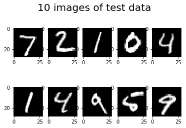


    [9 9 9 9 9 9 9 9 9 9]
    _________________________________________________________________
    Layer (type)                 Output Shape              Param #   
    =================================================================
    conv2d_7 (Conv2D)            (None, 26, 26, 32)        320       
    _________________________________________________________________
    activation_10 (Activation)   (None, 26, 26, 32)        0         
    _________________________________________________________________
    conv2d_8 (Conv2D)            (None, 24, 24, 64)        18496     
    _________________________________________________________________
    activation_11 (Activation)   (None, 24, 24, 64)        0         
    _________________________________________________________________
    max_pooling2d_7 (MaxPooling2 (None, 12, 12, 64)        0         
    _________________________________________________________________
    dropout_1 (Dropout)          (None, 12, 12, 64)        0         
    _________________________________________________________________
    flatten_4 (Flatten)          (None, 9216)              0         
    _________________________________________________________________
    dense_10 (Dense)             (None, 128)               1179776   
    _________________________________________________________________
    activation_12 (Activation)   (None, 128)               0         
    _________________________________________________________________
    dropout_2 (Dropout)          (None, 128)               0         
    _________________________________________________________________
    dense_11 (Dense)             (None, 10)                1290      
    _________________________________________________________________
    activation_13 (Activation)   (None, 10)                0         
    _________________________________________________________________
    activation_14 (Activation)   (None, 10)                0         
    =================================================================
    Total params: 1,199,882
    Trainable params: 1,199,882
    Non-trainable params: 0
    _________________________________________________________________

***

### 1.2.6 CNNを用いた分類（CIFAR-10） 

<b style='color: #AA0000'>CIFAR-10 (サイファー・テン)</b>とは、下の写真のように10種類のオブジェクトが映った画像のデータセットです。
各画像はサイズが32ピクセル×32ピクセルで3チャンネル（R,G,B）のデータとなっており、それぞれ0~9のクラスラベルがつけられています。各クラスラベルに対応するオブジェクトは以下の通りです。

- 0: 飛行機
- 1: 自動車
- 2: 鳥
- 3: 猫
- 4: 鹿
- 5: 犬
- 6: 蛙
- 7: 馬
- 8: 船
- 9: トラック

CNNを使ってCIFAR-10データセットの分類を行っていきしょう。

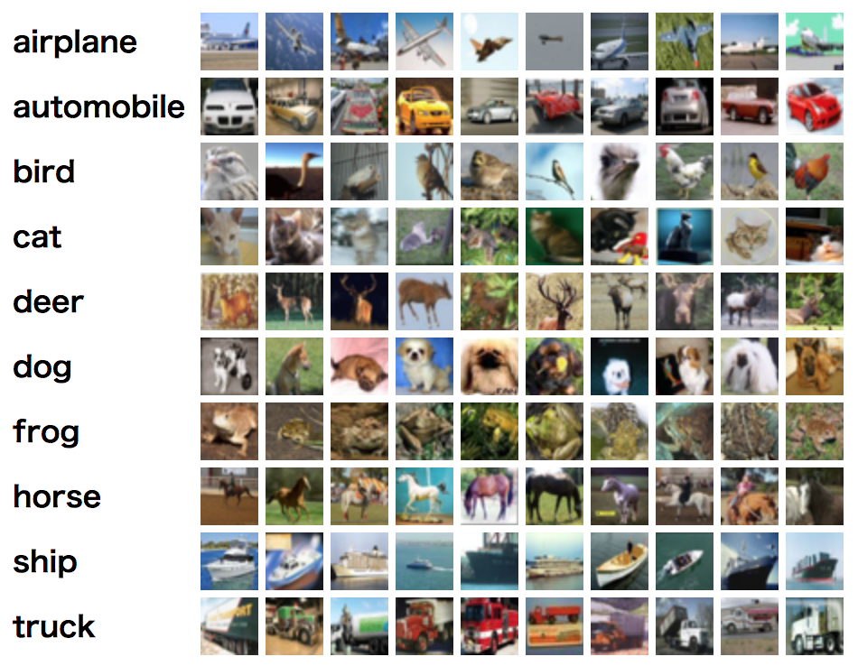 

<center>(出典: <a href="https://www.cs.toronto.edu/~kriz/cifar.html" target="_blank">[The CIFAR-10 dataset]</a>)</center>


<!--
モデル構造の参考
GitHub keras/examples/cifar10_cnn.py
-->

#### 問題

- 空欄に次の層を追加して、Kerasで下図のような構造のモデルを構築し、実行します。
- ただし、各層のパラメータは以下に従います。
 - Conv2D(64, (3, 3), padding='same')
 - Activation('relu')
 - Conv2D(64, (3, 3))
 - Activation('relu')
 - MaxPooling2D(pool_size=(2, 2))
 - Dropout(0.25)
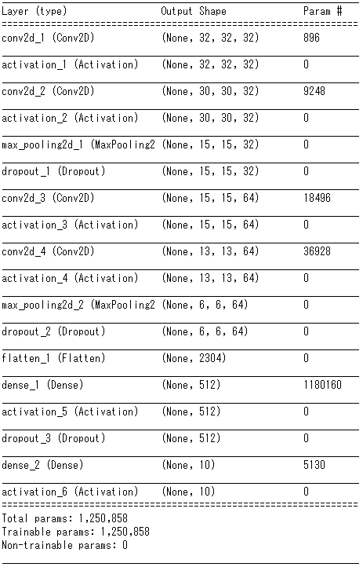

#### 例

```python
import keras
from keras.datasets import cifar10
from keras.layers import Activation, Conv2D, Dense, Dropout, Flatten, MaxPooling2D
from keras.models import Sequential, load_model
from keras.utils.np_utils import to_categorical
import numpy as np
import matplotlib.pyplot as plt

# データのロード
(X_train, y_train), (X_test, y_test) = cifar10.load_data()

# 今回は全データのうち、学習には300、テストには100個のデータを使用します
X_train = X_train[:300]
X_test = X_test[:100]
y_train = to_categorical(y_train)[:300]
y_test = to_categorical(y_test)[:100]


# モデルの定義
model = Sequential()
model.add(Conv2D(32, (3, 3), padding='same',
                 input_shape=X_train.shape[1:]))
model.add(Activation('relu'))
model.add(Conv2D(32, (3, 3)))
model.add(Activation('relu'))
model.add(MaxPooling2D(pool_size=(2, 2)))
model.add(Dropout(0.25))

model.add(Conv2D(64, (3, 3), padding='same'))
model.add(Activation('relu'))
model.add(Conv2D(64, (3, 3)))
model.add(Activation('relu'))
model.add(MaxPooling2D(pool_size=(2, 2)))
model.add(Dropout(0.25))


model.add(Flatten())
model.add(Dense(512))
model.add(Activation('relu'))
model.add(Dropout(0.5))
model.add(Dense(10))
model.add(Activation('softmax'))

# コンパイル
opt = keras.optimizers.rmsprop(lr=0.0001, decay=1e-6)
model.compile(loss='categorical_crossentropy',
              optimizer=opt,
              metrics=['accuracy'])

# 学習に数分かかるので、あらかじめ学習させて得た重みをロードします
# model.load_weights('param_cifar10.hdf5')

# 学習
model.fit(X_train, y_train, batch_size=32, epochs=1)

# 重みの保存をする場合には以下を使います。ここでは実行できません。
# model.save_weights('param_cifar10.hdf5')

# 精度の評価
scores = model.evaluate(X_test, y_test, verbose=1)
print('Test loss:', scores[0])
print('Test accuracy:', scores[1])

# データの可視化（テストデータの先頭の10枚）
for i in range(10):
    plt.subplot(2, 5, i+1)
    plt.imshow(X_test[i])
plt.suptitle("10 images of test data",fontsize=20)
plt.show()

# 予測（テストデータの先頭の10枚）
pred = np.argmax(model.predict(X_test[0:10]), axis=1)
print(pred)

model.summary()
```

    Epoch 1/1
    300/300 [==============================] - 2s 7ms/step - loss: 14.3393 - acc: 0.0900: 0s - loss: 13.9327 - acc: 
    100/100 [==============================] - 0s 3ms/step
    Test loss: 14.506285705566405
    Test accuracy: 0.1
    


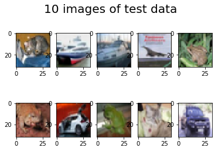


    [3 3 3 3 3 3 3 3 3 3]
    _________________________________________________________________
    Layer (type)                 Output Shape              Param #   
    =================================================================
    conv2d_13 (Conv2D)           (None, 32, 32, 32)        896       
    _________________________________________________________________
    activation_19 (Activation)   (None, 32, 32, 32)        0         
    _________________________________________________________________
    conv2d_14 (Conv2D)           (None, 30, 30, 32)        9248      
    _________________________________________________________________
    activation_20 (Activation)   (None, 30, 30, 32)        0         
    _________________________________________________________________
    max_pooling2d_7 (MaxPooling2 (None, 15, 15, 32)        0         
    _________________________________________________________________
    dropout_10 (Dropout)         (None, 15, 15, 32)        0         
    _________________________________________________________________
    conv2d_15 (Conv2D)           (None, 15, 15, 64)        18496     
    _________________________________________________________________
    activation_21 (Activation)   (None, 15, 15, 64)        0         
    _________________________________________________________________
    conv2d_16 (Conv2D)           (None, 13, 13, 64)        36928     
    _________________________________________________________________
    activation_22 (Activation)   (None, 13, 13, 64)        0         
    _________________________________________________________________
    max_pooling2d_8 (MaxPooling2 (None, 6, 6, 64)          0         
    _________________________________________________________________
    dropout_11 (Dropout)         (None, 6, 6, 64)          0         
    _________________________________________________________________
    flatten_4 (Flatten)          (None, 2304)              0         
    _________________________________________________________________
    dense_7 (Dense)              (None, 512)               1180160   
    _________________________________________________________________
    activation_23 (Activation)   (None, 512)               0         
    _________________________________________________________________
    dropout_12 (Dropout)         (None, 512)               0         
    _________________________________________________________________
    dense_8 (Dense)              (None, 10)                5130      
    _________________________________________________________________
    activation_24 (Activation)   (None, 10)                0         
    =================================================================
    Total params: 1,250,858
    Trainable params: 1,250,858
    Non-trainable params: 0
    _________________________________________________________________


***

## 1.3 ハイパーパラメータ

### 1.3.1 filters （Conv層）

畳み込み層の `filters` パラメータは、 **生成する特徴マップの数** つまり **抽出する特徴の種類** を指定します。

下の図では、1回目の畳み込み層では `filters` は20、2回目の畳み込み層でも `filters` は20となります。


<div style="text-align: center;">

<center>図1.3.1 畳み込み層とプーリング層 (出典: <a href="https://deepage.net/deep_learning/2016/11/07/convolutional_neural_network.html" target="_blank">[DeepAge]</a>)</center>

</div>


`filters` が小さすぎて必要な特徴が抽出できないとうまく学習を進めることができませんが、逆に大きすぎると過学習しやすくなるので注意してください。

#### 問題

- 今回もアルゴリズムの中身を理解するため、Keras+TensorFlowを用いずに実装します。
- `畳み込みの実行` の部分を正しく埋めて、`filters=10` の畳み込みを行ってください。
- またこのとき、似た特徴マップが多く作られてしまうことを確認してください


```python
import numpy as np
import matplotlib.pyplot as plt

# ごくシンプルな畳み込み層を定義しています。
# 1チャンネルの画像の畳み込みのみを想定しています。
# シンプルな例を考えるため、カーネルは3x3で固定し、stridesやpaddingは考えません。
class Conv:
    def __init__(self, filters):
        self.filters = filters
        self.W = np.random.rand(filters,3,3)
    def f_prop(self, X):
        out = np.zeros((filters, X.shape[0]-2, X.shape[1]-2))
        for k in range(self.filters):
            for i in range(out[0].shape[0]):
                for j in range(out[0].shape[1]):
                    x = X[i:i+3, j:j+3]
                    out[k,i,j] = np.dot(self.W[k].flatten(), x.flatten())
        return out

X = np.load('./5100_cnn_data/circle.npy')

filters=10

# 畳み込み層の生成
conv = Conv(filters=filters)

# 畳み込みの実行
C = conv.f_prop(X)

# --------------------------------------------------------------
# 以下可視化
# --------------------------------------------------------------

plt.imshow(X)
plt.title('base image', fontsize=12)
plt.show()

plt.figure(figsize=(5,2))
for i in range(filters):
    plt.subplot(2,filters/2,i+1)
    ax = plt.gca() # get current axis
    ax.tick_params(labelbottom="off", labelleft="off", bottom="off", left="off") # 軸の削除
    plt.imshow(conv.W[i])
plt.suptitle('kernels', fontsize=12)
plt.show()

plt.figure(figsize=(5,2))
for i in range(filters):
    plt.subplot(2,filters/2,i+1)
    ax = plt.gca() # get current axis
    ax.tick_params(labelbottom="off", labelleft="off", bottom="off", left="off") # 軸の削除
    plt.imshow(C[i])
plt.suptitle('convolution results', fontsize=12)
plt.show()
```


    C:\Users\user\Anaconda3\lib\site-packages\matplotlib\cbook\deprecation.py:107: MatplotlibDeprecationWarning: Passing one of 'on', 'true', 'off', 'false' as a boolean is deprecated; use an actual boolean (True/False) instead.
      warnings.warn(message, mplDeprecation, stacklevel=1)
    


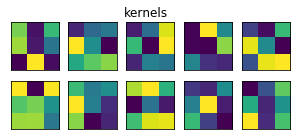


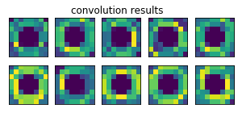


- `conv.f_prop(X)` として `X` に畳み込みを行います。

***

### 1.3.2 kernel_size （Conv層）

畳み込み層の `kernel_size` パラメータは、 **カーネル(畳み込みに使用する重み行列)の大きさ** を指定します。<br>
前述通り、入力データとカーネルの積の集合によって特徴マップが決定します。<br>
下の図は3×3のカーネルです。それぞれの要素には最適な畳み込みを行うための任意の数字が与えられます。<br>

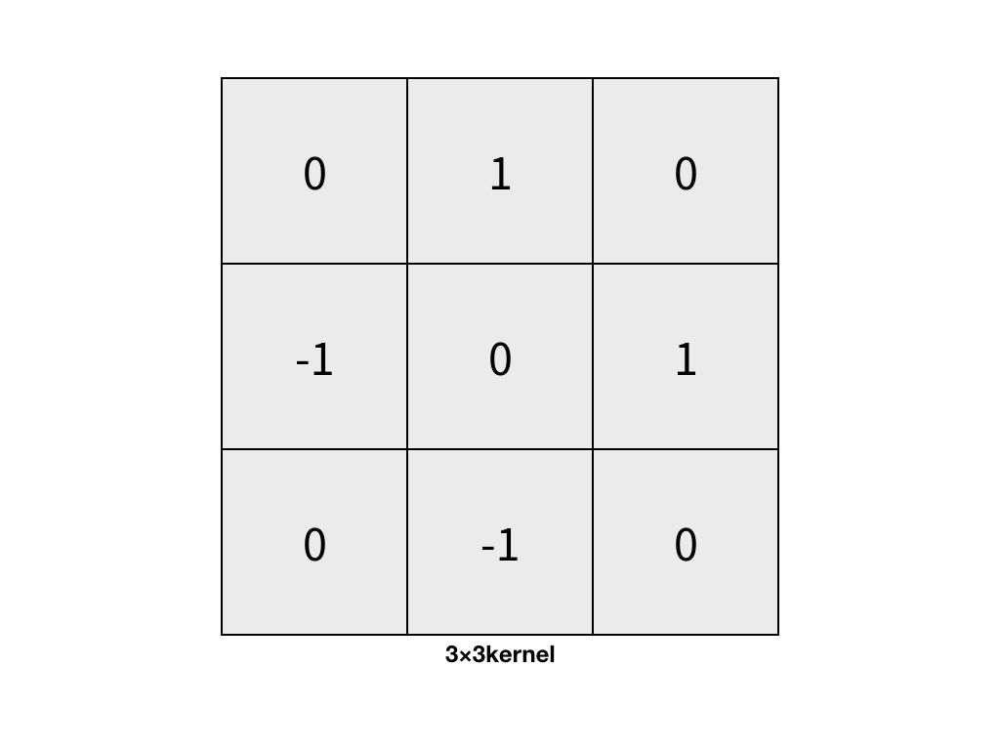


また、下の図では、1回目の畳み込み層では `kernel_size` は5×5となります。


<div style="text-align: center;">

<center>図1.3.2 畳み込み層とプーリング層 (出典: <a href="https://deepage.net/deep_learning/2016/11/07/convolutional_neural_network.html" target="_blank">[DeepAge]</a>)</center>

</div>

`kernel_size` が小さすぎると、ごく小さな特徴も検出できなくなりうまく学習を進めることができません。逆に大きすぎると、本来小さな特徴の集まりとして検出されるはずだった大きな特徴まで検出されてしまうことになり、階層構造をとらえることが得意なニューラルネットワークモデルの強みを生かせておらず非効率なモデルになってしまいます。

#### 問題

- 今回もアルゴリズムの中身を理解するため、Keras+TensorFlowを用いずに実装してみましょう。
- `畳み込み２` の部分を正しく埋めて、`kernel_size=(6,6)` の畳み込みを行ってください。
- またこの時、カーネルサイズが大き過ぎると何を検出したのかよくわからないぼやけた特徴マップが検出されてしまうことを確認しましょう。

#### 例


```python
import numpy as np
import matplotlib.pyplot as plt

# ごくシンプルな畳み込み層を定義しています。
# 1チャンネルの画像の畳み込みのみを想定しています。
# シンプルな例を考えるため、stridesやpaddingは考えません。
class Conv:
    def __init__(self, filters, kernel_size):
        self.filters = filters
        self.kernel_size = kernel_size
        self.W = np.random.rand(filters, kernel_size[0], kernel_size[1])
    def f_prop(self, X):
        k_h, k_w = self.kernel_size
        out = np.zeros((filters, X.shape[0]-k_h+1, X.shape[1]-k_w+1))
        for k in range(self.filters):
            for i in range(out[0].shape[0]):
                for j in range(out[0].shape[1]):
                    x = X[i:i+k_h, j:j+k_w]
                    out[k,i,j] = np.dot(self.W[k].flatten(), x.flatten())
        return out

X = np.load('./5100_cnn_data/circle.npy')

# 畳み込み１
filters = 4
kernel_size = (3,3)

# 畳み込み層の生成
conv1 = Conv(filters=filters, kernel_size=kernel_size)

# 畳み込みの実行
C1 = conv1.f_prop(X)

# 畳み込み２
filters = 4
kernel_size = (6,6)

# 畳み込み層の生成
conv2 = Conv(filters=filters, kernel_size=kernel_size)

# 畳み込みの実行
C2 = conv2.f_prop(X)

# 以下可視化コード

plt.imshow(X)
plt.title('base image', fontsize=12)
plt.show()

plt.figure(figsize=(10,1))
for i in range(filters):
    plt.subplot(1,filters,i+1)
    ax = plt.gca() # get current axis
    ax.tick_params(labelbottom="off", labelleft="off", bottom="off", left="off") # 軸の削除
    plt.imshow(conv1.W[i])
plt.suptitle('kernel visualization', fontsize=12)
plt.show()

plt.figure(figsize=(10,1))
for i in range(filters):
    plt.subplot(1,filters,i+1)
    ax = plt.gca() # get current axis
    ax.tick_params(labelbottom="off", labelleft="off", bottom="off", left="off") # 軸の削除
    plt.imshow(C1[i])
plt.suptitle('convolution results 1', fontsize=12)
plt.show()

plt.figure(figsize=(10,1))
for i in range(filters):
    plt.subplot(1,filters,i+1)
    ax = plt.gca() # get current axis
    ax.tick_params(labelbottom="off", labelleft="off", bottom="off", left="off") # 軸の削除
    plt.imshow(conv2.W[i])
plt.suptitle('kernel visualization', fontsize=12)
plt.show()

plt.figure(figsize=(10,1))
for i in range(filters):
    plt.subplot(1,filters,i+1)
    ax = plt.gca() # get current axis
    ax.tick_params(labelbottom="off", labelleft="off", bottom="off", left="off") # 軸の削除
    plt.imshow(C2[i])
plt.suptitle('convolution results 2', fontsize=12)
plt.show()
```


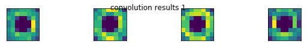

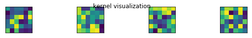

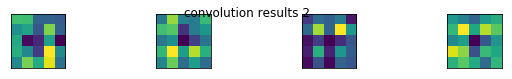


***

### 1.3.3 strides （Conv層） 

畳み込み層の `strides` パラメータは、 **特徴を抽出する間隔** 、つまり **カーネルを動かす距離** を指定します。

- strides=(1,1)

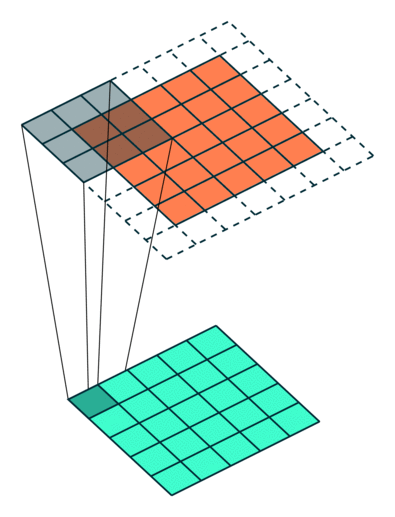

- strides=(2,2)

 

<div style="text-align: center;">
(出典: <a href="https://cntk.ai/pythondocs/CNTK_103D_MNIST_ConvolutionalNeuralNetwork.html" target="_blank">[CNTK]</a>)
</div>


（オレンジ色のパネルの周りに白い枠があるのは今は気にしないでください。次のセッションで扱います。）

`strides` が小さいほどきめ細かく特徴量を抽出できますが、画像中の同じ場所の同じ特徴を複数回検出してしまうなど、無駄な計算が多くなっているように思えます。  
しかし一般的に `strides` は小さいほうが良いとされ、Kerasの `Conv2D` レイヤーでは `strides` はデフォルトで `(1,1)` となっています。

#### 問題

- 今回もアルゴリズムの中身を理解するため、Keras+TensorFlowを用いずに実装します。
- strides=(2×2) の畳み込みを行う。

#### 例

```python
import numpy as np
import matplotlib.pyplot as plt

# ごくシンプルな畳み込み層を定義しています。
# 1チャンネルの画像の畳み込みのみを想定しています。
# シンプルな例を考えるため、paddingは考えません。
class Conv:
    def __init__(self, filters, kernel_size, strides):
        self.filters = filters
        self.kernel_size = kernel_size
        self.strides = strides
        self.W = np.random.rand(filters, kernel_size[0], kernel_size[1])
    def f_prop(self, X):
        k_h = self.kernel_size[0]
        k_w = self.kernel_size[1]
        s_h = self.strides[0]
        s_w = self.strides[1]
        out = np.zeros((filters, (X.shape[0]-k_h)//s_h+1, (X.shape[1]-k_w)//s_w+1))
        for k in range(self.filters):
            for i in range(out[0].shape[0]):
                for j in range(out[0].shape[1]):
                    x = X[i*s_h:i*s_h+k_h, j*s_w:j*s_w+k_w]
                    out[k,i,j] = np.dot(self.W[k].flatten(), x.flatten())
        return out

X = np.load('./5100_cnn_data/circle.npy')

# 畳み込み１
filters = 4
kernel_size = (3,3)
strides = (1,1)

# 畳み込み層の生成
conv1 = Conv(filters=filters, kernel_size=kernel_size, strides=strides)

# 畳み込みの実行
C1 = conv1.f_prop(X)

# 畳み込み２
filters = 4
kernel_size = (3,3)
strides = (2,2)

# 畳み込み層の生成
conv2 = Conv(filters=filters, kernel_size=kernel_size, strides=strides)
conv2.W = conv1.W # カーネルを統一しています

# 畳み込みの実行
C2 = conv2.f_prop(X)

# 以下可視化コード

plt.imshow(X)
plt.title('base image', fontsize=12)
plt.show()

plt.figure(figsize=(10,1))
for i in range(filters):
    plt.subplot(1,filters,i+1)
    ax = plt.gca() # get current axis
    ax.tick_params(labelbottom="off", labelleft="off", bottom="off", left="off") # 軸の削除
    plt.imshow(conv1.W[i])
plt.suptitle('kernel visualization', fontsize=12)
plt.show()

plt.figure(figsize=(10,1))
for i in range(filters):
    plt.subplot(1,filters,i+1)
    ax = plt.gca() # get current axis
    ax.tick_params(labelbottom="off", labelleft="off", bottom="off", left="off") # 軸の削除
    plt.imshow(C1[i])
plt.suptitle('convolution results 1', fontsize=12)
plt.show()

plt.figure(figsize=(10,1))
for i in range(filters):
    plt.subplot(1,filters,i+1)
    ax = plt.gca() # get current axis
    ax.tick_params(labelbottom="off", labelleft="off", bottom="off", left="off") # 軸の削除
    plt.imshow(conv2.W[i])
plt.suptitle('kernel results', fontsize=12)
plt.show()

plt.figure(figsize=(10,1))
for i in range(filters):
    plt.subplot(1,filters,i+1)
    ax = plt.gca() # get current axis
    ax.tick_params(labelbottom="off", labelleft="off", bottom="off", left="off") # 軸の削除
    plt.imshow(C2[i])
plt.suptitle('convolution results 2', fontsize=12)
plt.show()
```


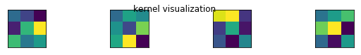

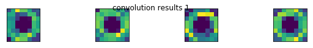

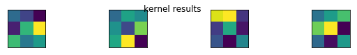

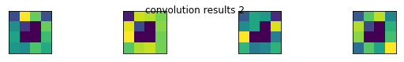


***

### 1.3.4 padding （Conv層）

<b style='color: #AA0000'>パディング</b>とは、 畳み込んだ時の画像の**縮小を抑える**ため、入力画像の周囲にピクセルを追加することをいいます。
一般的には、追加するピクセルを０にします。この**入力画像の周辺を0で埋めること**を <b style='color: #AA0000'>ゼロパディング</b>といいます。
パディングによって端のデータの特徴もよく考慮されるようになりますが、他にも、データ更新の頻度が上がることや、各層の入出力ユニット数の調整が行えることなどのメリットが考えられます。

下の図のオレンジのパネルの周りの白い枠はパディングを表現していますが、これは上下に1、左右にも1パディングをした図となります。

 

<div style="text-align: center;">
(出典: <a href="https://cntk.ai/pythondocs/CNTK_103D_MNIST_ConvolutionalNeuralNetwork.html" target="_blank">[CNTK]</a>)
</div>

Keras の `Conv2D` 層では、 `padding=valid`,  `padding=same` などのようにしてパディングの仕方を指定します。  
`padding=valid` の場合パディングは行われず、 `padding=same` の場合、出力される特徴マップが入力のサイズと一致するように、入力にパディングが行われます。  
右のコードでは、 `padding=(1,1)` のように、パディングする幅を引数に取ります。

#### 問題

- padding=(2,2) の畳み込みを行ってください。


#### 例


```python
import numpy as np
import matplotlib.pyplot as plt
import urllib.request

# ごくシンプルな畳み込み層を定義しています。
# 1チャンネルの画像の畳み込みのみを想定しています。
class Conv:
    def __init__(self, filters, kernel_size, strides, padding):
        self.filters = filters
        self.kernel_size = kernel_size
        self.strides = strides
        self.padding = padding
        self.W = np.random.rand(filters, kernel_size[0], kernel_size[1])
    def f_prop(self, X):
        k_h, k_w = self.kernel_size
        s_h, s_w = self.strides
        p_h, p_w = self.padding
        out = np.zeros((filters, (X.shape[0]+p_h*2-k_h)//s_h+1, (X.shape[1]+p_w*2-k_w)//s_w+1))
        # パディング
        X = np.pad(X, ((p_h, p_h), (p_w, p_w)), 'constant', constant_values=((0,0),(0,0)))
        self.X = X # 後でパディング結果を可視化するために保持しておきます。
        for k in range(self.filters):
            for i in range(out[0].shape[0]):
                for j in range(out[0].shape[1]):
                    x = X[i*s_h:i*s_h+k_h, j*s_w:j*s_w+k_w]
                    out[k,i,j] = np.dot(self.W[k].flatten(), x.flatten())
        return out

X = np.load('./5100_cnn_data/circle.npy')

# 畳み込み１
filters = 4
kernel_size = (3,3)
strides = (1,1)
padding = (0,0)

# 畳み込み層の生成
conv1 = Conv(filters=filters, kernel_size=kernel_size, strides=strides, padding=padding)

# 畳み込みの実行
C1 = conv1.f_prop(X)

# 畳み込み２
filters = 4
kernel_size = (3,3)
strides = (1,1)
padding = (2,2)

# 畳み込み層の生成
conv2 = Conv(filters=filters, kernel_size=kernel_size, strides=strides, padding=padding)
conv2.W = conv1.W # 重みを統一しています

# 畳み込みの実行
C2 = conv2.f_prop(X)

# 以下可視化コード

plt.imshow(conv1.X)
plt.title('padding results of the convolution 1', fontsize=12)
plt.show()

plt.figure(figsize=(10,1))
for i in range(filters):
    plt.subplot(1,filters,i+1)
    ax = plt.gca() # get current axis
    ax.tick_params(labelbottom="off", labelleft="off", bottom="off", left="off") # 軸の削除
    plt.imshow(conv1.W[i])
plt.suptitle('kernel visualization of the convolution 1', fontsize=12)
plt.show()

plt.figure(figsize=(10,1))
for i in range(filters):
    plt.subplot(1,filters,i+1)
    ax = plt.gca() # get current axis
    ax.tick_params(labelbottom="off", labelleft="off", bottom="off", left="off") # 軸の削除
    plt.imshow(C1[i])
plt.suptitle('results of the convolution 1', fontsize=12)
plt.show()

plt.imshow(conv2.X)
plt.title('padding results of the convolution 2', fontsize=12)
plt.show()

plt.figure(figsize=(10,1))
for i in range(filters):
    plt.subplot(1,filters,i+1)
    ax = plt.gca() # get current axis
    ax.tick_params(labelbottom="off", labelleft="off", bottom="off", left="off") # 軸の削除
    plt.imshow(conv2.W[i])
plt.suptitle('kernel visualization of the convolution 2', fontsize=12)
plt.show()

plt.figure(figsize=(10,1))
for i in range(filters):
    plt.subplot(1,filters,i+1)
    ax = plt.gca() # get current axis
    ax.tick_params(labelbottom="off", labelleft="off", bottom="off", left="off") # 軸の削除
    plt.imshow(C2[i])
plt.suptitle('results of the convolution 2', fontsize=12)
plt.show()
```


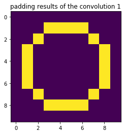


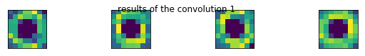

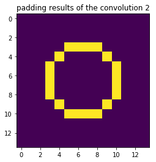


***

### 1.3.5 pool_size （Pool層）

プーリング層の `pool_size` パラメータは、 **一度にプーリングを適用する領域のサイズ（プーリングの粗さ）** を指定するパラメータです。

下の図では、最初のプーリングのサイズは2×2、次のプーリングのサイズも2×2となっています。


<div style="text-align: center;">
図1.3.5 畳み込み層とプーリング層 (出典: <a href="https://deepage.net/deep_learning/2016/11/07/convolutional_neural_network.html" target="_blank">[DeepAge]</a>)
</div>

`pool_size` を大きくすることで、位置に対するロバスト性が上がる（画像の中でオブジェクトが映る位置が多少変化しても出力が変化しないこと）とされますが、基本的に `pool_size` は2×2にすれば良いとされています。

#### 問題

- pool_size=(4,4) のMaxプーリングを行います。


#### 例


```python
import numpy as np
import matplotlib.pyplot as plt

# ごくシンプルな畳み込み層を定義しています。
class Conv:
    def __init__(self, W, filters, kernel_size):
        self.filters = filters
        self.kernel_size = kernel_size
        self.W = W # np.random.rand(filters, kernel_size[0], kernel_size[1])
    def f_prop(self, X):
        k_h, k_w = self.kernel_size
        out = np.zeros((filters, X.shape[0]-k_h+1, X.shape[1]-k_w+1))
        for k in range(self.filters):
            for i in range(out[0].shape[0]):
                for j in range(out[0].shape[1]):
                    x = X[i:i+k_h, j:j+k_w]
                    out[k,i,j] = np.dot(self.W[k].flatten(), x.flatten())
        return out

# ごくシンプルなプーリング層を定義しています。
# 1チャンネルの特徴マップのプーリングのみを想定しています。
class Pool:
    def __init__(self, pool_size):
        self.pool_size = pool_size
    def f_prop(self, X):
        k_h, k_w = self.pool_size
        out = np.zeros((X.shape[0]-k_h+1, X.shape[1]-k_w+1))
        for i in range(out.shape[0]):
            for j in range(out.shape[1]):
                out[i,j] = np.max(X[i:i+k_h, j:j+k_w])
        return out

X = np.load('./5100_cnn_data/circle.npy')

W = np.load('./5100_cnn_data/weight.npy') 

# 畳み込み
filters = 4
kernel_size = (3,3)
conv = Conv(W=W, filters=filters, kernel_size=kernel_size)
C = conv.f_prop(X)

# プーリング１
pool_size = (2,2)
pool1 = Pool(pool_size)
P1 = [pool1.f_prop(C[i]) for i in range(len(C))]

# プーリング２
pool_size = (4,4)
pool2 = Pool(pool_size)
P2 = [pool2.f_prop(C[i]) for i in range(len(C))]

# 以下はすべて可視化のためのコードです。

plt.imshow(X)
plt.title('base image', fontsize=12)
plt.show()

plt.figure(figsize=(10,1))
for i in range(filters):
    plt.subplot(1,filters,i+1)
    ax = plt.gca() # get current axis
    ax.tick_params(labelbottom="off", labelleft="off", bottom="off", left="off") # 軸の削除
    plt.imshow(C[i])
plt.suptitle('convolution results', fontsize=12)
plt.show()

plt.figure(figsize=(10,1))
for i in range(filters):
    plt.subplot(1,filters,i+1)
    ax = plt.gca() # get current axis
    ax.tick_params(labelbottom="off", labelleft="off", bottom="off", left="off") # 軸の削除
    plt.imshow(P1[i])
plt.suptitle('pooling results', fontsize=12)
plt.show()

plt.figure(figsize=(10,1))
for i in range(filters):
    plt.subplot(1,filters,i+1)
    ax = plt.gca() # get current axis
    ax.tick_params(labelbottom="off", labelleft="off", bottom="off", left="off") # 軸の削除
    plt.imshow(P2[i])
plt.suptitle('pooling results', fontsize=12)
plt.show()
```


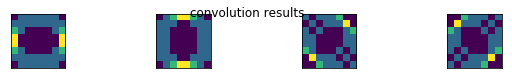


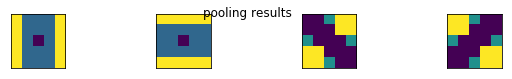
***

### 1.3.6 strides （Pool層）

プーリング層の `strides` パラメータは、畳み込み層の `strides` パラメータと同様に、特徴マップをプーリングする間隔を指定します。

- strides=(1,1)

 

- strides=(2,2)

 

<div style="text-align: center;">
(出典: <a href="https://cntk.ai/pythondocs/CNTK_103D_MNIST_ConvolutionalNeuralNetwork.html" target="_blank">[CNTK]</a>)
</div>

Kerasの`Pooling`レイヤーでは`strides`はデフォルトで`pool_size`と一致させるようになっています。

#### 問題

- 今回もアルゴリズムの中身を理解するため、Keras+TensorFlowを用いずに実装してみましょう。
- プーリング２ の部分を正しく埋めて、strides=(2×2) のMaxプーリングを行ってください。

#### 例


```python
import numpy as np
import matplotlib.pyplot as plt

# ごくシンプルな畳み込み層を定義しています。
class Conv:
    def __init__(self, W, filters, kernel_size):
        self.filters = filters
        self.kernel_size = kernel_size
        self.W = W # np.random.rand(filters, kernel_size[0], kernel_size[1])
    def f_prop(self, X):
        k_h, k_w = self.kernel_size
        out = np.zeros((filters, X.shape[0]-k_h+1, X.shape[1]-k_w+1))
        for k in range(self.filters):
            for i in range(out[0].shape[0]):
                for j in range(out[0].shape[1]):
                    x = X[i:i+k_h, j:j+k_w]
                    out[k,i,j] = np.dot(self.W[k].flatten(), x.flatten())
        return out

# ごくシンプルなプーリング層を定義しています。
# 1チャンネルの特徴マップのプーリングのみを想定しています。
class Pool:
    def __init__(self, pool_size, strides):
        self.pool_size = pool_size
        self.strides = strides
    def f_prop(self, X):
        k_h, k_w = self.pool_size
        s_h, s_w = self.strides
        out = np.zeros(((X.shape[0]-k_h)//s_h+1, (X.shape[1]-k_w)//s_w+1))
        for i in range(out.shape[0]):
            for j in range(out.shape[1]):
                out[i,j] = np.max(X[i*s_h:i*s_h+k_h, j*s_w:j*s_w+k_w])
        return out

X = np.load('./5100_cnn_data/circle.npy')

W = np.load('./5100_cnn_data/weight.npy')

# 畳み込み
filters = 4
kernel_size = (3,3)
conv = Conv(W=W, filters=filters, kernel_size=kernel_size)
C = conv.f_prop(X)

# プーリング１
pool_size = (2,2)
strides = (1,1)
pool1 = Pool(pool_size, strides)
P1 = [pool1.f_prop(C[i]) for i in range(len(C))]

# プーリング２
pool_size = (3,3)
strides = (2,2)
pool2 = Pool((3,3), (2,2))
P2 = [pool2.f_prop(C[i]) for i in range(len(C))]

# --------------------------------------------------------------
# 以下可視化コード
# --------------------------------------------------------------

plt.imshow(X)
plt.title('base image', fontsize=12)
plt.show()

plt.figure(figsize=(10,1))
for i in range(filters):
    plt.subplot(1,filters,i+1)
    ax = plt.gca() # get current axis
    ax.tick_params(labelbottom="off", labelleft="off", bottom="off", left="off") # 軸の削除
    plt.imshow(C[i])
plt.suptitle('convolution results', fontsize=12)
plt.show()

plt.figure(figsize=(10,1))
for i in range(filters):
    plt.subplot(1,filters,i+1)
    ax = plt.gca() # get current axis
    ax.tick_params(labelbottom="off", labelleft="off", bottom="off", left="off") # 軸の削除
    plt.imshow(P1[i])
plt.suptitle('pooling results', fontsize=12)
plt.show()

plt.figure(figsize=(10,1))
for i in range(filters):
    plt.subplot(1,filters,i+1)
    ax = plt.gca() # get current axis
    ax.tick_params(labelbottom="off", labelleft="off", bottom="off", left="off") # 軸の削除
    plt.imshow(P2[i])
plt.suptitle('pooling results', fontsize=12)
plt.show()
```

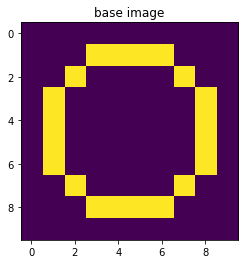


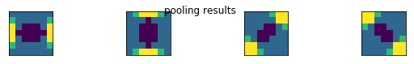


***

### 1.3.7 padding （Pool層）

畳み込み層の `padding` と同様に、プーリング層の `padding` パラメータは、パディングの仕方を指定します。


 


<div style="text-align: center;">
(出典: <a href="https://cntk.ai/pythondocs/CNTK_103D_MNIST_ConvolutionalNeuralNetwork.html" target="_blank">[CNTK]</a>)
</div>

Keras の `MaxPooling2D` 層では、 `padding=valid`,  `padding=same` などのようにしてパディングの仕方を指定します。  
`padding=valid` の場合パディングは行われず、 `padding=same` の場合、出力される特徴マップが入力のサイズと一致するように、入力にパディングが行われます。  
右のコードでは、 `padding=(1,1)` のように、パディングする幅を引数に取ります。

#### 問題

- padding=(1×1) でMaxプーリングを行なう。


```python
import numpy as np
import matplotlib.pyplot as plt

# ごくシンプルな畳み込み層を定義しています。
class Conv:
    def __init__(self, W, filters, kernel_size):
        self.filters = filters
        self.kernel_size = kernel_size
        self.W = W # np.random.rand(filters, kernel_size[0], kernel_size[1])
    def f_prop(self, X):
        k_h, k_w = self.kernel_size
        out = np.zeros((filters, X.shape[0]-k_h+1, X.shape[1]-k_w+1))
        for k in range(self.filters):
            for i in range(out[0].shape[0]):
                for j in range(out[0].shape[1]):
                    x = X[i:i+k_h, j:j+k_w]
                    out[k,i,j] = np.dot(self.W[k].flatten(), x.flatten())
        return out

# ごくシンプルなプーリング層を定義しています。
# 1チャンネルの特徴マップのプーリングのみを想定しています。
class Pool:
    def __init__(self, pool_size, strides, padding):
        self.pool_size = pool_size
        self.strides = strides
        self.padding = padding
    def f_prop(self, X):
        k_h, k_w = self.pool_size
        s_h, s_w = self.strides
        p_h, p_w = self.padding
        out = np.zeros(((X.shape[0]+p_h*2-k_h)//s_h+1, (X.shape[1]+p_w*2-k_w)//s_w+1))
        X = np.pad(X, ((p_h,p_h),(p_w,p_w)), 'constant', constant_values=((0,0),(0,0)))
        for i in range(out.shape[0]):
            for j in range(out.shape[1]):
                out[i,j] = np.max(X[i*s_h:i*s_h+k_h, j*s_w:j*s_w+k_w])
        return out

X = np.load('./5100_cnn_data/circle.npy')

W = np.load('./5100_cnn_data/weight.npy')

# 畳み込み
filters = 4
kernel_size = (3,3)
conv = Conv(W=W, filters=filters, kernel_size=kernel_size)
C = conv.f_prop(X)

# プーリング
pool_size = (2,2)
strides = (2,2)
padding = (0,0)
pool1 = Pool(pool_size=pool_size, strides=strides, padding=padding)
P1 = [pool1.f_prop(C[i]) for i in range(len(C))]

# プーリング
pool_size = (2,2)
strides = (2,2)
padding = (1,1)
pool2 = Pool(pool_size=pool_size, strides=strides, padding=padding)
P2 = [pool2.f_prop(C[i]) for i in range(len(C))]

# --------------------------------------------------------------
# 以下可視化コード
# --------------------------------------------------------------

plt.imshow(X)
plt.title('base image', fontsize=12)
plt.show()

plt.figure(figsize=(10,1))
for i in range(filters):
    plt.subplot(1,filters,i+1)
    ax = plt.gca() # get current axis
    ax.tick_params(labelbottom="off", labelleft="off", bottom="off", left="off") # 軸の削除
    plt.imshow(C[i])
plt.suptitle('convolution results', fontsize=12)
plt.show()

plt.figure(figsize=(10,1))
for i in range(filters):
    plt.subplot(1,filters,i+1)
    ax = plt.gca() # get current axis
    ax.tick_params(labelbottom="off", labelleft="off", bottom="off", left="off") # 軸の削除
    plt.imshow(P1[i])
plt.suptitle('pooling results', fontsize=12)
plt.show()

plt.figure(figsize=(10,1))
for i in range(filters):
    plt.subplot(1,filters,i+1)
    ax = plt.gca() # get current axis
    ax.tick_params(labelbottom="off", labelleft="off", bottom="off", left="off") # 軸の削除
    plt.imshow(P2[i])
plt.suptitle('pooling results', fontsize=12)
plt.show()
```


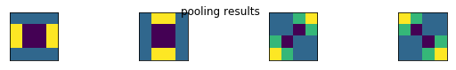


