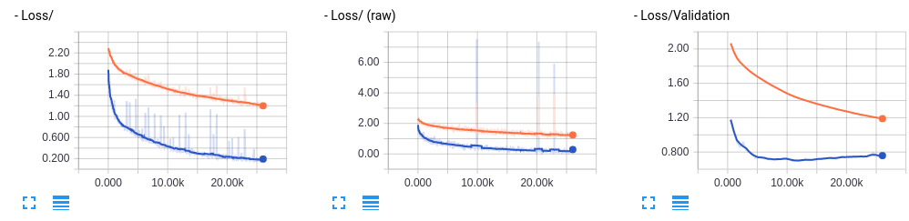

```python
%matplotlib inline
```

#  CNNを用いた画像認識の応用


- **[2.1 データのかさ増し](#2.1-データのかさ増し)**
    - **[2.1.1 ImageDataGenerator](#2.1.1-ImageDataGenerator)**

- **[2.2 正規化](#2.2-正規化)**
    - **[2.2.1 様々な正規化手法](#2.2.1-様々な正規化手法)**
    - **[2.2.2 標準化](#2.2.2-標準化)**
    - **[2.2.3 白色化](#2.2.3-白色化)**
    - **[2.2.4 バッチ正規化](#2.2.4-バッチ正規化)**

- **[2.3 転移学習](#2.3-転移学習)**
    - **[2.3.1 VGG](#2.3.1-VGG)**
    - **[2.3.2 CNNを用いた分類（cifar）](#2.3.2-)**
    

<!--
Early Stopping　は？と思ったけど、これはCNNより前に扱うべきか。
ジェネレーターは、多層Pレベルではいらないし、RNN系では使わない？し、CNNでkerasで扱うのが適切かな、とか
-->

***

## 2.1 データのかさ増し

### 2.1.1 ImageDataGenerator

画像認識では、画像データとそのラベル（教師データ）の組み合わせが大量に必要となります。しかしながら十分な数の画像とラベルの組み合わせを用意する事は、しばしばかなりのコストがかかります。 そこで、データの個数を十分量に増やす際に行われるテクニックとして、**画像の水増し** があります。

画像の水増しといっても、ただ単にデータをコピーして量を増やすだけでは意味がありません。  
そこで、例えば画像を **反転** したり、**ずらし** たりして新たなデータを作り出します。


ここでは、Keras の `ImageDataGenerator` を使って水増しを行っていきます。  

`ImageDataGenerator` には多くの引数があり、それらを適切に指定することで、簡単にデータを加工することができます。また複数の加工を組み合わせて新しい画像を生成することもできます。  
`ImageDataGenerator` でよく使われる引数を見ていきます。

```python
datagen = ImageDataGenerator(rotation_range=0.,
                            width_shift_range=0.,
                            height_shift_range=0.,
                            shear_range=0.,
                            zoom_range=0.,
                            channel_shift_range=0,
                            horizontal_flip=False,
                            vertical_flip=False)
```
- `rotation_range`: ランダムに回転する回転範囲（単位degree）  
- `width_shift_range`: ランダムに水平方向に平行移動する、画像の横幅に対する割合  
- `height_shift_range`: ランダムに垂直方向に平行移動する、画像の縦幅に対する割合  
- `shear_range`: せん断の度合い。大きくするとより斜め方向に押しつぶされたり伸びたりしたような画像になる（単位degree）  
- `zoom_range`: ランダムに画像を圧縮、拡大させる割合。最小で 1-zoomrange まで圧縮され、最大で 1+zoom_rangeまで拡大される。  
- `channel_shift_range`: 入力がRGB3チャンネルの画像の場合、R,G,Bそれぞれにランダムな値を足したり引いたりする。(0~255) 
- `horizontal_flip`: `True`を指定すると、ランダムに水平方向に反転します。
- `vertical_flip`: `True`を指定すると、ランダムに垂直方向に反転します。


flow
`flow(x, y=None, batch_size=32, shuffle=True, seed=None, save_to_dir=None, save_prefix='', save_format='png', subset=None)`
numpyデータとラベルの配列を受け取り，拡張/正規化したデータのバッチを生成します。

引数
`x`: データ,4次元データである必要があります。グレースケールデータではチャネルを1にRGBデータではチャネルを3にしてください。

`y`: ラベル
`batch_size`: 整数（デフォルト: 32）。データのバッチのサイズを指定する。
`shuffle`: 真理値（デフォルト: True）。データをシャッフルするかどうか。
`save_to_dir`: Noneまたは文字列（デフォルト: None)。生成された拡張画像を保存するディレクトリを指定できます（行ったことの可視化に有用です）
`save_prefix`: 文字列（デフォルト'')。画像を保存する際にファイル名に付けるプリフィックス（set_to_dirに引数が与えられた時のみ有効）
`save_format`: "png"または"jpeg"（set_to_dirに引数が与えられた時のみ有効)。デフォルトは"png"

戻り値
xが画像データのNumpy配列でyがそれに対応したラベルのNumpy配列である(x, y)から生成されるイテレータです

他にもいくつか引数がありいろいろな処理を行うことができるので、興味がある方は以下を参考にしてみてください。

<center>(参考: <a href="https://keras.io/ja/preprocessing/image/" target="_blank">Keras公式サイト</a>)</center>


***

## 2.2 正規化

### 2.2.1 様々な正規化手法


上の画像は **正規化** の例です。データにある決まりに従って処理を行い、使いやすくすることを **正規化** と言います。  

上の例では **正規化** を行うことで光の当たり方を統一し、学習に直接関係のないデータ間の差異を取り除いています。これにより、学習の効率を格段に上げることができます。




```
オレンジ色が正規化無し、青が正規化有りとなっています。
```

（出典: <a href="https://deepage.net/deep_learning/2016/10/26/batch_normalization.html" target="_blank">DeepAge</a>）

上のグラフは、cifar10の分類に「バッチノーマライゼーション(BN)」という正規化を行うと正解率が大きく上がったことを示しています。

例えば顔画像認識をする際に，撮影した顔画像写真の光源の当たり方が写真によって違っていた場合，学習に悪影響をおよぼす可能性があります。
文字認識をする際に，人によって文字の形が正方形に近かったり縦長の長方形に近かったりすることがあるが，これもアスペクト比を統一するのが望ましい． このように学習に関係ないデータ間の差異を，学習に影響を及ぼさないように取り除くことを正規化といいます。
<!--
Mat src = imread(argv[hoge]);
        if(src.empty()){
            cout << "Image not found!" << endl;
            return -1;
        }
        //特徴ベクトルの生成
        int index;
        float train[64];
        for(int i=0; i<64; i++) train[i] = 0;
        Mat norm(src.size(), src.type());
        Mat sample(src.size(), src.type());
        normalize(src, norm, 0, 255, NORM_MINMAX, CV_8UC3);
        imshow("normalized", norm);
-->

近年、深いニューラルネットワークモデルにおいて正規化はあまり必要ないとされることもありますが、簡単なモデルを使う際に極めて有用なことには間違いありません。

深層学習に用いる正規化の方法にはいろいろあり、代表的なものを挙げると
- バッチ正規化(BN)
- 主成分分析（PCA）
- 特異値分解（SVD）
- ゼロ位相成分分析（ZCA）
- 局所的応答正規化（LRN）
- 大域コントラスト正規化（GCN）
- 局所コントラスト正規化（LCN）

これらの正規化手法は大きく「標準化」と「白色化」に分けられます。次のセッションからそれぞれについて見ていきます。  

<!--
GCNは、画像をまたがずに、画像内での平均と分散を求めて平均を引いて分散で割るようです。
-->

### 2.2.2 標準化

**標準化** は、個々の特徴を平均0、分散1にすることで、特徴ごとのデータの分布を近づける手法です。

以下の画像は、CIFAR-10のデータセットに、各特徴（ここではR,G,Bの3チャンネル）それぞれについて **標準化** を行ったものです。（見やすくなるようにさらに少し処理を入れてあります）  
**標準化** を行うことで色合いが平均的になり灰色がかったように見えますが、逆に、それまで目立っていなかった色（R or G or B）がほかの色と同じレベルで重要視される（重みづけされる）ようになるため、隠れていた特徴を見つけやすくなります。


標準化を式で表すと以下のようになります。

$$
x'_i= \large{\frac{x_i- \mu}{\sigma}}
$$
$$
\mu：元データの平均　
$$
$$
\sigma：元データの標準偏差
$$


#### 問題

- Keras+Tensorflowを用いた実装を行います。
- 以下の条件と右のコードに従ってCIFAR-10のデータセットの先頭10枚の画像に標準化を行い、行わなかった時の画像と比べます。
 - 各画像ごとに標準化を行うこと。
 - 標準化をするため `ImageDataGenerator` クラスのインスタンスを生成しましょう。その際、ヒントを参考に
 `ImageDataGenerator` に適切な引数を渡しましょう。

- `datagen = ImageDataGenerator()` とするとジェネレーターを生成できます。
- 各チャンネルの平均を0に、分散を1にすることで標準化が行えます。
- `ImageDataGenerator` に `samplewise_center=True` を指定して各画像のチャンネルごとの平均を0に、 `samplewise_std_normalization=True` を指定して各画像のチャンネルごとの分散を1にすることができます。

#### 例


```python
import matplotlib.pyplot as plt
from keras.datasets import cifar10
from keras.preprocessing.image import ImageDataGenerator

(X_train, y_train), (X_test, y_test) = cifar10.load_data()

for i in range(10):
    plt.subplot(2, 5, i + 1)
    plt.imshow(X_train[i])
plt.suptitle('base images', fontsize=12)
plt.show()

# ジェネレーターの生成
datagen = ImageDataGenerator(samplewise_center=True, samplewise_std_normalization=True)

# 標準化
g = datagen.flow(X_train, y_train, shuffle=False)
X_batch, y_batch = g.next()

# 生成した画像を見やすくしています
X_batch *= 127.0 / max(abs(X_batch.min()), X_batch.max())
X_batch += 127.0
X_batch = X_batch.astype('uint8')

for i in range(10):
    plt.subplot(2, 5, i + 1)
    plt.imshow(X_batch[i])
plt.suptitle('standardization results', fontsize=12)
plt.show()
```


***

### 2.2.3 白色化

**白色化** はデータの特徴間の相関を無くす処理のことです。

以下の画像は、CIFAR-10のデータセットに、各特徴（ここではR,G,Bの3チャンネル）それぞれについて **白色化** を行ったものです。（見やすくなるようにさらに少し処理を入れてあります） 

**白色化** を行うことで全体的に暗くなりエッジが強調されたように見えますが、これは白色化が、周りのピクセルの情報から容易に想定される色合いは無視するような効果があるからです。

**白色化** によって情報量の少ない面や背景等ではなく、情報量の多いエッジ等を強調することで学習効率を上げることができます。

```Python
# ジェネレーターの生成
datagen = ImageDataGenerator(featurewise_center=True, zca_whitening=True)

# 白色化
datagen.fit(X_train)
g = datagen.flow(X_train, y_train, shuffle=False)
X_batch, y_batch = g.next()
```


#### 問題

- 以下の条件と右のコードに従ってCIFAR-10のデータセットの先頭10枚の画像に白色化を行い、行わなかった時の画像と比べてみます。
- 白色化には `ImageDataGenerator` クラスのインスタンスを生成しましょう。その際、ヒントを参考に `ImageDataGenerator` に適切な引数を渡すこと。


- `datagen = ImageDataGenerator()` とするとジェネレーターを生成できます。
- `ImageDataGenerator` に `featurewise_center=True`、`zca_whitening=True` を指定することでゼロ位相成分分析を適用することができます。

#### 例


```python
import matplotlib.pyplot as plt
from keras.datasets import cifar10
from keras.preprocessing.image import ImageDataGenerator

(X_train, y_train), (X_test, y_test) = cifar10.load_data()

# 今回は全データのうち、学習には300、テストには100個のデータを使用します
X_train = X_train[:300]
X_test = X_test[:100]
y_train = y_train[:300]
y_test = y_test[:100]

for i in range(10):
    plt.subplot(2, 5, i + 1)
    plt.imshow(X_train[i])
plt.suptitle('base images', fontsize=12)
plt.show()

# ジェネレーターの生成
datagen = ImageDataGenerator(featurewise_center=True,zca_whitening=True)

# 白色化
datagen.fit(X_train)
g = datagen.flow(X_train, y_train, shuffle=False)
X_batch, y_batch = g.next()

# 生成した画像を見やすくしています
X_batch *= 127.0 / max(abs(X_batch.min()), abs(X_batch.max()))
X_batch += 127
X_batch = X_batch.astype('uint8')

for i in range(10):
    plt.subplot(2, 5, i + 1)
    plt.imshow(X_batch[i])
plt.suptitle('whitening results', fontsize=12)
plt.show()
```


***

### 2.2.4 バッチ正規化

深層学習において、ミニバッチ学習の際にバッチごとに標準化を行うことを「 **バッチ正規化** （バッチノーマライゼーション）」と言います。

Kerasでは以下のように、全結合層や畳み込み層、活性化関数などと同じようにmodelのaddメソッドでモデルに組み込むことができます。
```python
model.add(BatchNormalization())
```
**バッチ正規化** はデータの前処理としてだけではなく、中間層の出力に適用することができます。  
特に、活性化関数ReLUなど、出力値の範囲が限定されてない関数の出力に対して **バッチ正規化** を使うと、学習がスムーズに進みやすくなり大きな効果を発揮します。

#### 問題

- 以下の点に注意し、バッチノーマライゼーションを組み込む文を実行します。
 - 正しく正規化を使うと、活性化関数にsigmoid関数ではなくReLUを用いてもうまく学習を進めることができます。
 - ReLUを正しく使うと、sigmoid関数を使うより良い学習結果が出ることが多いです。


- バッチ正規化は一見層ではありませんが、kerasでは他の層と同じように扱うことができます。
- `model2 = Sequential()` としてインスタンスを生成していることに注意しましょう。

#### 例


```python
import numpy as np
import matplotlib.pyplot as plt
from keras.datasets import mnist
from keras.layers import Activation, Conv2D, Dense, Flatten, MaxPooling2D, BatchNormalization
from keras.models import Sequential, load_model
from keras.utils.np_utils import to_categorical

(X_train, y_train), (X_test, y_test) = mnist.load_data()
X_train = np.reshape(a=X_train, newshape=(-1,28,28,1))[:300]
X_test = np.reshape(a = X_test,newshape=(-1,28,28,1))[:300]
y_train = to_categorical(y_train)[:300]
y_test = to_categorical(y_test)[:300]

# model1（活性化関数にsigmoid関数を使うモデル）の定義
model1 = Sequential()
model1.add(Conv2D(input_shape=(28, 28, 1), filters=32,
                 kernel_size=(2, 2), strides=(1, 1), padding="same"))
model1.add(MaxPooling2D(pool_size=(2, 2)))
model1.add(Conv2D(filters=32, kernel_size=(
    2, 2), strides=(1, 1), padding="same"))
model1.add(MaxPooling2D(pool_size=(2, 2)))
model1.add(Flatten())
model1.add(Dense(256))
model1.add(Activation('sigmoid'))
model1.add(Dense(128))
model1.add(Activation('sigmoid'))
model1.add(Dense(10))
model1.add(Activation('softmax'))


model1.compile(optimizer='sgd', loss='categorical_crossentropy',
              metrics=['accuracy'])
# 学習
history = model1.fit(X_train, y_train, batch_size=32, epochs=3, validation_data=(X_test, y_test))

# 可視化
plt.plot(history.history['acc'], label='acc', ls='-', marker='o')
plt.plot(history.history['val_acc'], label='val_acc', ls='-', marker='x')
plt.ylabel('accuracy')
plt.xlabel('epoch')
plt.suptitle('model1', fontsize=12)
plt.show()


# model2（活性化関数にReLUを使うモデル）の定義
model2 = Sequential()
model2.add(Conv2D(input_shape=(28, 28, 1), filters=32,
                 kernel_size=(2, 2), strides=(1, 1), padding="same"))
model2.add(MaxPooling2D(pool_size=(2, 2)))
model2.add(Conv2D(filters=32, kernel_size=(
    2, 2), strides=(1, 1), padding="same"))
model2.add(MaxPooling2D(pool_size=(2, 2)))
model2.add(Flatten())
model2.add(Dense(256))
model2.add(Activation('relu'))
# 以下にバッチ正規化を追加して下さい
model2.add(BatchNormalization())
model2.add(Dense(128))
model2.add(Activation('relu'))
# 以下にバッチ正規化を追加して下さい
model2.add(BatchNormalization())
model2.add(Dense(10))
model2.add(Activation('softmax'))


model2.compile(optimizer='sgd', loss='categorical_crossentropy',
              metrics=['accuracy'])
# 学習
history = model2.fit(X_train, y_train, batch_size=32, epochs=3, validation_data=(X_test, y_test))

# 可視化
plt.plot(history.history['acc'], label='acc', ls='-', marker='o')
plt.plot(history.history['val_acc'], label='val_acc', ls='-', marker='x')
plt.ylabel('accuracy')
plt.xlabel('epoch')
plt.suptitle("model2", fontsize=12)
plt.show()
```

    WARNING:tensorflow:From C:\Users\user\Anaconda3\lib\site-packages\tensorflow\python\framework\op_def_library.py:263: colocate_with (from tensorflow.python.framework.ops) is deprecated and will be removed in a future version.
    Instructions for updating:
    Colocations handled automatically by placer.
    WARNING:tensorflow:From C:\Users\user\Anaconda3\lib\site-packages\tensorflow\python\ops\math_ops.py:3066: to_int32 (from tensorflow.python.ops.math_ops) is deprecated and will be removed in a future version.
    Instructions for updating:
    Use tf.cast instead.
    Train on 300 samples, validate on 300 samples
    Epoch 1/3
    300/300 [==============================] - 2s 7ms/step - loss: 2.3085 - acc: 0.0967 - val_loss: 2.2728 - val_acc: 0.1800
    Epoch 2/3
    300/300 [==============================] - 0s 608us/step - loss: 2.1975 - acc: 0.2333 - val_loss: 2.2010 - val_acc: 0.2233
    Epoch 3/3
    300/300 [==============================] - 0s 612us/step - loss: 2.1274 - acc: 0.3500 - val_loss: 2.1539 - val_acc: 0.2633
    


    Train on 300 samples, validate on 300 samples
    Epoch 1/3
    300/300 [==============================] - 2s 6ms/step - loss: 1.8078 - acc: 0.4500 - val_loss: 1.8938 - val_acc: 0.5167
    Epoch 2/3
    300/300 [==============================] - 0s 639us/step - loss: 0.7032 - acc: 0.8200 - val_loss: 1.3394 - val_acc: 0.6033
    Epoch 3/3
    300/300 [==============================] - 0s 668us/step - loss: 0.4710 - acc: 0.9000 - val_loss: 1.1594 - val_acc: 0.5967


***

## 2.3 転移学習

### 2.3.1 転移学習

大規模なニューラルネットを学習させるのにはとても時間がかかり、データも大量に必要になります。
このような場合は、大量のデータですでに学習され公開されているモデルを用いることが有効です。学習済みのモデルを使って新たなモデルの学習を行うことを「 **転移学習** 」といいます。

Kerasでは、ImageNet（120万枚，1000クラスからなる巨大な画像のデータセット）で学習した画像分類モデルとその重みをダウンロードし、使用できます。  
公開されているモデルには何種類かありますが、ここでは **VGG16** というモデルを例に説明します。


<center>図2.3.1 VGGモデル (出典: <a href="https://arxiv.org/pdf/1409.1556.pdf" target="_blank">VERY DEEP CONVOLUTIONAL NETWORKS FOR LARGE-SCALE IMAGE RECOGNITION</a>)</center>

※図自体は上の論文には載ってなかった。
図の一次情報はわかりません...


VGGモデルは、2014年のILSVRCという大規模な画像認識のコンペティションで2位になった、オックスフォード大学VGG(Visual Geometry Group)チームが作成したネットワークモデルです。（図１）
小さいフィルターを使った畳み込みを2〜4回連続で行いさらにプーリングする、というのを繰り返し、当時としてはかなり層を深くしてあるのが特徴です。VGGモデルには、重みがある層(畳み込み層と全結合層)を16層重ねたものと19層重ねたものがあり、それぞれVGG16やVGG19と呼ばれます。VGG16は、畳み込み13層＋全結合層3層＝16層のニューラルネットワークになっています。

もともとのVGGモデルは、1000クラスの分類モデルなので出力ユニットは1000個ありますが、最後の全結合層は使わずに途中までの層を特徴抽出のための層として使うことで、転移学習に用いることができます。

また、入力画像のサイズも気にする必要はありません。これは、VGG16モデルは、畳み込み層のカーネルサイズは `3x3` と小さく、また `padding='same'` とされており、極端に入力画像が小さくない限り13層を経て抽出される特徴の数が一定数確保されるためです。

<!--
Visual Geometry Groupオックスフォード大学
-->

***

### 2.3.2 VGG16

Kerasでcifar10のデータセットを転移学習を用いて分類します。  
今まで使ってきた `Sequential` というタイプのモデルにVGG16のモデルを組み合わせます。

まず、VGGのモデルを作ります。
```python
from keras.applications.vgg16 import VGG16

# ImageNetで事前学習した重みも読み込まれます
input_tensor = Input(shape=(32, 32, 3))
vgg16 = VGG16(include_top=False, weights='imagenet', input_tensor=input_tensor)
```
`input_tensor` はモデルの入力画像として利用するためのオプションのKerasテンソル (つまり，layers.Input()の出力)です。<br>
`include_top` は、もとのモデルの最後の全結合層の部分を用いるかどうかです。これを `False` にすることで元のモデルの畳み込み層による特徴抽出部分のみを用いて、それ以降の層に自分で作成したモデルを追加することができます。<br>
`weights` は `imagenet` を指定すると、ImageNetで学習した重みを用い、`None` とするとランダムな重みを用いるようになります。<br><br>
特徴抽出部分以降に新しく他の層を追加するには、あらかじめVGGとは別のモデル（ここではtop_model）を定義し、以下のようにして結合します。

```python
top_model = Sequential()
top_model.add(Flatten(input_shape=vgg16.output_shape[1:]))
top_model.add(Dense(256, activation='sigmoid'))
top_model.add(Dropout(0.5))
top_model.add(Dense(10, activation='softmax'))
model = Model(inputs=vgg16.input, outputs=top_model(vgg16.output))
```

vgg16による特徴抽出部分の重みは更新されると崩れてしまうので以下のようにして固定します。

```python
# modelの20層目までがvggのモデル
for layer in model.layers[:19]:
    layer.trainable = False
```

コンパイル・学習は同様に行えますが、転移学習する場合、最適化関数はSGDを選択するのが良いとされています。

```python
model.compile(loss='categorical_crossentropy',
              optimizer=optimizers.SGD(lr=1e-4, momentum=0.9),
              metrics=['accuracy'])
```


#### 問題

- CIFAR-10の分類モデルをVGG16を使って生成、転移学習させるコード作ります。


- 精度は60%ほどにとどまります。訓練データをかさ増ししたり何度も学習を繰り返すと90%ほどまで出るそうですが、計算資源と時間がかなり必要になります。

#### 例


```python
from keras import optimizers
from keras.applications.vgg16 import VGG16
from keras.datasets import cifar10
from keras.layers import Dense, Dropout, Flatten, Input
from keras.models import Model, Sequential
from keras.utils.np_utils import to_categorical
import matplotlib.pyplot as plt
import numpy as np

(X_train, y_train), (X_test, y_test) = cifar10.load_data()
X_train = X_train[:300]
X_test = X_test[:100]
y_train = to_categorical(y_train)[:300]
y_test = to_categorical(y_test)[:100]

#input_tensorを定義
input_tensor = Input(shape=(32, 32, 3))

vgg16 = VGG16(include_top=False, weights='imagenet', input_tensor=input_tensor)

top_model = Sequential()
top_model.add(Flatten(input_shape=vgg16.output_shape[1:]))
top_model.add(Dense(256, activation='sigmoid'))
top_model.add(Dropout(0.5))
top_model.add(Dense(10, activation='softmax'))

# vgg16とtop_modelを連結
model = Model(inputs=vgg16.input, outputs=top_model(vgg16.output))

# 19層目までの重みをfor文を用いて固定
for layer in model.layers[:19]:
    layer.trainable = False

model.compile(loss='categorical_crossentropy',
              optimizer=optimizers.SGD(lr=1e-4, momentum=0.9),
              metrics=['accuracy'])


# model.load_weights('param_vgg.hdf5')

model.fit(X_train, y_train, validation_data=(X_test, y_test), batch_size=32, epochs=1)

# 以下でモデルの重みを保存することができます(ここでは行えません)
# model.save_weights('param_vgg.hdf5')

# 精度の評価
scores = model.evaluate(X_test, y_test, verbose=1)
print('Test loss:', scores[0])
print('Test accuracy:', scores[1])

# データの可視化（テストデータの先頭の10枚）
for i in range(10):
    plt.subplot(2, 5, i+1)
    plt.imshow(X_test[i])
plt.suptitle("10 images of test data",fontsize=16)
plt.show()

# 予測（テストデータの先頭の10枚）
pred = np.argmax(model.predict(X_test[0:10]), axis=1)
print(pred)

model.summary()

```

    WARNING:tensorflow:From C:\Users\user\Anaconda3\lib\site-packages\keras\backend\tensorflow_backend.py:3445: calling dropout (from tensorflow.python.ops.nn_ops) with keep_prob is deprecated and will be removed in a future version.
    Instructions for updating:
    Please use `rate` instead of `keep_prob`. Rate should be set to `rate = 1 - keep_prob`.
    Train on 300 samples, validate on 100 samples
    Epoch 1/1
    300/300 [==============================] - 4s 12ms/step - loss: 2.9577 - acc: 0.0933 - val_loss: 2.5658 - val_acc: 0.1300
    100/100 [==============================] - 1s 8ms/step
    Test loss: 2.5657567977905273
    Test accuracy: 0.13
    


    [8 3 4 3 8 1 9 8 3 3]
    _________________________________________________________________
    Layer (type)                 Output Shape              Param #   
    =================================================================
    input_1 (InputLayer)         (None, 32, 32, 3)         0         
    _________________________________________________________________
    block1_conv1 (Conv2D)        (None, 32, 32, 64)        1792      
    _________________________________________________________________
    block1_conv2 (Conv2D)        (None, 32, 32, 64)        36928     
    _________________________________________________________________
    block1_pool (MaxPooling2D)   (None, 16, 16, 64)        0         
    _________________________________________________________________
    block2_conv1 (Conv2D)        (None, 16, 16, 128)       73856     
    _________________________________________________________________
    block2_conv2 (Conv2D)        (None, 16, 16, 128)       147584    
    _________________________________________________________________
    block2_pool (MaxPooling2D)   (None, 8, 8, 128)         0         
    _________________________________________________________________
    block3_conv1 (Conv2D)        (None, 8, 8, 256)         295168    
    _________________________________________________________________
    block3_conv2 (Conv2D)        (None, 8, 8, 256)         590080    
    _________________________________________________________________
    block3_conv3 (Conv2D)        (None, 8, 8, 256)         590080    
    _________________________________________________________________
    block3_pool (MaxPooling2D)   (None, 4, 4, 256)         0         
    _________________________________________________________________
    block4_conv1 (Conv2D)        (None, 4, 4, 512)         1180160   
    _________________________________________________________________
    block4_conv2 (Conv2D)        (None, 4, 4, 512)         2359808   
    _________________________________________________________________
    block4_conv3 (Conv2D)        (None, 4, 4, 512)         2359808   
    _________________________________________________________________
    block4_pool (MaxPooling2D)   (None, 2, 2, 512)         0         
    _________________________________________________________________
    block5_conv1 (Conv2D)        (None, 2, 2, 512)         2359808   
    _________________________________________________________________
    block5_conv2 (Conv2D)        (None, 2, 2, 512)         2359808   
    _________________________________________________________________
    block5_conv3 (Conv2D)        (None, 2, 2, 512)         2359808   
    _________________________________________________________________
    block5_pool (MaxPooling2D)   (None, 1, 1, 512)         0         
    _________________________________________________________________
    sequential_3 (Sequential)    (None, 10)                133898    
    =================================================================
    Total params: 14,848,586
    Trainable params: 133,898
    Non-trainable params: 14,714,688
    _________________________________________________________________
    
