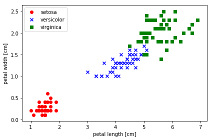
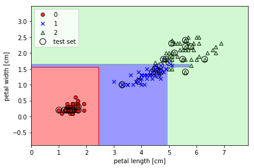
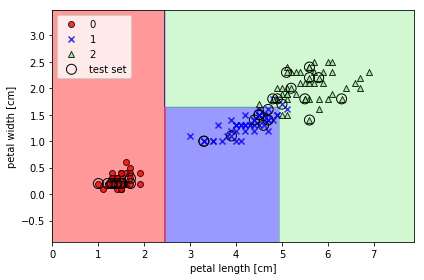

```python
%matplotlib inline
```

# 目次

- **[1.問題設定](#1.問題設定)**
- **[2.データ](#2.データ)**
- **[3.コード](#3.コード)**
- **[4.結果](#4.結果)**

# 1.問題設定

### アヤメの「花びらの長さ」,「花びらの幅」の情報から品種を予測したい

# 2.データ

## 以下のアヤメのデータを使用する

#### データ説明（アヤメのデータセット）
---

Irisデータには、150個のアヤメ(花の一種)のサンプルの「がく片の長さ」「がく片の幅」「花びらの長さ」「花びらの幅」の４つの要素(単位はcm)と、3種の品種が格納されています。


| ID 	| がく片の長さ 	| がく片の幅 	| 花びらの長さ 	| 花びらの幅 	| 品種クラス    	|
|----	|----------	|----------	|--------------	|------------	|---------------	|
| 0  	| 5.1      	| 3.5      	| 1.4          	| 0.2        	| Iris-setosa     	|
| 1  	| ・       	| ・       	| ・           	| ・         	| Iris-versicolor	|
|  ・	| ・       	| ・       	| ・           	| ・         	| Iris-setosa     	|
| ・  	| ・       	| ・       	| ・           	| ・         	| Iris-virginica	|

Irisデータのイメージ図（実際の値とは違います）


# 3.コード


```python
# データの読み込み
import pandas as pd
'''
# ネットワークを使用してデータを取得する場合（中身はpd.read_csvのデータと同じです）
df = pd.read_csv('https://archive.ics.uci.edu/ml/machine-learning-databases/iris/iris.data', header=None)
'''
df = pd.read_csv("../data/iris.data", header=None)

df.head()
```


<div>
<style scoped>
    .dataframe tbody tr th:only-of-type {
        vertical-align: middle;
    }

    .dataframe tbody tr th {
        vertical-align: top;
    }

    .dataframe thead th {
        text-align: right;
    }
</style>
<table border="1" class="dataframe">
  <thead>
    <tr style="text-align: right;">
      <th></th>
      <th>0</th>
      <th>1</th>
      <th>2</th>
      <th>3</th>
      <th>4</th>
    </tr>
  </thead>
  <tbody>
    <tr>
      <th>0</th>
      <td>5.1</td>
      <td>3.5</td>
      <td>1.4</td>
      <td>0.2</td>
      <td>Iris-setosa</td>
    </tr>
    <tr>
      <th>1</th>
      <td>4.9</td>
      <td>3.0</td>
      <td>1.4</td>
      <td>0.2</td>
      <td>Iris-setosa</td>
    </tr>
    <tr>
      <th>2</th>
      <td>4.7</td>
      <td>3.2</td>
      <td>1.3</td>
      <td>0.2</td>
      <td>Iris-setosa</td>
    </tr>
    <tr>
      <th>3</th>
      <td>4.6</td>
      <td>3.1</td>
      <td>1.5</td>
      <td>0.2</td>
      <td>Iris-setosa</td>
    </tr>
    <tr>
      <th>4</th>
      <td>5.0</td>
      <td>3.6</td>
      <td>1.4</td>
      <td>0.2</td>
      <td>Iris-setosa</td>
    </tr>
  </tbody>
</table>
</div>


## 前処理


```python
# 欠損値の有無の確認
df.isnull().sum()
```


    0    0
    1    0
    2    0
    3    0
    4    0
    dtype: int64


```python
# データの型の確認
df.dtypes
```


    0    float64
    1    float64
    2    float64
    3    float64
    4     object
    dtype: object


データの4行目（品種）（目的変数）がobject型で、<br>このままでは決定木での学習ができないので数値変換します


```python
import numpy as np
```


```python
# 品種ラベルを数値変換してplotする

# from sklearn.datasets import load_iris
# iris = load_iris()
# iris.target

import matplotlib.pyplot as plt
import numpy as np
%matplotlib inline
# plt.xkcd()

'''
前処理
'''
# データの4行目（品種）を目的変数として取得し .valueでarrayに変換
y = df.iloc[:, 4].values

# 目的変数の品種「Setosa」を0、「Versicolor」を1「Virginica」を2に変換
# y[y == "Iris-setosa"] = 0
# y[y == "Iris-versicolor"] = 1
# y[y == "Iris-virginica"] = 2

# unique()でy要素の個数ごとにenumerate()でindex付きデータとして取得
# 目的変数の品種「Setosa」を0、「Versicolor」を1「Virginica」を2に変換
for idx, cl in enumerate(np.unique(y)):
    y[y == cl] = idx

# 3行目（花びらの長さ）と4行目（花びらの幅）を説明変数として取得し .valueでarrayに変換
X = df.iloc[:, [2,3]].values

'''
可視化
'''
# setosaのプロット(赤の○)
plt.scatter(X[:50, 0], X[:50, 1], color="red", marker="o", label="setosa")

# versicolorのプロット(青の✕)
plt.scatter(X[50:100, 0], X[50:100, 1], color='blue', marker="x", label="versicolor")
# virginicaのプロット(緑の□)
plt.scatter(X[101:150,0],X[101:150,1],color='green',marker='s',label='virginica')

# 軸のラベルの設定
# 花びらの長さ
plt.xlabel("petal length [cm]")
# 花びらの幅
plt.ylabel("petal width [cm]")
# 凡例の設定(左上に配置)
plt.legend(loc="upper left")
# グラフの位置サイズの自動調整
plt.tight_layout()
# 図の表示
plt.show()
```





```python
# 説明変数の種類の確認
# 前処理結果の確認
print("Class labels:", np.unique(y))
```

    Class labels: [0 1 2]
    


```python
# ndarray型なので.dtypeでデータ型を確認する
y.dtype
```


    dtype('O')


```python
# 目的変数の型変換（object -> int32）
y = y.astype(np.int32)
y.dtype
```


    dtype('int32')


## 学習


```python
'''
学習
'''
# 訓練データとテストデータに分割する
from sklearn.model_selection import train_test_split
# 全体の20%をテストデータとして分割
X_train, X_test, y_train, y_test = train_test_split(
    X,
    y,
    test_size=0.2,
    random_state=42,
    stratify=y        # 層化抽出:均等に分割させたいデータの指定
)
```


```python
# 分割後のデータ数の確認 bincount()で出現件数を取得
print("Labels counts in y:", np.bincount(y))
print("Labels counts in y_train:", np.bincount(y_train))
print("Labels counts in y_test:", np.bincount(y_test))
```

    Labels counts in y: [50 50 50]
    Labels counts in y_train: [40 40 40]
    Labels counts in y_test: [10 10 10]
    


```python
from sklearn.ensemble import GradientBoostingClassifier

model = GradientBoostingClassifier(
    random_state=42
)

# 学習の実施
gbm_model = model.fit(X_train,y_train)
```


```python
'''
決定境界の可視化関数
'''
import matplotlib.pyplot as plt
import numpy as np
from matplotlib.colors import ListedColormap

def plot_decision_regions(X, y, classifier, test_idx=None, resolution=0.02):
    '''
    パラメータ
    X : shape = [n_samples, n_features]
        訓練データ、説明変数
    y : shape = [n_samples]
        目的変数
    test_idx : shape = [n_samples, n_features]
        テストデータの指定があるとき、他よりも目立たせて表示
    resolution : float
        表示解像度
    戻り値 : なし
    '''
    # マーカーとカラーマップの準備
    markers = ("o", "x", "^", "s", "v")
    colors = ("red", "blue", "lightgreen", "gray", "cyan")
    cmap = ListedColormap(colors[:len(np.unique(y))])        # （分類した説明変数の数だけ）カラーマップの作成.unique()で出現頻度を取得

    # 決定領域の取得
    # 特徴量の最大値と最小値を取得
    x1_min, x1_max = X[:, 0].min() - 1, X[:, 0].max() + 1
    x2_min, x2_max = X[:, 1].min() - 1, X[:, 1].max() + 1

    # グリッド配列を作成（参考：https://deepage.net/features/numpy-meshgrid.html）
    # 訓練データと同じ個数のカラムを持つ行列を作成する
    xx1, xx2 = np.meshgrid(np.arange(x1_min, x1_max, resolution),
                           np.arange(x2_min, x2_max, resolution))

    # モデルの予測を実行する。そのままで予測ができない（モデルが2次元の特徴量で学習している）ため各特徴量を.ravel()で一次元に変換する
    Z = classifier.predict(np.array([xx1.ravel(), xx2.ravel()]).T)
    # 予測結果をグラフ表示のために元のデータサイズに再変換
    Z = Z.reshape(xx1.shape)

    # meshgrid で作ったxx1とxx2、そして高さZを等高線contourに渡す
    plt.contourf(xx1, xx2, Z, alpha=0.4, cmap=cmap)
    # 軸の範囲設定
    plt.xlim(xx1.min(), xx1.max())
    plt.ylim(xx2.min(), xx2.max())

    # クラスごとにサンプルを表示（.unique()で出現頻度を取得し、enumerate()でそのインデックス番号と要素を取得）
    for idx, cl in enumerate(np.unique(y)):
        plt.scatter(
            x=X[y == cl, 0],
            y=X[y == cl, 1],
            alpha=0.8,
            c=cmap(idx),
            marker=markers[idx],
            label=cl,
            edgecolors="black"
        )

    # もしテストデータの指定があればを他より目立たせる(点を○表示)
    if test_idx:
        # すべてのサンプルをプロット
        X_test, y_test = X[test_idx, :], y[test_idx]
        plt.scatter(
            X_test[:, 0], X_test[:, 1],
            c='',
            edgecolor='black',
            alpha=1.0,
            linewidth=1,
            marker='o',
            s=100,
            label='test set'
        )
```

## 学習結果の可視化


```python
# 可視化用関数は上のセルで定義しているので以下の宣言は必要ない
# # 上の階層のcommonディレクトリにあるclassifier_plot.pyファイルをインポートする
# import sys
# # ファイルを検索する対象に上の階層も追加する
# sys.path.append("../")
# # 分類描画関数plot_decision_regions()のインポート
# from common.classifier_plot import plot_decision_regions

# 訓練データとテストデータの特徴量を行方向に結合
X_combined = np.vstack((X_train, X_test))
# 訓練データとテストデータのクラスラベルを結合
# 水平方向に(horizontal)連結
y_combined = np.hstack((y_train, y_test))

# 訓練データとテストデータ結合後の変数の中からtestデータの開始地点と終了地点を取得
test_str_pt = np.bincount(y).sum() - np.bincount(y_test).sum()
test_fin_pt = np.bincount(y).sum()

# 決定境界のプロット
plot_decision_regions(X=X_combined, y=y_combined, classifier=gbm_model, test_idx=range(test_str_pt, test_fin_pt))

# 軸のラベルの設定
# 花びらの長さ
plt.xlabel("petal length [cm]")
# 花びらの幅
plt.ylabel("petal width [cm]")

# 凡例の設定(左上に配置)
plt.legend(loc="upper left")

# グラフを表示
plt.tight_layout()
plt.show()
```





### 交差検証

学習したモデルを使用し、交差検証して正解率を確認する


```python
from sklearn.model_selection import KFold, cross_val_score

kfold = KFold(n_splits=5, shuffle=True, random_state=42)

forest_score = cross_val_score(gbm_model, X, y, cv=kfold)

print(forest_score)
print(forest_score.mean())
```

    [1.         1.         0.93333333 0.93333333 0.93333333]
    0.9600000000000002
    

## 予測


```python
'''
予測
'''
print("勾配ブースティングの正解率 : {:.2f}".format(gbm_model.score(X_test, y_test)))
```

    勾配ブースティングの正解率 : 0.97
    


```python
# テストデータで予測を行う
y_pred = gbm_model.predict(X_test)

print("誤分類したデータ数: %d"% (y_test != y_pred).sum())
print("予測したデータ数: %d"% (y_pred.sum()+1))
print("誤分類率: %.3f"% (((y_test != y_pred).sum()) / (y_pred.sum()+1)) )
# 正解率の表示
print("Accuracy: %.3f"% (1-((y_test != y_pred).sum()) / (y_pred.sum()+1)) )
```

    誤分類したデータ数: 1
    予測したデータ数: 32
    誤分類率: 0.031
    Accuracy: 0.969
    


```python
'''
正解率の表示
'''
print(__doc__)
from sklearn.metrics import accuracy_score

print("勾配ブースティングの正解率 : {:.2f}".format(accuracy_score(y_test, y_pred)))
```

    
    正解率の表示
    
    勾配ブースティングの正解率 : 0.97
    


```python
'''
適合率（precision）
'''
print(__doc__)
from sklearn.metrics import precision_score
# averageにデフォルトで2値分類用の'binary'が指定されているので、ここでは他の引数を設定します。
# マイクロ平均（micro）かマクロ平均（macro）
print("勾配ブースティングの適合率 : {:.2f}".format(precision_score(y_test, y_pred, average="micro")))
```

    
    適合率（precision）
    
    勾配ブースティングの適合率 : 0.97
    


```python
'''
再現率（recall）
'''
print(__doc__)
from sklearn.metrics import recall_score
# averageにマイクロ平均（micro）を設定
print("勾配ブースティングの再現率 : {:.2f}".format(recall_score(y_test, y_pred, average="micro")))
```

    
    再現率（recall）
    
    勾配ブースティングの再現率 : 0.97
    


```python
'''
F値（F1-measure）
'''
print(__doc__)
from sklearn.metrics import f1_score
# averageにマイクロ平均（micro）を設定
print("勾配ブースティングのF値 : {:.2f}".format(f1_score(y_test, y_pred, average="micro")))
```

    
    F値（F1-measure）
    
    勾配ブースティングのF値 : 0.97
    

# 4.結果

### 勾配ブースティングを使用して、アヤメの花びらの情報から<br>97%の正解率を持つモデルを作ることができた。

<br>
<br>

## おまけ（チューニンググリッドサーチを実施し、その中のベストパラメータでモデルを作る）


```python
from sklearn.ensemble import GradientBoostingClassifier
from sklearn.model_selection import GridSearchCV

# チューニングするパラメータ
tuned_parameters = {
    "learning_rate":[0.05, 0.1, 0.2],
    "n_estimators":[1, 25, 50, 100],     # 作成するデータセットの数＝モデルの数
    "max_depth":[3, 5, 7, 10]
}

# 上記で用意したパラメーターごとに交差検証を実施。最適な木の深さを確認する。
clf = GridSearchCV(
    GradientBoostingClassifier(random_state=42),
    tuned_parameters,
    scoring="accuracy",
    cv=5,
    n_jobs=1
)

clf = clf.fit(X_train, y_train) # モデル作成
best_clf = clf.best_estimator_  # 最も精度がよいモデルを取得

print("Best Parameter : ", clf.best_params_)
print("Best Parameterでの検証用データの精度 : {:.2f}".format(clf.score(X_test, y_test)))
print("Best Parameterで交差検証した精度の平均（訓練データ） : {:.2f}".format(clf.best_score_))
```

    Best Parameter :  {'learning_rate': 0.05, 'max_depth': 3, 'n_estimators': 1}
    Best Parameterでの検証用データの精度 : 0.97
    Best Parameterで交差検証した精度の平均（訓練データ） : 0.95
    


```python
'''
可視化
'''
# 訓練データとテストデータの特徴量を行方向に結合
X_combined = np.vstack((X_train, X_test))
# 訓練データとテストデータのクラスラベルを結合
# 水平方向に(horizontal)連結
y_combined = np.hstack((y_train, y_test))

# 訓練データとテストデータ結合後の変数の中からtestデータの開始地点と終了地点を取得
test_str_pt = np.bincount(y).sum() - np.bincount(y_test).sum()
test_fin_pt = np.bincount(y).sum()

# 決定境界のプロット
plot_decision_regions(X=X_combined, y=y_combined, classifier=best_clf, test_idx=range(test_str_pt, test_fin_pt))

# 軸のラベルの設定
# 花びらの長さ
plt.xlabel("petal length [cm]")
# 花びらの幅
plt.ylabel("petal width [cm]")

# 凡例の設定(左上に配置)
plt.legend(loc="upper left")

# グラフを表示
plt.tight_layout()
plt.show()
```





```python
print("勾配ブースティングの正解率 : {:.2f}".format(best_clf.score(X_test, y_test)))
```

    勾配ブースティングの正解率 : 0.97
    


```python
# 交差検証
kfold = KFold(n_splits=5, shuffle=True, random_state=42)

rand_score = cross_val_score(best_clf, X, y, cv=kfold)

print(rand_score)
print(rand_score.mean())
```

    [1.         1.         0.93333333 0.9        0.93333333]
    0.9533333333333334
    


```python
# テストデータで予測を行う
y_pred_best = best_clf.predict(X_test)

print("誤分類したデータ数: %d"% (y_test != y_pred_best).sum())
```

    誤分類したデータ数: 1
    


```python
# 予測結果の確認
print("# 可視化用関数は上のセルで定義しているので以下の宣言は必要ないの正解率 : {:.2f}".format(best_clf.score(X_test, y_test)))
# マイクロ平均（micro）かマクロ平均（macro）
print("勾配ブースティングの適合率 : {:.2f}".format(precision_score(y_test, y_pred_best, average="micro")))
# averageにマイクロ平均（micro）を設定
print("勾配ブースティングの再現率 : {:.2f}".format(recall_score(y_test, y_pred_best, average="micro")))
# averageにマイクロ平均（micro）を設定
print("勾配ブースティングのF値    : {:.2f}".format(f1_score(y_test, y_pred_best, average="micro")))
```

    勾配ブースティングの正解率 : 0.97
    勾配ブースティングの適合率 : 0.97
    勾配ブースティングの再現率 : 0.97
    勾配ブースティングのF値    : 0.97
    


```python

```
