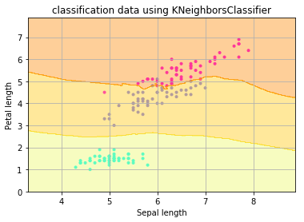

# K近傍法

```python
import pandas as pd
from sklearn import datasets
from sklearn.model_selection import train_test_split
import numpy as np
import matplotlib.pyplot as plt
import matplotlib
from sklearn.neighbors import KNeighborsClassifier
%matplotlib inline

# データの生成
iris = datasets.load_iris()
X = iris.data[:, [0, 2]]
y = iris.target
train_X, test_X, train_y, test_y = train_test_split(
    X, y, test_size=0.3, random_state=42)

# モデルの構築
model = KNeighborsClassifier()

# モデルの学習
model.fit(train_X, train_y)

# 正解率の表示
print(model.score(test_X, test_y))

# 可視化
plt.scatter(X[:, 0], X[:, 1], c=y, marker=".",
            cmap=matplotlib.cm.get_cmap(name="cool"), alpha=1.0)

x1_min, x1_max = X[:, 0].min() - 1, X[:, 0].max() + 1
x2_min, x2_max = X[:, 1].min() - 1, X[:, 1].max() + 1
xx1, xx2 = np.meshgrid(np.arange(x1_min, x1_max, 0.02),
                       np.arange(x2_min, x2_max, 0.02))
Z = model.predict(np.array([xx1.ravel(), xx2.ravel()]).T).reshape((xx1.shape))
plt.contourf(xx1, xx2, Z, alpha=0.4, cmap=matplotlib.cm.get_cmap(name="Wistia"))
plt.xlim(xx1.min(), xx1.max())
plt.ylim(xx2.min(), xx2.max())
plt.title("classification data using KNeighborsClassifier")
plt.xlabel("Sepal length")
plt.ylabel("Petal length")
plt.grid(True)
plt.show()
```

```
0.9777777777777777
```




scikit-learnのサブモジュールneighborsにある`KNeighborsClassifier()`を使う