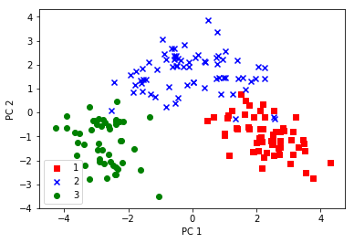

# 主成分分析

```python
from sklearn.decomposition import PCA
# 主成分数を指定して、PCAのインスタンスを生成。引数で変換後の次元数を指定します。
pca = PCA(n_components=2)
# データから変換モデルを学習し、変換する。
X_pca = pca.fit_transform(X)

```
　`fit_transform()` メソッドでは、内部で自動的に変換行列を生成しています。

```python
from sklearn.decomposition import PCA
# 主成分数を指定して、PCAのインスタンスを生成。引数で変換後の次元数を指定します。
pca = PCA(n_components=2)
# データから変換モデルを学習し、変換する。
X_pca = pca.fit_transform(X)

```

```python
import pandas as pd
import numpy as np
import matplotlib.pyplot as plt

from sklearn.decomposition import PCA

df_wine = pd.read_csv("./data/wine.csv", header=None)
X, y = df_wine.iloc[:, 1:].values, df_wine.iloc[:, 0].values
X = (X - X.mean(axis=0)) / X.std(axis=0)

# 主成分分析のインスタンスを生成
pca = PCA(n_components=2)

# データから変換モデルを学習し、変換する。
X_pca = pca.fit_transform(X)

# 可視化
color = ["r", "b", "g"]
marker = ["s", "x", "o"]
for label, color, marker in zip(np.unique(y), color, marker):
    plt.scatter(X_pca[y == label, 0], X_pca[y == label, 1],
                c=color, marker=marker, label=label)
plt.xlabel("PC 1")
plt.ylabel("PC 2")
plt.legend(loc="lower left")
plt.show()

# 実行結果の確認
print(X_pca)
```

```
[[ 3.31675081 -1.44346263]
 [ 2.20946492  0.33339289]
 [ 2.51674015 -1.0311513 ]
 [ 3.75706561 -2.75637191]
 [ 1.00890849 -0.86983082]
 [ 3.05025392 -2.12240111]
 [ 2.44908967 -1.17485013]
 [ 2.05943687 -1.60896307]
 [ 2.5108743  -0.91807096]
 [ 2.75362819 -0.78943767]
 [ 3.47973668 -1.30233324]
 [ 1.7547529  -0.61197723]
 [ 2.11346234 -0.67570634]
 [ 3.45815682 -1.13062988]
 [ 4.31278391 -2.09597558]
 [ 2.3051882  -1.66255173]
 [ 2.17195527 -2.32730534]
 [ 1.89897118 -1.63136888]
 [ 3.54198508 -2.51834367]
 [ 2.0845222  -1.06113799]
 [ 3.12440254 -0.78689711]
 [ 1.08657007 -0.24174355]
 [ 2.53522408  0.09184062]
 [ 1.64498834  0.51627893]
 [ 1.76157587  0.31714893]
 [ 0.9900791  -0.94066734]
 [ 1.77527763 -0.68617513]
 [ 1.23542396  0.08980704]
 [ 2.18840633 -0.68956962]
 [ 2.25610898 -0.19146194]
 [ 2.50022003 -1.24083383]
 [ 2.67741105 -1.47187365]
 [ 1.62857912 -0.05270445]
 [ 1.90269086 -1.63306043]
 [ 1.41038853 -0.69793432]
 [ 1.90382623 -0.17671095]
 [ 1.38486223 -0.65863985]
 [ 1.12220741 -0.11410976]
 [ 1.5021945   0.76943201]
 [ 2.52980109 -1.80300198]
 [ 2.58809543 -0.7796163 ]
 [ 0.66848199 -0.16996094]
 [ 3.07080699 -1.15591896]
 [ 0.46220914 -0.33074213]
 [ 2.10135193  0.07100892]
 [ 1.13616618 -1.77710739]
 [ 2.72660096 -1.19133469]
 [ 2.82133927 -0.6462586 ]
 [ 2.00985085 -1.24702946]
 [ 2.7074913  -1.75196741]
 [ 3.21491747 -0.16699199]
 [ 2.85895983 -0.7452788 ]
 [ 3.50560436 -1.61273386]
 [ 2.22479138 -1.875168  ]
 [ 2.14698782 -1.01675154]
 [ 2.46932948 -1.32900831]
 [ 2.74151791 -1.43654878]
 [ 2.17374092 -1.21219984]
 [ 3.13938015 -1.73157912]
 [-0.92858197  3.07348616]
 [-1.54248014  1.38144351]
 [-1.83624976  0.82998412]
 [ 0.03060683  1.26278614]
 [ 2.05026161  1.9250326 ]
 [-0.60968083  1.90805881]
 [ 0.90022784  0.76391147]
 [ 2.24850719  1.88459248]
 [ 0.18338403  2.42714611]
 [-0.81280503  0.22051399]
 [ 1.9756205   1.40328323]
 [-1.57221622  0.88498314]
 [ 1.65768181  0.9567122 ]
 [-0.72537239  1.0636454 ]
 [ 2.56222717 -0.26019855]
 [ 1.83256757  1.2878782 ]
 [-0.8679929   2.44410119]
 [ 0.3700144   2.15390698]
 [-1.45737704  1.38335177]
 [ 1.26293085  0.77084953]
 [ 0.37615037  1.0270434 ]
 [ 0.7620639   3.37505381]
 [ 1.03457797  1.45070974]
 [-0.49487676  2.38124353]
 [-2.53897708  0.08744336]
 [ 0.83532015  1.47367055]
 [ 0.78790461  2.02662652]
 [-0.80683216  2.23383039]
 [-0.55804262  2.37298543]
 [-1.11511104  1.80224719]
 [-0.55572283  2.65754004]
 [-1.34928528  2.11800147]
 [-1.56448261  1.85221452]
 [-1.93255561  1.55949546]
 [ 0.74666594  2.31293171]
 [ 0.95745536  2.22352843]
 [ 2.54386518 -0.16927402]
 [-0.54395259  0.36892655]
 [ 1.03104975  2.56556935]
 [ 2.25190942  1.43274138]
 [ 1.41021602  2.16619177]
 [ 0.79771979  2.3769488 ]
 [-0.54953173  2.29312864]
 [-0.16117374  1.16448332]
 [-0.65979494  2.67996119]
 [ 0.39235441  2.09873171]
 [-1.77249908  1.71728847]
 [-0.36626736  2.1693533 ]
 [-1.62067257  1.35558339]
 [ 0.08253578  2.30623459]
 [ 1.57827507  1.46203429]
 [ 1.42056925  1.41820664]
 [-0.27870275  1.93056809]
 [-1.30314497  0.76317231]
 [-0.45707187  2.26941561]
 [-0.49418585  1.93904505]
 [ 0.48207441  3.87178385]
 [-0.25288888  2.82149237]
 [-0.10722764  1.92892204]
 [-2.4330126   1.25714104]
 [-0.55108954  2.22216155]
 [ 0.73962193  1.40895667]
 [ 1.33632173 -0.25333693]
 [-1.177087    0.66396684]
 [-0.46233501  0.61828818]
 [ 0.97847408  1.4455705 ]
 [-0.09680973  2.10999799]
 [ 0.03848715  1.26676211]
 [-1.5971585   1.20814357]
 [-0.47956492  1.93884066]
 [-1.79283347  1.1502881 ]
 [-1.32710166 -0.17038923]
 [-2.38450083 -0.37458261]
 [-2.9369401  -0.26386183]
 [-2.14681113 -0.36825495]
 [-2.36986949  0.45963481]
 [-3.06384157 -0.35341284]
 [-3.91575378 -0.15458252]
 [-3.93646339 -0.65968723]
 [-3.09427612 -0.34884276]
 [-2.37447163 -0.29198035]
 [-2.77881295 -0.28680487]
 [-2.28656128 -0.37250784]
 [-2.98563349 -0.48921791]
 [-2.3751947  -0.48233372]
 [-2.20986553 -1.1600525 ]
 [-2.625621   -0.56316076]
 [-4.28063878 -0.64967096]
 [-3.58264137 -1.27270275]
 [-2.80706372 -1.57053379]
 [-2.89965933 -2.04105701]
 [-2.32073698 -2.35636608]
 [-2.54983095 -2.04528309]
 [-1.81254128 -1.52764595]
 [-2.76014464 -2.13893235]
 [-2.7371505  -0.40988627]
 [-3.60486887 -1.80238422]
 [-2.889826   -1.92521861]
 [-3.39215608 -1.31187639]
 [-1.0481819  -3.51508969]
 [-1.60991228 -2.40663816]
 [-3.14313097 -0.73816104]
 [-2.2401569  -1.17546529]
 [-2.84767378 -0.55604397]
 [-2.59749706 -0.69796554]
 [-2.94929937 -1.55530896]
 [-3.53003227 -0.8825268 ]
 [-2.40611054 -2.59235618]
 [-2.92908473 -1.27444695]
 [-2.18141278 -2.07753731]
 [-2.38092779 -2.58866743]
 [-3.21161722  0.2512491 ]
 [-3.67791872 -0.84774784]
 [-2.4655558  -2.1937983 ]
 [-3.37052415 -2.21628914]
 [-2.60195585 -1.75722935]
 [-2.67783946 -2.76089913]
 [-2.38701709 -2.29734668]
 [-3.20875816 -2.76891957]]
```
