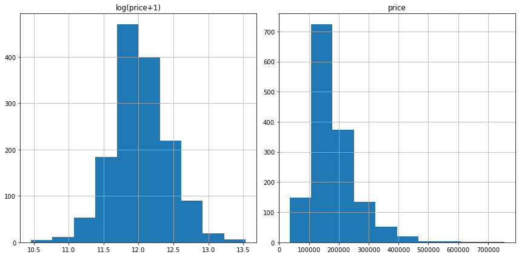
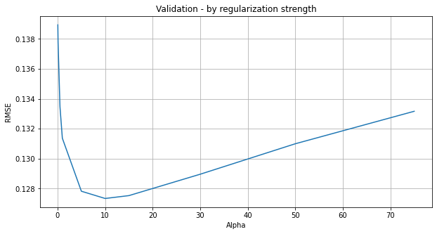
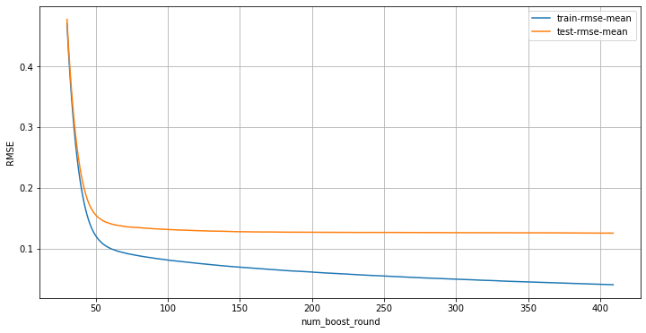

# 回帰モデルと勾配ブースティング木による住宅価格の予測

## House Priceのデータを前処理する


```python
!ls
```

    Regression_GBDT_tablemethod.ipynb
    data
    house-prices-advanced-regression-techniques.zip
    


```python
!ls data/house-prices-advanced-regression-techniques
```

    data_description.txt
    sample_submission.csv
    test.csv
    train.csv
    


```python
# 訓練データとテストデータを読み込む
import pandas as pd

train = pd.read_csv('./data/house-prices-advanced-regression-techniques/train.csv')
test = pd.read_csv('./data/house-prices-advanced-regression-techniques/test.csv')
print('train shape:{}'.format(train.shape))
print('test shape:{}'.format(test.shape))
```

    train shape:(1460, 81)
    test shape:(1459, 80)
    


```python
# 学習データ情報の出力
train.info
```


    <bound method DataFrame.info of         Id  MSSubClass MSZoning  LotFrontage  LotArea Street Alley LotShape  \
    0        1          60       RL         65.0     8450   Pave   NaN      Reg   
    1        2          20       RL         80.0     9600   Pave   NaN      Reg   
    2        3          60       RL         68.0    11250   Pave   NaN      IR1   
    3        4          70       RL         60.0     9550   Pave   NaN      IR1   
    4        5          60       RL         84.0    14260   Pave   NaN      IR1   
    ...    ...         ...      ...          ...      ...    ...   ...      ...   
    1455  1456          60       RL         62.0     7917   Pave   NaN      Reg   
    1456  1457          20       RL         85.0    13175   Pave   NaN      Reg   
    1457  1458          70       RL         66.0     9042   Pave   NaN      Reg   
    1458  1459          20       RL         68.0     9717   Pave   NaN      Reg   
    1459  1460          20       RL         75.0     9937   Pave   NaN      Reg   
    
         LandContour Utilities  ... PoolArea PoolQC  Fence MiscFeature MiscVal  \
    0            Lvl    AllPub  ...        0    NaN    NaN         NaN       0   
    1            Lvl    AllPub  ...        0    NaN    NaN         NaN       0   
    2            Lvl    AllPub  ...        0    NaN    NaN         NaN       0   
    3            Lvl    AllPub  ...        0    NaN    NaN         NaN       0   
    4            Lvl    AllPub  ...        0    NaN    NaN         NaN       0   
    ...          ...       ...  ...      ...    ...    ...         ...     ...   
    1455         Lvl    AllPub  ...        0    NaN    NaN         NaN       0   
    1456         Lvl    AllPub  ...        0    NaN  MnPrv         NaN       0   
    1457         Lvl    AllPub  ...        0    NaN  GdPrv        Shed    2500   
    1458         Lvl    AllPub  ...        0    NaN    NaN         NaN       0   
    1459         Lvl    AllPub  ...        0    NaN    NaN         NaN       0   
    
         MoSold YrSold  SaleType  SaleCondition  SalePrice  
    0         2   2008        WD         Normal     208500  
    1         5   2007        WD         Normal     181500  
    2         9   2008        WD         Normal     223500  
    3         2   2006        WD        Abnorml     140000  
    4        12   2008        WD         Normal     250000  
    ...     ...    ...       ...            ...        ...  
    1455      8   2007        WD         Normal     175000  
    1456      2   2010        WD         Normal     210000  
    1457      5   2010        WD         Normal     266500  
    1458      4   2010        WD         Normal     142125  
    1459      6   2008        WD         Normal     147500  
    
    [1460 rows x 81 columns]>


```python
# 欠損値数の確認
print('Number of missing values {}'.format((train.isnull().sum() != 0).sum()))
```

    Number of missing values 19
    


```python
train.head()
```


<div>
<style scoped>
    .dataframe tbody tr th:only-of-type {
        vertical-align: middle;
    }

    .dataframe tbody tr th {
        vertical-align: top;
    }

    .dataframe thead th {
        text-align: right;
    }
</style>
<table border="1" class="dataframe">
  <thead>
    <tr style="text-align: right;">
      <th></th>
      <th>Id</th>
      <th>MSSubClass</th>
      <th>MSZoning</th>
      <th>LotFrontage</th>
      <th>LotArea</th>
      <th>Street</th>
      <th>Alley</th>
      <th>LotShape</th>
      <th>LandContour</th>
      <th>Utilities</th>
      <th>...</th>
      <th>PoolArea</th>
      <th>PoolQC</th>
      <th>Fence</th>
      <th>MiscFeature</th>
      <th>MiscVal</th>
      <th>MoSold</th>
      <th>YrSold</th>
      <th>SaleType</th>
      <th>SaleCondition</th>
      <th>SalePrice</th>
    </tr>
  </thead>
  <tbody>
    <tr>
      <th>0</th>
      <td>1</td>
      <td>60</td>
      <td>RL</td>
      <td>65.0</td>
      <td>8450</td>
      <td>Pave</td>
      <td>NaN</td>
      <td>Reg</td>
      <td>Lvl</td>
      <td>AllPub</td>
      <td>...</td>
      <td>0</td>
      <td>NaN</td>
      <td>NaN</td>
      <td>NaN</td>
      <td>0</td>
      <td>2</td>
      <td>2008</td>
      <td>WD</td>
      <td>Normal</td>
      <td>208500</td>
    </tr>
    <tr>
      <th>1</th>
      <td>2</td>
      <td>20</td>
      <td>RL</td>
      <td>80.0</td>
      <td>9600</td>
      <td>Pave</td>
      <td>NaN</td>
      <td>Reg</td>
      <td>Lvl</td>
      <td>AllPub</td>
      <td>...</td>
      <td>0</td>
      <td>NaN</td>
      <td>NaN</td>
      <td>NaN</td>
      <td>0</td>
      <td>5</td>
      <td>2007</td>
      <td>WD</td>
      <td>Normal</td>
      <td>181500</td>
    </tr>
    <tr>
      <th>2</th>
      <td>3</td>
      <td>60</td>
      <td>RL</td>
      <td>68.0</td>
      <td>11250</td>
      <td>Pave</td>
      <td>NaN</td>
      <td>IR1</td>
      <td>Lvl</td>
      <td>AllPub</td>
      <td>...</td>
      <td>0</td>
      <td>NaN</td>
      <td>NaN</td>
      <td>NaN</td>
      <td>0</td>
      <td>9</td>
      <td>2008</td>
      <td>WD</td>
      <td>Normal</td>
      <td>223500</td>
    </tr>
    <tr>
      <th>3</th>
      <td>4</td>
      <td>70</td>
      <td>RL</td>
      <td>60.0</td>
      <td>9550</td>
      <td>Pave</td>
      <td>NaN</td>
      <td>IR1</td>
      <td>Lvl</td>
      <td>AllPub</td>
      <td>...</td>
      <td>0</td>
      <td>NaN</td>
      <td>NaN</td>
      <td>NaN</td>
      <td>0</td>
      <td>2</td>
      <td>2006</td>
      <td>WD</td>
      <td>Abnorml</td>
      <td>140000</td>
    </tr>
    <tr>
      <th>4</th>
      <td>5</td>
      <td>60</td>
      <td>RL</td>
      <td>84.0</td>
      <td>14260</td>
      <td>Pave</td>
      <td>NaN</td>
      <td>IR1</td>
      <td>Lvl</td>
      <td>AllPub</td>
      <td>...</td>
      <td>0</td>
      <td>NaN</td>
      <td>NaN</td>
      <td>NaN</td>
      <td>0</td>
      <td>12</td>
      <td>2008</td>
      <td>WD</td>
      <td>Normal</td>
      <td>250000</td>
    </tr>
  </tbody>
</table>
<p>5 rows × 81 columns</p>
</div>


## 説明変数 `SalePrice`の確認


```python
SalePrice = train['SalePrice']
SalePrice.mean(), SalePrice.median(), SalePrice.max(), SalePrice.min()
```


    (180921.19589041095, 163000.0, 755000, 34900)


`SalePrice`の値が低い部分に偏っているので、対数変換して正規分布に近似させます。


```python
import numpy as np
import matplotlib.pyplot as plt
from scipy.stats import skew
%matplotlib inline

# Salepriceについて艇をeとするa+1の対数に変換し、
# 元の値とともにデータフレームに登録
prices = pd.DataFrame({
    'price':train['SalePrice'],
    'log(price+1)':np.log1p(train['SalePrice'])    # 対数変換の実施
                     })

print(prices, '\n')
# 歪度の表示
# 分布のひずみ具合の表示
print('price skew        :{}'.format(skew(prices['price'])))
print('log(price+1) skew :{}'.format(skew(prices['log(price+1)'])))

# SalePriceの変換前と変換後をヒストグラムにする
# プロット図のサイズを設定
plt.rcParams['figure.figsize'] = (12.0, 6.0)
prices.hist()
plt.tight_layout()
```

           price  log(price+1)
    0     208500     12.247699
    1     181500     12.109016
    2     223500     12.317171
    3     140000     11.849405
    4     250000     12.429220
    ...      ...           ...
    1455  175000     12.072547
    1456  210000     12.254868
    1457  266500     12.493133
    1458  142125     11.864469
    1459  147500     11.901590
    
    [1460 rows x 2 columns] 
    
    price skew        :1.880940746034036
    log(price+1) skew :0.12122191311528363
    





歪度は分布の歪み具合を表し0に近いほど良いです。<br>歪度の求め方は標準化を行い3乗した値の平均が歪度の値になります。

変換前に比べて変換後はほぼ正規分布のかたちになっていることが確認できました。<br>訓練データの`SalePrice`は対数変換します。


```python
# SalePriceの値を、底をeとするa+1の対数に変換する
train['SalePrice'] = np.log1p(train['SalePrice'])
```

## 訓練データとテストデータを連結して前処理を行う

データの前処理を一度に行うために訓練データとテストデータを縦連結して1つのデータフレームにします。<br>`id`と`SalePrice`カラムは除いて連結を行います。


```python
train.head(1)
```


<div>
<style scoped>
    .dataframe tbody tr th:only-of-type {
        vertical-align: middle;
    }

    .dataframe tbody tr th {
        vertical-align: top;
    }

    .dataframe thead th {
        text-align: right;
    }
</style>
<table border="1" class="dataframe">
  <thead>
    <tr style="text-align: right;">
      <th></th>
      <th>Id</th>
      <th>MSSubClass</th>
      <th>MSZoning</th>
      <th>LotFrontage</th>
      <th>LotArea</th>
      <th>Street</th>
      <th>Alley</th>
      <th>LotShape</th>
      <th>LandContour</th>
      <th>Utilities</th>
      <th>...</th>
      <th>PoolArea</th>
      <th>PoolQC</th>
      <th>Fence</th>
      <th>MiscFeature</th>
      <th>MiscVal</th>
      <th>MoSold</th>
      <th>YrSold</th>
      <th>SaleType</th>
      <th>SaleCondition</th>
      <th>SalePrice</th>
    </tr>
  </thead>
  <tbody>
    <tr>
      <th>0</th>
      <td>1</td>
      <td>60</td>
      <td>RL</td>
      <td>65.0</td>
      <td>8450</td>
      <td>Pave</td>
      <td>NaN</td>
      <td>Reg</td>
      <td>Lvl</td>
      <td>AllPub</td>
      <td>...</td>
      <td>0</td>
      <td>NaN</td>
      <td>NaN</td>
      <td>NaN</td>
      <td>0</td>
      <td>2</td>
      <td>2008</td>
      <td>WD</td>
      <td>Normal</td>
      <td>12.247699</td>
    </tr>
  </tbody>
</table>
<p>1 rows × 81 columns</p>
</div>


```python
train.shape, test.shape, train.shape[0] + test.shape[0]
```


    ((1460, 81), (1459, 80), 2919)


```python
all_data = pd.concat((
    train.loc[:, 'MSSubClass':'SaleCondition'],
    test.loc[:, 'MSSubClass':'SaleCondition']
))

print('all data shape is {}'.format(all_data.shape))
all_data.head()
```

    all data shape is (2919, 79)
    


<div>
<style scoped>
    .dataframe tbody tr th:only-of-type {
        vertical-align: middle;
    }

    .dataframe tbody tr th {
        vertical-align: top;
    }

    .dataframe thead th {
        text-align: right;
    }
</style>
<table border="1" class="dataframe">
  <thead>
    <tr style="text-align: right;">
      <th></th>
      <th>MSSubClass</th>
      <th>MSZoning</th>
      <th>LotFrontage</th>
      <th>LotArea</th>
      <th>Street</th>
      <th>Alley</th>
      <th>LotShape</th>
      <th>LandContour</th>
      <th>Utilities</th>
      <th>LotConfig</th>
      <th>...</th>
      <th>ScreenPorch</th>
      <th>PoolArea</th>
      <th>PoolQC</th>
      <th>Fence</th>
      <th>MiscFeature</th>
      <th>MiscVal</th>
      <th>MoSold</th>
      <th>YrSold</th>
      <th>SaleType</th>
      <th>SaleCondition</th>
    </tr>
  </thead>
  <tbody>
    <tr>
      <th>0</th>
      <td>60</td>
      <td>RL</td>
      <td>65.0</td>
      <td>8450</td>
      <td>Pave</td>
      <td>NaN</td>
      <td>Reg</td>
      <td>Lvl</td>
      <td>AllPub</td>
      <td>Inside</td>
      <td>...</td>
      <td>0</td>
      <td>0</td>
      <td>NaN</td>
      <td>NaN</td>
      <td>NaN</td>
      <td>0</td>
      <td>2</td>
      <td>2008</td>
      <td>WD</td>
      <td>Normal</td>
    </tr>
    <tr>
      <th>1</th>
      <td>20</td>
      <td>RL</td>
      <td>80.0</td>
      <td>9600</td>
      <td>Pave</td>
      <td>NaN</td>
      <td>Reg</td>
      <td>Lvl</td>
      <td>AllPub</td>
      <td>FR2</td>
      <td>...</td>
      <td>0</td>
      <td>0</td>
      <td>NaN</td>
      <td>NaN</td>
      <td>NaN</td>
      <td>0</td>
      <td>5</td>
      <td>2007</td>
      <td>WD</td>
      <td>Normal</td>
    </tr>
    <tr>
      <th>2</th>
      <td>60</td>
      <td>RL</td>
      <td>68.0</td>
      <td>11250</td>
      <td>Pave</td>
      <td>NaN</td>
      <td>IR1</td>
      <td>Lvl</td>
      <td>AllPub</td>
      <td>Inside</td>
      <td>...</td>
      <td>0</td>
      <td>0</td>
      <td>NaN</td>
      <td>NaN</td>
      <td>NaN</td>
      <td>0</td>
      <td>9</td>
      <td>2008</td>
      <td>WD</td>
      <td>Normal</td>
    </tr>
    <tr>
      <th>3</th>
      <td>70</td>
      <td>RL</td>
      <td>60.0</td>
      <td>9550</td>
      <td>Pave</td>
      <td>NaN</td>
      <td>IR1</td>
      <td>Lvl</td>
      <td>AllPub</td>
      <td>Corner</td>
      <td>...</td>
      <td>0</td>
      <td>0</td>
      <td>NaN</td>
      <td>NaN</td>
      <td>NaN</td>
      <td>0</td>
      <td>2</td>
      <td>2006</td>
      <td>WD</td>
      <td>Abnorml</td>
    </tr>
    <tr>
      <th>4</th>
      <td>60</td>
      <td>RL</td>
      <td>84.0</td>
      <td>14260</td>
      <td>Pave</td>
      <td>NaN</td>
      <td>IR1</td>
      <td>Lvl</td>
      <td>AllPub</td>
      <td>FR2</td>
      <td>...</td>
      <td>0</td>
      <td>0</td>
      <td>NaN</td>
      <td>NaN</td>
      <td>NaN</td>
      <td>0</td>
      <td>12</td>
      <td>2008</td>
      <td>WD</td>
      <td>Normal</td>
    </tr>
  </tbody>
</table>
<p>5 rows × 79 columns</p>
</div>


## 数値型のカラムで分布に偏りがある場合は対数変換する

歪度は0に近づくにつれ左右対称の分布になります。<br>厳密にいうと性格に左右対称の分布になるわけではなく、<br>あくまで平均0の右側にある標準化した値の3乗の和と平均0の左側にある値の3乗の和が同じになります。

歪度についての一般的な経験則として、以下のことが言われています。

- 歪度が-1未満または1を超える場合は、分布は非常に歪んでいる
- 歪度が-1から-0.5の間、または0.5から1の間にある場合、<br>分布はわずかに歪んでいる
- 歪度が-0.5から0.5の間の場合、分布はおよそ対称です

歪度が＋0.75を超える歪んだカラムは対数変換を行って正規分布に近似させます。<br>歪度マイナス値に関しては拗ねて-0.75までの範囲に収まっているので対数変換は行いません。


```python
from scipy.stats import skew

# object型ではないカラムのインデックスを取得
num_feat = all_data.dtypes[all_data.dtypes != 'object'].index
print('column of non-object type')
print(num_feat)

# object型ではないカラムの歪度を、欠損値を除いてから求める
skew_feats = train[num_feat].apply(lambda x: skew(x.dropna()))
print('-----Skew Non-object-type-----')
print(skew_feats)

# 歪度が0.75以上のカラムを取得
skew_feats = skew_feats[skew_feats > 0.75]
# 歪度が0.75以上のカラムの表示
print('skewness greater than 0.75')
print(skew_feats)

# 抽出したカラムのインデックスを取得
skew_feats = skew_feats.index

# 歪度が0.75以上のカラムを大衆変換する
all_data[skew_feats] = np.log1p(all_data[skew_feats])
all_data[skew_feats]    # 歪度が0.75以上のカラム対数変換後を出力
```

    column of non-object type
    Index(['MSSubClass', 'LotFrontage', 'LotArea', 'OverallQual', 'OverallCond',
           'YearBuilt', 'YearRemodAdd', 'MasVnrArea', 'BsmtFinSF1', 'BsmtFinSF2',
           'BsmtUnfSF', 'TotalBsmtSF', '1stFlrSF', '2ndFlrSF', 'LowQualFinSF',
           'GrLivArea', 'BsmtFullBath', 'BsmtHalfBath', 'FullBath', 'HalfBath',
           'BedroomAbvGr', 'KitchenAbvGr', 'TotRmsAbvGrd', 'Fireplaces',
           'GarageYrBlt', 'GarageCars', 'GarageArea', 'WoodDeckSF', 'OpenPorchSF',
           'EnclosedPorch', '3SsnPorch', 'ScreenPorch', 'PoolArea', 'MiscVal',
           'MoSold', 'YrSold'],
          dtype='object')
    -----Skew Non-object-type-----
    MSSubClass        1.406210
    LotFrontage       2.160866
    LotArea          12.195142
    OverallQual       0.216721
    OverallCond       0.692355
    YearBuilt        -0.612831
    YearRemodAdd     -0.503044
    MasVnrArea        2.666326
    BsmtFinSF1        1.683771
    BsmtFinSF2        4.250888
    BsmtUnfSF         0.919323
    TotalBsmtSF       1.522688
    1stFlrSF          1.375342
    2ndFlrSF          0.812194
    LowQualFinSF      9.002080
    GrLivArea         1.365156
    BsmtFullBath      0.595454
    BsmtHalfBath      4.099186
    FullBath          0.036524
    HalfBath          0.675203
    BedroomAbvGr      0.211572
    KitchenAbvGr      4.483784
    TotRmsAbvGrd      0.675646
    Fireplaces        0.648898
    GarageYrBlt      -0.648708
    GarageCars       -0.342197
    GarageArea        0.179796
    WoodDeckSF        1.539792
    OpenPorchSF       2.361912
    EnclosedPorch     3.086696
    3SsnPorch        10.293752
    ScreenPorch       4.117977
    PoolArea         14.813135
    MiscVal          24.451640
    MoSold            0.211835
    YrSold            0.096170
    dtype: float64
    skewness greater than 0.75
    MSSubClass        1.406210
    LotFrontage       2.160866
    LotArea          12.195142
    MasVnrArea        2.666326
    BsmtFinSF1        1.683771
    BsmtFinSF2        4.250888
    BsmtUnfSF         0.919323
    TotalBsmtSF       1.522688
    1stFlrSF          1.375342
    2ndFlrSF          0.812194
    LowQualFinSF      9.002080
    GrLivArea         1.365156
    BsmtHalfBath      4.099186
    KitchenAbvGr      4.483784
    WoodDeckSF        1.539792
    OpenPorchSF       2.361912
    EnclosedPorch     3.086696
    3SsnPorch        10.293752
    ScreenPorch       4.117977
    PoolArea         14.813135
    MiscVal          24.451640
    dtype: float64
    


<div>
<style scoped>
    .dataframe tbody tr th:only-of-type {
        vertical-align: middle;
    }

    .dataframe tbody tr th {
        vertical-align: top;
    }

    .dataframe thead th {
        text-align: right;
    }
</style>
<table border="1" class="dataframe">
  <thead>
    <tr style="text-align: right;">
      <th></th>
      <th>MSSubClass</th>
      <th>LotFrontage</th>
      <th>LotArea</th>
      <th>MasVnrArea</th>
      <th>BsmtFinSF1</th>
      <th>BsmtFinSF2</th>
      <th>BsmtUnfSF</th>
      <th>TotalBsmtSF</th>
      <th>1stFlrSF</th>
      <th>2ndFlrSF</th>
      <th>...</th>
      <th>GrLivArea</th>
      <th>BsmtHalfBath</th>
      <th>KitchenAbvGr</th>
      <th>WoodDeckSF</th>
      <th>OpenPorchSF</th>
      <th>EnclosedPorch</th>
      <th>3SsnPorch</th>
      <th>ScreenPorch</th>
      <th>PoolArea</th>
      <th>MiscVal</th>
    </tr>
  </thead>
  <tbody>
    <tr>
      <th>0</th>
      <td>4.110874</td>
      <td>4.189655</td>
      <td>9.042040</td>
      <td>5.283204</td>
      <td>6.561031</td>
      <td>0.0</td>
      <td>5.017280</td>
      <td>6.753438</td>
      <td>6.753438</td>
      <td>6.751101</td>
      <td>...</td>
      <td>7.444833</td>
      <td>0.000000</td>
      <td>0.693147</td>
      <td>0.000000</td>
      <td>4.127134</td>
      <td>0.000000</td>
      <td>0.0</td>
      <td>0.0</td>
      <td>0.0</td>
      <td>0.000000</td>
    </tr>
    <tr>
      <th>1</th>
      <td>3.044522</td>
      <td>4.394449</td>
      <td>9.169623</td>
      <td>0.000000</td>
      <td>6.886532</td>
      <td>0.0</td>
      <td>5.652489</td>
      <td>7.141245</td>
      <td>7.141245</td>
      <td>0.000000</td>
      <td>...</td>
      <td>7.141245</td>
      <td>0.693147</td>
      <td>0.693147</td>
      <td>5.700444</td>
      <td>0.000000</td>
      <td>0.000000</td>
      <td>0.0</td>
      <td>0.0</td>
      <td>0.0</td>
      <td>0.000000</td>
    </tr>
    <tr>
      <th>2</th>
      <td>4.110874</td>
      <td>4.234107</td>
      <td>9.328212</td>
      <td>5.093750</td>
      <td>6.188264</td>
      <td>0.0</td>
      <td>6.075346</td>
      <td>6.825460</td>
      <td>6.825460</td>
      <td>6.765039</td>
      <td>...</td>
      <td>7.488294</td>
      <td>0.000000</td>
      <td>0.693147</td>
      <td>0.000000</td>
      <td>3.761200</td>
      <td>0.000000</td>
      <td>0.0</td>
      <td>0.0</td>
      <td>0.0</td>
      <td>0.000000</td>
    </tr>
    <tr>
      <th>3</th>
      <td>4.262680</td>
      <td>4.110874</td>
      <td>9.164401</td>
      <td>0.000000</td>
      <td>5.379897</td>
      <td>0.0</td>
      <td>6.293419</td>
      <td>6.629363</td>
      <td>6.869014</td>
      <td>6.629363</td>
      <td>...</td>
      <td>7.448916</td>
      <td>0.000000</td>
      <td>0.693147</td>
      <td>0.000000</td>
      <td>3.583519</td>
      <td>5.609472</td>
      <td>0.0</td>
      <td>0.0</td>
      <td>0.0</td>
      <td>0.000000</td>
    </tr>
    <tr>
      <th>4</th>
      <td>4.110874</td>
      <td>4.442651</td>
      <td>9.565284</td>
      <td>5.860786</td>
      <td>6.486161</td>
      <td>0.0</td>
      <td>6.196444</td>
      <td>7.044033</td>
      <td>7.044033</td>
      <td>6.960348</td>
      <td>...</td>
      <td>7.695758</td>
      <td>0.000000</td>
      <td>0.693147</td>
      <td>5.262690</td>
      <td>4.442651</td>
      <td>0.000000</td>
      <td>0.0</td>
      <td>0.0</td>
      <td>0.0</td>
      <td>0.000000</td>
    </tr>
    <tr>
      <th>...</th>
      <td>...</td>
      <td>...</td>
      <td>...</td>
      <td>...</td>
      <td>...</td>
      <td>...</td>
      <td>...</td>
      <td>...</td>
      <td>...</td>
      <td>...</td>
      <td>...</td>
      <td>...</td>
      <td>...</td>
      <td>...</td>
      <td>...</td>
      <td>...</td>
      <td>...</td>
      <td>...</td>
      <td>...</td>
      <td>...</td>
      <td>...</td>
    </tr>
    <tr>
      <th>1454</th>
      <td>5.081404</td>
      <td>3.091042</td>
      <td>7.568896</td>
      <td>0.000000</td>
      <td>0.000000</td>
      <td>0.0</td>
      <td>6.304449</td>
      <td>6.304449</td>
      <td>6.304449</td>
      <td>6.304449</td>
      <td>...</td>
      <td>6.996681</td>
      <td>0.000000</td>
      <td>0.693147</td>
      <td>0.000000</td>
      <td>0.000000</td>
      <td>0.000000</td>
      <td>0.0</td>
      <td>0.0</td>
      <td>0.0</td>
      <td>0.000000</td>
    </tr>
    <tr>
      <th>1455</th>
      <td>5.081404</td>
      <td>3.091042</td>
      <td>7.546974</td>
      <td>0.000000</td>
      <td>5.533389</td>
      <td>0.0</td>
      <td>5.686975</td>
      <td>6.304449</td>
      <td>6.304449</td>
      <td>6.304449</td>
      <td>...</td>
      <td>6.996681</td>
      <td>0.000000</td>
      <td>0.693147</td>
      <td>0.000000</td>
      <td>3.218876</td>
      <td>0.000000</td>
      <td>0.0</td>
      <td>0.0</td>
      <td>0.0</td>
      <td>0.000000</td>
    </tr>
    <tr>
      <th>1456</th>
      <td>3.044522</td>
      <td>5.081404</td>
      <td>9.903538</td>
      <td>0.000000</td>
      <td>7.110696</td>
      <td>0.0</td>
      <td>0.000000</td>
      <td>7.110696</td>
      <td>7.110696</td>
      <td>0.000000</td>
      <td>...</td>
      <td>7.110696</td>
      <td>0.000000</td>
      <td>0.693147</td>
      <td>6.163315</td>
      <td>0.000000</td>
      <td>0.000000</td>
      <td>0.0</td>
      <td>0.0</td>
      <td>0.0</td>
      <td>0.000000</td>
    </tr>
    <tr>
      <th>1457</th>
      <td>4.454347</td>
      <td>4.143135</td>
      <td>9.253591</td>
      <td>0.000000</td>
      <td>5.823046</td>
      <td>0.0</td>
      <td>6.356108</td>
      <td>6.816736</td>
      <td>6.878326</td>
      <td>0.000000</td>
      <td>...</td>
      <td>6.878326</td>
      <td>0.693147</td>
      <td>0.693147</td>
      <td>4.394449</td>
      <td>3.496508</td>
      <td>0.000000</td>
      <td>0.0</td>
      <td>0.0</td>
      <td>0.0</td>
      <td>6.552508</td>
    </tr>
    <tr>
      <th>1458</th>
      <td>4.110874</td>
      <td>4.317488</td>
      <td>9.172431</td>
      <td>4.553877</td>
      <td>6.632002</td>
      <td>0.0</td>
      <td>5.476464</td>
      <td>6.904751</td>
      <td>6.904751</td>
      <td>6.912743</td>
      <td>...</td>
      <td>7.601402</td>
      <td>0.000000</td>
      <td>0.693147</td>
      <td>5.252273</td>
      <td>3.891820</td>
      <td>0.000000</td>
      <td>0.0</td>
      <td>0.0</td>
      <td>0.0</td>
      <td>0.000000</td>
    </tr>
  </tbody>
</table>
<p>2919 rows × 21 columns</p>
</div>


## カテゴリカルなデータを情報表現（ダミー変数）に変換


```python
# カテゴリカルデータのカラム取得
categorical = all_data.dtypes[all_data.dtypes == 'object']
categorical.index
```


    Index(['MSZoning', 'Street', 'Alley', 'LotShape', 'LandContour', 'Utilities',
           'LotConfig', 'LandSlope', 'Neighborhood', 'Condition1', 'Condition2',
           'BldgType', 'HouseStyle', 'RoofStyle', 'RoofMatl', 'Exterior1st',
           'Exterior2nd', 'MasVnrType', 'ExterQual', 'ExterCond', 'Foundation',
           'BsmtQual', 'BsmtCond', 'BsmtExposure', 'BsmtFinType1', 'BsmtFinType2',
           'Heating', 'HeatingQC', 'CentralAir', 'Electrical', 'KitchenQual',
           'Functional', 'FireplaceQu', 'GarageType', 'GarageFinish', 'GarageQual',
           'GarageCond', 'PavedDrive', 'PoolQC', 'Fence', 'MiscFeature',
           'SaleType', 'SaleCondition'],
          dtype='object')


```python
# ダミーデータの作成（テスト）
cc_data = pd.get_dummies(train['LotShape'])
# 元の'LotShape'を追加
cc_data['LotShape'] = train['LotShape']
cc_data[:5]
```


<div>
<style scoped>
    .dataframe tbody tr th:only-of-type {
        vertical-align: middle;
    }

    .dataframe tbody tr th {
        vertical-align: top;
    }

    .dataframe thead th {
        text-align: right;
    }
</style>
<table border="1" class="dataframe">
  <thead>
    <tr style="text-align: right;">
      <th></th>
      <th>IR1</th>
      <th>IR2</th>
      <th>IR3</th>
      <th>Reg</th>
      <th>LotShape</th>
    </tr>
  </thead>
  <tbody>
    <tr>
      <th>0</th>
      <td>0</td>
      <td>0</td>
      <td>0</td>
      <td>1</td>
      <td>Reg</td>
    </tr>
    <tr>
      <th>1</th>
      <td>0</td>
      <td>0</td>
      <td>0</td>
      <td>1</td>
      <td>Reg</td>
    </tr>
    <tr>
      <th>2</th>
      <td>1</td>
      <td>0</td>
      <td>0</td>
      <td>0</td>
      <td>IR1</td>
    </tr>
    <tr>
      <th>3</th>
      <td>1</td>
      <td>0</td>
      <td>0</td>
      <td>0</td>
      <td>IR1</td>
    </tr>
    <tr>
      <th>4</th>
      <td>1</td>
      <td>0</td>
      <td>0</td>
      <td>0</td>
      <td>IR1</td>
    </tr>
  </tbody>
</table>
</div>


カテゴリカルなカラムを自動検出し、ダミー変数に変換します。<br>この方法ですべてのカテゴリカルなデータをダミー変数に変換します。


```python
# カテゴリカルデータをダミー変数に変換
all_data = pd.get_dummies(all_data)
```

## 欠損値をデータの平均値に置き換える


```python
# 欠損値数の確認
print('Number of missing values {}'.format((all_data.isnull().sum() != 0).sum()))
```

    Number of missing values 11
    


```python
# all_dataにある欠損値のカラム数を表示（訓練データのみ処理を行う）
(all_data[:train.shape[0]].isnull().sum() != 0).sum()
```


    3


```python
# 欠損値を平均値に変換する
all_data = all_data.fillna(all_data[:train.shape[0]].mean())
```


```python
# all_dataにある欠損値のカラム数を表示
(all_data[:train.shape[0]].isnull().sum() != 0).sum()
```


    0


## 回帰モデルによる学習

リッジ回帰とラッソ回帰で学習を行い、損失（RMSE）を確認します。

## リッジ回帰とラッソ回帰の正則化手法の違い

線形回帰では、回帰式を用いた予測が行われます。<br>以下は多項式回帰で一般的に用いられる式です。

$$f_w(x)=w_0+w_1x+w_2x^2+\dots+w_nx^n$$

$f_w(x)$は変数$x$に対する重み$w$の関数であることを示しています。<br>結果は
予測値として得られます。<br>線形回帰の目的は、式$f_w(x)$で求められる予測値はと
実測値（正解値）の誤差が最小になる$w$を求めることにあります。<br>このときの誤差$E(w)$の最もシンプルな測定法は、平均二乗誤差を使用する方法です。

今回は、二乗平方根誤差（RMSE）を誤差関数として用います。<br>RMSEは予測値が正解を大きく上回る状態になった場合に、より大きな損失$E(w)$になりブレの大きな価格の予測に適しています。

#### リッジ回帰

正則化された線形回帰の1つで、線形回帰の誤差関数に「重みの二乗和（L2正則化項）」を加えたものです。<br>L2正則化項は、数学的にものの長さを表す **ユークリッド距離** と呼ばれています。

L2正則化のハイパーパラメータである$\lambda$の値を増やすことでL2正則化項（L2ペナルティ）の値を大きくして正則化の強さを引き上げ、モデルの重みが小さくなるようにします。<br>つまり、重みの影響が大きくなりすぎないようにすることで、過学習を防ぎます。

L2正則化項による正則化では、重みは完全に0にならない性質を持ち、変数が多いと計算が煩雑になる傾向があります。

#### ラッソ回帰

ラッソ回帰は正則化された線形回帰です。<br>「重みの和（L1正則化項）」を加えたものです。<br>ラッソ回帰は不要と判断される説明変数の係数（重み）が0になる傾向があります。<br>このことは目的変数に影響のある説明変数だけが自動的に採択されることを意味するので、モデルに含まれる変数の数が限定され、解釈が容易になり（スパースな解を求めることができ）ます。<br>

## リッジ回帰モデルで学習する

L2正則化による回帰分析を、正則化の強度を11パターン用意して、<br>それぞれの強度でどのくらい損失が出るのかを調べてみます。


```python
train.shape, test.shape, all_data.shape
```


    ((1460, 81), (1459, 80), (2919, 288))


```python
# 訓練データとテストデータに分ける
X_train = all_data[:train.shape[0]]
X_test = all_data[train.shape[0]:]
y = train['SalePrice']

X_train.shape, X_test.shape, y.shape
```


    ((1460, 288), (1459, 288), (1460,))


### 二乗平均平方根誤差を計算する関数の定義

損失はRMSEで取得するので関数を定義します。<br>検証は、クロスバリデーションでデータを5個に分割して行います。


```python
from sklearn.model_selection import cross_val_score

def rmse_cv(model):
    """
    二乗平均誤差を交差検証する
    Parameters
        model: Modelオブジェクト
            検証を行うモデル
    Return: float
        RMSEの結果
    """
    # 交差検証による二乗平均平方根誤差の取得
    rmse = np.sqrt(
        - cross_val_score(
            model,      # データ適合に使用するオブジェクト
            X_train,    # 使用するデータ
            y,          # 正解値
            scoring='neg_mean_squared_error',    # 平均二乗誤差
            cv = 5    # データを5分割
        )
    )
    return rmse
```

### リッジ回帰で学習を行う

L2正則化の強度を10パターン用意して、それぞれの強度で精度を測定します。


```python
from sklearn.linear_model import Ridge

# L2正則化の強度を10パターン用意
alphas = [0.05, 0.1, 0.5, 1, 5, 10, 15, 30, 50, 75]

# 正則化の各強度でリッジ回帰を実行
# 交差検証をRMSEで行いその平均を取得
cv_ridge = [rmse_cv(Ridge(alpha=alpha)).mean() for alpha in alphas]

# cv_ridgeをSeriesオブジェクトに変換
cv_ridge = pd.Series(cv_ridge, index = alphas)

# RMSEの結果を出力
print('Ridge RMSE Loss')
print(cv_ridge, '\n')

# スコアの平均を出力
print('Ridge RMSE loss Mean:')
print(cv_ridge.mean())

# 正則化の強度別のスコアをグラフにする
plt.figure(figsize=(10, 5)) # 描画エリアのサイズ
plt.plot(cv_ridge)        # cv_ridgeをプロット
plt.grid()                # グリッド表示
plt.title('Validation - by regularization strength')
plt.xlabel('Alpha')
plt.ylabel('RMSE')
plt.show()
```

    Ridge RMSE Loss
    0.05     0.138937
    0.10     0.137777
    0.50     0.133467
    1.00     0.131362
    5.00     0.127821
    10.00    0.127337
    15.00    0.127529
    30.00    0.128958
    50.00    0.130994
    75.00    0.133163
    dtype: float64 
    
    Ridge RMSE loss Mean:
    0.1317343812873032
    





## ラッソ回帰モデルで学習する

L1正則化を適用して学習するラッソ回帰モデルを複数の正則化の強度を試行できるLassoCVクラスを使って確認してみます。

#### 正則化の最適強度

L1正則化の強度を[1, 0.1, 0.01, 0.0005]の4パターンを指定して学習を行います。


```python
from sklearn.linear_model import LassoCV

# ラッソ回帰モデルで推定する
# L1正則化項を試す
model_lasso = LassoCV(
    alphas=[1, 0.1, 0.01, 0.0005]
).fit(X_train, y)

print('Lasso regression RMSE loss:')                # クロスバリデーションによる
print(rmse_cv(model_lasso))                         # RMSEを出力

print('Average loss:', rmse_cv(model_lasso).mean()) # RMSEの平均を出力
print('Minimum loss:', rmse_cv(model_lasso).min())  # RMSEの最小値を出力
print('Best alpha  :', model_lasso.alpha_)          # 採用されたalpha値を出力
```

    Lasso regression RMSE loss:
    [0.10330995 0.13147299 0.12552458 0.10530461 0.14723333]
    Average loss: 0.12256909294466992
    Minimum loss: 0.10330995071896402
    Best alpha  : 0.0005
    

## GBDTで学習する


```python
import xgboost as xgb

dtrain = xgb.DMatrix(X_train, label = y)
#dtest = xgb.DMatrix(X_test)

# 決定木の深さ3、学習率0.1
params = {'max_depth':3, 'eta':0.1}
# xgboostモデルでクロスバリデーションを実行
cross_val = xgb.cv(
    params,
    dtrain,
    num_boost_round=1000,     # 決定木の本数
    early_stopping_rounds=50  # アーリーストッピングの監視回数
)

cross_val
```


<div>
<style scoped>
    .dataframe tbody tr th:only-of-type {
        vertical-align: middle;
    }

    .dataframe tbody tr th {
        vertical-align: top;
    }

    .dataframe thead th {
        text-align: right;
    }
</style>
<table border="1" class="dataframe">
  <thead>
    <tr style="text-align: right;">
      <th></th>
      <th>train-rmse-mean</th>
      <th>train-rmse-std</th>
      <th>test-rmse-mean</th>
      <th>test-rmse-std</th>
    </tr>
  </thead>
  <tbody>
    <tr>
      <th>0</th>
      <td>10.380516</td>
      <td>0.003151</td>
      <td>10.380511</td>
      <td>0.007226</td>
    </tr>
    <tr>
      <th>1</th>
      <td>9.345149</td>
      <td>0.002914</td>
      <td>9.345143</td>
      <td>0.007585</td>
    </tr>
    <tr>
      <th>2</th>
      <td>8.413392</td>
      <td>0.002710</td>
      <td>8.413386</td>
      <td>0.007926</td>
    </tr>
    <tr>
      <th>3</th>
      <td>7.574889</td>
      <td>0.002511</td>
      <td>7.575220</td>
      <td>0.007951</td>
    </tr>
    <tr>
      <th>4</th>
      <td>6.820173</td>
      <td>0.002320</td>
      <td>6.820488</td>
      <td>0.007688</td>
    </tr>
    <tr>
      <th>...</th>
      <td>...</td>
      <td>...</td>
      <td>...</td>
      <td>...</td>
    </tr>
    <tr>
      <th>405</th>
      <td>0.040728</td>
      <td>0.000315</td>
      <td>0.125469</td>
      <td>0.013440</td>
    </tr>
    <tr>
      <th>406</th>
      <td>0.040664</td>
      <td>0.000320</td>
      <td>0.125464</td>
      <td>0.013418</td>
    </tr>
    <tr>
      <th>407</th>
      <td>0.040607</td>
      <td>0.000326</td>
      <td>0.125434</td>
      <td>0.013416</td>
    </tr>
    <tr>
      <th>408</th>
      <td>0.040534</td>
      <td>0.000332</td>
      <td>0.125432</td>
      <td>0.013409</td>
    </tr>
    <tr>
      <th>409</th>
      <td>0.040472</td>
      <td>0.000354</td>
      <td>0.125412</td>
      <td>0.013406</td>
    </tr>
  </tbody>
</table>
<p>410 rows × 4 columns</p>
</div>


```python
# 30回以降の検証データと訓練データのRMSEをグラフにする
plt.plot(cross_val.loc[30:, 'train-rmse-mean'], label='train-rmse-mean')
plt.plot(cross_val.loc[30:, 'test-rmse-mean'], label='test-rmse-mean')

plt.grid()
plt.legend()
plt.xlabel('num_boost_round')
plt.ylabel('RMSE')
plt.show()
```





```python
# scikit-learning xgboostで学習する
model_xgb = xgb.XGBRegressor(
    n_estimators=410,  # 決定木の本数
    max_depth=3,       # 決定木の深さ
    learning_rate=0.1) # 学習率0.1
model_xgb.fit(X_train, y)

print('xgboost RMSE loss:')
# 交差検証結果のRMSEの平均を出力
print(rmse_cv(model_xgb).mean())
```

    xgboost RMSE loss:
    0.12437590381245056
    


```python
# ラッソ回帰とGBDTでの予測
lasso_preds = np.expm1(model_lasso.predict(X_test))
xgb_preds = np.expm1(model_xgb.predict(X_test))
```


```python
# ラッソ回帰とGBDTでの予測結果をアンサンブル
preds = lasso_preds * 0.7 + xgb_preds * 0.3
```


```python
solution = pd.DataFrame({
    'Id':test['Id'],
    'SalePrice':preds
})
solution.to_csv('ridge_gbdt.csv', index=False)
```
