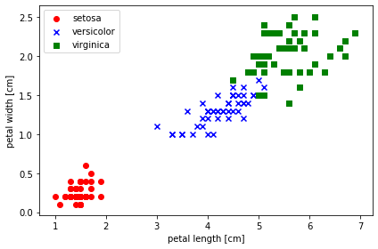

```python
%matplotlib inline
```

# 目次

- **[1.問題設定](#1.問題設定)**
- **[2.データ](#2.データ)**
- **[3.コード](#3.コード)**
- **[4.結果](#4.結果)**

# 1.問題設定

### アヤメの「花びらの長さ」,「花びらの幅」の情報から品種を予測したい

# 2.データ

## 以下のアヤメのデータを使用する

#### データ説明（アヤメのデータセット）
---

Irisデータには、150個のアヤメ(花の一種)のサンプルの「がく片の長さ」「がく片の幅」「花びらの長さ」「花びらの幅」の４つの要素(単位はcm)と、3種の品種が格納されています。


| ID 	| がく片の長さ 	| がく片の幅 	| 花びらの長さ 	| 花びらの幅 	| 品種クラス    	|
|----	|----------	|----------	|--------------	|------------	|---------------	|
| 0  	| 5.1      	| 3.5      	| 1.4          	| 0.2        	| Iris-setosa     	|
| 1  	| ・       	| ・       	| ・           	| ・         	| Iris-versicolor	|
|  ・	| ・       	| ・       	| ・           	| ・         	| Iris-setosa     	|
| ・  	| ・       	| ・       	| ・           	| ・         	| Iris-virginica	|

Irisデータのイメージ図（実際の値とは違います）


# 3.コード


```python
# データの読み込み
import pandas as pd
'''
# ネットワークを使用してデータを取得する場合（中身はpd.read_csvのデータと同じです）
df = pd.read_csv('https://archive.ics.uci.edu/ml/machine-learning-databases/iris/iris.data', header=None)
'''
df = pd.read_csv("../data/iris.data", header=None)

df.head()
```


<div>
<style scoped>
    .dataframe tbody tr th:only-of-type {
        vertical-align: middle;
    }

    .dataframe tbody tr th {
        vertical-align: top;
    }

    .dataframe thead th {
        text-align: right;
    }
</style>
<table border="1" class="dataframe">
  <thead>
    <tr style="text-align: right;">
      <th></th>
      <th>0</th>
      <th>1</th>
      <th>2</th>
      <th>3</th>
      <th>4</th>
    </tr>
  </thead>
  <tbody>
    <tr>
      <td>0</td>
      <td>5.1</td>
      <td>3.5</td>
      <td>1.4</td>
      <td>0.2</td>
      <td>Iris-setosa</td>
    </tr>
    <tr>
      <td>1</td>
      <td>4.9</td>
      <td>3.0</td>
      <td>1.4</td>
      <td>0.2</td>
      <td>Iris-setosa</td>
    </tr>
    <tr>
      <td>2</td>
      <td>4.7</td>
      <td>3.2</td>
      <td>1.3</td>
      <td>0.2</td>
      <td>Iris-setosa</td>
    </tr>
    <tr>
      <td>3</td>
      <td>4.6</td>
      <td>3.1</td>
      <td>1.5</td>
      <td>0.2</td>
      <td>Iris-setosa</td>
    </tr>
    <tr>
      <td>4</td>
      <td>5.0</td>
      <td>3.6</td>
      <td>1.4</td>
      <td>0.2</td>
      <td>Iris-setosa</td>
    </tr>
  </tbody>
</table>
</div>


## 前処理


```python
# 欠損値の有無の確認
df.isnull().sum()
```


    0    0
    1    0
    2    0
    3    0
    4    0
    dtype: int64


```python
# データの型の確認
df.dtypes
```


    0    float64
    1    float64
    2    float64
    3    float64
    4     object
    dtype: object


データの4行目（品種）（目的変数）がobject型で、<br>このままでは決定木での学習ができないので数値変換します


```python
import numpy as np
```


```python
# 品種ラベルを数値変換してplotする

# from sklearn.datasets import load_iris
# iris = load_iris()
# iris.target

import matplotlib.pyplot as plt
import numpy as np
%matplotlib inline
# plt.xkcd()

'''
前処理
'''
# データの4行目（品種）を目的変数として取得し .valueでarrayに変換
y = df.iloc[:, 4].values

# 目的変数の品種「Setosa」を0、「Versicolor」を1「Virginica」を2に変換
# y[y == "Iris-setosa"] = 0
# y[y == "Iris-versicolor"] = 1
# y[y == "Iris-virginica"] = 2

# unique()でy要素の個数ごとにenumerate()でindex付きデータとして取得
# 目的変数の品種「Setosa」を0、「Versicolor」を1「Virginica」を2に変換
for idx, cl in enumerate(np.unique(y)):
    y[y == cl] = idx

# 3行目（花びらの長さ）と4行目（花びらの幅）を説明変数として取得し .valueでarrayに変換
X = df.iloc[:, [2,3]].values

'''
可視化
'''
# setosaのプロット(赤の○)
plt.scatter(X[:50, 0], X[:50, 1], color="red", marker="o", label="setosa")

# versicolorのプロット(青の✕)
plt.scatter(X[50:100, 0], X[50:100, 1], color='blue', marker="x", label="versicolor")
# virginicaのプロット(緑の□)
plt.scatter(X[101:150,0],X[101:150,1],color='green',marker='s',label='virginica')

# 軸のラベルの設定
# 花びらの長さ
plt.xlabel("petal length [cm]")
# 花びらの幅
plt.ylabel("petal width [cm]")
# 凡例の設定(左上に配置)
plt.legend(loc="upper left")
# グラフの位置サイズの自動調整
plt.tight_layout()
# 図の表示
plt.show()
```





```python
# 説明変数の種類の確認
# 前処理結果の確認
print("Class labels:", np.unique(y))
```

    Class labels: [0 1 2]
    


```python
# ndarray型なので.dtypeでデータ型を確認する
y.dtype
```


    dtype('O')


```python
# 目的変数の型変換（object -> int32）
y = y.astype(np.int32)
y.dtype
```


    dtype('int32')


## 学習

### scikit-learnとTensorFlowによる実践機械学習のサンプルコード[07_ensemble_learning_and_random_forests.ipynb](https://github.com/ageron/handson-ml/blob/master/07_ensemble_learning_and_random_forests.ipynb)の<br>8. Voting Classifier<br>9. Stacking Ensemble<br>のコードを使用しています


```python
'''
学習
'''
# 訓練データとテストデータに分割する
from sklearn.model_selection import train_test_split

X_train_val, X_test, y_train_val, y_test = train_test_split(
    X,
    y,
    test_size=0.2,
    random_state=42,
    stratify=y        # 層化抽出:均等に分割させたいデータの指定
)

X_train, X_val, y_train, y_val = train_test_split(
    X_train_val,
    y_train_val,
    test_size=0.2,
    random_state=42
)
```


```python
# 分割後のデータ数の確認 bincount()で出現件数を取得
print("Labels counts in y:", np.bincount(y))
print("Labels counts in y_train:", np.bincount(y_train))
print("Labels counts in y_test:", np.bincount(y_test))
```

    Labels counts in y: [50 50 50]
    Labels counts in y_train: [32 31 33]
    Labels counts in y_test: [10 10 10]
    


```python
from sklearn.ensemble import RandomForestClassifier, ExtraTreesClassifier
from sklearn.svm import LinearSVC
from sklearn.neural_network import MLPClassifier

random_forest_clf = RandomForestClassifier(n_estimators=10, random_state=42)
extra_trees_clf = ExtraTreesClassifier(n_estimators=10, random_state=42)
svm_clf = LinearSVC(random_state=42)
mlp_clf = MLPClassifier(random_state=42)
```


```python
estimators = [random_forest_clf, extra_trees_clf, svm_clf, mlp_clf]
for estimator in estimators:
    print("Training the", estimator)
    estimator.fit(X_train, y_train)
```

    Training the RandomForestClassifier(bootstrap=True, class_weight=None, criterion='gini',
                           max_depth=None, max_features='auto', max_leaf_nodes=None,
                           min_impurity_decrease=0.0, min_impurity_split=None,
                           min_samples_leaf=1, min_samples_split=2,
                           min_weight_fraction_leaf=0.0, n_estimators=10,
                           n_jobs=None, oob_score=False, random_state=42, verbose=0,
                           warm_start=False)
    Training the ExtraTreesClassifier(bootstrap=False, class_weight=None, criterion='gini',
                         max_depth=None, max_features='auto', max_leaf_nodes=None,
                         min_impurity_decrease=0.0, min_impurity_split=None,
                         min_samples_leaf=1, min_samples_split=2,
                         min_weight_fraction_leaf=0.0, n_estimators=10, n_jobs=None,
                         oob_score=False, random_state=42, verbose=0,
                         warm_start=False)
    Training the LinearSVC(C=1.0, class_weight=None, dual=True, fit_intercept=True,
              intercept_scaling=1, loss='squared_hinge', max_iter=1000,
              multi_class='ovr', penalty='l2', random_state=42, tol=0.0001,
              verbose=0)
    Training the MLPClassifier(activation='relu', alpha=0.0001, batch_size='auto', beta_1=0.9,
                  beta_2=0.999, early_stopping=False, epsilon=1e-08,
                  hidden_layer_sizes=(100,), learning_rate='constant',
                  learning_rate_init=0.001, max_iter=200, momentum=0.9,
                  n_iter_no_change=10, nesterovs_momentum=True, power_t=0.5,
                  random_state=42, shuffle=True, solver='adam', tol=0.0001,
                  validation_fraction=0.1, verbose=False, warm_start=False)
    

    C:\Users\Akahane Shuhei\Anaconda3\lib\site-packages\sklearn\neural_network\multilayer_perceptron.py:566: ConvergenceWarning: Stochastic Optimizer: Maximum iterations (200) reached and the optimization hasn't converged yet.
      % self.max_iter, ConvergenceWarning)
    


```python
[estimator.score(X_val, y_val) for estimator in estimators]
```


    [0.9166666666666666,
     0.9583333333333334,
     0.9166666666666666,
     0.9166666666666666]


```python
X_val_predictions = np.empty((len(X_val), len(estimators)), dtype=np.float32)

for index, estimator in enumerate(estimators):
    X_val_predictions[:, index] = estimator.predict(X_val)
```


```python
X_val_predictions
```


    array([[0., 0., 0., 0.],
           [0., 0., 0., 0.],
           [1., 1., 1., 1.],
           [2., 2., 2., 2.],
           [2., 2., 2., 2.],
           [2., 2., 2., 2.],
           [1., 2., 1., 1.],
           [2., 2., 2., 2.],
           [0., 0., 0., 0.],
           [1., 1., 1., 1.],
           [2., 2., 2., 2.],
           [2., 2., 2., 2.],
           [1., 1., 1., 1.],
           [1., 1., 1., 1.],
           [0., 0., 0., 0.],
           [2., 2., 2., 2.],
           [1., 1., 1., 1.],
           [0., 0., 0., 0.],
           [1., 1., 1., 1.],
           [0., 0., 0., 0.],
           [1., 1., 1., 1.],
           [0., 0., 0., 0.],
           [1., 1., 1., 1.],
           [0., 0., 0., 0.]], dtype=float32)


```python
rnd_forest_blender = RandomForestClassifier(n_estimators=200, oob_score=True, random_state=42)
rnd_forest_blender.fit(X_val_predictions, y_val)
```


    RandomForestClassifier(bootstrap=True, class_weight=None, criterion='gini',
                           max_depth=None, max_features='auto', max_leaf_nodes=None,
                           min_impurity_decrease=0.0, min_impurity_split=None,
                           min_samples_leaf=1, min_samples_split=2,
                           min_weight_fraction_leaf=0.0, n_estimators=200,
                           n_jobs=None, oob_score=True, random_state=42, verbose=0,
                           warm_start=False)


```python
rnd_forest_blender.oob_score_
```


    0.9166666666666666


### 交差検証

学習したモデルを使用し、交差検証して正解率を確認する


```python
from sklearn.model_selection import KFold, cross_val_score

kfold = KFold(n_splits=5, shuffle=True, random_state=42)

forest_score = cross_val_score(rnd_forest_blender, X, y, cv=kfold)

print(forest_score)
print(forest_score.mean())
```

    [1.         1.         0.93333333 0.93333333 0.96666667]
    0.9666666666666668
    

## 予測


```python
'''
予測
'''
# テストデータで予測を行う
X_test_predictions = np.empty((len(X_test), len(estimators)), dtype=np.float32)

for index, estimator in enumerate(estimators):
    X_test_predictions[:, index] = estimator.predict(X_test)
    
y_pred = rnd_forest_blender.predict(X_test_predictions)

print("誤分類したデータ数: %d"% (y_test != y_pred).sum())
print("予測したデータ数: %d"% (y_pred.sum()+1))
print("誤分類率: %.3f"% (((y_test != y_pred).sum()) / (y_pred.sum()+1)) )
# 正解率の表示
print("Accuracy: %.3f"% (1-((y_test != y_pred).sum()) / (y_pred.sum()+1)) )
```

    誤分類したデータ数: 2
    予測したデータ数: 31
    誤分類率: 0.065
    Accuracy: 0.935
    


```python
'''
正解率の表示
'''
print(__doc__)
from sklearn.metrics import accuracy_score

print("スタッキングの正解率 : {:.2f}".format(accuracy_score(y_test, y_pred)))
```

    
    正解率の表示
    
    スタッキングの正解率 : 0.93
    


```python
'''
適合率（precision）
'''
print(__doc__)
from sklearn.metrics import precision_score
# averageにデフォルトで2値分類用の'binary'が指定されているので、ここでは他の引数を設定します。
# マイクロ平均（micro）かマクロ平均（macro）
print("スタッキングの適合率 : {:.2f}".format(precision_score(y_test, y_pred, average="micro")))
```

    
    適合率（precision）
    
    スタッキングの適合率 : 0.93
    


```python
'''
再現率（recall）
'''
print(__doc__)
from sklearn.metrics import recall_score
# averageにマイクロ平均（micro）を設定
print("スタッキングの再現率 : {:.2f}".format(recall_score(y_test, y_pred, average="micro")))
```

    
    再現率（recall）
    
    スタッキングの再現率 : 0.93
    


```python
'''
F値（F1-measure）
'''
print(__doc__)
from sklearn.metrics import f1_score
# averageにマイクロ平均（micro）を設定
print("スタッキングのF値 : {:.2f}".format(f1_score(y_test, y_pred, average="micro")))
```

    
    F値（F1-measure）
    
    スタッキングのF値 : 0.93
    

# 4.結果

### スタッキングを使用して、アヤメの花びらの情報から<br>93%の正解率を持つモデルを作ることができた。


```python

```
