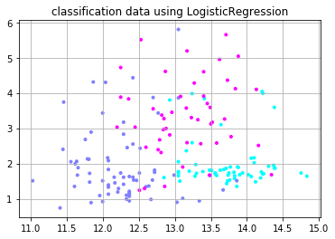

# 前処理としての主成分分析


```python
import pandas as pd
import numpy as np
import matplotlib
import matplotlib.pyplot as plt
%matplotlib inline

from sklearn.model_selection import train_test_split
from sklearn.preprocessing import StandardScaler
from sklearn.decomposition import PCA
from sklearn.linear_model import LogisticRegression

df_wine = pd.read_csv("./data/wine.csv", header=None)

X, y = df_wine.iloc[:, 1:].values, df_wine.iloc[:, 0].values
X_train, X_test, y_train, y_test = train_test_split(
    X, y, test_size=0.4, random_state=0)

# 標準化のためのインスタンスを生成
sc = StandardScaler()
# トレーニングデータから変換モデルを学習し、テストデータに適用
X_train_std = sc.fit_transform(X_train)
X_test_std = sc.transform(X_test)

# 主成分分析のインスタンスを生成
pca = PCA(n_components=2)
# トレーニングデータから変換モデルを学習し、テストデータに適用
X_train_pca = pca.fit_transform(X_train_std)
X_test_pca = pca.transform(X_test_std)

# ロジスティック回帰のインスタンスを生成
lr = LogisticRegression()
# 次元削減後のトレーニングデータで分類モデルを学習
lr.fit(X_train_pca, y_train)


# スコアの表示
print(lr.score(X_train_pca, y_train))
print(lr.score(X_test_pca, y_test))


# test_Xに対するモデルの分類予測結果
y_pred = lr.predict(X_test_pca)
print(y_pred)
# 決定係数の出力
print("ロジスティック回帰:{}".format(lr.score(X_test_pca, y_test)))

# 以下可視化の作業です
plt.scatter(X[:, 0], X[:, 1], c=y, marker=".",
            cmap=matplotlib.cm.get_cmap(name="cool"), alpha=1.0)

plt.title("classification data using LogisticRegression")
plt.grid()
plt.show()
```
```
0.9716981132075472
0.9583333333333334
[1 3 2 1 2 1 1 3 2 2 3 3 1 2 3 2 1 1 2 1 2 1 1 2 2 2 2 2 2 3 1 1 2 1 1 1 3
 2 2 3 1 1 2 2 2 1 3 2 3 1 3 3 1 3 1 2 3 3 2 3 3 1 3 3 2 2 3 2 1 2 1 2]
ロジスティック回帰:0.9583333333333334
```



**回帰分析の前処理に主成分分析を適用します**。予めデータを圧縮することで、外れ値などの外乱に強く**より汎用性の高い回帰分析モデルを生成できます**。  

　まず、データをトレーニングデータとテストデータに分割します。

```python
from sklearn.model_selection import train_test_split
X_train, X_test, y_train, y_test = train_test_split(X, y, test_size=0.4, random_state=0)
```

　特徴変換を行う際、トレーニングデータとテストデータで違う変換行列を求めて特徴変換を行ってしまうと、変換行列が異なってしまうために特徴変換後のデータを比較することができません。標準化についても同じことが言えます。  
　これでは不便なことがあるので、**標準化と主成分分析を行う際はトレーニングデータとテストデータで共通の基準を使います**。

　**標準化**する際は、以下のように `StandardScalar` クラスを用いると便利です。

```python
from sklearn.preprocessing import StandardScaler
# 標準化のためのインスタンスを生成
sc = StandardScaler()
# トレーニングデータから変換モデルを学習し、テストデータに同じモデルを適用
X_train_std = sc.fit_transform(X_train)
X_test_std = sc.transform(X_test)
```

　**主成分分析**する際は、 `PCA` クラスを以下のように使います。

```python
from sklearn.decomposition import PCA
# 主成分分析のインスタンスを生成
pca = PCA(n_components=2)
# トレーニングデータから変換モデルを学習し、テストデータに同じモデルを適用
X_train_pca = pca.fit_transform(X_train_std)
X_test_pca = pca.transform(X_test_std)
```

回帰分析は以下のように行います。

```python
from sklearn.linear_model import LogisticRegression
# ロジスティック回帰のインスタンスを生成
lr = LogisticRegression()
# 分類モデルを学習
lr.fit(X, y)
# スコアの表示
print(lr.score(X, y))
```