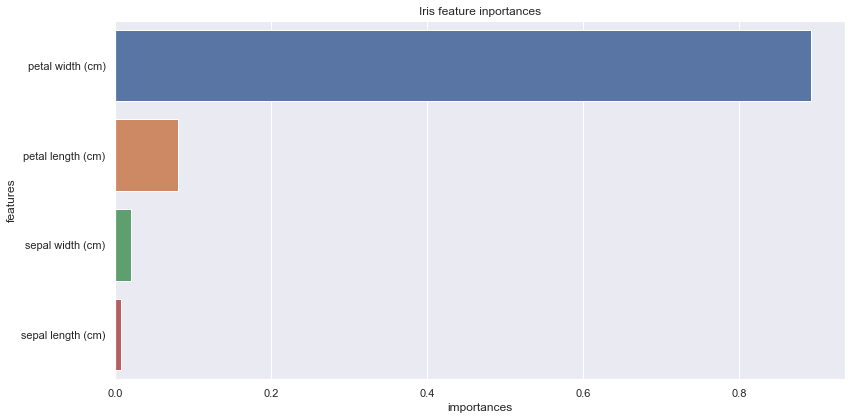

# 特徴量の重要度のグラフ表示

## 1. 必要なライブラリの読み込み


```python
import pandas as pd
from sklearn.datasets import load_iris
 
from sklearn.tree import DecisionTreeClassifier
from sklearn.model_selection import train_test_split

import matplotlib.pyplot as plt
import seaborn as sns

%matplotlib inline
sns.set()
```

## 2. irisデータの読み込み


```python
iris = load_iris()
df = pd.DataFrame(iris.data, columns = iris.feature_names)
df["y"] = iris.target
df.head()
```


<div>
<style scoped>
    .dataframe tbody tr th:only-of-type {
        vertical-align: middle;
    }

    .dataframe tbody tr th {
        vertical-align: top;
    }

    .dataframe thead th {
        text-align: right;
    }
</style>
<table border="1" class="dataframe">
  <thead>
    <tr style="text-align: right;">
      <th></th>
      <th>sepal length (cm)</th>
      <th>sepal width (cm)</th>
      <th>petal length (cm)</th>
      <th>petal width (cm)</th>
      <th>y</th>
    </tr>
  </thead>
  <tbody>
    <tr>
      <th>0</th>
      <td>5.1</td>
      <td>3.5</td>
      <td>1.4</td>
      <td>0.2</td>
      <td>0</td>
    </tr>
    <tr>
      <th>1</th>
      <td>4.9</td>
      <td>3.0</td>
      <td>1.4</td>
      <td>0.2</td>
      <td>0</td>
    </tr>
    <tr>
      <th>2</th>
      <td>4.7</td>
      <td>3.2</td>
      <td>1.3</td>
      <td>0.2</td>
      <td>0</td>
    </tr>
    <tr>
      <th>3</th>
      <td>4.6</td>
      <td>3.1</td>
      <td>1.5</td>
      <td>0.2</td>
      <td>0</td>
    </tr>
    <tr>
      <th>4</th>
      <td>5.0</td>
      <td>3.6</td>
      <td>1.4</td>
      <td>0.2</td>
      <td>0</td>
    </tr>
  </tbody>
</table>
</div>


## 3. 説明変数と目的変数に分割


```python
y = df["y"]
```


```python
X = df.iloc[:, 0:4]
X.head()
```


<div>
<style scoped>
    .dataframe tbody tr th:only-of-type {
        vertical-align: middle;
    }

    .dataframe tbody tr th {
        vertical-align: top;
    }

    .dataframe thead th {
        text-align: right;
    }
</style>
<table border="1" class="dataframe">
  <thead>
    <tr style="text-align: right;">
      <th></th>
      <th>sepal length (cm)</th>
      <th>sepal width (cm)</th>
      <th>petal length (cm)</th>
      <th>petal width (cm)</th>
    </tr>
  </thead>
  <tbody>
    <tr>
      <th>0</th>
      <td>5.1</td>
      <td>3.5</td>
      <td>1.4</td>
      <td>0.2</td>
    </tr>
    <tr>
      <th>1</th>
      <td>4.9</td>
      <td>3.0</td>
      <td>1.4</td>
      <td>0.2</td>
    </tr>
    <tr>
      <th>2</th>
      <td>4.7</td>
      <td>3.2</td>
      <td>1.3</td>
      <td>0.2</td>
    </tr>
    <tr>
      <th>3</th>
      <td>4.6</td>
      <td>3.1</td>
      <td>1.5</td>
      <td>0.2</td>
    </tr>
    <tr>
      <th>4</th>
      <td>5.0</td>
      <td>3.6</td>
      <td>1.4</td>
      <td>0.2</td>
    </tr>
  </tbody>
</table>
</div>


## 4. 訓練データとテストデータに分割


```python
X_train, X_test, y_train, y_test = train_test_split(X, y, random_state=1, shuffle=True)
```

## 5. 決定木モデル(分類木)の作成&学習


```python
model = DecisionTreeClassifier(random_state=1)
model.fit(X_train,y_train)
```


    DecisionTreeClassifier(class_weight=None, criterion='gini', max_depth=None,
                           max_features=None, max_leaf_nodes=None,
                           min_impurity_decrease=0.0, min_impurity_split=None,
                           min_samples_leaf=1, min_samples_split=2,
                           min_weight_fraction_leaf=0.0, presort=False,
                           random_state=1, splitter='best')


## 6. 作成したモデルを使って予測


```python
y_pred = model.predict(X_test)
```

## 7. 実測値と予測値を使ってモデルの精度を確認


```python
print("accuracy_score : {}".format(accuracy_score(y_test, y_pred)))
```

    accuracy_score : 0.9736842105263158
    

## 8. feature_importancesを確認


```python
feature_importance = model.feature_importances_
feature_importance
```


    array([0.00805949, 0.02014872, 0.08035985, 0.89143195])


## 9. feature_importtancesをデータフレームに加工
- グラフ化しやすくするため


```python
importances = pd.DataFrame({"features":iris.feature_names, "importances" : feature_importance})
importances
```


<div>
<style scoped>
    .dataframe tbody tr th:only-of-type {
        vertical-align: middle;
    }

    .dataframe tbody tr th {
        vertical-align: top;
    }

    .dataframe thead th {
        text-align: right;
    }
</style>
<table border="1" class="dataframe">
  <thead>
    <tr style="text-align: right;">
      <th></th>
      <th>features</th>
      <th>importances</th>
    </tr>
  </thead>
  <tbody>
    <tr>
      <th>0</th>
      <td>sepal length (cm)</td>
      <td>0.008059</td>
    </tr>
    <tr>
      <th>1</th>
      <td>sepal width (cm)</td>
      <td>0.020149</td>
    </tr>
    <tr>
      <th>2</th>
      <td>petal length (cm)</td>
      <td>0.080360</td>
    </tr>
    <tr>
      <th>3</th>
      <td>petal width (cm)</td>
      <td>0.891432</td>
    </tr>
  </tbody>
</table>
</div>


## 10. feature_importanceのグラフを出力


```python
plt.figure(figsize=(12, 6))
plt.title("Iris feature inportances")
sns.barplot(x="importances", y="features", data=importances.sort_values(by="importances", ascending=False))
plt.tight_layout()
```




