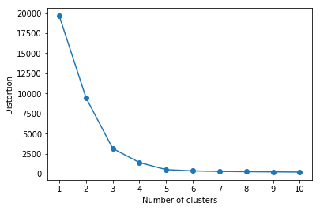
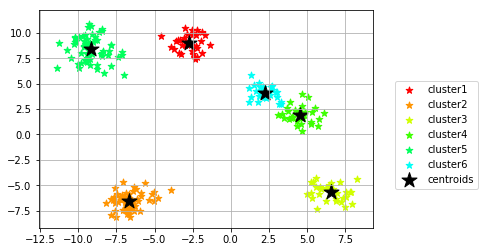

# k-means法


```python
# sklearn.clusterのKMeansクラスをインポート
from sklearn.cluster import KMeans

km = KMeans(n_clusters=3,            # クラスターの個数
            init="random",           # セントロイドの初期値をランダムに設定  default: "k-means++"
            n_init=10,               # 異なるセントロイドの初期値を用いたk-meansの実行回数
            max_iter=300,            # k-meansアルゴリズムを繰り返す最大回数
            tol=1e-04,               # 収束と判定するための相対的な許容誤差
            random_state=0)          # 乱数発生初期化

Y_km = km.fit_predict(X) # クラスターが存在するデータを渡し、各サンプルに対するクラスタ番号を求める
```

　上記のコードにより **データからクラスターを指定した分探し出し、Y_kmに各サンプルに自動的にクラスタ番号が格納されます。** `KMeans` クラスには他にも様々な関数があります。

```python
# クラスタリングの計算を実行
km.fit(X[, y])
# クラスタリングの計算を行い、Xを分析に用いた距離空間に変換して返す
km.fit_transform(X[, y])
# 計算に用いたパラメータを返す
km.get_params([deep])
# Xのサンプルが属しているクラスタ番号を返す
km.predict(X)
# パラメータを設定する
km.set_params(**params)
# Xを分析に用いた距離空間に変換して返す
km.transform(X[, y])
```

```python
import matplotlib.pyplot as plt
import matplotlib.cm as cm
import numpy as np
import pandas as pd
from sklearn.cluster import KMeans
from sklearn.datasets import make_blobs
%matplotlib inline

# データセットの作成
# クラスター数を指定した分だけデータ内でクラスターが生成出来るmake_blobsを使う
X, Y = make_blobs(n_samples=250,        # サンプル点の総数
                  n_features=2,         # 特徴量（次元数）の指定  default:2
                  centers=8,            # クラスタの個数
                  cluster_std=.8,       # クラスタ内の標準偏差
                  shuffle=True,        # サンプルをシャッフル
                  random_state=42)     # 乱数生成器の状態を指定

'''
エルボー法の実施
'''
distortions = []
best_clusters = 0
for i in range(1, 11):                # クラスター数1~10を一気に計算
    km = KMeans(n_clusters=i,
                init="k-means++",     # k-means++法によりクラスタ中心を選択
                n_init=10,
                max_iter=300,
                random_state=0)
    km.fit(X)                         # クラスタリングのを実行
    distortions.append(km.inertia_)   # km.fitするとkm.inertia_が得られる
# 良さげなクラスタ数を格納
for i in range(2, 11):
    if((distortions[i-1] - distortions[i]) < 100):
        best_clusters = i
        break

# グラフのプロット
plt.plot(range(1, 11), distortions, marker="o")
plt.xticks(np.arange(1, 11, 1))
plt.xlabel("Number of clusters")
plt.ylabel("Distortion")
plt.show()

print("ベストクラスタ数 ", best_clusters)

'''
k-mean法の実装
'''
# KMeansクラスからkmインスタンスを作成
km = KMeans(n_clusters=best_clusters,# エルボー法で求めたベストクラスターの個数
            init="k-means++",        # セントロイドの初期値をk-means++法によりクラスタ中心を選択
            n_init=1,                # 異なるセントロイドの初期値を用いたk-meansの実行回数
            max_iter=300,            # k-meansアルゴリズムを繰り返す最大回数
            tol=1e-04,               # 収束と判定するための相対的な許容誤差
            random_state=42)         # 乱数発生初期化


# fit_predictメソッドによりクラスタリングを行う
Y_km = km.fit_predict(X)

# SSE値を出力
print("Distortion: %.2f" % km.inertia_)

# プロット
for n in range(np.max(Y_km)+1):
    plt.scatter(X[Y_km == n, 0], X[Y_km == n, 1], s=50, c=cm.hsv(
        float(n) / 10), marker="*", label="cluster"+str(n+1))
plt.scatter(km.cluster_centers_[:, 0], km.cluster_centers_[
            :, 1], s=250, marker="*", c="black", label="centroids")
plt.legend(bbox_to_anchor=(1.05, 0.7), loc="upper left")
plt.grid()
plt.show()
```



```
ベストクラスタ数  6
Distortion: 363.17
```
