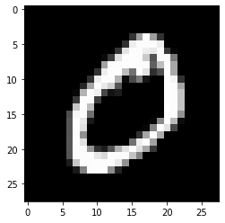

# t-SNE

手書きの数字のデータセットとして非常に人気のあるMNISTデータセットは、<br>数字の画像とそれに関連付けられた正しいラベルを与えられた教師あり問題です。<br>画像のみを与えられた場合に、どの数字がどの数字であるかを識別できるモデルを構築できます。

教師ありデータセットを教師なしデータセットに変換して、<br>プロットしたときにどのように見えるかを確認することも可能です。

このデータセットをt-Distributed Stochastic Neighbor Embedding (t-SNE)分解してみると、<br>画像のピクセルに2つの成分を与えるだけで、ある程度画像を分離できます。

これがどのように行われたかを見てみます。<br>まず何よりもまず、必要なライブラリをすべてインポートします。

```python
import numpy as np
import pandas as pd
import matplotlib.pyplot as plt
%matplotlib inline
import seaborn as sns

# 警告の非表示
import warnings
warnings.filterwarnings('ignore')

from sklearn import datasets
from sklearn import manifold
```

プロットにはmatplotlibとseabornを、数値配列を扱うにはnumpyを、数値配列からデータフレームを作成するにはpandasを、データを取得してt-SNEを実行するにはscikit-learn(sklearn)を使用しています。 <br>インポート後は、データをダウンロードして個別に読み込むか、MNISTのデータセットを提供してくれるsklearnのビルトイン機能を利用する必要があります。


```python
data = datasets.fetch_openml(
    'mnist_784',
    version=1,
    return_X_y=True
)
pixel_values, targets = data
targets = targets.astype(int)
```


```python
print(pixel_values.shape)
print(targets.shape)
```

    (70000, 784)
    (70000,)


この部分では、sklearnのデータセットを使ってデータを取得し、ピクセル値の配列とターゲットの配列を用意しています。<br>pixel_valuesは70000x784の2次元配列です。<br>70000種類の画像があり、それぞれのサイズは28x28ピクセルです。<br>28x28を平坦化すると、784個のデータポイントが得られます。 <br>このデータセットのサンプルを元の形状にリシェイプし、matplotlibを使ってプロットすることで可視化することができます。


```python
# 画像表示
# 1行分のデータを取得し、(28, 28)に再変形
single_image = pixel_values[1, :].reshape(28, 28)
plt.imshow(single_image, cmap='gray')
```


    <matplotlib.image.AxesImage at 0x7f7dfd2af310>





最も重要なステップは、データを取得した後です。


```python
tsne = manifold.TSNE(
    n_components=2,
    random_state=42
)
# 3000個のデータを訓練データとして学習を実行
transformed_data = tsne.fit_transform(pixel_values[:3000, :])
```

このステップでは、データのt-SNE変換を作成します。<br>2次元の設定でうまく可視化できるので、2つのコンポーネントだけを使用します。<br>この場合のtransformed_dataは、3000×2（3000行と2列）の形状の配列です。<br>このようなデータは、配列上で pd.DataFrame を呼び出すことで pandas のデータフレームに変換することができます。


```python
# データ
tsne_df = pd.DataFrame(
    # データを縦（カラム方向）に結合　学習結果と説明変数を結合
    np.column_stack((transformed_data, targets[:3000])),
    columns=['x', 'y', 'targets']
)
tsne_df.loc[:, 'targets'] = tsne_df['targets'].astype(int)
```

ここでは、numpy配列からパンダのデータフレームを作成しています。<br>xとyはt-SNE分解からの2つのコンポーネントであり、targetsは実際の数です。<br>これにより、以下に示すようなデータフレームが得られます。


```python
tsne_df.head()
```


<div>
<style scoped>
    .dataframe tbody tr th:only-of-type {
        vertical-align: middle;
    }

    .dataframe tbody tr th {
        vertical-align: top;
    }

    .dataframe thead th {
        text-align: right;
    }
</style>
<table border="1" class="dataframe">
  <thead>
    <tr style="text-align: right;">
      <th></th>
      <th>x</th>
      <th>y</th>
      <th>targets</th>
    </tr>
  </thead>
  <tbody>
    <tr>
      <th>0</th>
      <td>-5.281551</td>
      <td>-28.952768</td>
      <td>5</td>
    </tr>
    <tr>
      <th>1</th>
      <td>-26.105896</td>
      <td>-68.069321</td>
      <td>0</td>
    </tr>
    <tr>
      <th>2</th>
      <td>-42.503582</td>
      <td>35.580391</td>
      <td>4</td>
    </tr>
    <tr>
      <th>3</th>
      <td>38.893967</td>
      <td>26.663395</td>
      <td>1</td>
    </tr>
    <tr>
      <th>4</th>
      <td>-14.770573</td>
      <td>35.433247</td>
      <td>9</td>
    </tr>
  </tbody>
</table>
</div>


最後にseabornとmatplotlibを使ってプロットします。


```python
grid = sns.FacetGrid(tsne_df, hue='targets', size=8)
grid.map(plt.scatter, 'x', 'y').add_legend()
```


    <seaborn.axisgrid.FacetGrid at 0x7f7dd5052cd0>


