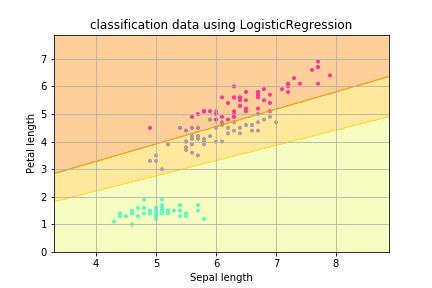

# ロジスティック回帰

```python
from sklearn.linear_model import LogisticRegression
from sklearn.model_selection import train_test_split

# trainデータ、testデータの分割
train_X, test_X, train_y, test_y = train_test_split(
    X, y, test_size=0.3, random_state=42)

# ロジスティック回帰モデルの構築
model = LogisticRegression()
# train_Xとtrain_yを使ってモデルに学習
model.fit(train_X, train_y)
# test_Xに対するモデルの分類予測結果
y_pred = model.predict(test_X)
print(y_pred)
# 決定係数の出力
print("ロジスティック回帰:{}".format(model.score(test_X, test_y)))

```


```python
# パッケージをインポート
import numpy as np
import matplotlib
import matplotlib.pyplot as plt
from sklearn import datasets
from sklearn.linear_model import LogisticRegression
from sklearn.model_selection import train_test_split
from sklearn.datasets import make_classification
%matplotlib inline

# データを取得
iris = datasets.load_iris()
# irisの0列目と2列目を格納
X = iris.data[:, [0, 2]]
# irisのクラスラベルを格納
y = iris.target
# trainデータ、testデータの分割
train_X, test_X, train_y, test_y = train_test_split(
    X, y, test_size=0.3, random_state=42)

# ロジスティック回帰モデルの構築
model = LogisticRegression()

# train_Xとtrain_yを使ってモデルに学習
model.fit(train_X, train_y)

# test_Xに対するモデルの分類予測結果
y_pred = model.predict(test_X)
print(y_pred)
# 決定係数の出力
print("ロジスティック回帰:{}".format(model.score(test_X, test_y)))

# 可視化
plt.scatter(X[:, 0], X[:, 1], c=y, marker=".",
            cmap=matplotlib.cm.get_cmap(name="cool"), alpha=1.0)

x1_min, x1_max = X[:, 0].min() - 1, X[:, 0].max() + 1
x2_min, x2_max = X[:, 1].min() - 1, X[:, 1].max() + 1
xx1, xx2 = np.meshgrid(np.arange(x1_min, x1_max, 0.02),
                       np.arange(x2_min, x2_max, 0.02))
Z = model.predict(np.array([xx1.ravel(), xx2.ravel()]).T).reshape((xx1.shape))
plt.contourf(xx1, xx2, Z, alpha=0.4,
             cmap=matplotlib.cm.get_cmap(name="Wistia"))
plt.xlim(xx1.min(), xx1.max())
plt.ylim(xx2.min(), xx2.max())
plt.title("classification data using LogisticRegression")
plt.xlabel("Sepal length")
plt.ylabel("Petal length")
plt.grid(True)
plt.savefig("LogisticRegression.png")
plt.show()
```

```
[2 0 2 1 1 0 1 1 1 1 2 0 0 0 0 1 2 1 2 2 0 2 0 2 2 2 2 2 0 0 0 0 1 0 0 2 1 0 0 0 2 1 1 0 0]
ロジスティック回帰:0.9333333333333333
```



ロジスティック回帰モデルはscikit-learnライブラリのlinear_modelサブモジュール内に`LogisticRegression()`として定義されている。
