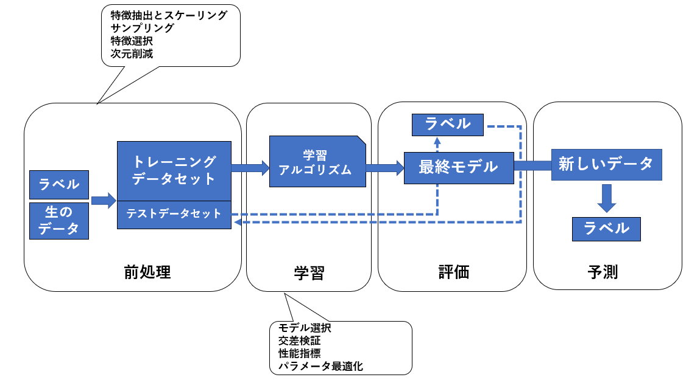

# 分類

> 分類問題は、大まかに二項分類と 多項分類の問題に分けられます。

- <b>二項分類</b>（二値分類、２クラス分類とも言います）  
    分類するカテゴリー（クラスといいます）が２つの分類問題のことです。どちらか一方のグループに「属している/いない」のみで識別できます。また、直線でクラス間を識別できる場合は<b>線形分類</b>といい、そうでない場合は<b>非線形分類</b>といいます。


- <b>多項分類</b>（多クラス分類とも言います）  
    クラスが３つ以上の分類問題のことです。これはどれか一つのグループに「属している/いない」だけでは識別ができない上、単に直線では識別できない場合が多いです。

## $Example$
>> 


### $Python$
```python

```
