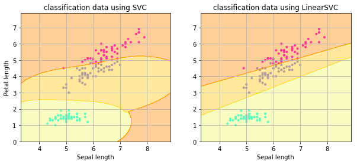

# 非線形SVM

```python
import matplotlib
from sklearn.svm import SVC
from sklearn.datasets import make_gaussian_quantiles
import matplotlib.pyplot as plt

# データの生成
# 今回のデータは線形分離可能でないため、他のデータを用意する
data, label = make_gaussian_quantiles(n_samples=1000, n_classes=2, n_features=2, random_state=42)

# モデルの構築
# 線形分離可能でないデータの分類にはLinearSVCではなくSVCを使う
model = SVC()
# モデルの学習
model.fit(data,label)

# 正解率の算出
model.score(data,label)
```

```python
from sklearn.svm import LinearSVC
from sklearn.svm import SVC
from sklearn import datasets
from sklearn.model_selection import train_test_split
from sklearn.datasets import make_gaussian_quantiles
import numpy as np
import matplotlib.pyplot as plt
import matplotlib
%matplotlib inline

# データの生成
iris = datasets.load_iris()
X = iris.data[:, [0, 2]]
y = iris.target
train_X, test_X, train_y, test_y = train_test_split(
    X, y, test_size=0.3, random_state=42)

# 以下にコードを記述してください
# モデルの構築
model1 = SVC()
model2 = LinearSVC()

# train_Xとtrain_yを使ってモデルに学習させる
model1.fit(train_X, train_y)
model2.fit(train_X, train_y)


# 正解率の算出
print("非線形SVM: {}".format(model1.score(test_X, test_y)))
print("線形SVM: {}".format(model2.score(test_X, test_y)))


# 以下可視化
fig, (axL, axR) = plt.subplots(ncols=2, figsize=(10, 4))
axL.scatter(X[:, 0], X[:, 1], c=y, marker=".",
            cmap=matplotlib.cm.get_cmap(name="cool"), alpha=1.0)
x1_min, x1_max = X[:, 0].min() - 1, X[:, 0].max() + 1
x2_min, x2_max = X[:, 1].min() - 1, X[:, 1].max() + 1
xx1, xx2 = np.meshgrid(np.arange(x1_min, x1_max, 0.02),
                       np.arange(x2_min, x2_max, 0.02))
Z1 = model1.predict(
    np.array([xx1.ravel(), xx2.ravel()]).T).reshape((xx1.shape))
axL.contourf(xx1, xx2, Z1, alpha=0.4,
             cmap=matplotlib.cm.get_cmap(name="Wistia"))
axL.set_xlim(xx1.min(), xx1.max())
axL.set_ylim(xx2.min(), xx2.max())
axL.set_title("classification data using SVC")
axL.set_xlabel("Sepal length")
axL.set_ylabel("Petal length")
axL.grid(True)

axR.scatter(X[:, 0], X[:, 1], c=y, marker=".",
            cmap=matplotlib.cm.get_cmap(name="cool"), alpha=1.0)
x1_min, x1_max = X[:, 0].min() - 1, X[:, 0].max() + 1
x2_min, x2_max = X[:, 1].min() - 1, X[:, 1].max() + 1
xx1, xx2 = np.meshgrid(np.arange(x1_min, x1_max, 0.02),
                       np.arange(x2_min, x2_max, 0.02))
Z2 = model2.predict(
    np.array([xx1.ravel(), xx2.ravel()]).T).reshape((xx1.shape))
axR.contourf(xx1, xx2, Z2, alpha=0.4,
             cmap=matplotlib.cm.get_cmap(name="Wistia"))
axR.set_xlim(xx1.min(), xx1.max())
axR.set_ylim(xx2.min(), xx2.max())
axR.set_title("classification data using LinearSVC")
axR.set_xlabel("Sepal length")
axR.grid(True)
plt.show()

```

```
非線形SVM: 1.0
線形SVM: 1.0
```



scikit-learnのsvmサブモジュールにある`SVC()`で実装できる。
