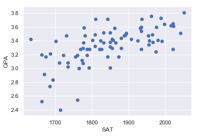
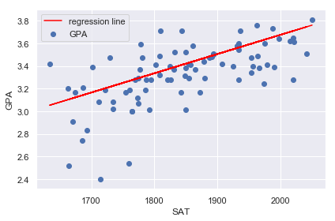

```python
import numpy as np
import pandas as pd
import statsmodels.api as sm    # 統計量を表示するためのモジュール
import matplotlib.pyplot as plt
%matplotlib inline
import seaborn as sns
sns.set()    # snsでオーバーライド
import sklearn
```


```python
data = pd.read_csv('./data/1.01. Simple linear regression.csv')
data.head()
```


<div>
<style scoped>
    .dataframe tbody tr th:only-of-type {
        vertical-align: middle;
    }

    .dataframe tbody tr th {
        vertical-align: top;
    }

    .dataframe thead th {
        text-align: right;
    }
</style>
<table border="1" class="dataframe">
  <thead>
    <tr style="text-align: right;">
      <th></th>
      <th>SAT</th>
      <th>GPA</th>
    </tr>
  </thead>
  <tbody>
    <tr>
      <th>0</th>
      <td>1714</td>
      <td>2.40</td>
    </tr>
    <tr>
      <th>1</th>
      <td>1664</td>
      <td>2.52</td>
    </tr>
    <tr>
      <th>2</th>
      <td>1760</td>
      <td>2.54</td>
    </tr>
    <tr>
      <th>3</th>
      <td>1685</td>
      <td>2.74</td>
    </tr>
    <tr>
      <th>4</th>
      <td>1693</td>
      <td>2.83</td>
    </tr>
  </tbody>
</table>
</div>


```python
# 統計量を表示
data.describe()
```


<div>
<style scoped>
    .dataframe tbody tr th:only-of-type {
        vertical-align: middle;
    }

    .dataframe tbody tr th {
        vertical-align: top;
    }

    .dataframe thead th {
        text-align: right;
    }
</style>
<table border="1" class="dataframe">
  <thead>
    <tr style="text-align: right;">
      <th></th>
      <th>SAT</th>
      <th>GPA</th>
    </tr>
  </thead>
  <tbody>
    <tr>
      <th>count</th>
      <td>84.000000</td>
      <td>84.000000</td>
    </tr>
    <tr>
      <th>mean</th>
      <td>1845.273810</td>
      <td>3.330238</td>
    </tr>
    <tr>
      <th>std</th>
      <td>104.530661</td>
      <td>0.271617</td>
    </tr>
    <tr>
      <th>min</th>
      <td>1634.000000</td>
      <td>2.400000</td>
    </tr>
    <tr>
      <th>25%</th>
      <td>1772.000000</td>
      <td>3.190000</td>
    </tr>
    <tr>
      <th>50%</th>
      <td>1846.000000</td>
      <td>3.380000</td>
    </tr>
    <tr>
      <th>75%</th>
      <td>1934.000000</td>
      <td>3.502500</td>
    </tr>
    <tr>
      <th>max</th>
      <td>2050.000000</td>
      <td>3.810000</td>
    </tr>
  </tbody>
</table>
</div>


目的変数yを`GPA`、説明変数を`STA`として単回帰分析を行います。


```python
# y = data.drop(['GPA'], axis=1, inplace=True)
# x = data
```


```python
y = data['GPA']
x1 = data['SAT']
```

データの可視化


```python
plt.scatter(x1, y)
plt.xlabel('SAT')
plt.ylabel('GPA')
plt.show()
```





```python
# 切片の追加（変数を追加する）
x = sm.add_constant(x1)
# 最小二乗法の結果を代入
result = sm.OLS(y, x).fit()
# 回帰分析の結果を表示
result.summary()
```

    C:\Users\akahane\Anaconda3\lib\site-packages\numpy\core\fromnumeric.py:2389: FutureWarning: Method .ptp is deprecated and will be removed in a future version. Use numpy.ptp instead.
      return ptp(axis=axis, out=out, **kwargs)
    


<table class="simpletable">
<caption>OLS Regression Results</caption>
<tr>
  <th>Dep. Variable:</th>           <td>GPA</td>       <th>  R-squared:         </th> <td>   0.406</td>
</tr>
<tr>
  <th>Model:</th>                   <td>OLS</td>       <th>  Adj. R-squared:    </th> <td>   0.399</td>
</tr>
<tr>
  <th>Method:</th>             <td>Least Squares</td>  <th>  F-statistic:       </th> <td>   56.05</td>
</tr>
<tr>
  <th>Date:</th>             <td>Sat, 13 Jun 2020</td> <th>  Prob (F-statistic):</th> <td>7.20e-11</td>
</tr>
<tr>
  <th>Time:</th>                 <td>17:42:01</td>     <th>  Log-Likelihood:    </th> <td>  12.672</td>
</tr>
<tr>
  <th>No. Observations:</th>      <td>    84</td>      <th>  AIC:               </th> <td>  -21.34</td>
</tr>
<tr>
  <th>Df Residuals:</th>          <td>    82</td>      <th>  BIC:               </th> <td>  -16.48</td>
</tr>
<tr>
  <th>Df Model:</th>              <td>     1</td>      <th>                     </th>     <td> </td>   
</tr>
<tr>
  <th>Covariance Type:</th>      <td>nonrobust</td>    <th>                     </th>     <td> </td>   
</tr>
</table>
<table class="simpletable">
<tr>
    <td></td>       <th>coef</th>     <th>std err</th>      <th>t</th>      <th>P>|t|</th>  <th>[0.025</th>    <th>0.975]</th>  
</tr>
<tr>
  <th>const</th> <td>    0.2750</td> <td>    0.409</td> <td>    0.673</td> <td> 0.503</td> <td>   -0.538</td> <td>    1.088</td>
</tr>
<tr>
  <th>SAT</th>   <td>    0.0017</td> <td>    0.000</td> <td>    7.487</td> <td> 0.000</td> <td>    0.001</td> <td>    0.002</td>
</tr>
</table>
<table class="simpletable">
<tr>
  <th>Omnibus:</th>       <td>12.839</td> <th>  Durbin-Watson:     </th> <td>   0.950</td>
</tr>
<tr>
  <th>Prob(Omnibus):</th> <td> 0.002</td> <th>  Jarque-Bera (JB):  </th> <td>  16.155</td>
</tr>
<tr>
  <th>Skew:</th>          <td>-0.722</td> <th>  Prob(JB):          </th> <td>0.000310</td>
</tr>
<tr>
  <th>Kurtosis:</th>      <td> 4.590</td> <th>  Cond. No.          </th> <td>3.29e+04</td>
</tr>
</table><br/><br/>Warnings:<br/>[1] Standard Errors assume that the covariance matrix of the errors is correctly specified.<br/>[2] The condition number is large, 3.29e+04. This might indicate that there are<br/>strong multicollinearity or other numerical problems.


- `coef`は切片の値を表し、それぞれの変数ごとに表しています。　
- `std_err`は標準誤差を表し、予測の正確性を表します。この値が小さければ小さいほど良い予測ができていると言えます。
- `t`, `P>|t|`は仮説検定で用いられた値で、**今回の場合の帰無仮説は切片が0かどうかということになります**<br>切片が0であるなら、この直線が0を通ることを意味し、$x1×0$の時目的変数`y`は0であることを意味します。<br><br>別な見方をするのなら**切片の値は有益な変数なのかをx1=0とすることで見ています。**<br>指標は`P>|t|`値を使用し、この**p値が<0.05であれば、その変数は有意だということができます。**<br><br>SATの`P>|t|`値は0であり、GPAを予測する際、変数SATは有意な変数であるということができます。<br>`P>|t|`値が大きい切片`const`は切片の値が0であることも示しています。


```python
# 結果の表示
plt.scatter(x1, y)
plt.xlabel('SAT')
# 予測値の設定
y_hat = 0.0017*x1 + 0.2750
plt.plot(x1, y_hat, c='red', label='regression line')
plt.ylabel('GPA')
plt.legend()
plt.tight_layout()
plt.show()
```




