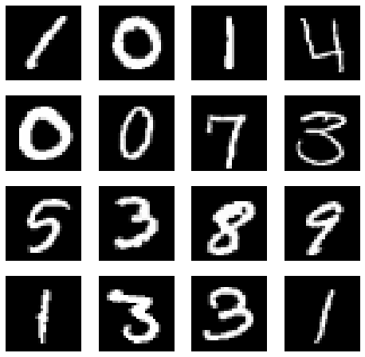
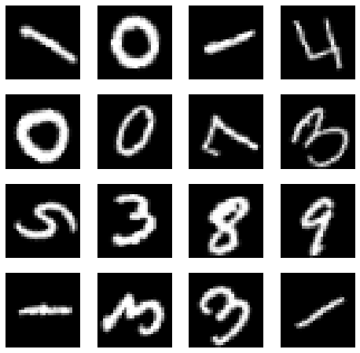
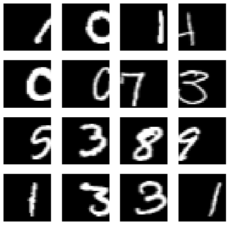
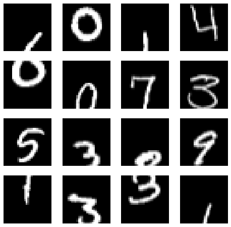
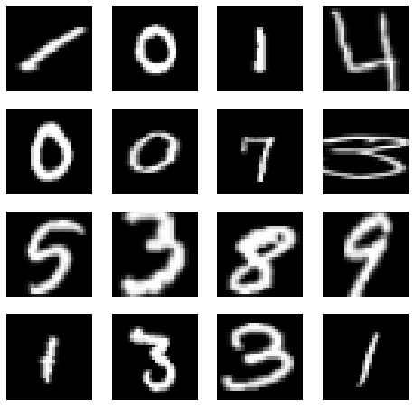
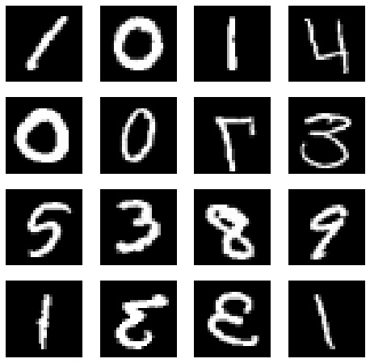
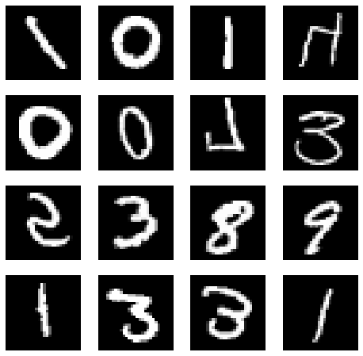

# MNISTデータを拡張する

kaggleの[Digit Recognizer](https://www.kaggle.com/c/digit-recognizer/overview)（MNISTデータセット）を使用して、<br>データ拡張（Data Augmentation）を行いデータ拡張処理を行います。


```python
import numpy as np
import pandas as pd
import matplotlib.pyplot as plt
%matplotlib inline
```


```python
# train.csvを読み込んでpandasのDataFrameに格納
path = './data/digit-recognizer/'
train = pd.read_csv(path + 'train.csv')
tr_x = train.drop(['label'], axis=1) # trainから画像データを抽出
train_y = train['label']             # trainから正解ラベルを抽出
```


```python
# 画像のピクセル値を255.0で割って0～1.0の範囲にしてnumpy.arrayに変換
tr_x = np.array(tr_x / 255.0)
```


```python
# 画像データの2階テンソルを
# (高さ = 28px, 幅 = 28px , チャンネル = 1)の
# 3階テンソルに変換
# グレースケールのためチャンネルは1
tr_x = tr_x.reshape(-1,28,28,1)
```


```python
from tensorflow.keras.utils import to_categorical

# 正解ラベルをone-hot表現に変換
tr_y = to_categorical(train_y, 10)
```

## 画像全体の移動・反転・拡大でいろいろなパターンを作る


```python
def drow_image(X):
    """
    (28, 28, 1)形式の画像の描画を行う
    Parameters
        X: (28, 28, 1)の形状をした画像データのリスト
    """
    # 描画エリア
    plt.figure(figsize=(8,8))
    pos = 1                # 画像の描画位置の記録
    # 入力画像の枚数分描画を行う
    for i in range(X.shape[0]):
        plt.subplot(4, 4, pos)
        plt.gray()
        # i番目の画像を(28, 28)形状に変更して描画
        plt.imshow(X[i].reshape((28, 28)), interpolation='nearest')
        plt.axis('off')        # 軸目盛の非表示
        pos += 1
    plt.show()
```


```python
# 画像のテスト表示
# テストで使用する画像の枚数
batch_size = 16
# 画像の表示テスト
drow_image(tr_x[0:batch_size])
```





```python
from tensorflow.keras.preprocessing.image import ImageDataGenerator
```

## 画像のランダム回転

指定した角度の範囲でランダムに画像を回転させます。


```python
# 回転処理 最大90°
datagen = ImageDataGenerator(rotation_range=90)

# イテレーターの作成
g = datagen.flow(
    tr_x,
    tr_y,
    batch_size,
    shuffle=False
)
# 拡張データをリストに格納
x_batch, y_batch = g.next()
# 描画
drow_image(x_batch)
```





## 画像の平行移動


```python
# 平行移動　最大0.5
datagen = ImageDataGenerator(width_shift_range=0.5)

# イテレーターの作成
g = datagen.flow(
    tr_x,
    tr_y,
    batch_size,
    shuffle=False
)
# 拡張データをリストに格納
x_batch, y_batch = g.next()
# 描画
drow_image(x_batch)
```





## 画像の垂直移動


```python
# 垂直移動　最大0.5
datagen = ImageDataGenerator(height_shift_range=0.5)
# イテレーターの作成
g = datagen.flow(
    tr_x,
    tr_y,
    batch_size,
    shuffle=False
)
# 拡張データをリストに格納
x_batch, y_batch = g.next()
# 描画
drow_image(x_batch)
```





## 画像をランダムに拡大・縮小


```python
# ランダムに拡大　最大0.5
datagen = ImageDataGenerator(zoom_range=0.5)

# イテレーターの作成
g = datagen.flow(
    tr_x,
    tr_y,
    batch_size,
    shuffle=False
)
# 拡張データをリストに格納
x_batch, y_batch = g.next()
# 描画
drow_image(x_batch)
```





## 画像のランダムな左右反転


```python
# ランダムに左右反転
datagen = ImageDataGenerator(horizontal_flip=True)

# イテレーターの作成
g = datagen.flow(
    tr_x,
    tr_y,
    batch_size,
    shuffle=False
)
# 拡張データをリストに格納
x_batch, y_batch = g.next()
# 描画
drow_image(x_batch)
```





## 画像のランダムな上下反転


```python
# ランダムに左右反転
datagen = ImageDataGenerator(vertical_flip=True)

# イテレーターの作成
g = datagen.flow(
    tr_x,
    tr_y,
    batch_size,
    shuffle=False
)
# 拡張データをリストに格納
x_batch, y_batch = g.next()
# 描画
drow_image(x_batch)
```




