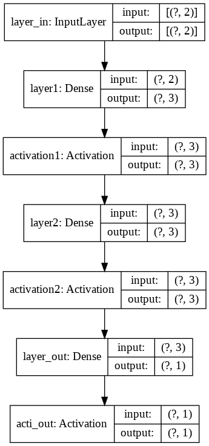
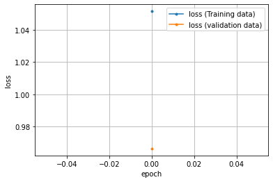

# Functional（関数型）API： 複雑なモデルも定義できる柔軟な書き方

Modelクラスのコンストラクター利用［tf.keras - Functional API］

```
import tensorflow as tf
print('TensorFlow', tf.__version__)
```


```
import numpy as np
import pandas as pd
import matplotlib.pyplot as plt
%matplotlib inline
```

## 訓練データの作成

座標データの作成


```
# 座標点データを生成するライブラリのインストール
!pip install playground-data
```

    Collecting playground-data
      Downloading https://files.pythonhosted.org/packages/fb/27/9f1497a14c529759421438b25816ec90cf2b34cf6c0146cf29aa4ceee27a/playground-data-1.1.0.tar.gz
    Requirement already satisfied: numpy in /usr/local/lib/python3.6/dist-packages (from playground-data) (1.18.5)
    Requirement already satisfied: matplotlib in /usr/local/lib/python3.6/dist-packages (from playground-data) (3.2.2)
    Requirement already satisfied: python-dateutil>=2.1 in /usr/local/lib/python3.6/dist-packages (from matplotlib->playground-data) (2.8.1)
    Requirement already satisfied: pyparsing!=2.0.4,!=2.1.2,!=2.1.6,>=2.0.1 in /usr/local/lib/python3.6/dist-packages (from matplotlib->playground-data) (2.4.7)
    Requirement already satisfied: cycler>=0.10 in /usr/local/lib/python3.6/dist-packages (from matplotlib->playground-data) (0.10.0)
    Requirement already satisfied: kiwisolver>=1.0.1 in /usr/local/lib/python3.6/dist-packages (from matplotlib->playground-data) (1.2.0)
    Requirement already satisfied: six>=1.5 in /usr/local/lib/python3.6/dist-packages (from python-dateutil>=2.1->matplotlib->playground-data) (1.15.0)
    Building wheels for collected packages: playground-data
      Building wheel for playground-data (setup.py) ... [?25l[?25hdone
      Created wheel for playground-data: filename=playground_data-1.1.0-py2.py3-none-any.whl size=20825 sha256=7f8b92b6e71bf9229b8f5d13b0e26c912bc71a3f9d59d0344d557736e0c443d9
      Stored in directory: /root/.cache/pip/wheels/82/07/a9/68dc3f1c2cca3ce57b735854edda3620fb089f3ac64b9acfd4
    Successfully built playground-data
    Installing collected packages: playground-data
    Successfully installed playground-data-1.1.0
    


```
# playground-dataライブラリのplygdataパッケージを「pg」という別名でインポート
import plygdata as pg

# 設定値を定数として定義
PROBLEM_DATA_TYPE = pg.DatasetType.ClassifyCircleData # 問題種別：「分類（Classification）」、データ種別：「円（CircleData）」を選択
TRAINING_DATA_RATIO = 0.5  # データの何％を訓練【Training】用に？ (残りは精度検証【Validation】用) ： 50％
DATA_NOISE = 0.0           # ノイズ： 0％

# 定義済みの定数を引数に指定して、データを生成する
data_list = pg.generate_data(PROBLEM_DATA_TYPE, DATA_NOISE)

# データを「訓練用」と「精度検証用」を指定の比率で分割し、さらにそれぞれを「データ（X）」と「教師ラベル（y）」に分ける
X_train, y_train, X_valid, y_valid = pg.split_data(data_list, training_size=TRAINING_DATA_RATIO)

# データ分割後の各変数の内容例として、それぞれ5件ずつ出力（※出力内容は実行ごとに異なる）
print('X_train:'); print(X_train[:5]) # [[-0.07940614  1.15175421], ……]
print('y_train:'); print(y_train[:5]) # [[ 1.], ……  [-1.]]
print('X_valid:'); print(X_valid[:5]) # [[ 0.10066901  1.19950826], ……]
print('y_valid:'); print(y_valid[:5]) # [[ 1.], ……  [-1.]]
```

    X_train:
    [[-0.85406913  0.33037771]
     [-0.08998041 -1.6768776 ]
     [ 1.19307365  4.01919567]
     [ 0.12146125  0.03914999]
     [ 4.44413173 -0.7358416 ]]
    y_train:
    [[ 1.]
     [ 1.]
     [-1.]
     [ 1.]
     [-1.]]
    X_valid:
    [[-4.64005637e-01 -7.11832742e-02]
     [-1.82841806e-02 -2.13935867e+00]
     [-2.36840836e-03 -1.13969394e-01]
     [ 5.50388889e-02  1.63890002e-01]
     [-3.67946203e+00 -4.28781203e-01]]
    y_valid:
    [[ 1.]
     [ 1.]
     [ 1.]
     [ 1.]
     [-1.]]
    

### ディープニューラルネットワークのモデル設計
- 入力の数（`INPUT_FEATURES`）は、$X_1$と$X_2$で**2つ**
- 隠れ層のレイヤー数は、**2つ**
  - 隠れ層にある1つ目のニューロンの数（`LAYER1_NEURONS`）は、**3つ**
  - 隠れ層にある2つ目のニューロンの数（`LAYER2_NEURONS`）は、**3つ**
- 出力層にあるニューロンの数（`OUTPUT_RESULTS`）は、**1つ**


```
import tensorflow as tf
from tensorflow.keras import layers

# 定数（モデル定義時に必要となる数値）
INPUT_FEATURES = 2  # 入力（特徴）の数： 2
LAYER1_NEURONS = 3  # ニューロンの数： 3
LAYER2_NEURONS = 3  # ニューロンの数： 3
OUTPUT_RESULTS = 1  # 出力結果の数： 1
```

## 正解率（精度）カスタム指標


```
import tensorflow.keras.backend as K

def tanh_accuracy(y_true, y_pred):
    """
    正解率を算出する
    Params
    ----------------
    y_true:正解データ
    y_pred:予測値

    """
    threshold = K.cast(0.0, y_pred.dtype)    # -1, 1を分ける閾値を作る
    y_pred = K.cast(y_pred >= threshold, y_pred.dtype)    # 閾値未満で0, 以上で1に変換
    # 2倍して-1.0することで、0／1を-1.0／1.0にスケール変換して正解率を計算
    return K.mean(K.equal(y_true, y_pred * 2 -1.0), axis=1)
```

## モデル定義

### Modelクラスのコンストラクター利用［tf.keras - Functional API］


```
"""
活性化関数を変数（ハイパーパラメータ）として定義
"""
# 変数（モデル定義時に必要となる数値）
activation1 = layers.Activation(
    'tanh',             # 活性化関数（隠れ層用）：tanh関数
    name='activation1'  # 活性化関数名
)
activation2 = layers.Activation(
    'tanh',             # 活性化関数（隠れ層用）：tanh関数
    name='activation2'  # 活性化関数名
)
acti_out = layers.Activation(
    'tanh',             # 活性化関数（隠れ層用）：tanh関数
    name='acti_out'     # 活性化関数名
)
"""
レイヤーを定義
"""
# 入力層
inputs = layers.Input(
    name='layer_in', 
    shape=(INPUT_FEATURES)      # 入力の形状
)
# 隠れ層：layer1
# 全結合層
layer1 = layers.Dense(
    name='layer1',          # 表示用に名前付け
    units=LAYER1_NEURONS    # ユニット数
)
# 隠れ層：layer2
# 全結合層
layer2 = layers.Dense(
    name='layer2',          # 表示用に名前付け
    units=LAYER2_NEURONS    # ユニット数
)
# 出力層：layer_out
# 全結合層
layer_out = layers.Dense(
    name='layer_out',       # 表示用に名前付け
    units=OUTPUT_RESULTS    # ユニット数
)
"""
フォワードパスを定義
"""
# 出力=活性化関数（第n層(入力)）の形式で記述
x1 = activation1(layer1(inputs))
x2 = activation2(layer2(x1))
outputs = acti_out(layer_out(x2))
"""
モデルの生成
"""
model = tf.keras.Model(inputs=inputs, outputs=outputs,
                       name='model_constructor')
# モデルの内容の出力
model.summary()
```

    Model: "model_constructor"
    _________________________________________________________________
    Layer (type)                 Output Shape              Param #   
    =================================================================
    layer_in (InputLayer)        [(None, 2)]               0         
    _________________________________________________________________
    layer1 (Dense)               (None, 3)                 9         
    _________________________________________________________________
    activation1 (Activation)     (None, 3)                 0         
    _________________________________________________________________
    layer2 (Dense)               (None, 3)                 12        
    _________________________________________________________________
    activation2 (Activation)     (None, 3)                 0         
    _________________________________________________________________
    layer_out (Dense)            (None, 1)                 4         
    _________________________________________________________________
    acti_out (Activation)        (None, 1)                 0         
    =================================================================
    Total params: 25
    Trainable params: 25
    Non-trainable params: 0
    _________________________________________________________________
    

指定先レイヤーなどを変数にして中に作成した`Dense`オブジェクトを代入しています。<br>また、入力層の形状指定が`input_shape`ではなく、`shape`という引数名になっています。

### モデルの構成図を表示する


```
tf.keras.utils.plot_model(
    model,
    show_shapes=True,
    show_layer_names=True,
    to_file='model.png'
)
from IPython.display import Image
Image(retina=False, filename='model.png')
```





## 学習と推論


```
# 最適化、損失関数の定義を行い精度の指標を設定してコンパイル
model.compile(tf.keras.optimizers.SGD(learning_rate=0.03), 'mean_squared_error', [tanh_accuracy])
# 学習の開始
hist = model.fit(
    X_train,
    y_train,
    validation_data=(X_valid, y_valid),
    batch_size=15,
)
# 推論
model.predict([[0.1, -0.2]])
```

    17/17 [==============================] - 0s 10ms/step - loss: 1.0516 - tanh_accuracy: 0.5080 - val_loss: 0.9663 - val_tanh_accuracy: 0.6160
    


    array([[0.06626925]], dtype=float32)


```
import matplotlib.pyplot as plt

# 学習結果（損失）のグラフを描画
train_loss = hist.history['loss']
valid_loss = hist.history['val_loss']
epochs = len(train_loss)
plt.plot(range(epochs), train_loss, marker='.', label='loss (Training data)')
plt.plot(range(epochs), valid_loss, marker='.', label='loss (validation data)')
plt.legend(loc='best')
plt.grid()
plt.xlabel('epoch')
plt.ylabel('loss')
plt.show()
```





## 作成済みのモデルのリセット

一度モデルを削除してリセットをしたい場合は、以下のコードを実行することで実現ができます。<br>計算グラフはモデルを設計したことによりライブラリ内部で自動で構築されている`TensorBoard`というツールによってデータフローグラフを視覚的に確認できるものです。


```
tf.keras.backend.clear_session()    # 計算グラフを破棄する
del model                           # 変数を削除
```


```
# !pip uninstall playground-data
```
