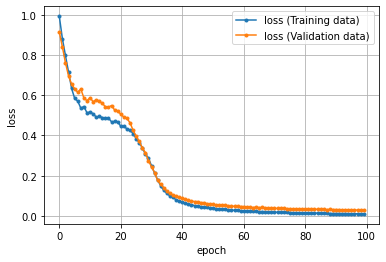

# Functional（関数型）API： 複雑なモデルも定義できる柔軟な書き方


```python
import tensorflow as tf
print('TensorFlow', tf.__version__)
```


```python
import numpy as np
import pandas as pd
import matplotlib.pyplot as plt
%matplotlib inline
```

## 訓練データの作成

座標データの作成


```python
# 座標点データを生成するライブラリのインストール
!pip install playground-data
```

    Requirement already satisfied: playground-data in /usr/local/lib/python3.6/dist-packages (1.1.0)
    Requirement already satisfied: numpy in /usr/local/lib/python3.6/dist-packages (from playground-data) (1.18.5)
    Requirement already satisfied: matplotlib in /usr/local/lib/python3.6/dist-packages (from playground-data) (3.2.2)
    Requirement already satisfied: kiwisolver>=1.0.1 in /usr/local/lib/python3.6/dist-packages (from matplotlib->playground-data) (1.2.0)
    Requirement already satisfied: cycler>=0.10 in /usr/local/lib/python3.6/dist-packages (from matplotlib->playground-data) (0.10.0)
    Requirement already satisfied: python-dateutil>=2.1 in /usr/local/lib/python3.6/dist-packages (from matplotlib->playground-data) (2.8.1)
    Requirement already satisfied: pyparsing!=2.0.4,!=2.1.2,!=2.1.6,>=2.0.1 in /usr/local/lib/python3.6/dist-packages (from matplotlib->playground-data) (2.4.7)
    Requirement already satisfied: six in /usr/local/lib/python3.6/dist-packages (from cycler>=0.10->matplotlib->playground-data) (1.15.0)
    


```python
# playground-dataライブラリのplygdataパッケージを「pg」という別名でインポート
import plygdata as pg

# 設定値を定数として定義
PROBLEM_DATA_TYPE = pg.DatasetType.ClassifyCircleData # 問題種別：「分類（Classification）」、データ種別：「円（CircleData）」を選択
TRAINING_DATA_RATIO = 0.5  # データの何％を訓練【Training】用に？ (残りは精度検証【Validation】用) ： 50％
DATA_NOISE = 0.0           # ノイズ： 0％

# 定義済みの定数を引数に指定して、データを生成する
data_list = pg.generate_data(PROBLEM_DATA_TYPE, DATA_NOISE)

# データを「訓練用」と「精度検証用」を指定の比率で分割し、さらにそれぞれを「データ（X）」と「教師ラベル（y）」に分ける
X_train, y_train, X_valid, y_valid = pg.split_data(data_list, training_size=TRAINING_DATA_RATIO)

# データ分割後の各変数の内容例として、それぞれ5件ずつ出力（※出力内容は実行ごとに異なる）
print('X_train:'); print(X_train[:5]) # [[-0.07940614  1.15175421], ……]
print('y_train:'); print(y_train[:5]) # [[ 1.], ……  [-1.]]
print('X_valid:'); print(X_valid[:5]) # [[ 0.10066901  1.19950826], ……]
print('y_valid:'); print(y_valid[:5]) # [[ 1.], ……  [-1.]]
```

    X_train:
    [[-0.0663581  -0.28559949]
     [-2.74855785 -2.9675226 ]
     [-0.74557245 -4.1791665 ]
     [ 0.50518192 -4.07602235]
     [-0.06064639  0.35973169]]
    y_train:
    [[ 1.]
     [-1.]
     [-1.]
     [-1.]
     [ 1.]]
    X_valid:
    [[-0.89224202 -0.03055895]
     [ 0.11829444 -0.55268204]
     [-0.33692052 -4.66383892]
     [-0.86498858 -1.39119657]
     [-0.55711975 -3.86055545]]
    y_valid:
    [[ 1.]
     [ 1.]
     [-1.]
     [ 1.]
     [-1.]]
    

### ディープニューラルネットワークのモデル設計
- 入力の数（`INPUT_FEATURES`）は、$X_1$と$X_2$で**2つ**
- 隠れ層のレイヤー数は、**2つ**
  - 隠れ層にある1つ目のニューロンの数（`LAYER1_NEURONS`）は、**3つ**
  - 隠れ層にある2つ目のニューロンの数（`LAYER2_NEURONS`）は、**3つ**
- 出力層にあるニューロンの数（`OUTPUT_RESULTS`）は、**1つ**


```python
import tensorflow as tf
from tensorflow.keras import layers

# 定数（モデル定義時に必要となる数値）
INPUT_FEATURES = 2  # 入力（特徴）の数： 2
LAYER1_NEURONS = 3  # ニューロンの数： 3
LAYER2_NEURONS = 3  # ニューロンの数： 3
OUTPUT_RESULTS = 1  # 出力結果の数： 1
```

## 正解率（精度）カスタム指標


```python
import tensorflow.keras.backend as K

def tanh_accuracy(y_true, y_pred):
    """
    正解率を算出する
    Params
    ----------------
    y_true:正解データ
    y_pred:予測値

    """
    threshold = K.cast(0.0, y_pred.dtype)    # -1, 1を分ける閾値を作る
    y_pred = K.cast(y_pred >= threshold, y_pred.dtype)    # 閾値未満で0, 以上で1に変換
    # 2倍して-1.0することで、0／1を-1.0／1.0にスケール変換して正解率を計算
    return K.mean(K.equal(y_true, y_pred * 2 -1.0), axis=1)
```

## モデル定義

### Modelクラスのサブクラス化を利用した書き方


```python
"""
活性化関数を変数（ハイパーパラメータ）として定義
"""
# 変数（モデル定義時に必要となる数値）
activation1 = layers.Activation(
    'tanh',             # 活性化関数（隠れ層用）：tanh関数
    name='activation1'  # 活性化関数名
)
activation2 = layers.Activation(
    'tanh',             # 活性化関数（隠れ層用）：tanh関数
    name='activation2'  # 活性化関数名
)
acti_out = layers.Activation(
    'tanh',             # 活性化関数（隠れ層用）：tanh関数
    name='acti_out'     # 活性化関数名
)

# tf.keras.Modelをサブクラス化してモデルを定義
class NN(tf.keras.Model):
    def __init__(self, *args, **kwargs):
        super(NN, self).__init__(*args, **kwargs)

        """
        レイヤーを定義
        """
        # 入力層の定義は実際の入力によって決まるので不要
        # 隠れ層：layer1
        # 全結合層
        self.layer1 = layers.Dense(
            name='layer1',          # 表示用に名前付け
            units=LAYER1_NEURONS    # ユニット数
        )
        # 隠れ層：layer2
        # 全結合層
        self.layer2 = layers.Dense(
            name='layer2',          # 表示用に名前付け
            units=LAYER2_NEURONS    # ユニット数
        )
        # 出力層：layer_out
        # 全結合層
        self.layer_out = layers.Dense(
            name='layer_out',       # 表示用に名前付け
            units=OUTPUT_RESULTS    # ユニット数
        )
    """
    フォワードパスを定義
    """
    def call(self, inputs, training=None):
        # 出力=活性化関数（第n層(入力)）の形式で記述
        x1 = activation1(self.layer1(inputs))
        x2 = activation2(self.layer2(x1))
        outputs = acti_out(self.layer_out(x2))
        return outputs
"""
モデルの生成
"""
model = NN()

# モデルの内容の出力はできません
# 計算グラフを構築できてないため
# model.summary()
```

モデルの内容を表示したい場合は、推論を一度実行してからモデルの内容を出力する方法で実現できます。


```python
model1 = NN(name='subclassing_model1') # モデルの生成

# 方法1： 推論して動的にグラフを構築する
temp_input = [[0.1,-0.2]]                         # 仮の入力値
temp_output = model1.predict(temp_input)          # 推論の実行

# モデルの内容を出力
model1.summary()
```

    Model: "subclassing_model1"
    _________________________________________________________________
    Layer (type)                 Output Shape              Param #   
    =================================================================
    layer1 (Dense)               multiple                  9         
    _________________________________________________________________
    layer2 (Dense)               multiple                  12        
    _________________________________________________________________
    layer_out (Dense)            multiple                  4         
    =================================================================
    Total params: 25
    Trainable params: 25
    Non-trainable params: 0
    _________________________________________________________________
    

指定先レイヤーなどを変数にして中に作成した`Dense`オブジェクトを代入しています。<br>また、入力層の形状指定が`input_shape`ではなく、`shape`という引数名になっています。

### モデルの構成図を表示する


```python
tf.keras.utils.plot_model(
    model1,
    show_shapes=True,
    show_layer_names=True,
    to_file='model.png'
)
from IPython.display import Image
Image(retina=False, filename='model.png')

tf.keras.backend.clear_session()    # 計算グラフを破棄する
del model1                          # 変数を削除

```

出力で気になるのは、構成図が正確に描画されない点です。モデルの生成時に引数nameに指定した名前だけが表示されているだけです。（今後改善されるとは思いますが、2.3の段階では）出力はする意味がないです。

## 学習と推論


```python
# 最適化、損失関数の定義を行い精度の指標を設定してコンパイル
model.compile(tf.keras.optimizers.SGD(learning_rate=0.03), 'mean_squared_error', [tanh_accuracy])
# 学習の開始
hist = model.fit(
    X_train,
    y_train,
    validation_data=(X_valid, y_valid),
    batch_size=15,
)
# 推論
model.predict([[0.1, -0.2]])
```

    17/17 [==============================] - 0s 9ms/step - loss: 0.9638 - tanh_accuracy: 0.6440 - val_loss: 0.9252 - val_tanh_accuracy: 0.6560
    


    array([[0.24329793]], dtype=float32)


他の書き方もあります。


```python
tf.keras.backend.clear_session()    # 計算グラフを破棄する
del model                           # 変数を削除
```


```python
model = NN()
```

## 学習

学習の書き方は`compile/fit`を使用して書くほかに以下の書き方があります。

-  tf.GradientTapeクラス（自動微分の記録機能）を使った柔軟で拡張性の高い書き方（PyTorchの書き方に近い）

### オプティマイザ（最適化用オブジェクト）


```python
# 更新時の学習率
optimizer = tf.keras.optimizers.SGD(learning_rate=0.03)
```

`compile()`との表記方法の違いは、`compile()`メソッドの引数に指定するか、<br>変数に代入するかだけです。

### 損失関数


```python
# 損失関数の定義
criterion = tf.keras.losses.MeanSquaredError()
```

### 評価関数


```python
import tensorflow.keras.backend as K

# カスタムの評価関数を実装（TensorFlow低水準API利用）
# （tf.keras.metrics.binary_accuracy()の代わり）
def tanh_accuracy(y_true, y_pred):           # y_trueは正解、y_predは予測（出力）
  threshold = K.cast(0.0, y_pred.dtype)              # -1か1かを分ける閾値を作成
  y_pred = K.cast(y_pred >= threshold, y_pred.dtype) # 閾値未満で0、以上で1に変換
  # 2倍して-1.0することで、0／1を-1.0／1.0にスケール変換して正解率を計算
  return K.mean(K.equal(y_true, y_pred * 2 - 1.0), axis=-1)

# カスタムの評価関数クラスを実装（サブクラス化）
# （tf.keras.metrics.BinaryAccuracy()の代わり）
class TanhAccuracy(tf.keras.metrics.Mean):
  def __init__(self, name='tanh_accuracy', dtype=None):
    super(TanhAccuracy, self).__init__(name, dtype)

  # 正解率の状態を更新する際に呼び出される関数をカスタマイズ
  def update_state(self, y_true, y_pred, sample_weight=None):
    matches = tanh_accuracy(y_true, y_pred)
    return super(TanhAccuracy, self).update_state(
        matches, sample_weight=sample_weight)
```


```python
# 評価関数の定義
train_loss = tf.keras.metrics.Mean(name='train_loss')
train_accuracy = TanhAccuracy(name='train_accuracy')
valid_loss = tf.keras.metrics.Mean(name='valid_loss')
valid_accuracy = TanhAccuracy(name='valid_accuracy')
```

ここまでが`compile()`メソッドに対応する部分です。

### tf.dataデータセット

訓練データ・精度検証データとミニバッチ用のバッチサイズの指定


```python
# 入力データのテンソル化
X_train_f32 = X_train.astype('float32')         # np.float64型 → np.float32型
y_train_f32 = y_train.astype('float32')
X_valid_f32 = X_valid.astype('float32')
y_valid_f32 = y_valid.astype('float32')

# 入力データと教師ラベルを1つのスライスデータセットにまとめる
# 学習用テンソルスライスデータセット
train_sliced = tf.data.Dataset.from_tensor_slices((X_train_f32, y_train_f32))
# 検証用テンソルスライスデータセット
valid_sliced = tf.data.Dataset.from_tensor_slices((X_valid_f32, y_valid_f32))

# 学習用データをシャッフルしてミニバッチ用でデータセットにする
train_dataset = train_sliced.shuffle(250).batch(15)
valid_dataset = valid_sliced.batch(15)
print(train_dataset)

```

    <BatchDataset shapes: ((None, 2), (None, 1)), types: (tf.float32, tf.float32)>
    

`fit()`メソッドの引数を引数に指定するか`tf.data`機能を使用し、<br>データセットを作成して変数に代入するかが違います。

- `tf.data.Dataset.from_tensor_slices()でNumpy多次元配列を`tf.data`で使用できる形に変換しています。
- 訓練時には基本的にシャッフルが必要です。`shulle()`メソッドの引数であるバッファサイズには基本的に全データ件数以上を指定します。
- 最後に`batch()`メソッドを呼び出して、訓練用/精度検証用のデータセットを生成すれば完了です。

ここからは、学習と評価の処理を確認します。<br>この処理の方法はほぼ`PyTorch`と同じです。

### 1回分の学習

`fit()`メソッドでは学習と評価の処理は完全に隠蔽されています。


```python
import tensorflow.keras.backend as K

# 1回分の学習
@tf.function
def train_step(train_X, train_y):
    # 訓練モードに設定
    training = True
    # tf.keras内部に伝える
    K.set_learning_phase(training)

    # 勾配をテープに記録
    with tf.GradientTape() as tape:
        # 順伝播で出力結果を取得
        pred_y = model(train_X, training=training)
        # 出力結果と正解ラベルから損失尾計算し、勾配を求める
        loss = criterion(pred_y, train_y)       # 誤差から損失を取得
        # 逆伝播の処理として勾配を計算
        gradient = tape.gradient(loss, model.trainable_weights)
        # 勾配を使ってパラメータ(重みとバイアス)を更新
        optimizer.apply_gradients(zip(gradient, model.trainable_weights))   # 指定されたデータ分の最適化を実施
        # 損失と正解率を算出して保存
        train_loss(loss)
        train_accuracy(train_y, pred_y)

# 1回分の検証
def valid_step(valid_X, valid_y):
    # 評価モードに設定（※dropoutなどの挙動が評価用になる）
    training = False
    K.set_learning_phase(training)  # tf.keras内部にも伝える

    # フォワードプロパゲーションで出力結果を取得
    #valid_X                                   # 入力データ
    pred_y = model(valid_X, training=training) # 出力結果
    #valid_y                                   # 正解ラベル

    # 出力結果と正解ラベルから損失を計算
    loss = criterion(pred_y, valid_y)     # 誤差（出力結果と正解ラベルの差）から損失を取得
    # ※評価時は勾配を計算しない

    # 損失と正解率を算出して保存
    valid_loss(loss)
    valid_accuracy(valid_y, pred_y)

```

- 学習処理を実装した`train_step`関数
- 精度検証処理を実装した`valid_step`関数

があり、それぞれ、ミニバッチ学習の1回分の学習と精度検証を行います

##### 勾配テープと自動微分

`train_step`関数には`pred_y=model(train_X)`というコードで推論が行われて予測値を取得しています。<br>`loss=criterion(pred_y, train_y)`というコードでその予測値と正解ラベルを使用して損失（loss）を計算しています。<br>この2行のコードは、with tf.GradientTape() as tapeというスコープ内で実行されています。

tf.GradientTapeクラスは、勾配テープ（Gradient Tape）と呼ばれるTensorFlow 2.0の新機能です。<br>「テープ」とは“カセットテープ”に音楽を記録するのをイメージ。<br>つまり、スコープ内で取得した損失（loss）を使って、自動微分（Automatic Differentiation）した際に、計算された勾配が記録されるようになります。

##### 重みの更新

モデル内の重みやバイアスの更新は、`optimizer.apply_gradients(zip(gradient, model.trainable_weights))`メソッドを呼ぶことで初めて更新されます。

##### 損失と正解率

1回の学習が終了したあとは損失と正解率を算出して、状況を確認します。<br>ここで使用する関数が評価関数です。<br>訓練用の損失の評価関数は`train_loss`、正解率の評価関数は`train_accuracy`という変数に事前に定義しています。<br>これらを呼び出している箇所が`train_loss(loss)`と`train_accuracy(train_y, pred_y)`の2行です。

##### 精度検証の処理

`valid_step`関数は学習と違い勾配計算や重みの更新は不要で、損失のみを計算して結果を評価関数である`valid_loss`と`valid_accuracy`変数を使用して保存しています。

#### @tf.functionとAutoGraph

`@tf.function`というデコーダーは必須処理ではないですが`for`ループなどの繰り返し処理において、パフォーマンスが良くなる効果があります。<br>実際に上記のコードで実行時間を計測すると`@tf.function`の有無で5.6倍高速化されます。

@tf.functionは、TensorFlow 2.0でEager（即時）実行モードがデフォルトになったために導入された機能です。<br>Eager実行モードでは、説明済みだが、実行時に動的に計算グラフが作成されます。<br>しかし何度も動的に作成すると、当然、実行速度は遅くなってしまうため、1回目の実行の際に計算グラフを構築したら、2回目はそれを静的な計算グラフのように使い回して処理を高速化しています。<br>@tf.functionはこれを行うための機能です。

また@tf.functionは、Pythonの`if`文や`for`文／`while`文などで書かれたコードを、計算グラフ用の`tf.cond()`関数や`tf.while_loop()`関数などに自動的に置き換える。この機能は、AutoGraph（自動グラフ）と呼ばれています（※「Grad」ではなく「Graph」、見間違いに注意）。

　ただし、副作用もあるので、どこにでも指定できるわけではなく、指定する関数のコードも注意深く書く必要があります。


## 学習の実行

ミニバッチ学習で、バッチごとに学習＆評価する処理を、forループを使って記載します。<br>まずデータ全体に相当するエポックごとのforループを作り、その中にミニバッチごとのforループを作る、という2階層の構造を作る。


```python
# 定数（学習／評価時に必要となるもの）
EPOCHS = 100             # エポック数： 100

# 損失の履歴を保存するための変数
train_history = []
valid_history = []

for epoch in range(EPOCHS):        
    # エポックのたびに、メトリクスの値をリセット
    train_loss.reset_states()      # 「訓練」時における累計「損失値」
    train_accuracy.reset_states()  # 「訓練」時における累計「正解率」
    valid_loss.reset_states()      # 「評価」時における累計「損失値」
    valid_accuracy.reset_states()  # 「評価」時における累計「正解率」

    for train_X, train_y in train_dataset:
        # 【重要】1ミニバッチ分の「訓練（学習）」を実行
        train_step(train_X, train_y)
            
    for valid_X, valid_y in valid_dataset:
        # 【重要】1ミニバッチ分の「評価（精度検証）」を実行
        valid_step(valid_X, valid_y)

    # ミニバッチ単位で累計してきた損失値や正解率の平均を取る
    n = epoch + 1                          # 処理済みのエポック数
    avg_loss = train_loss.result()         # 訓練用の平均損失値
    avg_acc = train_accuracy.result()      # 訓練用の平均正解率
    avg_val_loss = valid_loss.result()     # 訓練用の平均損失値
    avg_val_acc = valid_accuracy.result()  # 訓練用の平均正解率

    # グラフ描画のために損失の履歴を保存する
    train_history.append(avg_loss)
    valid_history.append(avg_val_loss)

    # 損失や正解率などの情報を表示
    print(f'[Epoch {n:3d}/{EPOCHS:3d}]' \
            f' loss: {avg_loss:.5f}, acc: {avg_acc:.5f}' \
            f' val_loss: {avg_val_loss:.5f}, val_acc: {avg_val_acc:.5f}')

print('Finished Training')
print(model.get_weights())  # 学習後のパラメーターの情報を表示
```

    [Epoch   1/100] loss: 0.99291, acc: 0.52800 val_loss: 0.91551, val_acc: 0.59200
    [Epoch   2/100] loss: 0.88221, acc: 0.64000 val_loss: 0.84062, val_acc: 0.65600
    [Epoch   3/100] loss: 0.79771, acc: 0.74400 val_loss: 0.76234, val_acc: 0.78800
    [Epoch   4/100] loss: 0.71637, acc: 0.80400 val_loss: 0.69657, val_acc: 0.79200
    [Epoch   5/100] loss: 0.63381, acc: 0.80400 val_loss: 0.65538, val_acc: 0.79600
    [Epoch   6/100] loss: 0.58436, acc: 0.83600 val_loss: 0.63210, val_acc: 0.78800
    [Epoch   7/100] loss: 0.57059, acc: 0.83600 val_loss: 0.61477, val_acc: 0.80800
    [Epoch   8/100] loss: 0.53577, acc: 0.82000 val_loss: 0.63112, val_acc: 0.78000
    [Epoch   9/100] loss: 0.54398, acc: 0.82800 val_loss: 0.58654, val_acc: 0.80000
    [Epoch  10/100] loss: 0.51284, acc: 0.82800 val_loss: 0.57302, val_acc: 0.80400
    [Epoch  11/100] loss: 0.51638, acc: 0.82000 val_loss: 0.58781, val_acc: 0.80800
    [Epoch  12/100] loss: 0.50828, acc: 0.84400 val_loss: 0.56796, val_acc: 0.79600
    [Epoch  13/100] loss: 0.49135, acc: 0.83200 val_loss: 0.57761, val_acc: 0.80400
    [Epoch  14/100] loss: 0.49512, acc: 0.83600 val_loss: 0.57157, val_acc: 0.78000
    [Epoch  15/100] loss: 0.48920, acc: 0.82000 val_loss: 0.55899, val_acc: 0.80800
    [Epoch  16/100] loss: 0.48664, acc: 0.83200 val_loss: 0.54333, val_acc: 0.79200
    [Epoch  17/100] loss: 0.48601, acc: 0.82800 val_loss: 0.54088, val_acc: 0.78400
    [Epoch  18/100] loss: 0.46801, acc: 0.82800 val_loss: 0.54893, val_acc: 0.80800
    [Epoch  19/100] loss: 0.46967, acc: 0.82000 val_loss: 0.52636, val_acc: 0.80400
    [Epoch  20/100] loss: 0.46848, acc: 0.81600 val_loss: 0.52136, val_acc: 0.80000
    [Epoch  21/100] loss: 0.44531, acc: 0.84800 val_loss: 0.50578, val_acc: 0.79600
    [Epoch  22/100] loss: 0.44505, acc: 0.82400 val_loss: 0.49121, val_acc: 0.81600
    [Epoch  23/100] loss: 0.43323, acc: 0.83600 val_loss: 0.48448, val_acc: 0.81200
    [Epoch  24/100] loss: 0.42674, acc: 0.83200 val_loss: 0.46350, val_acc: 0.80400
    [Epoch  25/100] loss: 0.40923, acc: 0.84000 val_loss: 0.42581, val_acc: 0.82400
    [Epoch  26/100] loss: 0.38460, acc: 0.84800 val_loss: 0.39633, val_acc: 0.82400
    [Epoch  27/100] loss: 0.36471, acc: 0.85600 val_loss: 0.37045, val_acc: 0.82800
    [Epoch  28/100] loss: 0.33830, acc: 0.85600 val_loss: 0.33870, val_acc: 0.84400
    [Epoch  29/100] loss: 0.30767, acc: 0.88800 val_loss: 0.31460, val_acc: 0.84800
    [Epoch  30/100] loss: 0.28706, acc: 0.90400 val_loss: 0.27502, val_acc: 0.94800
    [Epoch  31/100] loss: 0.24916, acc: 0.98000 val_loss: 0.24363, val_acc: 0.94800
    [Epoch  32/100] loss: 0.21245, acc: 0.98800 val_loss: 0.21578, val_acc: 0.97200
    [Epoch  33/100] loss: 0.17861, acc: 0.98800 val_loss: 0.17603, val_acc: 0.97200
    [Epoch  34/100] loss: 0.14841, acc: 0.98800 val_loss: 0.15705, val_acc: 0.98400
    [Epoch  35/100] loss: 0.12681, acc: 0.99600 val_loss: 0.13915, val_acc: 0.97600
    [Epoch  36/100] loss: 0.11187, acc: 0.99600 val_loss: 0.12381, val_acc: 0.98400
    [Epoch  37/100] loss: 0.09895, acc: 1.00000 val_loss: 0.11176, val_acc: 0.98400
    [Epoch  38/100] loss: 0.09249, acc: 1.00000 val_loss: 0.10385, val_acc: 0.98000
    [Epoch  39/100] loss: 0.07973, acc: 1.00000 val_loss: 0.09824, val_acc: 0.98000
    [Epoch  40/100] loss: 0.07360, acc: 1.00000 val_loss: 0.09379, val_acc: 1.00000
    [Epoch  41/100] loss: 0.06866, acc: 1.00000 val_loss: 0.08671, val_acc: 0.98400
    [Epoch  42/100] loss: 0.06265, acc: 1.00000 val_loss: 0.08264, val_acc: 0.99200
    [Epoch  43/100] loss: 0.05898, acc: 1.00000 val_loss: 0.07804, val_acc: 0.98000
    [Epoch  44/100] loss: 0.05585, acc: 1.00000 val_loss: 0.07381, val_acc: 0.99600
    [Epoch  45/100] loss: 0.05096, acc: 1.00000 val_loss: 0.07126, val_acc: 0.99600
    [Epoch  46/100] loss: 0.04919, acc: 1.00000 val_loss: 0.07119, val_acc: 0.99600
    [Epoch  47/100] loss: 0.04585, acc: 1.00000 val_loss: 0.06564, val_acc: 0.99600
    [Epoch  48/100] loss: 0.04301, acc: 1.00000 val_loss: 0.06597, val_acc: 0.98400
    [Epoch  49/100] loss: 0.04180, acc: 1.00000 val_loss: 0.06067, val_acc: 0.99600
    [Epoch  50/100] loss: 0.03974, acc: 1.00000 val_loss: 0.06047, val_acc: 0.99200
    [Epoch  51/100] loss: 0.03756, acc: 1.00000 val_loss: 0.05739, val_acc: 0.99600
    [Epoch  52/100] loss: 0.03631, acc: 1.00000 val_loss: 0.05462, val_acc: 1.00000
    [Epoch  53/100] loss: 0.03463, acc: 1.00000 val_loss: 0.05469, val_acc: 1.00000
    [Epoch  54/100] loss: 0.03263, acc: 1.00000 val_loss: 0.05464, val_acc: 0.99200
    [Epoch  55/100] loss: 0.03253, acc: 1.00000 val_loss: 0.05254, val_acc: 0.99600
    [Epoch  56/100] loss: 0.03038, acc: 1.00000 val_loss: 0.05068, val_acc: 0.99200
    [Epoch  57/100] loss: 0.02952, acc: 1.00000 val_loss: 0.04951, val_acc: 0.99600
    [Epoch  58/100] loss: 0.02779, acc: 1.00000 val_loss: 0.04723, val_acc: 1.00000
    [Epoch  59/100] loss: 0.02707, acc: 1.00000 val_loss: 0.04728, val_acc: 0.99600
    [Epoch  60/100] loss: 0.02523, acc: 1.00000 val_loss: 0.04644, val_acc: 0.99600
    [Epoch  61/100] loss: 0.02518, acc: 1.00000 val_loss: 0.04653, val_acc: 1.00000
    [Epoch  62/100] loss: 0.02389, acc: 1.00000 val_loss: 0.04504, val_acc: 0.99600
    [Epoch  63/100] loss: 0.02353, acc: 1.00000 val_loss: 0.04398, val_acc: 0.99600
    [Epoch  64/100] loss: 0.02402, acc: 1.00000 val_loss: 0.04138, val_acc: 1.00000
    [Epoch  65/100] loss: 0.02259, acc: 1.00000 val_loss: 0.04385, val_acc: 0.99200
    [Epoch  66/100] loss: 0.02146, acc: 1.00000 val_loss: 0.04114, val_acc: 1.00000
    [Epoch  67/100] loss: 0.02151, acc: 1.00000 val_loss: 0.04186, val_acc: 0.99600
    [Epoch  68/100] loss: 0.02079, acc: 1.00000 val_loss: 0.04061, val_acc: 1.00000
    [Epoch  69/100] loss: 0.01929, acc: 1.00000 val_loss: 0.03928, val_acc: 0.99600
    [Epoch  70/100] loss: 0.01890, acc: 1.00000 val_loss: 0.03886, val_acc: 1.00000
    [Epoch  71/100] loss: 0.01897, acc: 1.00000 val_loss: 0.03783, val_acc: 0.99600
    [Epoch  72/100] loss: 0.01777, acc: 1.00000 val_loss: 0.03699, val_acc: 0.99600
    [Epoch  73/100] loss: 0.01717, acc: 1.00000 val_loss: 0.03897, val_acc: 1.00000
    [Epoch  74/100] loss: 0.01721, acc: 1.00000 val_loss: 0.03824, val_acc: 1.00000
    [Epoch  75/100] loss: 0.01773, acc: 1.00000 val_loss: 0.03596, val_acc: 1.00000
    [Epoch  76/100] loss: 0.01666, acc: 1.00000 val_loss: 0.03587, val_acc: 1.00000
    [Epoch  77/100] loss: 0.01568, acc: 1.00000 val_loss: 0.03497, val_acc: 1.00000
    [Epoch  78/100] loss: 0.01607, acc: 1.00000 val_loss: 0.03430, val_acc: 1.00000
    [Epoch  79/100] loss: 0.01478, acc: 1.00000 val_loss: 0.03444, val_acc: 0.99200
    [Epoch  80/100] loss: 0.01464, acc: 1.00000 val_loss: 0.03438, val_acc: 0.99600
    [Epoch  81/100] loss: 0.01479, acc: 1.00000 val_loss: 0.03280, val_acc: 1.00000
    [Epoch  82/100] loss: 0.01439, acc: 1.00000 val_loss: 0.03285, val_acc: 1.00000
    [Epoch  83/100] loss: 0.01354, acc: 1.00000 val_loss: 0.03347, val_acc: 1.00000
    [Epoch  84/100] loss: 0.01386, acc: 1.00000 val_loss: 0.03327, val_acc: 0.99600
    [Epoch  85/100] loss: 0.01364, acc: 1.00000 val_loss: 0.03273, val_acc: 0.99600
    [Epoch  86/100] loss: 0.01280, acc: 1.00000 val_loss: 0.03330, val_acc: 1.00000
    [Epoch  87/100] loss: 0.01272, acc: 1.00000 val_loss: 0.03298, val_acc: 1.00000
    [Epoch  88/100] loss: 0.01232, acc: 1.00000 val_loss: 0.03124, val_acc: 1.00000
    [Epoch  89/100] loss: 0.01187, acc: 1.00000 val_loss: 0.03225, val_acc: 1.00000
    [Epoch  90/100] loss: 0.01184, acc: 1.00000 val_loss: 0.03151, val_acc: 1.00000
    [Epoch  91/100] loss: 0.01178, acc: 1.00000 val_loss: 0.03146, val_acc: 1.00000
    [Epoch  92/100] loss: 0.01181, acc: 1.00000 val_loss: 0.03113, val_acc: 1.00000
    [Epoch  93/100] loss: 0.01132, acc: 1.00000 val_loss: 0.03024, val_acc: 1.00000
    [Epoch  94/100] loss: 0.01185, acc: 1.00000 val_loss: 0.02975, val_acc: 1.00000
    [Epoch  95/100] loss: 0.01078, acc: 1.00000 val_loss: 0.03004, val_acc: 0.99600
    [Epoch  96/100] loss: 0.01050, acc: 1.00000 val_loss: 0.02914, val_acc: 1.00000
    [Epoch  97/100] loss: 0.01085, acc: 1.00000 val_loss: 0.02928, val_acc: 1.00000
    [Epoch  98/100] loss: 0.01039, acc: 1.00000 val_loss: 0.02870, val_acc: 1.00000
    [Epoch  99/100] loss: 0.01035, acc: 1.00000 val_loss: 0.02930, val_acc: 1.00000
    [Epoch 100/100] loss: 0.00980, acc: 1.00000 val_loss: 0.02855, val_acc: 1.00000
    Finished Training
    [array([[-0.20810771, -0.45543644, -0.697687  ],
           [ 0.57354254, -0.59364736, -0.00997995]], dtype=float32), array([-1.171215 , -1.2363254,  1.3331527], dtype=float32), array([[ 0.67109454, -0.735624  ,  1.6237395 ],
           [-1.5074528 , -0.29162553,  0.9091516 ],
           [ 1.8991942 ,  0.6509447 , -0.06977444]], dtype=float32), array([-0.30088264, -0.6539693 ,  0.53475934], dtype=float32), array([[ 1.8776736],
           [ 0.8731437],
           [-1.9582909]], dtype=float32), array([-1.6610765], dtype=float32)]
    

エポックごとのループは`for epoch in range(EPOCH):`で、<br>ミニバッチごとのループは`for train_X, train_y in train_dataset:`／`for valid_X, valid_y in valid_dataset:`というコードで記載されています。

ミニバッチごとのループの中で学習関数の`train_step`や検証関数`valid_step`を呼出し学習と評価を行っています。

他のコードは学習中の損失や正解率などの精度検証/状況表示のためのコードです。


##### 評価

評価関数である`train_loss`, `train_accuracy`, `valid_loss`, `valid_accuracy`は共通して以下のメソッドがあります。

- `reset_states()`メソッド：損失や正解率などのメトリクス（測定値）をリセット
- `result()`メソッド：メトリクス（測定値）の取得

この2つのメソッドを使用してエポックごとにまずメトリクスの値を初期化、<br>全バッチ処理後にメトリクスの値を取得、<br>その内容を`print()`関数で表示

## 推論


```python
# 推論用の入力データ
python_input1 = [[0.1, -0.2]]       # pythonのリスト値/Numpyの多次元配列値

# Pythonのリスト値やNumpy多次元配列値はテンソルに変換する必要があります
tensor_input = tf.convert_to_tensor(python_input1, dtype=tf.float32)

predict = model(tensor_input)
print(predict)                      # テンソルの入力しか受け付けない
```

    tf.Tensor([[0.9876181]], shape=(1, 1), dtype=float32)
    

推論は`model()`の中に入力値を入れることで推測できます。<br>関数の呼び出すと`__call__`特殊メソッドが呼び出される仕組みです。<br>`call()`メソッドを呼ぶことで順伝播が実行されて予測値が計算されます。


```python
import matplotlib.pyplot as plt

# 学習結果（損失）のグラフを描画
epochs = len(train_history)
plt.plot(range(epochs), train_history, marker='.', label='loss (Training data)')
plt.plot(range(epochs), valid_history, marker='.', label='loss (Validation data)')
plt.legend(loc='best')
plt.grid()
plt.xlabel('epoch')
plt.ylabel('loss')
plt.show()
```





メトリクスのうち、損失の値を、各エポックの履歴として`train_history／valid_history`変数に保存しています。<br>このようにすることで、グラフを描画することも可能です。

## 作成済みのモデルのリセット

一度モデルを削除してリセットをしたい場合は、以下のコードを実行することで実現ができます。<br>計算グラフはモデルを設計したことによりライブラリ内部で自動で構築されている`TensorBoard`というツールによってデータフローグラフを視覚的に確認できるものです。


```python
tf.keras.backend.clear_session()    # 計算グラフを破棄する
del model                           # 変数を削除
```


```python
# !pip uninstall playground-data
```
