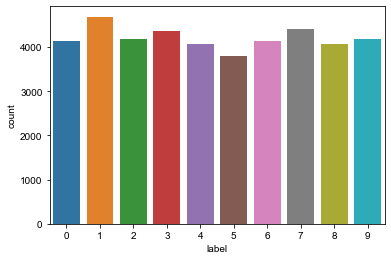

# 画像認識で多層パーセプトロンを使用する

kaggleの[Digit Recognizer](https://www.kaggle.com/c/digit-recognizer/overview)（MNISTデータセット）を使用して、`28×28`のグレースケール画像データに対して`0~9`のラベルを予測します。


```python
!ls ./data
```

    digit-recognizer
    house-prices-advanced-regression-techniques
    


```python
!ls ./data/digit-recognizer/
```

    sample_submission.csv
    test.csv
    train.csv
    


```python
import numpy as np
import pandas as pd
import matplotlib.pyplot as plt
%matplotlib inline
```


```python
path ='./data/digit-recognizer/'
train = pd.read_csv(path + 'train.csv')
test = pd.read_csv(path + 'test.csv')

train.head()
```


<div>
<style scoped>
    .dataframe tbody tr th:only-of-type {
        vertical-align: middle;
    }

    .dataframe tbody tr th {
        vertical-align: top;
    }

    .dataframe thead th {
        text-align: right;
    }
</style>
<table border="1" class="dataframe">
  <thead>
    <tr style="text-align: right;">
      <th></th>
      <th>label</th>
      <th>pixel0</th>
      <th>pixel1</th>
      <th>pixel2</th>
      <th>pixel3</th>
      <th>pixel4</th>
      <th>pixel5</th>
      <th>pixel6</th>
      <th>pixel7</th>
      <th>pixel8</th>
      <th>...</th>
      <th>pixel774</th>
      <th>pixel775</th>
      <th>pixel776</th>
      <th>pixel777</th>
      <th>pixel778</th>
      <th>pixel779</th>
      <th>pixel780</th>
      <th>pixel781</th>
      <th>pixel782</th>
      <th>pixel783</th>
    </tr>
  </thead>
  <tbody>
    <tr>
      <th>0</th>
      <td>1</td>
      <td>0</td>
      <td>0</td>
      <td>0</td>
      <td>0</td>
      <td>0</td>
      <td>0</td>
      <td>0</td>
      <td>0</td>
      <td>0</td>
      <td>...</td>
      <td>0</td>
      <td>0</td>
      <td>0</td>
      <td>0</td>
      <td>0</td>
      <td>0</td>
      <td>0</td>
      <td>0</td>
      <td>0</td>
      <td>0</td>
    </tr>
    <tr>
      <th>1</th>
      <td>0</td>
      <td>0</td>
      <td>0</td>
      <td>0</td>
      <td>0</td>
      <td>0</td>
      <td>0</td>
      <td>0</td>
      <td>0</td>
      <td>0</td>
      <td>...</td>
      <td>0</td>
      <td>0</td>
      <td>0</td>
      <td>0</td>
      <td>0</td>
      <td>0</td>
      <td>0</td>
      <td>0</td>
      <td>0</td>
      <td>0</td>
    </tr>
    <tr>
      <th>2</th>
      <td>1</td>
      <td>0</td>
      <td>0</td>
      <td>0</td>
      <td>0</td>
      <td>0</td>
      <td>0</td>
      <td>0</td>
      <td>0</td>
      <td>0</td>
      <td>...</td>
      <td>0</td>
      <td>0</td>
      <td>0</td>
      <td>0</td>
      <td>0</td>
      <td>0</td>
      <td>0</td>
      <td>0</td>
      <td>0</td>
      <td>0</td>
    </tr>
    <tr>
      <th>3</th>
      <td>4</td>
      <td>0</td>
      <td>0</td>
      <td>0</td>
      <td>0</td>
      <td>0</td>
      <td>0</td>
      <td>0</td>
      <td>0</td>
      <td>0</td>
      <td>...</td>
      <td>0</td>
      <td>0</td>
      <td>0</td>
      <td>0</td>
      <td>0</td>
      <td>0</td>
      <td>0</td>
      <td>0</td>
      <td>0</td>
      <td>0</td>
    </tr>
    <tr>
      <th>4</th>
      <td>0</td>
      <td>0</td>
      <td>0</td>
      <td>0</td>
      <td>0</td>
      <td>0</td>
      <td>0</td>
      <td>0</td>
      <td>0</td>
      <td>0</td>
      <td>...</td>
      <td>0</td>
      <td>0</td>
      <td>0</td>
      <td>0</td>
      <td>0</td>
      <td>0</td>
      <td>0</td>
      <td>0</td>
      <td>0</td>
      <td>0</td>
    </tr>
  </tbody>
</table>
<p>5 rows × 785 columns</p>
</div>


```python
train.shape
```


    (42000, 785)


## 前処理


```python
from tensorflow.keras.utils import to_categorical
from sklearn.model_selection import KFold
```


```python
# trainデータから画像データを抽出
train_x = train.drop(['label'], axis=1)
# trainデータから正解ラベルを抽出
train_y = train['label']
```


```python
# trainデータを4分割して学習：検証=3:1とする
kf = KFold(n_splits=4, shuffle=True, random_state=42)
# 学習用と検証用のレコードのインデックス配列を取得
tr_idx, va_idx = list(kf.split(train_x))[0]
tr_idx[:5]
```


    array([0, 2, 3, 5, 8])


```python
# 学習用と検証用の画像データと正解ラベルをそれぞれ取得
tr_x, va_x = train_x.iloc[tr_idx], train_x.iloc[va_idx]
tr_y, va_y = train_y.iloc[tr_idx], train_y.iloc[va_idx]
```


```python
# 画像のピクセルを255で割り、0~1の範囲にしてNumpy.arrayにする
tr_x, va_x = np.array(tr_x / 255.0), np.array(va_x / 255.0)
```


```python
print('before tr_y {}'.format(tr_y))
# 正解ラベルをone-Hot表現する
tr_y = to_categorical(tr_y, 10)
va_y = to_categorical(va_y, 10)

print('after tr_y {}'.format(tr_y))
```

    before tr_y 0        1
    2        1
    3        4
    5        0
    8        5
            ..
    41995    0
    41996    1
    41997    7
    41998    6
    41999    9
    Name: label, Length: 31500, dtype: int64
    after tr_y [[0. 1. 0. ... 0. 0. 0.]
     [0. 1. 0. ... 0. 0. 0.]
     [0. 0. 0. ... 0. 0. 0.]
     ...
     [0. 0. 0. ... 1. 0. 0.]
     [0. 0. 0. ... 0. 0. 0.]
     [0. 0. 0. ... 0. 0. 1.]]
    


```python
# tr_x, va_x, tr_y, va_yの形状の表示
print(tr_x.shape)
print(va_x.shape)
print(tr_y.shape)
print(va_y.shape)
```

    (31500, 784)
    (10500, 784)
    (31500, 10)
    (10500, 10)
    

学習データと検証データともに、2次元のNumpy配列に格納されていることが確認できます。<br>1次元が画像の枚数、2次元が画像のデータ数です。

学習データに格納された正解ラベルの分布を表示します。


```python
from collections import Counter
# 格納された各数字の枚数をカウント
count = Counter(train['label'])
count
```


    Counter({1: 4684,
             0: 4132,
             4: 4072,
             7: 4401,
             3: 4351,
             5: 3795,
             8: 4063,
             9: 4188,
             2: 4177,
             6: 4137})


```python
# 各数字の枚数をカウント
import seaborn as sns
# 0~9までの数字の枚数をグラフ化する
sns.countplot(train['label'])
sns.set(context='talk')
```





```python
# 画像1枚分のデータを出力
print(tr_x[0])
```

    [0.         0.         0.         0.         0.         0.
     0.         0.         0.         0.         0.         0.
     0.         0.         0.         0.         0.         0.
     0.         0.         0.         0.         0.         0.
     0.         0.         0.         0.         0.         0.
     0.         0.         0.         0.         0.         0.
     0.         0.         0.         0.         0.         0.
     0.         0.         0.         0.         0.         0.
     0.         0.         0.         0.         0.         0.
     0.         0.         0.         0.         0.         0.
     0.         0.         0.         0.         0.         0.
     0.         0.         0.         0.         0.         0.
     0.         0.         0.         0.         0.         0.
     0.         0.         0.         0.         0.         0.
     0.         0.         0.         0.         0.         0.
     0.         0.         0.         0.         0.         0.
     0.         0.         0.         0.         0.         0.
     0.         0.         0.         0.         0.         0.
     0.         0.         0.         0.         0.         0.
     0.         0.         0.         0.         0.         0.
     0.         0.         0.         0.         0.         0.
     0.         0.         0.         0.         0.         0.
     0.7372549  1.         0.36862745 0.         0.         0.
     0.         0.         0.         0.         0.         0.
     0.         0.         0.         0.         0.         0.
     0.         0.         0.         0.         0.         0.
     0.         0.         0.         0.74901961 0.98039216 0.99215686
     0.36470588 0.         0.         0.         0.         0.
     0.         0.         0.         0.         0.         0.
     0.         0.         0.         0.         0.         0.
     0.         0.         0.         0.         0.         0.
     0.48235294 0.97254902 0.99215686 0.65490196 0.03921569 0.
     0.         0.         0.         0.         0.         0.
     0.         0.         0.         0.         0.         0.
     0.         0.         0.         0.         0.         0.
     0.         0.         0.         0.31372549 0.96862745 0.99215686
     0.81568627 0.05098039 0.         0.         0.         0.
     0.         0.         0.         0.         0.         0.
     0.         0.         0.         0.         0.         0.
     0.         0.         0.         0.         0.         0.
     0.11372549 0.81176471 0.99215686 0.92156863 0.30196078 0.
     0.         0.         0.         0.         0.         0.
     0.         0.         0.         0.         0.         0.
     0.         0.         0.         0.         0.         0.
     0.         0.         0.         0.21176471 0.81960784 0.99215686
     0.99215686 0.34509804 0.         0.         0.         0.
     0.         0.         0.         0.         0.         0.
     0.         0.         0.         0.         0.         0.
     0.         0.         0.         0.         0.         0.
     0.36470588 0.99607843 0.99215686 0.93333333 0.66666667 0.06666667
     0.         0.         0.         0.         0.         0.
     0.         0.         0.         0.         0.         0.
     0.         0.         0.         0.         0.         0.
     0.         0.         0.         0.09019608 0.82352941 0.99607843
     0.99215686 0.62352941 0.         0.         0.         0.
     0.         0.         0.         0.         0.         0.
     0.         0.         0.         0.         0.         0.
     0.         0.         0.         0.         0.         0.
     0.0627451  0.81960784 0.99215686 0.99607843 0.94117647 0.31764706
     0.         0.         0.         0.         0.         0.
     0.         0.         0.         0.         0.         0.
     0.         0.         0.         0.         0.         0.
     0.         0.         0.         0.         0.10588235 0.99215686
     0.99215686 0.99607843 0.05098039 0.         0.         0.
     0.         0.         0.         0.         0.         0.
     0.         0.         0.         0.         0.         0.
     0.         0.         0.         0.         0.         0.
     0.         0.07843137 0.80784314 0.99607843 0.99607843 0.77647059
     0.02745098 0.         0.         0.         0.         0.
     0.         0.         0.         0.         0.         0.
     0.         0.         0.         0.         0.         0.
     0.         0.         0.         0.         0.         0.65882353
     0.99215686 0.99215686 0.76862745 0.02745098 0.         0.
     0.         0.         0.         0.         0.         0.
     0.         0.         0.         0.         0.         0.
     0.         0.         0.         0.         0.         0.
     0.         0.         0.07843137 0.79607843 0.99215686 0.97254902
     0.29803922 0.         0.         0.         0.         0.
     0.         0.         0.         0.         0.         0.
     0.         0.         0.         0.         0.         0.
     0.         0.         0.         0.         0.         0.08627451
     0.7372549  0.99215686 0.96078431 0.36470588 0.         0.
     0.         0.         0.         0.         0.         0.
     0.         0.         0.         0.         0.         0.
     0.         0.         0.         0.         0.         0.
     0.         0.         0.         0.40392157 0.99215686 0.99215686
     0.74901961 0.         0.         0.         0.         0.
     0.         0.         0.         0.         0.         0.
     0.         0.         0.         0.         0.         0.
     0.         0.         0.         0.         0.         0.
     0.34901961 0.94117647 0.99215686 0.76470588 0.09803922 0.
     0.         0.         0.         0.         0.         0.
     0.         0.         0.         0.         0.         0.
     0.         0.         0.         0.         0.         0.
     0.         0.         0.         0.05882353 0.8627451  0.99215686
     0.99215686 0.31372549 0.         0.         0.         0.
     0.         0.         0.         0.         0.         0.
     0.         0.         0.         0.         0.         0.
     0.         0.         0.         0.         0.         0.
     0.         0.36862745 0.99215686 0.99215686 0.99215686 0.36862745
     0.         0.         0.         0.         0.         0.
     0.         0.         0.         0.         0.         0.
     0.         0.         0.         0.         0.         0.
     0.         0.         0.         0.         0.         0.34901961
     0.98431373 0.99215686 0.98039216 0.51372549 0.         0.
     0.         0.         0.         0.         0.         0.
     0.         0.         0.         0.         0.         0.
     0.         0.         0.         0.         0.         0.
     0.         0.         0.         0.         0.83921569 0.85490196
     0.37254902 0.         0.         0.         0.         0.
     0.         0.         0.         0.         0.         0.
     0.         0.         0.         0.         0.         0.
     0.         0.         0.         0.         0.         0.
     0.         0.         0.         0.         0.         0.
     0.         0.         0.         0.         0.         0.
     0.         0.         0.         0.         0.         0.
     0.         0.         0.         0.         0.         0.
     0.         0.         0.         0.         0.         0.
     0.         0.         0.         0.         0.         0.
     0.         0.         0.         0.         0.         0.
     0.         0.         0.         0.         0.         0.
     0.         0.         0.         0.         0.         0.
     0.         0.         0.         0.         0.         0.
     0.         0.         0.         0.         0.         0.
     0.         0.         0.         0.         0.         0.
     0.         0.         0.         0.         0.         0.
     0.         0.         0.         0.         0.         0.
     0.         0.         0.         0.         0.         0.
     0.         0.         0.         0.         0.         0.
     0.         0.         0.         0.         0.         0.
     0.         0.         0.         0.        ]
    

## 画像データの視覚化

学習データの1~50枚目までを描画します。


```python
# 学習データの描画
plt.figure(figsize=(12, 10))

for i in range(50):
    # 5行10列の画像表示場所の設定
    plt.subplot(5, 10, i+1)
    # グレースケール
    plt.gray()
    # 28×28にリサイズする
    plt.imshow(tr_x[i].reshape((28, 28)), interpolation='nearest')
    
plt.show()
```


## 多層パーセプトロンの構築

2層構造のMLPモデルを構築します


```python
tr_x.shape
```


    (31500, 784)


Sequentialモデルを`.add`で作成します。


```python
from tensorflow.keras.models import Sequential
from tensorflow.keras.layers import Dense, Activation

model = Sequential()

# 第1層
model.add(
    Dense(
        128,                          # ユニット数は128
        input_dim = tr_x.shape[1],    # 入力データの形状の指定
        activation='sigmoid',         # 活性化関数
        name='layer_1'                # 表示用の名称
    )
)
# 第2層
model.add(
    Dense(
        10,                           # 出力ニューロン数 10
        activation='softmax',         # マルチクラス分類用の活性化関数を指定
        name='layer_out'              # 表示用の名称
    )
)

model.compile(
    # 損失関数をクロスエントロピー誤差
    loss='categorical_crossentropy',
    # オプティマイザーはAdamを指定
    optimizer='adam',
    # 学習評価として正解率を指定
    metrics=['accuracy']
)
# モデルの構造を出力
model.summary()
```

    Model: "sequential"
    _________________________________________________________________
    Layer (type)                 Output Shape              Param #   
    =================================================================
    layer_1 (Dense)              (None, 128)               100480    
    _________________________________________________________________
    layer_out (Dense)            (None, 10)                1290      
    =================================================================
    Total params: 101,770
    Trainable params: 101,770
    Non-trainable params: 0
    _________________________________________________________________
    

第1層の出力は(None, 128)の形状になっています。<br>列の128は第1層のユニットの数です。<br>画像データの枚数が31500枚なので(3150, 128)になります。<br>バイアスと重みの数を表すParamの100480は、
$$
画像1枚あたりのピクセル値の数784×ユニット数128=100352 \\
100352+バイアス128=100480
$$
になるためです。

第2層が出力層です。出力層から出力される行列は(None, 10)の形状になります。><br>列の10は出力層のニューロンの数で、訓練データを入力した場合は画像データが31500枚なので(31500, 10)になります。<br>バイアスと重みの数を示すParamの1290は
$$
第1層のユニット数128×第2層のユニット数10=1280 \
1280+バイアス10=1280
$$
になるためです。

## 学習の実施


```python
result = model.fit(
    tr_x,                          # 学習データ
    tr_y,                          # 正解ラベル
    epochs=5,                      # 学習回数
    batch_size=100,                # ミニバッチ数は100
    validation_data=(va_x, va_y),  # 検証用データを指定
    verbose=1                      # 学習の進捗を出力
)
```

    Epoch 1/5
    315/315 [==============================] - 3s 10ms/step - loss: 0.7340 - accuracy: 0.8296 - val_loss: 0.3865 - val_accuracy: 0.9006
    Epoch 2/5
    315/315 [==============================] - 2s 6ms/step - loss: 0.3258 - accuracy: 0.9120 - val_loss: 0.2911 - val_accuracy: 0.9190
    Epoch 3/5
    315/315 [==============================] - 2s 8ms/step - loss: 0.2615 - accuracy: 0.9270 - val_loss: 0.2548 - val_accuracy: 0.9279
    Epoch 4/5
    315/315 [==============================] - 2s 8ms/step - loss: 0.2257 - accuracy: 0.9352 - val_loss: 0.2240 - val_accuracy: 0.9346
    Epoch 5/5
    315/315 [==============================] - 2s 8ms/step - loss: 0.1973 - accuracy: 0.9440 - val_loss: 0.2005 - val_accuracy: 0.9423
    

# テストデータで予測を推論を実施しcsvデータの作成


```python
# テストデータで予測を実施しNumpy配列に代入
result = model.predict(test)
# 予測結果の先頭から5番目までを出力
result[:5]
```


    array([[3.0695953e-04, 1.6746751e-06, 9.9798703e-01, 1.5996911e-03,
            8.1843501e-07, 2.7235714e-05, 9.6725953e-06, 5.1222141e-06,
            5.9906317e-05, 1.9264294e-06],
           [9.9939227e-01, 1.0160649e-06, 3.7886082e-05, 1.6846368e-05,
            8.8383004e-08, 4.8490206e-04, 3.0067666e-05, 1.8837858e-05,
            1.7255888e-05, 8.8913970e-07],
           [4.2036410e-07, 2.5860074e-05, 1.5131485e-04, 2.7985216e-04,
            3.4212336e-02, 1.3904202e-03, 9.4566285e-06, 2.1468317e-05,
            4.3545943e-02, 9.2036289e-01],
           [2.0712193e-03, 3.5682122e-05, 3.0657707e-02, 8.7073404e-06,
            1.4743002e-01, 7.7451448e-05, 2.2664147e-04, 6.7522541e-02,
            1.8308071e-03, 7.5013924e-01],
           [4.9792729e-05, 9.6362470e-05, 1.6283911e-02, 9.8167992e-01,
            7.3096992e-08, 6.3485459e-05, 1.9539881e-05, 5.0114293e-05,
            1.7538354e-03, 3.0483889e-06]], dtype=float32)


```python
# 最大のインデックスを予測した数値として出力
print([x.argmax() for x in result[:5]])
# 予測した数値をNumpy配列に代入
y_test = [x.argmax() for x in result]
```

    [2, 0, 9, 9, 3]
    


```python
# 提出用のCSVファイルを
y_test[:5]
```


    [2, 0, 9, 9, 3]


```python
submit_df = pd.read_csv(path+'sample_submission.csv')
submit_df.head()
```


<div>
<style scoped>
    .dataframe tbody tr th:only-of-type {
        vertical-align: middle;
    }

    .dataframe tbody tr th {
        vertical-align: top;
    }

    .dataframe thead th {
        text-align: right;
    }
</style>
<table border="1" class="dataframe">
  <thead>
    <tr style="text-align: right;">
      <th></th>
      <th>ImageId</th>
      <th>Label</th>
    </tr>
  </thead>
  <tbody>
    <tr>
      <th>0</th>
      <td>1</td>
      <td>0</td>
    </tr>
    <tr>
      <th>1</th>
      <td>2</td>
      <td>0</td>
    </tr>
    <tr>
      <th>2</th>
      <td>3</td>
      <td>0</td>
    </tr>
    <tr>
      <th>3</th>
      <td>4</td>
      <td>0</td>
    </tr>
    <tr>
      <th>4</th>
      <td>5</td>
      <td>0</td>
    </tr>
  </tbody>
</table>
</div>


```python
# Label行に予測値を格納する
submit_df['Label'] = y_test
submit_df.head()
```


<div>
<style scoped>
    .dataframe tbody tr th:only-of-type {
        vertical-align: middle;
    }

    .dataframe tbody tr th {
        vertical-align: top;
    }

    .dataframe thead th {
        text-align: right;
    }
</style>
<table border="1" class="dataframe">
  <thead>
    <tr style="text-align: right;">
      <th></th>
      <th>ImageId</th>
      <th>Label</th>
    </tr>
  </thead>
  <tbody>
    <tr>
      <th>0</th>
      <td>1</td>
      <td>2</td>
    </tr>
    <tr>
      <th>1</th>
      <td>2</td>
      <td>0</td>
    </tr>
    <tr>
      <th>2</th>
      <td>3</td>
      <td>9</td>
    </tr>
    <tr>
      <th>3</th>
      <td>4</td>
      <td>9</td>
    </tr>
    <tr>
      <th>4</th>
      <td>5</td>
      <td>3</td>
    </tr>
  </tbody>
</table>
</div>


## 予測データファイルをCSVに保存


```python
# CSVファイルに保存
submit_df.to_csv('submission.csv', index=False)
```

## パラメーターチューニングを行う

### ベイズ最適化

ベイズの考え方に基づいて事後確率分布を用い、直前の○回の探索におけるパラメーターとそのスコアの集合$D_n={(x_i, y_i, \dots, n)}$を使用してスコアの条件付き事後確率分布$P=(y|x, D_n)$を求め、モデルを作成します。<br>ランダムサーチで出てくる精度の出ないパラメーターについても探索が行われる可能性がありますが、探索履歴を使用した探索であり、効率的に精度の高いパラメーターを探索できます。<br>$Hyperopt, Oputuna, scikit-learn$などのパラメーター探索用ライブラリを使用してプログラムへの実装が可能です。<br>ここでは$Hyperopt$を使用したベイズ最適化によるパラメータ探索を行います。

- 影響度の高いパラメーターからの探索<br>パラメーター数が多い場合、精度に関わる影響度の大きいパラメーターを中心に探索を始めると良いです。<br>たとえば、中間層の構造を決めるパラメーターを探索し、層の構造をある程度決定してから、活性化関数やドロップアウト率などの探索を行います。

- パラメーターの探索範囲の変更<br>パラメーターの場合もドロップアウト率のようにある一定の範囲を指定して探索を行うことがあります。<br>このとき、探索範囲の上限でベストスコアが出た場合は、さらに値を大きくすることで精度が向上する可能性があります。<br>この場合、上限の値を起点とした探索範囲を再度設定して検索を行います。<br>逆に探索範囲の下限でベストスコアが出た場合は、下限の値が上限にくるように探索範囲を再設定して探索を行います。

- パラメーターのベースラインを決める<br>多層パーセプトロンにおける層の構成やチューニングについては、明確な理論づけがなされているわけではなく、経験的に得られた値をベースにして探索するしかありません。<br>しかし、パラメータのベースライン自体はコンペ参加の場合公開されていノートブックを参考にすれば、ある程度の傾向的なものはわかります。<br>傾向を確認してわかる部分たとえば多層パーセプトロンを確認して<br>「2層構造の場合の精度は概ね90％でユニット数に応じて若干上下するのがわかった場合、<br>あとは2層構造をベースにユニット数や他のパラメーターを探索して<br>そのモデルがどの程度優れているあるいは劣っているかを把握できるため、探索範囲の考察に利用することができます。

## パラメーターチューニング

パラメーターチューニングの手法にはいろいろありますが、<br>ベイズ最適化によるパラメーターチューニングを採用します。<br>このノートで使用するライブラリはHyperoptです。<br> **TPE(Tree-structured Parzen Estimator)** というアルゴリズムを実装したものです。

- ハイパーパラメーターの探索範囲の設定<br>Hyperopによるパラメーター探索では、まず「パラメーター空間」を次の関数で設定します。<br>Sequentialオブジェクトでモデル作成を行うコードブロック内で行います。


- hp.choice():複数の選択肢の中から1つ選びます。引数は、リストまたはタプルでなければなりません
    
| 書式 	| hp.choice(options) 	|
|------	|----------	|
| パラメーター   	| options:選択肢を格納したリストまたはタプル 	|
| 使用例    	| bach_size = {{choice([100, 200])}} 	|

- hp.uniform():lowとhighの間で均等に値を返します。

| 書式 	| hp.uniform(low, high) 	|
|------	|----------	|
| パラメーター   	| low:探索する範囲の下限<br>high:探索する範囲の上限 	|
| 使用例    	|  model.add(Dropout({{uniform(0,1)}})) 	|

- hp.quniform():lowとhighの間で一定の間隔ごとの点から抽出します。

| 書式 	| hp.quniform(low, high, q) 	|
|------	|----------	|
| パラメーター   	| low:探索する範囲の下限<br>high:探索する範囲の上限<br>q:間隔 	|
| 使用例    	|  model.add(Dropout({{quniform(0.25,0.4, 0.05)}})) 	|

- パラメーター探索の実行<br>パラメーター探索は`optim.minimize()`関数で行います

- optim.minimize():探索範囲を持つハイパーパラメーターが設定されたモデルを使用して、<br>評価指標のスコアを最小にするパラメーター値を探索し、結果を返します。

| 書式 	| optim.minimize(<br>model=create_model,<br>data=prepare_data,<br>algo=tpe.suggest,<br>max_evals=100,<br>eval_space=True,<br>notebook_name='__notebook_source',<br>trials=Trials()<br>) 	|
|------	|----------	|
| パラメーター   	| model:モデルを生成する関数<br>data:データを生成する関数<br>algo:分析に使用するアルゴリズム。TPEを使用する場合はtpe.suggestを指定<br>max_evals:試行回数<br>eval_space:「選択肢」に単なるインデックスではなく実際に意味のある値が含まれるようにする。デフォルトはTrue<br>trials:探索中に計算されたすべての戻り値を検査する場合は、Trials()として、Trialsオブジェクトを指定する<br>notebook_name:ノートブック名。kaggleのノートブック場合は'__bitebook_source__'を指定します<br>今回は、Jupyterで動かしているのでパラメータ'notebook_name'に自身のノートブック名を渡しています |

`optim.minimize()`関数は、モデルを生成する関数と訓練データを生成する関数を引数にする必要があるので、それぞれのお関数を別途に用意します。

多層パーセプトロンの中間層の数とそれぞれの層に最適なユニット数を探索し、<br>ネットワークの構造を先に決めてからバッチサイズやドロップアウト率を探索する、<br>という2段階の探索を行うことにします。

Hyperoptにおけるハイパーパラメーターの探索を行うコードを入力します。<br>ここでは、データを用意する`prepare_data()`とモデルを生成する関数`create_model()`を定義し、<br>これを`optim.minimize()`関数から呼び出して、パラメーターの探索を行うようにします。<br>各パラメータについては、

- 第1層のユニット数：500/784
- 第2層の配置：する/しない<br>配置するユニット数：100/200
- 第3層の配置：する/しない<br>配置するユニット数：25/50

のように探索を行います。層を配置するかどうかの選択は、次の例のように`if・・・else`で行います。

```python
# 第1層の次に第2層を配置するのか
# あるいは第2層と第3層を配置するのかを探索
if {{choice(['two', 'three', 'four'])}} == 'two':
    # twoがチョイスされたら層の追加は行わない
    pass
elif {{choice(['two', 'three', 'four'])}} == 'three':
    # threeが選択されたら第2層を配置し、ユニット数を探索する
    model.add(Dense(
        {{choice([100, 200])}},
        activation='relu'
    ))
elif {{choice(['two', 'three', 'four'])}} == 'four':
    # fourが選択されたら第2層と第3層を配置し、それぞれのユニット数を探索する
    model.add(Dense(
        {{choice([100, 200])}},
        activation='relu'
    ))
    model.add(Dense(
        {{choice([25, 50])}},
        activation='relu'
    ))
```

`two`が選択されたら層の追加は行わず、`four`が選択された場合は第1層、第2層、第3層、出力層の4層構造にして探索を行います。<br>ネットワークを深くするかをここで判断します。


```python
# !pip install hyperas
```


```python
from hyperopt import hp
from hyperopt import Trials, tpe
from hyperas import optim
from hyperas.distributions import choice, uniform

def prepare_data():
    """
    データの準備を行う
    """
    # パラメータチューニングで使用する
    # 外部ライブラリはここでインポートする
    import numpy as np
    import pandas as pd
    from sklearn.model_selection import KFold
    from tensorflow.keras.utils import to_categorical
    from tensorflow.keras.models import Sequential
    from tensorflow.keras.layers import Dense, Activation, Dropout

    # train.csvを読み込んでpandasのDataFrameに格納
    path ='./data/digit-recognizer/'
    train = pd.read_csv(path + 'train.csv')
    train_x = train.drop(['label'], axis=1) # trainから画像データを抽出
    train_y = train['label']                # trainから正解ラベルを抽出
    test_x = pd.read_csv(path + 'test.csv')

    # trainのデータを学習データとテストデータに分ける
    kf = KFold(n_splits=4, shuffle=True, random_state=71)
    tr_idx, va_idx = list(kf.split(train_x))[0]
    tr_x, va_x = train_x.iloc[tr_idx], train_x.iloc[va_idx]
    tr_y, va_y = train_y.iloc[tr_idx], train_y.iloc[va_idx]

    # 画像のピクセル値を255.0で割って0～1.0の範囲にしてnumpy.arrayに変換
    tr_x, va_x = np.array(tr_x / 255.0), np.array(va_x / 255.0)
    
    # 正解ラベルをone-hot表現に変換
    tr_y = to_categorical(tr_y, 10)
    va_y = to_categorical(va_y, 10)

    return tr_x, tr_y, va_x, va_y

def create_model(tr_x, tr_y):
    """
    モデルを生成する
    Parameters
        tr_x:float
        学習データの画像データ
        tr_y:float
        学習データの正解ラベル
    """
    # Sequentialオブジェクトを生成
    model = Sequential()

    # 第1層のユニット数は784
    model.add(
        Dense(
            784,
            input_dim=tr_x.shape[1],
            activation={{choice(['tanh', 'relu'])}}
        )
    )
    # 第1層のドロップアウトを0.2～0.4の範囲で探索
    model.add(
        Dropout(
            {{quniform(0.2, 0.4, 0.05)}}
        )
    )
    
    # 第2層のユニット数は200。
    model.add(
        Dense(
            200,
            activation={{choice(['tanh', 'relu'])}}
        )
    )
    # 第2層のドロップアウトを0.2～0.4の範囲で探索
    model.add(
        Dropout(
            {{quniform(0.2, 0.4, 0.05)}}
        )
    )
        
    # 第3層のユニット数は25。
    model.add(
        Dense(
            25,
            activation={{choice(['tanh', 'relu'])}}
        )
    )
    # 第3層のドロップアウトを0.2～0.4の範囲で探索。
    model.add(
        Dropout(
            {{quniform(0.2, 0.4, 0.05)}}
        )
    )
        
    # 出力層を配置する。活性化関数はSoftmaxで固定
    model.add(
        Dense(
            10, 
            activation='softmax'
        )
    )

    # モデルのコンパイル。
    # オプティマイザーはRMSpropで固定。
    model.compile(
        loss='categorical_crossentropy',
        optimizer='rmsprop',
        metrics=['accuracy']
    )

    # 学習回数は20回
    epoch = 20
    # ミニバッチのサイズを100と200で試す
    batch_size = {{choice([100, 200])}}
    result = model.fit(
        tr_x,
        tr_y,
        epochs=epoch,
        batch_size=batch_size,
        validation_data=(va_x, va_y),
        verbose=0
    )

    # 簡易的に訓練時の結果を出力する
    validation_acc = np.amax(result.history['val_accuracy']) 
    print('Best validation acc of epoch:', validation_acc)
    
    # validation_accの値を最小化するように探索する
    return {'loss': -validation_acc, 'status': STATUS_OK, 'model': model}

# 探索の実行。試行回数は100とする
best_run, best_model = optim.minimize(
    model=create_model,
    data=prepare_data,
    algo=tpe.suggest,
    max_evals=100,
    eval_space=True,
#     notebook_name='__notebook_source__',    # kaggleのノートブックの場合は指定
    notebook_name='MLP_digit',
    trials=Trials()
)
```


    ---------------------------------------------------------------------------

    UnicodeDecodeError                        Traceback (most recent call last)

    <ipython-input-27-1d91af48b282> in <module>
        131 
        132 # 探索の実行。試行回数は100とする
    --> 133 best_run, best_model = optim.minimize(
        134     model=create_model,
        135     data=prepare_data,
    

    ~\anaconda3\lib\site-packages\hyperas\optim.py in minimize(model, data, algo, max_evals, trials, functions, rseed, notebook_name, verbose, eval_space, return_space, keep_temp)
         57     If `return_space` is True: The pair of best result and corresponding keras model, and the hyperopt search space
         58     """
    ---> 59     best_run, space = base_minimizer(model=model,
         60                                      data=data,
         61                                      functions=functions,
    

    ~\anaconda3\lib\site-packages\hyperas\optim.py in base_minimizer(model, data, functions, algo, max_evals, trials, rseed, full_model_string, notebook_name, verbose, stack, keep_temp)
         96         model_str = full_model_string
         97     else:
    ---> 98         model_str = get_hyperopt_model_string(model, data, functions, notebook_name, verbose, stack)
         99     temp_file = './temp_model.py'
        100     write_temp_files(model_str, temp_file)
    

    ~\anaconda3\lib\site-packages\hyperas\optim.py in get_hyperopt_model_string(model, data, functions, notebook_name, verbose, stack)
        178         notebook_path = os.getcwd() + "/{}.ipynb".format(notebook_name)
        179         with open(notebook_path, 'r') as f:
    --> 180             notebook = nbformat.reads(f.read(), nbformat.NO_CONVERT)
        181             exporter = PythonExporter()
        182             source, _ = exporter.from_notebook_node(notebook)
    

    UnicodeDecodeError: 'cp932' codec can't decode byte 0x83 in position 112: illegal multibyte sequence


```python
## 以下、実行するタイミングによって書籍とは異なる結果になります

# 最も精度が優れていたモデルを出力
print(best_model.summary())
# 最も精度が優れていたパラメーター値を出力
print(best_run)

# 探索したモデルでテストデータを検証する
_, _, va_x, va_y = prepare_data()
val_loss, val_acc = best_model.evaluate(va_x, va_y)
print("val_loss: ", val_loss) # 損失を出力
print("val_acc: ", val_acc)   # 精度を出力
```
