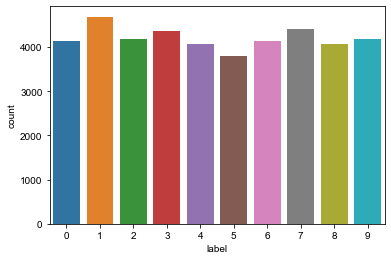
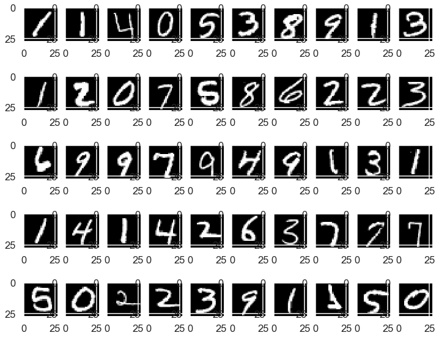
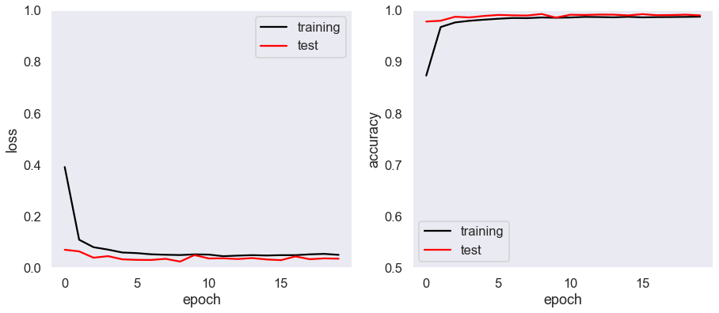

# MNISTをCNNで分類する

kaggleの[Digit Recognizer](https://www.kaggle.com/c/digit-recognizer/overview)（MNISTデータセット）を使用して、`28×28`のグレースケール画像データに対して`0~9`のラベルを予測します。<br>予測はKerasを用いたCNNで行います。


```python
!ls ./data
```

    digit-recognizer
    house-prices-advanced-regression-techniques
    


```python
!ls ./data/digit-recognizer/
```

    sample_submission.csv
    test.csv
    train.csv
    


```python
import numpy as np
import pandas as pd
import matplotlib.pyplot as plt
%matplotlib inline
```


```python
path = './data/digit-recognizer/'
train = pd.read_csv(path + 'train.csv')
test = pd.read_csv(path + 'test.csv')

train.head()
```


<div>
<style scoped>
    .dataframe tbody tr th:only-of-type {
        vertical-align: middle;
    }

    .dataframe tbody tr th {
        vertical-align: top;
    }

    .dataframe thead th {
        text-align: right;
    }
</style>
<table border="1" class="dataframe">
  <thead>
    <tr style="text-align: right;">
      <th></th>
      <th>label</th>
      <th>pixel0</th>
      <th>pixel1</th>
      <th>pixel2</th>
      <th>pixel3</th>
      <th>pixel4</th>
      <th>pixel5</th>
      <th>pixel6</th>
      <th>pixel7</th>
      <th>pixel8</th>
      <th>...</th>
      <th>pixel774</th>
      <th>pixel775</th>
      <th>pixel776</th>
      <th>pixel777</th>
      <th>pixel778</th>
      <th>pixel779</th>
      <th>pixel780</th>
      <th>pixel781</th>
      <th>pixel782</th>
      <th>pixel783</th>
    </tr>
  </thead>
  <tbody>
    <tr>
      <th>0</th>
      <td>1</td>
      <td>0</td>
      <td>0</td>
      <td>0</td>
      <td>0</td>
      <td>0</td>
      <td>0</td>
      <td>0</td>
      <td>0</td>
      <td>0</td>
      <td>...</td>
      <td>0</td>
      <td>0</td>
      <td>0</td>
      <td>0</td>
      <td>0</td>
      <td>0</td>
      <td>0</td>
      <td>0</td>
      <td>0</td>
      <td>0</td>
    </tr>
    <tr>
      <th>1</th>
      <td>0</td>
      <td>0</td>
      <td>0</td>
      <td>0</td>
      <td>0</td>
      <td>0</td>
      <td>0</td>
      <td>0</td>
      <td>0</td>
      <td>0</td>
      <td>...</td>
      <td>0</td>
      <td>0</td>
      <td>0</td>
      <td>0</td>
      <td>0</td>
      <td>0</td>
      <td>0</td>
      <td>0</td>
      <td>0</td>
      <td>0</td>
    </tr>
    <tr>
      <th>2</th>
      <td>1</td>
      <td>0</td>
      <td>0</td>
      <td>0</td>
      <td>0</td>
      <td>0</td>
      <td>0</td>
      <td>0</td>
      <td>0</td>
      <td>0</td>
      <td>...</td>
      <td>0</td>
      <td>0</td>
      <td>0</td>
      <td>0</td>
      <td>0</td>
      <td>0</td>
      <td>0</td>
      <td>0</td>
      <td>0</td>
      <td>0</td>
    </tr>
    <tr>
      <th>3</th>
      <td>4</td>
      <td>0</td>
      <td>0</td>
      <td>0</td>
      <td>0</td>
      <td>0</td>
      <td>0</td>
      <td>0</td>
      <td>0</td>
      <td>0</td>
      <td>...</td>
      <td>0</td>
      <td>0</td>
      <td>0</td>
      <td>0</td>
      <td>0</td>
      <td>0</td>
      <td>0</td>
      <td>0</td>
      <td>0</td>
      <td>0</td>
    </tr>
    <tr>
      <th>4</th>
      <td>0</td>
      <td>0</td>
      <td>0</td>
      <td>0</td>
      <td>0</td>
      <td>0</td>
      <td>0</td>
      <td>0</td>
      <td>0</td>
      <td>0</td>
      <td>...</td>
      <td>0</td>
      <td>0</td>
      <td>0</td>
      <td>0</td>
      <td>0</td>
      <td>0</td>
      <td>0</td>
      <td>0</td>
      <td>0</td>
      <td>0</td>
    </tr>
  </tbody>
</table>
<p>5 rows × 785 columns</p>
</div>


```python
train.shape
```


    (42000, 785)


## 前処理


```python
from tensorflow.keras.utils import to_categorical
from sklearn.model_selection import KFold
```


```python
# trainデータから画像データを抽出
train_x = train.drop(['label'], axis=1)
# trainデータから正解ラベルを抽出
train_y = train['label']
```


```python
# trainデータを4分割して学習：検証=3:1とする
kf = KFold(n_splits=4, shuffle=True, random_state=42)
# 学習用と検証用のレコードのインデックス配列を取得
tr_idx, va_idx = list(kf.split(train_x))[0]
tr_idx[:5]
```


    array([0, 2, 3, 5, 8])


```python
va_idx[:5]
```


    array([ 1,  4,  6,  7, 13])


```python
# 学習用と検証用の画像データと正解ラベルをそれぞれ取得
tr_x, va_x = train_x.iloc[tr_idx], train_x.iloc[va_idx]
tr_y, va_y = train_y.iloc[tr_idx], train_y.iloc[va_idx]
```


```python
# 画像のピクセルを255で割り、0~1の範囲にしてNumpy.arrayにする
tr_x, va_x = np.array(tr_x / 255.0), np.array(va_x / 255.0)
```

## データ形状の変換

説明変数である、`tr_x, va_x`を`(データ数, 28, 28, 1)`の形状に変更


```python
# 画像データの形状の変更
tr_x, va_x = tr_x.reshape(-1, 28, 28, 1), va_x.reshape(-1, 28, 28, 1)
```


```python
print('before tr_y {}'.format(tr_y))
# 正解ラベルをone-Hot表現する
tr_y = to_categorical(tr_y, 10)
va_y = to_categorical(va_y, 10)

print('after tr_y {}'.format(tr_y))
```

    before tr_y 0        1
    2        1
    3        4
    5        0
    8        5
            ..
    41995    0
    41996    1
    41997    7
    41998    6
    41999    9
    Name: label, Length: 31500, dtype: int64
    after tr_y [[0. 1. 0. ... 0. 0. 0.]
     [0. 1. 0. ... 0. 0. 0.]
     [0. 0. 0. ... 0. 0. 0.]
     ...
     [0. 0. 0. ... 1. 0. 0.]
     [0. 0. 0. ... 0. 0. 0.]
     [0. 0. 0. ... 0. 0. 1.]]
    


```python
# tr_x, va_x, tr_y, va_yの形状の表示
print(tr_x.shape)
print(va_x.shape)
print(tr_y.shape)
print(va_y.shape)
```

    (31500, 28, 28, 1)
    (10500, 28, 28, 1)
    (31500, 10)
    (10500, 10)
    

学習データと検証データともに、2次元のNumpy配列に格納されていることが確認できます。<br>1次元が画像の枚数、2次元が画像のデータ数です。

学習データに格納された正解ラベルの分布を表示します。


```python
from collections import Counter
# 格納された各数字の枚数をカウント
count = Counter(train['label'])
count
```


    Counter({1: 4684,
             0: 4132,
             4: 4072,
             7: 4401,
             3: 4351,
             5: 3795,
             8: 4063,
             9: 4188,
             2: 4177,
             6: 4137})


```python
# 各数字の枚数をカウント
import seaborn as sns
# 0~9までの数字の枚数をグラフ化する
sns.countplot(train['label'])
# 表示スタイルの変更
sns.set(context='talk')
```





```python
# 画像1枚分のデータを出力
# print(tr_x[0])
```

## 画像データの視覚化

学習データの1~50枚目までを描画します。


```python
# 学習データの描画
plt.figure(figsize=(12, 10))

for i in range(50):
    # 5行10列の画像表示場所の設定
    plt.subplot(5, 10, i+1)
    # グレースケール
    plt.gray()
    # 28×28にリサイズする
    plt.imshow(tr_x[i].reshape((28, 28)), interpolation='nearest')
    
plt.show()
```





## CNNモデルの構築

1層構造のCNNモデルを構築します。<br>Kerasの畳み込み層を生成する`Conv2D()`メソッドは

> データサイズ、行データ、列データ、チャネル

という形状の4階テンソルを入力として受け取るようになっています。<br>チャネルは画像のピクセル値を格納するための次元で、カラー画像に対応できるように用意されたものです。<br>グレースケール画像の場合は輝度値を表す1、カラー画像の場合は、RGBの3を指定します。

ここでは、CNNモデルに以下の内容を追加してモデルを構築します。

- プーリング層の追加
- ドロップアウトの追加
- 畳み込み層を複数配置
- Flatten層以降に全結合層の追加

畳み込み層、畳み込み層、プーリング層、畳み込み層、プーリング層、全結合層、出力層の流れで構築を行います。


```python
tr_x.shape, va_x.shape
```


    ((31500, 28, 28, 1), (10500, 28, 28, 1))


Sequentialモデルを`.add`で作成します。


```python
# モデル構築
from tensorflow.keras.models import Sequential
from tensorflow.keras.layers import Dense, Dropout, Flatten
from tensorflow.keras.layers import Conv2D, MaxPooling2D

# Sequentialオブジェクトの生成
model = Sequential()

# 第1層：畳み込み層
model.add(
    Conv2D(
        filters=32,                   # フィルター数
        kernel_size=(5, 5),           # 5×5のフィルター 32×25＝800個の重みと各フィルターに0で初期化されたバイアスが1つずつ32こ用意されます
        padding='same',               # ゼロパディング
        input_shape=(28, 28, 1),      # 入力データの形状
        activation='relu',            # 活性化関数はRelu
        name='Conv_1'                 # 表示用の名称
    )
)
# 第2層：畳み込み層
model.add(
    Conv2D(
        filters=64,                   # フィルター数
        kernel_size=(7, 7),           # パラメータ数=前層のフィルター32*(7*7*64)+バイアス64= 100416
        padding='same',               # ゼロパディング
        activation='relu',            # 活性化関数はRelu
        name='Conv_2'                 # 表示用の名称
    )
)
# 第3層：プーリング層 14
model.add(
    MaxPooling2D(
        pool_size=(2, 2)              # ウィンドウサイズ(2*2)
    )
)

# ドロップアウト
model.add(Dropout(0.5))

# 第4層：畳み込み層
model.add(
    Conv2D(
        filters=64,                   # フィルター数
        kernel_size=(5, 5),           # パラメータ数=前層のフィルター64*(5*5*64)+バイアス64= 102464
        padding='same',               # ゼロパディング
        activation='relu',            # 活性化関数はRelu
        name='Conv_4'                 # 表示用の名称
    )
)
# 第5層：畳み込み層
model.add(
    Conv2D(
        filters=32,                   # フィルター数
        kernel_size=(3, 3),           # パラメータ数=前層のフィルター64*(3*3*32)+バイアス32= 18464
        padding='same',               # ゼロパディング
        activation='relu',            # 活性化関数はRelu
        name='Conv_5'                 # 表示用の名称
    )
)
# 第6層：プーリング層 7
model.add(
    MaxPooling2D(
        pool_size=(2, 2)              # ウィンドウサイズ(2*2)
    )
)
# ドロップアウト
model.add(Dropout(0.55))

# Flatten層
model.add(Flatten())                  # ユニット数7*7*32=1568

# 第7層：全結合層
model.add(
    Dense(
        700,                          # 出力ニューロン数 700 パラメータ数は 700*1568=1097600
        activation='relu',            # 活性化関数はRelu
        name='layer_7'                # 表示用の名称
    )

)
model.add(Dropout(0.3))

# 第8層：全結合層
model.add(
    Dense(
        150,                          # 出力ニューロン数 150 パラメータ数は 150*700=105000
        activation='relu',            # 活性化関数はRelu
        name='layer_8'                # 表示用の名称
    )
)
model.add(Dropout(0.35))
# 出力層
model.add(
    Dense(
        10,                           # 出力ニューロン数 10
        activation='softmax',         # マルチクラス分類用の活性化関数を指定
        name='layer_out'              # 表示用の名称
    )
)

model.compile(
    # 損失関数をクロスエントロピー誤差
    loss='categorical_crossentropy',
    # オプティマイザーはAdamを指定
    optimizer='rmsprop',
    # 学習評価として正解率を指定
    metrics=['accuracy']
)
# モデルの構造を出力
model.summary()
```

    Model: "sequential"
    _________________________________________________________________
    Layer (type)                 Output Shape              Param #   
    =================================================================
    Conv_1 (Conv2D)              (None, 28, 28, 32)        832       
    _________________________________________________________________
    Conv_2 (Conv2D)              (None, 28, 28, 64)        100416    
    _________________________________________________________________
    max_pooling2d (MaxPooling2D) (None, 14, 14, 64)        0         
    _________________________________________________________________
    dropout (Dropout)            (None, 14, 14, 64)        0         
    _________________________________________________________________
    Conv_4 (Conv2D)              (None, 14, 14, 64)        102464    
    _________________________________________________________________
    Conv_5 (Conv2D)              (None, 14, 14, 32)        18464     
    _________________________________________________________________
    max_pooling2d_1 (MaxPooling2 (None, 7, 7, 32)          0         
    _________________________________________________________________
    dropout_1 (Dropout)          (None, 7, 7, 32)          0         
    _________________________________________________________________
    flatten (Flatten)            (None, 1568)              0         
    _________________________________________________________________
    layer_7 (Dense)              (None, 700)               1098300   
    _________________________________________________________________
    dropout_2 (Dropout)          (None, 700)               0         
    _________________________________________________________________
    layer_8 (Dense)              (None, 150)               105150    
    _________________________________________________________________
    dropout_3 (Dropout)          (None, 150)               0         
    _________________________________________________________________
    layer_out (Dense)            (None, 10)                1510      
    =================================================================
    Total params: 1,427,136
    Trainable params: 1,427,136
    Non-trainable params: 0
    _________________________________________________________________
    

## 学習の実行

学習回数は20回、ミニバッチ数は100で学習を行います。


```python
# 学習にかかる時間を測定する
import time

# ミニバッチサイズ
BACH_SIZE = 100
# 学習回数
EPOCHS = 20

# 定数
start = time.time()             # 実行開始時間の取得

# 学習の実行
hist = model.fit(
    tr_x,                       # 説明変数
    tr_y,                       # 正解ラベル
    batch_size=BACH_SIZE,       # ミニバッチのサイズ
    epochs=EPOCHS,              # 学習回数
    verbose=1,                  # 学習の進捗状況を出力する
    validation_data=(va_x,va_y) # テストデータ
)
print('Finished Training')
# 学習終了後、学習に要した時間を出力
print('Computation time:{0:.3f} sec'.format(time.time() - start))
```

    Epoch 1/20
    315/315 [==============================] - 202s 641ms/step - loss: 0.3924 - accuracy: 0.8736 - val_loss: 0.0715 - val_accuracy: 0.9784
    Epoch 2/20
    315/315 [==============================] - 197s 624ms/step - loss: 0.1104 - accuracy: 0.9677 - val_loss: 0.0652 - val_accuracy: 0.9799
    Epoch 3/20
    315/315 [==============================] - 191s 606ms/step - loss: 0.0814 - accuracy: 0.9766 - val_loss: 0.0406 - val_accuracy: 0.9876
    Epoch 4/20
    315/315 [==============================] - 187s 595ms/step - loss: 0.0721 - accuracy: 0.9798 - val_loss: 0.0467 - val_accuracy: 0.9864
    Epoch 5/20
    315/315 [==============================] - 186s 591ms/step - loss: 0.0608 - accuracy: 0.9820 - val_loss: 0.0343 - val_accuracy: 0.9891
    Epoch 6/20
    315/315 [==============================] - 185s 587ms/step - loss: 0.0585 - accuracy: 0.9838 - val_loss: 0.0323 - val_accuracy: 0.9911
    Epoch 7/20
    315/315 [==============================] - 185s 588ms/step - loss: 0.0538 - accuracy: 0.9852 - val_loss: 0.0318 - val_accuracy: 0.9904
    Epoch 8/20
    315/315 [==============================] - 187s 595ms/step - loss: 0.0521 - accuracy: 0.9850 - val_loss: 0.0364 - val_accuracy: 0.9900
    Epoch 9/20
    315/315 [==============================] - 187s 593ms/step - loss: 0.0510 - accuracy: 0.9863 - val_loss: 0.0256 - val_accuracy: 0.9930
    Epoch 10/20
    315/315 [==============================] - 240s 761ms/step - loss: 0.0535 - accuracy: 0.9858 - val_loss: 0.0508 - val_accuracy: 0.9860
    Epoch 11/20
    315/315 [==============================] - 263s 834ms/step - loss: 0.0527 - accuracy: 0.9862 - val_loss: 0.0377 - val_accuracy: 0.9915
    Epoch 12/20
    315/315 [==============================] - 264s 837ms/step - loss: 0.0465 - accuracy: 0.9874 - val_loss: 0.0383 - val_accuracy: 0.9911
    Epoch 13/20
    315/315 [==============================] - 263s 836ms/step - loss: 0.0488 - accuracy: 0.9870 - val_loss: 0.0355 - val_accuracy: 0.9919
    Epoch 14/20
    315/315 [==============================] - 280s 888ms/step - loss: 0.0506 - accuracy: 0.9865 - val_loss: 0.0393 - val_accuracy: 0.9917
    Epoch 15/20
    315/315 [==============================] - 274s 870ms/step - loss: 0.0493 - accuracy: 0.9876 - val_loss: 0.0339 - val_accuracy: 0.9903
    Epoch 16/20
    315/315 [==============================] - 270s 857ms/step - loss: 0.0505 - accuracy: 0.9865 - val_loss: 0.0312 - val_accuracy: 0.9927
    Epoch 17/20
    315/315 [==============================] - 262s 832ms/step - loss: 0.0506 - accuracy: 0.9870 - val_loss: 0.0456 - val_accuracy: 0.9907
    Epoch 18/20
    315/315 [==============================] - 263s 835ms/step - loss: 0.0537 - accuracy: 0.9871 - val_loss: 0.0349 - val_accuracy: 0.9910
    Epoch 19/20
    315/315 [==============================] - 271s 862ms/step - loss: 0.0555 - accuracy: 0.9874 - val_loss: 0.0380 - val_accuracy: 0.9917
    Epoch 20/20
    315/315 [==============================] - 269s 855ms/step - loss: 0.0517 - accuracy: 0.9878 - val_loss: 0.0369 - val_accuracy: 0.9903
    Finished Training
    Computation time:4641.908 sec
    

## 損失と正解率の推移をグラフ化


```python
# プロットサイズの設定
plt.figure(figsize=(15, 6))
# プロット図を縮小して図の間のスペースを確保
plt.subplots_adjust(wspace=0.2)
# 2つの図を並べて表示
plt.subplot(1, 2, 1)
# 学習データのlossの表示
plt.plot(
    hist.history['loss'],
    label='training',
    color='black'
)
# 検証データのlossの表示
plt.plot(
    hist.history['val_loss'],
    label='test',
    color='red'
)

plt.ylim((0, 1))
plt.legend()        # 凡例
plt.grid()
plt.xlabel('epoch')
plt.ylabel('loss')

plt.subplot(1, 2, 2)
# 学習データの正解率の表示
plt.plot(
    hist.history['accuracy'],
    label='training',
    color='black'
)
# 検証データの正解率の表示
plt.plot(
    hist.history['val_accuracy'],
    label='test',
    color='red'
)

plt.ylim((0.5, 1))
plt.legend()        # 凡例
plt.grid()
plt.xlabel('epoch')
plt.ylabel('accuracy')
```


    Text(0, 0.5, 'accuracy')





# テストデータで予測を推論を実施しcsvデータの作成


```python
test.head()
```


<div>
<style scoped>
    .dataframe tbody tr th:only-of-type {
        vertical-align: middle;
    }

    .dataframe tbody tr th {
        vertical-align: top;
    }

    .dataframe thead th {
        text-align: right;
    }
</style>
<table border="1" class="dataframe">
  <thead>
    <tr style="text-align: right;">
      <th></th>
      <th>pixel0</th>
      <th>pixel1</th>
      <th>pixel2</th>
      <th>pixel3</th>
      <th>pixel4</th>
      <th>pixel5</th>
      <th>pixel6</th>
      <th>pixel7</th>
      <th>pixel8</th>
      <th>pixel9</th>
      <th>...</th>
      <th>pixel774</th>
      <th>pixel775</th>
      <th>pixel776</th>
      <th>pixel777</th>
      <th>pixel778</th>
      <th>pixel779</th>
      <th>pixel780</th>
      <th>pixel781</th>
      <th>pixel782</th>
      <th>pixel783</th>
    </tr>
  </thead>
  <tbody>
    <tr>
      <th>0</th>
      <td>0</td>
      <td>0</td>
      <td>0</td>
      <td>0</td>
      <td>0</td>
      <td>0</td>
      <td>0</td>
      <td>0</td>
      <td>0</td>
      <td>0</td>
      <td>...</td>
      <td>0</td>
      <td>0</td>
      <td>0</td>
      <td>0</td>
      <td>0</td>
      <td>0</td>
      <td>0</td>
      <td>0</td>
      <td>0</td>
      <td>0</td>
    </tr>
    <tr>
      <th>1</th>
      <td>0</td>
      <td>0</td>
      <td>0</td>
      <td>0</td>
      <td>0</td>
      <td>0</td>
      <td>0</td>
      <td>0</td>
      <td>0</td>
      <td>0</td>
      <td>...</td>
      <td>0</td>
      <td>0</td>
      <td>0</td>
      <td>0</td>
      <td>0</td>
      <td>0</td>
      <td>0</td>
      <td>0</td>
      <td>0</td>
      <td>0</td>
    </tr>
    <tr>
      <th>2</th>
      <td>0</td>
      <td>0</td>
      <td>0</td>
      <td>0</td>
      <td>0</td>
      <td>0</td>
      <td>0</td>
      <td>0</td>
      <td>0</td>
      <td>0</td>
      <td>...</td>
      <td>0</td>
      <td>0</td>
      <td>0</td>
      <td>0</td>
      <td>0</td>
      <td>0</td>
      <td>0</td>
      <td>0</td>
      <td>0</td>
      <td>0</td>
    </tr>
    <tr>
      <th>3</th>
      <td>0</td>
      <td>0</td>
      <td>0</td>
      <td>0</td>
      <td>0</td>
      <td>0</td>
      <td>0</td>
      <td>0</td>
      <td>0</td>
      <td>0</td>
      <td>...</td>
      <td>0</td>
      <td>0</td>
      <td>0</td>
      <td>0</td>
      <td>0</td>
      <td>0</td>
      <td>0</td>
      <td>0</td>
      <td>0</td>
      <td>0</td>
    </tr>
    <tr>
      <th>4</th>
      <td>0</td>
      <td>0</td>
      <td>0</td>
      <td>0</td>
      <td>0</td>
      <td>0</td>
      <td>0</td>
      <td>0</td>
      <td>0</td>
      <td>0</td>
      <td>...</td>
      <td>0</td>
      <td>0</td>
      <td>0</td>
      <td>0</td>
      <td>0</td>
      <td>0</td>
      <td>0</td>
      <td>0</td>
      <td>0</td>
      <td>0</td>
    </tr>
  </tbody>
</table>
<p>5 rows × 784 columns</p>
</div>


```python
# 画像のピクセル値を255.0で割って0～1.0の範囲にしてnumpy.arrayに変換。
test = np.array(test / 255.0)
```


```python
test.shape
```


    (28000, 784)


```python
# 画像データの形状の変更
test = test.reshape(-1, 28, 28, 1)
```


```python
# テストデータで予測を実施しNumpy配列に代入
result = model.predict(test)
# 予測結果の先頭から5番目までを出力
result[:5]
```


    array([[4.9611468e-11, 3.2629308e-09, 9.9999988e-01, 3.4155804e-08,
            2.5474320e-10, 3.2772949e-13, 2.2997970e-11, 1.2925904e-07,
            3.1687861e-08, 1.5083200e-09],
           [9.9979573e-01, 2.3260034e-07, 1.2055358e-05, 3.3142878e-06,
            1.2036362e-06, 9.1353813e-06, 4.9019782e-05, 1.1372467e-06,
            3.1651147e-05, 9.6435091e-05],
           [4.0747867e-17, 5.2849261e-17, 5.0616527e-14, 6.9671509e-14,
            4.4296602e-08, 2.6717996e-14, 1.0237049e-18, 8.6280470e-14,
            3.5648963e-08, 9.9999988e-01],
           [9.6575814e-01, 1.9055506e-08, 1.7555501e-05, 9.1924749e-06,
            3.5704961e-06, 1.6781997e-06, 3.4664736e-06, 1.0723836e-06,
            7.3854986e-05, 3.4131486e-02],
           [1.1980854e-12, 1.7432598e-09, 5.1419056e-07, 9.9999809e-01,
            9.1346884e-13, 8.3109188e-07, 1.5966695e-12, 4.9275228e-09,
            5.7962876e-07, 1.6449162e-09]], dtype=float32)


```python
# 最大のインデックスを予測した数値として出力
print([x.argmax() for x in result[:5]])
# 予測した数値をNumpy配列に代入
y_test = [x.argmax() for x in result]
```

    [2, 0, 9, 0, 3]
    


```python
# 提出用のCSVファイルを
y_test[:5]
```


    [2, 0, 9, 0, 3]


```python
submit_df = pd.read_csv(path+'sample_submission.csv')
submit_df.head()
```


<div>
<style scoped>
    .dataframe tbody tr th:only-of-type {
        vertical-align: middle;
    }

    .dataframe tbody tr th {
        vertical-align: top;
    }

    .dataframe thead th {
        text-align: right;
    }
</style>
<table border="1" class="dataframe">
  <thead>
    <tr style="text-align: right;">
      <th></th>
      <th>ImageId</th>
      <th>Label</th>
    </tr>
  </thead>
  <tbody>
    <tr>
      <th>0</th>
      <td>1</td>
      <td>0</td>
    </tr>
    <tr>
      <th>1</th>
      <td>2</td>
      <td>0</td>
    </tr>
    <tr>
      <th>2</th>
      <td>3</td>
      <td>0</td>
    </tr>
    <tr>
      <th>3</th>
      <td>4</td>
      <td>0</td>
    </tr>
    <tr>
      <th>4</th>
      <td>5</td>
      <td>0</td>
    </tr>
  </tbody>
</table>
</div>


```python
# Label行に予測値を格納する
submit_df['Label'] = y_test
submit_df.head()
```


<div>
<style scoped>
    .dataframe tbody tr th:only-of-type {
        vertical-align: middle;
    }

    .dataframe tbody tr th {
        vertical-align: top;
    }

    .dataframe thead th {
        text-align: right;
    }
</style>
<table border="1" class="dataframe">
  <thead>
    <tr style="text-align: right;">
      <th></th>
      <th>ImageId</th>
      <th>Label</th>
    </tr>
  </thead>
  <tbody>
    <tr>
      <th>0</th>
      <td>1</td>
      <td>2</td>
    </tr>
    <tr>
      <th>1</th>
      <td>2</td>
      <td>0</td>
    </tr>
    <tr>
      <th>2</th>
      <td>3</td>
      <td>9</td>
    </tr>
    <tr>
      <th>3</th>
      <td>4</td>
      <td>0</td>
    </tr>
    <tr>
      <th>4</th>
      <td>5</td>
      <td>3</td>
    </tr>
  </tbody>
</table>
</div>


## 予測データファイルをCSVに保存


```python
# CSVファイルに保存
submit_df.to_csv('submission_cnn_tune.csv', index=False)
```
