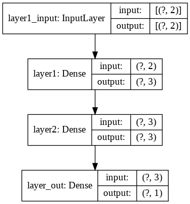

# Sequentialオブジェクトのaddメソッドで追加［tf.keras - Sequential API］

モデルの書き方として以下のモデルの構築方法を学ぶ

- Sequential（積層型）モデル： コンパクトで簡単な書き方
- Functional（関数型）API： 複雑なモデルも定義できる柔軟な書き方
- Subclassing（サブクラス化）モデル： 難易度は少し上がるが、フルカスタマイズが可能


```python
import tensorflow as tf
print('TensorFlow', tf.__version__)
```

    TensorFlow 2.3.0
    

## 訓練データの作成

座標データの作成


```python
# 座標点データを生成するライブラリのインストール
!pip install playground-data
```


```python
# playground-dataライブラリのplygdataパッケージを「pg」という別名でインポート
import plygdata as pg

# 設定値を定数として定義
PROBLEM_DATA_TYPE = pg.DatasetType.ClassifyCircleData # 問題種別：「分類（Classification）」、データ種別：「円（CircleData）」を選択
TRAINING_DATA_RATIO = 0.5  # データの何％を訓練【Training】用に？ (残りは精度検証【Validation】用) ： 50％
DATA_NOISE = 0.0           # ノイズ： 0％

# 定義済みの定数を引数に指定して、データを生成する
data_list = pg.generate_data(PROBLEM_DATA_TYPE, DATA_NOISE)

# データを「訓練用」と「精度検証用」を指定の比率で分割し、さらにそれぞれを「データ（X）」と「教師ラベル（y）」に分ける
X_train, y_train, X_valid, y_valid = pg.split_data(data_list, training_size=TRAINING_DATA_RATIO)

# データ分割後の各変数の内容例として、それぞれ5件ずつ出力（※出力内容は実行ごとに異なる）
print('X_train:'); print(X_train[:5]) # [[-0.07940614  1.15175421], ……]
print('y_train:'); print(y_train[:5]) # [[ 1.], ……  [-1.]]
print('X_valid:'); print(X_valid[:5]) # [[ 0.10066901  1.19950826], ……]
print('y_valid:'); print(y_valid[:5]) # [[ 1.], ……  [-1.]]
```

    X_train:
    [[ 2.5355636   3.25737983]
     [ 0.02238848 -0.58311751]
     [-0.55605729 -3.90688295]
     [ 1.1794842   1.08551892]
     [-1.24447752 -1.33087675]]
    y_train:
    [[-1.]
     [ 1.]
     [-1.]
     [ 1.]
     [ 1.]]
    X_valid:
    [[ 0.74734514 -3.56731987]
     [-0.07918468 -0.11611484]
     [-0.48764009  1.05893561]
     [ 0.08636896 -0.08505545]
     [ 4.61475143 -1.72813413]]
    y_valid:
    [[-1.]
     [ 1.]
     [ 1.]
     [ 1.]
     [-1.]]
    

### ディープニューラルネットワークのモデル設計
- 入力の数（`INPUT_FEATURES`）は、$X_1$と$X_2$で**2つ**
- 隠れ層のレイヤー数は、**2つ**
  - 隠れ層にある1つ目のニューロンの数（`LAYER1_NEURONS`）は、**3つ**
  - 隠れ層にある2つ目のニューロンの数（`LAYER2_NEURONS`）は、**3つ**
- 出力層にあるニューロンの数（`OUTPUT_RESULTS`）は、**1つ**


```python
import tensorflow as tf
from tensorflow.keras import layers

# 定数（モデル定義時に必要となる数値）
INPUT_FEATURES = 2  # 入力（特徴）の数： 2
LAYER1_NEURONS = 3  # ニューロンの数： 3
LAYER2_NEURONS = 3  # ニューロンの数： 3
OUTPUT_RESULTS = 1  # 出力結果の数： 1
```

## 正解率（精度）カスタム指標


```python
import tensorflow.keras.backend as K

def tanh_accuracy(y_true, y_pred):
    """
    正解率を算出する
    Params
    ----------------
    y_true:正解データ
    y_pred:予測値

    """
    threshold = K.cast(0.0, y_pred.dtype)    # -1, 1を分ける閾値を作る
    y_pred = K.cast(y_pred >= threshold, y_pred.dtype)    # 閾値未満で0, 以上で1に変換
    # 2倍して-1.0することで、0／1を-1.0／1.0にスケール変換して正解率を計算
    return K.mean(K.equal(y_true, y_pred * 2 -1.0), axis=1)
```

### Sequentialオブジェクトのaddメソッドを利用した書き方


```python
# モデルの生成
model = tf.keras.models.Sequential(
    name='sequential_constructor'       # モデル名称
)
# 隠れ層 layer1
model.add(
    # 全結合層
    layers.Dense(
        input_shape=(INPUT_FEATURES, ),     # 入力の形状（=入力層）
        name='layer1',                      # 表示用の名称
        units=LAYER1_NEURONS,               # ユニット数
        activation='tanh'                   # 活性化関数
    )
)
# 隠れ層 layer2
model.add(
    # 全結合層
    layers.Dense(
        input_shape=(INPUT_FEATURES, ),     # 入力の形状（=入力層）
        name='layer2',                      # 表示用の名称
        units=LAYER2_NEURONS,               # ユニット数
        activation='tanh'                   # 活性化関数
    )
)
# 出力層
model.add(
    # 全結合層
    layers.Dense(
        input_shape=(INPUT_FEATURES, ),     # 入力の形状（=入力層）
        name='layer_out',                   # 表示用の名称
        units=OUTPUT_RESULTS,               # ユニット数
        activation='tanh'                   # 活性化関数
    )
)

# モデルの内容の出力
model.summary()
```

    Model: "sequential_constructor"
    _________________________________________________________________
    Layer (type)                 Output Shape              Param #   
    =================================================================
    layer1 (Dense)               (None, 3)                 9         
    _________________________________________________________________
    layer2 (Dense)               (None, 3)                 12        
    _________________________________________________________________
    layer_out (Dense)            (None, 1)                 4         
    =================================================================
    Total params: 25
    Trainable params: 25
    Non-trainable params: 0
    _________________________________________________________________
    

### モデルの構成図を表示する


```python
tf.keras.utils.plot_model(model, show_shapes=True, show_layer_names=True, to_file='model.png')
from IPython.display import Image
Image(retina=False, filename='model.png')
```





## 学習と推論


```python
# 最適化、損失関数の定義を行い精度の指標を設定してコンパイル
model.compile(tf.keras.optimizers.SGD(learning_rate=0.03), 'mean_squared_error', [tanh_accuracy])
# 学習の開始
model.fit(
    X_train,
    y_train,
    validation_data=(X_valid, y_valid),
    batch_size=15,
)
# 推論
model.predict([[0.1, -0.2]])
```

    17/17 [==============================] - 0s 9ms/step - loss: 1.0284 - tanh_accuracy: 0.5640 - val_loss: 0.9893 - val_tanh_accuracy: 0.5720
    


    array([[0.22799094]], dtype=float32)


## 作成済みのモデルのリセット

一度モデルを削除してリセットをしたい場合は、以下のコードを実行することで実現ができます。<br>計算グラフはモデルを設計したことによりライブラリ内部で自動で構築されている`TensorBoard`というツールによってデータフローグラフを視覚的に確認できるものです。


```python
tf.keras.backend.clear_session()    # 計算グラフを破棄する
del model                           # 変数を削除
```


```python
!pip uninstall playground-data
```
