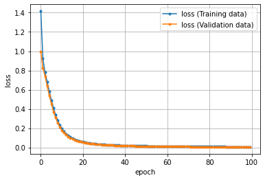

## 座標点データを生成するライブラリのインストール


```python
!pip install playground-data
```

    Requirement already satisfied: playground-data in c:\users\akahane\anaconda3\lib\site-packages (1.1.0)
    Requirement already satisfied: matplotlib in c:\users\akahane\anaconda3\lib\site-packages (from playground-data) (3.2.2)
    Requirement already satisfied: numpy in c:\users\akahane\anaconda3\lib\site-packages (from playground-data) (1.18.5)
    Requirement already satisfied: pyparsing!=2.0.4,!=2.1.2,!=2.1.6,>=2.0.1 in c:\users\akahane\anaconda3\lib\site-packages (from matplotlib->playground-data) (2.4.7)
    Requirement already satisfied: python-dateutil>=2.1 in c:\users\akahane\anaconda3\lib\site-packages (from matplotlib->playground-data) (2.8.1)
    Requirement already satisfied: cycler>=0.10 in c:\users\akahane\anaconda3\lib\site-packages (from matplotlib->playground-data) (0.10.0)
    Requirement already satisfied: kiwisolver>=1.0.1 in c:\users\akahane\anaconda3\lib\site-packages (from matplotlib->playground-data) (1.2.0)
    Requirement already satisfied: six>=1.5 in c:\users\akahane\anaconda3\lib\site-packages (from python-dateutil>=2.1->matplotlib->playground-data) (1.15.0)
    


```python
# playground-dataライブラリのplygdataパッケージを「pg」という別名でインポート
import plygdata as pg

# 問題種別で「分類（Classification）」を選択し、
# データ種別で「2つのガウシアンデータ（TwoGaussData）」を選択する場合の、
# 設定値を定数として定義
PROBLEM_DATA_TYPE = pg.DatasetType.ClassifyTwoGaussData
```


```python
# 各種設定を定数として定義
TRAINING_DATA_RATIO = 0.5  # データの何％を訓練【Training】用に？ (残りは精度検証【Validation】用) ： 50％
DATA_NOISE = 0.0           # ノイズ： 0％

# 定義済みの定数を引数に指定して、データを生成する
data_list = pg.generate_data(PROBLEM_DATA_TYPE, DATA_NOISE)

# データを「訓練用」と「精度検証用」を指定の比率で分割し、さらにそれぞれを「データ（X）」と「教師ラベル（y）」に分ける
X_train, y_train, X_valid, y_valid = pg.split_data(data_list, training_size=TRAINING_DATA_RATIO)

# データ内容の確認
print('X_train:'); print(X_train[:5])
print('y_train:'); print(y_train[:5])
print('X_valid:'); print(X_valid[:5])
print('y_valid:'); print(y_valid[:5])
```

    X_train:
    [[ 2.227121    2.19154843]
     [ 1.99228142  1.39114564]
     [-2.09422997 -1.34075346]
     [ 1.81961221  2.13701005]
     [-2.16693439 -1.71544407]]
    y_train:
    [[ 1.]
     [ 1.]
     [-1.]
     [ 1.]
     [-1.]]
    X_valid:
    [[-3.19718531 -2.01196619]
     [ 1.66386301  1.4012889 ]
     [ 2.53634158  1.8052678 ]
     [ 2.20039537  2.77880026]
     [ 2.18907013  2.4909807 ]]
    y_valid:
    [[-1.]
     [ 1.]
     [ 1.]
     [ 1.]
     [ 1.]]
    

## Tensorflowのバージョンチェック

```python
import tensorflow as tf
print('TensorFlow:{}'.format(tf.__version__))
```

    TensorFlow:2.3.0
    


```python
import numpy as np
import pandas as pd
import matplotlib.pyplot as plt
%matplotlib inline
```

## ニューロンのモデル設計
- ニューロンへの入力＝$(w_1 \times X_1)+(w_2 \times X_2)+b$
- ニューロンからの出力＝$a((w_1 \times X_1)+(w_2 \times X_2)+b)$
  - $a()$は活性化関数を意味する。つまりニューロンの入力結果を、活性化関数で変換したうえで、出力する
  - 今回の活性化関数は、**tanh**関数とする
- $w_1=0.6$、$w_2=-0.2$、$b=0.8$と仮定して、ニューロンのモデルを定義
  - ※これらの値は通常は学習により決定されるが、今回は未学習なので仮の固定数値としている
  - 重さ（$w_1$と$w_2$）は2次元配列でまとめて表記する： `weight_array`
    - 通常は、ニューロンは複数あるので、2次元配列で表記する
    - 複数の重みが「行」を構成し、複数のニューロンが「列」を構成する
    - 今回は、重みが**2つ**で、ニューロンが**1つ**なので、**2行1列**で記述する
    -  `[[ 0.6],`<br>&nbsp;&nbsp;`[-0.2]]`
  - バイアス（$b$）は1次元配列でまとめて表記する： `bias_array`
    - `[0.8]`
- そのニューロンに、座標$(X_1, X_2)$データを入力する
  - 通常のデータは表形式（＝2次元配列）だが、今回は$(1.0, 2.0)$という1つのデータ
    - 1つのデータでも2次元配列（具体的には**1行2列**）で表現する必要がある
  - 入力の数（`INPUT_FEATURES`）は、$X_1$と$X_2$で**2つ**
  - ニューロンの数（`LAYER1_NEURONS`）は、**1つ**

### モデル定義


```python
# 定数（モデル定義時に必要となるもの）
INPUT_FEATURES = 2  # 入力（特徴）の数： 2
LAYER1_NEURONS = 1  # ニューロンの数： 1

# パラメーター（ニューロンへの入力で必要となるもの）
weight_array = np.array([[ 0.6 ],
                         [-0.2 ]])       # 重み
bias_array   = np.array([  0.8 ])        # バイアス

# Sequential（積層型）モデルによるモデル定義
model = tf.keras.models.Sequential([
                                    tf.keras.layers.Dense(
                                        input_shape=(INPUT_FEATURES, ),       # 入力の形状
                                        units=LAYER1_NEURONS,               # ユニット数
                                        weights=[weight_array, bias_array], # 重みとバイアスの初期値
                                        activation='tanh'                   # 活性化関数
                                    )
])
```


```python
# このモデルに、データを入力して、出力を得る（＝予測：predictする）
X_data = np.array([[1.0, 2.0]])          # 入力する座標データ（1.0、2.0）
print(model.predict(X_data))             # 出力を得る
# [[0.7615942]] ……などと表示される
```

    [[0.7615942]]
    

- Denseレイヤー： ニューラルネットワークで通常の全結合レイヤー

- 第1引数の`units`： ユニット（＝ニューロン）の数を指定します。
- 第2引数の`activation`： 活性化関数を指定します。用意されていない場合は、独自の計算式をここに指定することもできる
- 第3引数の`kwargs`： 複数のキーワードとその値を指定できます。
    - キーワード「input_shape」： 入力の形状をタプル値で指定します。今回は、先ほどの定数INPUT_FEATURESを指定します。ただし、タプル型にするため(INPUT_FEATURES,)とタプル要素の最後に「,」を入れることで、タプル値と明示する必要が文法上ある
    - キーワード「weights」： 「重み」の2次元配列値と「バイアス」の1次元配列値を、リスト値にまとめて指定します。今回は、[weight_array, bias_array]というリスト値を指定しています。通常のニューラルネットワークでは、重みとバイアスは自動的に決まるもので、今回のように固定的な初期値を指定する必要はない

## ニューラルネットワークのモデル設計
- 入力の数（`INPUT_FEATURES`）は、$X_1$と$X_2$で**2つ**
- 隠れ層のレイヤー数は、**2つ**
  - 隠れ層にある1つ目のニューロンの数（`LAYER1_NEURONS`）は、**3つ**
  - 隠れ層にある2つ目のニューロンの数（`LAYER2_NEURONS`）は、**3つ**
- 出力層にあるニューロンの数（`OUTPUT_RESULTS`）は、**1つ**


```python
# 定数（モデル定義時に必要となる数値）
INPUT_FEATURES = 2  # 入力（特徴）の数： 2
LAYER1_NEURONS = 3  # ニューロンの数： 3
LAYER2_NEURONS = 3  # ニューロンの数： 3
OUTPUT_RESULTS = 1  # 出力結果の数： 1

# 今度は重みとバイアスのパラメーターは指定しない（通常は指定しない）

# 積層型のモデルの定義
model = tf.keras.models.Sequential([
    # 隠れ層：1つ目のレイヤー
    tf.keras.layers.Dense(
        input_shape=(INPUT_FEATURES,),       # 入力の形状（＝入力層）
        units=LAYER1_NEURONS,                # ユニットの数
        activation='tanh'),                  # 活性化関数
    # 隠れ層：2つ目のレイヤー
    tf.keras.layers.Dense(
        units=LAYER2_NEURONS,                # ユニットの数
        activation='tanh'),                  # 活性化関数
    # 出力層
    tf.keras.layers.Dense(
        units=OUTPUT_RESULTS,                # ユニットの数
        activation='tanh'),                  # 活性化関数
])
```


```python
model.summary()
```

    Model: "sequential_1"
    _________________________________________________________________
    Layer (type)                 Output Shape              Param #   
    =================================================================
    dense_1 (Dense)              (None, 3)                 9         
    _________________________________________________________________
    dense_2 (Dense)              (None, 3)                 12        
    _________________________________________________________________
    dense_3 (Dense)              (None, 1)                 4         
    =================================================================
    Total params: 25
    Trainable params: 25
    Non-trainable params: 0
    _________________________________________________________________
    


```python
# 定数（モデル定義時に必要となる数値）
INPUT_FEATURES = 2      # 入力（特徴）の数： 2
LAYER1_NEURONS = 3      # ニューロンの数： 3
LAYER2_NEURONS = 3      # ニューロンの数： 3
OUTPUT_RESULTS = 1      # 出力結果の数： 1
ACTIVATION = 'sigmoid'  # 活性化関数（ここを書き換える）： シグモイド関数

# 積層型のモデルの定義
model = tf.keras.models.Sequential([
  # 隠れ層：1つ目のレイヤー
  tf.keras.layers.Dense(
    input_shape=(INPUT_FEATURES,),       # 入力の形状（＝入力層）
    units=LAYER1_NEURONS,                # ユニットの数
    activation=ACTIVATION),              # 活性化関数
  # 隠れ層：2つ目のレイヤー
  tf.keras.layers.Dense(
    units=LAYER2_NEURONS,                # ユニットの数
    activation=ACTIVATION),              # 活性化関数
  # 出力層
  tf.keras.layers.Dense(
    units=OUTPUT_RESULTS,                # ユニットの数
    activation='tanh'),                  # 活性化関数
])
model.summary()
```

    Model: "sequential_2"
    _________________________________________________________________
    Layer (type)                 Output Shape              Param #   
    =================================================================
    dense_4 (Dense)              (None, 3)                 9         
    _________________________________________________________________
    dense_5 (Dense)              (None, 3)                 12        
    _________________________________________________________________
    dense_6 (Dense)              (None, 1)                 4         
    =================================================================
    Total params: 25
    Trainable params: 25
    Non-trainable params: 0
    _________________________________________________________________
    

## 損失関数の定義


```python
# 定数（学習方法設計時に必要となる数値）
LOSS = 'mean_squared_error'  # 損失関数：平均二乗誤差
```

## 最適化の定義


```python
# 定数（学習方法設計時に必要となるもの）
OPTIMIZER = tf.keras.optimizers.SGD  # 最適化：確率的勾配降下法
```

## 正解率（精度）のカスタム指標


```python
import tensorflow.keras.backend as K

def tanh_accuracy(y_true, y_pred):           # y_trueは正解、y_predは予測（出力）
  threshold = K.cast(0.0, y_pred.dtype)              # -1か1かを分ける閾値を作成
  y_pred = K.cast(y_pred >= threshold, y_pred.dtype) # 閾値未満で0、以上で1に変換
  # 2倍して-1.0することで、0／1を-1.0／1.0にスケール変換して正解率を計算
  return K.mean(K.equal(y_true, y_pred * 2 - 1.0), axis=-1)
```

## モデルの生成


```python
LEARNING_RATE = 0.03                  # 学習率： 0.03


# モデルを生成する
model.compile(optimizer=OPTIMIZER(learning_rate=LEARNING_RATE),
              loss=LOSS,
              metrics=[tanh_accuracy])  # 精度（正解率）
```

## 学習　バッチサイズ


```python
# 定数（学習方法設計時に必要となるもの）
BATCH_SIZE = 15  # バッチサイズ： 15（選択肢は「1」～「30」）
EPOCHS = 100     # エポック数： 100

# 学習する
hist = model.fit(x=X_train,                          # 訓練用データ
                 y=y_train,                          # 訓練用ラベル
                 validation_data=(X_valid, y_valid), # 精度検証用
                 batch_size=BATCH_SIZE,              # バッチサイズ
                 epochs=EPOCHS,                      # エポック数
                 verbose=1)                          # 実行状況表示
```

    Epoch 1/100
    17/17 [==============================] - 1s 40ms/step - loss: 1.4158 - tanh_accuracy: 0.4680 - val_loss: 0.9964 - val_tanh_accuracy: 0.5320
    Epoch 2/100
    17/17 [==============================] - 0s 5ms/step - loss: 0.9218 - tanh_accuracy: 0.6200 - val_loss: 0.8283 - val_tanh_accuracy: 1.0000
    Epoch 3/100
    17/17 [==============================] - 0s 4ms/step - loss: 0.7794 - tanh_accuracy: 1.0000 - val_loss: 0.7390 - val_tanh_accuracy: 1.0000
    Epoch 4/100
    17/17 [==============================] - 0s 5ms/step - loss: 0.6813 - tanh_accuracy: 0.9920 - val_loss: 0.6404 - val_tanh_accuracy: 1.0000
    Epoch 5/100
    17/17 [==============================] - 0s 5ms/step - loss: 0.5841 - tanh_accuracy: 0.9960 - val_loss: 0.5388 - val_tanh_accuracy: 1.0000
    Epoch 6/100
    17/17 [==============================] - 0s 5ms/step - loss: 0.4933 - tanh_accuracy: 1.0000 - val_loss: 0.4562 - val_tanh_accuracy: 1.0000
    Epoch 7/100
    17/17 [==============================] - 0s 5ms/step - loss: 0.4112 - tanh_accuracy: 1.0000 - val_loss: 0.3701 - val_tanh_accuracy: 1.0000
    Epoch 8/100
    17/17 [==============================] - 0s 5ms/step - loss: 0.3392 - tanh_accuracy: 1.0000 - val_loss: 0.3083 - val_tanh_accuracy: 1.0000
    Epoch 9/100
    17/17 [==============================] - 0s 6ms/step - loss: 0.2805 - tanh_accuracy: 1.0000 - val_loss: 0.2538 - val_tanh_accuracy: 1.0000
    Epoch 10/100
    17/17 [==============================] - 0s 7ms/step - loss: 0.2333 - tanh_accuracy: 1.0000 - val_loss: 0.2113 - val_tanh_accuracy: 1.0000
    Epoch 11/100
    17/17 [==============================] - 0s 8ms/step - loss: 0.1958 - tanh_accuracy: 1.0000 - val_loss: 0.1782 - val_tanh_accuracy: 1.0000
    Epoch 12/100
    17/17 [==============================] - 0s 8ms/step - loss: 0.1659 - tanh_accuracy: 1.0000 - val_loss: 0.1512 - val_tanh_accuracy: 1.0000
    Epoch 13/100
    17/17 [==============================] - 0s 8ms/step - loss: 0.1421 - tanh_accuracy: 1.0000 - val_loss: 0.1301 - val_tanh_accuracy: 1.0000
    Epoch 14/100
    17/17 [==============================] - 0s 9ms/step - loss: 0.1232 - tanh_accuracy: 1.0000 - val_loss: 0.1135 - val_tanh_accuracy: 1.0000
    Epoch 15/100
    17/17 [==============================] - 0s 8ms/step - loss: 0.1080 - tanh_accuracy: 1.0000 - val_loss: 0.0994 - val_tanh_accuracy: 1.0000
    Epoch 16/100
    17/17 [==============================] - 0s 6ms/step - loss: 0.0955 - tanh_accuracy: 1.0000 - val_loss: 0.0880 - val_tanh_accuracy: 1.0000
    Epoch 17/100
    17/17 [==============================] - 0s 5ms/step - loss: 0.0852 - tanh_accuracy: 1.0000 - val_loss: 0.0786 - val_tanh_accuracy: 1.0000
    Epoch 18/100
    17/17 [==============================] - 0s 5ms/step - loss: 0.0767 - tanh_accuracy: 1.0000 - val_loss: 0.0708 - val_tanh_accuracy: 1.0000
    Epoch 19/100
    17/17 [==============================] - 0s 5ms/step - loss: 0.0695 - tanh_accuracy: 1.0000 - val_loss: 0.0641 - val_tanh_accuracy: 1.0000
    Epoch 20/100
    17/17 [==============================] - 0s 4ms/step - loss: 0.0634 - tanh_accuracy: 1.0000 - val_loss: 0.0585 - val_tanh_accuracy: 1.0000
    Epoch 21/100
    17/17 [==============================] - 0s 5ms/step - loss: 0.0582 - tanh_accuracy: 1.0000 - val_loss: 0.0537 - val_tanh_accuracy: 1.0000
    Epoch 22/100
    17/17 [==============================] - 0s 5ms/step - loss: 0.0537 - tanh_accuracy: 1.0000 - val_loss: 0.0494 - val_tanh_accuracy: 1.0000
    Epoch 23/100
    17/17 [==============================] - 0s 6ms/step - loss: 0.0497 - tanh_accuracy: 1.0000 - val_loss: 0.0458 - val_tanh_accuracy: 1.0000
    Epoch 24/100
    17/17 [==============================] - 0s 5ms/step - loss: 0.0463 - tanh_accuracy: 1.0000 - val_loss: 0.0425 - val_tanh_accuracy: 1.0000
    Epoch 25/100
    17/17 [==============================] - 0s 5ms/step - loss: 0.0433 - tanh_accuracy: 1.0000 - val_loss: 0.0396 - val_tanh_accuracy: 1.0000
    Epoch 26/100
    17/17 [==============================] - 0s 7ms/step - loss: 0.0407 - tanh_accuracy: 1.0000 - val_loss: 0.0370 - val_tanh_accuracy: 1.0000
    Epoch 27/100
    17/17 [==============================] - 0s 8ms/step - loss: 0.0382 - tanh_accuracy: 1.0000 - val_loss: 0.0348 - val_tanh_accuracy: 1.0000
    Epoch 28/100
    17/17 [==============================] - 0s 9ms/step - loss: 0.0361 - tanh_accuracy: 1.0000 - val_loss: 0.0327 - val_tanh_accuracy: 1.0000
    Epoch 29/100
    17/17 [==============================] - 0s 8ms/step - loss: 0.0342 - tanh_accuracy: 1.0000 - val_loss: 0.0309 - val_tanh_accuracy: 1.0000
    Epoch 30/100
    17/17 [==============================] - 0s 8ms/step - loss: 0.0324 - tanh_accuracy: 1.0000 - val_loss: 0.0293 - val_tanh_accuracy: 1.0000
    Epoch 31/100
    17/17 [==============================] - 0s 10ms/step - loss: 0.0309 - tanh_accuracy: 1.0000 - val_loss: 0.0278 - val_tanh_accuracy: 1.0000
    Epoch 32/100
    17/17 [==============================] - 0s 5ms/step - loss: 0.0294 - tanh_accuracy: 1.0000 - val_loss: 0.0264 - val_tanh_accuracy: 1.0000
    Epoch 33/100
    17/17 [==============================] - 0s 7ms/step - loss: 0.0281 - tanh_accuracy: 1.0000 - val_loss: 0.0251 - val_tanh_accuracy: 1.0000
    Epoch 34/100
    17/17 [==============================] - 0s 7ms/step - loss: 0.0269 - tanh_accuracy: 1.0000 - val_loss: 0.0239 - val_tanh_accuracy: 1.0000
    Epoch 35/100
    17/17 [==============================] - 0s 5ms/step - loss: 0.0258 - tanh_accuracy: 1.0000 - val_loss: 0.0229 - val_tanh_accuracy: 1.0000
    Epoch 36/100
    17/17 [==============================] - 0s 5ms/step - loss: 0.0248 - tanh_accuracy: 1.0000 - val_loss: 0.0219 - val_tanh_accuracy: 1.0000
    Epoch 37/100
    17/17 [==============================] - 0s 5ms/step - loss: 0.0238 - tanh_accuracy: 1.0000 - val_loss: 0.0210 - val_tanh_accuracy: 1.0000
    Epoch 38/100
    17/17 [==============================] - 0s 5ms/step - loss: 0.0229 - tanh_accuracy: 1.0000 - val_loss: 0.0201 - val_tanh_accuracy: 1.0000
    Epoch 39/100
    17/17 [==============================] - 0s 5ms/step - loss: 0.0221 - tanh_accuracy: 1.0000 - val_loss: 0.0193 - val_tanh_accuracy: 1.0000
    Epoch 40/100
    17/17 [==============================] - 0s 5ms/step - loss: 0.0214 - tanh_accuracy: 1.0000 - val_loss: 0.0186 - val_tanh_accuracy: 1.0000
    Epoch 41/100
    17/17 [==============================] - 0s 6ms/step - loss: 0.0206 - tanh_accuracy: 1.0000 - val_loss: 0.0179 - val_tanh_accuracy: 1.0000
    Epoch 42/100
    17/17 [==============================] - 0s 5ms/step - loss: 0.0200 - tanh_accuracy: 1.0000 - val_loss: 0.0173 - val_tanh_accuracy: 1.0000
    Epoch 43/100
    17/17 [==============================] - 0s 5ms/step - loss: 0.0194 - tanh_accuracy: 1.0000 - val_loss: 0.0167 - val_tanh_accuracy: 1.0000
    Epoch 44/100
    17/17 [==============================] - 0s 6ms/step - loss: 0.0187 - tanh_accuracy: 1.0000 - val_loss: 0.0161 - val_tanh_accuracy: 1.0000
    Epoch 45/100
    17/17 [==============================] - 0s 5ms/step - loss: 0.0182 - tanh_accuracy: 1.0000 - val_loss: 0.0155 - val_tanh_accuracy: 1.0000
    Epoch 46/100
    17/17 [==============================] - 0s 4ms/step - loss: 0.0177 - tanh_accuracy: 1.0000 - val_loss: 0.0150 - val_tanh_accuracy: 1.0000
    Epoch 47/100
    17/17 [==============================] - 0s 4ms/step - loss: 0.0172 - tanh_accuracy: 1.0000 - val_loss: 0.0146 - val_tanh_accuracy: 1.0000
    Epoch 48/100
    17/17 [==============================] - 0s 6ms/step - loss: 0.0167 - tanh_accuracy: 1.0000 - val_loss: 0.0141 - val_tanh_accuracy: 1.0000
    Epoch 49/100
    17/17 [==============================] - 0s 6ms/step - loss: 0.0163 - tanh_accuracy: 1.0000 - val_loss: 0.0137 - val_tanh_accuracy: 1.0000
    Epoch 50/100
    17/17 [==============================] - 0s 5ms/step - loss: 0.0159 - tanh_accuracy: 1.0000 - val_loss: 0.0133 - val_tanh_accuracy: 1.0000
    Epoch 51/100
    17/17 [==============================] - 0s 6ms/step - loss: 0.0155 - tanh_accuracy: 1.0000 - val_loss: 0.0129 - val_tanh_accuracy: 1.0000
    Epoch 52/100
    17/17 [==============================] - 0s 6ms/step - loss: 0.0151 - tanh_accuracy: 1.0000 - val_loss: 0.0126 - val_tanh_accuracy: 1.0000
    Epoch 53/100
    17/17 [==============================] - 0s 4ms/step - loss: 0.0147 - tanh_accuracy: 1.0000 - val_loss: 0.0122 - val_tanh_accuracy: 1.0000
    Epoch 54/100
    17/17 [==============================] - 0s 5ms/step - loss: 0.0144 - tanh_accuracy: 1.0000 - val_loss: 0.0119 - val_tanh_accuracy: 1.0000
    Epoch 55/100
    17/17 [==============================] - 0s 4ms/step - loss: 0.0141 - tanh_accuracy: 1.0000 - val_loss: 0.0116 - val_tanh_accuracy: 1.0000
    Epoch 56/100
    17/17 [==============================] - 0s 5ms/step - loss: 0.0138 - tanh_accuracy: 1.0000 - val_loss: 0.0113 - val_tanh_accuracy: 1.0000
    Epoch 57/100
    17/17 [==============================] - 0s 5ms/step - loss: 0.0135 - tanh_accuracy: 1.0000 - val_loss: 0.0110 - val_tanh_accuracy: 1.0000
    Epoch 58/100
    17/17 [==============================] - 0s 5ms/step - loss: 0.0132 - tanh_accuracy: 1.0000 - val_loss: 0.0108 - val_tanh_accuracy: 1.0000
    Epoch 59/100
    17/17 [==============================] - 0s 5ms/step - loss: 0.0129 - tanh_accuracy: 1.0000 - val_loss: 0.0105 - val_tanh_accuracy: 1.0000
    Epoch 60/100
    17/17 [==============================] - 0s 5ms/step - loss: 0.0127 - tanh_accuracy: 1.0000 - val_loss: 0.0103 - val_tanh_accuracy: 1.0000
    Epoch 61/100
    17/17 [==============================] - 0s 5ms/step - loss: 0.0124 - tanh_accuracy: 1.0000 - val_loss: 0.0100 - val_tanh_accuracy: 1.0000
    Epoch 62/100
    17/17 [==============================] - 0s 5ms/step - loss: 0.0122 - tanh_accuracy: 1.0000 - val_loss: 0.0098 - val_tanh_accuracy: 1.0000
    Epoch 63/100
    17/17 [==============================] - 0s 5ms/step - loss: 0.0119 - tanh_accuracy: 1.0000 - val_loss: 0.0096 - val_tanh_accuracy: 1.0000
    Epoch 64/100
    17/17 [==============================] - 0s 6ms/step - loss: 0.0117 - tanh_accuracy: 1.0000 - val_loss: 0.0094 - val_tanh_accuracy: 1.0000
    Epoch 65/100
    17/17 [==============================] - 0s 5ms/step - loss: 0.0115 - tanh_accuracy: 1.0000 - val_loss: 0.0092 - val_tanh_accuracy: 1.0000
    Epoch 66/100
    17/17 [==============================] - 0s 5ms/step - loss: 0.0113 - tanh_accuracy: 1.0000 - val_loss: 0.0090 - val_tanh_accuracy: 1.0000
    Epoch 67/100
    17/17 [==============================] - 0s 6ms/step - loss: 0.0111 - tanh_accuracy: 1.0000 - val_loss: 0.0088 - val_tanh_accuracy: 1.0000
    Epoch 68/100
    17/17 [==============================] - 0s 5ms/step - loss: 0.0109 - tanh_accuracy: 1.0000 - val_loss: 0.0086 - val_tanh_accuracy: 1.0000
    Epoch 69/100
    17/17 [==============================] - 0s 5ms/step - loss: 0.0107 - tanh_accuracy: 1.0000 - val_loss: 0.0084 - val_tanh_accuracy: 1.0000
    Epoch 70/100
    17/17 [==============================] - 0s 4ms/step - loss: 0.0106 - tanh_accuracy: 1.0000 - val_loss: 0.0083 - val_tanh_accuracy: 1.0000
    Epoch 71/100
    17/17 [==============================] - 0s 5ms/step - loss: 0.0104 - tanh_accuracy: 1.0000 - val_loss: 0.0081 - val_tanh_accuracy: 1.0000
    Epoch 72/100
    17/17 [==============================] - 0s 5ms/step - loss: 0.0102 - tanh_accuracy: 1.0000 - val_loss: 0.0079 - val_tanh_accuracy: 1.0000
    Epoch 73/100
    17/17 [==============================] - 0s 7ms/step - loss: 0.0100 - tanh_accuracy: 1.0000 - val_loss: 0.0078 - val_tanh_accuracy: 1.0000
    Epoch 74/100
    17/17 [==============================] - 0s 6ms/step - loss: 0.0099 - tanh_accuracy: 1.0000 - val_loss: 0.0076 - val_tanh_accuracy: 1.0000
    Epoch 75/100
    17/17 [==============================] - 0s 6ms/step - loss: 0.0097 - tanh_accuracy: 1.0000 - val_loss: 0.0075 - val_tanh_accuracy: 1.0000
    Epoch 76/100
    17/17 [==============================] - 0s 6ms/step - loss: 0.0096 - tanh_accuracy: 1.0000 - val_loss: 0.0074 - val_tanh_accuracy: 1.0000
    Epoch 77/100
    17/17 [==============================] - 0s 7ms/step - loss: 0.0095 - tanh_accuracy: 1.0000 - val_loss: 0.0072 - val_tanh_accuracy: 1.0000
    Epoch 78/100
    17/17 [==============================] - 0s 8ms/step - loss: 0.0093 - tanh_accuracy: 1.0000 - val_loss: 0.0071 - val_tanh_accuracy: 1.0000
    Epoch 79/100
    17/17 [==============================] - 0s 7ms/step - loss: 0.0092 - tanh_accuracy: 1.0000 - val_loss: 0.0070 - val_tanh_accuracy: 1.0000
    Epoch 80/100
    17/17 [==============================] - 0s 5ms/step - loss: 0.0091 - tanh_accuracy: 1.0000 - val_loss: 0.0069 - val_tanh_accuracy: 1.0000
    Epoch 81/100
    17/17 [==============================] - 0s 5ms/step - loss: 0.0089 - tanh_accuracy: 1.0000 - val_loss: 0.0068 - val_tanh_accuracy: 1.0000
    Epoch 82/100
    17/17 [==============================] - 0s 5ms/step - loss: 0.0088 - tanh_accuracy: 1.0000 - val_loss: 0.0066 - val_tanh_accuracy: 1.0000
    Epoch 83/100
    17/17 [==============================] - 0s 5ms/step - loss: 0.0087 - tanh_accuracy: 1.0000 - val_loss: 0.0065 - val_tanh_accuracy: 1.0000
    Epoch 84/100
    17/17 [==============================] - 0s 6ms/step - loss: 0.0086 - tanh_accuracy: 1.0000 - val_loss: 0.0064 - val_tanh_accuracy: 1.0000
    Epoch 85/100
    17/17 [==============================] - 0s 5ms/step - loss: 0.0085 - tanh_accuracy: 1.0000 - val_loss: 0.0063 - val_tanh_accuracy: 1.0000
    Epoch 86/100
    17/17 [==============================] - 0s 5ms/step - loss: 0.0084 - tanh_accuracy: 1.0000 - val_loss: 0.0062 - val_tanh_accuracy: 1.0000
    Epoch 87/100
    17/17 [==============================] - 0s 5ms/step - loss: 0.0082 - tanh_accuracy: 1.0000 - val_loss: 0.0061 - val_tanh_accuracy: 1.0000
    Epoch 88/100
    17/17 [==============================] - 0s 5ms/step - loss: 0.0081 - tanh_accuracy: 1.0000 - val_loss: 0.0061 - val_tanh_accuracy: 1.0000
    Epoch 89/100
    17/17 [==============================] - 0s 8ms/step - loss: 0.0080 - tanh_accuracy: 1.0000 - val_loss: 0.0060 - val_tanh_accuracy: 1.0000
    Epoch 90/100
    17/17 [==============================] - 0s 5ms/step - loss: 0.0079 - tanh_accuracy: 1.0000 - val_loss: 0.0059 - val_tanh_accuracy: 1.0000
    Epoch 91/100
    17/17 [==============================] - 0s 5ms/step - loss: 0.0078 - tanh_accuracy: 1.0000 - val_loss: 0.0058 - val_tanh_accuracy: 1.0000
    Epoch 92/100
    17/17 [==============================] - 0s 7ms/step - loss: 0.0077 - tanh_accuracy: 1.0000 - val_loss: 0.0057 - val_tanh_accuracy: 1.0000
    Epoch 93/100
    17/17 [==============================] - 0s 8ms/step - loss: 0.0077 - tanh_accuracy: 1.0000 - val_loss: 0.0056 - val_tanh_accuracy: 1.0000
    Epoch 94/100
    17/17 [==============================] - 0s 8ms/step - loss: 0.0076 - tanh_accuracy: 1.0000 - val_loss: 0.0055 - val_tanh_accuracy: 1.0000
    Epoch 95/100
    17/17 [==============================] - 0s 7ms/step - loss: 0.0075 - tanh_accuracy: 1.0000 - val_loss: 0.0055 - val_tanh_accuracy: 1.0000
    Epoch 96/100
    17/17 [==============================] - 0s 8ms/step - loss: 0.0074 - tanh_accuracy: 1.0000 - val_loss: 0.0054 - val_tanh_accuracy: 1.0000
    Epoch 97/100
    17/17 [==============================] - 0s 9ms/step - loss: 0.0073 - tanh_accuracy: 1.0000 - val_loss: 0.0053 - val_tanh_accuracy: 1.0000
    Epoch 98/100
    17/17 [==============================] - 0s 8ms/step - loss: 0.0072 - tanh_accuracy: 1.0000 - val_loss: 0.0052 - val_tanh_accuracy: 1.0000
    Epoch 99/100
    17/17 [==============================] - 0s 4ms/step - loss: 0.0071 - tanh_accuracy: 1.0000 - val_loss: 0.0052 - val_tanh_accuracy: 1.0000
    Epoch 100/100
    17/17 [==============================] - 0s 8ms/step - loss: 0.0071 - tanh_accuracy: 1.0000 - val_loss: 0.0051 - val_tanh_accuracy: 1.0000
    

## 損失値の推移グラフ描画


```python
import matplotlib.pyplot as plt
%matplotlib inline
# 学習結果（損失）のグラフを描画
train_loss = hist.history['loss']
valid_loss = hist.history['val_loss']
epochs = len(train_loss)
plt.plot(range(epochs), train_loss, marker='.', label='loss (Training data)')
plt.plot(range(epochs), valid_loss, marker='.', label='loss (Validation data)')
plt.legend(loc='best')
plt.grid()
plt.xlabel('epoch')
plt.ylabel('loss')
plt.show()
```





## 未知データによるテスト（推論と評価）


```python
# 未知のテストデータを生成
PROBLEM_DATA_TYPE = pg.DatasetType.ClassifyTwoGaussData
TEST_DATA_RATIO = 1.0  # データの何％を訓練【Training】用に？ (残りは精度検証【Validation】用) ： 100％
DATA_NOISE = 0.0       # ノイズ： 0％
data_list = pg.generate_data(PROBLEM_DATA_TYPE, DATA_NOISE)
X_test, y_test, _, _ = pg.split_data(data_list, training_size=TEST_DATA_RATIO)

# 学習済みモデルを使って推論
result_proba = model.predict(X_test)
result_class = np.frompyfunc(lambda x: 1 if x >= 0.0 else -1, 1, 1)(result_proba) # 離散化
# それぞれ5件ずつ出力
print('proba:'); print(result_proba[:5])  # 予測
print('class:'); print(result_class[:5])  # 分類

# 未知のテストデータで学習済みモデルの汎化性能を評価
score = model.evaluate(X_test, y_test)
print('test loss:', score[0])  # 損失
print('test acc:', score[1])   # 正解率
```

    proba:
    [[-0.9371729 ]
     [ 0.93253034]
     [-0.9323038 ]
     [-0.9449648 ]
     [-0.9323865 ]]
    class:
    [[-1]
     [1]
     [-1]
     [-1]
     [-1]]
    16/16 [==============================] - 0s 2ms/step - loss: 0.0045 - tanh_accuracy: 1.0000
    test loss: 0.004461723379790783
    test acc: 1.0
    

## ニューラルネットワーク内の重みやバイアスを調べるためのサンプルコード


```python
# 重みやバイアスをまとめて取得
model.get_weights()
```


    [array([[ 0.9624191 , -0.26080713, -1.0997398 ],
            [ 0.8427765 ,  1.4103402 , -1.1483631 ]], dtype=float32),
     array([-0.02792622, -0.01511994,  0.04978035], dtype=float32),
     array([[-1.2166089 ,  1.4304012 , -0.45868954],
            [-0.6764819 ,  0.75364816, -0.30068326],
            [ 1.3361213 , -2.2557468 , -0.89208084]], dtype=float32),
     array([ 0.09536323, -0.01777221, -0.06245025], dtype=float32),
     array([[-1.692973 ],
            [ 3.0393782],
            [ 0.3588641]], dtype=float32),
     array([-0.8393578], dtype=float32)]


```python
start_index = 0 # Sequential（積層型）モデルの場合は、0スタート
#start_index = 1 # Functional（関数型）APIの場合は、0が入力層になっているので注意


# 隠れ層1
hidden1_layer = model.layers[start_index]
print(' 隠れ層1：',hidden1_layer.name)
hidden1_weights =  hidden1_layer.get_weights()
print(hidden1_weights)
# weights = hidden1_weights[0]
h1_w1 = hidden1_weights[0][0, 0]
h1_w2 = hidden1_weights[0][1, 0]
# biases = hidden1_weights[1]
h1_b = hidden1_weights[1][0]
# 一部を出力
print('h1_w1=',h1_w1)
print('h1_w2=',h1_w2)
print('h1_b=',h1_b)
print()

# 中間レイヤーにおける出力例
print(' 隠れ層1の出力')
test_data = np.array([[0.4, 3.2], [5.8, 3.1], [-5.8, -3.1]], dtype=np.float32)
intermediate1_model = tf.keras.models.Model(inputs=model.input, outputs=hidden1_layer.output)
intermediate1_output = intermediate1_model.predict(test_data)
print(intermediate1_output)
print()


# 隠れ層2
hidden2_layer = model.layers[start_index+1]
print(' 隠れ層2：',hidden2_layer.name)
hidden2_weights =  hidden2_layer.get_weights()
print(hidden2_weights)
# weights = hidden2_weights[0]
h2_w1 = hidden2_weights[0][0, 0]
h2_w2 = hidden2_weights[0][1, 0]
# biases = hidden2_weights[1]
h2_b = hidden2_weights[1][0]
# 一部を出力
print('h2_w1=',h2_w1)
print('h2_w2=',h2_w2)
print('h2_b=',h2_b)
print()

# 中間レイヤーにおける出力例
print(' 隠れ層2の出力')
test_data = np.array([[0.4, 3.2], [5.8, 3.1], [-5.8, -3.1]], dtype=np.float32)
intermediate2_model = tf.keras.models.Model(inputs=model.input, outputs=hidden2_layer.output)
intermediate2_output = intermediate2_model.predict(test_data)
print(intermediate2_output)
print()


# 出力層
output_layer = model.layers[start_index+2]
print(' 出力層：',output_layer.name)
output_weights =  output_layer.get_weights()
print(output_weights)
# weights = output_weights[0]
o_w1 = output_weights[0][0, 0]
o_w2 = output_weights[0][1, 0]
# biases = output_weights[1]
o_b = output_weights[1][0]
# 一部を出力
print('o_w1=',o_w1)
print('o_w2=',o_w2)
print('o_b=',o_b)
print()

# 出力レイヤーにおける出力例
print('出力層の出力＝モデル全体の出力')
output_model = tf.keras.models.Model(inputs=model.input, outputs=output_layer.output)
output_output = output_model.predict(test_data)
print(output_output)
print()

print('モデル全体の出力')
test_data = np.array([[0.4, 3.2], [5.8, 3.1], [-5.8, -3.1]], dtype=np.float32)
result = model.predict(test_data)
print(result)
```

     隠れ層1： dense_4
    [array([[ 0.9624191 , -0.26080713, -1.0997398 ],
           [ 0.8427765 ,  1.4103402 , -1.1483631 ]], dtype=float32), array([-0.02792622, -0.01511994,  0.04978035], dtype=float32)]
    h1_w1= 0.9624191
    h1_w2= 0.8427765
    h1_b= -0.027926223
    
     隠れ層1の出力
    [[9.5495176e-01 9.8779517e-01 1.6875416e-02]
     [9.9971616e-01 9.4502091e-01 5.0748087e-05]
     [2.6848912e-04 5.3428948e-02 9.9995404e-01]]
    
     隠れ層2： dense_5
    [array([[-1.2166089 ,  1.4304012 , -0.45868954],
           [-0.6764819 ,  0.75364816, -0.30068326],
           [ 1.3361213 , -2.2557468 , -0.89208084]], dtype=float32), array([ 0.09536323, -0.01777221, -0.06245025], dtype=float32)]
    h2_w1= -1.2166089
    h2_w2= -0.6764819
    h2_b= 0.09536323
    
     隠れ層2の出力
    [[0.15288928 0.88640916 0.3073486 ]
     [0.14677507 0.8932448  0.3089128 ]
     [0.8013817  0.09684655 0.2747453 ]]
    
     出力層： dense_6
    [array([[-1.692973 ],
           [ 3.0393782],
           [ 0.3588641]], dtype=float32), array([-0.8393578], dtype=float32)]
    o_w1= -1.692973
    o_w2= 3.0393782
    o_b= -0.8393578
    
    出力層の出力＝モデル全体の出力
    [[ 0.9361838]
     [ 0.9399852]
     [-0.9471287]]
    
    モデル全体の出力
    [[ 0.9361838]
     [ 0.9399852]
     [-0.9471287]]
    


```python
!pip uninstall playground-data
```
