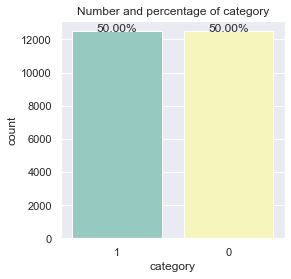
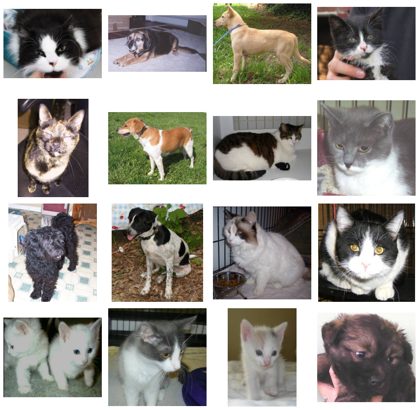
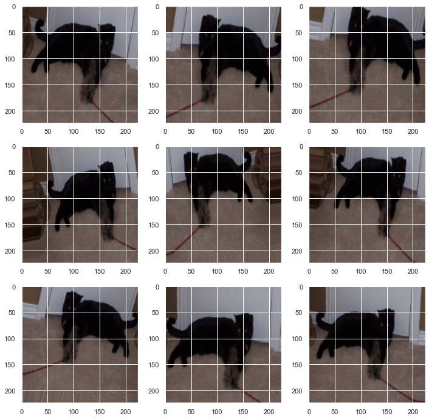
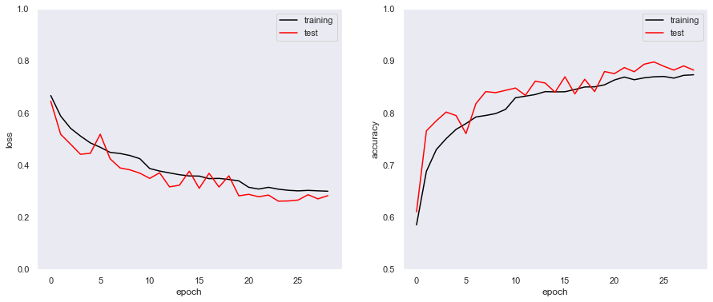

## 画像分類と転移学習

[Dogs vs. Cats Redux: Kernels Edition](https://www.kaggle.com/c/dogs-vs-cats-redux-kernels-edition)から画像分類を行います。


```python
import numpy as np
import pandas as pd
```

zipファイルの解凍

データは、`dogs-vs-cats-redux-kernels-edition.zip`の中の`train.zip`と`test.zip`の中に`cat.0.jpg`のような形で画像が保存されています。<br>まずはこれら3種類のzipファイルを解凍します。


```python
# 訓練データとテストデータの解凍
import os, shutil, zipfile

# 解凍するzipファイル名
file = ['train', 'test']

# ファイルパス
data = './data/'

# dataディレクトリの処理
if not os.path.exists(data):
    os.mkdir(data)

# zipファイルをdataディレクトリで解凍
with zipfile.ZipFile('./dogs-vs-cats-redux-kernels-edition.zip', 'r')as zf:
    zf.extractall('./data/dogs-vs-cats-redux-kernels-edition/')

# train.zip、test.zipをカレントディレクトリに展開
# for el in file:
# 訓練データの解凍
with zipfile.ZipFile('./data/dogs-vs-cats-redux-kernels-edition/train.zip', 'r') as z:
    z.extractall('./data/dogs-vs-cats-redux-kernels-edition/')
# test_all内にテストデータを格納
with zipfile.ZipFile('./data/dogs-vs-cats-redux-kernels-edition/test.zip', 'r') as z:
    z.extractall('./data/dogs-vs-cats-redux-kernels-edition/test_all/')
```

## 正解ラベル付け

データは画像のみで正解ラベルがありません。<br>その代わりファイル名の先頭3文字を正解ラベルにし、「dog:1」、「cat:0」に割り当ててファイル名とともにデータフレームに格納します。


```python
# trainディレクトリ内のファイル名を取得
train_path = './data/dogs-vs-cats-redux-kernels-edition/train'

file_name = os.listdir(train_path)
# カテゴリリスト
categories = []

# 訓練データのファイル名「cat.0.jpg」の先頭3文字でラベル作成
for name in file_name:
    # ファイル名を「.」で分割してその先頭を取得
    category = name.split('.')[0]
    # dogなら1、catなら（dog以外なら）0をリストに追加
    ## 多値分類ならここを変更
    categories.append(1) if category == 'dog' else categories.append(0)
    
# 正解ラベルとファイル名が対応したデータフレームの作成
df = pd.DataFrame({
    'file_name':file_name,
    'category':categories
})
df.head()
```


<div>
<style scoped>
    .dataframe tbody tr th:only-of-type {
        vertical-align: middle;
    }

    .dataframe tbody tr th {
        vertical-align: top;
    }

    .dataframe thead th {
        text-align: right;
    }
</style>
<table border="1" class="dataframe">
  <thead>
    <tr style="text-align: right;">
      <th></th>
      <th>file_name</th>
      <th>category</th>
    </tr>
  </thead>
  <tbody>
    <tr>
      <th>0</th>
      <td>cat.0.jpg</td>
      <td>0</td>
    </tr>
    <tr>
      <th>1</th>
      <td>cat.1.jpg</td>
      <td>0</td>
    </tr>
    <tr>
      <th>2</th>
      <td>cat.10.jpg</td>
      <td>0</td>
    </tr>
    <tr>
      <th>3</th>
      <td>cat.100.jpg</td>
      <td>0</td>
    </tr>
    <tr>
      <th>4</th>
      <td>cat.1000.jpg</td>
      <td>0</td>
    </tr>
  </tbody>
</table>
</div>


画像の枚数をグラフ化します。


```python
import matplotlib.pyplot as plt
%matplotlib inline
import seaborn as sns

def plot_count(feature, title, df, size=1):
    """
    クラス/特徴量をプロットする
    Pram:
        feature : 分析するカラム
        title : グラフタイトル
        df : プロットするデータフレーム
        size : デフォルト 1.
    """
    f, ax = plt.subplots(1,1, figsize=(4*size,4))
    total = float(len(df))
    # 最大20カラムをヒストグラムで表示
    g = sns.countplot(df[feature], order = df[feature].value_counts().index[:20], palette='Set3')
    g.set_title("Number and percentage of {}".format(title))
    if(size > 2):
        # サイズ2以上の時、行名を90°回転し、表示
        plt.xticks(rotation=90, size=8)
    # データ比率の表示
    for p in ax.patches:
        height = p.get_height()
        ax.text(p.get_x()+p.get_width()/2.,
                height + 3,
                '{:1.2f}%'.format(100*height/total),
                ha="center") 
    plt.show() 

# 表示スタイルの変更
sns.set('notebook')
# categoryの比率の確認
plot_count(feature='category', title='category', df=df, size=1)
```





データに偏りはないようです。<br>もしこの分布が偏っていたらデータ数が多いほうに合わせて少ないほうのデータ数の割合を多くするといった処理が必要になるようです。

#### 画像をランダムに表示


```python
# from tensorflow.keras.preprocessing.image import load_img
from tensorflow.keras.preprocessing.image import load_img

import random

# ランダムに画像ファイル名を16枚取得
sample = random.sample(file_name, 16)

# 表示画像サイズの指定
plt.figure(figsize=(12, 12))

# 16枚の画像の表示
for i in range(0, 16):
    # 4×4マスの順番に表示
    plt.subplot(4, 4, i+1)
    # sampleから画像を取得
    fname = sample[i]
    # 学習データから画像の読み込み
    image = load_img(train_path + '/' + fname)
    # 画像の表示
    plt.imshow(image)
    # 目盛りの非表示
    plt.axis('off')
# 画像をいい感じに調整
plt.tight_layout()
plt.show()
```





## 訓練データを訓練用と検証用に分割

訓練データの10%を検証用に分けます


```python
from sklearn.model_selection import train_test_split

# 訓練データの総数のうち10%を検証データにする
train_df, validate_df = train_test_split(df, test_size=0.1)

# 行インデックスを振りなおす
train_df = train_df.reset_index()
validate_df = validate_df.reset_index()
```


```python
# 訓練データの数を取得
total_train = train_df.shape[0]
# 検証データ数の取得
total_validate = validate_df.shape[0]

# 訓練、検証データの数を出力
print('total train num {}'.format(total_train))
print('total validate num {}'.format(total_validate))
print('total_validate / total_train = {:.3f}'.format(total_validate / total_train))
```

    total train num 22500
    total validate num 2500
    total_validate / total_train = 0.111
    

## 訓練データの加工

訓練データの画像サイズを統一し、CNNで入力できるようにします。


```python
from tensorflow.keras.preprocessing.image import ImageDataGenerator

# 画像をリサイズするときのサイズ
img_width, img_height = 224, 224
target_size = (img_width, img_height)

# ミニバッチサイズ
batch_size = 16

# データフレームに格納したファイル名と列名とラベルの列名
x_col, y_col = 'file_name', 'category'
# flow_from_dataframe()で画像を生成する際のclass_modeオプションの値
# ジェネレータが返すラベルの配列の形状として二値分類の`binary`を格納
class_mode = 'binary'

# 画像を加工するジェネレータを生成
train_datagen = ImageDataGenerator(
    rescale=1./255,          # RGB値を0～1.の範囲に変換
    rotation_range=15,       # ランダムに回転
    shear_range=0.2,         # シアー変換
    zoom_range=0.2,          # 拡大
    horizontal_flip=True,    # 水平方向に反転
    width_shift_range=0.1,   # 平行移動
    height_shift_range=0.1   # 垂直移動
)

# flow_from_dataframe()の引数class_mode = 'binary'の場合、
# ラベルが格納されたtrain_dfのy_col = 'category'の列の値は
# 文字列であることが必要なので、1と0の数値を文字に変換する
train_df['category'] = train_df['category'].astype(str)

# 画像データのパス
train_path = './data/dogs-vs-cats-redux-kernels-edition/train'
# ジェネレータで加工した画像の生成
train_generator = train_datagen.flow_from_dataframe(
    train_df,                # 訓練用のデータフレーム
    train_path,              # 画像データのディレクトリ
    x_col=x_col,             # ファイル名が格納された列
    y_col=y_col,             # ラベルが格納された列（文字列）
    class_mode=class_mode,   # ラベルの配列形状
    target_size=target_size, # 画像のサイズ
    batch_size=batch_size    # ミニバッチサイズ
)
```

    Found 22500 validated image filenames belonging to 2 classes.
    

#### 検証データの加工処理

検証データはデータ拡張の必要がないのでRGB値の変換のみ行う


```python
# 画像を加工するジェネレータを生成
validation_datagen = ImageDataGenerator(rescale=1./255)
# flow_from_dataframe()の引数class_mode = 'binary'の場合、
# ラベルが格納されたvalidate_dfのy_col = 'category'の列の値は
# 文字列であることが必要なので、1と0の数値を文字に変換する
validate_df['category'] = validate_df['category'].astype(str)

# ジェネレータで加工した画像の生成
validation_generator = validation_datagen.flow_from_dataframe(
    validate_df,             # 検証用のデータフレーム
    train_path,              # 画像データのディレクトリ
    x_col=x_col,             # ファイル名が格納された列
    y_col=y_col,             # ラベルが格納された列（文字列）
    class_mode=class_mode,   # ラベルの配列形状
    target_size=target_size, # 画像のサイズ
    batch_size=batch_size    # ミニバッチサイズ
)
```

    Found 2500 validated image filenames belonging to 2 classes.
    

実際に生成されたデータを訓練データから選び、加工処理後の画像を表示してみます。


```python
# 訓練データから1サンプル取り出し、reset_index()でインデックスを再設定
# 元のインデックスはdrop=Trueで削除
example_df = train_df.sample(n=1).reset_index(drop=True)
# ジェネレータで加工した画像の生成
example_generator = train_datagen.flow_from_dataframe(
    example_df,              # サンプル確認用のデータフレーム
    train_path,              # 画像データのディレクトリ
    x_col='file_name',       # ファイル名が格納された列
    y_col='category',        # ラベルが格納された列（文字列）
    target_size=target_size, # 画像のサイズ
)
# 描画エリアのサイズは12×12
plt.figure(figsize=(12, 12))
# 加工処理後の9パターンを表示
for i in range(0, 9):
    # 3×3のマス目の左上隅から順番に描画
    plt.subplot(3, 3, i+1)
    for X_batch, Y_batch in example_generator:
        # X_batchの1つ目の画像データを抽出
        image = X_batch[0]
        # 抽出した画像を描画したらbreak
        plt.imshow(image)
        break
plt.show()
```

    Found 1 validated image filenames belonging to 1 classes.
    





## モデル構築

3層の畳み込み層を持つCNNを作成します


```python
# 3層の畳み込み層を持つCNN
from tensorflow.keras.models import Sequential
from tensorflow.keras.layers import Conv2D, MaxPooling2D, Dropout, Flatten, Dense
from tensorflow.keras.layers import GlobalMaxPooling2D
from tensorflow.keras import optimizers
from tensorflow.keras import regularizers

# Sequentualオブジェクトを生成
model = Sequential()

# 入力データの形状
input_shape = (img_width, img_height, 3)

# 第1層:畳み込み層1
model.add(
    Conv2D(
        filters=32,              # フィルターの数は32
        kernel_size=(3, 3),      # 3×3のフィルターを使用
        padding='same',          # ゼロパディングを行う
        activation='relu',       # 活性化関数はReLU
        input_shape=input_shape, # 入力データの形状
        ))

# 第2層:プーリング層
model.add(
    MaxPooling2D(pool_size=(2, 2)))
# ドロップアウト25％
model.add(Dropout(0.25))

# 第3層:畳み込み層2
model.add(
    Conv2D(
        filters = 64,        # フィルターの数は32
        kernel_size = (3,3), # 3×3のフィルターを使用
        padding='same',      # ゼロパディングを行う
        activation='relu',   # 活性化関数はReLU
        ))

# 第4層:プーリング層
model.add(
    MaxPooling2D(pool_size=(2, 2)))
# ドロップアウト25％
model.add(Dropout(0.25))

# 第5層:畳み込み層3
model.add(
    Conv2D(
        filters=128,          # フィルターの数は64
        kernel_size=(3, 3),   # 3×3のフィルターを使用
        padding='same',       # ゼロパディングを行う
        activation='relu',    # 活性化関数はReLU
        ))

# 第6層:プーリング層
model.add(
    MaxPooling2D(pool_size=(2, 2))
)
# ドロップアウト25％
model.add(Dropout(0.25))

# (batch_size, rows, cols, channels)の4階テンソルに
# プーリング演算適用後、(batch_size, channels)の2階テンソルにフラット化
model.add(
    GlobalMaxPooling2D())

# 第7層
model.add(
    Dense(128,                   # ユニット数128
          activation='relu'))    # 活性化関数はReLU
# ドロップアウト25％
model.add(Dropout(0.25))

# 第8層:出力層
model.add(
    Dense(1,                     # ニューロン数は1個
          activation='sigmoid')) # 活性化関数はSigmoid

# モデルのコンパイル
model.compile(
    loss='binary_crossentropy',    # バイナリ用のクロスエントロピー誤差
    metrics=['accuracy'],          # 学習評価として正解率を指定
    optimizer=optimizers.RMSprop() # RMSpropで最適化
)
```


```python
model.summary()
```

    Model: "sequential"
    _________________________________________________________________
    Layer (type)                 Output Shape              Param #   
    =================================================================
    conv2d (Conv2D)              (None, 224, 224, 32)      896       
    _________________________________________________________________
    max_pooling2d (MaxPooling2D) (None, 112, 112, 32)      0         
    _________________________________________________________________
    dropout (Dropout)            (None, 112, 112, 32)      0         
    _________________________________________________________________
    conv2d_1 (Conv2D)            (None, 112, 112, 64)      18496     
    _________________________________________________________________
    max_pooling2d_1 (MaxPooling2 (None, 56, 56, 64)        0         
    _________________________________________________________________
    dropout_1 (Dropout)          (None, 56, 56, 64)        0         
    _________________________________________________________________
    conv2d_2 (Conv2D)            (None, 56, 56, 128)       73856     
    _________________________________________________________________
    max_pooling2d_2 (MaxPooling2 (None, 28, 28, 128)       0         
    _________________________________________________________________
    dropout_2 (Dropout)          (None, 28, 28, 128)       0         
    _________________________________________________________________
    global_max_pooling2d (Global (None, 128)               0         
    _________________________________________________________________
    dense (Dense)                (None, 128)               16512     
    _________________________________________________________________
    dropout_3 (Dropout)          (None, 128)               0         
    _________________________________________________________________
    dense_1 (Dense)              (None, 1)                 129       
    =================================================================
    Total params: 109,889
    Trainable params: 109,889
    Non-trainable params: 0
    _________________________________________________________________
    


```python
# 学習を行う

import math
from tensorflow.keras.callbacks import LearningRateScheduler, EarlyStopping, Callback

# 学習率をスケジューリングする
def step_decay(epoch):
    initial_lrate = 0.001 # 学習率の初期値
    drop = 0.5            # 減衰率は50%
    epochs_drop = 10.0    # 10エポック毎に減衰する
    lrate = initial_lrate * math.pow(
        drop,
        math.floor((epoch)/epochs_drop)
    )
    return lrate

# 学習率のコールバック
lrate = LearningRateScheduler(step_decay)
 
# 学習の進捗を監視して早期終了するコールバック
earstop = EarlyStopping(
    monitor='val_loss', # 監視対象は損失
    min_delta=0,        # 改善として判定される最小変化値
    patience=5)         # 改善が見られないと判断されるエポック数を5に拡大


# 学習の実行
# GPU使用による所要時間:
epochs = 40        # エポック数

history = model.fit(
    # 訓練データ
    train_generator,
    # エポック数
    epochs=epochs,
    # 訓練時のステップ数
    steps_per_epoch = total_train//batch_size,
    # 検証データ
    validation_data=validation_generator,
    # 検証時のステップ数
    validation_steps = total_validate//batch_size,
    # 学習の進捗状況を出力する    
    verbose=1,
    # 学習率のスケジューラーとアーリーストッピングをコール
    callbacks=[lrate, earstop]
)
```

    Epoch 1/40
    1406/1406 [==============================] - 759s 540ms/step - loss: 0.6674 - accuracy: 0.5855 - val_loss: 0.6459 - val_accuracy: 0.6106
    Epoch 2/40
    1406/1406 [==============================] - 735s 523ms/step - loss: 0.5888 - accuracy: 0.6884 - val_loss: 0.5189 - val_accuracy: 0.7660
    Epoch 3/40
    1406/1406 [==============================] - 723s 514ms/step - loss: 0.5419 - accuracy: 0.7300 - val_loss: 0.4810 - val_accuracy: 0.7853
    Epoch 4/40
    1406/1406 [==============================] - 722s 514ms/step - loss: 0.5122 - accuracy: 0.7512 - val_loss: 0.4421 - val_accuracy: 0.8021
    Epoch 5/40
    1406/1406 [==============================] - 736s 524ms/step - loss: 0.4858 - accuracy: 0.7689 - val_loss: 0.4458 - val_accuracy: 0.7953
    Epoch 6/40
    1406/1406 [==============================] - 735s 523ms/step - loss: 0.4691 - accuracy: 0.7800 - val_loss: 0.5191 - val_accuracy: 0.7608
    Epoch 7/40
    1406/1406 [==============================] - 730s 519ms/step - loss: 0.4494 - accuracy: 0.7926 - val_loss: 0.4247 - val_accuracy: 0.8181
    Epoch 8/40
    1406/1406 [==============================] - 730s 519ms/step - loss: 0.4452 - accuracy: 0.7956 - val_loss: 0.3898 - val_accuracy: 0.8413
    Epoch 9/40
    1406/1406 [==============================] - 730s 519ms/step - loss: 0.4374 - accuracy: 0.7991 - val_loss: 0.3824 - val_accuracy: 0.8393
    Epoch 10/40
    1406/1406 [==============================] - 730s 519ms/step - loss: 0.4252 - accuracy: 0.8072 - val_loss: 0.3697 - val_accuracy: 0.8438
    Epoch 11/40
    1406/1406 [==============================] - 730s 519ms/step - loss: 0.3874 - accuracy: 0.8296 - val_loss: 0.3496 - val_accuracy: 0.8482
    Epoch 12/40
    1406/1406 [==============================] - 730s 519ms/step - loss: 0.3777 - accuracy: 0.8325 - val_loss: 0.3710 - val_accuracy: 0.8341
    Epoch 13/40
    1406/1406 [==============================] - 733s 521ms/step - loss: 0.3706 - accuracy: 0.8357 - val_loss: 0.3170 - val_accuracy: 0.8614
    Epoch 14/40
    1406/1406 [==============================] - 730s 519ms/step - loss: 0.3637 - accuracy: 0.8413 - val_loss: 0.3234 - val_accuracy: 0.8578
    Epoch 15/40
    1406/1406 [==============================] - 6651s 5s/step - loss: 0.3590 - accuracy: 0.8408 - val_loss: 0.3773 - val_accuracy: 0.8401
    Epoch 16/40
    1406/1406 [==============================] - 752s 535ms/step - loss: 0.3584 - accuracy: 0.8410 - val_loss: 0.3115 - val_accuracy: 0.8698
    Epoch 17/40
    1406/1406 [==============================] - 756s 538ms/step - loss: 0.3486 - accuracy: 0.8454 - val_loss: 0.3691 - val_accuracy: 0.8369
    Epoch 18/40
    1406/1406 [==============================] - 766s 544ms/step - loss: 0.3495 - accuracy: 0.8502 - val_loss: 0.3164 - val_accuracy: 0.8650
    Epoch 19/40
    1406/1406 [==============================] - 753s 535ms/step - loss: 0.3455 - accuracy: 0.8505 - val_loss: 0.3595 - val_accuracy: 0.8413
    Epoch 20/40
    1406/1406 [==============================] - 736s 523ms/step - loss: 0.3402 - accuracy: 0.8543 - val_loss: 0.2826 - val_accuracy: 0.8798
    Epoch 21/40
    1406/1406 [==============================] - 750s 534ms/step - loss: 0.3155 - accuracy: 0.8636 - val_loss: 0.2884 - val_accuracy: 0.8758
    Epoch 22/40
    1406/1406 [==============================] - 775s 551ms/step - loss: 0.3087 - accuracy: 0.8692 - val_loss: 0.2791 - val_accuracy: 0.8874
    Epoch 23/40
    1406/1406 [==============================] - 774s 550ms/step - loss: 0.3153 - accuracy: 0.8641 - val_loss: 0.2855 - val_accuracy: 0.8794
    Epoch 24/40
    1406/1406 [==============================] - 775s 551ms/step - loss: 0.3082 - accuracy: 0.8677 - val_loss: 0.2623 - val_accuracy: 0.8938
    Epoch 25/40
    1406/1406 [==============================] - 765s 544ms/step - loss: 0.3039 - accuracy: 0.8698 - val_loss: 0.2630 - val_accuracy: 0.8982
    Epoch 26/40
    1406/1406 [==============================] - 755s 537ms/step - loss: 0.3018 - accuracy: 0.8704 - val_loss: 0.2665 - val_accuracy: 0.8898
    Epoch 27/40
    1406/1406 [==============================] - 754s 536ms/step - loss: 0.3036 - accuracy: 0.8671 - val_loss: 0.2869 - val_accuracy: 0.8826
    Epoch 28/40
    1406/1406 [==============================] - 770s 547ms/step - loss: 0.3019 - accuracy: 0.8725 - val_loss: 0.2710 - val_accuracy: 0.8906
    Epoch 29/40
    1406/1406 [==============================] - 771s 549ms/step - loss: 0.3004 - accuracy: 0.8736 - val_loss: 0.2833 - val_accuracy: 0.8826
    

## 損失と正解率の推移をグラフ化


```python
# プロットサイズの設定
plt.figure(figsize=(15, 6))
# プロット図を縮小して図の間のスペースを確保
plt.subplots_adjust(wspace=0.2)
# 2つの図を並べて表示
plt.subplot(1, 2, 1)
# 学習データのlossの表示
plt.plot(
    history.history['loss'],
    label='training',
    color='black'
)
# 検証データのlossの表示
plt.plot(
    history.history['val_loss'],
    label='test',
    color='red'
)

plt.ylim((0, 1))
plt.legend()        # 凡例
plt.grid()
plt.xlabel('epoch')
plt.ylabel('loss')

plt.subplot(1, 2, 2)
# 学習データの正解率の表示
plt.plot(
    history.history['accuracy'],
    label='training',
    color='black'
)
# 検証データの正解率の表示
plt.plot(
    history.history['val_accuracy'],
    label='test',
    color='red'
)

plt.ylim((0.5, 1))
plt.legend()        # 凡例
plt.grid()
plt.xlabel('epoch')
plt.ylabel('accuracy')
```


    Text(0, 0.5, 'accuracy')





## モデルとモデルの重みを保存


```python
model.save_weights('Dense_Dropout_model_wieghts.h5')
model.save('Dense_Dropout_model_keras.h5')
```

# テストデータで予測を推論を実施しcsvデータの作成


```python
# 画像データのパス
test_path = './data/dogs-vs-cats-redux-kernels-edition/test_all/test'

test_filenames = os.listdir(test_path)
test_df = pd.DataFrame({
    'file_name': test_filenames
})
test_df.head()
```


<div>
<style scoped>
    .dataframe tbody tr th:only-of-type {
        vertical-align: middle;
    }

    .dataframe tbody tr th {
        vertical-align: top;
    }

    .dataframe thead th {
        text-align: right;
    }
</style>
<table border="1" class="dataframe">
  <thead>
    <tr style="text-align: right;">
      <th></th>
      <th>file_name</th>
    </tr>
  </thead>
  <tbody>
    <tr>
      <th>0</th>
      <td>1.jpg</td>
    </tr>
    <tr>
      <th>1</th>
      <td>10.jpg</td>
    </tr>
    <tr>
      <th>2</th>
      <td>100.jpg</td>
    </tr>
    <tr>
      <th>3</th>
      <td>1000.jpg</td>
    </tr>
    <tr>
      <th>4</th>
      <td>10000.jpg</td>
    </tr>
  </tbody>
</table>
</div>


```python
# テストデータの数を取得
total_test = test_df.shape[0]

# テストデータの数を出力
print('total test num {}'.format(total_test))
```

    total test num 12500
    

画像ファイルリストからidを抜き出す


```python
test_ids = [int(test_img[:-4]) for test_img in test_filenames]
test_ids[:5]
```


    [1, 10, 100, 1000, 10000]


```python
test_path = './data/dogs-vs-cats-redux-kernels-edition/test_all/'
# Define data pre-processing 
test_image_gen = ImageDataGenerator(rescale=1./255)

# ジェネレータで加工した画像の生成
test_generator = test_image_gen.flow_from_directory(
    test_path,
    target_size=target_size,
    batch_size=batch_size,
    seed=42,
    class_mode='categorical',
    shuffle=False
)
test_generator.reset()
```

    Found 12500 images belonging to 1 classes.
    


```python
predictions = model.predict_generator(test_generator, verbose=1)
```

    WARNING:tensorflow:From <ipython-input-20-0279f24d1061>:1: Model.predict_generator (from tensorflow.python.keras.engine.training) is deprecated and will be removed in a future version.
    Instructions for updating:
    Please use Model.predict, which supports generators.
    782/782 [==============================] - 94s 120ms/step
    

1次元配列を取得するために予測配列をフラット化


```python
predictions = predictions.flatten()
```

### 予測結果のcsvファイルへの保存


```python
submission = pd.DataFrame({'id': test_ids, 'label': predictions})
submission.to_csv('dogs_cats.csv', index = False)
submission.head()
```


<div>
<style scoped>
    .dataframe tbody tr th:only-of-type {
        vertical-align: middle;
    }

    .dataframe tbody tr th {
        vertical-align: top;
    }

    .dataframe thead th {
        text-align: right;
    }
</style>
<table border="1" class="dataframe">
  <thead>
    <tr style="text-align: right;">
      <th></th>
      <th>id</th>
      <th>label</th>
    </tr>
  </thead>
  <tbody>
    <tr>
      <th>0</th>
      <td>1</td>
      <td>0.937974</td>
    </tr>
    <tr>
      <th>1</th>
      <td>10</td>
      <td>0.154285</td>
    </tr>
    <tr>
      <th>2</th>
      <td>100</td>
      <td>0.009158</td>
    </tr>
    <tr>
      <th>3</th>
      <td>1000</td>
      <td>0.994033</td>
    </tr>
    <tr>
      <th>4</th>
      <td>10000</td>
      <td>0.254319</td>
    </tr>
  </tbody>
</table>
</div>


