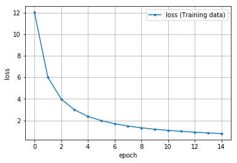
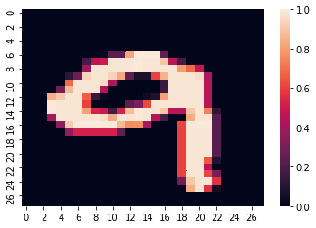
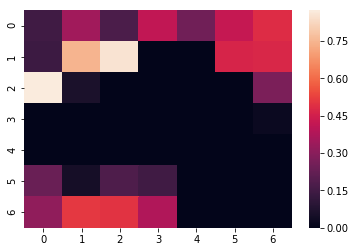
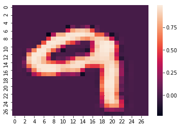

# MNISTのAutoEncoder

2次元MNIST画像を使用してオートエンコーダを実装します。


## データセットの取得


```python
import torch
print(torch.__version__)

# device取得
device = 'cuda' if torch.cuda.is_available() else 'cpu'
print(device)

import torchvision
import torchvision.transforms as transforms    # 画像（を構成する数値データ）を変換するためのクラス

# データをロードした後に行う処理の設定
transform = transforms.Compose([
    transforms.ToTensor()                       # テンソル型に変換  
])
"""
  MNSTデータのダウンロード
"""
df_train = torchvision.datasets.MNIST(
    root='./data',                              # データ保存先
    train=True,                                # True あらかじめ訓練用とされたのデータを取得
    transform=transform,                        # データに対しての処理 
    download=True                              # rootの位置にデータを保存
)

df_test = torchvision.datasets.MNIST(
    root='./data',                              # データ保存先
    train=False,                               # True あらかじめ訓練用とされたのデータを取得
    transform=transform,                        # データに対しての処理 
    download=True                              # rootの位置にデータを保存
)
image, label = df_train[0]


print('データサイズ:', len(image[0][0]), len(image[0]))
```

    1.5.0+cpu
    cpu
    データサイズ: 28 28
    

## データローダーの作成


```python
from torch.utils.data import DataLoader, TensorDataset    # データ関連のユーティリティクラスのインポート

# 定数（学習方法の設計時）
BATCH_SIZE = 32        # バッチサイズ

# データローダー（loader）の作成 ミニバッチを扱うため、データローダー（loader）を作成する
loader_train = DataLoader(df_train, batch_size=BATCH_SIZE, shuffle=True)
loader_valid = DataLoader(df_test, batch_size=BATCH_SIZE, shuffle=False)
```

## モデル設計


```python
import torch.nn as nn
# 定数
INPUT_CHANNELS = 1         # 入力チャネル数（MNISTはRGB値のようなカラー画像ではなく、各ピクセルが0～255（の値を-1～1の範囲の浮動小数点数に変換したもの）だけのデータなので、ここでは1を指定）
CONV2_CHANNELS = 8         # 出力チャネル数 8個のカーネルを作成（conv2の入力チャネルの数を一致させる必要があります[conv1の出力→活性化関数→プーリングを経てconv2の入力チャンネルとして渡されます]）
PADDING_SIZE = 1           # パディングサイズ 1
INPUT_KERNELSIZE = 3       # 入力層のフィルター(カーネル) サイズ 3×3のサイズのカーネルを作成
CONV3_CHANNELS =  16       # 畳み込み層2の出力チャネル数
OUTPUT_CHANNELS = 16       # 畳み込み層2の出力チャネル数

INPUT_POOLSIZE = 2    # プーリング実行サイズ 2×2のサイズ
INPUT_FACTERSIZE = 2  # アップさんプリングサイズ


# モデルの定義
class ConvolutionalNeuralNetwork(nn.Module):
    def __init__(self):
        # 継承したnn.Module親クラスを初期化
        super(ConvolutionalNeuralNetwork, self).__init__()
        
        """層の定義
        """
        # エンコーダの定義
        self.en = nn.Sequential(
            # 畳み込み層1
            nn.Conv2d(
                in_channels=INPUT_CHANNELS,       # 入力チャネル数
                out_channels=CONV2_CHANNELS,      # 出力チャネル数
                kernel_size=INPUT_KERNELSIZE,     # 入力層のフィルター(カーネル) サイズ
                padding=PADDING_SIZE              # パディングサイズ
            ),
            # 活性化関数（隠れ層）ReLU関数
            nn.ReLU(inplace=True),
            # プーリング層（MaxPooling）
            nn.MaxPool2d(
                kernel_size=INPUT_POOLSIZE,       # プーリング実行サイズ
            ),
            # 畳み込み層2
            nn.Conv2d(
                in_channels=CONV2_CHANNELS,       # 入力チャネル数
                out_channels=CONV3_CHANNELS,      # 出力チャネル数
                kernel_size=INPUT_KERNELSIZE,     # 入力層のフィルター(カーネル) サイズ
                padding=PADDING_SIZE              # パディングサイズ
            ),
            # 活性化関数（隠れ層）ReLU関数
            nn.ReLU(inplace=True),
            # プーリング層（MaxPooling）
            nn.MaxPool2d(
                kernel_size=INPUT_POOLSIZE,       # プーリング実行サイズ
            ),
            # 畳み込み層3
            nn.Conv2d(
                in_channels=CONV3_CHANNELS,       # 入力チャネル数
                out_channels=OUTPUT_CHANNELS,     # 出力チャネル数
                kernel_size=INPUT_KERNELSIZE,     # 入力層のフィルター(カーネル) サイズ
                padding=PADDING_SIZE              # パディングサイズ
            ),
            # 活性化関数（隠れ層）ReLU関数
            nn.ReLU(inplace=True),
            # ここでMaxPoolingすると7で割り切れないのでやらない
        )
        # デコーダの定義
        self.de = nn.Sequential(
            # 畳み込み層3
            nn.Conv2d(
                in_channels=CONV3_CHANNELS,       # 入力チャネル数
                out_channels=OUTPUT_CHANNELS,     # 出力チャネル数
                kernel_size=INPUT_KERNELSIZE,     # 入力層のフィルター(カーネル) サイズ
                padding=PADDING_SIZE              # パディングサイズ
            ),
            # 活性化関数（隠れ層）ReLU関数
            nn.ReLU(inplace=True),
            # アップサンプリング
            nn.Upsample(
                scale_factor=INPUT_FACTERSIZE,    # アップサンプリングしず
            ),
            # 畳み込み層2
            nn.Conv2d(
                in_channels=CONV3_CHANNELS,       # 入力チャネル数
                out_channels=CONV2_CHANNELS,      # 出力チャネル数
                kernel_size=INPUT_KERNELSIZE,     # 入力層のフィルター(カーネル) サイズ
                padding=PADDING_SIZE              # パディングサイズ
            ),
            # 活性化関数（隠れ層）ReLU関数
            nn.ReLU(inplace=True),
            # アップサンプリング
            nn.Upsample(
                scale_factor=INPUT_FACTERSIZE,    # アップサンプリングしず
            ),
            # 畳み込み層1
            nn.Conv2d(
                in_channels=CONV2_CHANNELS,       # 入力チャネル数
                out_channels=INPUT_CHANNELS,      # 出力チャネル数
                kernel_size=INPUT_KERNELSIZE,     # 入力層のフィルター(カーネル) サイズ
                padding=PADDING_SIZE
            ),
            # 活性化関数（隠れ層）tanh関数
            nn.Tanh(),
        )
    def forward(self, x):
        """フォワードパスの定義
        """
        # 圧縮した情報を渡す
        x = self.en(x)
        x = self.de(x)
        return x

# モデルのインスタンス化
model = ConvolutionalNeuralNetwork()
model.to(device)                  # モデルにデバイスの状態を渡す
print(model)                      # モデルの概要を出力  
```

    ConvolutionalNeuralNetwork(
      (en): Sequential(
        (0): Conv2d(1, 8, kernel_size=(3, 3), stride=(1, 1), padding=(1, 1))
        (1): ReLU(inplace=True)
        (2): MaxPool2d(kernel_size=2, stride=2, padding=0, dilation=1, ceil_mode=False)
        (3): Conv2d(8, 16, kernel_size=(3, 3), stride=(1, 1), padding=(1, 1))
        (4): ReLU(inplace=True)
        (5): MaxPool2d(kernel_size=2, stride=2, padding=0, dilation=1, ceil_mode=False)
        (6): Conv2d(16, 16, kernel_size=(3, 3), stride=(1, 1), padding=(1, 1))
        (7): ReLU(inplace=True)
      )
      (de): Sequential(
        (0): Conv2d(16, 16, kernel_size=(3, 3), stride=(1, 1), padding=(1, 1))
        (1): ReLU(inplace=True)
        (2): Upsample(scale_factor=2.0, mode=nearest)
        (3): Conv2d(16, 8, kernel_size=(3, 3), stride=(1, 1), padding=(1, 1))
        (4): ReLU(inplace=True)
        (5): Upsample(scale_factor=2.0, mode=nearest)
        (6): Conv2d(8, 1, kernel_size=(3, 3), stride=(1, 1), padding=(1, 1))
        (7): Tanh()
      )
    )
    

#### 畳み込み層とプーリング層の算出式+全結合層の入力
$
入力サイズ : [高さ, 幅]=[H, W]\\
出力サイズ : [高さ, 幅]=[O_h, O_w]\\
フィルタサイズのサイズ : [高さ, 幅]=[F_h, F_w]\\
パディングサイズ : P\\
ストライド : S\\
$
出力サイズ$O_h, O_w$は以下のように計算できます。
$$O_h=\frac{H+2P-F_h}{s}+1\\
O_w=\frac{W+2P-F_w}{s}+1$$

mnistのデータは`28x28`のサイズで`1`チャンネルです（白黒画像であるため）。

## オプティマイザー（最適化用オブジェクト）の作成


```python
import torch.optim as optim    # 最適化モジュールのインポート

# 定数
LEARN_RATE = 0.01        # 学習率

# オプティマイザーの作成（パラメータと学習率も作成）
optimizer = optim.Adam(    # 最適化アルゴリズムに「Adam」を選択
    model.parameters(),   # 最適化で更新する重みやバイアスのパラメータ
    lr=LEARN_RATE,        # 学習率
)
```

## 損失関数の定義


```python
criterion = nn.MSELoss()   # 損失関数
```

## 訓練（学習）の処理


```python
import matplotlib.pyplot as plt
%matplotlib inline

def init_parameters(layer):
    """パラメータ（重みとバイアス）の初期化
    引数の層が全結合層の時パラメータを初期化する
    
    Param:
      layer: 層情報
    """
    if type(layer) == nn.Linear:
        nn.init.xavier_uniform_(layer.weight)    # 重みを「一様分布のランダム値」で初期化
        layer.bias.data.fill_(0.0)               # バイアスを「0」で初期化


model.apply(init_parameters)        # 学習の前にパラメーター初期化

# 学習にかかる時間を測定する
import time

# 定数
start = time.time()             # 実行開始時間の取得

# 定数
EPOCHS = 15              # エポック数

# 変数　学習用と評価用の平均変数
avg_loss = 0.0           # 訓練用の平均損失値


# 損失の履歴を保存するための変数
train_hist_loss = []

for epoch in range(EPOCHS):
    # forループ内で使う変数と、エポックごとの値リセット
    total_loss = 0.0     # 訓練時における累計損失値
    
    total_train = 0      # 訓練時における累計データ数

    for train_X, _ in loader_train:
        """
        1ミニバッチ分の「訓練」を実行
        """
        # デバイスの適用
        train_X = train_X.to(device)
        
        # 学習モードに設定
        model.train()
        # フォワードプロパゲーションで出力結果を取得
        output = model(train_X)
        # 誤差（出力結果と正解ラベルの差）から損失を取得
        # 再構成した画像と元の画像を渡す
        loss = criterion(output, train_X)

        # 取得した損失値と正解率を累計値側に足していく
        total_loss += loss.item()   # 訓練用の累計損失値
        # 出力結果と正解ラベルから損失を計算し、勾配を計算
        optimizer.zero_grad()                 # 勾配を0で初期化
        
        loss.backward()                       # 逆伝播の処理として勾配を計算（自動微分）
        # 勾配を使ってパラメーター（重みとバイアス）を更新
        optimizer.step()                     # 最適化の実施
        
    # ミニバッチ単位で累計してきた損失値の平均を取る
    n = epoch + 1                             # 処理済みのエポック数
    avg_loss = total_loss / n                 # 訓練用の平均損失値

    # グラフ描画のために損失の履歴を保存する
    train_hist_loss.append(avg_loss)
    
    
    # 損失や正解率などの情報を表示
    print(f'[Epoch {epoch+1:3d}/{EPOCHS:3d}]' \
          f' loss: {avg_loss:.5f}' )

print('Finished Training')
# print(model.state_dict())  # 学習後のパラメーターの情報を表示

# 学習終了後、学習に要した時間を出力
print("Computation time:{0:.3f} sec".format(time.time() - start))

# 学習結果（損失）のグラフを描画
epochs = len(train_hist_loss)
plt.plot(range(epochs), train_hist_loss, marker='.', label='loss (Training data)')
plt.legend(loc='best')
plt.grid()
plt.xlabel('epoch')
plt.ylabel('loss')
plt.show()
```

    [Epoch   1/ 15] loss: 12.01559
    [Epoch   2/ 15] loss: 6.00413
    [Epoch   3/ 15] loss: 3.98620
    [Epoch   4/ 15] loss: 2.97592
    [Epoch   5/ 15] loss: 2.37753
    [Epoch   6/ 15] loss: 1.98251
    [Epoch   7/ 15] loss: 1.69800
    [Epoch   8/ 15] loss: 1.48038
    [Epoch   9/ 15] loss: 1.31824
    [Epoch  10/ 15] loss: 1.18366
    [Epoch  11/ 15] loss: 1.07649
    [Epoch  12/ 15] loss: 0.98993
    [Epoch  13/ 15] loss: 0.90667
    [Epoch  14/ 15] loss: 0.84149
    [Epoch  15/ 15] loss: 0.78354
    Finished Training
    Computation time:1180.076 sec
    





## データの圧縮・復元を実際に行う


```python
import seaborn as sns

# 作成したデータの形状の確認
data_iter = iter(loader_train)
imgs, labels = data_iter.next()

img = imgs[0]        # 最初の画像を抜き出す
img_permute = img.permute(1, 2, 0)    # 画像の順番をチャネルラストに変更

img_permute = np.clip(img_permute, 0, 1) # 画像の最小値を0・最大値1に設定
sns.heatmap(img_permute[:, :, 0])     # ヒートマップに二次元の配列を渡す
```


    <matplotlib.axes._subplots.AxesSubplot at 0x19dca2d3828>





### エンコードの実行


```python
# エンコードを行う
x_en = model.en(imgs.to(device))    # .en()でモデルのエンコード

x_en2 = x_en[0].permute(1, 2, 0)    # 画像の順番をチャネルラストに変更

# 全16チャンネルのうち最初のチャンネルを抽出し表示
# .detach()で勾配計算しないようにする
sns.heatmap(x_en2[:, :, 0].detach().to(device))     # ヒートマップに二次元の配列を渡す
```


    <matplotlib.axes._subplots.AxesSubplot at 0x19dca530cf8>





### エンコードとデコードを行う


```python
# エンコードとデコードの実行
x_ae = model(imgs.to(device))
# チャネルラストに変更し、勾配計算しないようにし、二次元配列に変換してヒートマップを表示
sns.heatmap(x_ae[0].permute(1, 2, 0).detach().to(device)[:, :, 0])
```


    <matplotlib.axes._subplots.AxesSubplot at 0x19dca5d9400>





オートエンコーダーを使用することである画像の圧縮された状態や復元された状態を取得することができる。
