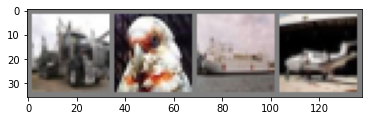
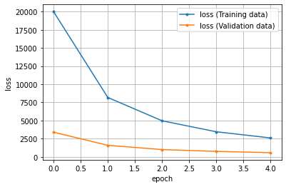
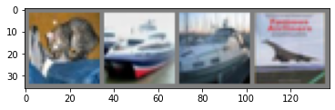
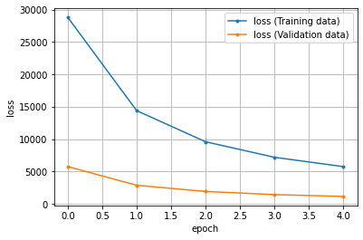

# CIFAR-10でCNN

PyTorch 公式チュートリアル[TRAINING A CLASSIFIER](https://pytorch.org/tutorials/beginner/blitz/cifar10_tutorial.html)を参考にCIRFAR-10データで32x32サイズのカラー画像RGB3チャネル(3, 32, 32)から「飛行機」、「自動車」、「鳥」、「猫」、「鹿」、 「犬」、「カエル」、「馬」、「船」、「トラック」の10種類のクラスに分類するモデルを作成します。

## CIFAR-10 データの読み込みと正規化

`Dataset` と `DataLoader` を使用してデータを読み込みます
#### データセットの取得


```python
import torch
import torchvision
import torchvision.transforms as transforms

# transform の定義
# ToTensor で Tensorに変換し
# 標準化 ( X - 0.5) / 0.5 = RGBの範囲を [-1, 1] に変換
transform = transforms.Compose(
    [transforms.ToTensor(),
     # transforms.RandomHorizontalFlip(),                                     # ランダムに左右を入れ替える
     # transforms.ColorJitter(),                                              # ランダムに画像の閾値を変える
     # transforms.RandomRotation(10),                                         # ランダムに画像の回転（±10°）
     transforms.Normalize((0.5, 0.5, 0.5), (0.5, 0.5, 0.5))])               # (X-0.5) / 0.5でRGBを標準化

df_train = torchvision.datasets.CIFAR10(root='./data', train=True,
                                        download=True, transform=transform)

df_valid = torchvision.datasets.CIFAR10(root='./data', train=False,
                                       download=True, transform=transform)
# クラス分類の一覧(分類後の出力値とラベルの対応付け)
classes = ('plane', 'car', 'bird', 'cat',
           'deer', 'dog', 'frog', 'horse', 'ship', 'truck')

image, clas = df_train[0]
print(len(image[0]), len(image[0][0]))
```

    Files already downloaded and verified
    Files already downloaded and verified
    32 32
    

#### データローダーの作成


```python
from torch.utils.data import DataLoader, TensorDataset    # データ関連のユーティリティクラスのインポート

# 定数（学習方法の設計時）
BATCH_SIZE = 4        # バッチサイズ

# データローダー（loader）の作成 ミニバッチを扱うため、データローダー（loader）を作成する
loader_train = DataLoader(df_train, batch_size=BATCH_SIZE,
                          shuffle=True, num_workers=2)
loader_valid = DataLoader(df_valid, batch_size=BATCH_SIZE, 
                          shuffle=False, num_workers=2)
```

## データの確認


```python
import numpy as np
import matplotlib.pyplot as plt
%matplotlib inline

# 画像表示関数
def imshow(img):
    """
    1. 標準化したデータを読込み時の状態身戻す
    2. Numpy変換し、データを表示できるよう並び替え
    （元データ[チャネル, 縦サイズ, 横サイズ]構成を
    [縦サイズ, 横サイズ, チャネル]に並び替えする）
    3. 画像として表示
    
    Param:
      img: 入力データ（テンソル型）
    """
    img = 0.5 * img + 0.5                     # 標準化したデータをもとに戻す
    npimg = img.numpy()                       # Numpy変換
    npimg = np.transpose(npimg, (1, 2, 0))    # データの並び替え
    plt.imshow(npimg)

# iter()してnext()でイテレータ内部の要素を1つずつ出力できるようにする
# イテレーションしてデータローダー作成時にランダム化したデータを取得
dt_iter = iter(loader_train)

images, labels = dt_iter.next()               # イテレータの要素を1つ出力

# 複数の画像を横に並べる
img = torchvision.utils.make_grid(images)
print(type(images))                           # <class 'torch.FloatTensor'>
print(images.size)                            # torch.Size([4, 3, 32, 32])
print(type(img))                              # <class 'torch.FloatTensor'>
print(img.size)                               # torch.Size([3, 36, 138])

imshow(img)                                   # 画像を表示

# ラベルの表示
label_image = []                              # ラベル格納空リスト
for i in range(4):
    label_image.append(classes[labels[i]])    # ラベル名を追加

print(label_image)
```

    <class 'torch.Tensor'>
    <built-in method size of Tensor object at 0x7f22a11e1750>
    <class 'torch.Tensor'>
    <built-in method size of Tensor object at 0x7f22a10f71f8>
    ['truck', 'bird', 'ship', 'plane']
    





## 畳み込みニューラルネットワークの定義

ネットワークの構造：
Conv1層→MaxPooling層→Conv2層→MaxPooling層→全結合層→全結合層→出力層


```python
import torch.nn as nn
# 定数
INPUT_CHANNELS = 3         # 入力チャネル数（カラー画像なので、RGB値ので、3を指定）
CONV2_CHANNELS = 6         # 出力チャネル数 6個のカーネルを作成（conv2の入力チャネルの数を一致させる必要があります[conv1の出力→活性化関数→プーリングを経てconv2の入力チャネルとして渡されます]）
INPUT_KERNELSIZE = 5       # 入力層のフィルター(カーネル) サイズ 5×5のサイズのカーネルを作成
OUTPUT_CHANNELS = 16       # 畳み込み層2の出力チャネル数

# 2×2のサイズでプーリングを行います(サイズ/2)
INPUT_POOLSIZE = (2, 2)    # プーリング実行サイズ 2×2のサイズ
PADDING_SIZE = 0           # パディングサイズ
STRIDE_WIDTH = 2           # ストライド幅

LAYER1_NEURONS = 16*5*5    # 隠れ層1のニューロン数
LAYER2_NEURONS = 120       # 隠れ層2のニューロン数
LAYER3_NEURONS = 120       # 隠れ層3のニューロン数
OUTPUT_RESULTS = 10        # 出力層のニューロン数

# 変数 活性化関数
activation = torch.nn.ReLU()     # 活性化関数（隠れ層）ReLU関数    変更可

# モデルの定義
class ConvolutionalNeuralNetwork(nn.Module):
    def __init__(self):
        # 継承したnn.Module親クラスを初期化
        super(ConvolutionalNeuralNetwork, self).__init__()
        
        """層の定義
        """
        # 畳み込み層1
        self.conv1 = nn.Conv2d(
            INPUT_CHANNELS,       # 入力チャネル数
            CONV2_CHANNELS,       # 出力チャネル数
            INPUT_KERNELSIZE      # 入力層のフィルター(カーネル) サイズ
        )
        # プーリング層（MaxPooling）
        self.pool = nn.MaxPool2d(
            INPUT_POOLSIZE,       # プーリング実行サイズ
            # padding=PADDING_SIZE, # パディングサイズ
            # stride=STRIDE_WIDTH   # ストライド幅
        )
        # 畳み込み層2
        self.conv2 = nn.Conv2d(
            CONV2_CHANNELS,       # 入力チャネル数
            OUTPUT_CHANNELS,      # 出力チャネル数
            INPUT_KERNELSIZE      # 入力層のフィルター(カーネル) サイズ
        )
        
        # 隠れ層1
        self.layer1 = nn.Linear(
            LAYER1_NEURONS,      # 隠れ層1のニューロン数
            LAYER2_NEURONS       # 次の層への出力ユニット数
        )
        # 隠れ層2
        self.layer2 = nn.Linear(
            LAYER2_NEURONS,      # 隠れ層2のニューロン数
            LAYER3_NEURONS       # 次の層への出力ユニット数
        )
        # 出力層
        self.layer_out = nn.Linear(
            LAYER3_NEURONS,      # 入力ユニット数
            OUTPUT_RESULTS       # 出力結果への出力ユニット数
        )
        
    def forward(self, x):
        """フォワードパスの定義
        """
        # 出力＝活性化関数（第n層（入力））の形式
        x = activation(self.conv1(x))      # 活性化関数は変数として定義
        x = self.pool(x)                   # マックスプーリングの実行
        x = activation(self.conv2(x))
        x = self.pool(x)                   # マックスプーリングの実行
        x = x.view(-1, LAYER1_NEURONS)     # 畳み込み層の出力サイズを全結合層の入力ニューロン数に変換
        x = activation(self.layer1(x))     # 活性化関数は変数として定義
        x = activation(self.layer2(x))     # 活性化関数は変数として定義
        x = self.layer_out(x)              # 出力層の実行
        return x

# モデルのインスタンス化
model = ConvolutionalNeuralNetwork()
print(model)                      # モデルの概要を出力
```

    ConvolutionalNeuralNetwork(
      (conv1): Conv2d(3, 6, kernel_size=(5, 5), stride=(1, 1))
      (pool): MaxPool2d(kernel_size=(2, 2), stride=(2, 2), padding=0, dilation=1, ceil_mode=False)
      (conv2): Conv2d(6, 16, kernel_size=(5, 5), stride=(1, 1))
      (layer1): Linear(in_features=400, out_features=120, bias=True)
      (layer2): Linear(in_features=120, out_features=120, bias=True)
      (layer_out): Linear(in_features=120, out_features=10, bias=True)
    )
    

## 層ごとの出力の算出

#### 畳み込み層とプーリング層の算出式+全結合層の入力
$
入力サイズ : [高さ, 幅]=[H, W]\\
出力サイズ : [高さ, 幅]=[O_h, O_w]\\
フィルタサイズのサイズ : [高さ, 幅]=[F_h, F_w]\\
パディングサイズ : P\\
ストライド : S\\
$
出力サイズ$O_h, O_w$は以下のように計算できます。
$$O_h=\frac{H+2P-F_h}{s}+1\\
O_w=\frac{W+2P-F_w}{s}+1$$

CIFAR-10 のデータは`32x32`のサイズで`3`チャネルです（カラー画像であるため）。
よって

$conv1$の出力は
$$O_h=\frac{32+2×0-5}{1}+1=28\\
O_w=\frac{32+2×0-5}{1}+1=28\\
出力=28×28の6チャネル
$$
$pool$の出力は
$$O_h=\frac{28+2×0-2}{2}+1=14\\
O_w=\frac{28+2×0-2}{2}+1=14\\
出力=14×14の6チャネル
$$
$conv2$の出力は
$$O_h=\frac{14+2×0-5}{1}+1=10\\
O_w=\frac{14+2×0-5}{1}+1=10\\
出力=10×10の16チャネル
$$
$pool$の出力は
$$O_h=\frac{10+2×0-2}{2}+1=5\\
O_w=\frac{10+2×0-2}{2}+1=5\\
出力=5×5の16チャネル
$$
$layer1$の入力は
$$
入力=5×5×16=400
$$

## オプティマイザー（最適化用オブジェクト）の作成


```python
import torch.optim as optim    # 最適化モジュールのインポート

# 定数
LEARN_RATE = 0.001       # 学習率
MOMENTUM =  0.9          # モーメンタム

# オプティマイザーの作成（パラメータと学習率も作成）
optimizer = optim.SGD(    # 最適化アルゴリズムに「SGD」を選択
    model.parameters(),   # 最適化で更新する重みやバイアスのパラメータ
    lr=LEARN_RATE,        # 学習率
    momentum=MOMENTUM     # モーメンタム（移動平均 を適用して、振動を抑制）
)
```

## 損失関数の定義


```python
# 変数
criterion = nn.CrossEntropyLoss()   # 損失関数：交差エントロピー 学習データの正解率を出力
```

## 1回分の「訓練（学習）」と「評価」の処理


```python
def train_step(train_X, train_y):
    """学習の実行
    訓練モードの設定
    フォワードプロパゲーションで出力結果の取得
    出力結果と正解ラベルから損失および勾配の計算
    勾配を使ってパラメーター（重みとバイアス）の更新
    正解率の算出
    
    Param:
      train_X: 入力データ
      train_y: 正解ラベル
    """
    # 学習モードに設定
    model.train()

    # フォワードプロパゲーションで出力結果を取得
    pred_y = model(train_X)    # フォワードプロパゲーションの結果を取得
    
    # 出力結果と正解ラベルから損失を計算し、勾配を計算
    optimizer.zero_grad()                # 勾配を0で初期化
    loss = criterion(pred_y, train_y)    # 誤差（出力結果と正解ラベルの差）から損失を取得
    loss.backward()                      # 逆伝播の処理として勾配を計算（自動微分）
    
    # 勾配を使ってパラメーター（重みとバイアス）を更新
    optimizer.step()                     # 最適化の実施
    
    # 正解数の算出
    with torch.no_grad():                # 勾配は計算しないモードに設定
        # disc_y = discretize(pred_y)      # 確率値から-1 or 1に学習結果を変換
        
        _, disc_y = torch.max(pred_y, 1) # 予測した確率の最大値を予測結果として出力
        
        acc = (disc_y == train_y).sum()  # 正解数を取得
    
    # 損失と正解数をタプルで返す
    return (loss.item(), acc.item())     # item()でpythonの数値に変換

def valid_step(valid_X, valid_y):
    """評価（推論）検証
    評価モードの設定
    フォワードプロパゲーションで出力結果の取得
    出力結果と正解ラベルから損失の計算
    正解率の算出
    
    Param:
      valid_X: 入力データ
      valid_y: 正解ラベル
    """
    # 評価モードに設定（dropoutなどの挙動が評価用になる）
    model.eval()

    # フォワードプロパゲーションで出力結果を取得
    pred_y = model(valid_X)    # フォワードプロパゲーションの結果を取得
    
    # 出力結果と正解ラベルから損失を計算
    loss = criterion(pred_y, valid_y)    # 誤差（出力結果と正解ラベルの差）から損失を取得
    # 評価時は勾配を計算しない
    
    # 正解数の算出
    with torch.no_grad():                # 勾配は計算しないモードに設定
        # disc_y = discretize(pred_y)      # 確率値から-1 or 1に学習結果を変換
        _, disc_y = torch.max(pred_y, 1) # 予測した確率の最大値を予測結果として出力
        
        acc = (disc_y == valid_y).sum()  # 正解数を取得
    
    # 損失と正解数をタプルで返す
    return (loss.item(), acc.item())     # item()でpythonの数値に変換
```

## 「学習」と「評価」をバッチサイズ単位でエポック回繰り返す


```python
def init_parameters(layer):
    """パラメータ（重みとバイアス）の初期化
    引数の層が全結合層の時パラメータを初期化する
    
    Param:
      layer: 層情報
    """
    if type(layer) == nn.Linear:
        nn.init.xavier_uniform_(layer.weight)    # 重みを「一様分布のランダム値」で初期化
        layer.bias.data.fill_(0.0)               # バイアスを「0」で初期化


model.apply(init_parameters)        # 学習の前にパラメーター初期化
```


    ConvolutionalNeuralNetwork(
      (conv1): Conv2d(3, 6, kernel_size=(5, 5), stride=(1, 1))
      (pool): MaxPool2d(kernel_size=(2, 2), stride=(2, 2), padding=0, dilation=1, ceil_mode=False)
      (conv2): Conv2d(6, 16, kernel_size=(5, 5), stride=(1, 1))
      (layer1): Linear(in_features=400, out_features=120, bias=True)
      (layer2): Linear(in_features=120, out_features=120, bias=True)
      (layer_out): Linear(in_features=120, out_features=10, bias=True)
    )


```python
# 学習にかかる時間を測定する
import time

# 定数
start = time.time()             # 実行開始時間の取得

# 定数
EPOCHS = 5        # エポック数

# 変数　学習用と評価用の平均変数
avg_loss = 0.0           # 訓練用の平均損失値
avg_acc = 0.0            # 訓練用の平均正解率

avg_val_loss = 0.0       # 評価用の平均損失値
avg_val_acc = 0.0        # 評価用の平均正解率

# 損失の履歴を保存するための変数
train_hist = []
valid_hist = []


for epoch in range(EPOCHS):
    # forループ内で使う変数と、エポックごとの値リセット
    total_loss = 0.0     # 訓練時における累計損失値
    total_acc = 0.0      # 訓練時における累計正解数
    
    total_val_loss = 0.0 # 評価時における累計損失値
    total_val_acc = 0.0  # 評価時における累計正解数
    
    total_train = 0      # 訓練時における累計データ数
    total_valid = 0      # 評価時における累計データ数

    for train_X, train_y in loader_train:
        """
        1ミニバッチ分の「訓練」を実行
        """
        loss, acc = train_step(train_X, train_y)

        # 取得した損失値と正解率を累計値側に足していく
        total_loss += loss          # 訓練用の累計損失値
        total_acc += acc            # 訓練用の累計正解数
        total_train += len(train_y) # 訓練データの累計数
            
    for valid_X, valid_y in loader_valid:
        """
        1ミニバッチ分の「評価（精度検証）」を実行
        """
        val_loss, val_acc = valid_step(valid_X, valid_y)

        # 取得した損失値と正解率を累計値側に足す
        total_val_loss += val_loss  # 評価用の累計損失値
        total_val_acc += val_acc    # 評価用の累計正解数
        total_valid += len(valid_y) # 訓練データの累計数
        
    # ミニバッチ単位で累計してきた損失値や正解率の平均を取る
    n = epoch + 1                             # 処理済みのエポック数
    avg_loss = total_loss / n                 # 訓練用の平均損失値
    avg_acc = total_acc / total_train         # 訓練用の平均正解率
    avg_val_loss = total_val_loss / n         # 訓練用の平均損失値
    avg_val_acc = total_val_acc / total_valid # 訓練用の平均正解率

    # グラフ描画のために損失の履歴を保存する
    train_hist.append(avg_loss)
    valid_hist.append(avg_val_loss)

    # 損失や正解率などの情報を表示
    print(f'[Epoch {epoch+1:3d}/{EPOCHS:3d}]' \
          f' loss: {avg_loss:.5f}, acc: {avg_acc:.5f}' \
          f' val_loss: {avg_val_loss:.5f}, val_acc: {avg_val_acc:.5f}')

print('Finished Training')
# print(model.state_dict())  # 学習後のパラメーターの情報を表示

# 学習終了後、学習に要した時間を出力
print("Computation time:{0:.3f} sec".format(time.time() - start))

# 学習結果（損失）のグラフを描画
epochs = len(train_hist)
plt.plot(range(epochs), train_hist, marker='.', label='loss (Training data)')
plt.plot(range(epochs), valid_hist, marker='.', label='loss (Validation data)')
plt.legend(loc='best')
plt.grid()
plt.xlabel('epoch')
plt.ylabel('loss')
plt.show()
```

    [Epoch   1/  5] loss: 20015.64139, acc: 0.41260 val_loss: 3395.05573, val_acc: 0.51870
    [Epoch   2/  5] loss: 8183.86052, acc: 0.53210 val_loss: 1589.43027, val_acc: 0.54830
    [Epoch   3/  5] loss: 4967.56807, acc: 0.57578 val_loss: 1000.76471, val_acc: 0.57570
    [Epoch   4/  5] loss: 3453.51586, acc: 0.60578 val_loss: 751.62044, val_acc: 0.57820
    [Epoch   5/  5] loss: 2603.40817, acc: 0.62828 val_loss: 571.40270, val_acc: 0.60620
    Finished Training
    Computation time:319.564 sec
    





## 予測結果の出力

学習した結果をテストデータで確認します。
テストデータの一部を見てみます。


```python
# iter()してnext()でイテレータ内部の要素を1つずつ出力できるようにする
# イテレーションしてデータローダー作成時にランダム化したデータを取得
dt_iter = iter(loader_valid)

valid_images, valid_labels = dt_iter.next()       # イテレータの要素を1つ出力

# 複数の画像を横に並べる
valid_img = torchvision.utils.make_grid(valid_images)
print(valid_images.size)                          # torch.Size([4, 3, 32, 32])
print(valid_img.size)                             # torch.Size([3, 36, 138])

imshow(valid_img)                                 # 画像を表示

# ラベルの表示
valid_label_image = []                            # ラベル格納空リスト
for i in range(4):
    valid_label_image.append(classes[labels[i]])  # ラベル名を追加

print(valid_label_image)
```

    <built-in method size of Tensor object at 0x7f229fb81510>
    <built-in method size of Tensor object at 0x7f22eaa025a0>
    ['truck', 'bird', 'ship', 'plane']
    





## 予測結果の出力


```python
correct = 0                                # 全検証データの正解数
total = 0                                  # 全検証データ数
with torch.no_grad():
    for data in loader_valid:
        inputs, labels = data
        # 評価モードに設定（dropoutなどの挙動が評価用になる）
        model.eval()
        # フォワードプロパゲーションで出力結果を取得
        pred_y = model(inputs)    # フォワードプロパゲーションの結果を取得
        # 出力結果を1まで範囲に変化し、その最大値を取得
        _, disc_y = torch.max(pred_y, 1)
        
        acc = (disc_y == labels).sum()     # 正解数の計算
        correct += acc
        
        le = len(labels.numpy())           # データ数を取得
        total += le
        # print(acc.numpy() / le)            # 正解率の表示

print('Accuracy of the network on the 10000 valid images: %d %%' % (
    100 * correct / total))
```

    Accuracy of the network on the 10000 valid images: 60 %
    

    /pytorch/aten/src/ATen/native/BinaryOps.cpp:81: UserWarning: Integer division of tensors using div or / is deprecated, and in a future release div will perform true division as in Python 3. Use true_divide or floor_divide (// in Python) instead.
    

## modelを保存する


```python
torch.save(model.state_dict(), 'CNN_CIFAR-10_torch.pth')    # state_dictはモデルの構造だけ保存
# 普通にsaveするとGPU等device関連情報も一緒に保存するため、別環境で動作する時に変換処理が必要です
```

## modelを読み込み再度予測を行う


```python
# モデルのパラメータのロード
param = torch.load('CNN_CIFAR-10_torch.pth')
```

事前にモデルのインスタンス化が必要です。
（インスタンス化したモデルにロードしたパラメータを設定します）


```python
import torch
import torch.nn as nn
# 定数
INPUT_CHANNELS = 3         # 入力チャネル数（カラー画像なので、RGB値ので、3を指定）
CONV2_CHANNELS = 6         # 出力チャネル数 6個のカーネルを作成（conv2の入力チャネルの数を一致させる必要があります[conv1の出力→活性化関数→プーリングを経てconv2の入力チャネルとして渡されます]）
INPUT_KERNELSIZE = 5       # 入力層のフィルター(カーネル) サイズ 5×5のサイズのカーネルを作成
OUTPUT_CHANNELS = 16       # 畳み込み層2の出力チャネル数

# 2×2のサイズでプーリングを行います(サイズ/2)
INPUT_POOLSIZE = (2, 2)    # プーリング実行サイズ 2×2のサイズ
PADDING_SIZE = 0           # パディングサイズ
STRIDE_WIDTH = 2           # ストライド幅

LAYER1_NEURONS = 16*5*5    # 隠れ層1のニューロン数
LAYER2_NEURONS = 120       # 隠れ層2のニューロン数
LAYER3_NEURONS = 120       # 隠れ層3のニューロン数
OUTPUT_RESULTS = 10        # 出力層のニューロン数

# 変数 活性化関数
activation = torch.nn.ReLU()     # 活性化関数（隠れ層）ReLU関数    変更可

# モデルの定義
class ConvolutionalNeuralNetwork(nn.Module):
    def __init__(self):
        super(ConvolutionalNeuralNetwork, self).__init__()
        
        """層の定義
        """
        # 畳み込み層1
        self.conv1 = nn.Conv2d(
            INPUT_CHANNELS,       # 入力チャネル数
            CONV2_CHANNELS,       # 出力チャネル数
            INPUT_KERNELSIZE      # 入力層のフィルター(カーネル) サイズ
        )
        # プーリング層（MaxPooling）
        self.pool = nn.MaxPool2d(
            INPUT_POOLSIZE,       # プーリング実行サイズ
            # padding=PADDING_SIZE, # パディングサイズ
            # stride=STRIDE_WIDTH   # ストライド幅
        )
        # 畳み込み層2
        self.conv2 = nn.Conv2d(
            CONV2_CHANNELS,       # 入力チャネル数
            OUTPUT_CHANNELS,      # 出力チャネル数
            INPUT_KERNELSIZE      # 入力層のフィルター(カーネル) サイズ
        )
        
        # 隠れ層1
        self.layer1 = nn.Linear(
            LAYER1_NEURONS,      # 隠れ層1のニューロン数
            LAYER2_NEURONS       # 次の層への出力ユニット数
        )
        # 隠れ層2
        self.layer2 = nn.Linear(
            LAYER2_NEURONS,      # 隠れ層2のニューロン数
            LAYER3_NEURONS       # 次の層への出力ユニット数
        )
        # 出力層
        self.layer_out = nn.Linear(
            LAYER3_NEURONS,      # 入力ユニット数
            OUTPUT_RESULTS       # 出力結果への出力ユニット数
        )
        
    def forward(self, x):
        """フォワードパスの定義
        """
        # 出力＝活性化関数（第n層（入力））の形式
        x = activation(self.conv1(x))      # 活性化関数は変数として定義
        x = self.pool(x)                   # マックスプーリングの実行
        x = activation(self.conv2(x))
        x = self.pool(x)                   # マックスプーリングの実行
        x = x.view(-1, LAYER1_NEURONS)     # 畳み込み層の出力サイズを全結合層の入力ニューロン数に変換
        # x = x.view(x.size(0), -1)  # (チャネル数, -1)畳み込み層の出力サイズを全結合層の入力ニューロン数に変換
        x = activation(self.layer1(x))     # 活性化関数は変数として定義
        x = activation(self.layer2(x))     # 活性化関数は変数として定義
        x = self.layer_out(x)              # 出力層の実行
        return x

# モデルのインスタンス化
model = ConvolutionalNeuralNetwork()
print(model)                      # モデルの概要を出力
```

    ConvolutionalNeuralNetwork(
      (conv1): Conv2d(3, 6, kernel_size=(5, 5), stride=(1, 1))
      (pool): MaxPool2d(kernel_size=(2, 2), stride=(2, 2), padding=0, dilation=1, ceil_mode=False)
      (conv2): Conv2d(6, 16, kernel_size=(5, 5), stride=(1, 1))
      (layer1): Linear(in_features=400, out_features=120, bias=True)
      (layer2): Linear(in_features=120, out_features=120, bias=True)
      (layer_out): Linear(in_features=120, out_features=10, bias=True)
    )
    


```python
correct = 0                                # 全検証データの正解数
total = 0                                  # 全検証データ数
with torch.no_grad():
    for data in loader_valid:
        inputs, labels = data
        # 評価モードに設定（dropoutなどの挙動が評価用になる）
        model.eval()
        # フォワードプロパゲーションで出力結果を取得
        pred_y = model(inputs)    # フォワードプロパゲーションの結果を取得
        # 出力結果を1まで範囲に変化し、その最大値を取得
        _, disc_y = torch.max(pred_y, 1)
        
        acc = (disc_y == labels).sum()     # 正解数の計算
        correct += acc.numpy()
        
        le = len(labels.numpy())           # データ数を取得
        total += le
        # print(acc.numpy() / le)            # 正解率の表示

print('Accuracy of the network on the 10000 valid images: %d %%' % (
    100 * correct / total))
```

    Accuracy of the network on the 10000 valid images: 10 %
    

## GPUでの学習

最後に GPU での学習を見ていきます。
GPUが利用できる環境の場合、ニューラルネットワークの学習に GPU を利用することができます。
Google Colaboratory を利用している場合、「ランタイム」⇒「ランタイムのタイプを変更」⇒「GPU」を選択することで GPU を利用することができます。

以下のコードで GPU の利用を確認できます。


```python
device = torch.device("cuda:0" if torch.cuda.is_available() else "cpu")
# CUDAマシンを使用しているとき、CUDAデバイスが出力されます。
# cpuの場合は、cpuと出力されます。
print(device)
```

    cuda:0
    

---

※ これ以降のセルでは、使用しているデバイスがCUDAであることを仮定しています。
GPU を利用する場合、モデルを GPU に転送する必要があります


```python
# モデルを GPU に転送する
model.to(device)
```


    ConvolutionalNeuralNetwork(
      (conv1): Conv2d(3, 6, kernel_size=(5, 5), stride=(1, 1))
      (pool): MaxPool2d(kernel_size=(2, 2), stride=(2, 2), padding=0, dilation=1, ceil_mode=False)
      (conv2): Conv2d(6, 16, kernel_size=(5, 5), stride=(1, 1))
      (layer1): Linear(in_features=400, out_features=120, bias=True)
      (layer2): Linear(in_features=120, out_features=120, bias=True)
      (layer_out): Linear(in_features=120, out_features=10, bias=True)
    )


同様に 訓練データも GPU に転送する必要があります。


```python
# 訓練データを GPU に転送する
inputs, labels = inputs.to(device), labels.to(device)
```


```python
# 学習にかかる時間を測定する
import time

# 定数
start = time.time()             # 実行開始時間の取得

# 定数
EPOCHS = 5        # エポック数

# 変数　学習用と評価用の平均変数
avg_loss = 0.0           # 訓練用の平均損失値
avg_acc = 0.0            # 訓練用の平均正解率

avg_val_loss = 0.0       # 評価用の平均損失値
avg_val_acc = 0.0        # 評価用の平均正解率

# 損失の履歴を保存するための変数
train_hist = []
valid_hist = []


for epoch in range(EPOCHS):
    # forループ内で使う変数と、エポックごとの値リセット
    total_loss = 0.0     # 訓練時における累計損失値
    total_acc = 0.0      # 訓練時における累計正解数
    
    total_val_loss = 0.0 # 評価時における累計損失値
    total_val_acc = 0.0  # 評価時における累計正解数
    
    total_train = 0      # 訓練時における累計データ数
    total_valid = 0      # 評価時における累計データ数

    for train_X, train_y in loader_train:
        """
        1ミニバッチ分の「訓練」を実行
        """
        loss, acc = train_step(train_X.to(device), train_y.to(device))

        # 取得した損失値と正解率を累計値側に足していく
        total_loss += loss          # 訓練用の累計損失値
        total_acc += acc            # 訓練用の累計正解数
        total_train += len(train_y) # 訓練データの累計数
    
    for valid_X, valid_y in loader_valid:
        """
        1ミニバッチ分の「評価（精度検証）」を実行
        """
        val_loss, val_acc = valid_step(valid_X.to(device), valid_y.to(device))

        # 取得した損失値と正解率を累計値側に足す
        total_val_loss += val_loss  # 評価用の累計損失値
        total_val_acc += val_acc    # 評価用の累計正解数
        total_valid += len(valid_y) # 訓練データの累計数
        
    # ミニバッチ単位で累計してきた損失値や正解率の平均を取る
    n = epoch + 1                             # 処理済みのエポック数
    avg_loss = total_loss / n                 # 訓練用の平均損失値
    avg_acc = total_acc / total_train         # 訓練用の平均正解率
    avg_val_loss = total_val_loss / n         # 訓練用の平均損失値
    avg_val_acc = total_val_acc / total_valid # 訓練用の平均正解率

    # グラフ描画のために損失の履歴を保存する
    train_hist.append(avg_loss)
    valid_hist.append(avg_val_loss)

    # 損失や正解率などの情報を表示
    print(f'[Epoch {epoch+1:3d}/{EPOCHS:3d}]' \
          f' loss: {avg_loss:.5f}, acc: {avg_acc:.5f}' \
          f' val_loss: {avg_val_loss:.5f}, val_acc: {avg_val_acc:.5f}')

print('Finished Training')
# print(model.state_dict())  # 学習後のパラメーターの情報を表示

# 学習終了後、学習に要した時間を出力
print("Computation time:{0:.3f} sec".format(time.time() - start))

# 学習結果（損失）のグラフを描画
epochs = len(train_hist)
plt.plot(range(epochs), train_hist, marker='.', label='loss (Training data)')
plt.plot(range(epochs), valid_hist, marker='.', label='loss (Validation data)')
plt.legend(loc='best')
plt.grid()
plt.xlabel('epoch')
plt.ylabel('loss')
plt.show()
```

    [Epoch   1/  5] loss: 28805.70578, acc: 0.10000 val_loss: 5761.14816, val_acc: 0.10000
    [Epoch   2/  5] loss: 14402.85289, acc: 0.10000 val_loss: 2880.57408, val_acc: 0.10000
    [Epoch   3/  5] loss: 9601.90192, acc: 0.10000 val_loss: 1920.38272, val_acc: 0.10000
    [Epoch   4/  5] loss: 7201.42645, acc: 0.10000 val_loss: 1440.28704, val_acc: 0.10000
    [Epoch   5/  5] loss: 5761.14115, acc: 0.10000 val_loss: 1152.22963, val_acc: 0.10000
    Finished Training
    Computation time:351.094 sec
    





```python
correct = 0                                # 全検証データの正解数
total = 0                                  # 全検証データ数
with torch.no_grad():
    for data in loader_valid:
        inputs, labels = data

        # _, disc_y = valid_step(inputs.to(device), labels.to(device))
        # acc = (disc_y == labels.to(device)).sum()     # 正解数の計算
        # correct += acc

        # le = len(labels.numpy())           # データ数を取得
        # total += le

        # 以下はコメントアウトした処理と同じ処理です
        # 評価モードに設定（dropoutなどの挙動が評価用になる）
        model.eval()
        # フォワードプロパゲーションで出力結果を取得
        pred_y = model(inputs.to(device))    # フォワードプロパゲーションの結果を取得
        # 出力結果を1まで範囲に変化し、その最大値を取得
        _, disc_y = torch.max(pred_y, 1)
        
        acc = (disc_y == labels.to(device)).sum()     # 正解数の計算
        correct += acc

        le = len(labels.numpy())           # データ数を取得
        total += le
        
print('Accuracy of the network on the {} valid images: {}'.format(total, (
    100 * correct / total)))
```

    Accuracy of the network on the 10000 valid images: 10
    

