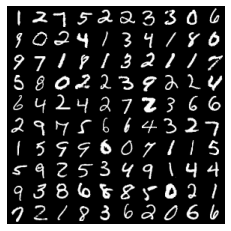
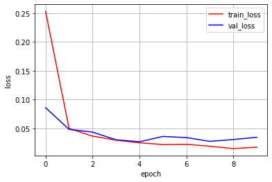
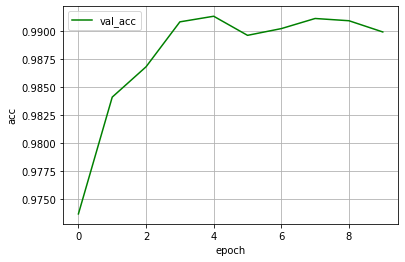

# MNISTでCNN

MNISTデータを使用してCNNをブロック単位で処理しモデルを作成し、保存したモデルを読み込んで予測を行います。<br>GPUモードでも動かせるようにします。<br>入力層は28 x 28 = 784ユニット、隠れ層が500ユニット、出力層が0-9の10クラスという構成。

## データセットの取得

データセットはデータセットのかたまりを表し、`DataLoder`にセットすることでミニバッチ単位でロードできるようになります。<br>MNISTはデータセットを継承したMNISTデータセットを扱うことができます。<br>transformsを使うといろいろなデータ前処理ができます。ここでは読み込んだ画像データ（PIL.Image.Image）をテンソルに変換する ToTensor() だけを指定。


```python
import torch
print(torch.__version__)
import torchvision
import torchvision.transforms as transforms

# デバイスモードの取得
device = torch.device('cuda' if torch.cuda.is_available() else 'cpu')
print(device)    # デバイスモードの確認

"""
  MNSTデータのダウンロード
"""
df_train = torchvision.datasets.MNIST(
    root='./data',                              # データ保存先
    train=True,                                # True あらかじめ訓練用とされたのデータを取得
    transform=transforms.ToTensor(),            # データに対してのテンソル変換を実施 
    download=True                              # rootの位置にデータを保存
)

df_test = torchvision.datasets.MNIST(
    root='./data',                              # データ保存先
    train=False,                               # True あらかじめ訓練用とされたのデータを取得
    transform=transforms.ToTensor(),            # データに対してのテンソル変換を実施
    download=True                              # rootの位置にデータを保存
)
# データ形式の確認
print('data.shape : ', len(df_train.data[0][0]), len(df_train.data[0]))

print('train_data : ', len(df_train))
print('test_data : ', len(df_test))

```

    1.5.0+cpu
    cpu
    data.shape :  28 28
    train_data :  60000
    test_data :  10000


## データローダーの作成


```python
from torch.utils.data import DataLoader, TensorDataset    # データ関連のユーティリティクラスのインポート

# 定数
BATCH_SIZE = 100        # バッチサイズ

train_loader = DataLoader(
    dataset=df_train,
    batch_size=BATCH_SIZE,
    shuffle=True
)

test_loader = DataLoader(
    dataset=df_test,
    batch_size=BATCH_SIZE,
    shuffle=False
)
# データ数の確認
print('train_data : ', len(train_loader))
print('test_data : ', len(test_loader))
```

    train_data :  600
    test_data :  100


データセットのlenはサンプル数を返し、DataLoaderのlenはミニバッチ数を返します。


```python
"""
データローダーから画像を表示
"""
# 1データだけ取得
image, label = iter(train_loader).next()

# データの確認
print(type(image))
print(type(label))
print(image.size())
print(label.size())

# 可視化
import numpy as np
import matplotlib.pyplot as plt
%matplotlib inline

def imshow(img):
    """
    テンソル型の画像データをNumpy化してデータ構造をチャネルラストに変更して表示
    
    Param: tensor
        img: 画像データ
    """
    # Numpy型に変換
    img = img.numpy()
    # データ構造をチャネルラストにし、画像表示できるように順番を変更
    img_permute = np.transpose(img, (1, 2, 0))
    plt.imshow(img_permute)
    
# 画像の枚数の次元をなくして(5, 5)の３次元のテンソルを抽出
img = torchvision.utils.make_grid(image, nrow=10, padding=1)
imshow(img)    # 可視化
plt.axis('off') # 座標軸の表示OFF
print(label[:10])
```

    <class 'torch.Tensor'>
    <class 'torch.Tensor'>
    torch.Size([100, 1, 28, 28])
    torch.Size([100])
    tensor([1, 2, 7, 5, 2, 2, 3, 3, 0, 6])





`DataLoder`から1バッチ分のデータを取り出すには`iter()`で囲み、`next()`を呼び出すことで可能です。

## ディープニューラルネットワークのモデル設計


```python
import torch.nn as nn
# 定数
INPUT_SIZE = 1        # 入力チャネル数（白黒画像なので、1を指定）
CONV2_CHANNELS = 16   # 出力チャネル数 16個のカーネルを作成（conv2の入力チャネルの数を一致させる必要があります[conv1の出力→活性化関数→プーリングを経てconv2の入力チャネルとして渡されます]）
INPUT_KERNELSIZE = 5  # 入力層のフィルター(カーネル) サイズ 5×5のサイズのカーネルを作成
PADDING_SIZE = 2      # パディングサイズ
OUTPUT_CHANNELS = 32  # 畳み込み層2の出力チャネル数
# 2×2のサイズでプーリングを行います(サイズ/2)
INPUT_POOLSIZE = (2, 2)    # プーリング層

FC_NEURONS = 7 * 7 * 32    # 隠れ層のニューロン数
OUTPUT_RESULTS = 10        # 出力層のニューロン数


# モデルの定義
class ConvolutionalNeuralNetwork(nn.Module):
    def __init__(self):
        # 継承したnn.Module親クラスを初期化
        super(ConvolutionalNeuralNetwork, self).__init__()
        
        # 層の定義
        self.layer1 = nn.Sequential(
            # 畳み込み層
            nn.Conv2d(
                INPUT_SIZE,           # 入力チャネル数
                CONV2_CHANNELS,       # 出力チャネル数
                kernel_size=INPUT_KERNELSIZE,      # 入力層のフィルター(カーネル) サイズ
                padding=PADDING_SIZE  # パディングサイズ
            ),
            nn.BatchNorm2d(CONV2_CHANNELS),  # 正則化
            nn.ReLU(),                       # 損失関数
            nn.MaxPool2d(INPUT_POOLSIZE),    # プーリング層（MaxPooling）
        )
        self.layer2 = nn.Sequential(
            # 畳み込み層
            nn.Conv2d(
                CONV2_CHANNELS,       # 入力チャネル数
                OUTPUT_CHANNELS,      # 出力チャネル数
                kernel_size=INPUT_KERNELSIZE,      # 入力層のフィルター(カーネル) サイズ
                padding=PADDING_SIZE  # パディングサイズ
            ),
            nn.BatchNorm2d(OUTPUT_CHANNELS), # 正則化
            nn.ReLU(),                       # 損失関数
            nn.MaxPool2d(INPUT_POOLSIZE),    # プーリング層（MaxPooling）
        )
        # 全結合層
        self.fc = nn.Linear(
            FC_NEURONS,       # 入力ユニット数
            OUTPUT_RESULTS    # 出力結果への出力ユニット数
        )
    def forward(self, x):
        # print('Input_size : ', x.size())    # 出力サイズの確認  debag
        x = self.layer1(x)
        # print('layer1_output_size : ', x.size())    # 出力サイズの確認  debag
        x = self.layer2(x)
        # print('layer2_output_size : ', x.size())    # 出力サイズの確認  debag
        x = x.view(x.size(0), -1)     # 畳み込み層の出力サイズを全結合層の入力ニューロン数に変換
        # print('fc_activation_output_size : ', x.size())    # 出力サイズの確認  debag
        x = self.fc(x)
        # print('Output_size : ', x.size())    # 出力サイズの確認  debag
        return x

# モデルのインスタンス化
model = ConvolutionalNeuralNetwork().to(device)
print(model)                      # モデルの概要を出力         
```

    ConvolutionalNeuralNetwork(
      (layer1): Sequential(
        (0): Conv2d(1, 16, kernel_size=(5, 5), stride=(1, 1), padding=(2, 2))
        (1): BatchNorm2d(16, eps=1e-05, momentum=0.1, affine=True, track_running_stats=True)
        (2): ReLU()
        (3): MaxPool2d(kernel_size=(2, 2), stride=(2, 2), padding=0, dilation=1, ceil_mode=False)
      )
      (layer2): Sequential(
        (0): Conv2d(16, 32, kernel_size=(5, 5), stride=(1, 1), padding=(2, 2))
        (1): BatchNorm2d(32, eps=1e-05, momentum=0.1, affine=True, track_running_stats=True)
        (2): ReLU()
        (3): MaxPool2d(kernel_size=(2, 2), stride=(2, 2), padding=0, dilation=1, ceil_mode=False)
      )
      (fc): Linear(in_features=1568, out_features=10, bias=True)
    )


- CNNはブロック単位で処理（Conv+BN+ReLU+Pooling）できるようにまとめて Sequential を使います
- Conv2d や BatchNorm2d はKerasと違って入力と出力のユニットサイズを省略できません。
- サイズを自分で計算するのが面倒ならば、モデルの途中結果サイズを print(out.size()) で出力します。


```python
# モデルの動作テスト
image, label = iter(train_loader).next()
print('before view : ', image.size())
image = image.to(device)
print()
output = model(image)    # テストの実行
print()
print('after view : ', output.size())
```

    before view :  torch.Size([100, 1, 28, 28])
    
    
    after view :  torch.Size([100, 10])


サイズの出力結果

before view :  torch.Size([100, 1, 28, 28])

Input_size :  torch.Size([100, 1, 28, 28])<br>layer1_output_size :  torch.Size([100, 16, 14, 14])<br>layer2_output_size :  torch.Size([100, 32, 7, 7])<br>fc_activation_output_size :  torch.Size([100, 1568])<br>Output_size :  torch.Size([100, 10])

after view :  torch.Size([100, 10])

## 層ごとの出力の算出

#### 畳み込み層とプーリング層の算出式+全結合層の入力

$
入力サイズ : [高さ, 幅]=[H, W]\\
出力サイズ : [高さ, 幅]=[O_h, O_w]\\
フィルタサイズのサイズ : [高さ, 幅]=[F_h, F_w]\\
パディングサイズ : P\\
ストライド : S\\
$
出力サイズ$O_h, O_w$は以下のように計算できます。
$$O_h=\frac{H+2P-F_h}{s}+1\\
O_w=\frac{W+2P-F_w}{s}+1$$


## 損失関数の定義<br>オプティマイザー（最適化用オブジェクト）の作成


```python
import torch.optim as optim    # 最適化モジュールのインポート

# 定数
LEARN_RATE = 0.01        # 学習率
# 変数
criterion = nn.CrossEntropyLoss()   # 損失関数：交差エントロピー 学習データの正解率を出力
optimizer = optim.Adam(
        model.parameters(),   # 最適化で更新する重みやバイアスのパラメータ
        lr=LEARN_RATE,        # 学習率
)
```

## 1回分の「訓練（学習）」と「評価」の処理


```python
def train_step(train_loder):
    """学習の実行
    訓練モードの設定
    フォワードプロパゲーションで出力結果の取得
    出力結果と正解ラベルから損失および勾配の計算
    勾配を使ってパラメーター（重みとバイアス）の更新
    
    Param:
      train_loder : 訓練データのデータローダー
    """
    # 学習モードの設定
    model.train()
    # 学習中の損失を格納する変数
    running_loss = 0
    # 1ミニバッチ分の「訓練」を実行
    for batch_idx, (images, labels) in enumerate(train_loader):
        # デバイス情報をデータに送る
        images = images.to(device)
        labels = labels.to(device)
        # フォワードプロパゲーションで出力結果を取得
        outputs = model(images)
        
        # 出力結果と正解ラベルから損失を計算し、勾配を計算
        optimizer.zero_grad()    # 勾配を0で初期化

        loss = criterion(outputs, labels)    # 誤差（出力結果と正解ラベルの差）から損失を取得
        running_loss += loss.item()          # 損失をpythonの値で追加
        loss.backward()                      # 逆伝播の処理として勾配を計算（自動微分）

        # 勾配を使ってパラメーター（重みとバイアス）を更新
        optimizer.step()                     # 最適化の実施
    # 損失の算出ミニバッチ数分の損失の合計をミニバッチ数で割る
    train_loss = running_loss / len(train_loader)
    return train_loss

def valid_step(test_loader):
    """評価（推論）検証
    評価モードの設定
    フォワードプロパゲーションで出力結果の取得
    出力結果と正解ラベルから損失の計算
    正解率の算出
    
    Param:
      test_loder : 評価データのデータローダー
    """
    # 評価モードに設定（dropoutなどの挙動が評価用になる）
    model.eval()
    
    
    running_loss = 0    # 検証中の損失を格納する変数
    correct = 0         # 検証の正解数を格納する変数
    total = 0           # 1ミニバッチ数を格納する変数
    
    with torch.no_grad():                # 勾配は計算しないモードに設定
        # 1ミニバッチ分の「検証」を実行
        for batch_idx, (images, labels) in enumerate(test_loader):
            # デバイス情報をデータに送る
            images = images.to(device)
            labels = labels.to(device)
            # フォワードプロパゲーションで出力結果を取得
            outputs = model(images)
            
            loss = criterion(outputs, labels)    # 誤差（出力結果と正解ラベルの差）から損失を取得
            running_loss += loss.item()          # 損失をpythonの値で追加
            _, predict = torch.max(outputs, 1)   # 予測した確率の最大値を予測結果として出力
            correct += (predict == labels).sum().item()  # 正解数を取得
            total += labels.size(0)              # 1ミニバッチ数の取得
            
    val_loss = running_loss / len(test_loader)
    val_acc = float(correct) / total
    
    return val_loss, val_acc
```


```python
# 定数
EPOCHS = 10        # エポック数

loss_list = []
val_loss_list = []
val_acc_list = []

for epoch in range(EPOCHS):
    loss = train_step(train_loader)
    val_loss, val_acc = valid_step(test_loader)

    # 損失や正解率などの情報を表示
    print(f'[Epoch {epoch+1:3d}/{EPOCHS:3d}]' \
          f' loss: {loss:.5f}' \
          f' val_loss: {val_loss:.5f}, val_acc: {val_acc:.5f}')

    # logging
    loss_list.append(loss)
    val_loss_list.append(val_loss)
    val_acc_list.append(val_acc)
```

    [Epoch   1/ 10] loss: 0.25320 val_loss: 0.08611, val_acc: 0.97370
    [Epoch   2/ 10] loss: 0.05018 val_loss: 0.04853, val_acc: 0.98410
    [Epoch   3/ 10] loss: 0.03677 val_loss: 0.04374, val_acc: 0.98680
    [Epoch   4/ 10] loss: 0.02978 val_loss: 0.03048, val_acc: 0.99080
    [Epoch   5/ 10] loss: 0.02524 val_loss: 0.02696, val_acc: 0.99130
    [Epoch   6/ 10] loss: 0.02221 val_loss: 0.03623, val_acc: 0.98960
    [Epoch   7/ 10] loss: 0.02265 val_loss: 0.03427, val_acc: 0.99020
    [Epoch   8/ 10] loss: 0.01925 val_loss: 0.02768, val_acc: 0.99110
    [Epoch   9/ 10] loss: 0.01516 val_loss: 0.03092, val_acc: 0.99090
    [Epoch  10/ 10] loss: 0.01762 val_loss: 0.03471, val_acc: 0.98990


## 損失値の推移グラフ描画


```python
import matplotlib.pyplot as plt
%matplotlib inline

# plot learning curve
plt.figure()
plt.plot(range(EPOCHS), loss_list, 'r-', label='train_loss')
plt.plot(range(EPOCHS), val_loss_list, 'b-', label='val_loss')
plt.legend(loc='best')
plt.xlabel('epoch')
plt.ylabel('loss')
plt.grid()

plt.figure()
plt.plot(range(EPOCHS), val_acc_list, 'g-', label='val_acc')
plt.legend(loc='best')
plt.xlabel('epoch')
plt.ylabel('acc')
plt.grid()
```








## 予測結果の出力


```python
# 1データだけ取得
image, label = iter(test_loader).next()

# 評価モードに設定（dropoutなどの挙動が評価用になる）
model.eval()

running_loss = 0    # 検証中の損失を格納する変数
correct = 0         # 検証の正解数を格納する変数
total = 0           # 1ミニバッチ数を格納する変数

with torch.no_grad():                # 勾配は計算しないモードに設定
    # 1ミニバッチ分の「検証」を実行
    # デバイス情報をデータに送る
    image = image.to(device)
    label = label.to(device)
    # フォワードプロパゲーションで出力結果を取得
    outputs = model(image)

    loss = criterion(outputs, label)    # 誤差（出力結果と正解ラベルの差）から損失を取得
    running_loss += loss.item()          # 損失をpythonの値で追加
    _, predict = torch.max(outputs, 1)   # 予測した確率の最大値を予測結果として出力
    # numpy化して予測結果を表示
    print(predict.numpy())
    
    correct += (predict == label).sum().item()  # 正解数を取得
    total += label.size(0)              # 1ミニバッチ数の取得

val_loss = running_loss / len(label)
val_acc = float(correct) / total

# 損失や正解率などの情報を表示
print(f' val_loss: {val_loss:.5f}, val_acc: {val_acc:.5f}')
```

    [7 2 1 0 4 1 4 9 5 9 0 6 9 0 1 5 9 7 3 4 9 6 6 5 4 0 7 4 0 1 3 1 3 4 7 2 7
     1 2 1 1 7 4 2 3 5 1 2 4 4 6 3 5 5 6 0 4 1 9 5 7 8 5 3 7 4 6 4 3 0 7 0 2 9
     1 7 3 2 9 7 7 6 2 7 8 4 7 3 6 1 3 6 9 3 1 4 1 7 6 9]
     val_loss: 0.00017, val_acc: 0.99000


## modelを保存する


```python
torch.save(model.state_dict(), 'MNIST_CNN_torch.pth')    # state_dictはモデルの構造だけ保存
```

## modelを読み込み再度予測を行う


```python
# モデルのパラメータのロード
param = torch.load('MNIST_CNN_torch.pth')
```

事前にモデルのインスタンス化が必要です。<br>（インスタンス化したモデルにロードしたパラメータを設定します）


```python
import torch.nn as nn
# 定数
INPUT_SIZE = 1        # 入力チャネル数（白黒画像なので、1を指定）
CONV2_CHANNELS = 16   # 出力チャネル数 16個のカーネルを作成（conv2の入力チャネルの数を一致させる必要があります[conv1の出力→活性化関数→プーリングを経てconv2の入力チャネルとして渡されます]）
INPUT_KERNELSIZE = 5  # 入力層のフィルター(カーネル) サイズ 5×5のサイズのカーネルを作成
PADDING_SIZE = 2      # パディングサイズ
OUTPUT_CHANNELS = 32  # 畳み込み層2の出力チャネル数
# 2×2のサイズでプーリングを行います(サイズ/2)
INPUT_POOLSIZE = (2, 2)    # プーリング層

FC_NEURONS = 7 * 7 * 32    # 隠れ層のニューロン数
OUTPUT_RESULTS = 10        # 出力層のニューロン数


# モデルの定義
class pre_ConvolutionalNeuralNetwork(nn.Module):
    def __init__(self):
        # 継承したnn.Module親クラスを初期化
        super(pre_ConvolutionalNeuralNetwork, self).__init__()
        
        # 層の定義
        self.layer1 = nn.Sequential(
            # 畳み込み層
            nn.Conv2d(
                INPUT_SIZE,           # 入力チャネル数
                CONV2_CHANNELS,       # 出力チャネル数
                kernel_size=INPUT_KERNELSIZE,      # 入力層のフィルター(カーネル) サイズ
                padding=PADDING_SIZE  # パディングサイズ
            ),
            nn.BatchNorm2d(CONV2_CHANNELS),  # 正則化
            nn.ReLU(),                       # 損失関数
            nn.MaxPool2d(INPUT_POOLSIZE),    # プーリング層（MaxPooling）
        )
        self.layer2 = nn.Sequential(
            # 畳み込み層
            nn.Conv2d(
                CONV2_CHANNELS,       # 入力チャネル数
                OUTPUT_CHANNELS,      # 出力チャネル数
                kernel_size=INPUT_KERNELSIZE,      # 入力層のフィルター(カーネル) サイズ
                padding=PADDING_SIZE  # パディングサイズ
            ),
            nn.BatchNorm2d(OUTPUT_CHANNELS), # 正則化
            nn.ReLU(),                       # 損失関数
            nn.MaxPool2d(INPUT_POOLSIZE),    # プーリング層（MaxPooling）
        )
        # 全結合層
        self.fc = nn.Linear(
            FC_NEURONS,       # 入力ユニット数
            OUTPUT_RESULTS    # 出力結果への出力ユニット数
        )
    def forward(self, x):
        # print('Input_size : ', x.size())    # 出力サイズの確認  debag
        x = self.layer1(x)
        # print('layer1_output_size : ', x.size())    # 出力サイズの確認  debag
        x = self.layer2(x)
        # print('layer2_output_size : ', x.size())    # 出力サイズの確認  debag
        x = x.view(x.size(0), -1)     # 畳み込み層の出力サイズを全結合層の入力ニューロン数に変換
        # print('fc_activation_output_size : ', x.size())    # 出力サイズの確認  debag
        x = self.fc(x)
        # print('Output_size : ', x.size())    # 出力サイズの確認  debag
        return x
```


```python
# モデルのインスタンス化
model = pre_ConvolutionalNeuralNetwork() #読み込む前にクラス宣言が必要
model.load_state_dict(param)
```


    <All keys matched successfully>


```python
# 1データだけ取得
image, label = iter(test_loader).next()

# 評価モードに設定（dropoutなどの挙動が評価用になる）
model.eval()

running_loss = 0    # 検証中の損失を格納する変数
correct = 0         # 検証の正解数を格納する変数
total = 0           # 1ミニバッチ数を格納する変数

with torch.no_grad():                # 勾配は計算しないモードに設定
    # 1ミニバッチ分の「検証」を実行
    # デバイス情報をデータに送る
    image = image.to(device)
    label = label.to(device)
    # フォワードプロパゲーションで出力結果を取得
    outputs = model(image)

    loss = criterion(outputs, label)    # 誤差（出力結果と正解ラベルの差）から損失を取得
    running_loss += loss.item()          # 損失をpythonの値で追加
    _, predict = torch.max(outputs, 1)   # 予測した確率の最大値を予測結果として出力
    # numpy化して予測結果を表示
    print(predict.numpy())
    
    correct += (predict == label).sum().item()  # 正解数を取得
    total += label.size(0)              # 1ミニバッチ数の取得

val_loss = running_loss / len(label)
val_acc = float(correct) / total

# 損失や正解率などの情報を表示
print(f' val_loss: {val_loss:.5f}, val_acc: {val_acc:.5f}')
```

    [7 2 1 0 4 1 4 9 5 9 0 6 9 0 1 5 9 7 3 4 9 6 6 5 4 0 7 4 0 1 3 1 3 4 7 2 7
     1 2 1 1 7 4 2 3 5 1 2 4 4 6 3 5 5 6 0 4 1 9 5 7 8 5 3 7 4 6 4 3 0 7 0 2 9
     1 7 3 2 9 7 7 6 2 7 8 4 7 3 6 1 3 6 9 3 1 4 1 7 6 9]
     val_loss: 0.00017, val_acc: 0.99000

