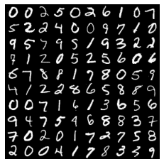
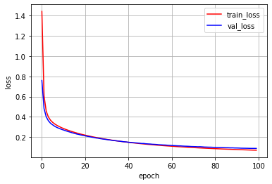
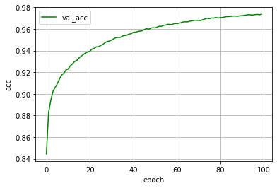

# MNISTでDNN

MNISTデータを使用して3層の分類モデルをDNNでモデルを作成し、<br>保存したモデルを読み込んで予測を行います。<br>[参考リンク：PyTorch (5) Multilayer Perceptron](http://aidiary.hatenablog.com/entry/20180204/1517705138)<br>入力層は28 x 28 = 784ユニット、隠れ層が500ユニット、出力層が0-9の10クラスという構成。

## データセットの取得

データセットはデータセットのかたまりを表し、`DataLoder`にセットすることでミニバッチ単位でロードできるようになります。<br>MNISTはデータセットを継承したMNISTデータセットを扱うことができます。<br>transformsを使うといろいろなデータ前処理ができます。ここでは読み込んだ画像データ（PIL.Image.Image）をテンソルに変換する ToTensor() だけを指定。


```python
import torch
print(torch.__version__)
import torchvision
import torchvision.transforms as transforms

"""
  MNSTデータのダウンロード
"""
df_train = torchvision.datasets.MNIST(
    root='./data',                              # データ保存先
    train=True,                                # True あらかじめ訓練用とされたのデータを取得
    transform=transforms.ToTensor(),            # データに対してのテンソル変換を実施 
    download=True                              # rootの位置にデータを保存
)

df_test = torchvision.datasets.MNIST(
    root='./data',                              # データ保存先
    train=False,                               # True あらかじめ訓練用とされたのデータを取得
    transform=transforms.ToTensor(),            # データに対してのテンソル変換を実施
    download=True                              # rootの位置にデータを保存
)
# データ形式の確認
print('data.shape : ', len(df_train.data[0][0]), len(df_train.data[0]))

print('train_data : ', len(df_train))
print('test_data : ', len(df_test))

```

    1.5.0+cpu
    data.shape :  28 28
    train_data :  60000
    test_data :  10000


## データローダーの作成


```python
from torch.utils.data import DataLoader, TensorDataset    # データ関連のユーティリティクラスのインポート

# 定数
BATCH_SIZE = 100        # バッチサイズ

train_loader = DataLoader(
    dataset=df_train,
    batch_size=BATCH_SIZE,
    shuffle=True
)

test_loader = DataLoader(
    dataset=df_test,
    batch_size=BATCH_SIZE,
    shuffle=False
)
# データ数の確認
print('train_data : ', len(train_loader))
print('test_data : ', len(test_loader))
```

    train_data :  600
    test_data :  100


データセットのlenはサンプル数を返し、DataLoaderのlenはミニバッチ数を返します。


```python
"""
データローダーから画像を表示
"""
# 1データだけ取得
image, label = iter(train_loader).next()

# データの確認
print(type(image))
print(type(label))
print(image.size())
print(label.size())

# 可視化
import numpy as np
import matplotlib.pyplot as plt
%matplotlib inline

def imshow(img):
    """
    テンソル型の画像データをNumpy化してデータ構造をチャネルラストに変更して表示
    
    Param: tensor
        img: 画像データ
    """
    # Numpy型に変換
    img = img.numpy()
    # データ構造をチャネルラストにし、画像表示できるように順番を変更
    img_permute = np.transpose(img, (1, 2, 0))
    plt.imshow(img_permute)
    
# 画像の枚数の次元をなくして(5, 5)の３次元のテンソルを抽出
img = torchvision.utils.make_grid(image, nrow=10, padding=1)
imshow(img)    # 可視化
plt.axis('off') # 座標軸の表示OFF
print(label[:10])
```

    <class 'torch.Tensor'>
    <class 'torch.Tensor'>
    torch.Size([100, 1, 28, 28])
    torch.Size([100])
    tensor([0, 0, 2, 5, 0, 2, 6, 1, 0, 7])





`DataLoder`から1バッチ分のデータを取り出すには`iter()`で囲み、`next()`を呼び出すことで可能です。

## ディープニューラルネットワークのモデル設計


```python
import torch.nn as nn
# 定数
INPUT_SIZE = 28 * 28  # 入力層のニューロン数
HIDDEN_SIZE = 500     # 隠れ層のニューロン数
NUM_CLASSES = 10      # 出力層のニューロン数

# モデルの定義
class NeuralNetwork(nn.Module):
    def __init__(self):
        # 継承したnn.Module親クラスを初期化
        super(NeuralNetwork, self).__init__()
        
        # 層の定義
        self.fc1 = nn.Linear(
            INPUT_SIZE,    # 入力層のユニット数
            HIDDEN_SIZE    # 次の層への出力ユニット数
        )
        # 活性化関数
        self.relu = nn.ReLU()
        self.fc2 = nn.Linear(
            HIDDEN_SIZE,   # 入力層のユニット数
            NUM_CLASSES    # 出力結果への出力ユニット数
        )
    def forward(self, x):
        # print('Input_size : ', x.size())    # 出力サイズの確認  debag
        x = self.fc1(x)
        # print('fc1_output_size : ', x.size())    # 出力サイズの確認  debag
        x = self.relu(x)
        # print('fc1_activation_output_size : ', x.size())    # 出力サイズの確認  debag
        x = self.fc2(x)
        # print('Output_size : ', x.size())    # 出力サイズの確認  debag
        return x

# モデルのインスタンス化
model = NeuralNetwork()
print(model)                      # モデルの概要を出力
```

    NeuralNetwork(
      (fc1): Linear(in_features=784, out_features=500, bias=True)
      (relu): ReLU()
      (fc2): Linear(in_features=500, out_features=10, bias=True)
    )


```python
# モデルの動作テスト
image, label = iter(train_loader).next()
print('before view : ', image.size())
print()
image = image.view(-1, 28 * 28)    # 入力層へのデータを100次元の1列に変換
print('after view : ', image.size())
print()
output = model(image)
print(output.size())
```

    before view :  torch.Size([100, 1, 28, 28])
    
    after view :  torch.Size([100, 784])
    
    torch.Size([100, 10])


## 損失関数の定義<br>オプティマイザー（最適化用オブジェクト）の作成


```python
import torch.optim as optim    # 最適化モジュールのインポート

# 定数
LEARN_RATE = 0.01        # 学習率
# 変数
criterion = nn.CrossEntropyLoss()   # 損失関数：交差エントロピー 学習データの正解率を出力
optimizer = optim.SGD(
        model.parameters(),   # 最適化で更新する重みやバイアスのパラメータ
        lr=LEARN_RATE,        # 学習率
)
```

## 1回分の「訓練（学習）」と「評価」の処理


```python
def train_step(train_loder):
    """学習の実行
    訓練モードの設定
    フォワードプロパゲーションで出力結果の取得
    出力結果と正解ラベルから損失および勾配の計算
    勾配を使ってパラメーター（重みとバイアス）の更新
    
    Param:
      train_loder : 訓練データのデータローダー
    """
    # 学習モードの設定
    model.train()
    # 学習中の損失を格納する変数
    running_loss = 0
    # 1ミニバッチ分の「訓練」を実行
    for batch_idx, (images, labels) in enumerate(train_loader):
        # 入力データを1列に変換
        images = images.view(-1, 28*28)
        # フォワードプロパゲーションで出力結果を取得
        outputs = model(images)
        
        # 出力結果と正解ラベルから損失を計算し、勾配を計算
        optimizer.zero_grad()    # 勾配を0で初期化

        loss = criterion(outputs, labels)    # 誤差（出力結果と正解ラベルの差）から損失を取得
        running_loss += loss.item()          # 損失をpythonの値で追加
        loss.backward()                      # 逆伝播の処理として勾配を計算（自動微分）

        # 勾配を使ってパラメーター（重みとバイアス）を更新
        optimizer.step()                     # 最適化の実施
    # 損失の算出ミニバッチ数分の損失の合計をミニバッチ数で割る
    train_loss = running_loss / len(train_loader)
    return train_loss

def valid_step(test_loader):
    """評価（推論）検証
    評価モードの設定
    フォワードプロパゲーションで出力結果の取得
    出力結果と正解ラベルから損失の計算
    正解率の算出
    
    Param:
      test_loder : 評価データのデータローダー
    """
    # 評価モードに設定（dropoutなどの挙動が評価用になる）
    model.eval()
    
    
    running_loss = 0    # 検証中の損失を格納する変数
    correct = 0         # 検証の正解数を格納する変数
    total = 0           # 1ミニバッチ数を格納する変数
    
    with torch.no_grad():                # 勾配は計算しないモードに設定
        # 1ミニバッチ分の「検証」を実行
        for batch_idx, (images, labels) in enumerate(test_loader):
            # 入力データを1列に変換
            images = images.view(-1, 28*28)
            # フォワードプロパゲーションで出力結果を取得
            outputs = model(images)
            
            loss = criterion(outputs, labels)    # 誤差（出力結果と正解ラベルの差）から損失を取得
            running_loss += loss.item()          # 損失をpythonの値で追加
            _, predict = torch.max(outputs, 1)   # 予測した確率の最大値を予測結果として出力
            correct += (predict == labels).sum().item()  # 正解数を取得
            total += labels.size(0)              # 1ミニバッチ数の取得
            
    val_loss = running_loss / len(test_loader)
    val_acc = float(correct) / total
    
    return val_loss, val_acc
```


```python
# 定数
EPOCHS = 100        # エポック数

loss_list = []
val_loss_list = []
val_acc_list = []

for epoch in range(EPOCHS):
    loss = train_step(train_loader)
    val_loss, val_acc = valid_step(test_loader)

    # 損失や正解率などの情報を表示
    print(f'[Epoch {epoch+1:3d}/{EPOCHS:3d}]' \
          f' loss: {loss:.5f}' \
          f' val_loss: {val_loss:.5f}, val_acc: {val_acc:.5f}')

    # logging
    loss_list.append(loss)
    val_loss_list.append(val_loss)
    val_acc_list.append(val_acc)
```

    [Epoch   1/100] loss: 1.44114 val_loss: 0.75958, val_acc: 0.84440
    [Epoch   2/100] loss: 0.60824 val_loss: 0.48265, val_acc: 0.88270
    [Epoch   3/100] loss: 0.45710 val_loss: 0.40121, val_acc: 0.89380
    [Epoch   4/100] loss: 0.39926 val_loss: 0.36224, val_acc: 0.90220
    [Epoch   5/100] loss: 0.36707 val_loss: 0.33712, val_acc: 0.90600
    [Epoch   6/100] loss: 0.34562 val_loss: 0.32114, val_acc: 0.90930
    [Epoch   7/100] loss: 0.32920 val_loss: 0.30631, val_acc: 0.91370
    [Epoch   8/100] loss: 0.31600 val_loss: 0.29531, val_acc: 0.91750
    [Epoch   9/100] loss: 0.30459 val_loss: 0.28630, val_acc: 0.91900
    [Epoch  10/100] loss: 0.29445 val_loss: 0.27765, val_acc: 0.92220
    [Epoch  11/100] loss: 0.28511 val_loss: 0.27054, val_acc: 0.92300
    [Epoch  12/100] loss: 0.27663 val_loss: 0.26309, val_acc: 0.92600
    [Epoch  13/100] loss: 0.26887 val_loss: 0.25616, val_acc: 0.92770
    [Epoch  14/100] loss: 0.26150 val_loss: 0.24988, val_acc: 0.93000
    [Epoch  15/100] loss: 0.25452 val_loss: 0.24322, val_acc: 0.93090
    [Epoch  16/100] loss: 0.24797 val_loss: 0.23750, val_acc: 0.93320
    [Epoch  17/100] loss: 0.24166 val_loss: 0.23131, val_acc: 0.93490
    [Epoch  18/100] loss: 0.23577 val_loss: 0.22697, val_acc: 0.93640
    [Epoch  19/100] loss: 0.23002 val_loss: 0.22156, val_acc: 0.93780
    [Epoch  20/100] loss: 0.22481 val_loss: 0.21761, val_acc: 0.93880
    [Epoch  21/100] loss: 0.21970 val_loss: 0.21299, val_acc: 0.93930
    [Epoch  22/100] loss: 0.21470 val_loss: 0.20818, val_acc: 0.94150
    [Epoch  23/100] loss: 0.20998 val_loss: 0.20475, val_acc: 0.94210
    [Epoch  24/100] loss: 0.20541 val_loss: 0.19981, val_acc: 0.94350
    [Epoch  25/100] loss: 0.20110 val_loss: 0.19651, val_acc: 0.94350
    [Epoch  26/100] loss: 0.19696 val_loss: 0.19209, val_acc: 0.94490
    [Epoch  27/100] loss: 0.19290 val_loss: 0.18971, val_acc: 0.94570
    [Epoch  28/100] loss: 0.18910 val_loss: 0.18536, val_acc: 0.94740
    [Epoch  29/100] loss: 0.18519 val_loss: 0.18181, val_acc: 0.94840
    [Epoch  30/100] loss: 0.18161 val_loss: 0.17905, val_acc: 0.94880
    [Epoch  31/100] loss: 0.17813 val_loss: 0.17616, val_acc: 0.94980
    [Epoch  32/100] loss: 0.17474 val_loss: 0.17358, val_acc: 0.95090
    [Epoch  33/100] loss: 0.17151 val_loss: 0.16989, val_acc: 0.95200
    [Epoch  34/100] loss: 0.16831 val_loss: 0.16657, val_acc: 0.95220
    [Epoch  35/100] loss: 0.16521 val_loss: 0.16475, val_acc: 0.95220
    [Epoch  36/100] loss: 0.16228 val_loss: 0.16210, val_acc: 0.95350
    [Epoch  37/100] loss: 0.15938 val_loss: 0.15960, val_acc: 0.95400
    [Epoch  38/100] loss: 0.15656 val_loss: 0.15697, val_acc: 0.95420
    [Epoch  39/100] loss: 0.15388 val_loss: 0.15446, val_acc: 0.95530
    [Epoch  40/100] loss: 0.15127 val_loss: 0.15279, val_acc: 0.95560
    [Epoch  41/100] loss: 0.14868 val_loss: 0.14972, val_acc: 0.95690
    [Epoch  42/100] loss: 0.14625 val_loss: 0.14817, val_acc: 0.95710
    [Epoch  43/100] loss: 0.14394 val_loss: 0.14558, val_acc: 0.95770
    [Epoch  44/100] loss: 0.14153 val_loss: 0.14428, val_acc: 0.95800
    [Epoch  45/100] loss: 0.13928 val_loss: 0.14258, val_acc: 0.95830
    [Epoch  46/100] loss: 0.13703 val_loss: 0.14013, val_acc: 0.95940
    [Epoch  47/100] loss: 0.13496 val_loss: 0.13769, val_acc: 0.96030
    [Epoch  48/100] loss: 0.13283 val_loss: 0.13762, val_acc: 0.95980
    [Epoch  49/100] loss: 0.13081 val_loss: 0.13491, val_acc: 0.96070
    [Epoch  50/100] loss: 0.12887 val_loss: 0.13327, val_acc: 0.96130
    [Epoch  51/100] loss: 0.12693 val_loss: 0.13227, val_acc: 0.96100
    [Epoch  52/100] loss: 0.12509 val_loss: 0.13001, val_acc: 0.96180
    [Epoch  53/100] loss: 0.12337 val_loss: 0.12905, val_acc: 0.96260
    [Epoch  54/100] loss: 0.12151 val_loss: 0.12769, val_acc: 0.96250
    [Epoch  55/100] loss: 0.11972 val_loss: 0.12540, val_acc: 0.96340
    [Epoch  56/100] loss: 0.11806 val_loss: 0.12432, val_acc: 0.96370
    [Epoch  57/100] loss: 0.11635 val_loss: 0.12295, val_acc: 0.96440
    [Epoch  58/100] loss: 0.11482 val_loss: 0.12226, val_acc: 0.96420
    [Epoch  59/100] loss: 0.11326 val_loss: 0.12058, val_acc: 0.96420
    [Epoch  60/100] loss: 0.11173 val_loss: 0.11911, val_acc: 0.96540
    [Epoch  61/100] loss: 0.11022 val_loss: 0.11782, val_acc: 0.96500
    [Epoch  62/100] loss: 0.10879 val_loss: 0.11672, val_acc: 0.96530
    [Epoch  63/100] loss: 0.10730 val_loss: 0.11550, val_acc: 0.96590
    [Epoch  64/100] loss: 0.10598 val_loss: 0.11412, val_acc: 0.96660
    [Epoch  65/100] loss: 0.10463 val_loss: 0.11373, val_acc: 0.96670
    [Epoch  66/100] loss: 0.10326 val_loss: 0.11209, val_acc: 0.96660
    [Epoch  67/100] loss: 0.10203 val_loss: 0.11098, val_acc: 0.96730
    [Epoch  68/100] loss: 0.10062 val_loss: 0.11033, val_acc: 0.96750
    [Epoch  69/100] loss: 0.09944 val_loss: 0.10930, val_acc: 0.96800
    [Epoch  70/100] loss: 0.09825 val_loss: 0.10780, val_acc: 0.96810
    [Epoch  71/100] loss: 0.09704 val_loss: 0.10721, val_acc: 0.96800
    [Epoch  72/100] loss: 0.09585 val_loss: 0.10666, val_acc: 0.96780
    [Epoch  73/100] loss: 0.09467 val_loss: 0.10552, val_acc: 0.96870
    [Epoch  74/100] loss: 0.09355 val_loss: 0.10603, val_acc: 0.96930
    [Epoch  75/100] loss: 0.09248 val_loss: 0.10456, val_acc: 0.97000
    [Epoch  76/100] loss: 0.09146 val_loss: 0.10261, val_acc: 0.96960
    [Epoch  77/100] loss: 0.09039 val_loss: 0.10209, val_acc: 0.97020
    [Epoch  78/100] loss: 0.08941 val_loss: 0.10128, val_acc: 0.97010
    [Epoch  79/100] loss: 0.08833 val_loss: 0.10109, val_acc: 0.97070
    [Epoch  80/100] loss: 0.08736 val_loss: 0.10002, val_acc: 0.97020
    [Epoch  81/100] loss: 0.08638 val_loss: 0.09864, val_acc: 0.97050
    [Epoch  82/100] loss: 0.08542 val_loss: 0.09811, val_acc: 0.97070
    [Epoch  83/100] loss: 0.08449 val_loss: 0.09743, val_acc: 0.97110
    [Epoch  84/100] loss: 0.08352 val_loss: 0.09720, val_acc: 0.97150
    [Epoch  85/100] loss: 0.08269 val_loss: 0.09623, val_acc: 0.97150
    [Epoch  86/100] loss: 0.08180 val_loss: 0.09563, val_acc: 0.97180
    [Epoch  87/100] loss: 0.08094 val_loss: 0.09548, val_acc: 0.97200
    [Epoch  88/100] loss: 0.08006 val_loss: 0.09437, val_acc: 0.97200
    [Epoch  89/100] loss: 0.07925 val_loss: 0.09444, val_acc: 0.97180
    [Epoch  90/100] loss: 0.07840 val_loss: 0.09328, val_acc: 0.97220
    [Epoch  91/100] loss: 0.07756 val_loss: 0.09309, val_acc: 0.97230
    [Epoch  92/100] loss: 0.07687 val_loss: 0.09233, val_acc: 0.97260
    [Epoch  93/100] loss: 0.07602 val_loss: 0.09119, val_acc: 0.97290
    [Epoch  94/100] loss: 0.07529 val_loss: 0.09080, val_acc: 0.97330
    [Epoch  95/100] loss: 0.07454 val_loss: 0.09050, val_acc: 0.97310
    [Epoch  96/100] loss: 0.07377 val_loss: 0.09012, val_acc: 0.97290
    [Epoch  97/100] loss: 0.07304 val_loss: 0.08932, val_acc: 0.97330
    [Epoch  98/100] loss: 0.07234 val_loss: 0.08916, val_acc: 0.97350
    [Epoch  99/100] loss: 0.07161 val_loss: 0.08919, val_acc: 0.97320
    [Epoch 100/100] loss: 0.07095 val_loss: 0.08882, val_acc: 0.97360


## 損失値の推移グラフ描画


```python
import matplotlib.pyplot as plt
%matplotlib inline

# plot learning curve
plt.figure()
plt.plot(range(EPOCHS), loss_list, 'r-', label='train_loss')
plt.plot(range(EPOCHS), val_loss_list, 'b-', label='val_loss')
plt.legend(loc='best')
plt.xlabel('epoch')
plt.ylabel('loss')
plt.grid()

plt.figure()
plt.plot(range(EPOCHS), val_acc_list, 'g-', label='val_acc')
plt.legend(loc='best')
plt.xlabel('epoch')
plt.ylabel('acc')
plt.grid()
```








## 予測結果の出力


```python
# 1データだけ取得
image, label = iter(test_loader).next()

# 評価モードに設定（dropoutなどの挙動が評価用になる）
model.eval()


running_loss = 0    # 検証中の損失を格納する変数
correct = 0         # 検証の正解数を格納する変数
total = 0           # 1ミニバッチ数を格納する変数

with torch.no_grad():                # 勾配は計算しないモードに設定
    # 1ミニバッチ分の「検証」を実行
    # 入力データを1列に変換
    image = image.view(-1, 28*28)
    # フォワードプロパゲーションで出力結果を取得
    outputs = model(image)

    loss = criterion(outputs, label)    # 誤差（出力結果と正解ラベルの差）から損失を取得
    running_loss += loss.item()          # 損失をpythonの値で追加
    _, predict = torch.max(outputs, 1)   # 予測した確率の最大値を予測結果として出力
    # numpy化して予測結果を表示
    print(predict.numpy())
    
    correct += (predict == label).sum().item()  # 正解数を取得
    total += label.size(0)              # 1ミニバッチ数の取得

val_loss = running_loss / len(label)
val_acc = float(correct) / total

# 損失や正解率などの情報を表示
print(f' val_loss: {val_loss:.5f}, val_acc: {val_acc:.5f}')
```

    [7 2 1 0 4 1 4 9 6 9 0 6 9 0 1 5 9 7 3 4 9 6 6 5 4 0 7 4 0 1 3 1 3 4 7 2 7
     1 2 1 1 7 4 2 3 5 1 2 4 4 6 3 5 5 6 0 4 1 9 5 7 8 9 3 7 4 6 4 3 0 7 0 2 9
     1 7 3 2 9 7 7 6 2 7 8 4 7 3 6 1 3 6 9 3 1 4 1 7 6 9]
     val_loss: 0.00039, val_acc: 0.99000


## modelを保存する


```python
torch.save(model.state_dict(), 'MNIST_torch.pth')    # state_dictはモデルの構造だけ保存
```

## modelを読み込み再度予測を行う


```python
# モデルのパラメータのロード
param = torch.load('MNIST_torch.pth')
```

事前にモデルのインスタンス化が必要です。<br>（インスタンス化したモデルにロードしたパラメータを設定します）


```python
import torch.nn as nn
# 定数
INPUT_SIZE = 28 * 28  # 入力層のニューロン数
HIDDEN_SIZE = 500     # 隠れ層のニューロン数
NUM_CLASSES = 10      # 出力層のニューロン数

# モデルの定義
class pre_NeuralNetwork(nn.Module):
    def __init__(self):
        # 継承したnn.Module親クラスを初期化
        super(pre_NeuralNetwork, self).__init__()
        
        # 層の定義
        self.fc1 = nn.Linear(
            INPUT_SIZE,    # 入力層のユニット数
            HIDDEN_SIZE    # 次の層への出力ユニット数
        )
        # 活性化関数
        self.relu = nn.ReLU()
        self.fc2 = nn.Linear(
            HIDDEN_SIZE,   # 入力層のユニット数
            NUM_CLASSES    # 出力結果への出力ユニット数
        )
    def forward(self, x):
        # print('Input_size : ', x.size())    # 出力サイズの確認  debag
        x = self.fc1(x)
        # print('fc1_output_size : ', x.size())    # 出力サイズの確認  debag
        x = self.relu(x)
        # print('fc1_activation_output_size : ', x.size())    # 出力サイズの確認  debag
        x = self.fc2(x)
        # print('Output_size : ', x.size())    # 出力サイズの確認  debag
        return x

# モデルのインスタンス化
model = NeuralNetwork()
print(model)                      # モデルの概要を出力         
```

    NeuralNetwork(
      (fc1): Linear(in_features=784, out_features=500, bias=True)
      (relu): ReLU()
      (fc2): Linear(in_features=500, out_features=10, bias=True)
    )


```python
# モデルのインスタンス化
model = pre_NeuralNetwork() #読み込む前にクラス宣言が必要
model.load_state_dict(param)
```


    <All keys matched successfully>


```python
# 1データだけ取得
image, label = iter(test_loader).next()

# 評価モードに設定（dropoutなどの挙動が評価用になる）
model.eval()


running_loss = 0    # 検証中の損失を格納する変数
correct = 0         # 検証の正解数を格納する変数
total = 0           # 1ミニバッチ数を格納する変数

with torch.no_grad():                # 勾配は計算しないモードに設定
    # 1ミニバッチ分の「検証」を実行
    # 入力データを1列に変換
    image = image.view(-1, 28*28)
    # フォワードプロパゲーションで出力結果を取得
    outputs = model(image)

    loss = criterion(outputs, label)    # 誤差（出力結果と正解ラベルの差）から損失を取得
    running_loss += loss.item()          # 損失をpythonの値で追加
    _, predict = torch.max(outputs, 1)   # 予測した確率の最大値を予測結果として出力
    # numpy化して予測結果を表示
    print(predict.numpy())
    
    correct += (predict == label).sum().item()  # 正解数を取得
    total += label.size(0)              # 1ミニバッチ数の取得

val_loss = running_loss / len(label)
val_acc = float(correct) / total

# 損失や正解率などの情報を表示
print(f' val_loss: {val_loss:.5f}, val_acc: {val_acc:.5f}')
```

    [7 2 1 0 4 1 4 9 6 9 0 6 9 0 1 5 9 7 3 4 9 6 6 5 4 0 7 4 0 1 3 1 3 4 7 2 7
     1 2 1 1 7 4 2 3 5 1 2 4 4 6 3 5 5 6 0 4 1 9 5 7 8 9 3 7 4 6 4 3 0 7 0 2 9
     1 7 3 2 9 7 7 6 2 7 8 4 7 3 6 1 3 6 9 3 1 4 1 7 6 9]
     val_loss: 0.00039, val_acc: 0.99000


