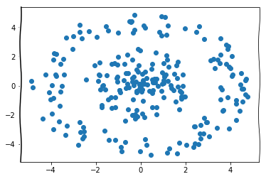
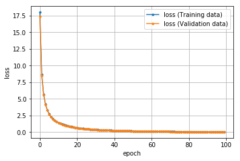

# PyTorchによるディープラーニング実装手順の基本（分類）

[Playground](https://deepinsider.github.io/playground/#activation=tanh&activspacer=false&loss=mse&batchSize=10&batchFull=false&dataset=gauss&regDataset=reg-plane&learningRate=0.03&regularizationRate=0&noise=0&networkShape=&seed=0.17900&showTrainData=true&showValidationData=false&showTestData=true&discretize=false&percTrainData=50&x=true&y=true&xTimesY=false&xSquared=false&ySquared=false&sinX=false&sinY=false&problem=classification&initOrigin=false&hideText=true&xSquared_hide=true&ySquared_hide=true&xTimesY_hide=true&sinX_hide=true&sinY_hide=true)で使用できる「座標点（横のX軸が-6.0～6.0、縦のY軸も-6.0～6.0の数値を取る、2次元の座標系にたくさんプロット（＝点描画）した全ての点）」データを生成するライブラリ「playground-data」で作成したデータから「1」か「-1」に分類する4層のディープニューラルネットワークを実装します。

## この項の大まかな流れ

1. `class NeuralNetwork(nn.Module)`:でニューラルネットワークのクラスを定義する
2. `model = NeuralNetwork()`でモデルをインスタンス化する
3. `y_pred = model(X_data)`で「入力データ」→「モデル」→「出力の予測結果」の推論を行う
4. `criterion = nn.MSELoss(); loss = criterion(y_pred, y_true)`で、損失を計算する
5. `loss.backward()`で、バックプロパゲーションを行う

特に、
- 訓練／最適化
- 評価／精度検証

を確認します

### 全体のコード(データの取得と確認以外)

```python
import torch
import torch.nn as nn
from torch.utils.data import DataLoader, TensorDataset    # データ関連のユーティリティクラスのインポート
import torch.optim as optim    # 最適化モジュールのインポート

"""
  データをテンソルに変換する
"""
# NumPy多次元配列からデータ型floatでテンソルに変換する
t_X_train = torch.from_numpy(X_train).float()
t_y_train = torch.from_numpy(y_train).float()
t_X_valid = torch.from_numpy(X_valid).float()
t_y_valid = torch.from_numpy(y_valid).float()

# 変換後のデータの確認
print(t_X_train[:5])
print(t_X_train.type)
"""
  データローダー（loader）の作成
"""
# 定数（学習方法の設計時）
BATCH_SIZE = 15        # バッチサイズ：15

# データセット（dataset）の作成 入力データ（X）と教師ラベル（y）をデータセットにまとめる
dt_train = TensorDataset(t_X_train, t_y_train)    # 訓練データ
dt_valid = TensorDataset(t_X_valid, t_y_valid)    # 評価データ精度検証

# データローダー（loader）の作成 ミニバッチを扱うため、データローダー（loader）を作成する
loader_train = DataLoader(dt_train, batch_size=BATCH_SIZE, shuffle=True)
loader_valid = DataLoader(dt_valid, batch_size=BATCH_SIZE)

"""
  予測結果を「1」か「-1」に分類するための「出力の離散化」
"""
# 離散化を行う単なる関数
def discretize(proba):
    '''実数の確率値を2クラス分類値に分ける
    実数の確率値を「1」か「-1」の2クラス分類値に離散化する。
    閾値は「0.0以上」か「未満」か。データ型は「torch.float」を想定。
    
    Param:
        proba: クラス分け対象の確率値
  
    Examples:
        proba = torch.tensor([-0.5, 0.0, 0.5], dtype=torch.float)
        binary = discretize(proba)
    '''
    threshold = torch.Tensor([0.0])                # 閾値の作成
    discretized = (proba >= threshold).float()     # 閾値未満で0、以上で1に変換
    return discretized * 2 - 1.0                  # 2倍して-1.0することで、0／1を-1.0／1.0にスケール変換

# discretize関数をモデルで簡単に使用できるようにするため、
# PyTorchの「torch.nn.Module」を継承したクラスラッパーも作成
class Discretize(nn.Module):
    '''実数の確率値を「1」か「-1」の2クラス分類値に離散化する。
    閾値は「0.0以上」か「未満」か。データ型は「torch.float」を想定。
  
    Examples:
        d = Discretize()
        proba = torch.tensor([-0.5, 0.0, 0.5], dtype=torch.float)
        binary = d(proba)
    '''        
    def __init__(self):
        super().__init__()

    # forward()メソッドは、基本クラスtorch.nn.Moduleの__call__メソッドからも呼び出されるため、
    # Discretizeオブジェクトを関数のように使える（d(proba)）
    def forward(self, proba):
        return discretize(proba)                  # 上記の関数を呼び出す

# 関数の利用を評価
proba = torch.tensor([-0.5, 0.0, 0.5], dtype=torch.float)  # 確率値の例
binary = discretize(proba)                         # 2クラス分類（binary classification）値に離散化

"""
  ディープニューラルネットワークのモデル設計
"""
# 定数
INPUT_FEATURES = 2        # 入力層のニューロン数
LAYER1_NEURONS = 3        # 隠れ層1のニューロン数
LAYER2_NEURONS = 3        # 隠れ層2のニューロン数
OUTPUT_RESULTS = 1        # 出力層のニューロン数

# 変数 活性化関数
activation1 = torch.nn.Tanh()    # 活性化関数（隠れ層）tanh関数    変更可
activation2 = torch.nn.Sigmoid() # 活性化関数（隠れ層）sigmoid関数 変更可
acti_out = torch.nn.Tanh()       # 活性化関数（出力層）tanh関数    変更不可

# モデルの定義
class NeuralNetwork(nn.Module):
    def __init__(self):
        super(NeuralNetwork, self).__init__()
        
        """層の定義
        """
        # 隠れ層1
        self.layer1 = nn.Linear(
            INPUT_FEATURES,      # 入力層のユニット数
            LAYER1_NEURONS       # 次の層への出力ユニット数
        )
        # 隠れ層2
        self.layer2 = nn.Linear(
            LAYER1_NEURONS,      # 入力ユニット数
            LAYER2_NEURONS       # 次の層への出力ユニット数
        )
        # 出力層
        self.layer_out = nn.Linear(
            LAYER2_NEURONS,      # 入力ユニット数
            OUTPUT_RESULTS       # 出力結果への出力ユニット数
        )
        
    def forward(self, x):
        """フォワードパスの定義
        """
        # 出力＝活性化関数（第n層（入力））の形式
        x = activation1(self.layer1(x))    # 活性化関数は変数として定義
        x = activation2(self.layer2(x))    # 活性化関数は変数として定義
        x = acti_out(self.layer_out(x))    # 活性化関数はtanhで固定
        return x

# モデルのインスタンス化
model = NeuralNetwork()
print(model)                      # モデルの概要を出力        
"""
  オプティマイザー（最適化用オブジェクト）の作成
"""
# 定数
LEARN_RATE = 0.03        # 学習率
REGULAR =  0.03          # 正則化率

# オプティマイザーの作成（パラメータと学習率も作成）
optimizer = optim.SGD(    # 最適化アルゴリズムに「SGD」を選択
    model.parameters(),   # 最適化で更新する重みやバイアスのパラメータ
    lr=LEARN_RATE,        # 学習率
    weight_decay=REGULAR  # L2正則化（不要なら省略）
)
"""
  損失関数の定義
"""
# 変数
criterion = nn.MSELoss()   # 損失関数：平均二乗和誤差
"""
  1回分の「訓練（学習）」と「評価」の処理
"""
def train_step(train_X, train_y):
    """学習の実行
    訓練モードの設定
    フォワードプロパゲーションで出力結果の取得
    出力結果と正解ラベルから損失および勾配の計算
    勾配を使ってパラメーター（重みとバイアス）の更新
    正解率の算出
    
    Param:
      train_X: 入力データ
      train_y: 正解ラベル
    """
    # 学習モードに設定
    model.train()

    # フォワードプロパゲーションで出力結果を取得
    pred_y = model(train_X)    # フォワードプロパゲーションの結果を取得
    
    # 出力結果と正解ラベルから損失を計算し、勾配を計算
    optimizer.zero_grad()                # 勾配を0で初期化
    loss = criterion(pred_y, train_y)    # 誤差（出力結果と正解ラベルの差）から損失を取得
    loss.backward()                      # 逆伝播の処理として勾配を計算（自動微分）
    
    # 勾配を使ってパラメーター（重みとバイアス）を更新
    optimizer.step()                     # 最適化の実施
    
    # 正解数の算出
    with torch.no_grad():                # 勾配は計算しないモードに設定
        disc_y = discretize(pred_y)      # 確率値から-1 or 1に学習結果を変換
        acc = (disc_y == train_y).sum()  # 正解数を取得
    
    # 損失と正解数をタプルで返す
    return (loss.item(), acc.item())     # item()でpythonの数値に変換

def valid_step(valid_X, valid_y):
    """評価（推論）検証
    評価モードの設定
    フォワードプロパゲーションで出力結果の取得
    出力結果と正解ラベルから損失の計算
    正解率の算出
    
    Param:
      valid_X: 入力データ
      valid_y: 正解ラベル
    """
    # 評価モードに設定（dropoutなどの挙動が評価用になる）
    model.eval()

    # フォワードプロパゲーションで出力結果を取得
    pred_y = model(valid_X)    # フォワードプロパゲーションの結果を取得
    
    # 出力結果と正解ラベルから損失を計算
    loss = criterion(pred_y, valid_y)    # 誤差（出力結果と正解ラベルの差）から損失を取得
    # 評価時は勾配を計算しない
    
    # 正解数の算出
    with torch.no_grad():                # 勾配は計算しないモードに設定
        disc_y = discretize(pred_y)      # 確率値から-1 or 1に学習結果を変換
        acc = (disc_y == valid_y).sum()  # 正解数を取得
    
    # 損失と正解数をタプルで返す
    return (loss.item(), acc.item())     # item()でpythonの数値に変換
"""
 「学習」と「評価」をバッチサイズ単位でエポック回繰り返す
"""
def init_parameters(layer):
    """パラメータ（重みとバイアス）の初期化
    引数の層が全結合層の時パラメータを初期化する
    
    Param:
      layer: 層情報
    """
    if type(layer) == nn.Linear:
        nn.init.xavier_uniform_(layer.weight)    # 重みを「一様分布のランダム値」で初期化
        layer.bias.data.fill_(0.0)               # バイアスを「0」で初期化


model.apply(init_parameters)        # 学習の前にパラメーター初期化

# 定数
EPOCHS = 100        # エポック数

# 変数　学習用と評価用の平均変数
avg_loss = 0.0           # 訓練用の平均損失値
avg_acc = 0.0            # 訓練用の平均正解率

avg_val_loss = 0.0       # 評価用の平均損失値
avg_val_acc = 0.0        # 評価用の平均正解率

# 損失の履歴を保存するための変数
train_hist = []
valid_hist = []


for epoch in range(EPOCHS):
    # forループ内で使う変数と、エポックごとの値リセット
    total_loss = 0.0     # 訓練時における累計損失値
    total_acc = 0.0      # 訓練時における累計正解数
    
    total_val_loss = 0.0 # 評価時における累計損失値
    total_val_acc = 0.0  # 評価時における累計正解数
    
    total_train = 0      # 訓練時における累計データ数
    total_valid = 0      # 評価時における累計データ数

    for train_X, train_y in loader_train:
        """
        1ミニバッチ分の「訓練」を実行
        """
        loss, acc = train_step(train_X, train_y)

        # 取得した損失値と正解率を累計値側に足していく
        total_loss += loss          # 訓練用の累計損失値
        total_acc += acc            # 訓練用の累計正解数
        total_train += len(train_y) # 訓練データの累計数
            
    for valid_X, valid_y in loader_valid:
        """
        1ミニバッチ分の「評価（精度検証）」を実行
        """
        val_loss, val_acc = valid_step(valid_X, valid_y)

        # 取得した損失値と正解率を累計値側に足す
        total_val_loss += val_loss  # 評価用の累計損失値
        total_val_acc += val_acc    # 評価用の累計正解数
        total_valid += len(valid_y) # 訓練データの累計数
        
    # ミニバッチ単位で累計してきた損失値や正解率の平均を取る
    n = epoch + 1                             # 処理済みのエポック数
    avg_loss = total_loss / n                 # 訓練用の平均損失値
    avg_acc = total_acc / total_train         # 訓練用の平均正解率
    avg_val_loss = total_val_loss / n         # 訓練用の平均損失値
    avg_val_acc = total_val_acc / total_valid # 訓練用の平均正解率

    # グラフ描画のために損失の履歴を保存する
    train_hist.append(avg_loss)
    valid_hist.append(avg_val_loss)

    # 損失や正解率などの情報を表示
    print(f'[Epoch {epoch+1:3d}/{EPOCHS:3d}]' \
          f' loss: {avg_loss:.5f}, acc: {avg_acc:.5f}' \
          f' val_loss: {avg_val_loss:.5f}, val_acc: {avg_val_acc:.5f}')

print('Finished Training')
print(model.state_dict())  # 学習後のパラメーターの情報を表示

# 学習結果（損失）のグラフを描画
epochs = len(train_hist)
plt.plot(range(epochs), train_hist, marker='.', label='loss (Training data)')
plt.plot(range(epochs), valid_hist, marker='.', label='loss (Validation data)')
plt.legend(loc='best')
plt.grid()
plt.xlabel('epoch')
plt.ylabel('loss')
plt.show()
```


## データセットとデータローダー

### 座標点データの生成

データは、シンプルな座標点データを生成して使います。
モデルへの入力データ`X`は、

- 座標（横のX軸上の値、縦のY軸上の値）

教師ラベル`y`は、

- -1.0＝オレンジ色
- 1.0＝青色

で構成されます


```python
# 座標点データを生成するライブラリのインストール
!pip install playground-data
```

    Collecting playground-data
    Requirement already satisfied: matplotlib in c:\users\anaconda3\lib\site-packages (from playground-data) (3.0.1)
    Requirement already satisfied: numpy in c:\users\anaconda3\lib\site-packages (from playground-data) (1.16.2)
    Requirement already satisfied: kiwisolver>=1.0.1 in c:\users\anaconda3\lib\site-packages (from matplotlib->playground-data) (1.0.1)
    Requirement already satisfied: python-dateutil>=2.1 in c:\users\anaconda3\lib\site-packages (from matplotlib->playground-data) (2.8.0)
    Requirement already satisfied: pyparsing!=2.0.4,!=2.1.2,!=2.1.6,>=2.0.1 in c:\users\anaconda3\lib\site-packages (from matplotlib->playground-data) (2.3.1)
    Requirement already satisfied: cycler>=0.10 in c:\users\anaconda3\lib\site-packages (from matplotlib->playground-data) (0.10.0)
    Requirement already satisfied: setuptools in c:\users\anaconda3\lib\site-packages (from kiwisolver>=1.0.1->matplotlib->playground-data) (40.8.0)
    Requirement already satisfied: six>=1.5 in c:\users\anaconda3\lib\site-packages (from python-dateutil>=2.1->matplotlib->playground-data) (1.12.0)
    Installing collected packages: playground-data
    Successfully installed playground-data-1.1.0
    


```python
# playground-dataライブラリのplygdataパッケージを「pg」という別名でインポート
import plygdata as pg

# 設定値を定数として定義
PROBLEM_DATA_TYPE = pg.DatasetType.ClassifyCircleData # 問題種別：「分類（Classification）」、データ種別：「円（CircleData）」を選択
TRAINING_DATA_RATIO = 0.5  # データの何％を訓練【Training】用に？ (残りは精度検証【Validation】用) ： 50％
DATA_NOISE = 0.0           # ノイズ： 0％

# 定義済みの定数を引数に指定して、データを生成する
data_list = pg.generate_data(PROBLEM_DATA_TYPE, DATA_NOISE)

# データを「訓練用」と「精度検証用」を指定の比率で分割し、さらにそれぞれを「データ（X）」と「教師ラベル（y）」に分ける
X_train, y_train, X_valid, y_valid = pg.split_data(data_list, training_size=TRAINING_DATA_RATIO)

# データ分割後の各変数の内容例として、それぞれ5件ずつ出力
print('X_train:'); print(X_train[:5])
print('y_train:'); print(y_train[:5])
print('X_valid:'); print(X_valid[:5])
print('y_valid:'); print(y_valid[:5])
```

    X_train:
    [[-0.22330413  0.26934817]
     [-3.87298221  2.21596921]
     [-1.74392514 -1.50620817]
     [ 1.65701607  1.63696073]
     [ 3.94879393 -2.93539146]]
    y_train:
    [[ 1.]
     [-1.]
     [ 1.]
     [ 1.]
     [-1.]]
    X_valid:
    [[ 1.66987832  0.52773201]
     [ 0.17453216 -1.71544622]
     [-3.58304239 -2.81798526]
     [ 0.3537728  -0.98724294]
     [ 4.32779556  0.79616158]]
    y_valid:
    [[ 1.]
     [ 1.]
     [-1.]
     [ 1.]
     [-1.]]
    


```python
# 入力データの可視化
import matplotlib.pyplot as plt
%matplotlib inline
plt.xkcd()

# X座標（横のX軸上の値、縦のY軸上の値）
plt.scatter(X_train[:, 0], X_train[:, 1])
```


    <matplotlib.collections.PathCollection at 0x1f080ad03c8>





### データをテンソルに変換する

データをPyTorchで使用するためにはテンソルに変換する必要があります。


```python
import torch

print(torch.__version__)
```

    1.5.0+cpu
    


```python
import torch

# NumPy多次元配列からデータ型floatでテンソルに変換する
t_X_train = torch.from_numpy(X_train).float()
t_y_train = torch.from_numpy(y_train).float()
t_X_valid = torch.from_numpy(X_valid).float()
t_y_valid = torch.from_numpy(y_valid).float()

# 変換後のデータの確認
print(t_X_train[:5])
print(t_X_train.type)
```

    tensor([[-0.2233,  0.2693],
            [-3.8730,  2.2160],
            [-1.7439, -1.5062],
            [ 1.6570,  1.6370],
            [ 3.9488, -2.9354]])
    <built-in method type of Tensor object at 0x000001F08242E510>
    

### データローダーの作成

PyTorchには、**ミニバッチ学習** を簡単扱うための`DataLoader`クラスが用意されています。
このクラスを利用するには、既存のデータや教師ラベルといった**テンソルを一つの**`TensorDataset`にまとめる必要があります。


```python
from torch.utils.data import DataLoader, TensorDataset    # データ関連のユーティリティクラスのインポート

# 定数（学習方法の設計時）
BATCH_SIZE = 15        # バッチサイズ：15

# データセット（dataset）の作成 入力データ（X）と教師ラベル（y）をデータセットにまとめる
dt_train = TensorDataset(t_X_train, t_y_train)    # 訓練データ
dt_valid = TensorDataset(t_X_valid, t_y_valid)    # 評価データ精度検証

# データローダー（loader）の作成 ミニバッチを扱うため、データローダー（loader）を作成する
loader_train = DataLoader(dt_train, batch_size=BATCH_SIZE, shuffle=True)
loader_valid = DataLoader(dt_valid, batch_size=BATCH_SIZE)
```

ポイント：
- バッチサイズは学習時に扱うデータ単位ですが、`DataLoader`が「ミニバッチ」に関係するため、この段階で定義しておく必要があります
- `DataLoader`クラスのコンストラクター引数`shuffle`で、データをシャッフルするか（**True**）しないか（**False**）を指定できます。今回はシャッフルしています

## ディープニューラルネットのモデル定義

### 予測結果を「1」か「-1」に分類するための「出力の離散化」

- 今回のニューラルネットワークでは出力された確率値を、「 **1** 」か「 **-1**」の2クラス分類値に離散化します。
  - 具体的には、0.0未満／0.0以上を-1.0／1.0にスケール変換します
- そのための独自関数`discretize`を定義します
- さらに使用しないですが、モデル内で扱いやすいように`torch.nn.Module`化も行いclassを継承します
- `discretize`関数は後述の「訓練（学習）」と「評価」の処理」で使用します


```python
import torch
import torch.nn as nn

# 離散化を行う単なる関数
def discretize(proba):
    '''実数の確率値を2クラス分類値に分ける
    実数の確率値を「1」か「-1」の2クラス分類値に離散化する。
    閾値は「0.0以上」か「未満」か。データ型は「torch.float」を想定。
    
    Param:
        proba: クラス分け対象の確率値
  
    Examples:
        proba = torch.tensor([-0.5, 0.0, 0.5], dtype=torch.float)
        binary = discretize(proba)
    '''
    threshold = torch.Tensor([0.0])                # 閾値の作成
    discretized = (proba >= threshold).float()     # 閾値未満で0、以上で1に変換
    return discretized * 2 - 1.0                  # 2倍して-1.0することで、0／1を-1.0／1.0にスケール変換

# discretize関数をモデルで簡単に使用できるようにするため、
# PyTorchの「torch.nn.Module」を継承したクラスラッパーも作成
class Discretize(nn.Module):
    '''実数の確率値を「1」か「-1」の2クラス分類値に離散化する。
    閾値は「0.0以上」か「未満」か。データ型は「torch.float」を想定。
  
    Examples:
        d = Discretize()
        proba = torch.tensor([-0.5, 0.0, 0.5], dtype=torch.float)
        binary = d(proba)
    '''        
    def __init__(self):
        super().__init__()

    # forward()メソッドは、基本クラスtorch.nn.Moduleの__call__メソッドからも呼び出されるため、
    # Discretizeオブジェクトを関数のように使える（d(proba)）
    def forward(self, proba):
        return discretize(proba)                  # 上記の関数を呼び出す

# 関数の利用を評価
proba = torch.tensor([-0.5, 0.0, 0.5], dtype=torch.float)  # 確率値の例
binary = discretize(proba)                         # 2クラス分類（binary classification）値に離散化
binary
```


    tensor([-1.,  1.,  1.])


ポイント：
- PyTrochのニューラルネットワークの基本を解説する内容ではないので、ざっと流して読めば十分かと（コメント参考）

## ディープニューラルネットワークのモデル設計

- 入力の数（`INPUT_FEATURES`）は、$X_1$と$X_2$で**2つ**<br>(ニューロンへの入力＝$(w_1 \times X_1)+(w_2 \times X_2)+b$)
- 隠れ層のレイヤー数は、**2つ**
  - 隠れ層にある1つ目のニューロンの数（`LAYER1_NEURONS`）は、**3つ**
  - 隠れ層にある2つ目のニューロンの数（`LAYER2_NEURONS`）は、**3つ**
- 出力層にあるニューロンの数（`OUTPUT_RESULTS`）は、**1つ**<br>(ニューロンからの出力＝$a((w_1 \times X_1)+(w_2 \times X_2)+b)$)
  - $a()$は活性化関数を意味する。<br>つまりニューロンの入力結果を、活性化関数で変換したうえで出力します
  - 今回の活性化関数は、**tanh**関数と**sigmoid**関数とします


```python
# 定数
INPUT_FEATURES = 2        # 入力層のニューロン数
LAYER1_NEURONS = 3        # 隠れ層1のニューロン数
LAYER2_NEURONS = 3        # 隠れ層2のニューロン数
OUTPUT_RESULTS = 1        # 出力層のニューロン数

# 変数 活性化関数
activation1 = torch.nn.Tanh()    # 活性化関数（隠れ層）tanh関数    変更可
activation2 = torch.nn.Sigmoid() # 活性化関数（隠れ層）sigmoid関数 変更可
acti_out = torch.nn.Tanh()       # 活性化関数（出力層）tanh関数    変更不可

# モデルの定義
class NeuralNetwork(nn.Module):
    def __init__(self):
        # 継承したnn.Module親クラスを初期化
        super(NeuralNetwork, self).__init__()
        
        """層の定義
        """
        # 隠れ層1
        self.layer1 = nn.Linear(
            INPUT_FEATURES,      # 入力層のユニット数
            LAYER1_NEURONS       # 次の層への出力ユニット数
        )
        # 隠れ層2
        self.layer2 = nn.Linear(
            LAYER1_NEURONS,      # 入力ユニット数
            LAYER2_NEURONS       # 次の層への出力ユニット数
        )
        # 出力層
        self.layer_out = nn.Linear(
            LAYER2_NEURONS,      # 入力ユニット数
            OUTPUT_RESULTS       # 出力結果への出力ユニット数
        )
        
    def forward(self, x):
        """フォワードパスの定義
        """
        # 出力＝活性化関数（第n層（入力））の形式
        x = activation1(self.layer1(x))    # 活性化関数は変数として定義
        x = activation2(self.layer2(x))    # 活性化関数は変数として定義
        x = acti_out(self.layer_out(x))    # 活性化関数はtanhで固定
        return x

# モデルのインスタンス化
model = NeuralNetwork()
print(model)                      # モデルの概要を出力
```

    NeuralNetwork(
      (layer1): Linear(in_features=2, out_features=3, bias=True)
      (layer2): Linear(in_features=3, out_features=3, bias=True)
      (layer_out): Linear(in_features=3, out_features=1, bias=True)
    )
    

ポイント：
- `torch.nn.Module`クラスを継承して独自にモデル用クラスを定義します
    - `__init__`関数にレイヤー（層）を定義します
    - `forward`関数にフォワードパス（＝活性化関数で変換しながらデータを流す処理）を実装します
    - バックプロパゲーション（誤差逆伝播）のための`backward`関数は自動微分機能により自動作成されます
- 例えば「LAYER1_NEURONS」に着目すると、1つ目のレイヤーにおける「出力ユニット数」は、2つ目のレイヤーの「入力ユニット数」でもあるという点、「前の層の出力（＝ニューロンの数）」と「次の層の入力」の数は、一致する必要があります。
- フォワードプロパゲーション時のデータが変換されていく流れは、`forward`メソッド内に定義されています。<br>最初の入力(`x`)が1つ目の層を通り、活性化関数(`activation1`)で変化され出力(`x`)される。<br>その出力値(`x`)が同様に2つ目の層を…と流れていきます。

- PyTorchでは、以下の活性化関数が用意されています
  - ELU
  - Hardshrink
  - Hardtanh
  - LeakyReLU
  - LogSigmoid
  - MultiheadAttention
  - PReLU
  - ReLU（有名）
  - ReLU6
  - RReLU
  - SELU
  - CELU
  - GELU
  - Sigmoid（シグモイド）
  - Softplus（ソフトプラス）
  - Softshrink
  - Softsign（ソフトサイン）
  - Tanh（使用）
  - Tanhshrink
  - Threshold
  - Softmin
  - Softmax（有名）
  - Softmax2d
  - LogSoftmax
  - AdaptiveLogSoftmaxWithLoss

# 学習／最適化（オプティマイザー）

## オプティマイザー（最適化用オブジェクト）の作成

学習を行う**最適化アルゴリズム（Optimizer：オプティマイザ）** は、自分で実装することも可能ですが、PyTorchに用意されているクラスをインスタンス化するだけで使用できます


```python
import torch.optim as optim    # 最適化モジュールのインポート

# 定数
LEARN_RATE = 0.03        # 学習率
REGULAR =  0.03          # 正則化率

# オプティマイザーの作成（パラメータと学習率も作成）
optimizer = optim.SGD(    # 最適化アルゴリズムに「SGD」を選択
    model.parameters(),   # 最適化で更新する重みやバイアスのパラメータ
    lr=LEARN_RATE,        # 学習率
    weight_decay=REGULAR  # L2正則化（不要なら省略）
)
```

ポイント：
`torch.optim.SGD`クラスのコンストラクターには、

- パラメーター： 重みやバイアスを、＜モデル名＞.parameters()メソッドで取得し指定します。
- 引数lr： 学習率。この例では定数LEARNING_RATEとして定義しています
- 引数weight_decay： 正則化率。正則化（Regularization）は「L2」（＝重み減衰： Weight Decay）に相当します（※あまり使わない「L1」はPyTorchによる最適化アルゴリズムの基本機能には含まれていない）
- `torch.optim.SGD`を含めて以下が使用可能です
  - Adadelta
  - Adagrad
  - Adam（有名）
  - AdamW
  - SparseAdam
  - Adamax
  - ASGD
  - LBFGS
  - RMSprop
  - Rprop
  - SGD（確率的勾配降下法）

## 損失関数の定義

バックプロパゲーションで必要となる **損失関数（Loss Function）** を定義します。
損失関数は、自分で実装することも可能ですが、PyTorchに用意されているクラスをインスタンス化するだけで使用できます


```python
# 変数
criterion = nn.MSELoss()   # 損失関数：平均二乗和誤差
```

ポイント：
- 変数`criterion`は慣例の変数名。誤差からの損失を測る「基準（criterion）」を意
- `nn.MSELoss`も含めて以外が使用可能です
  - L1Loss（MAE：Mean Absolute Error、平均絶対誤差）
  - MSELoss（MSE：Mean Squared Error、平均二乗誤差）
  - CrossEntropyLoss（交差エントロピー誤差： クラス分類）
  - CTCLoss
  - NLLLoss
  - PoissonNLLLoss
  - KLDivLoss
  - BCELoss
  - BCEWithLogitsLoss
  - MarginRankingLoss
  - HingeEmbeddingLoss
  - MultiLabelMarginLoss
  - SmoothL1Loss
  - SoftMarginLoss
  - MultiLabelSoftMarginLoss
  - CosineEmbeddingLoss
  - MultiMarginLoss
  - TripletMarginLoss


## 1回分の「訓練（学習）」と「評価」の処理

**バックプロパゲーション（Back-propagation 誤差逆伝播）** を実行します。
損失（`loss`）オブジェクトの`backward()`メソッド呼ぶことで実行できます。

損失（`loss`）オブジェクト自体は、先ほどインスタンス化した「損失関数」オブジェクト（`criterion`）を関数のように呼び出すと得られます。
この関数の引数に、モデルの出力結果（`pred_y`）と正解ラベル（`train_y`）を指定します

バックプロパゲーション実行後、**最適化（Optimization）**の処理として、計算された微分係数（=勾配）でパラメータ（重みとバイアス）を更新する必要があります。
これはオプティマイザ（`optimizer`）を使うことで`step()`メソッドを呼び出すだけで実現できます。

勾配は`backward()`メソッドを呼び出すたびに蓄積する仕様なので、`backward()`メソッドを呼び出す前に、`optimizer.zero_grad()`メソッドを呼び出すことで勾配を毎回、$0$にリセットする必要があることに注意が必要です。（もしくは`optimizer.step()`メソッドを呼び出した後でリセットする必要があります）
この処理は重要なわりに特に忘れやすいので注意が必要です。
もし`optimizer.zero_grad()`を書き忘れると、勾配が累積してし、正しく計算ができません。

以上の一連の学習処理を実装したものが、`train_step`関数です。
また、評価（精度検証）用としてバックプロパゲーションの処理をせず、損失だけを取得する処理を実装したものが`valid_step`関数です。


```python
def train_step(train_X, train_y):
    """学習の実行
    訓練モードの設定
    フォワードプロパゲーションで出力結果の取得
    出力結果と正解ラベルから損失および勾配の計算
    勾配を使ってパラメーター（重みとバイアス）の更新
    正解率の算出
    
    Param:
      train_X: 入力データ
      train_y: 正解ラベル
    """
    # 学習モードに設定
    model.train()

    # フォワードプロパゲーションで出力結果を取得
    pred_y = model(train_X)    # フォワードプロパゲーションの結果を取得
    
    # 出力結果と正解ラベルから損失を計算し、勾配を計算
    optimizer.zero_grad()                # 勾配を0で初期化
    loss = criterion(pred_y, train_y)    # 誤差（出力結果と正解ラベルの差）から損失を取得
    loss.backward()                      # 逆伝播の処理として勾配を計算（自動微分）
    
    # 勾配を使ってパラメーター（重みとバイアス）を更新
    optimizer.step()                     # 最適化の実施
    
    # 正解数の算出
    with torch.no_grad():                # 勾配は計算しないモードに設定
        disc_y = discretize(pred_y)      # 確率値から-1 or 1に学習結果を変換
        acc = (disc_y == train_y).sum()  # 正解数を取得
    
    # 損失と正解数をタプルで返す
    return (loss.item(), acc.item())     # item()でpythonの数値に変換

def valid_step(valid_X, valid_y):
    """評価（推論）検証
    評価モードの設定
    フォワードプロパゲーションで出力結果の取得
    出力結果と正解ラベルから損失の計算
    正解率の算出
    
    Param:
      valid_X: 入力データ
      valid_y: 正解ラベル
    """
    # 評価モードに設定（dropoutなどの挙動が評価用になる）
    model.eval()

    # フォワードプロパゲーションで出力結果を取得
    pred_y = model(valid_X)    # フォワードプロパゲーションの結果を取得
    
    # 出力結果と正解ラベルから損失を計算
    loss = criterion(pred_y, valid_y)    # 誤差（出力結果と正解ラベルの差）から損失を取得
    # 評価時は勾配を計算しない
    
    # 正解数の算出
    with torch.no_grad():                # 勾配は計算しないモードに設定
        disc_y = discretize(pred_y)      # 確率値から-1 or 1に学習結果を変換
        acc = (disc_y == valid_y).sum()  # 正解数を取得
    
    # 損失と正解数をタプルで返す
    return (loss.item(), acc.item())     # item()でpythonの数値に変換
```

ポイント：
- `model.eval()`メソッドを呼び出すと、評価（推論）モードとなり、BatchNormやDropoutなどの挙動が評価用になる。通常は、訓練モード（`model.train()`メソッド）になっています
- `with torch.no_grad():`の配下のテンソル計算のコードには自動微分用の勾配が生成されなくなり、メモリ使用量軽減やスピードアップなどの効果がある

## 「学習」と「評価」をバッチサイズ単位でエポック回繰り返す

指定したエポック数回`for`文で`train_step`関数と`valid_step`関数を呼び出すことで処理を実行します。
また、ミニバッチ学習をするので、エポック数のforループの中に、ミニバッチ単位のforループを作り、その中でtrain_step関数とvalid_step関数を呼び出します。

ミニバッチ単位の処理では`DataLoader`オブジェクトを使用し、訓練用／評価検証用のオブジェクトをloader_train／loader_valid変数に格納して使用します。


```python
def init_parameters(layer):
    """パラメータ（重みとバイアス）の初期化
    引数の層が全結合層の時パラメータを初期化する
    
    Param:
      layer: 層情報
    """
    if type(layer) == nn.Linear:
        nn.init.xavier_uniform_(layer.weight)    # 重みを「一様分布のランダム値」で初期化
        layer.bias.data.fill_(0.0)               # バイアスを「0」で初期化


model.apply(init_parameters)        # 学習の前にパラメーター初期化
```


    NeuralNetwork(
      (layer1): Linear(in_features=2, out_features=3, bias=True)
      (layer2): Linear(in_features=3, out_features=3, bias=True)
      (layer_out): Linear(in_features=3, out_features=1, bias=True)
    )


```python
# 定数
EPOCHS = 100        # エポック数

# 変数　学習用と評価用の平均変数
avg_loss = 0.0           # 訓練用の平均損失値
avg_acc = 0.0            # 訓練用の平均正解率

avg_val_loss = 0.0       # 評価用の平均損失値
avg_val_acc = 0.0        # 評価用の平均正解率

# 損失の履歴を保存するための変数
train_hist = []
valid_hist = []


for epoch in range(EPOCHS):
    # forループ内で使う変数と、エポックごとの値リセット
    total_loss = 0.0     # 訓練時における累計損失値
    total_acc = 0.0      # 訓練時における累計正解数
    
    total_val_loss = 0.0 # 評価時における累計損失値
    total_val_acc = 0.0  # 評価時における累計正解数
    
    total_train = 0      # 訓練時における累計データ数
    total_valid = 0      # 評価時における累計データ数

    for train_X, train_y in loader_train:
        """
        1ミニバッチ分の「訓練」を実行
        """
        loss, acc = train_step(train_X, train_y)

        # 取得した損失値と正解率を累計値側に足していく
        total_loss += loss          # 訓練用の累計損失値
        total_acc += acc            # 訓練用の累計正解数
        total_train += len(train_y) # 訓練データの累計数
            
    for valid_X, valid_y in loader_valid:
        """
        1ミニバッチ分の「評価（精度検証）」を実行
        """
        val_loss, val_acc = valid_step(valid_X, valid_y)

        # 取得した損失値と正解率を累計値側に足す
        total_val_loss += val_loss  # 評価用の累計損失値
        total_val_acc += val_acc    # 評価用の累計正解数
        total_valid += len(valid_y) # 評価データの累計数
        
    # ミニバッチ単位で累計してきた損失値や正解率の平均を取る
    n = epoch + 1                             # 処理済みのエポック数
    avg_loss = total_loss / n                 # 訓練用の平均損失値
    avg_acc = total_acc / total_train         # 訓練用の平均正解率
    avg_val_loss = total_val_loss / n         # 評価用の平均損失値
    avg_val_acc = total_val_acc / total_valid # 評価用の平均正解率

    # グラフ描画のために損失の履歴を保存する
    train_hist.append(avg_loss)
    valid_hist.append(avg_val_loss)

    # 損失や正解率などの情報を表示
    print(f'[Epoch {epoch+1:3d}/{EPOCHS:3d}]' \
          f' loss: {avg_loss:.5f}, acc: {avg_acc:.5f}' \
          f' val_loss: {avg_val_loss:.5f}, val_acc: {avg_val_acc:.5f}')

print('Finished Training')
print(model.state_dict())  # 学習後のパラメーターの情報を表示
```

    [Epoch   1/100] loss: 18.00595, acc: 0.48400 val_loss: 17.37805, val_acc: 0.53200
    [Epoch   2/100] loss: 8.70824, acc: 0.50400 val_loss: 8.49821, val_acc: 0.54000
    [Epoch   3/100] loss: 5.66662, acc: 0.49600 val_loss: 5.59156, val_acc: 0.54000
    [Epoch   4/100] loss: 4.20656, acc: 0.51200 val_loss: 4.14129, val_acc: 0.62800
    [Epoch   5/100] loss: 3.32662, acc: 0.59600 val_loss: 3.26876, val_acc: 0.68400
    [Epoch   6/100] loss: 2.73530, acc: 0.66400 val_loss: 2.69354, val_acc: 0.75600
    [Epoch   7/100] loss: 2.33259, acc: 0.64800 val_loss: 2.29553, val_acc: 0.60400
    [Epoch   8/100] loss: 2.01329, acc: 0.69200 val_loss: 1.97988, val_acc: 0.84400
    [Epoch   9/100] loss: 1.76624, acc: 0.59600 val_loss: 1.75158, val_acc: 0.68400
    [Epoch  10/100] loss: 1.58310, acc: 0.71200 val_loss: 1.55213, val_acc: 0.87600
    [Epoch  11/100] loss: 1.42353, acc: 0.73200 val_loss: 1.39672, val_acc: 0.85200
    [Epoch  12/100] loss: 1.29566, acc: 0.76400 val_loss: 1.26553, val_acc: 0.90400
    [Epoch  13/100] loss: 1.18512, acc: 0.80800 val_loss: 1.15531, val_acc: 0.80400
    [Epoch  14/100] loss: 1.09230, acc: 0.76000 val_loss: 1.05862, val_acc: 0.92000
    [Epoch  15/100] loss: 1.00224, acc: 0.84800 val_loss: 0.97591, val_acc: 0.86800
    [Epoch  16/100] loss: 0.92789, acc: 0.81600 val_loss: 0.90173, val_acc: 0.91200
    [Epoch  17/100] loss: 0.85966, acc: 0.86400 val_loss: 0.83636, val_acc: 0.90800
    [Epoch  18/100] loss: 0.80327, acc: 0.77600 val_loss: 0.77889, val_acc: 0.90000
    [Epoch  19/100] loss: 0.74947, acc: 0.78800 val_loss: 0.72649, val_acc: 0.86800
    [Epoch  20/100] loss: 0.69925, acc: 0.86000 val_loss: 0.67884, val_acc: 0.89200
    [Epoch  21/100] loss: 0.66154, acc: 0.85200 val_loss: 0.63489, val_acc: 0.90400
    [Epoch  22/100] loss: 0.62022, acc: 0.84800 val_loss: 0.59561, val_acc: 0.89600
    [Epoch  23/100] loss: 0.58437, acc: 0.86800 val_loss: 0.56160, val_acc: 0.86800
    [Epoch  24/100] loss: 0.55005, acc: 0.85200 val_loss: 0.52688, val_acc: 0.88400
    [Epoch  25/100] loss: 0.51741, acc: 0.84400 val_loss: 0.49670, val_acc: 0.88400
    [Epoch  26/100] loss: 0.48590, acc: 0.83200 val_loss: 0.47480, val_acc: 0.86400
    [Epoch  27/100] loss: 0.46299, acc: 0.82800 val_loss: 0.44322, val_acc: 0.86800
    [Epoch  28/100] loss: 0.43615, acc: 0.86000 val_loss: 0.42059, val_acc: 0.87200
    [Epoch  29/100] loss: 0.41606, acc: 0.84800 val_loss: 0.39890, val_acc: 0.87200
    [Epoch  30/100] loss: 0.39641, acc: 0.83600 val_loss: 0.37878, val_acc: 0.86800
    [Epoch  31/100] loss: 0.37622, acc: 0.84800 val_loss: 0.35943, val_acc: 0.86000
    [Epoch  32/100] loss: 0.35627, acc: 0.84000 val_loss: 0.34228, val_acc: 0.84800
    [Epoch  33/100] loss: 0.34076, acc: 0.85200 val_loss: 0.32607, val_acc: 0.85200
    [Epoch  34/100] loss: 0.32602, acc: 0.83600 val_loss: 0.31071, val_acc: 0.85200
    [Epoch  35/100] loss: 0.31247, acc: 0.84800 val_loss: 0.29700, val_acc: 0.85600
    [Epoch  36/100] loss: 0.29738, acc: 0.84000 val_loss: 0.28317, val_acc: 0.85600
    [Epoch  37/100] loss: 0.28282, acc: 0.86000 val_loss: 0.27067, val_acc: 0.85200
    [Epoch  38/100] loss: 0.27092, acc: 0.86000 val_loss: 0.26060, val_acc: 0.86000
    [Epoch  39/100] loss: 0.26058, acc: 0.86000 val_loss: 0.24880, val_acc: 0.85600
    [Epoch  40/100] loss: 0.24935, acc: 0.86000 val_loss: 0.23917, val_acc: 0.85600
    [Epoch  41/100] loss: 0.23931, acc: 0.86000 val_loss: 0.23024, val_acc: 0.85600
    [Epoch  42/100] loss: 0.22921, acc: 0.87200 val_loss: 0.21923, val_acc: 0.86400
    [Epoch  43/100] loss: 0.22183, acc: 0.85200 val_loss: 0.21056, val_acc: 0.86800
    [Epoch  44/100] loss: 0.21405, acc: 0.87600 val_loss: 0.20256, val_acc: 0.86800
    [Epoch  45/100] loss: 0.20401, acc: 0.87600 val_loss: 0.19523, val_acc: 0.86400
    [Epoch  46/100] loss: 0.19595, acc: 0.88000 val_loss: 0.18745, val_acc: 0.87200
    [Epoch  47/100] loss: 0.19050, acc: 0.88400 val_loss: 0.18518, val_acc: 0.88000
    [Epoch  48/100] loss: 0.18427, acc: 0.87200 val_loss: 0.17362, val_acc: 0.87600
    [Epoch  49/100] loss: 0.17552, acc: 0.88800 val_loss: 0.16622, val_acc: 0.88800
    [Epoch  50/100] loss: 0.16941, acc: 0.88400 val_loss: 0.15958, val_acc: 0.88400
    [Epoch  51/100] loss: 0.16422, acc: 0.89200 val_loss: 0.15365, val_acc: 0.89600
    [Epoch  52/100] loss: 0.15617, acc: 0.89200 val_loss: 0.14826, val_acc: 0.89600
    [Epoch  53/100] loss: 0.15054, acc: 0.90400 val_loss: 0.14311, val_acc: 0.89200
    [Epoch  54/100] loss: 0.14472, acc: 0.90800 val_loss: 0.14013, val_acc: 0.90000
    [Epoch  55/100] loss: 0.14062, acc: 0.90000 val_loss: 0.13284, val_acc: 0.90400
    [Epoch  56/100] loss: 0.13475, acc: 0.91200 val_loss: 0.12936, val_acc: 0.91200
    [Epoch  57/100] loss: 0.12960, acc: 0.91200 val_loss: 0.12262, val_acc: 0.90800
    [Epoch  58/100] loss: 0.12387, acc: 0.92400 val_loss: 0.12121, val_acc: 0.91600
    [Epoch  59/100] loss: 0.11990, acc: 0.93200 val_loss: 0.11362, val_acc: 0.91600
    [Epoch  60/100] loss: 0.11638, acc: 0.92000 val_loss: 0.10940, val_acc: 0.92800
    [Epoch  61/100] loss: 0.11212, acc: 0.92800 val_loss: 0.10593, val_acc: 0.94000
    [Epoch  62/100] loss: 0.10759, acc: 0.94000 val_loss: 0.10176, val_acc: 0.96000
    [Epoch  63/100] loss: 0.10524, acc: 0.94800 val_loss: 0.09867, val_acc: 0.96800
    [Epoch  64/100] loss: 0.10028, acc: 0.96400 val_loss: 0.09530, val_acc: 0.96400
    [Epoch  65/100] loss: 0.09720, acc: 0.97200 val_loss: 0.09214, val_acc: 0.99200
    [Epoch  66/100] loss: 0.09345, acc: 0.97200 val_loss: 0.08820, val_acc: 0.99200
    [Epoch  67/100] loss: 0.08984, acc: 0.99200 val_loss: 0.08502, val_acc: 0.99200
    [Epoch  68/100] loss: 0.08671, acc: 0.98800 val_loss: 0.08253, val_acc: 0.99600
    [Epoch  69/100] loss: 0.08487, acc: 0.99200 val_loss: 0.07956, val_acc: 1.00000
    [Epoch  70/100] loss: 0.08131, acc: 1.00000 val_loss: 0.07690, val_acc: 0.99200
    [Epoch  71/100] loss: 0.07927, acc: 0.99600 val_loss: 0.07472, val_acc: 1.00000
    [Epoch  72/100] loss: 0.07659, acc: 1.00000 val_loss: 0.07195, val_acc: 0.99200
    [Epoch  73/100] loss: 0.07513, acc: 1.00000 val_loss: 0.06978, val_acc: 1.00000
    [Epoch  74/100] loss: 0.07245, acc: 0.99600 val_loss: 0.06854, val_acc: 1.00000
    [Epoch  75/100] loss: 0.07076, acc: 1.00000 val_loss: 0.06593, val_acc: 1.00000
    [Epoch  76/100] loss: 0.06808, acc: 1.00000 val_loss: 0.06373, val_acc: 1.00000
    [Epoch  77/100] loss: 0.06607, acc: 0.99600 val_loss: 0.06171, val_acc: 0.99600
    [Epoch  78/100] loss: 0.06471, acc: 0.99600 val_loss: 0.06012, val_acc: 0.99200
    [Epoch  79/100] loss: 0.06232, acc: 0.99600 val_loss: 0.05960, val_acc: 1.00000
    [Epoch  80/100] loss: 0.06144, acc: 1.00000 val_loss: 0.05791, val_acc: 1.00000
    [Epoch  81/100] loss: 0.05926, acc: 0.99600 val_loss: 0.05543, val_acc: 1.00000
    [Epoch  82/100] loss: 0.05765, acc: 1.00000 val_loss: 0.05507, val_acc: 1.00000
    [Epoch  83/100] loss: 0.05676, acc: 1.00000 val_loss: 0.05264, val_acc: 1.00000
    [Epoch  84/100] loss: 0.05493, acc: 0.99600 val_loss: 0.05293, val_acc: 1.00000
    [Epoch  85/100] loss: 0.05366, acc: 1.00000 val_loss: 0.05022, val_acc: 1.00000
    [Epoch  86/100] loss: 0.05243, acc: 0.99600 val_loss: 0.04890, val_acc: 1.00000
    [Epoch  87/100] loss: 0.05189, acc: 1.00000 val_loss: 0.04819, val_acc: 1.00000
    [Epoch  88/100] loss: 0.05073, acc: 1.00000 val_loss: 0.04789, val_acc: 1.00000
    [Epoch  89/100] loss: 0.04921, acc: 1.00000 val_loss: 0.04575, val_acc: 1.00000
    [Epoch  90/100] loss: 0.04808, acc: 0.99600 val_loss: 0.04589, val_acc: 1.00000
    [Epoch  91/100] loss: 0.04781, acc: 1.00000 val_loss: 0.04412, val_acc: 1.00000
    [Epoch  92/100] loss: 0.04631, acc: 1.00000 val_loss: 0.04322, val_acc: 1.00000
    [Epoch  93/100] loss: 0.04548, acc: 0.99600 val_loss: 0.04200, val_acc: 0.99600
    [Epoch  94/100] loss: 0.04514, acc: 1.00000 val_loss: 0.04130, val_acc: 1.00000
    [Epoch  95/100] loss: 0.04422, acc: 1.00000 val_loss: 0.04073, val_acc: 1.00000
    [Epoch  96/100] loss: 0.04308, acc: 1.00000 val_loss: 0.04050, val_acc: 1.00000
    [Epoch  97/100] loss: 0.04258, acc: 1.00000 val_loss: 0.03997, val_acc: 1.00000
    [Epoch  98/100] loss: 0.04134, acc: 1.00000 val_loss: 0.03837, val_acc: 0.99600
    [Epoch  99/100] loss: 0.04089, acc: 1.00000 val_loss: 0.03889, val_acc: 1.00000
    [Epoch 100/100] loss: 0.04024, acc: 1.00000 val_loss: 0.03711, val_acc: 1.00000
    Finished Training
    OrderedDict([('layer1.weight', tensor([[-0.6797, -0.1810],
            [-0.5186,  0.4610],
            [ 0.1986,  0.6380]])), ('layer1.bias', tensor([-1.2512,  1.2776, -1.2454])), ('layer2.weight', tensor([[-0.5429,  0.3788, -0.8304],
            [ 1.1882, -1.2485,  0.7301],
            [-0.6324,  0.7031, -1.0251]])), ('layer2.bias', tensor([-0.3136,  1.1101, -0.6513])), ('layer_out.weight', tensor([[ 1.0361, -2.5372,  1.5483]])), ('layer_out.bias', tensor([-0.6575]))])
    

ポイント：
- 学習と評価の処理で定義した`train_step`関数と`valid_step`関数の呼び出し
- 1つ目のforループでエポックを回し
  - 2つ目のforループでバッチ単位分のデータを処理に渡しています（ミニバッチ処理）
  
- 変数は基本的に表示用の損失や正解率を計算するための処理です

- **早期終了（Early Stopping、早期停止）** は実装していないです（損失が変化しなくなったタイミングで処理を中断すればよいのかな）

## 損失値の推移グラフ描画

学習ごとにtrain_history／valid_history変数に追加した訓練時／評価時の損失値リストからグラフを表示します。


```python
# 学習結果（損失）のグラフを描画
epochs = len(train_hist)
plt.plot(range(epochs), train_hist, marker='.', label='loss (Training data)')
plt.plot(range(epochs), valid_hist, marker='.', label='loss (Validation data)')
plt.legend(loc='best')
plt.grid()
plt.xlabel('epoch')
plt.ylabel('loss')
plt.show()
```





```python
# 座標点データを生成するライブラリのアンインストール
# !pip uninstall playground-data
```
