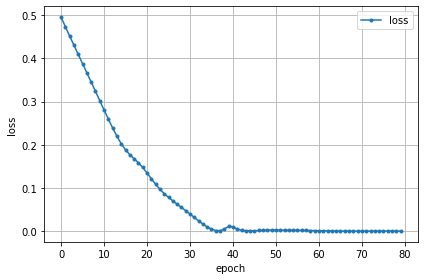
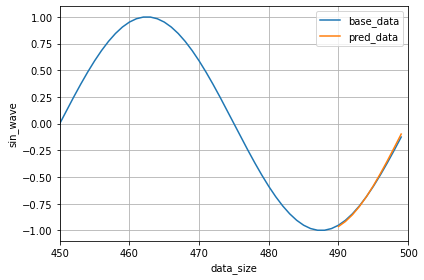

# LSTMを疑似データで行います。

疑似データとしてsin波を発生させ、LSTMを実装します。

## データの取得


```python
import numpy as np
import matplotlib.pyplot as plt
%matplotlib inline

X = np.linspace(0, 499, 500)                # 使用するデータ数 0～499、までの500個
y = np.sin(2 * X * np.pi / 50)              # sin波の生成

plt.plot(X, y)                              # 生成したデータの確認
plt.show()
```

# データを一定のシーケンスを持った状態に変換する

データをシーケンス長のデータを持つ、シーケンスデータに分割します。
同時に、分割したデータで予測する1つ先のターゲットデータをシーケンスデータごとに作成します


```python
def make_sequence_data(y, num_sequence):
    """指定したシーケンス長にデータを分割する

    Param:
        y: 正解値
        num_sequence: 分割したいシーケンスの長さ
    """
    num_data = len(y)               # データ数の取得
    seq_data = []                   # 分割したシーケンスデータの格納先
    target_data = []                # 分割後のシーケンスデータから予測したい1つ先のデータの格納先

    for i in range(num_data - num_sequence):
        # シーケンス長個のシーケンスデータを
        # 分割して格納
        seq_data.append(y[i:i+num_sequence])                    # シーケンス数分のデータを取得
        target_data.append(y[i+num_sequence:i+num_sequence+1])  # シーケンス数分のデータ+1のデータを取得
    # 格納データをNumpy配列に変換
    seq_array = np.array(seq_data)
    target_array = np.array(target_data)

    return seq_array, target_array

# 定数
SEP_LENGTH = 40                     # シーケンス長の設定

# データをシーケンス長に分割
y_seq, y_target = make_sequence_data(y, SEP_LENGTH)

# 分割したデータサイズの確認
print(y_seq.shape, y_target.shape)
```

    (460, 40) (460, 1)
    

シーケンスデータ`y_seq`は40刻み、
シーケンスデータのターゲットデータは`y_target`1刻みでデータ格納されているので目的通りシーケンス長の設定でデータを分割できています。

## データを訓練データと評価データに分割する

以下のデータの内訳で学習を行います。
- 0～489 訓練データ
- 490～499 評価データ（10個のデータを評価データとします。）


```python
# 定数
NUM_VALID = 10                          # 評価用データ数

y_seq_train = y_seq[:-NUM_VALID]        # 訓練データ  評価用データ数以外のデータを取得
y_seq_valid = y_seq[-NUM_VALID:]        # 評価用データ　データ全体の残り評価用データ数分のデータを取得
y_target_train = y_target[:-NUM_VALID]  # 正解値の訓練データ
y_target_valid = y_target[-NUM_VALID:]  # 正解値の評価用データ

y_seq_train.shape                       # 訓練データの形状の確認
```


    (450, 40)


## データをテンソル型に変換


```python
import torch

# データをfloat型のテンソルに変換
y_seq_t_train = torch.FloatTensor(y_seq_train)
y_target_t_train = torch.FloatTensor(y_target_train)
```

## LSTMネットワークの定義


```python
import torch.nn as nn

# 定数
INPUT_SIZE = 1              # 入力次元の数
HIDDENSIZE = 100            # LSTMの隠れ層のサイズ

OUTPUT_RESULTS = 1          # 出力層のニューロン数

# モデルの定義
class LongShortTermMemory(nn.Module):
    def __init__(self):
        # 継承したnn.Module親クラスを初期化
        super(LongShortTermMemory, self).__init__()
        """層の定義
        """
        # LSTM層
        self.lstm = nn.LSTM(
            input_size=INPUT_SIZE,      # 入力次元の数
            hidden_size=HIDDENSIZE      # 隠れ層のサイズ
        )
        # 全結合層
        self.linear = nn.Linear(
            HIDDENSIZE,                 # 入力ユニット数
            OUTPUT_RESULTS              # 出力層のニューロン数
        )
    def forward(self, x):
        """フォワードパスの定義
        """
        x, _ = self.lstm(x)             # LSTM層の実行　返り値はシーケンス長のアウトプットと隠れ層やセルの状態のタプル　シーケンス長のアウトプットのみを取得
        x_last = x[-1]                  # シーケンス長のアウトプットの最後の予測値を取得
        x = self.linear(x_last)         # 出力層の実行　出力 1
        return x

# モデルのインスタンス化
model = LongShortTermMemory()
print(model)                            # モデルの概要を出力
```

    LongShortTermMemory(
      (lstm): LSTM(1, 100)
      (linear): Linear(in_features=100, out_features=1, bias=True)
    )
    

## 損失関数の定義とオプティマイザー（最適化用オブジェクト）の作成


```python
import torch.optim as optim # 最適化モジュールのインポート

# 定数
LEARN_RATE = 0.001          # 学習率
# 変数
criterion = nn.MSELoss()    # 損失関数:平均二乗誤差

optimizer = optim.Adam(     # 最適化アルゴリズムに「Adam」を選択
    model.parameters(),     # 最適化で更新する重みやバイアスのパラメータ
     lr=LEARN_RATE
)
```

## データの順番軸の変更と軸の追加

LSTM層が受け取るデータ構成は（シーケンス長の軸, バッチサイズの軸、入力次元数となる必要があるので`parmute()`で変更します。

また、入力の次元数を`parmute()`メソッドで`1`を追加します。


```python
# 軸変更前のサイズの確認
print(y_seq_t_train.size())

# データの順番を変更
# LSTM層で扱えるように変更
y_seq_t_train = y_seq_t_train.permute(1, 0)
y_target_t_train = y_target_t_train.permute(1, 0)

# 軸変更後のサイズの確認
print(y_seq_t_train.size())
```

    torch.Size([450, 40])
    torch.Size([40, 450])
    


```python
# 入力の次元数を追加
y_seq_t_train = y_seq_t_train.unsqueeze(dim=-1)     # 1を一番最後に追加
y_target_t_train = y_target_t_train.unsqueeze(dim=-1)

# 軸追加後のサイズの確認
print(y_seq_t_train.size())
```

    torch.Size([40, 450, 1])
    

## 「学習」をエポック回繰り返す


```python
def init_parameters(layer):
    """パラメータ（重みとバイアス）の初期化
    引数の層が全結合層の時パラメータを初期化する
    
    Param:
      layer: 層情報
    """
    if type(layer) == nn.Linear:
        nn.init.xavier_uniform_(layer.weight)    # 重みを「一様分布のランダム値」で初期化
        layer.bias.data.fill_(0.0)               # バイアスを「0」で初期化


model.apply(init_parameters)        # 学習の前にパラメーター初期化
```


    LongShortTermMemory(
      (lstm): LSTM(1, 100)
      (linear): Linear(in_features=100, out_features=1, bias=True)
    )


```python
# 学習にかかる時間を測定する
import time

# 定数
start = time.time()             # 実行開始時間の取得
EPOCHS = 80                     # エポック数

# 変数
losses = []                     # 損失の履歴格納先

for epoch in range(EPOCHS):
    # バッチ学習なのでミニバッチの損失履歴の定義や初期化は不要
    model.train()               # 学習モードに設定
    
    output = model(y_seq_t_train)   # 出力結果を取得

    optimizer.zero_grad()       # 勾配を0で初期化
    loss = criterion(output, y_target_t_train)   # 損失を取得
    loss.backward()             # 逆伝播の処理として勾配を計算（自動微分）
    
    optimizer.step()            # 最適化の実施

    losses.append(loss.item())  # 損失をpython値で格納
    if epoch % 10 == 0:
        # 学習
        # エポック数と損失の表示
        print(f'[Epoch {epoch+1:3d}/{EPOCHS:3d}]' \
            f' loss: {loss.item():.5f}')

print('Finished Training')
# 学習後の損失の表示
print('last_loss: ',loss.item())

# 学習終了後、学習に要した時間を出力
print("Computation time:{0:.3f} sec".format(time.time() - start))

# 学習結果（損失）のグラフを描画
epochs = len(losses)
plt.plot(range(epochs), losses, marker='.', label='loss')
plt.legend(loc='best')
plt.xlabel('epoch')
plt.ylabel('loss')
plt.grid()
plt.tight_layout()
plt.show()
```

    /usr/local/lib/python3.6/dist-packages/torch/nn/modules/loss.py:432: UserWarning: Using a target size (torch.Size([1, 450, 1])) that is different to the input size (torch.Size([450, 1])). This will likely lead to incorrect results due to broadcasting. Please ensure they have the same size.
      return F.mse_loss(input, target, reduction=self.reduction)
    

    [Epoch   1/ 80] loss: 0.49562
    [Epoch  11/ 80] loss: 0.28081
    [Epoch  21/ 80] loss: 0.13480
    [Epoch  31/ 80] loss: 0.03966
    [Epoch  41/ 80] loss: 0.00988
    [Epoch  51/ 80] loss: 0.00259
    [Epoch  61/ 80] loss: 0.00095
    [Epoch  71/ 80] loss: 0.00017
    Finished Training
    last_loss:  0.00022259580146055669
    Computation time:15.642 sec
    





## 予測を行う

#### 評価データの前処理


```python
# 評価予測用データ
y_seq_t_valid = torch.FloatTensor(y_seq_valid)              # データをfloat型のテンソルに変換
y_seq_t_valid = y_seq_t_valid.permute(1, 0)                 # データの順番軸を変更
y_seq_t_valid = y_seq_t_valid.unsqueeze(dim=-1)             # 入力の次元数を最後の次元に追加

# 正解値の評価用データ
y_target_t_valid = torch.FloatTensor(y_target_valid)        # データをfloat型のテンソルに変換
y_target_t_valid = y_target_t_valid.permute(1, 0)           # データの順番軸を変更
y_target_t_valid = y_target_t_valid.unsqueeze(dim=-1)       # 入力の次元数を最後の次元に追加

# データサイズの確認
y_seq_t_valid.size()
```


    torch.Size([40, 10, 1])


## 予測の実行


```python
# 評価モードに設定
model.eval()
pred_y = model(y_seq_t_valid)                               # 予測結果の取得
# 出力結果と正解ラベルから損失を計算
loss = criterion(y_seq_t_valid, y_target_t_valid)           # 損失を取得

# 予測結果のサイズ確認　10個のデータを与えて一つのデータを返していることを確認
print(pred_y.size())
# 損失の表示
print('pred_loss: ',loss.item())
```

    torch.Size([10, 1])
    pred_loss:  1.074650764465332
    

    /usr/local/lib/python3.6/dist-packages/torch/nn/modules/loss.py:432: UserWarning: Using a target size (torch.Size([1, 10, 1])) that is different to the input size (torch.Size([40, 10, 1])). This will likely lead to incorrect results due to broadcasting. Please ensure they have the same size.
      return F.mse_loss(input, target, reduction=self.reduction)
    

## 予測結果の図示


```python
plt.plot(X, y, label='base_data')              # 元データの表示
# detach()を行い順伝播した予測結果を図示できるように変換
plt.plot(np.arange(490, 500), pred_y.detach(), label='pred_data')
plt.xlim([450, 500])        # 表示範囲の指定

plt.legend(loc='best')
plt.xlabel('data_size')
plt.ylabel('sin_wave')
plt.grid()
plt.tight_layout()
plt.show()
```




