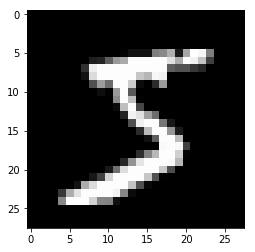
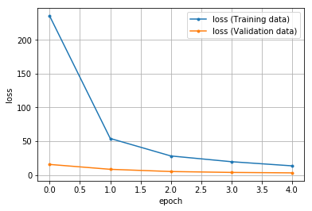

# MNISTのCNN

2次元画像を全結合型のニューラルネットワークを使って認識すること方法には、問題点として **入力層のニューロン数が28×28＝784個** とすることがあります。
つまり、2次元の構造を持っていたデータが1次元のデータに展開されてしまします。

CNNでは2次元のデータを小さな区分に分割し、それと何かの特徴を持つデータとを比較しながら元のデータがどのような特徴を持っているかを調べます。
この「何らかの特徴を表すデータ」のことを「カーネル」「フィルター」などと呼ばれます。

## この項の大まかな流れ

1. `class ConvolutionalNeuralNetwork(nn.Module)`:でCNNのクラスを定義する
2. `torch.nn.Conv2d`で畳み込み層を追加します。
3. `torch.nn.MaxPool2d`でプーリング層を追加します
4. モデルは「入力→畳み込み層→プーリング層→畳み込み層→プーリング層→全結合層→出力層（全結合層）」で構築します

## データセットの取得


```python
import torch
print(torch.__version__)

import torchvision
import torchvision.transforms as transforms    # 画像（を構成する数値データ）を変換するためのクラス

# データをロードした後に行う処理の設定
transform = transforms.Compose(
    [transforms.ToTensor(),                     # テンソル型に変換
    transforms.Normalize((0.5, ), (0.5, ))]     # RGBの各チャンネルの平均を0.5に設定    
)

"""
  MNSTデータのダウンロード
"""
df_train = torchvision.datasets.MNIST(
    root='./data',                              # データ保存先
    train=True,                                # True あらかじめ訓練用とされたのデータを取得
    transform=transform,                        # データに対しての処理 
    download=True                              # rootの位置にデータを保存
)

df_test = torchvision.datasets.MNIST(
    root='./data',                              # データ保存先
    train=False,                               # True あらかじめ訓練用とされたのデータを取得
    transform=transform,                        # データに対しての処理 
    download=True                              # rootの位置にデータを保存
)
image, label = df_train[0]


print('データサイズ:', len(image[0][0]), len(image[0]))
```

    1.5.0+cpu
    データサイズ: 28 28
    


```python
import matplotlib.pyplot as plt
%matplotlib inline

image, label = df_train[0]
print(label)
plt.gray()
plt.imshow(df_train.data[0])
```

    5
    


    <matplotlib.image.AxesImage at 0x1486fcd3128>





## データローダーの作成

**ミニバッチ学習** を簡単扱うための`DataLoader`クラスを作成します。


```python
from torch.utils.data import DataLoader, TensorDataset    # データ関連のユーティリティクラスのインポート

# 定数（学習方法の設計時）
BATCH_SIZE = 42        # バッチサイズ

# データローダー（loader）の作成 ミニバッチを扱うため、データローダー（loader）を作成する
loader_train = DataLoader(df_train, batch_size=BATCH_SIZE, shuffle=True)
loader_valid = DataLoader(df_test, batch_size=BATCH_SIZE, shuffle=False)
```

## ディープニューラルネットワークのモデル設計


```python
import torch.nn as nn
# 定数
INPUT_CHANNELS = 1         # 入力チャネル数（MNISTはRGB値のようなカラー画像ではなく、各ピクセルが0～255（の値を-1～1の範囲の浮動小数点数に変換したもの）だけのデータなので、ここでは1を指定）
CONV2_CHANNELS = 6         # 出力チャネル数 6個のカーネルを作成（conv2の入力チャネルの数を一致させる必要があります[conv1の出力→活性化関数→プーリングを経てconv2の入力チャンネルとして渡されます]）
INPUT_KERNELSIZE = 5  # 入力層のフィルター(カーネル) サイズ 5×5のサイズのカーネルを作成
OUTPUT_CHANNELS = 16       # 畳み込み層2の出力チャネル数

# 2×2のサイズでプーリングを行います
INPUT_POOLSIZE = (2, 2)    # プーリング実行サイズ 2×2のサイズ
# PADDING_SIZE = 0           # パディングサイズ ゼロパディング
# STRIDE_WIDTH = 1           # ストライド幅
DROPOUT_PROBABILITY = 0.5    # ドロップアウト確率

LAYER1_NEURONS = 16 * 16   # 隠れ層1のニューロン数 256個はreshapeで作成
LAYER2_NEURONS = 64        # 隠れ層2のニューロン数

OUTPUT_RESULTS = 10        # 出力層のニューロン数

# 変数 活性化関数
activation = torch.nn.ReLU()     # 活性化関数（隠れ層）ReLU関数    変更可

# モデルの定義
class ConvolutionalNeuralNetwork(nn.Module):
    def __init__(self):
        # 継承したnn.Module親クラスを初期化
        super(ConvolutionalNeuralNetwork, self).__init__()
        
        """層の定義
        """
        # 畳み込み層1
        self.conv1 = nn.Conv2d(
            INPUT_CHANNELS,       # 入力チャネル数
            CONV2_CHANNELS,       # 出力チャネル数
            INPUT_KERNELSIZE      # 入力層のフィルター(カーネル) サイズ
        )
        # プーリング層（MaxPooling）
        # self.pool = nn.MaxPool2d(
        #     INPUT_POOLSIZE,       # プーリング実行サイズ
        #     # padding=PADDING_SIZE, # パディングサイズ
        #     # stride=STRIDE_WIDTH   # ストライド幅
        # )
        # 畳み込み層2
        self.conv2 = nn.Conv2d(
            CONV2_CHANNELS,       # 入力チャネル数
            OUTPUT_CHANNELS,      # 出力チャネル数
            INPUT_KERNELSIZE      # 入力層のフィルター(カーネル) サイズ
        )
        
        # 隠れ層1
        self.layer1 = nn.Linear(
            LAYER1_NEURONS,      # 入力層のユニット数
            LAYER2_NEURONS       # 次の層への出力ユニット数
        )
        # ドロップアウト層
        self.dropout = nn.Dropout(
            DROPOUT_PROBABILITY  # ドロップアウト層の確率
        )
        # 出力層
        self.layer_out = nn.Linear(
            LAYER2_NEURONS,      # 入力ユニット数
            OUTPUT_RESULTS       # 出力結果への出力ユニット数
        )
        
    def forward(self, x):
        """フォワードパスの定義
        """
        # 出力＝活性化関数（第n層（入力））の形式
        x = activation(self.conv1(x))      # 活性化関数は変数として定義
        x = self.pool(x)                   # マックスプーリングの実行
        x = self.conv2(x)
        x = self.pool(x)
        x = x.reshape(-1, LAYER1_NEURONS)  # 畳み込み層の出力サイズを全結合層の入力ニューロン数に変換
        # x = x.view(x.size(0), -1)  # (チャネル数, -1)畳み込み層の出力サイズを全結合層の入力ニューロン数に変換
        x = activation(self.layer1(x))     # 活性化関数は変数として定義
        # x = self.dropout(x)                # ドロップアウト層
        x = self.layer_out(x)              # 出力層の実行
        return x

# モデルのインスタンス化
model = ConvolutionalNeuralNetwork()
print(model)                      # モデルの概要を出力  
```

    ConvolutionalNeuralNetwork(
      (conv1): Conv2d(1, 6, kernel_size=(5, 5), stride=(1, 1))
      (pool): MaxPool2d(kernel_size=(2, 2), stride=(2, 2), padding=0, dilation=1, ceil_mode=False)
      (conv2): Conv2d(6, 16, kernel_size=(5, 5), stride=(1, 1))
      (layer1): Linear(in_features=256, out_features=64, bias=True)
      (layer_out): Linear(in_features=64, out_features=10, bias=True)
    )
    
## 層ごとの出力の算出

#### 畳み込み層とプーリング層の算出式+全結合層の入力
$
入力サイズ : [高さ, 幅]=[H, W]\\
出力サイズ : [高さ, 幅]=[O_h, O_w]\\
フィルタサイズのサイズ : [高さ, 幅]=[F_h, F_w]\\
パディングサイズ : P\\
ストライド : S\\
$
出力サイズ$O_h, O_w$は以下のように計算できます。
$$O_h=\frac{H+2P-F_h}{s}+1\\
O_w=\frac{W+2P-F_w}{s}+1$$

mnistのデータは`28x28`のサイズで`1`チャンネルです（白黒画像であるため）。
よって

$conv1$の出力は
$$O_h=\frac{28+2×0-5}{1}+1=24\\
O_w=\frac{28+2×0-5}{1}+1=24\\
出力=24×24の6チャンネル
$$
$pool$の出力は
$$O_h=\frac{24+2×0-2}{2}+1=12\\
O_w=\frac{24+2×0-2}{2}+1=12\\
出力=12×12の6チャンネル
$$
$conv2$の出力は
$$O_h=\frac{12+2×0-5}{1}+1=8\\
O_w=\frac{12+2×0-5}{1}+1=8\\
出力=8×8の16チャンネル
$$
$pool$の出力は
$$O_h=\frac{8+2×0-2}{2}+1=4\\
O_w=\frac{8+2×0-2}{2}+1=4\\
出力=4×4の16チャンネル
$$
$layer1$の入力は
$$
入力=4×4×16=256
$$

## オプティマイザー（最適化用オブジェクト）の作成


```python
import torch.optim as optim    # 最適化モジュールのインポート

# 定数
LEARN_RATE = 0.03        # 学習率
MOMENTUM =  0.9          # モーメンタム

# オプティマイザーの作成（パラメータと学習率も作成）
optimizer = optim.SGD(    # 最適化アルゴリズムに「SGD」を選択
    model.parameters(),   # 最適化で更新する重みやバイアスのパラメータ
    lr=LEARN_RATE,        # 学習率
    momentum=MOMENTUM     # モーメンタム（移動平均 を適用して、振動を抑制）
)
```

## 損失関数の定義


```python
# 変数
criterion = nn.CrossEntropyLoss()   # 損失関数：交差エントロピー 学習データの正解率を出力
```

## 1回分の「訓練（学習）」と「評価」の処理


```python
def train_step(train_X, train_y):
    """学習の実行
    訓練モードの設定
    フォワードプロパゲーションで出力結果の取得
    出力結果と正解ラベルから損失および勾配の計算
    勾配を使ってパラメーター（重みとバイアス）の更新
    正解率の算出
    
    Param:
      train_X: 入力データ
      train_y: 正解ラベル
    """
    # 学習モードに設定
    model.train()

    # フォワードプロパゲーションで出力結果を取得
    pred_y = model(train_X)    # フォワードプロパゲーションの結果を取得
    
    # 出力結果と正解ラベルから損失を計算し、勾配を計算
    optimizer.zero_grad()                # 勾配を0で初期化
    loss = criterion(pred_y, train_y)    # 誤差（出力結果と正解ラベルの差）から損失を取得
    loss.backward()                      # 逆伝播の処理として勾配を計算（自動微分）
    
    # 勾配を使ってパラメーター（重みとバイアス）を更新
    optimizer.step()                     # 最適化の実施
    
    # 正解数の算出
    with torch.no_grad():                # 勾配は計算しないモードに設定
        # disc_y = discretize(pred_y)      # 確率値から-1 or 1に学習結果を変換
        
        _, disc_y = torch.max(pred_y, 1) # 予測した確率の最大値を予測結果として出力
        
        acc = (disc_y == train_y).sum()  # 正解数を取得
    
    # 損失と正解数をタプルで返す
    return (loss.item(), acc.item())     # item()でpythonの数値に変換

def valid_step(valid_X, valid_y):
    """評価（推論）検証
    評価モードの設定
    フォワードプロパゲーションで出力結果の取得
    出力結果と正解ラベルから損失の計算
    正解率の算出
    
    Param:
      valid_X: 入力データ
      valid_y: 正解ラベル
    """
    # 評価モードに設定（dropoutなどの挙動が評価用になる）
    model.eval()

    # フォワードプロパゲーションで出力結果を取得
    pred_y = model(valid_X)    # フォワードプロパゲーションの結果を取得
    
    # 出力結果と正解ラベルから損失を計算
    loss = criterion(pred_y, valid_y)    # 誤差（出力結果と正解ラベルの差）から損失を取得
    # 評価時は勾配を計算しない
    
    # 正解数の算出
    with torch.no_grad():                # 勾配は計算しないモードに設定
        # disc_y = discretize(pred_y)      # 確率値から-1 or 1に学習結果を変換
        _, disc_y = torch.max(pred_y, 1) # 予測した確率の最大値を予測結果として出力
        
        acc = (disc_y == valid_y).sum()  # 正解数を取得
    
    # 損失と正解数をタプルで返す
    return (loss.item(), acc.item())     # item()でpythonの数値に変換
```

## 「学習」と「評価」をバッチサイズ単位でエポック回繰り返す


```python
def init_parameters(layer):
    """パラメータ（重みとバイアス）の初期化
    引数の層が全結合層の時パラメータを初期化する
    
    Param:
      layer: 層情報
    """
    if type(layer) == nn.Linear:
        nn.init.xavier_uniform_(layer.weight)    # 重みを「一様分布のランダム値」で初期化
        layer.bias.data.fill_(0.0)               # バイアスを「0」で初期化


model.apply(init_parameters)        # 学習の前にパラメーター初期化

# 定数
EPOCHS = 5        # エポック数

# 変数　学習用と評価用の平均変数
avg_loss = 0.0           # 訓練用の平均損失値
avg_acc = 0.0            # 訓練用の平均正解率

avg_val_loss = 0.0       # 評価用の平均損失値
avg_val_acc = 0.0        # 評価用の平均正解率

# 損失の履歴を保存するための変数
train_hist = []
valid_hist = []


for epoch in range(EPOCHS):
    # forループ内で使う変数と、エポックごとの値リセット
    total_loss = 0.0     # 訓練時における累計損失値
    total_acc = 0.0      # 訓練時における累計正解数
    
    total_val_loss = 0.0 # 評価時における累計損失値
    total_val_acc = 0.0  # 評価時における累計正解数
    
    total_train = 0      # 訓練時における累計データ数
    total_valid = 0      # 評価時における累計データ数

    for train_X, train_y in loader_train:
        """
        1ミニバッチ分の「訓練」を実行
        """
        loss, acc = train_step(train_X, train_y)

        # 取得した損失値と正解率を累計値側に足していく
        total_loss += loss          # 訓練用の累計損失値
        total_acc += acc            # 訓練用の累計正解数
        total_train += len(train_y) # 訓練データの累計数
            
    for valid_X, valid_y in loader_valid:
        """
        1ミニバッチ分の「評価（精度検証）」を実行
        """
        val_loss, val_acc = valid_step(valid_X, valid_y)

        # 取得した損失値と正解率を累計値側に足す
        total_val_loss += val_loss  # 評価用の累計損失値
        total_val_acc += val_acc    # 評価用の累計正解数
        total_valid += len(valid_y) # 訓練データの累計数
        
    # ミニバッチ単位で累計してきた損失値や正解率の平均を取る
    n = epoch + 1                             # 処理済みのエポック数
    avg_loss = total_loss / n                 # 訓練用の平均損失値
    avg_acc = total_acc / total_train         # 訓練用の平均正解率
    avg_val_loss = total_val_loss / n         # 訓練用の平均損失値
    avg_val_acc = total_val_acc / total_valid # 訓練用の平均正解率

    # グラフ描画のために損失の履歴を保存する
    train_hist.append(avg_loss)
    valid_hist.append(avg_val_loss)

    # 損失や正解率などの情報を表示
    print(f'[Epoch {epoch+1:3d}/{EPOCHS:3d}]' \
          f' loss: {avg_loss:.5f}, acc: {avg_acc:.5f}' \
          f' val_loss: {avg_val_loss:.5f}, val_acc: {avg_val_acc:.5f}')

print('Finished Training')
print(model.state_dict())  # 学習後のパラメーターの情報を表示

# 学習結果（損失）のグラフを描画
epochs = len(train_hist)
plt.plot(range(epochs), train_hist, marker='.', label='loss (Training data)')
plt.plot(range(epochs), valid_hist, marker='.', label='loss (Validation data)')
plt.legend(loc='best')
plt.grid()
plt.xlabel('epoch')
plt.ylabel('loss')
plt.show()
```

    [Epoch   1/  5] loss: 235.11163, acc: 0.94848 val_loss: 15.60878, val_acc: 0.97950
    [Epoch   2/  5] loss: 54.03365, acc: 0.97770 val_loss: 8.40050, val_acc: 0.97780
    [Epoch   3/  5] loss: 28.15067, acc: 0.98243 val_loss: 5.11912, val_acc: 0.98250
    [Epoch   4/  5] loss: 19.64937, acc: 0.98407 val_loss: 3.78496, val_acc: 0.98130
    [Epoch   5/  5] loss: 13.52522, acc: 0.98633 val_loss: 3.13807, val_acc: 0.98210
    Finished Training
    OrderedDict([('conv1.weight', tensor([[[[ 0.1292,  0.7475, -0.5010, -0.3921,  0.1000],
              [-0.1879,  1.0068, -0.3432, -0.2977, -0.0175],
              [ 0.1452,  0.2350, -0.2413, -0.3168,  0.0633],
              [ 0.5737, -0.0954, -0.3311, -0.2607, -0.0477],
              [-0.0192,  0.0571, -0.0774,  0.0822,  0.1677]]],
              ＿＿＿省略＿＿＿
            [ 0.3888,  0.0783,  0.1191, -0.1962,  0.0652,  0.1940, -0.0202, -0.0125,
              0.3800, -0.2884,  0.1463, -0.2311, -0.0527, -0.1782,  0.2218, -0.2367,
             -0.3268, -0.1430, -0.1367,  0.2553,  0.1433, -0.3316, -0.1303, -0.3436,
             -0.2789,  0.2518, -0.3832, -0.2911,  0.3100,  0.4079,  0.4134, -0.3029,
              0.1773,  0.3939, -0.2115, -0.5357, -0.2499,  0.2353, -0.4284, -0.2457,
             -0.3999,  0.0572, -0.2312,  0.2305,  0.1907, -0.0631, -0.4497, -0.1022,
              0.4833,  0.5258, -0.4389, -0.0581, -0.2944,  0.4166,  0.3336, -0.3688,
              0.1508,  0.0651, -0.0626, -0.2234, -0.0691,  0.1362,  0.1960, -0.0874]])), ('layer_out.bias', tensor([ 0.0198,  0.0312, -0.1057,  0.3228, -0.0046, -0.1939, -0.4012, -0.1349,
             0.4628,  0.0037]))])
    





## 損失値の推移グラフ描画


```python
# 学習結果（損失）のグラフを描画
epochs = len(train_hist)
plt.plot(range(epochs), train_hist, marker='.', label='loss (Training data)')
plt.plot(range(epochs), valid_hist, marker='.', label='loss (Validation data)')
plt.legend(loc='best')
plt.grid()
plt.xlabel('epoch')
plt.ylabel('loss')
plt.show()
```


## 予測結果の出力


```python
with torch.no_grad():
    for data in loader_valid:
        inputs, labels = data
        print(labels.numpy())

        # 評価モードに設定（dropoutなどの挙動が評価用になる）
        model.eval()
        # フォワードプロパゲーションで出力結果を取得
        pred_y = model(inputs)    # フォワードプロパゲーションの結果を取得
        # 出力結果を1まで範囲に変化し、その最大値を取得
        _, disc_y = torch.max(pred_y, 1)
        # numpy化して出力結果を表示
        print(disc_y.numpy())
        
        acc = (disc_y == labels).sum()     # 正解数の計算
        le = len(labels.numpy())           # データ数を取得
        print(acc.numpy() / le)            # 正解率の表示
        print()
        
        # 出力結果と正解ラベルから損失を計算
        loss = criterion(pred_y, labels)    # 誤差（出力結果と正解ラベルの差）から損失を取得
        # 評価時は勾配を計算しない
        
        # 損失を表示
        print(loss.item())                  # item()でpythonの数値に変換
        print()

```

    [7 2 1 0 4 1 4 9 5 9 0 6 9 0 1 5 9 7 3 4 9 6 6 5 4 0 7 4 0 1 3 1 3 4 7 2 7
     1 2 1 1 7]
    [7 2 1 0 4 1 4 9 5 9 0 6 9 0 1 5 9 7 3 4 9 6 6 5 4 0 7 4 0 1 3 1 3 4 7 2 7
     1 2 1 1 7]
    1.0
    
    0.00039894311339594424
    省略
    
    0.08653257042169571
    
    [2 1 1 7 7 8 4 6 0 7 0 3 6 8 7 1 5 2 4 9 4 3 6 4 1 7 2 6 5 0 1 2 3 4 5 6 7
     8 9 0 1 2]
    [2 1 1 7 7 8 4 6 0 7 0 3 6 8 7 1 5 2 4 9 4 3 6 4 1 7 2 6 5 0 1 2 3 4 5 6 7
     8 9 0 1 2]
    1.0
    
    0.0020282831974327564
    
    [3 4 5 6]
    [3 4 5 6]
    1.0
    
    0.0009344195132143795
    
    

## modelを保存する


```python
torch.save(model.state_dict(), 'CNN_MNIST_torch.pth')    # state_dictはモデルの構造だけ保存
# 普通にsaveするとGPU等device関連情報も一緒に保存するため、別環境で動作する時に変換処理が必要です
```

## modelを読み込み再度予測を行う


```python
# モデルのパラメータのロード
param = torch.load('CNN_MNIST_torch.pth')
```

事前にモデルのインスタンス化が必要です。
（インスタンス化したモデルにロードしたパラメータを設定します）


```python
import torch
import torch.nn as nn
# 定数
INPUT_CHANNELS = 1         # 入力チャネル数（MNISTはRGB値のようなカラー画像ではなく、各ピクセルが0～255（の値を-1～1の範囲の浮動小数点数に変換したもの）だけのデータなので、ここでは1を指定）
CONV2_CHANNELS = 6         # 出力チャネル数 6個のカーネルを作成（conv2の入力チャネルの数を一致させる必要があります[conv1の出力→活性化関数→プーリングを経てconv2の入力チャンネルとして渡されます]）
INPUT_KERNELSIZE = 5  # 入力層のフィルター(カーネル) サイズ 5×5のサイズのカーネルを作成
OUTPUT_CHANNELS = 16       # 畳み込み層2の出力チャネル数

# 2×2のサイズでプーリングを行います
INPUT_POOLSIZE = (2, 2)    # プーリング実行サイズ 2×2のサイズ
# PADDING_SIZE = 0           # パディングサイズ ゼロパディング
# STRIDE_WIDTH = 1           # ストライド幅

LAYER1_NEURONS = 16 * 16   # 隠れ層1のニューロン数 256個はreshapeで作成
LAYER2_NEURONS = 64        # 隠れ層2のニューロン数

OUTPUT_RESULTS = 10        # 出力層のニューロン数

# 変数 活性化関数
activation = torch.nn.ReLU()     # 活性化関数（隠れ層）ReLU関数    変更可

# モデルの定義
class ConvolutionalNeuralNetwork(nn.Module):
    def __init__(self):
        super(ConvolutionalNeuralNetwork, self).__init__()
        
        """層の定義
        """
        # 畳み込み層1
        self.conv1 = nn.Conv2d(
            INPUT_CHANNELS,       # 入力チャネル数
            CONV2_CHANNELS,       # 出力チャネル数
            INPUT_KERNELSIZE      # 入力層のフィルター(カーネル) サイズ
        )
        # プーリング層（MaxPooling）
        self.pool = nn.MaxPool2d(
            INPUT_POOLSIZE,       # プーリング実行サイズ
            # padding=PADDING_SIZE, # パディングサイズ
            # stride=STRIDE_WIDTH   # ストライド幅
        )
        # 畳み込み層2
        self.conv2 = nn.Conv2d(
            CONV2_CHANNELS,       # 入力チャネル数
            OUTPUT_CHANNELS,      # 出力チャネル数
            INPUT_KERNELSIZE      # 入力層のフィルター(カーネル) サイズ
        )
        
        # 隠れ層1
        self.layer1 = nn.Linear(
            LAYER1_NEURONS,      # 入力層のユニット数
            LAYER2_NEURONS       # 次の層への出力ユニット数
        )
        # 出力層
        self.layer_out = nn.Linear(
            LAYER2_NEURONS,      # 入力ユニット数
            OUTPUT_RESULTS       # 出力結果への出力ユニット数
        )
        
    def forward(self, x):
        """フォワードパスの定義
        """
        # 出力＝活性化関数（第n層（入力））の形式
        x = activation(self.conv1(x))      # 活性化関数は変数として定義
        x = self.pool(x)                   # マックスプーリングの実行
        x = self.conv2(x)
        x = self.pool(x)
        x = x.reshape(-1, LAYER1_NEURONS)  # 畳み込み層の出力サイズを全結合層の入力ニューロン数に変換
        x = activation(self.layer1(x))     # 活性化関数は変数として定義
        x = self.layer_out(x)              # 出力層の実行
        return x
```


```python
# モデルのインスタンス化
model = ConvolutionalNeuralNetwork()       # 読み込む前にクラス宣言が必要
model.load_state_dict(param)
```


    <All keys matched successfully>


```python
with torch.no_grad():
    for data in loader_valid:
        inputs, labels = data
        print(labels.numpy())

        # 評価モードに設定（dropoutなどの挙動が評価用になる）
        model.eval()
        # フォワードプロパゲーションで出力結果を取得
        pred_y = model(inputs)    # フォワードプロパゲーションの結果を取得
        # 出力結果を1まで範囲に変化し、その最大値を取得
        _, disc_y = torch.max(pred_y, 1)
        # numpy化して出力結果を表示
        print(disc_y.numpy())
        
        acc = (disc_y == labels).sum()     # 正解数の計算
        le = len(labels.numpy())           # データ数を取得
        print(acc.numpy() / le)            # 正解率の表示
        print()
        
        # 出力結果と正解ラベルから損失を計算
        loss = criterion(pred_y, labels)    # 誤差（出力結果と正解ラベルの差）から損失を取得
        # 評価時は勾配を計算しない
        
        # 損失を表示
        print(loss.item())                  # item()でpythonの数値に変換
        print()
```

    [7 2 1 0 4 1 4 9 5 9 0 6 9 0 1 5 9 7 3 4 9 6 6 5 4 0 7 4 0 1 3 1 3 4 7 2 7
     1 2 1 1 7]
    [7 2 1 0 4 1 4 9 5 9 0 6 9 0 1 5 9 7 3 4 9 6 6 5 4 0 7 4 0 1 3 1 3 4 7 2 7
     1 2 1 1 7]
    1.0
    
    0.00039894311339594424
    
    [4 2 3 5 1 2 4 4 6 3 5 5 6 0 4 1 9 5 7 8 9 3 7 4 6 4 3 0 7 0 2 9 1 7 3 2 9
     7 7 6 2 7]
    [4 2 3 5 1 2 4 4 6 3 5 5 6 0 4 1 9 5 7 8 5 3 7 4 6 4 3 0 7 0 2 9 1 7 3 2 9
     7 7 6 2 7]
    0.9761904761904762
    
    0.03537139669060707
    
    [8 4 7 3 6 1 3 6 9 3 1 4 1 7 6 9 6 0 5 4 9 9 2 1 9 4 8 7 3 9 7 4 4 4 9 2 5
     4 7 6 7 9]
    [8 4 7 3 6 1 3 6 9 3 1 4 1 7 6 9 6 0 5 4 9 9 2 1 9 4 8 7 3 9 7 4 4 4 9 2 5
     4 7 6 7 9]
    1.0
    
    0.005990083795040846
    ＿＿省略＿＿
    
    [3 4 5 6]
    [3 4 5 6]
    1.0
    
    0.0009344195132143795
    
    
