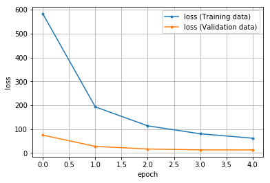

# MNISTでDNN

MNISTデータを使用して4層の分類モデルをDNNでモデルを作成し、
保存したモデルを読み込んで予測を行います。

PCカメラで保存した画像での実装は以下の階層に保存しています。

[学習](./DNNMNIST/torch_ffnn_mnist.py)
[予測](./DNNMNIST/torch_Predict_num.py)
[予測用画像保存](./DNNMNIST/Camera_Save_Number.py)

## データセットの取得

```python
import torch
print(torch.__version__)

import torchvision
import torchvision.transforms as transforms    # 画像（を構成する数値データ）を変換するためのクラス

# データをロードした後に行う処理の設定
transform = transforms.Compose(
    [transforms.ToTensor(),                     # テンソル型に変換
    transforms.Normalize((0.5, ), (0.5, ))]     # RGBの各チャンネルの平均を0.5に設定    
)

"""
  MNSTデータのダウンロード
"""
df_train = torchvision.datasets.MNIST(
    root='./data',                              # データ保存先
    train=True,                                # True あらかじめ訓練用とされたのデータを取得
    transform=transform,                        # データに対しての処理 
    download=True                              # rootの位置にデータを保存
)

df_test = torchvision.datasets.MNIST(
    root='./data',                              # データ保存先
    train=False,                               # True あらかじめ訓練用とされたのデータを取得
    transform=transform,                        # データに対しての処理 
    download=True                              # rootの位置にデータを保存
)
image, label = df_train[0]
print(len(image[0][0]), len(image[0]))
print()
print(len(df_train.data[0][0]), len(df_train.data[0]))
print(df_train.data[0])
print()
print(df_test.data[0])
print(type(df_train), type(df_test))
```

    1.5.0+cpu
    28 28
    
    28 28
    tensor([[  0,   0,   0,   0,   0,   0,   0,   0,   0,   0,   0,   0,   0,   0,
               0,   0,   0,   0,   0,   0,   0,   0,   0,   0,   0,   0,   0,   0],
            [  0,   0,   0,   0,   0,   0,   0,   0,   0,   0,   0,   0,   0,   0,
               0,   0,   0,   0,   0,   0,   0,   0,   0,   0,   0,   0,   0,   0],
            [  0,   0,   0,   0,   0,   0,   0,   0,   0,   0,   0,   0,   0,   0,
               0,   0,   0,   0,   0,   0,   0,   0,   0,   0,   0,   0,   0,   0],
            [  0,   0,   0,   0,   0,   0,   0,   0,   0,   0,   0,   0,   0,   0,
               0,   0,   0,   0,   0,   0,   0,   0,   0,   0,   0,   0,   0,   0],
            [  0,   0,   0,   0,   0,   0,   0,   0,   0,   0,   0,   0,   0,   0,
               0,   0,   0,   0,   0,   0,   0,   0,   0,   0,   0,   0,   0,   0],
            [  0,   0,   0,   0,   0,   0,   0,   0,   0,   0,   0,   0,   3,  18,
              18,  18, 126, 136, 175,  26, 166, 255, 247, 127,   0,   0,   0,   0],
            [  0,   0,   0,   0,   0,   0,   0,   0,  

    省略

            [  0,   0,   0,   0,   0,   0,   0,   0,   0,   0, 121, 254, 207,  18,
               0,   0,   0,   0,   0,   0,   0,   0,   0,   0,   0,   0,   0,   0],
            [  0,   0,   0,   0,   0,   0,   0,   0,   0,   0,   0,   0,   0,   0,
               0,   0,   0,   0,   0,   0,   0,   0,   0,   0,   0,   0,   0,   0]],
           dtype=torch.uint8)
    <class 'torchvision.datasets.mnist.MNIST'> <class 'torchvision.datasets.mnist.MNIST'>
    


```python
import matplotlib.pyplot as plt
%matplotlib inline

image, label = df_train[0]
print(label)

plt.imshow(df_train.data[0])
```

    5
    


    <matplotlib.image.AxesImage at 0x259f3828128>


## データローダーの作成

**ミニバッチ学習** を簡単扱うための`DataLoader`クラスを作成します。


```python
from torch.utils.data import DataLoader, TensorDataset    # データ関連のユーティリティクラスのインポート

# 定数（学習方法の設計時）
BATCH_SIZE = 42        # バッチサイズ

# データローダー（loader）の作成 ミニバッチを扱うため、データローダー（loader）を作成する
loader_train = DataLoader(df_train, batch_size=BATCH_SIZE, shuffle=True)
loader_valid = DataLoader(df_test, batch_size=BATCH_SIZE, shuffle=False)
```

```python
"""
データローダーから画像を表示
"""
train_iter = iter(loader_train)     # データローダーのイテレーターを作成
imgs, labels = train_iter.next()    # イテレーターを一つ抽出しimgs, labelsを取得
print(imgs.size())                  # データサイズの出力

print(labels)                       # ラベルの出力
img = imgs[0]                       # 画像データを一つ抽出
img_permute = np.transpose(img, (1, 2, 0))  # データ構造をチャネルラストにし、画像表示できるように順番を変更
import seaborn as sns
# Numpy型の二次元配列をヒートマップとして表示
# sns.heatmap(img_permute.numpy()[:, :, 0])
```
    torch.Size([42, 1, 28, 28])

    tensor([2, 7, 5, 3, 4, 5, 3, 9, 2, 1, 2, 4, 4, 4, 1, 8, 2, 8, 0, 2, 3, 9, 6, 1,
            2, 7, 8, 8, 1, 6, 9, 7, 9, 4, 3, 1, 2, 9, 6, 4, 4, 2, 0, 5, 9, 7, 4, 7,
            2, 9, 0, 9, 8, 4, 2, 0, 3, 1, 1, 9, 7, 2, 3, 9, 1, 5, 2, 0, 2, 1, 4, 5,
            1, 5, 5, 1, 3, 4, 2, 2, 4, 6, 6, 2, 8, 0, 9, 1, 4, 3, 1, 7, 9, 1, 8, 0,
            8, 8, 9, 3])


## ディープニューラルネットワークのモデル設計


```python
import torch.nn as nn
# 定数
INPUT_FEATURES = 28 * 28  # 入力層のニューロン数
LAYER1_NEURONS = 64       # 隠れ層のニューロン数
OUTPUT_RESULTS = 10       # 出力層のニューロン数

# 変数 活性化関数
activation = torch.nn.ReLU()     # 活性化関数（隠れ層）ReLU関数    変更可
acti_out = torch.nn.Softmax()    # 活性化関数（出力層）Softmax関数 変更不可

# モデルの定義
class NeuralNetwork(nn.Module):
    def __init__(self):
        # 継承したnn.Module親クラスを初期化
        super(NeuralNetwork, self).__init__()
        
        """層の定義
        """
        # 隠れ層
        self.layer1 = nn.Linear(
            INPUT_FEATURES,      # 入力層のユニット数
            LAYER1_NEURONS       # 次の層への出力ユニット数
        )
        # 出力層
        self.layer_out = nn.Linear(
            LAYER1_NEURONS,      # 入力ユニット数
            OUTPUT_RESULTS       # 出力結果への出力ユニット数
        )
        
    def forward(self, x):
        """フォワードパスの定義
        """
        # 出力＝活性化関数（第n層（入力））の形式
        x = activation(self.layer1(x))     # 活性化関数は変数として定義
        x = self.layer_out(x)
        # x = acti_out(self.layer_out(x))    # 活性化関数はSoftmaxで固定
        return x

# モデルのインスタンス化
model = NeuralNetwork()
print(model)                      # モデルの概要を出力  
```

    NeuralNetwork(
      (layer1): Linear(in_features=784, out_features=64, bias=True)
      (layer_out): Linear(in_features=64, out_features=10, bias=True)
    )
    

## オプティマイザー（最適化用オブジェクト）の作成


```python
import torch.optim as optim    # 最適化モジュールのインポート

# 定数
LEARN_RATE = 0.03        # 学習率
MOMENTUM =  0.9          # モーメンタム

# オプティマイザーの作成（パラメータと学習率も作成）
optimizer = optim.SGD(    # 最適化アルゴリズムに「SGD」を選択
    model.parameters(),   # 最適化で更新する重みやバイアスのパラメータ
    lr=LEARN_RATE,        # 学習率
    momentum=MOMENTUM     # モーメンタム（移動平均 を適用して、振動を抑制）
)
```

## 損失関数の定義


```python
# 変数
criterion = nn.CrossEntropyLoss()   # 損失関数：交差エントロピー 学習データの正解率を出力
```

## 1回分の「訓練（学習）」と「評価」の処理


```python
def train_step(train_X, train_y):
    """学習の実行
    訓練モードの設定
    フォワードプロパゲーションで出力結果の取得
    出力結果と正解ラベルから損失および勾配の計算
    勾配を使ってパラメーター（重みとバイアス）の更新
    正解率の算出
    
    Param:
      train_X: 入力データ
      train_y: 正解ラベル
    """
    # 学習モードに設定
    model.train()

    # フォワードプロパゲーションで出力結果を取得
    pred_y = model(train_X)    # フォワードプロパゲーションの結果を取得
    
    # 出力結果と正解ラベルから損失を計算し、勾配を計算
    optimizer.zero_grad()                # 勾配を0で初期化
    loss = criterion(pred_y, train_y)    # 誤差（出力結果と正解ラベルの差）から損失を取得
    loss.backward()                      # 逆伝播の処理として勾配を計算（自動微分）
    
    # 勾配を使ってパラメーター（重みとバイアス）を更新
    optimizer.step()                     # 最適化の実施
    
    # 正解数の算出
    with torch.no_grad():                # 勾配は計算しないモードに設定
        # disc_y = discretize(pred_y)      # 確率値から-1 or 1に学習結果を変換
        
        _, disc_y = torch.max(pred_y, 1) # 予測した確率の最大値を予測結果として出力
        
        acc = (disc_y == train_y).sum()  # 正解数を取得
    
    # 損失と正解数をタプルで返す
    return (loss.item(), acc.item())     # item()でpythonの数値に変換

def valid_step(valid_X, valid_y):
    """評価（推論）検証
    評価モードの設定
    フォワードプロパゲーションで出力結果の取得
    出力結果と正解ラベルから損失の計算
    正解率の算出
    
    Param:
      valid_X: 入力データ
      valid_y: 正解ラベル
    """
    # 評価モードに設定（dropoutなどの挙動が評価用になる）
    model.eval()

    # フォワードプロパゲーションで出力結果を取得
    pred_y = model(valid_X)    # フォワードプロパゲーションの結果を取得
    
    # 出力結果と正解ラベルから損失を計算
    loss = criterion(pred_y, valid_y)    # 誤差（出力結果と正解ラベルの差）から損失を取得
    # 評価時は勾配を計算しない
    
    # 正解数の算出
    with torch.no_grad():                # 勾配は計算しないモードに設定
        # 出力結果全てを足して1になるように変換し、その中の最大値を取得
        _, disc_y = torch.max(pred_y, 1) # 予測した確率の最大値を予測結果として出力
        
        acc = (disc_y == valid_y).sum()  # 正解数を取得
    
    # 損失と正解数をタプルで返す
    return (loss.item(), acc.item())     # item()でpythonの数値に変換
```

## 「学習」と「評価」をバッチサイズ単位でエポック回繰り返す


```python
def init_parameters(layer):
    """パラメータ（重みとバイアス）の初期化
    引数の層が全結合層の時パラメータを初期化する
    
    Param:
      layer: 層情報
    """
    if type(layer) == nn.Linear:
        nn.init.xavier_uniform_(layer.weight)    # 重みを「一様分布のランダム値」で初期化
        layer.bias.data.fill_(0.0)               # バイアスを「0」で初期化


model.apply(init_parameters)        # 学習の前にパラメーター初期化


# 定数
EPOCHS = 5        # エポック数

# 変数　学習用と評価用の平均変数
avg_loss = 0.0           # 訓練用の平均損失値
avg_acc = 0.0            # 訓練用の平均正解率

avg_val_loss = 0.0       # 評価用の平均損失値
avg_val_acc = 0.0        # 評価用の平均正解率

# 損失の履歴を保存するための変数
train_hist = []
valid_hist = []


for epoch in range(EPOCHS):
    # forループ内で使う変数と、エポックごとの値リセット
    total_loss = 0.0     # 訓練時における累計損失値
    total_acc = 0.0      # 訓練時における累計正解数
    
    total_val_loss = 0.0 # 評価時における累計損失値
    total_val_acc = 0.0  # 評価時における累計正解数
    
    total_train = 0      # 訓練時における累計データ数
    total_valid = 0      # 評価時における累計データ数

    for train_X, train_y in loader_train:
        """
        1ミニバッチ分の「訓練」を実行
        """
        # 入力データを1列に変換
        train_X = train_X.reshape(-1, 28*28)
        
        loss, acc = train_step(train_X, train_y)

        # 取得した損失値と正解率を累計値側に足していく
        total_loss += loss          # 訓練用の累計損失値
        total_acc += acc            # 訓練用の累計正解数
        total_train += len(train_y) # 訓練データの累計数
            
    for valid_X, valid_y in loader_valid:
        """
        1ミニバッチ分の「評価（精度検証）」を実行
        """
        # 入力データを1列に変換
        valid_X = valid_X.reshape(-1, 28*28)
        
        val_loss, val_acc = valid_step(valid_X, valid_y)

        # 取得した損失値と正解率を累計値側に足す
        total_val_loss += val_loss  # 評価用の累計損失値
        total_val_acc += val_acc    # 評価用の累計正解数
        total_valid += len(valid_y) # 評価データの累計数
        
    # ミニバッチ単位で累計してきた損失値や正解率の平均を取る
    n = epoch + 1                             # 処理済みのエポック数
    avg_loss = total_loss / n                 # 訓練用の平均損失値
    avg_acc = total_acc / total_train         # 訓練用の平均正解率
    avg_val_loss = total_val_loss / n         # 評価用の平均損失値
    avg_val_acc = total_val_acc / total_valid # 評価用の平均正解率

    # グラフ描画のために損失の履歴を保存する
    train_hist.append(avg_loss)
    valid_hist.append(avg_val_loss)

    # 損失や正解率などの情報を表示
    print(f'[Epoch {epoch+1:3d}/{EPOCHS:3d}]' \
          f' loss: {avg_loss:.5f}, acc: {avg_acc:.5f}' \
          f' val_loss: {avg_val_loss:.5f}, val_acc: {avg_val_acc:.5f}')

print('Finished Training')
print(model.state_dict())  # 学習後のパラメーターの情報を表示
```

    [Epoch   1/  5] loss: 593.45378, acc: 0.87390 val_loss: 90.22205, val_acc: 0.89260
    [Epoch   2/  5] loss: 192.25614, acc: 0.92130 val_loss: 33.85482, val_acc: 0.91630
    [Epoch   3/  5] loss: 107.82162, acc: 0.93355 val_loss: 15.04207, val_acc: 0.94360
    [Epoch   4/  5] loss: 76.02851, acc: 0.93723 val_loss: 13.43560, val_acc: 0.93100
    [Epoch   5/  5] loss: 55.93608, acc: 0.94318 val_loss: 8.98012, val_acc: 0.94590
    Finished Training
    OrderedDict([('layer1.weight', 

                  省略

             -2.5244e-01, -4.9737e-03,  4.8317e-02,  1.5002e-01]])), ('layer_out.bias', tensor([-0.2794,  0.0150, -1.0671, -0.2298, -0.3782, -0.2201, -0.4076, -0.9756,
             2.9281,  0.6146]))])
    

## 損失値の推移グラフ描画


```python
# 学習結果（損失）のグラフを描画
epochs = len(train_hist)
plt.plot(range(epochs), train_hist, marker='.', label='loss (Training data)')
plt.plot(range(epochs), valid_hist, marker='.', label='loss (Validation data)')
plt.legend(loc='best')
plt.grid()
plt.xlabel('epoch')
plt.ylabel('loss')
plt.show()
```





## 予測結果の出力


```python
with torch.no_grad():
    for data in loader_valid:
        inputs, labels = data
        print(labels.numpy())
        # 28*28の入力データを1*784に変換
        inputs = inputs.reshape(-1, 28 * 28)

        # 評価モードに設定（dropoutなどの挙動が評価用になる）
        model.eval()
        # フォワードプロパゲーションで出力結果を取得
        pred_y = model(inputs)    # フォワードプロパゲーションの結果を取得
        # 出力結果を1まで範囲に変化し、その最大値を取得
        _, disc_y = torch.max(pred_y, 1)
        # numpy化して出力結果を表示
        print(disc_y.numpy())
        
        acc = (disc_y == labels).sum()     # 正解数の計算
        le = len(labels.numpy())           # データ数を取得
        print(acc.numpy() / le)            # 正解率の表示
        print()
        
        # 出力結果と正解ラベルから損失を計算
        loss = criterion(pred_y, labels)    # 誤差（出力結果と正解ラベルの差）から損失を取得
        # 評価時は勾配を計算しない
        
        # 損失を表示
        print(loss.item())                  # item()でpythonの数値に変換
        print()

```

    [7 2 1 0 4 1 4 9 5 9 0 6 9 0 1 5 9 7 3 4 9 6 6 5 4 0 7 4 0 1 3 1 3 4 7 2 7
     1 2 1 1 7]
    [7 2 1 0 4 1 4 9 6 9 0 6 9 0 1 5 9 7 3 4 9 6 6 5 4 0 7 4 0 1 3 1 3 0 7 2 7
     1 2 1 1 7]
    0.9523809523809523
    
    0.13753588497638702
    
    [4 2 3 5 1 2 4 4 6 3 5 5 6 0 4 1 9 5 7 8 9 3 7 4 6 4 3 0 7 0 2 9 1 7 3 2 9
     7 7 6 2 7]
    [4 2 3 5 1 2 4 4 6 3 5 5 6 0 4 1 9 5 7 8 9 3 7 9 6 4 3 0 7 0 2 9 1 7 3 2 9
     7 7 6 2 7]
    0.9761904761904762
    
    0.06706033647060394

---
処理省略

---

## modelを保存する


```python
torch.save(model.state_dict(), 'MNIST_torch.pth')    # state_dictはモデルの構造だけ保存
# 普通にsaveするとGPU等device関連情報も一緒に保存するため、別環境で動作する時に変換処理が必要です
```

## modelを読み込み再度予測を行う


```python
# モデルのパラメータのロード
param = torch.load('MNIST_torch.pth')
```

事前にモデルのインスタンス化が必要です。
（インスタンス化したモデルにロードしたパラメータを設定します）


```python
import torch.nn as nn
# 定数
INPUT_FEATURES = 28 * 28  # 入力層のニューロン数
LAYER1_NEURONS = 64       # 隠れ層のニューロン数
OUTPUT_RESULTS = 10       # 出力層のニューロン数

# 変数 活性化関数
activation = torch.nn.ReLU()     # 活性化関数（隠れ層）ReLU関数    変更可
acti_out = torch.nn.Softmax()    # 活性化関数（出力層）Softmax関数 変更不可

# モデルの定義
class NeuralNetwork(nn.Module):
    def __init__(self):
        super(NeuralNetwork, self).__init__()
        
        """層の定義
        """
        # 隠れ層
        self.layer1 = nn.Linear(
            INPUT_FEATURES,      # 入力層のユニット数
            LAYER1_NEURONS       # 次の層への出力ユニット数
        )
        # 出力層
        self.layer_out = nn.Linear(
            LAYER1_NEURONS,      # 入力ユニット数
            OUTPUT_RESULTS       # 出力結果への出力ユニット数
        )
        
    def forward(self, x):
        """フォワードパスの定義
        """
        # 出力＝活性化関数（第n層（入力））の形式
        x = activation(self.layer1(x))     # 活性化関数は変数として定義
        x = self.layer_out(x)
        # x = acti_out(self.layer_out(x))    # 活性化関数はSoftmaxで固定
        return x
```


```python
# モデルのインスタンス化
model = NeuralNetwork() #読み込む前にクラス宣言が必要
model.load_state_dict(param)
```


    <All keys matched successfully>


```python
with torch.no_grad():
    for data in loader_valid:
        inputs, labels = data
        print(labels.numpy())
        # 28*28の入力データを1*784に変換
        inputs = inputs.reshape(-1, 28 * 28)

        # 評価モードに設定（dropoutなどの挙動が評価用になる）
        model.eval()
        # フォワードプロパゲーションで出力結果を取得
        pred_y = model(inputs)    # フォワードプロパゲーションの結果を取得
        # 出力結果全てを足して1になるように変換し、その中の最大値を取得
        _, disc_y = torch.max(pred_y, 1)
        # numpy化して出力結果を表示
        print(disc_y.numpy())
        
        acc = (disc_y == labels).sum()     # 正解数の計算
        le = len(labels.numpy())           # データ数を取得
        print(acc.numpy() / le)            # 正解率の表示
        print()
        
        # 出力結果と正解ラベルから損失を計算
        loss = criterion(pred_y, labels)    # 誤差（出力結果と正解ラベルの差）から損失を取得
        # 評価時は勾配を計算しない
        
        # 損失を表示
        print(loss.item())                  # item()でpythonの数値に変換
        print()
```

    [7 2 1 0 4 1 4 9 5 9 0 6 9 0 1 5 9 7 3 4 9 6 6 5 4 0 7 4 0 1 3 1 3 4 7 2 7
     1 2 1 1 7]
    [7 2 1 0 4 1 4 9 6 9 0 6 9 0 1 5 9 7 3 4 9 6 6 5 4 0 7 4 0 1 3 1 3 0 7 2 7
     1 2 1 1 7]
    0.9523809523809523
    
    0.13753588497638702
    
    [4 2 3 5 1 2 4 4 6 3 5 5 6 0 4 1 9 5 7 8 9 3 7 4 6 4 3 0 7 0 2 9 1 7 3 2 9
     7 7 6 2 7]
    [4 2 3 5 1 2 4 4 6 3 5 5 6 0 4 1 9 5 7 8 9 3 7 9 6 4 3 0 7 0 2 9 1 7 3 2 9
     7 7 6 2 7]
    0.9761904761904762
    
    0.06706033647060394

---
処理省略

---
