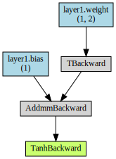

```python
from __future__ import print_function
import torch

print(torch.__version__)
```

    1.5.0+cpu
    

## ニューロンのモデル設計と活性化関数

- ニューロンへの入力＝$(w_1 \times X_1)+(w_2 \times X_2)+b$
- ニューロンからの出力＝$a((w_1 \times X_1)+(w_2 \times X_2)+b)$
  - $a()$は活性化関数を意味する。つまりニューロンの入力結果を、活性化関数で変換したうえで、出力する
  - 今回の活性化関数は、**tanh**関数とする
- ニューロンの構造とデータ入力：座標$(X_1, X_2)$
  - 入力の数（`INPUT_FEATURES`）は、$X_1$と$X_2$で**2つ**
  - ニューロンの数（`OUTPUT_NEURONS`）は、**1つ**


```python
"""1つのニューロンの定義
"""
import torch
import torch.nn as nn    # NNモジュールの定義

# 変数の定義
activation = torch.nn.Tanh() # 活性化関数 tanh関数

"""
  順伝播モデルの定義
"""
class Neural_Network(nn.Module):
    def __init__(self):
        """初期化
        入力層の定義
        
        parameter
        INPUT_FEATURE: 入力のデータ数     2
        OUTPUT_NEURON: 出力のニューロン数 1
        """
        super(Neural_Network, self).__init__()    # __init__メソッドの実行
        # 第一層の定義
        self.layer1 = nn.Linear(   # 全結合層
            2,                     # 入力のデータ数
            1                      # 出力のニューロン数
        )
        
    def forward(self, input):
        # フォワードパスの定義
        output = activation(self.layer1(input)) # 活性化関数を変数として定義
        # 「出力＝活性化関数（第n層（入力））」の形式で記述する。
        # 層（layer）を重ねる場合は、同様の記述を続ける
        # 「出力（output）」は次の層（layer）への「入力（input）」に使う。
        # 慣例では入力も出力も「x」と同じ変数名で記述する（よって以下では「x」と書く
        return output

# モデルのインスタンス化
model = Neural_Network()
print(model)        # モデルの概要の出力
```

    Neural_Network(
      (layer1): Linear(in_features=2, out_features=1, bias=True)
    )
    

ポイント：
- `torch.nn.Module`クラスを継承して独自にモデル用クラスを定義します
    - `__init__`関数にレイヤー（層）を定義します
    - `forward`関数にフォワードパス（＝活性化関数で変換しながらデータを流す処理）を実装します
    - バックプロパゲーション（誤差逆伝播）のための`backward`関数は自動微分機能により自動作成されます

- PyTorchでは、以下の活性化関数が用意されています
  - ELU
  - Hardshrink
  - Hardtanh
  - LeakyReLU
  - LogSigmoid
  - MultiheadAttention
  - PReLU
  - ReLU（有名）
  - ReLU6
  - RReLU
  - SELU
  - CELU
  - GELU
  - Sigmoid（シグモイド）
  - Softplus（ソフトプラス）
  - Softshrink
  - Softsign（ソフトサイン）
  - Tanh（ここで使用）
  - Tanhshrink
  - Threshold
  - Softmin
  - Softmax
  - Softmax2d
  - LogSoftmax
  - AdaptiveLogSoftmaxWithLoss

## パラメーター（重みとバイアス）の初期設定

- $w_1=0.6$、$w_2=-0.2$、$b=0.8$と仮定して、ニューロンのモデルを定義します。
  - ※これらの値は通常は学習により決まりますが、今回は未学習なので仮の固定数値を設定しています。
  - 重さ（$w_1$と$w_2$）は2次元配列でまとめて表記します： `weight_array`
    - 通常は、ニューロンは複数あるので、2次元配列で表記します
    - 重みが「行」、ニューロンが「列」を構成します
    - 今回は、重みが**2つ**で、ニューロンが**1つ**なので、**2行1列**で記述します
    -  `[[ 0.6],`<br>&nbsp;&nbsp;`[-0.2]]`
  - バイアス（$b$）は1次元配列でまとめて表記します： `bias_array`
    - `[0.8]`


```python
"""
パラメータの初期設定
"""
# 重みの定義
weight_array = nn.Parameter(
    torch.tensor([[0.6, -0.2]])
)
# バイアスの定義
bias_array = nn.Parameter(
    torch.tensor([0.8])
)

# 重みとバイアスの初期設定
model.layer1.weight = weight_array
model.layer1.bias = bias_array

# modelクラス全体の状態を辞書形式で取得
param = model.state_dict()

print(param)
```

    OrderedDict([('layer1.weight', tensor([[ 0.6000, -0.2000]])), ('layer1.bias', tensor([0.8000]))])
    

ポイント：
- モデルのパラメーターは`torch.nn.Parameter`オブジェクトとして定義します
  - `torch.nn.Parameter`クラスのコンストラクター（厳密には`__init__`関数）には`torch.Tensor`オブジェクト（以下、テンソル）を指定します
  - `torch.Tensor`のコンストラクターにはPythonの多次元リストを指定できます
  - NumPyの多次元配列からのテンソルの作成ができます
- 重みやバイアスの初期値設定：
  - `＜モデル名＞.＜レイヤー名＞.weight`プロパティに重みが指定できます
  - `＜モデル名＞.＜レイヤー名＞.baias`プロパティにバイアスが指定できます
  - 通常は「**0**」や「一様分布の <b>ランダムな値</b> 」などを指定します
- 重みやバイアスといったパラメーターなどの`torch.nn.Module`全体の状態は、`＜モデル名＞.state_dict()`メソッドで取得できます
  - パラメーターを最適化で使う際は、`＜モデル名＞.parameters()`メソッドで取得します

## フォワードプロパゲーション（順伝播）

順伝播の実行と結果の確認を行います
- ニューロンに、座標$(X_1, X_2)$データを入力します
  - 通常のデータは表形式（＝2次元配列）ですが、今回は$(1.0, 2.0)$という1つのデータを使用します
    - 1つのデータでも2次元配列（具体的には**1行2列**）で表現する必要があります


```python
"""
  順伝播の実行
"""
X_train = torch.tensor([[1, 2]], dtype=torch.float)    # 入力データ

y_pred = model(X_train)             # データを入力し、予測結果を取得
print(y_pred)
```

    tensor([[0.7616]], grad_fn=<TanhBackward>)
    

ポイント：
- フォワードプロパゲーション（順伝播）で、データ（`X_train`）を入力し、モデル（`model`）が推論した結果（`y_pred`）を出力しています
- その結果の数値は、手動で計算した値（`0.7616`）と同じになるのが確認できるはず
- `grad_fn`属性（この例では「TanhBackward」）には、勾配（偏微分）などを計算するための関数が自動作成されます。バックプロパゲーション（逆伝播）による学習の際に利用されます

### 動的な計算グラフの可視化


```python
# !pip install torchviz# 初回の「orchvizインストール時にのみ必要
```

    Collecting torchviz
      Downloading https://files.pythonhosted.org/packages/8f/8e/a9630c7786b846d08b47714dd363a051f5e37b4ea0e534460d8cdfc1644b/torchviz-0.0.1.tar.gz (41kB)
    Requirement already satisfied: torch in c:\users\anaconda3\lib\site-packages (from torchviz) (1.5.0+cpu)
    Requirement already satisfied: graphviz in c:\users\anaconda3\lib\site-packages (from torchviz) (0.13.2)
    Requirement already satisfied: future in c:\users\anaconda3\lib\site-packages (from torch->torchviz) (0.17.1)
    Requirement already satisfied: numpy in c:\users\anaconda3\lib\site-packages (from torch->torchviz) (1.16.2)
    Building wheels for collected packages: torchviz
      Building wheel for torchviz (setup.py): started
      Building wheel for torchviz (setup.py): finished with status 'done'
      Stored in directory: C:\Users\AppData\Local\pip\Cache\wheels\2a\c2\c5\b8b4d0f7992c735f6db5bfa3c5f354cf36502037ca2b585667
    Successfully built torchviz
    Installing collected packages: torchviz
    Successfully installed torchviz-0.0.1
    


```python
"""
  動的な計算グラフの可視化
"""
from torchviz import make_dot

make_dot(y_pred, params=dict(model.named_parameters()))
# 引数「params」には、全パラメーターの「名前: テンソル」の辞書を指定する。
# 「dict(model.named_parameters())」はその辞書を取得している
```





ポイント：
- 青色のボックス： 勾配を計算する必要のある、重みやバイアスなどのパラメーター。<br>この例では`(1, 2)`が重みで、`(1)`がバイアス
- 灰色のボックス： 勾配（偏微分）などを計算するための関数。<br>「テンソル」データの`grad_fn`属性（この例では「TBackward」や「AddmmBackward」）に自動作成されている。バックプロパゲーション（逆伝播）による学習の際に利用されます
- 緑色のボックス： グラフ計算の開始点。`backward()`メソッドを呼び出すと、ここから逆順に計算していく。内容は灰色のボックスと同じです

## バックプロパゲーション（逆伝播）と自動微分（Autograd）

### 簡単な式で自動微分してみる（わき道）

`backward()`メソッドでバックプロパゲーション（誤差逆伝播）を実行します。
ニューラルネットワークの誤差逆伝播もは、微分係数（derivative）の計算があります。ディープラーニングのライブラリは、この処理を自動化してくれます。
この機能を「自動微分（AD： Automatic differentiation）」や「Autograd」（gradients computed automatically： 自動計算された勾配）などと呼びます。

ちなみに詳細を知る必要はあまりないが、`torch.autograd`モジュールは厳密には「リバースモードの自動微分」機能を提供しており、vector-Jacobian product（VJP：ベクトル-ヤコビアン積）と呼ばれる計算を行うエンジンです（参考「[Autograd: Automatic Differentiation — PyTorch Tutorials 1.4.0 documentation](https://pytorch.org/tutorials/beginner/blitz/autograd_tutorial.html#sphx-glr-beginner-blitz-autograd-tutorial-py)」、論文「[Automatic differentiation in PyTorch | OpenReview](https://openreview.net/forum?id=BJJsrmfCZ)」）。

順伝播を実行する本線とはそれますが、PyTorchの自動微分（Autograd）機能を、非常にシンプルな例で確認します。

- 計算式： $y=x^2$
- 導関数： $\frac{dy}{dx}=2x$ （ $y$ を $x$ で微分する）
- 例えば $x$ が__1.0__の地点の勾配（＝接線の傾き）は__2.0__となる


```python
"""
  自動微分の実装
"""
x = torch.tensor(1.0, requires_grad=True)    # requires_grad=Trueで勾配を記録
# x.requires_grad_(True) このコードで後から変更することも可能

y = x**2    # 𝑦=𝑥2の計算式の計算グラフを構築

y.backward()# 逆伝播の実行、yの計算グラフから微分係数（＝勾配）を計算（自動微分：Autograd）
g = x.grad  # 入力xの勾配の値を取得
print(g)    # 出力
#「x=1.0」地点の勾配（＝接線の傾き）は「2.0」となり、出力結果は正しい。
# 例えば「x=0.0」地点の勾配は「0.0」、「x=10.0」地点の勾配は「20.0」
```

    tensor(2.)
    

- 出力されたテンソル（`y`）の`backward()`メソッドでバックプロパゲーション（逆伝播）を実行できます。なお、ニューラルネットワークの場合は、損失を表すテンソルの`backward()`メソッドを呼び出します。
  - 出力されたテンソルの計算式（`y`）を入力したテンソル(`x`)で微分計算しています
- 計算された微分係数（＝勾配：gradient）は、入力したテンソルの`grad`プロパティで取得できます

## ニューラルネットワークにおける各パラメーターの勾配計算

正解ラベルを`y_true`とし、$1$を定義して勾配を計算する


```python
"""
  バックプロパゲーション（逆伝播）による各パラメーターの勾配計算
"""
# 勾配計算の前にバラメータをリセット
model.layer1.weight.grad = None        # 重み
model.layer1.bias.grad = None          # バイアス
# model.zero_grad()                   # 上記と同じくリセットされる

X_train = torch.tensor([[1.0, 2.0]])    # 入力データ

y_pred = model(X_train)                 # 出力結果
y_true = torch.tensor([1.0])            # 正解ラベル

critierion = nn.MSELoss()               # 損失関数
loss = critierion(y_pred, y_true)       # 誤差から損失を取得
loss.backward()                         # 逆伝播の処理として勾配を計算

# 勾配計算の結果を取得
print(model.layer1.weight.grad)         # 重み
print(model.layer1.bias.grad)           # バイアス
# ※パラメーターは「list(model.parameters())」で取得することも可能
```

    C:\Users\Anaconda3\lib\site-packages\torch\nn\modules\loss.py:432: UserWarning: Using a target size (torch.Size([1])) that is different to the input size (torch.Size([1, 1])). This will likely lead to incorrect results due to broadcasting. Please ensure they have the same size.
      return F.mse_loss(input, target, reduction=self.reduction)
    

    tensor([[-0.2002, -0.4005]])
    tensor([-0.2002])
    
