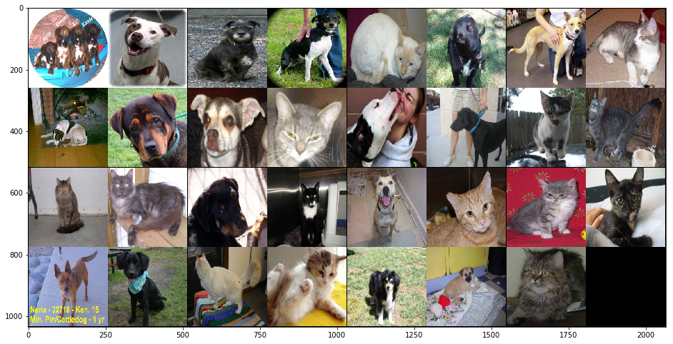
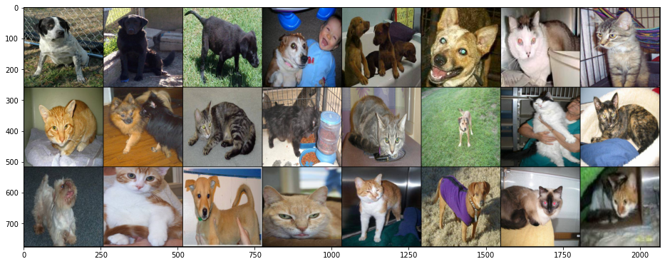

# フォルダ内の画像からデータセットを作成する

kaggleの[Dogs vs. Cats](https://www.kaggle.com/c/dogs-vs-cats)データをPyTorchで使用できるテンソル型に変換します。
- trainフォルダ内のjpgファイルから「名称に'cat'または'dog'が付くかでラベル付け」を行います。
- 読み込む画像は(256, 256)にリサイズします。


```python
import os

file_path = os.listdir('./data/train')

# file_pathの中から`cat`か`dog`かでファイルを分ける
cat_file = [file_name for file_name in file_path if 'cat' in file_name]    # 名称にcatがあるか
dog_file = [file_name for file_name in file_path if 'dog' in file_name]    # 名称にdogがあるか
```


```python
from torchvision import transforms

# 前処理内容の設定
transform = transforms.Compose([
    transforms.Resize((256, 256)),    # 画像のリサイズ
    transforms.ToTensor()             # テンソル型に変換
])
```

## カスタムデータセットの作成


```python
from PIL import Image
from torch.utils.data import Dataset

class CatDogDataset(Dataset):
    """カスタムデータセットの作成
    
    Param:
        Dataset: 継承するデータセット
    """
    def __init__(self, file_list, dir, transform=None):
        """
        Param:
            file_list: 継承する画像データセット
            dir: 
            transform: 
        """
        self.file_list = file_list
        self.dir = dir
        self.transform = transform
        
        # ラベルの定義
        if 'cat' in self.file_list[0]:
            # file_listの最初の名称が'cat'なら
            self.label = 0        # ラベルに0を設定
        elif 'dog' in self.file_list[0]:
            # file_listの最初の名称が'dog'なら
            self.label = 1        # ラベルに1を設定
    def __len__(self):
        """画像の枚数を返す(データ数の取得)
        組み込み関数len()を使用できるようにします。
        
        Example:
            x = CatDogDataset(file_list=[1, 2, 3, 4, 5], dir = dir_path)
            print(len(x))
            
            5
        """
        return len(self.file_list)
    def __getitem__(self, idx):
        """
        Param:
            idx: 継承する画像データセットのインデックス
        """
        # ファイルのパスの取得
        file_path = os.path.join(self.dir, self.file_list[idx])
        # ファイルを取得
        img = Image.open(file_path)
        
        if self.transform is not None:
            # 前処理がある場合
            # 前処理を実行
            img = self.transform(img)
            
        return img, self.label
```

## データセットを作成する


```python
from torch.utils.data import ConcatDataset

dir_path = './data/train'

# パス内の画像データセットから対象のファイルごとにデータセットを作成する
cat_dataset = CatDogDataset(cat_file, dir_path, transform)
dog_dataset = CatDogDataset(dog_file, dir_path, transform)

print('cat dataset size ', len(cat_dataset))
print('dog dataset size ', len(dog_dataset))

# 作成したデータセットを一つにまとめる
cat_dog_dataset = ConcatDataset([cat_dataset, dog_dataset])

print('cat&dog dataset ', len(cat_dog_dataset))
```

    cat dataset size  121
    dog dataset size  120
    cat&dog dataset  241
    

## データローダーの作成


```python
from torch.utils.data import DataLoader

# 定数（学習方法の設計時）
BATCH_SIZE = 32        # バッチサイズ

# データローダー（loader）の作成 ミニバッチを扱うため、データローダー（loader）を作成する
loader_cat_dog = DataLoader(cat_dog_dataset, batch_size=BATCH_SIZE, shuffle=True)
```

## データローダーから画像とラベルを取得


```python
data_iter = iter(loader_cat_dog)    # イタレータを取得

imgs, labels = data_iter.next()     # データイタレーターから画像とラベル
print(labels)
```

    tensor([1, 1, 1, 1, 0, 1, 1, 0, 1, 1, 1, 0, 1, 1, 0, 0, 0, 0, 1, 0, 1, 0, 0, 0,
            1, 1, 0, 0, 1, 1, 0, 1])
    

### 画像の表示


```python
import torchvision

import numpy as np
import matplotlib.pyplot as plt
%matplotlib inline

# データをまとめて取得
grid_imgs = torchvision.utils.make_grid(imgs[:31])
grid_imgs_arr = grid_imgs.numpy()    # データをNumpy変換

plt.figure(figsize=(16, 24))
# データを表示できるように並び替えて表示
plt.imshow(np.transpose(grid_imgs, (1, 2, 0)))
plt.show()

# 画像の正解値ラベルを表示
print(labels)
```





    tensor([1, 1, 1, 1, 0, 1, 1, 0, 1, 1, 1, 0, 1, 1, 0, 0, 0, 0, 1, 0, 1, 0, 0, 0,
            1, 1, 0, 0, 1, 1, 0, 1])
    

# GoogleColaboratoryでのカスタムデータセット作成

```python
from google.colab import files
```


```python
files.upload()
```


     <input type="file" id="files-2285ab3d-4463-4c93-a590-08e97a7d84be" name="files[]" multiple disabled />
     <output id="result-2285ab3d-4463-4c93-a590-08e97a7d84be">
      Upload widget is only available when the cell has been executed in the
      current browser session. Please rerun this cell to enable.
      </output>
      <script src="/nbextensions/google.colab/files.js"></script> 


    Saving train.zip to train.zip
    


    {'train.zip': b'PK\x03\x04\x14\x00\x00\x00\x08\x00\xb5P4C\x80b*pX/\x00\x00~0\x00\x00\x0f\x00\x00\x00train/cat.0.
        省略
    \x00\x00\x00v\x01Q\x00train/dog.99.jpgPK\x05\x06\x00\x00\x00\x00\xf1\x00\xf1\x00u:\x00\x00m\x87Q\x00\x00\x00'}


```python
!ls
```

    sample_data  train.zip
    


```python
import torch
import torchvision
from torchvision import transforms
from torch.utils.data import DataLoader, Dataset, ConcatDataset
from PIL import Image
import numpy as np
import matplotlib.pyplot as plt
import os
```


```python
!unzip train.zip
```

    Archive:  train.zip
      inflating: train/cat.0.jpg         
      inflating: train/cat.1.jpg         
      inflating: train/cat.10.jpg        
          省略      
      inflating: train/dog.98.jpg        
      inflating: train/dog.99.jpg        
    


```python
!ls train
```

    cat.0.jpg    cat.28.jpg  cat.65.jpg   dog.102.jpg  dog.30.jpg  dog.68.jpg
    cat.100.jpg  cat.29.jpg  cat.66.jpg   
        省略
    cat.26.jpg   cat.63.jpg  dog.100.jpg  dog.29.jpg   dog.66.jpg
    cat.27.jpg   cat.64.jpg  dog.101.jpg  dog.2.jpg    dog.67.jpg
    


```python
file_list = os.listdir("./train")
```


```python
cat_files = [file_name for file_name in file_list if "cat" in file_name]
dog_files = [file_name for file_name in file_list if "dog" in file_name]
```


```python
transform = transforms.Compose([
    transforms.Resize((256, 256)),
    transforms.ToTensor()
])
```


```python
class CatDogDataset(Dataset):
    def __init__(self, file_list, dir, transform=None):
        self.file_list = file_list
        self.dir = dir
        self.transform = transform
        if "dog" in self.file_list[0]:
            self.label = 1
        else:
            self.label = 0
    def __len__(self):
        return len(self.file_list)
    def __getitem__(self, idx):
        file_path = os.path.join(self.dir, self.file_list[idx])
        img = Image.open(file_path)
        if self.transform is not None:
            img = self.transform(img)
        return img, self.label
```


```python
dir_path = "train/"
cat_dataset = CatDogDataset(cat_files, dir_path, transform=transform)
```


```python
dir_path = "train/"
dog_dataset = CatDogDataset(dog_files, dir_path, transform=transform)
```


```python
cat_dog_dataset = ConcatDataset([cat_dataset, dog_dataset])
```


```python
data_loader = DataLoader(cat_dog_dataset, batch_size=32, shuffle=True)
```


```python
data_iter = iter(data_loader)
```


```python
imgs, labels = data_iter.next()
```


```python
labels
```


    tensor([1, 1, 1, 1, 1, 1, 0, 0, 0, 1, 0, 0, 0, 1, 0, 0, 1, 0, 1, 0, 0, 1, 0, 0,
            0, 1, 1, 1, 0, 0, 0, 1])


```python
grid_imgs = torchvision.utils.make_grid(imgs[:24])
```


```python
grid_imgs_arr = grid_imgs.numpy()
```


```python
plt.figure(figsize=(16, 24))
plt.imshow(np.transpose(grid_imgs_arr, (1, 2, 0)))
```


    <matplotlib.image.AxesImage at 0x7f7734e4c6d8>





