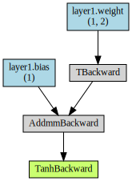

# 動的な計算グラフの可視化 torchviz.makedot

### 書式

```python
!pip install torchviz          # 初回の「torchviz」パッケージインストール時にのみ必要

X_train = torch.tensor([[1, 2]], dtype=torch.float)    # 入力データ

y_pred = model(X_train)             # データを入力し、予測結果を取得

make_dot(y_pred, params=dict(model.named_parameters()))

```

### 引数

	params: パラメーターの「名前: テンソル」の辞書を指定
			dict(model.named_parameters())」はその辞書を取得しています

### 例

```python
"""1つのニューロンの定義
"""
import torch
import torch.nn as nn    # NNモジュールの定義

# 変数の定義
activation = torch.nn.Tanh() # 活性化関数 tanh関数

"""
  順伝播モデルの定義
"""
class Neural_Network(nn.Module):
    def __init__(self):
        """初期化
        入力層の定義
        
        parameter
        INPUT_FEATURE: 入力のデータ数     2
        OUTPUT_NEURON: 出力のニューロン数 1
        """
        super(Neural_Network, self).__init__()    # __init__メソッドの実行
        # 第一層の定義
        self.layer1 = nn.Linear(   # 全結合層
            2,                     # 入力のデータ数
            1                      # 出力のニューロン数
        )
        
    def forward(self, input):
        # フォワードパスの定義
        output = activation(self.layer1(input)) # 活性化関数を変数として定義
        # 「出力＝活性化関数（第n層（入力））」の形式で記述する。
        # 層（layer）を重ねる場合は、同様の記述を続ける
        # 「出力（output）」は次の層（layer）への「入力（input）」に使う。
        # 慣例では入力も出力も「x」と同じ変数名で記述する（よって以下では「x」と書く
        return output

# モデルのインスタンス化
model = Neural_Network()

"""
パラメータの初期設定
"""
# 重みの定義
weight_array = nn.Parameter(
    torch.tensor([[0.6, -0.2]])
)
# バイアスの定義
bias_array = nn.Parameter(
    torch.tensor([0.8])
)

# 重みとバイアスの初期設定
model.layer1.weight = weight_array
model.layer1.bias = bias_array

# modelクラス全体の状態を辞書形式で取得
param = model.state_dict()

"""
  順伝播の実行
"""
X_train = torch.tensor([[1, 2]], dtype=torch.float)    # 入力データ

y_pred = model(X_train)             # データを入力し、予測結果を取得


from torchviz import make_dot

make_dot(y_pred, params=dict(model.named_parameters()))
```


### 説明
ポイント：
- 青色のボックス： 勾配を計算する必要がある、重みやバイアスなどのパラメーター。この例では`(1, 2)`が重みで、`(1)`がバイアス
- 灰色のボックス： 勾配（偏微分）などを計算するための関数。「テンソル」データの`grad_fn`属性（この例では「TBackward」や「AddmmBackward」）に自動作成されている。バックプロパゲーション（逆伝播）による学習の際に利用される
- 緑色のボックス： グラフ計算の開始点。`backward()`メソッドを呼び出すと、ここから逆順に計算していく。内容は灰色のボックスと同じ