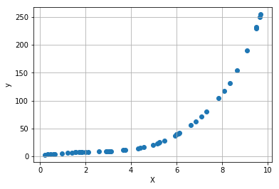
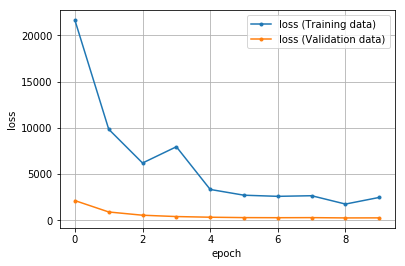
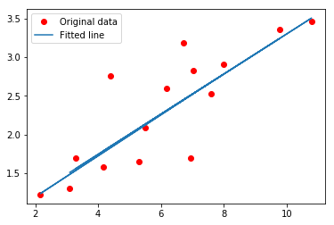

# 回帰問題

ニューラルネットワークは出力層のニューロン数を1にすることで回帰で利用することができます。
以下のsin波データを予測する4層のディープニューラルネットワークを実装します。

データの内訳
- X: 0～1まで20個データ
- y: 入力Xに対応するnoiseありのsin波

## 簡易版コード

```python
import torch
import torch.nn as nn
import numpy as np
import matplotlib.pyplot as plt

# hyper parameters
input_size = 1
layer1_neurons = 8
layer2_neurons = 4
output_size = 1
num_epochs = 100
learning_rate = 0.001
# toy dataset
# 15 samples, 1 features
x_train = np.array([3.3, 4.4, 5.5, 6.71, 6.93, 4.168, 9.779, 6.182, 7.59, 2.167,
                    7.042, 10.791, 5.313, 7.997, 3.1], dtype=np.float32)

y_train = np.array([1.7, 2.76, 2.09, 3.19, 1.694, 1.573, 3.366, 2.596, 2.53, 1.221,
                    2.827, 3.465, 1.65, 2.904, 1.3], dtype=np.float32)

x_train = x_train.reshape(15, 1)
y_train = y_train.reshape(15, 1)
# モデルの定義
class LinearRegression(nn.Module):
    def __init__(self):
        # 継承したnn.Module親クラスを初期化
        super(LinearRegression, self).__init__()
        
        """層の定義
        """
        # 出力層
        self.layer1 = nn.Linear(
            input_size,          # 入力層のユニット数
            layer1_neurons       # 次の層への出力ユニット数
        )
        # 隠れ層2
        self.layer2 = nn.Linear(
            layer1_neurons,      # 入力ユニット数
            layer2_neurons       # 次の層への出力ユニット数
        )
        # 出力層
        self.layer_out = nn.Linear(
            layer2_neurons,      # 入力ユニット数
            output_size          # 出力結果への出力ユニット数
        )
        
    def forward(self, x):
        """フォワードパスの定義
        """
        # 出力＝活性化関数（第n層（入力））の形式
        x = activation1(self.layer1(x))    # 活性化関数は変数として定義
        x = activation2(self.layer2(x))    # 活性化関数は変数として定義
        x = self.layer_out(x)              # 出力層は1とする
        return x
    
    
model = LinearRegression()

# loss and optimizer
criterion = nn.MSELoss()
optimizer = torch.optim.SGD(model.parameters(), lr=learning_rate)

# train the model
for epoch in range(num_epochs):
    inputs = torch.from_numpy(x_train)
    targets = torch.from_numpy(y_train)

    optimizer.zero_grad()
    outputs = model(inputs)
    loss = criterion(outputs, targets)
    loss.backward()
    optimizer.step()
    
    if (epoch + 1) % 10 == 0:
        print('Epoch [%d/%d], Loss: %.4f' % (epoch + 1, num_epochs, loss.item()))
        
# plot the graph
predicted = model(torch.from_numpy(x_train)).detach().numpy()
plt.plot(x_train, y_train, 'ro', label='Original data')
plt.plot(x_train, predicted, label='Fitted line')
plt.legend()
plt.show()
```


```python
import numpy as np
import matplotlib.pyplot as plt
%matplotlib inline

np.random.seed(42)

'''
訓練データとして
sin波にノイズを加えたデータを作成する
'''
np.random.seed(42)

data_size = 50                         # 入力データとして使用するデータ数
X =  np.random.uniform(low= 0, high=10, size= data_size)        # 0～1までのデータを作成する

x1 = np.sin(X)
x2 = np.exp(X / 2)
x = np.stack([x1, x2], axis=1)

# -1～1までの値をデータサイズ個作成する
noise = np.random.uniform(low= -1.0, high=1.0, size= data_size)
y = 3 * x1 + 2 * x2 + noise * 0.2

plt.tight_layout()
plt.grid()
plt.scatter(X, y)
plt.xlabel('X')
plt.ylabel('y')
plt.show()

from sklearn.model_selection import train_test_split
X_train, X_valid, y_train, y_valid = train_test_split(x, y, test_size = 0.33, random_state = 42)
```





# データをテンソルに変換する

データをPyTorchで使用するためにテンソルに変換します


```python
import torch
print(torch.__version__)
```

    1.5.0+cpu
    


```python
# NumPy多次元配列からデータ型floatでテンソルに変換する
t_X_train = torch.from_numpy(X_train).float()
t_y_train = torch.from_numpy(y_train).float()
t_X_valid = torch.from_numpy(X_valid).float()
t_y_valid = torch.from_numpy(y_valid).float()

# 変換後のデータの確認
print(t_X_train[:5])
print(t_X_train.type)
```

    tensor([[ 2.4479e-02,  4.7520e+00],
            [-8.8314e-01,  1.3468e+01],
            [ 9.6555e-01,  2.5018e+00],
            [ 7.1564e-01,  3.4479e+01],
            [ 9.9008e-02,  4.5778e+00]])
    <built-in method type of Tensor object at 0x000001BBF88DA3F0>
    

## データローダーの作成


```python
from torch.utils.data import DataLoader, TensorDataset    # データ関連のユーティリティクラスのインポート

# 定数（学習方法の設計時）
BATCH_SIZE = 15        # バッチサイズ：15

# データセット（dataset）の作成 入力データ（X）と教師ラベル（y）をデータセットにまとめる
dt_train = TensorDataset(t_X_train, t_y_train)    # 訓練データ
dt_valid = TensorDataset(t_X_valid, t_y_valid)    # 評価データ精度検証

# データローダー（loader）の作成 ミニバッチを扱うため、データローダー（loader）を作成する
loader_train = DataLoader(dt_train, batch_size=BATCH_SIZE, shuffle=True)
loader_valid = DataLoader(dt_valid, batch_size=BATCH_SIZE)
```

## モデル定義


```python
import torch.nn as nn

# 定数
INPUT_FEATURES = 2        # 入力層のニューロン数
LAYER1_NEURONS = 3        # 隠れ層1のニューロン数
LAYER2_NEURONS = 2        # 隠れ層2のニューロン数
OUTPUT_RESULTS = 1        # 出力層のニューロン数

# 変数 活性化関数
activation1 = torch.nn.ReLU()    # 活性化関数（隠れ層）.ReLU関数    変更可
activation2 = torch.nn.ReLU()    # 活性化関数（隠れ層）.ReLU関数 変更可

# モデルの定義
class LinearRegression(nn.Module):
    def __init__(self):
        super(LinearRegression, self).__init__()
        
        """層の定義
        """
        # 隠れ層1
        self.layer1 = nn.Linear(
            INPUT_FEATURES,      # 入力層のユニット数
            LAYER1_NEURONS       # 次の層への出力ユニット数
        )
        # 隠れ層2
        self.layer2 = nn.Linear(
            LAYER1_NEURONS,      # 入力ユニット数
            LAYER2_NEURONS       # 次の層への出力ユニット数
        )
        # 出力層
        self.layer_out = nn.Linear(
            LAYER2_NEURONS,      # 入力ユニット数
            OUTPUT_RESULTS       # 出力結果への出力ユニット数
        )
        
    def forward(self, x):
        """フォワードパスの定義
        """
        # 出力＝活性化関数（第n層（入力））の形式
        x = activation1(self.layer1(x))    # 活性化関数は変数として定義
        x = activation2(self.layer2(x))    # 活性化関数は変数として定義
        x = self.layer_out(x)              # 出力層は1とする
        return x

# モデルのインスタンス化
model = LinearRegression()
print(model)                      # モデルの概要を出力        
```

    LinearRegression(
      (layer1): Linear(in_features=2, out_features=3, bias=True)
      (layer2): Linear(in_features=3, out_features=2, bias=True)
      (layer_out): Linear(in_features=2, out_features=1, bias=True)
    )
    

# 学習／最適化（オプティマイザー）

## オプティマイザー（最適化用オブジェクト）の作成


```python
import torch.optim as optim    # 最適化モジュールのインポート

# 定数
LEARN_RATE = 0.03        # 学習率

# オプティマイザーの作成（パラメータと学習率も作成）
optimizer = optim.SGD(    # 最適化アルゴリズムに「SGD」を選択
    model.parameters(),   # 最適化で更新する重みやバイアスのパラメータ
    lr=LEARN_RATE,        # 学習率
)
```

## 損失関数の定義


```python
# 変数
criterion = nn.MSELoss()   # 損失関数：平均二乗和誤差
```

# 1回分の「訓練（学習）」と「評価」の処理


```python
def train_step(train_X, train_y):
    """学習の実行
    訓練モードの設定
    フォワードプロパゲーションで出力結果の取得
    出力結果と正解ラベルから損失および勾配の計算
    勾配を使ってパラメーター（重みとバイアス）の更新
    正解率の算出
    
    Param:
      train_X: 入力データ
      train_y: 正解ラベル
    """
    # 学習モードに設定
    model.train()

    # フォワードプロパゲーションで出力結果を取得
    pred_y = model(train_X)    # フォワードプロパゲーションの結果を取得
    
    # 出力結果と正解ラベルから損失を計算し、勾配を計算
    optimizer.zero_grad()                # 勾配を0で初期化
    loss = criterion(pred_y, train_y)    # 誤差（出力結果と正解ラベルの差）から損失を取得
    loss.backward()                      # 逆伝播の処理として勾配を計算（自動微分）
    
    # 勾配を使ってパラメーター（重みとバイアス）を更新
    optimizer.step()                     # 最適化の実施
    
    # 損失をタプルで返す
    return (loss.item())     # item()でpythonの数値に変換

def valid_step(valid_X, valid_y):
    """評価（推論）検証
    評価モードの設定
    フォワードプロパゲーションで出力結果の取得
    出力結果と正解ラベルから損失の計算
    正解率の算出
    
    Param:
      valid_X: 入力データ
      valid_y: 正解ラベル
    """
    # 評価モードに設定（dropoutなどの挙動が評価用になる）
    model.eval()

    # フォワードプロパゲーションで出力結果を取得
    pred_y = model(valid_X)    # フォワードプロパゲーションの結果を取得
    
    # 出力結果と正解ラベルから損失を計算
    loss = criterion(pred_y, valid_y)    # 誤差（出力結果と正解ラベルの差）から損失を取得
    # 評価時は勾配を計算しない
    
    # 損失をタプルで返す
    return (loss.item())     # item()でpythonの数値に変換
```

# 「学習」と「評価」をバッチサイズ単位でエポック回繰り返す


```python
def init_parameters(layer):
    """パラメータ（重みとバイアス）の初期化
    引数の層が全結合層の時パラメータを初期化する
    
    Param:
      layer: 層情報
    """
    if type(layer) == nn.Linear:
        nn.init.xavier_uniform_(layer.weight)    # 重みを「一様分布のランダム値」で初期化
        layer.bias.data.fill_(0.0)               # バイアスを「0」で初期化

model.apply(init_parameters)        # 学習の前にパラメーター初期化

# 定数
EPOCHS = 10        # エポック数

# 変数　学習用と評価用の平均変数
avg_loss = 0.0           # 訓練用の平均損失値
avg_val_loss = 0.0       # 評価用の平均損失値

# 損失の履歴を保存するための変数
train_hist = []
valid_hist = []

for epoch in range(EPOCHS):
    # forループ内で使う変数と、エポックごとの値リセット
    total_loss = 0.0     # 訓練時における累計損失値
    
    total_val_loss = 0.0 # 評価時における累計損失値
    
    total_train = 0      # 訓練時における累計データ数
    total_valid = 0      # 評価時における累計データ数

    for train_X, train_y in loader_train:
        """
        1ミニバッチ分の「訓練」を実行
        """
        loss = train_step(train_X, train_y)

        # 取得した損失値と正解率を累計値側に足していく
        total_loss += loss          # 訓練用の累計損失値
        total_train += len(train_y) # 訓練データの累計数

    for valid_X, valid_y in loader_valid:
        """
        1ミニバッチ分の「評価（精度検証）」を実行
        """
        val_loss = valid_step(valid_X, valid_y)

        # 取得した損失値と正解率を累計値側に足す
        total_val_loss += val_loss  # 評価用の累計損失値
        total_valid += len(valid_y) # 評価データの累計数
        
    # ミニバッチ単位で累計してきた損失値や正解率の平均を取る
    n = epoch + 1                             # 処理済みのエポック数
    avg_loss = total_loss / n                 # 訓練用の平均損失値
    avg_val_loss = total_val_loss / n         # 評価用の平均損失値

    # グラフ描画のために損失の履歴を保存する
    train_hist.append(avg_loss)
    valid_hist.append(avg_val_loss)

    # 損失や正解率などの情報を表示
    print(f'[Epoch {epoch+1:3d}/{EPOCHS:3d}]' \
          f' loss: {avg_loss:.5f}' \
          f' val_loss: {avg_val_loss:.5f}')

print('Finished Training')
print(model.state_dict())  # 学習後のパラメーターの情報を表示
```


    [Epoch   1/ 10] loss: 21627.81433 val_loss: 2141.13264
    [Epoch   2/ 10] loss: 9847.16244 val_loss: 910.98402
    [Epoch   3/ 10] loss: 6201.41952 val_loss: 560.42054
    [Epoch   4/ 10] loss: 7957.94165 val_loss: 416.17672
    [Epoch   5/ 10] loss: 3345.32435 val_loss: 344.65311
    [Epoch   6/ 10] loss: 2722.54234 val_loss: 302.85609
    [Epoch   7/ 10] loss: 2600.41846 val_loss: 291.11106
    [Epoch   8/ 10] loss: 2666.92200 val_loss: 300.15403
    [Epoch   9/ 10] loss: 1765.29000 val_loss: 269.05998
    [Epoch  10/ 10] loss: 2484.37363 val_loss: 274.27850
    Finished Training
    OrderedDict([('layer1.weight', tensor([[ 0.0883, -0.2338],
            [ 0.1345,  0.7896],
            [-0.1427,  0.8525]])), ('layer1.bias', tensor([-0.1792,  0.2252, -0.0332])), ('layer2.weight', tensor([[ 0.4959, -0.9627, -0.3561],
            [-0.5908, -0.9664, -0.5641]])), ('layer2.bias', tensor([-0.2852,  0.0000])), ('layer_out.weight', tensor([[-0.6619,  0.5131]])), ('layer_out.bias', tensor([47.2425]))])
    

## 損失値の推移グラフ描画


```python
# 学習結果（損失）のグラフを描画
epochs = len(train_hist)
plt.plot(range(epochs), train_hist, marker='.', label='loss (Training data)')
plt.plot(range(epochs), valid_hist, marker='.', label='loss (Validation data)')
plt.legend(loc='best')
plt.grid()
plt.xlabel('epoch')
plt.ylabel('loss')
plt.show()
```





```python
import torch
import torch.nn as nn
import numpy as np
import matplotlib.pyplot as plt

# hyper parameters
input_size = 1
layer1_neurons = 8
layer2_neurons = 4
output_size = 1
num_epochs = 100
learning_rate = 0.001
```


```python
# toy dataset
# 15 samples, 1 features
x_train = np.array([3.3, 4.4, 5.5, 6.71, 6.93, 4.168, 9.779, 6.182, 7.59, 2.167,
                    7.042, 10.791, 5.313, 7.997, 3.1], dtype=np.float32)

y_train = np.array([1.7, 2.76, 2.09, 3.19, 1.694, 1.573, 3.366, 2.596, 2.53, 1.221,
                    2.827, 3.465, 1.65, 2.904, 1.3], dtype=np.float32)

x_train = x_train.reshape(15, 1)
y_train = y_train.reshape(15, 1)
```


```python
# linear regression model
# class LinearRegression(nn.Module):

#     def __init__(self, input_size, output_size):
#         super(LinearRegression, self).__init__()
#         self.linear = nn.Linear(input_size, output_size)
    
#     def forward(self, x):
#         out = self.linear(x)
#         return out
    
# モデルの定義
class LinearRegression(nn.Module):
    def __init__(self):
        super(LinearRegression, self).__init__()
        
        """層の定義
        """
        # 出力層
        self.layer1 = nn.Linear(
            input_size,          # 入力層のユニット数
            layer1_neurons       # 次の層への出力ユニット数
        )
        # 隠れ層2
        self.layer2 = nn.Linear(
            layer1_neurons,      # 入力ユニット数
            layer2_neurons       # 次の層への出力ユニット数
        )
        # 出力層
        self.layer_out = nn.Linear(
            layer2_neurons,      # 入力ユニット数
            output_size          # 出力結果への出力ユニット数
        )
        
    def forward(self, x):
        """フォワードパスの定義
        """
        # 出力＝活性化関数（第n層（入力））の形式
        x = activation1(self.layer1(x))    # 活性化関数は変数として定義
        x = activation2(self.layer2(x))    # 活性化関数は変数として定義
        x = self.layer_out(x)              # 出力層は1とする
        return x
    
    
model = LinearRegression()
```


```python
# loss and optimizer
criterion = nn.MSELoss()
optimizer = torch.optim.SGD(model.parameters(), lr=learning_rate)
```


```python
# train the model
for epoch in range(num_epochs):
    inputs = torch.from_numpy(x_train)
    targets = torch.from_numpy(y_train)

    optimizer.zero_grad()
    outputs = model(inputs)
    loss = criterion(outputs, targets)
    loss.backward()
    optimizer.step()
    
    if (epoch + 1) % 10 == 0:
        print('Epoch [%d/%d], Loss: %.4f' % (epoch + 1, num_epochs, loss.item()))
```

    Epoch [10/100], Loss: 4.3410
    Epoch [20/100], Loss: 4.0584
    Epoch [30/100], Loss: 3.6529
    Epoch [40/100], Loss: 3.0163
    Epoch [50/100], Loss: 2.1028
    Epoch [60/100], Loss: 1.1302
    Epoch [70/100], Loss: 0.4894
    Epoch [80/100], Loss: 0.2435
    Epoch [90/100], Loss: 0.1827
    Epoch [100/100], Loss: 0.1712
    


```python
# plot the graph
predicted = model(torch.from_numpy(x_train)).detach().numpy()
plt.plot(x_train, y_train, 'ro', label='Original data')
plt.plot(x_train, predicted, label='Fitted line')
plt.legend()
plt.show()
```




