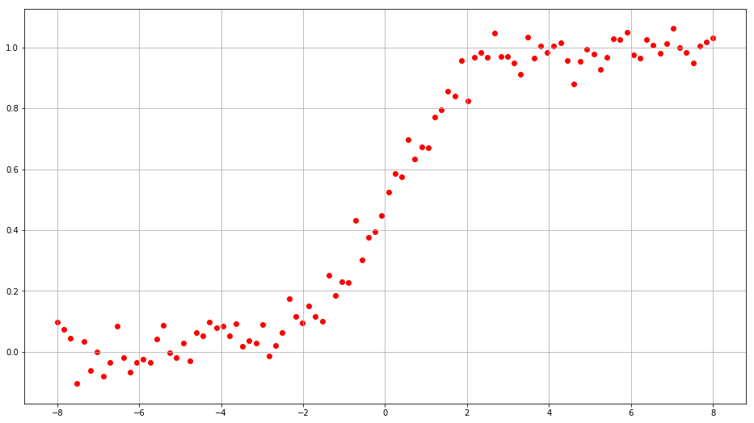
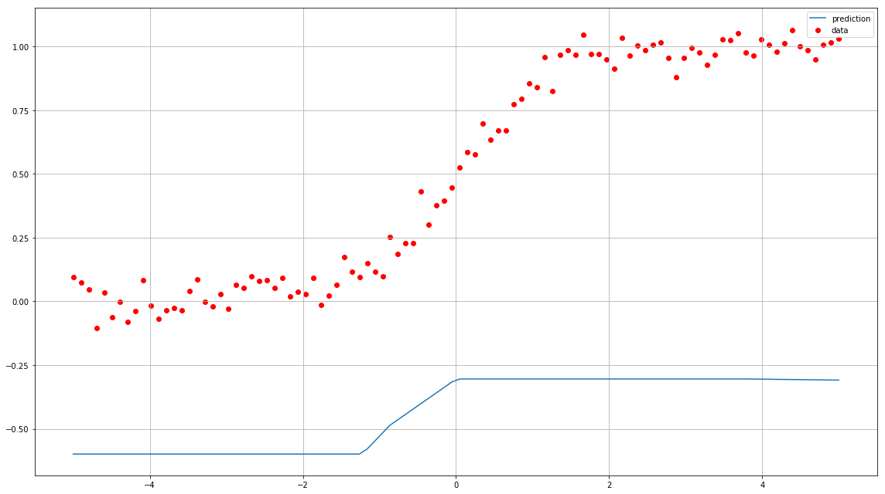
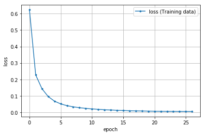
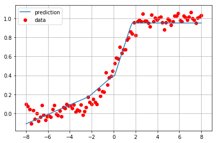
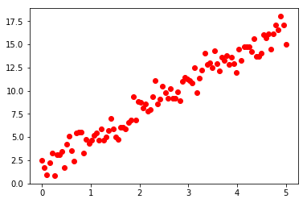
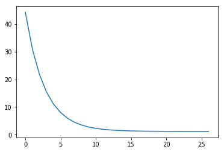
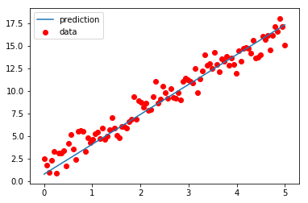

# 回帰

ニューラルネットワークは出力層のニューロン数を1にすることで回帰で利用することができます。
以下のsigmoid関数データを予測する4層のディープニューラルネットワークを実装します。

データの内訳
- X: 0～1まで20個データ
- y: 入力Xに対応するnoiseありのsigmoid関数


```python
import torch
print(torch.__version__)
import numpy as np
import matplotlib.pyplot as plt
%matplotlib inline
'''
訓練データとして
シグモイド関数ににノイズを加えたデータを作成する
'''
torch.manual_seed(42)
np.random.seed(42)
# 定数
DATA_SIZE = 100                                                             # データ数

def sigmoid_noise(x):
    noise = torch.randn(DATA_SIZE, 1) * 0.05                                # (DATA_SIZE, 1)サイズのをテンソルデータを作成し、0.05倍する
    y = 1 / (1 + np.exp(-x)) + noise.reshape(DATA_SIZE, 1)                  # シグモイド関数にノイズを追加する
    return y
# .view(DATA_SIZE, 1)pytorchで順伝播する際には、(バッチサイズの次元、入力データの次元)となる必要があるため変換
X = torch.linspace(-8, 8, DATA_SIZE, dtype=torch.float).view(DATA_SIZE, 1)  # -8～8までdata_size刻みのデータを
y = sigmoid_noise(X)

plt.subplots(figsize=(16, 9))                                             # 表示サイズ指定
plt.scatter(X, y, color='r')                                              # 散布図
plt.grid()
plt.show()
```

    1.5.0+cpu
    





## モデル定義


```python
import torch.nn as nn

# 定数
INPUT_FEATURES = 1        # 入力層のニューロン数
LAYER1_NEURONS = 3        # 隠れ層1のニューロン数
LAYER2_NEURONS = 2        # 隠れ層2のニューロン数
OUTPUT_RESULTS = 1        # 出力層のニューロン数

# 変数 活性化関数
activation1 = torch.nn.ReLU()    # 活性化関数（隠れ層）.ReLU関数    変更可
activation2 = torch.nn.ReLU()    # 活性化関数（隠れ層）.ReLU関数 変更可

# モデルの定義
class LinearRegression(nn.Module):
    def __init__(self):
        # 継承したnn.Module親クラスを初期化
        super(LinearRegression, self).__init__()
        
        """層の定義
        """
        # 隠れ層1
        self.layer1 = nn.Linear(
            INPUT_FEATURES,      # 入力層のユニット数
            LAYER1_NEURONS       # 次の層への出力ユニット数
        )
        # 隠れ層2
        self.layer2 = nn.Linear(
            LAYER1_NEURONS,      # 入力ユニット数
            LAYER2_NEURONS       # 次の層への出力ユニット数
        )
        # 出力層
        self.layer_out = nn.Linear(
            LAYER2_NEURONS,      # 入力ユニット数
            OUTPUT_RESULTS       # 出力結果への出力ユニット数
        )
        
    def forward(self, x):
        """フォワードパスの定義
        """
        # 出力＝活性化関数（第n層（入力））の形式
        x = activation1(self.layer1(x))
        x = activation2(self.layer2(x))
        x = self.layer_out(x)              # 出力層は1とする
        return x

# モデルのインスタンス化
model = LinearRegression()
print(model)                      # モデルの概要を出力       
```

    LinearRegression(
      (layer1): Linear(in_features=1, out_features=3, bias=True)
      (layer2): Linear(in_features=3, out_features=2, bias=True)
      (layer_out): Linear(in_features=2, out_features=1, bias=True)
    )
    

## 学習前のモデルの予測状態を確認（蛇足）


```python
X_test = torch.tensor([[1.0], [2.0]])   # テスト用データとして1.0と2.0のデータを使用
model(X_test)                           # 順伝播の実行
```


    tensor([[-0.3043],
            [-0.3043]], grad_fn=<AddmmBackward>)


```python
ds = 100
x2 = torch.linspace(-5, 5, ds).view(ds, 1)   # -5～5のハンデ100×1のデータを作成（バッチサイズ100, 入力データの次元）
x2.size()
```


    torch.Size([100, 1])


```python
y_pred = model(x2)                      # 予測結果を取得
```


```python
# 予測結果の表示
plt.subplots(figsize=(16, 9))                                   # 表示サイズ指定
plt.scatter(x2, y, color='r', label='data')                     # 散布図
# detach()することで勾配計算をしない設定にする
plt.plot(x2, y_pred.detach(), label='prediction')
plt.tight_layout()
plt.legend()
plt.grid()
plt.show()
```





# 学習／最適化（オプティマイザー）

## 損失関数の定義


```python
# 変数
criterion = nn.MSELoss()   # 損失関数：平均二乗和誤差
```

## オプティマイザー（最適化用オブジェクト）の作成


```python
import torch.optim as optim    # 最適化モジュールのインポート

# 定数
LEARN_RATE = 0.03        # 学習率

# オプティマイザーの作成（パラメータと学習率も作成）
optimizer = optim.SGD(    # 最適化アルゴリズムに「SGD」を選択
    model.parameters(),   # 最適化で更新する重みやバイアスのパラメータ
    lr=LEARN_RATE,        # 学習率
)
```

# 「学習」と「評価」をエポック回繰り返す


```python
# 学習にかかる時間を測定する
import time

# 定数
start = time.time()             # 実行開始時間の取得

def init_parameters(layer):
    """パラメータ（重みとバイアス）の初期化
    引数の層が全結合層の時パラメータを初期化する
    
    Param:
      layer: 層情報
    """
    if type(layer) == nn.Linear:
        nn.init.xavier_uniform_(layer.weight)    # 重みを「一様分布のランダム値」で初期化
        layer.bias.data.fill_(0.0)               # バイアスを「0」で初期化

model.apply(init_parameters)        # 学習の前にパラメーター初期化

# 定数
EPOCHS = 256        # エポック数

# 変数
# 損失の履歴を保存するための変数
losses = []
# 記録したエポック数を保存
epochs = 0
for epoch in range(EPOCHS):
    # フォワードプロパゲーションで出力結果を取得
    pred_y = model(X)                           # 順伝播の結果を取得
    # 出力結果と正解ラベルから損失を計算し、勾配を計算
    optimizer.zero_grad()                       # 勾配を0で初期化
    loss = criterion(pred_y, y)           # 誤差（出力結果と正解ラベルの差）から損失を取得
    loss.backward()                             # 逆伝播の処理として勾配を計算（自動微分）
    
    # 勾配を使ってパラメーター（重みとバイアス）を更新
    optimizer.step()                            # 最適化の実施

    if epoch % 10 == 0:
        # 10epoch刻みで損失を表示
        print(f'[Epoch {epoch+1:3d}/{EPOCHS:3d}]' \
            f' loss: {loss.item():.5f}')
        losses.append(loss.item())
        epochs += 1
# 学習後の損失を表示
print()
print('Finished Training')
print(f'[Epoch {epoch+1:3d}/{EPOCHS:3d}]' \
    f' loss: {loss.item():.5f}')
losses.append(loss.item())
epochs += 1

print('Finished Parameter')
print(model.state_dict())  # 学習後のパラメーターの情報を表示

# 学習終了後、学習に要した時間を出力
print("Computation time:{0:.3f} sec".format(time.time() - start))

```

    [Epoch   1/256] loss: 0.62295
    [Epoch  11/256] loss: 0.22736
    [Epoch  21/256] loss: 0.14369
    [Epoch  31/256] loss: 0.09605
    [Epoch  41/256] loss: 0.06828
    [Epoch  51/256] loss: 0.05152
    [Epoch  61/256] loss: 0.04089
    [Epoch  71/256] loss: 0.03367
    [Epoch  81/256] loss: 0.02839
    [Epoch  91/256] loss: 0.02429
    [Epoch 101/256] loss: 0.02102
    [Epoch 111/256] loss: 0.01840
    [Epoch 121/256] loss: 0.01609
    [Epoch 131/256] loss: 0.01424
    [Epoch 141/256] loss: 0.01255
    [Epoch 151/256] loss: 0.01123
    [Epoch 161/256] loss: 0.00995
    [Epoch 171/256] loss: 0.00899
    [Epoch 181/256] loss: 0.00814
    [Epoch 191/256] loss: 0.00750
    [Epoch 201/256] loss: 0.00693
    [Epoch 211/256] loss: 0.00648
    [Epoch 221/256] loss: 0.00614
    [Epoch 231/256] loss: 0.00584
    [Epoch 241/256] loss: 0.00559
    [Epoch 251/256] loss: 0.00539
    
    Finished Training
    [Epoch 256/256] loss: 0.00531
    Finished Parameter
    OrderedDict([('layer1.weight', tensor([[-0.1068],
            [ 0.2824],
            [ 0.6090]])), ('layer1.bias', tensor([ 0.2198,  0.0173, -0.0187])), ('layer2.weight', tensor([[ 0.8629,  1.0053, -0.8521],
            [ 0.3546, -0.4710, -0.1195]])), ('layer2.bias', tensor([ 0.3172, -0.1641])), ('layer_out.weight', tensor([[-1.0811,  1.3168]])), ('layer_out.bias', tensor([0.9503]))])
    Computation time:0.216 sec
    

## 損失値の推移グラフ描画


```python
plt.plot(range(epochs), losses, marker='.', label='loss (Training data)')
plt.legend(loc='best')
plt.xlabel('epoch')
plt.ylabel('loss')
plt.tight_layout()
plt.grid()
plt.show()
```





```python
# 作成したモデル
x_test = torch.linspace(-8, 8, 100).view(100, 1)
y_test = model(x_test)
plt.plot(x_test, y_test.detach(), label='prediction')
plt.scatter(X, y, label='data', color='r')
plt.legend(loc='best')
plt.tight_layout()
plt.grid()
plt.show()
```





# 単回帰分析


```python
import torch
import torch.nn as nn
import torch.optim as optim
import matplotlib.pyplot as plt
import numpy as np
%matplotlib inline
```


```python
a = 3
b = 2
X = torch.linspace(0, 5, 100).view(100, 1)
```


```python
eps = torch.randn(100, 1)
y = a * X + b + eps
```


```python
plt.scatter(X, y, color='r')
```


    <matplotlib.collections.PathCollection at 0x2606e367e48>





```python
import torch.nn as nn

# 定数
INPUT_FEATURES = 1        # 入力層のニューロン数
OUTPUT_RESULTS = 1        # 出力層のニューロン数

# モデルの定義
class LinearRegression(nn.Module):
    def __init__(self):
        super(LinearRegression, self).__init__()
        
        """層の定義
        """
        # 出力層
        self.layer_out = nn.Linear(
            INPUT_FEATURES,      # 入力層のユニット数
            OUTPUT_RESULTS       # 出力結果への出力ユニット数
        )
        
    def forward(self, x):
        """フォワードパスの定義
        """
        # 出力＝活性化関数（第n層（入力））の形式
        x = self.layer_out(x)              # 出力層は1とする
        return x

# モデルのインスタンス化
model = LinearRegression()
print(model)                      # モデルの概要を出力
```

    LinearRegression(
      (layer_out): Linear(in_features=1, out_features=1, bias=True)
    )
    


```python
criterion = nn.MSELoss()
optimizer = optim.SGD(model.parameters(), lr=0.001)
```


```python
# 学習にかかる時間を測定する
import time

# 定数
start = time.time()             # 実行開始時間の取得

def init_parameters(layer):
    """パラメータ（重みとバイアス）の初期化
    引数の層が全結合層の時パラメータを初期化する
    
    Param:
      layer: 層情報
    """
    if type(layer) == nn.Linear:
        nn.init.xavier_uniform_(layer.weight)    # 重みを「一様分布のランダム値」で初期化
        layer.bias.data.fill_(0.0)               # バイアスを「0」で初期化

model.apply(init_parameters)        # 学習の前にパラメーター初期化

# 定数
EPOCHS = 256        # エポック数

# 変数
# 損失の履歴を保存するための変数
losses = []
# 記録したエポック数を保存
epochs = 0
for epoch in range(EPOCHS):
    # フォワードプロパゲーションで出力結果を取得
    pred_y = model(X)                           # 順伝播の結果を取得
    # 出力結果と正解ラベルから損失を計算し、勾配を計算
    optimizer.zero_grad()                       # 勾配を0で初期化
    loss = criterion(pred_y, y)           # 誤差（出力結果と正解ラベルの差）から損失を取得
    loss.backward()                             # 逆伝播の処理として勾配を計算（自動微分）
    
    # 勾配を使ってパラメーター（重みとバイアス）を更新
    optimizer.step()                            # 最適化の実施

    if epoch % 10 == 0:
        # 10epoch刻みで損失を表示
        print(f'[Epoch {epoch+1:3d}/{EPOCHS:3d}]' \
            f' loss: {loss.item():.5f}')
        losses.append(loss.item())
        epochs += 1
# 学習後の損失を表示
print()
print('Finished Training')
print(f'[Epoch {epoch+1:3d}/{EPOCHS:3d}]' \
    f' loss: {loss.item():.5f}')
losses.append(loss.item())
epochs += 1

print('Finished Parameter')
print(model.state_dict())  # 学習後のパラメーターの情報を表示

# 学習終了後、学習に要した時間を出力
print("Computation time:{0:.3f} sec".format(time.time() - start))
```

    [Epoch   1/256] loss: 44.26781
    [Epoch  11/256] loss: 30.98530
    [Epoch  21/256] loss: 21.80137
    [Epoch  31/256] loss: 15.45103
    [Epoch  41/256] loss: 11.05971
    [Epoch  51/256] loss: 8.02276
    [Epoch  61/256] loss: 5.92218
    [Epoch  71/256] loss: 4.46897
    [Epoch  81/256] loss: 3.46334
    [Epoch  91/256] loss: 2.76714
    [Epoch 101/256] loss: 2.28488
    [Epoch 111/256] loss: 1.95054
    [Epoch 121/256] loss: 1.71847
    [Epoch 131/256] loss: 1.55711
    [Epoch 141/256] loss: 1.44465
    [Epoch 151/256] loss: 1.36601
    [Epoch 161/256] loss: 1.31075
    [Epoch 171/256] loss: 1.27167
    [Epoch 181/256] loss: 1.24378
    [Epoch 191/256] loss: 1.22363
    [Epoch 201/256] loss: 1.20885
    [Epoch 211/256] loss: 1.19778
    [Epoch 221/256] loss: 1.18929
    [Epoch 231/256] loss: 1.18259
    [Epoch 241/256] loss: 1.17713
    [Epoch 251/256] loss: 1.17254
    
    Finished Training
    [Epoch 256/256] loss: 1.17049
    Finished Parameter
    OrderedDict([('layer_out.weight', tensor([[3.3100]])), ('layer_out.bias', tensor([0.7654]))])
    Computation time:0.154 sec
    


```python
plt.plot(losses)
```


    [<matplotlib.lines.Line2D at 0x2606e3d22e8>]





```python
x_test = torch.linspace(0, 5, 100).view(100, 1)
y_test = model(x_test)
plt.plot(x_test, y_test.detach(), label='prediction')
plt.scatter(X, y, label='data', color='r')
plt.legend()
```


    <matplotlib.legend.Legend at 0x2606e31c518>





```python

```
