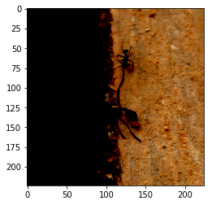
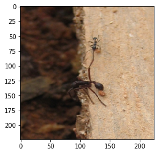
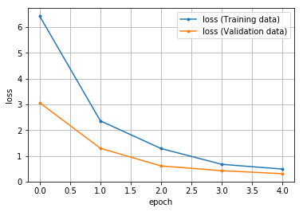
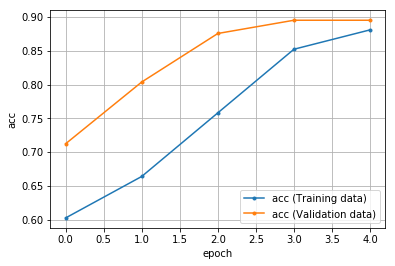
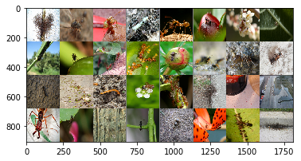

学習済みのモデルResNetを使用して転移学習を

PyTorch 公式チュートリアルで使用されている蟻と蜂のデータセット([リンク](https://download.pytorch.org/tutorial/hymenoptera_data.zip))を使い
転移学習を行います。

読み込んだモデルの最後の出力だけを`2`に変更し、モデルパラメータは出力層(fc)のみを渡して学習を行います。


## 画像データの取得


```python
# !pip install download
```

    Collecting download
      Downloading https://files.pythonhosted.org/packages/37/45/01e7455a9659528e77a414b222326d4c525796e4f571bbabcb2e0ff3d1f4/download-0.3.5-py3-none-any.whl
    Requirement already satisfied: tqdm in c:\users\anaconda3\lib\site-packages (from download) (4.31.1)
    Requirement already satisfied: requests in c:\users\anaconda3\lib\site-packages (from download) (2.21.0)
    Requirement already satisfied: six in c:\users\anaconda3\lib\site-packages (from download) (1.12.0)
    Requirement already satisfied: urllib3<1.25,>=1.21.1 in c:\users\anaconda3\lib\site-packages (from requests->download) (1.24.1)
    Requirement already satisfied: certifi>=2017.4.17 in c:\users\anaconda3\lib\site-packages (from requests->download) (2019.11.28)
    Requirement already satisfied: idna<2.9,>=2.5 in c:\users\anaconda3\lib\site-packages (from requests->download) (2.8)
    Requirement already satisfied: chardet<3.1.0,>=3.0.2 in c:\users\anaconda3\lib\site-packages (from requests->download) (3.0.4)
    Installing collected packages: download
    Successfully installed download-0.3.5
    


```python
from download import download

url = 'https://download.pytorch.org/tutorial/hymenoptera_data.zip'
download(url, './hymenoptera_data.zip')        # urlと保存先のパス、ファイル名
```

    Downloading data from https://download.pytorch.org/tutorial/hymenoptera_data.zip (45.1 MB)
    
    file_sizes: 100%|██████████████████████████| 47.3M/47.3M [00:12<00:00, 3.72MB/s]
    Successfully downloaded file to ./hymenoptera_data.zip
    


    './hymenoptera_data.zip'


```python
# zipファイルの解凍
import zipfile

with zipfile.ZipFile('./hymenoptera_data.zip','r') as file:
    file.extractall()
```


```python
# 解凍したデータフォルダの構造を確認する
!ls hymenoptera_data/
```

    train
    val
    

#### データをテンソルに変換


```python
import torch
import torchvision
import torchvision.transforms as transforms

# transform の定義
# ToTensor で Tensorに変換し
# 画像サイズを(224, 224)で統一
# 標準化 平均0,5、標準偏差0.5
# Resizeの前にtransforms.ToTensor()を入れるとエラーになるので注意
transform = transforms.Compose(
    [transforms.Resize((224, 224)),                                         # データを(224, 224)に統一する
     # transforms.RandomHorizontalFlip(),                                     # ランダムに左右を入れ替える
     # transforms.ColorJitter(),                                              # ランダムに画像の閾値を変える
     # transforms.RandomRotation(10),                                         # ランダムに画像の回転（±10°）
     transforms.ToTensor(),
     transforms.Normalize((0.5, ), (0.5, ))])                               # 平均0,5、標準偏差0.5で標準化

```


```python
# 解凍した画像データをデータセットに格納する
# 扱うデータが画像でクラスごとにフォルダ分けされているのでImageFolder()を使用
# 最初から画像毎にフォルダが分かれている場合にはImageFolder、そうでない場合は後で説明をするカスタムデータセットを使う
df_train = torchvision.datasets.ImageFolder(
    root='./hymenoptera_data/train',
    transform=transform
)
df_valid = torchvision.datasets.ImageFolder(
    root='./hymenoptera_data/val',
    transform=transform
)
```

#### データローダーの作成


```python
from torch.utils.data import DataLoader, TensorDataset    # データ関連のユーティリティクラスのインポート

# 定数（学習方法の設計時）
BATCH_SIZE = 32        # バッチサイズ

# データローダー（loader）の作成 ミニバッチを扱うため、データローダー（loader）を作成する
loader_train = DataLoader(df_train, batch_size=BATCH_SIZE,
                          shuffle=True)
loader_valid = DataLoader(df_valid, batch_size=BATCH_SIZE, 
                          shuffle=False)
```

#### 作成したデータの確認


```python
# 作成したデータの形状の確認
data_iter = iter(loader_train)
imgs, labels = data_iter.next()

print('image_size {}\nlabel {}'.format(imgs.size(), labels))    # ミニバッチの次元32, チャネルRGBの3, サイズ(224, 224)
```

    image_size torch.Size([32, 3, 224, 224])
    label tensor([0, 1, 1, 0, 1, 0, 1, 1, 1, 0, 0, 0, 1, 0, 1, 0, 1, 0, 0, 1, 0, 1, 0, 1,
            0, 1, 0, 0, 1, 0, 0, 0])
    


```python
import numpy as np
import matplotlib.pyplot as plt
%matplotlib inline

img = imgs[0]        # 最初の画像を抜き出す
img_permute = img.permute(1, 2, 0)    # 画像の順番をチャネルラストに変更

img_permute = np.clip(img_permute, 0, 1) # 画像の最小値を0・最大値1に設定
plt.imshow(img_permute)
```


    <matplotlib.image.AxesImage at 0x1d0aabcf9b0>





```python
# 画像の明るさを調整して再表示
img = imgs[0]        # 最初の画像を抜き出す
img_permute = img.permute(1, 2, 0)    # 画像の順番をチャネルラストに変更

img_permute = 0.5 * img_permute + 0.5 # 画像の明るさを調整
img_permute = np.clip(img_permute, 0, 1)
plt.imshow(img_permute)
print(labels[0])
```

    tensor(0)
    





## モデルの定義

#### モデルの読み込み


```python
# 学習済みのモデルをロード
model = torchvision.models.resnet18(pretrained=True)
```

    Downloading: "https://download.pytorch.org/models/resnet18-5c106cde.pth" to C:\Users/.cache\torch\checkpoints\resnet18-5c106cde.pth
    


    HBox(children=(IntProgress(value=0, max=46827520), HTML(value='')))


    
    


```python
model    # モデル概要の確認
```


    ResNet(
      (conv1): Conv2d(3, 64, kernel_size=(7, 7), stride=(2, 2), padding=(3, 3), bias=False)
      (bn1): BatchNorm2d(64, eps=1e-05, momentum=0.1, affine=True, track_running_stats=True)
      (relu): ReLU(inplace=True)
      (maxpool): MaxPool2d(kernel_size=3, stride=2, padding=1, dilation=1, ceil_mode=False)
      (layer1): Sequential(
        (0): BasicBlock(
          (conv1): Conv2d(64, 64, kernel_size=(3, 3), stride=(1, 1), padding=(1, 1), bias=False)
          (bn1): BatchNorm2d(64, eps=1e-05, momentum=0.1, affine=True, track_running_stats=True)
          (relu): ReLU(inplace=True)
          (conv2): Conv2d(64, 64, kernel_size=(3, 3), stride=(1, 1), padding=(1, 1), bias=False)
          (bn2): BatchNorm2d(64, eps=1e-05, momentum=0.1, affine=True, track_running_stats=True)
        )
        (1): BasicBlock(
          (conv1): Conv2d(64, 64, kernel_size=(3, 3), stride=(1, 1), padding=(1, 1), bias=False)
          (bn1): BatchNorm2d(64, eps=1e-05, momentum=0.1, affine=True, track_running_stats=True)
          (relu): ReLU(inplace=True)
          (conv2): Conv2d(64, 64, kernel_size=(3, 3), stride=(1, 1), padding=(1, 1), bias=False)
          (bn2): BatchNorm2d(64, eps=1e-05, momentum=0.1, affine=True, track_running_stats=True)
        )
      )
      (layer2): Sequential(
        (0): BasicBlock(
          (conv1): Conv2d(64, 128, kernel_size=(3, 3), stride=(2, 2), padding=(1, 1), bias=False)
          (bn1): BatchNorm2d(128, eps=1e-05, momentum=0.1, affine=True, track_running_stats=True)
          (relu): ReLU(inplace=True)
          (conv2): Conv2d(128, 128, kernel_size=(3, 3), stride=(1, 1), padding=(1, 1), bias=False)
          (bn2): BatchNorm2d(128, eps=1e-05, momentum=0.1, affine=True, track_running_stats=True)
          (downsample): Sequential(
            (0): Conv2d(64, 128, kernel_size=(1, 1), stride=(2, 2), bias=False)
            (1): BatchNorm2d(128, eps=1e-05, momentum=0.1, affine=True, track_running_stats=True)
          )
        )
        (1): BasicBlock(
          (conv1): Conv2d(128, 128, kernel_size=(3, 3), stride=(1, 1), padding=(1, 1), bias=False)
          (bn1): BatchNorm2d(128, eps=1e-05, momentum=0.1, affine=True, track_running_stats=True)
          (relu): ReLU(inplace=True)
          (conv2): Conv2d(128, 128, kernel_size=(3, 3), stride=(1, 1), padding=(1, 1), bias=False)
          (bn2): BatchNorm2d(128, eps=1e-05, momentum=0.1, affine=True, track_running_stats=True)
        )
      )
      (layer3): Sequential(
        (0): BasicBlock(
          (conv1): Conv2d(128, 256, kernel_size=(3, 3), stride=(2, 2), padding=(1, 1), bias=False)
          (bn1): BatchNorm2d(256, eps=1e-05, momentum=0.1, affine=True, track_running_stats=True)
          (relu): ReLU(inplace=True)
          (conv2): Conv2d(256, 256, kernel_size=(3, 3), stride=(1, 1), padding=(1, 1), bias=False)
          (bn2): BatchNorm2d(256, eps=1e-05, momentum=0.1, affine=True, track_running_stats=True)
          (downsample): Sequential(
            (0): Conv2d(128, 256, kernel_size=(1, 1), stride=(2, 2), bias=False)
            (1): BatchNorm2d(256, eps=1e-05, momentum=0.1, affine=True, track_running_stats=True)
          )
        )
        (1): BasicBlock(
          (conv1): Conv2d(256, 256, kernel_size=(3, 3), stride=(1, 1), padding=(1, 1), bias=False)
          (bn1): BatchNorm2d(256, eps=1e-05, momentum=0.1, affine=True, track_running_stats=True)
          (relu): ReLU(inplace=True)
          (conv2): Conv2d(256, 256, kernel_size=(3, 3), stride=(1, 1), padding=(1, 1), bias=False)
          (bn2): BatchNorm2d(256, eps=1e-05, momentum=0.1, affine=True, track_running_stats=True)
        )
      )
      (layer4): Sequential(
        (0): BasicBlock(
          (conv1): Conv2d(256, 512, kernel_size=(3, 3), stride=(2, 2), padding=(1, 1), bias=False)
          (bn1): BatchNorm2d(512, eps=1e-05, momentum=0.1, affine=True, track_running_stats=True)
          (relu): ReLU(inplace=True)
          (conv2): Conv2d(512, 512, kernel_size=(3, 3), stride=(1, 1), padding=(1, 1), bias=False)
          (bn2): BatchNorm2d(512, eps=1e-05, momentum=0.1, affine=True, track_running_stats=True)
          (downsample): Sequential(
            (0): Conv2d(256, 512, kernel_size=(1, 1), stride=(2, 2), bias=False)
            (1): BatchNorm2d(512, eps=1e-05, momentum=0.1, affine=True, track_running_stats=True)
          )
        )
        (1): BasicBlock(
          (conv1): Conv2d(512, 512, kernel_size=(3, 3), stride=(1, 1), padding=(1, 1), bias=False)
          (bn1): BatchNorm2d(512, eps=1e-05, momentum=0.1, affine=True, track_running_stats=True)
          (relu): ReLU(inplace=True)
          (conv2): Conv2d(512, 512, kernel_size=(3, 3), stride=(1, 1), padding=(1, 1), bias=False)
          (bn2): BatchNorm2d(512, eps=1e-05, momentum=0.1, affine=True, track_running_stats=True)
        )
      )
      (avgpool): AdaptiveAvgPool2d(output_size=(1, 1))
      (fc): Linear(in_features=512, out_features=1000, bias=True)
    )


#### 出力層のモデル以外は勾配計算しないようにする


```python
for param in model.parameters():
    param.requires_grad = False    # 勾配計算しない
```

#### 出力層の出力を2にする

今回の学習内容は蟻か蜂の2クラス分類なので出力を2に変更します


```python
import torch.nn as nn

# 定数
INPUT__NEURONS = 512      # 出力層のニューロン数
OUTPUT_RESULTS = 2        # 出力層のニューロン数

model.fc = nn.Linear(
    in_features=INPUT__NEURONS,     # 入力ユニット数
    out_features=OUTPUT_RESULTS,    # 出力結果への出力ユニット数
)

model    # モデル概要の確認
```


    ResNet(
      (conv1): Conv2d(3, 64, kernel_size=(7, 7), stride=(2, 2), padding=(3, 3), bias=False)
      (bn1): BatchNorm2d(64, eps=1e-05, momentum=0.1, affine=True, track_running_stats=True)
      (relu): ReLU(inplace=True)
      (maxpool): MaxPool2d(kernel_size=3, stride=2, padding=1, dilation=1, ceil_mode=False)
      (layer1): Sequential(
        (0): BasicBlock(
          (conv1): Conv2d(64, 64, kernel_size=(3, 3), stride=(1, 1), padding=(1, 1), bias=False)
          (bn1): BatchNorm2d(64, eps=1e-05, momentum=0.1, affine=True, track_running_stats=True)
          (relu): ReLU(inplace=True)
          (conv2): Conv2d(64, 64, kernel_size=(3, 3), stride=(1, 1), padding=(1, 1), bias=False)
          (bn2): BatchNorm2d(64, eps=1e-05, momentum=0.1, affine=True, track_running_stats=True)
        )
        (1): BasicBlock(
          (conv1): Conv2d(64, 64, kernel_size=(3, 3), stride=(1, 1), padding=(1, 1), bias=False)
          (bn1): BatchNorm2d(64, eps=1e-05, momentum=0.1, affine=True, track_running_stats=True)
          (relu): ReLU(inplace=True)
          (conv2): Conv2d(64, 64, kernel_size=(3, 3), stride=(1, 1), padding=(1, 1), bias=False)
          (bn2): BatchNorm2d(64, eps=1e-05, momentum=0.1, affine=True, track_running_stats=True)
        )
      )
      (layer2): Sequential(
        (0): BasicBlock(
          (conv1): Conv2d(64, 128, kernel_size=(3, 3), stride=(2, 2), padding=(1, 1), bias=False)
          (bn1): BatchNorm2d(128, eps=1e-05, momentum=0.1, affine=True, track_running_stats=True)
          (relu): ReLU(inplace=True)
          (conv2): Conv2d(128, 128, kernel_size=(3, 3), stride=(1, 1), padding=(1, 1), bias=False)
          (bn2): BatchNorm2d(128, eps=1e-05, momentum=0.1, affine=True, track_running_stats=True)
          (downsample): Sequential(
            (0): Conv2d(64, 128, kernel_size=(1, 1), stride=(2, 2), bias=False)
            (1): BatchNorm2d(128, eps=1e-05, momentum=0.1, affine=True, track_running_stats=True)
          )
        )
        (1): BasicBlock(
          (conv1): Conv2d(128, 128, kernel_size=(3, 3), stride=(1, 1), padding=(1, 1), bias=False)
          (bn1): BatchNorm2d(128, eps=1e-05, momentum=0.1, affine=True, track_running_stats=True)
          (relu): ReLU(inplace=True)
          (conv2): Conv2d(128, 128, kernel_size=(3, 3), stride=(1, 1), padding=(1, 1), bias=False)
          (bn2): BatchNorm2d(128, eps=1e-05, momentum=0.1, affine=True, track_running_stats=True)
        )
      )
      (layer3): Sequential(
        (0): BasicBlock(
          (conv1): Conv2d(128, 256, kernel_size=(3, 3), stride=(2, 2), padding=(1, 1), bias=False)
          (bn1): BatchNorm2d(256, eps=1e-05, momentum=0.1, affine=True, track_running_stats=True)
          (relu): ReLU(inplace=True)
          (conv2): Conv2d(256, 256, kernel_size=(3, 3), stride=(1, 1), padding=(1, 1), bias=False)
          (bn2): BatchNorm2d(256, eps=1e-05, momentum=0.1, affine=True, track_running_stats=True)
          (downsample): Sequential(
            (0): Conv2d(128, 256, kernel_size=(1, 1), stride=(2, 2), bias=False)
            (1): BatchNorm2d(256, eps=1e-05, momentum=0.1, affine=True, track_running_stats=True)
          )
        )
        (1): BasicBlock(
          (conv1): Conv2d(256, 256, kernel_size=(3, 3), stride=(1, 1), padding=(1, 1), bias=False)
          (bn1): BatchNorm2d(256, eps=1e-05, momentum=0.1, affine=True, track_running_stats=True)
          (relu): ReLU(inplace=True)
          (conv2): Conv2d(256, 256, kernel_size=(3, 3), stride=(1, 1), padding=(1, 1), bias=False)
          (bn2): BatchNorm2d(256, eps=1e-05, momentum=0.1, affine=True, track_running_stats=True)
        )
      )
      (layer4): Sequential(
        (0): BasicBlock(
          (conv1): Conv2d(256, 512, kernel_size=(3, 3), stride=(2, 2), padding=(1, 1), bias=False)
          (bn1): BatchNorm2d(512, eps=1e-05, momentum=0.1, affine=True, track_running_stats=True)
          (relu): ReLU(inplace=True)
          (conv2): Conv2d(512, 512, kernel_size=(3, 3), stride=(1, 1), padding=(1, 1), bias=False)
          (bn2): BatchNorm2d(512, eps=1e-05, momentum=0.1, affine=True, track_running_stats=True)
          (downsample): Sequential(
            (0): Conv2d(256, 512, kernel_size=(1, 1), stride=(2, 2), bias=False)
            (1): BatchNorm2d(512, eps=1e-05, momentum=0.1, affine=True, track_running_stats=True)
          )
        )
        (1): BasicBlock(
          (conv1): Conv2d(512, 512, kernel_size=(3, 3), stride=(1, 1), padding=(1, 1), bias=False)
          (bn1): BatchNorm2d(512, eps=1e-05, momentum=0.1, affine=True, track_running_stats=True)
          (relu): ReLU(inplace=True)
          (conv2): Conv2d(512, 512, kernel_size=(3, 3), stride=(1, 1), padding=(1, 1), bias=False)
          (bn2): BatchNorm2d(512, eps=1e-05, momentum=0.1, affine=True, track_running_stats=True)
        )
      )
      (avgpool): AdaptiveAvgPool2d(output_size=(1, 1))
      (fc): Linear(in_features=512, out_features=2, bias=True)
    )


## オプティマイザー（最適化用オブジェクト）の作成


```python
import torch.optim as optim    # 最適化モジュールのインポート

# 定数
LEARN_RATE = 0.001       # 学習率
MOMENTUM =  0.9          # モーメンタム

# オプティマイザーの作成（パラメータと学習率も作成）
optimizer = optim.SGD(    # 最適化アルゴリズムに「SGD」を選択
    # モデルパラメータは出力層(fc)のみを渡す
    model.fc.parameters(),# 最適化で更新する重みやバイアスのパラメータ 
    lr=LEARN_RATE,        # 学習率
    momentum=MOMENTUM     # モーメンタム（移動平均 を適用して、振動を抑制）
)
```

## 損失関数の定義


```python
# 変数
criterion = nn.CrossEntropyLoss()   # 損失関数：交差エントロピー 学習データの正解率を出力
```

## 1回分の「訓練（学習）」と「評価」の処理


```python
def train_step(train_X, train_y):
    """学習の実行
    訓練モードの設定
    フォワードプロパゲーションで出力結果の取得
    出力結果と正解ラベルから損失および勾配の計算
    勾配を使ってパラメーター（重みとバイアス）の更新
    正解率の算出
    
    Param:
      train_X: 入力データ
      train_y: 正解ラベル
    """
    # 学習モードに設定
    model.train()

    # フォワードプロパゲーションで出力結果を取得
    pred_y = model(train_X)    # フォワードプロパゲーションの結果を取得
    
    # 出力結果と正解ラベルから損失を計算し、勾配を計算
    optimizer.zero_grad()                # 勾配を0で初期化
    loss = criterion(pred_y, train_y)    # 誤差（出力結果と正解ラベルの差）から損失を取得
    loss.backward()                      # 逆伝播の処理として勾配を計算（自動微分）
    
    # 勾配を使ってパラメーター（重みとバイアス）を更新
    optimizer.step()                     # 最適化の実施
    
    # 正解数の算出
    with torch.no_grad():                # 勾配は計算しないモードに設定
        # disc_y = discretize(pred_y)      # 確率値から-1 or 1に学習結果を変換
        
        _, disc_y = torch.max(pred_y, 1) # 予測した確率の最大値を予測結果として出力
        
        acc = (disc_y == train_y).sum()  # 正解数を取得
    
    # 損失と正解数をタプルで返す
    return (loss.item(), acc.item())     # item()でpythonの数値に変換

def valid_step(valid_X, valid_y):
    """評価（推論）検証
    評価モードの設定
    フォワードプロパゲーションで出力結果の取得
    出力結果と正解ラベルから損失の計算
    正解率の算出
    
    Param:
      valid_X: 入力データ
      valid_y: 正解ラベル
    """
    # 評価モードに設定（dropoutなどの挙動が評価用になる）
    model.eval()

    # フォワードプロパゲーションで出力結果を取得
    pred_y = model(valid_X)    # フォワードプロパゲーションの結果を取得
    
    # 出力結果と正解ラベルから損失を計算
    loss = criterion(pred_y, valid_y)    # 誤差（出力結果と正解ラベルの差）から損失を取得
    # 評価時は勾配を計算しない
    
    # 正解数の算出
    with torch.no_grad():                # 勾配は計算しないモードに設定
        # disc_y = discretize(pred_y)      # 確率値から-1 or 1に学習結果を変換
        _, disc_y = torch.max(pred_y, 1) # 予測した確率の最大値を予測結果として出力
        
        acc = (disc_y == valid_y).sum()  # 正解数を取得
    
    # 損失と正解数をタプルで返す
    return (loss.item(), acc.item())     # item()でpythonの数値に変換
```

## 「学習」と「評価」をバッチサイズ単位でエポック回繰り返す


```python
def init_parameters(layer):
    """パラメータ（重みとバイアス）の初期化
    引数の層が全結合層の時パラメータを初期化する
    
    Param:
      layer: 層情報
    """
    if type(layer) == nn.Linear:
        nn.init.xavier_uniform_(layer.weight)    # 重みを「一様分布のランダム値」で初期化
        layer.bias.data.fill_(0.0)               # バイアスを「0」で初期化


model.apply(init_parameters)        # 学習の前にパラメーター初期化

# 学習にかかる時間を測定する
import time

# 定数
start = time.time()             # 実行開始時間の取得

# 定数
EPOCHS = 5        # エポック数

# 変数　学習用と評価用の平均変数
avg_loss = 0.0           # 訓練用の平均損失値
avg_acc = 0.0            # 訓練用の平均正解率

avg_val_loss = 0.0       # 評価用の平均損失値
avg_val_acc = 0.0        # 評価用の平均正解率

# 損失の履歴を保存するための変数
train_hist_loss = []
valid_hist_loss = []
# 正解数の履歴を保存するための変数
train_hist_acc = []
valid_hist_acc = []

for epoch in range(EPOCHS):
    # forループ内で使う変数と、エポックごとの値リセット
    total_loss = 0.0     # 訓練時における累計損失値
    total_acc = 0.0      # 訓練時における累計正解数
    
    total_val_loss = 0.0 # 評価時における累計損失値
    total_val_acc = 0.0  # 評価時における累計正解数
    
    total_train = 0      # 訓練時における累計データ数
    total_valid = 0      # 評価時における累計データ数

    for train_X, train_y in loader_train:
        """
        1ミニバッチ分の「訓練」を実行
        """
        loss, acc = train_step(train_X, train_y)

        # 取得した損失値と正解率を累計値側に足していく
        total_loss += loss          # 訓練用の累計損失値
        total_acc += acc            # 訓練用の累計正解数
        total_train += len(train_y) # 訓練データの累計数
            
    for valid_X, valid_y in loader_valid:
        """
        1ミニバッチ分の「評価（精度検証）」を実行
        """
        val_loss, val_acc = valid_step(valid_X, valid_y)

        # 取得した損失値と正解率を累計値側に足す
        total_val_loss += val_loss  # 評価用の累計損失値
        total_val_acc += val_acc    # 評価用の累計正解数
        total_valid += len(valid_y) # 訓練データの累計数
        
    # ミニバッチ単位で累計してきた損失値や正解率の平均を取る
    n = epoch + 1                             # 処理済みのエポック数
    avg_loss = total_loss / n                 # 訓練用の平均損失値
    avg_acc = total_acc / total_train         # 訓練用の平均正解率
    avg_val_loss = total_val_loss / n         # 訓練用の平均損失値
    avg_val_acc = total_val_acc / total_valid # 訓練用の平均正解率

    # グラフ描画のために損失の履歴を保存する
    train_hist_loss.append(avg_loss)
    valid_hist_loss.append(avg_val_loss)
    
    # グラフ描画のために正解数の履歴を保存する
    train_hist_acc.append(avg_acc)
    valid_hist_acc.append(avg_val_acc)
    
    # 損失や正解率などの情報を表示
    print(f'[Epoch {epoch+1:3d}/{EPOCHS:3d}]' \
          f' loss: {avg_loss:.5f}, acc: {avg_acc:.5f}' \
          f' val_loss: {avg_val_loss:.5f}, val_acc: {avg_val_acc:.5f}')

print('Finished Training')
# print(model.state_dict())  # 学習後のパラメーターの情報を表示

# 学習終了後、学習に要した時間を出力
print("Computation time:{0:.3f} sec".format(time.time() - start))

# 学習結果（損失）のグラフを描画
epochs = len(train_hist_loss)
plt.plot(range(epochs), train_hist_loss, marker='.', label='loss (Training data)')
plt.plot(range(epochs), valid_hist_loss, marker='.', label='loss (Validation data)')
plt.legend(loc='best')
plt.grid()
plt.xlabel('epoch')
plt.ylabel('loss')
plt.show()

# 学習結果（正解数）のグラフを描画
epochs = len(train_hist_acc)
plt.plot(range(epochs), train_hist_acc, marker='.', label='acc (Training data)')
plt.plot(range(epochs), valid_hist_acc, marker='.', label='acc (Validation data)')
plt.legend(loc='best')
plt.grid()
plt.xlabel('epoch')
plt.ylabel('acc')
plt.show()
```

    [Epoch   1/  5] loss: 6.42807, acc: 0.60246 val_loss: 3.05951, val_acc: 0.71242
    [Epoch   2/  5] loss: 2.35902, acc: 0.66393 val_loss: 1.29293, val_acc: 0.80392
    [Epoch   3/  5] loss: 1.28429, acc: 0.75820 val_loss: 0.60847, val_acc: 0.87582
    [Epoch   4/  5] loss: 0.67109, acc: 0.85246 val_loss: 0.42141, val_acc: 0.89542
    [Epoch   5/  5] loss: 0.48524, acc: 0.88115 val_loss: 0.30662, val_acc: 0.89542
    Finished Training
    Computation time:143.458 sec
    








## 予測結果の出力

学習した結果をテストデータで確認します。
テストデータの一部を見てみます。


```python
# クラス分類の一覧(分類後の出力値とラベルの対応付け)
classes = ('ant', 'bee')

# 画像表示関数
def imshow(img):
    """
    1. 標準化したデータを読込み時の状態身戻す
    2. Numpy変換し、データを表示できるよう並び替え
    （元データ[チャンネル, 縦サイズ, 横サイズ]構成を
    [縦サイズ, 横サイズ, チャンネル]に並び替えする）
    3. 画像として表示
    
    Param:
      img: 入力データ（テンソル型）
    """
    img = 0.5 * img + 0.5                     # 標準化したデータをもとに戻す
    npimg = img.numpy()                       # Numpy変換
    npimg = np.transpose(npimg, (1, 2, 0))    # データの並び替え
    plt.imshow(npimg)
    
    
# iter()してnext()でイテレータ内部の要素を1つずつ出力できるようにする
# イテレーションしてデータローダー作成時にランダム化したデータを取得
dt_iter = iter(loader_valid)

valid_images, valid_labels = dt_iter.next()       # イテレータの要素を1つ出力

# 複数の画像を横に並べる
valid_img = torchvision.utils.make_grid(valid_images)

imshow(valid_img)                                 # 画像を表示

# ラベルの表示
valid_label_image = []                            # ラベル格納空リスト
for i in range(32):
    valid_label_image.append(classes[labels[i]])  # ラベル名を追加

print(valid_label_image)
```

    ['ant', 'bee', 'bee', 'ant', 'bee', 'ant', 'bee', 'bee', 'bee', 'ant', 'ant', 'ant', 'bee', 'ant', 'bee', 'ant', 'bee', 'ant', 'ant', 'bee', 'ant', 'bee', 'ant', 'bee', 'ant', 'bee', 'ant', 'ant', 'bee', 'ant', 'ant', 'ant']
    





## modelを保存する


```python
torch.save(model.state_dict(), 'transfer_learning_torch.pth')    # state_dictはモデルの構造だけ保存
# 普通にsaveするとGPU等device関連情報も一緒に保存するため、別環境で動作する時に変換処理が必要です
```

## modelを読み込み再度予測を行う


```python
# モデルのパラメータのロード
param = torch.load('transfer_learning_torch.pth')
```

事前にモデルのインスタンス化が必要です。
（インスタンス化したモデルにロードしたパラメータを設定します）


```python
# 学習済みのモデルをロード
model = torchvision.models.resnet18(pretrained=True)
# 勾配計算しないようにする
for param in model.parameters():
    param.requires_grad = False    # 勾配計算しない
    
# 定数
INPUT__NEURONS = 512      # 出力層のニューロン数
OUTPUT_RESULTS = 2        # 出力層のニューロン数

model.fc = nn.Linear(
    in_features=INPUT__NEURONS,     # 入力ユニット数
    out_features=OUTPUT_RESULTS,    # 出力結果への出力ユニット数
)

model    # モデル概要の確認
```


    ResNet(
      (conv1): Conv2d(3, 64, kernel_size=(7, 7), stride=(2, 2), padding=(3, 3), bias=False)
      (bn1): BatchNorm2d(64, eps=1e-05, momentum=0.1, affine=True, track_running_stats=True)
      (relu): ReLU(inplace=True)
      (maxpool): MaxPool2d(kernel_size=3, stride=2, padding=1, dilation=1, ceil_mode=False)
      (layer1): Sequential(
        (0): BasicBlock(
          (conv1): Conv2d(64, 64, kernel_size=(3, 3), stride=(1, 1), padding=(1, 1), bias=False)
          (bn1): BatchNorm2d(64, eps=1e-05, momentum=0.1, affine=True, track_running_stats=True)
          (relu): ReLU(inplace=True)
          (conv2): Conv2d(64, 64, kernel_size=(3, 3), stride=(1, 1), padding=(1, 1), bias=False)
          (bn2): BatchNorm2d(64, eps=1e-05, momentum=0.1, affine=True, track_running_stats=True)
        )
        (1): BasicBlock(
          (conv1): Conv2d(64, 64, kernel_size=(3, 3), stride=(1, 1), padding=(1, 1), bias=False)
          (bn1): BatchNorm2d(64, eps=1e-05, momentum=0.1, affine=True, track_running_stats=True)
          (relu): ReLU(inplace=True)
          (conv2): Conv2d(64, 64, kernel_size=(3, 3), stride=(1, 1), padding=(1, 1), bias=False)
          (bn2): BatchNorm2d(64, eps=1e-05, momentum=0.1, affine=True, track_running_stats=True)
        )
      )
      (layer2): Sequential(
        (0): BasicBlock(
          (conv1): Conv2d(64, 128, kernel_size=(3, 3), stride=(2, 2), padding=(1, 1), bias=False)
          (bn1): BatchNorm2d(128, eps=1e-05, momentum=0.1, affine=True, track_running_stats=True)
          (relu): ReLU(inplace=True)
          (conv2): Conv2d(128, 128, kernel_size=(3, 3), stride=(1, 1), padding=(1, 1), bias=False)
          (bn2): BatchNorm2d(128, eps=1e-05, momentum=0.1, affine=True, track_running_stats=True)
          (downsample): Sequential(
            (0): Conv2d(64, 128, kernel_size=(1, 1), stride=(2, 2), bias=False)
            (1): BatchNorm2d(128, eps=1e-05, momentum=0.1, affine=True, track_running_stats=True)
          )
        )
        (1): BasicBlock(
          (conv1): Conv2d(128, 128, kernel_size=(3, 3), stride=(1, 1), padding=(1, 1), bias=False)
          (bn1): BatchNorm2d(128, eps=1e-05, momentum=0.1, affine=True, track_running_stats=True)
          (relu): ReLU(inplace=True)
          (conv2): Conv2d(128, 128, kernel_size=(3, 3), stride=(1, 1), padding=(1, 1), bias=False)
          (bn2): BatchNorm2d(128, eps=1e-05, momentum=0.1, affine=True, track_running_stats=True)
        )
      )
      (layer3): Sequential(
        (0): BasicBlock(
          (conv1): Conv2d(128, 256, kernel_size=(3, 3), stride=(2, 2), padding=(1, 1), bias=False)
          (bn1): BatchNorm2d(256, eps=1e-05, momentum=0.1, affine=True, track_running_stats=True)
          (relu): ReLU(inplace=True)
          (conv2): Conv2d(256, 256, kernel_size=(3, 3), stride=(1, 1), padding=(1, 1), bias=False)
          (bn2): BatchNorm2d(256, eps=1e-05, momentum=0.1, affine=True, track_running_stats=True)
          (downsample): Sequential(
            (0): Conv2d(128, 256, kernel_size=(1, 1), stride=(2, 2), bias=False)
            (1): BatchNorm2d(256, eps=1e-05, momentum=0.1, affine=True, track_running_stats=True)
          )
        )
        (1): BasicBlock(
          (conv1): Conv2d(256, 256, kernel_size=(3, 3), stride=(1, 1), padding=(1, 1), bias=False)
          (bn1): BatchNorm2d(256, eps=1e-05, momentum=0.1, affine=True, track_running_stats=True)
          (relu): ReLU(inplace=True)
          (conv2): Conv2d(256, 256, kernel_size=(3, 3), stride=(1, 1), padding=(1, 1), bias=False)
          (bn2): BatchNorm2d(256, eps=1e-05, momentum=0.1, affine=True, track_running_stats=True)
        )
      )
      (layer4): Sequential(
        (0): BasicBlock(
          (conv1): Conv2d(256, 512, kernel_size=(3, 3), stride=(2, 2), padding=(1, 1), bias=False)
          (bn1): BatchNorm2d(512, eps=1e-05, momentum=0.1, affine=True, track_running_stats=True)
          (relu): ReLU(inplace=True)
          (conv2): Conv2d(512, 512, kernel_size=(3, 3), stride=(1, 1), padding=(1, 1), bias=False)
          (bn2): BatchNorm2d(512, eps=1e-05, momentum=0.1, affine=True, track_running_stats=True)
          (downsample): Sequential(
            (0): Conv2d(256, 512, kernel_size=(1, 1), stride=(2, 2), bias=False)
            (1): BatchNorm2d(512, eps=1e-05, momentum=0.1, affine=True, track_running_stats=True)
          )
        )
        (1): BasicBlock(
          (conv1): Conv2d(512, 512, kernel_size=(3, 3), stride=(1, 1), padding=(1, 1), bias=False)
          (bn1): BatchNorm2d(512, eps=1e-05, momentum=0.1, affine=True, track_running_stats=True)
          (relu): ReLU(inplace=True)
          (conv2): Conv2d(512, 512, kernel_size=(3, 3), stride=(1, 1), padding=(1, 1), bias=False)
          (bn2): BatchNorm2d(512, eps=1e-05, momentum=0.1, affine=True, track_running_stats=True)
        )
      )
      (avgpool): AdaptiveAvgPool2d(output_size=(1, 1))
      (fc): Linear(in_features=512, out_features=2, bias=True)
    )


```python
correct = 0                                # 全検証データの正解数
total = 0                                  # 全検証データ数
with torch.no_grad():
    for data in loader_valid:
        inputs, labels = data
        # 評価モードに設定（dropoutなどの挙動が評価用になる）
        model.eval()
        # フォワードプロパゲーションで出力結果を取得
        pred_y = model(inputs)    # フォワードプロパゲーションの結果を取得
        # 出力結果を1まで範囲に変化し、その最大値を取得
        _, disc_y = torch.max(pred_y, 1)
        
        acc = (disc_y == labels).sum()     # 正解数の計算
        correct += acc.numpy()
        
        le = len(labels.numpy())           # データ数を取得
        total += le
        # print(acc.numpy() / le)            # 正解率の表示

print('Accuracy of the network on the 10000 valid images: %d %%' % (
    100 * correct / total))
```

    Accuracy of the network on the 10000 valid images: 52 %
    
