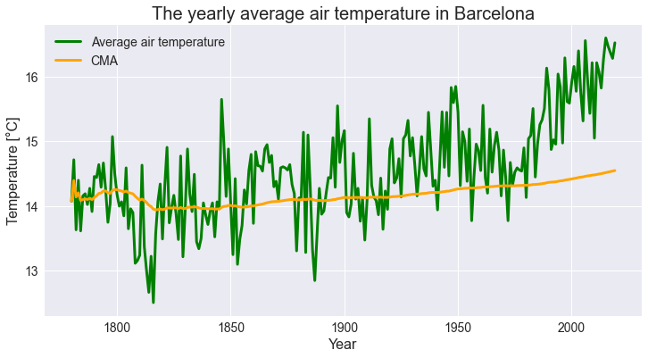

# スペクトル・時系列データの前処理と正規性の検定
# 平滑化（スムージング）

## 移動平均（ローリング平均）

移動平均は、一般的で使用された時系列データの短期変動を平滑化し、ほかの成分（トレンド、季節、サイクル）をデータ内で強調することができます。（ノイズを除去し、特徴量を強調します。）<br>移動平均はローリング平均とも呼ばれ、場の傾向を判断するための財務や、汚染物質の濃度などの環境品質の基準を評価するための環境工学で広く使用されています。

スペクトルでは、平滑化・スムージングとも呼ばれ、データを均（なら）すことで **ノイズを低減** します。<br>デメリットとしては、やりすぎると極大値・極小値の **情報が消えてしまうことです。**

スペクトル・時系列データの前処理の **平滑化** として使われる移動平均について<br>
Open Data Barcelonaから以下の2つの時系列データセットを使用して **単純移動平均（SMA）** **累積移動平均（CMA）** **指数移動平均（EMA）**について実装を行います。

1. [1780年からのバルセロナの都市の月別平均気温](https://opendata-ajuntament.barcelona.cat/data/en/dataset/temperatures-hist-bcn)
2. [1786年からのバルセロナの街の月積算降水量](https://opendata-ajuntament.barcelona.cat/data/en/dataset/precipitacio-hist-bcn)


```python
import pandas as pd
import matplotlib.pyplot as plt
import japanize_matplotlib
# pip install japanize-matplotlib

import warnings
warnings.simplefilter('ignore')

%matplotlib inline
plt.style.use('seaborn')
```

    C:\Users\akahane\anaconda3\lib\site-packages\japanize_matplotlib\japanize_matplotlib.py:15: MatplotlibDeprecationWarning: 
    The createFontList function was deprecated in Matplotlib 3.2 and will be removed two minor releases later. Use FontManager.addfont instead.
      font_list = font_manager.createFontList(font_files)
    


```python
# 1780年以降のバルセロナ市の月平均気温
df_temp = pd.read_csv('./temperaturesbarcelonadesde1780.csv', encoding = 'utf-8', index_col=0)
```


```python
# 可視化
df_temp.plot()

plt.xticks(fontsize=14)
plt.yticks(fontsize=14)
plt.legend('')    # 凡例の非表示

# タイトルとラベル
plt.title('バルセロナの年間平均気温', fontsize=20)
plt.xlabel('Year', fontsize=16)
plt.ylabel('Temperature [°C]', fontsize=16)
# 先頭の表示
df_temp.head()
```


<div>
<style scoped>
    .dataframe tbody tr th:only-of-type {
        vertical-align: middle;
    }

    .dataframe tbody tr th {
        vertical-align: top;
    }

    .dataframe thead th {
        text-align: right;
    }
</style>
<table border="1" class="dataframe">
  <thead>
    <tr style="text-align: right;">
      <th></th>
      <th>Temp_Mitjana_Gener</th>
      <th>Temp_Mitjana_Febrer</th>
      <th>Temp_Mitjana_Marc</th>
      <th>Temp_Mitjana_Abril</th>
      <th>Temp_Mitjana_Maig</th>
      <th>Temp_Mitjana_Juny</th>
      <th>Temp_Mitjana_Juliol</th>
      <th>Temp_Mitjana_Agost</th>
      <th>Temp_Mitjana_Setembre</th>
      <th>Temp_Mitjana_Octubre</th>
      <th>Temp_Mitjana_Novembre</th>
      <th>Temp_Mitjana_Desembre</th>
    </tr>
    <tr>
      <th>Any</th>
      <th></th>
      <th></th>
      <th></th>
      <th></th>
      <th></th>
      <th></th>
      <th></th>
      <th></th>
      <th></th>
      <th></th>
      <th></th>
      <th></th>
    </tr>
  </thead>
  <tbody>
    <tr>
      <th>1780</th>
      <td>6.7</td>
      <td>7.3</td>
      <td>11.6</td>
      <td>11.4</td>
      <td>16.3</td>
      <td>19.1</td>
      <td>21.4</td>
      <td>22.0</td>
      <td>20.3</td>
      <td>16.3</td>
      <td>9.2</td>
      <td>7.3</td>
    </tr>
    <tr>
      <th>1781</th>
      <td>7.5</td>
      <td>8.9</td>
      <td>10.9</td>
      <td>13.7</td>
      <td>16.8</td>
      <td>18.0</td>
      <td>22.0</td>
      <td>22.6</td>
      <td>19.1</td>
      <td>15.0</td>
      <td>11.8</td>
      <td>10.3</td>
    </tr>
    <tr>
      <th>1782</th>
      <td>8.2</td>
      <td>6.1</td>
      <td>9.8</td>
      <td>10.5</td>
      <td>15.4</td>
      <td>20.1</td>
      <td>22.3</td>
      <td>22.6</td>
      <td>19.9</td>
      <td>13.8</td>
      <td>7.4</td>
      <td>7.5</td>
    </tr>
    <tr>
      <th>1783</th>
      <td>8.3</td>
      <td>8.6</td>
      <td>9.6</td>
      <td>12.4</td>
      <td>15.0</td>
      <td>19.1</td>
      <td>22.9</td>
      <td>21.4</td>
      <td>18.6</td>
      <td>15.5</td>
      <td>11.0</td>
      <td>10.4</td>
    </tr>
    <tr>
      <th>1784</th>
      <td>7.3</td>
      <td>7.1</td>
      <td>10.8</td>
      <td>10.7</td>
      <td>16.7</td>
      <td>20.7</td>
      <td>22.0</td>
      <td>20.5</td>
      <td>20.0</td>
      <td>13.8</td>
      <td>8.5</td>
      <td>5.3</td>
    </tr>
  </tbody>
</table>
</div>


```python
# 1786年以降のバルセロナ市の月間累積降水量
df_rain = pd.read_csv('./precipitacionsbarcelonadesde1786.csv', encoding = 'utf-8', index_col=0)
```


```python
# 可視化
df_rain.plot()

plt.xticks(fontsize=14)
plt.yticks(fontsize=14)
plt.legend('')

# タイトルとラベル
plt.title('バルセロナの年間累積降水量', fontsize=20)
plt.xlabel('Year', fontsize=16)
plt.ylabel('Rainfall [mm]', fontsize=16)
# 先頭の表示
df_rain.head()
```


<div>
<style scoped>
    .dataframe tbody tr th:only-of-type {
        vertical-align: middle;
    }

    .dataframe tbody tr th {
        vertical-align: top;
    }

    .dataframe thead th {
        text-align: right;
    }
</style>
<table border="1" class="dataframe">
  <thead>
    <tr style="text-align: right;">
      <th></th>
      <th>Precip_Acum_Gener</th>
      <th>Precip_Acum_Febrer</th>
      <th>Precip_Acum_Marc</th>
      <th>Precip_Acum_Abril</th>
      <th>Precip_Acum_Maig</th>
      <th>Precip_Acum_Juny</th>
      <th>Precip_Acum_Juliol</th>
      <th>Precip_Acum_Agost</th>
      <th>Precip_Acum_Setembre</th>
      <th>Precip_Acum_Octubre</th>
      <th>Precip_Acum_Novembre</th>
      <th>Precip_Acum_Desembre</th>
    </tr>
    <tr>
      <th>Any</th>
      <th></th>
      <th></th>
      <th></th>
      <th></th>
      <th></th>
      <th></th>
      <th></th>
      <th></th>
      <th></th>
      <th></th>
      <th></th>
      <th></th>
    </tr>
  </thead>
  <tbody>
    <tr>
      <th>1786</th>
      <td>32.8</td>
      <td>28.4</td>
      <td>84.4</td>
      <td>42.3</td>
      <td>8.5</td>
      <td>38.0</td>
      <td>6.8</td>
      <td>52.1</td>
      <td>62.0</td>
      <td>57.0</td>
      <td>195.8</td>
      <td>114.1</td>
    </tr>
    <tr>
      <th>1787</th>
      <td>136.4</td>
      <td>27.4</td>
      <td>44.6</td>
      <td>76.9</td>
      <td>0.0</td>
      <td>29.8</td>
      <td>34.7</td>
      <td>14.9</td>
      <td>205.8</td>
      <td>12.4</td>
      <td>42.2</td>
      <td>0.0</td>
    </tr>
    <tr>
      <th>1788</th>
      <td>9.9</td>
      <td>14.9</td>
      <td>32.2</td>
      <td>12.4</td>
      <td>7.5</td>
      <td>146.3</td>
      <td>59.4</td>
      <td>29.8</td>
      <td>123.9</td>
      <td>163.6</td>
      <td>106.6</td>
      <td>22.3</td>
    </tr>
    <tr>
      <th>1789</th>
      <td>12.4</td>
      <td>12.4</td>
      <td>23.6</td>
      <td>9.9</td>
      <td>32.2</td>
      <td>9.9</td>
      <td>6.3</td>
      <td>69.4</td>
      <td>18.7</td>
      <td>52.1</td>
      <td>18.7</td>
      <td>76.9</td>
    </tr>
    <tr>
      <th>1790</th>
      <td>44.6</td>
      <td>1.2</td>
      <td>188.5</td>
      <td>74.4</td>
      <td>44.7</td>
      <td>39.7</td>
      <td>65.7</td>
      <td>32.3</td>
      <td>71.9</td>
      <td>205.8</td>
      <td>72.0</td>
      <td>14.9</td>
    </tr>
  </tbody>
</table>
</div>


上記のように、2つのデータセットには月次データが含まれます。

欠損値の有無を確認します。


```python
print(df_temp.isnull().sum(), df_rain.isnull().sum())
```

    Temp_Mitjana_Gener       0
    Temp_Mitjana_Febrer      0
    Temp_Mitjana_Marc        0
    Temp_Mitjana_Abril       0
    Temp_Mitjana_Maig        0
    Temp_Mitjana_Juny        0
    Temp_Mitjana_Juliol      0
    Temp_Mitjana_Agost       0
    Temp_Mitjana_Setembre    0
    Temp_Mitjana_Octubre     0
    Temp_Mitjana_Novembre    0
    Temp_Mitjana_Desembre    0
    dtype: int64 Precip_Acum_Gener       0
    Precip_Acum_Febrer      0
    Precip_Acum_Marc        0
    Precip_Acum_Abril       0
    Precip_Acum_Maig        0
    Precip_Acum_Juny        0
    Precip_Acum_Juliol      0
    Precip_Acum_Agost       0
    Precip_Acum_Setembre    0
    Precip_Acum_Octubre     0
    Precip_Acum_Novembre    0
    Precip_Acum_Desembre    0
    dtype: int64
    

月次データを年次データに変換します。


```python
# インデックス名を変更
df_temp.index_name = 'year'

# 年間平均気温を計算する（行ごとの平均を算出）
df_temp['average_temperature'] = df_temp.mean(axis=1)

# 月次値を含む列を削除
df_temp = df_temp[['average_temperature']]

# 可視化
df_temp.plot(color='green', linewidth=3, figsize=(12,6))
plt.xticks(fontsize=14)
plt.yticks(fontsize=14)
plt.legend('')    # 凡例の非表示

# タイトルとラベル
plt.title('バルセロナの年間平均気温', fontsize=20)
plt.xlabel('Year', fontsize=16)
plt.ylabel('Temperature [°C]', fontsize=16)

# 先頭の表示
df_temp.head()
```


<div>
<style scoped>
    .dataframe tbody tr th:only-of-type {
        vertical-align: middle;
    }

    .dataframe tbody tr th {
        vertical-align: top;
    }

    .dataframe thead th {
        text-align: right;
    }
</style>
<table border="1" class="dataframe">
  <thead>
    <tr style="text-align: right;">
      <th></th>
      <th>average_temperature</th>
    </tr>
    <tr>
      <th>Any</th>
      <th></th>
    </tr>
  </thead>
  <tbody>
    <tr>
      <th>1780</th>
      <td>14.075000</td>
    </tr>
    <tr>
      <th>1781</th>
      <td>14.716667</td>
    </tr>
    <tr>
      <th>1782</th>
      <td>13.633333</td>
    </tr>
    <tr>
      <th>1783</th>
      <td>14.400000</td>
    </tr>
    <tr>
      <th>1784</th>
      <td>13.616667</td>
    </tr>
  </tbody>
</table>
</div>


```python
# インデックス名を変更
df_rain.index_name = 'year'

# 累積年間降水量を計算する （行ごとの合計を算出）
df_rain['accumulated_rainfall'] = df_rain.sum(axis=1)

# 月次値を含む列を削除
df_rain = df_rain[['accumulated_rainfall']]

# 可視化
df_rain.plot(color='steelblue', linewidth=3, figsize=(12,6))
plt.xticks(fontsize=14)
plt.yticks(fontsize=14)
plt.legend('')

# タイトルとラベル
plt.title('バルセロナの年間累積降水量', fontsize=20)
plt.xlabel('Year', fontsize=16)
plt.ylabel('Rainfall [mm]', fontsize=16)
# 先頭の表示
df_rain.head()
```


<div>
<style scoped>
    .dataframe tbody tr th:only-of-type {
        vertical-align: middle;
    }

    .dataframe tbody tr th {
        vertical-align: top;
    }

    .dataframe thead th {
        text-align: right;
    }
</style>
<table border="1" class="dataframe">
  <thead>
    <tr style="text-align: right;">
      <th></th>
      <th>accumulated_rainfall</th>
    </tr>
    <tr>
      <th>Any</th>
      <th></th>
    </tr>
  </thead>
  <tbody>
    <tr>
      <th>1786</th>
      <td>722.2</td>
    </tr>
    <tr>
      <th>1787</th>
      <td>625.1</td>
    </tr>
    <tr>
      <th>1788</th>
      <td>728.8</td>
    </tr>
    <tr>
      <th>1789</th>
      <td>342.5</td>
    </tr>
    <tr>
      <th>1790</th>
      <td>855.7</td>
    </tr>
  </tbody>
</table>
</div>


## 単純移動平均（SMA）

単純移動平均（SMA）はある非加重平均以前のM個のデータポイントです。<br>M（スライディングウィンドウ）の選択は、精度を犠牲にしてMの値を大きくすると平滑化が向上するため、必要な平滑化の量に依存します。<br>
一連の値について、期間tでの単純な移動平均を次のように計算します。

$$SMA_t=\frac{x_t+x_{t-1}+x_{t-2}+\dots x_{M-(t-1)}}{M}$$

単純な移動平均を計算する最も簡単な方法は、`pandas.Series.rolling` メソッドを使用することです。このメソッドは、データのローリングウィンドウを提供します。結果のウィンドウで、統計関数（この場合は平均）を使用して計算を実行できます。ウィンドウのサイズ（期間数）は、引数windowで指定されます。


10年と20年の期間（ウィンドウのサイズ）の単純な移動平均を計算し、すべての場合で最小数の期間1を選択します。以下に示すように、既存のデータフレームに移動平均を追加します（df_temperatureとdf_rainfall）。


```python
# 周囲気温
# 10年間の単純移動平均
df_temp['SMA_10'] = df_temp['average_temperature'].rolling(10, min_periods=1).mean()
# 20年間の単純移動平均
df_temp['SMA_20'] = df_temp['average_temperature'].rolling(20, min_periods=1).mean()

df_temp.head()
```


<div>
<style scoped>
    .dataframe tbody tr th:only-of-type {
        vertical-align: middle;
    }

    .dataframe tbody tr th {
        vertical-align: top;
    }

    .dataframe thead th {
        text-align: right;
    }
</style>
<table border="1" class="dataframe">
  <thead>
    <tr style="text-align: right;">
      <th></th>
      <th>average_temperature</th>
      <th>SMA_10</th>
      <th>SMA_20</th>
    </tr>
    <tr>
      <th>Any</th>
      <th></th>
      <th></th>
      <th></th>
    </tr>
  </thead>
  <tbody>
    <tr>
      <th>1780</th>
      <td>14.075000</td>
      <td>14.075000</td>
      <td>14.075000</td>
    </tr>
    <tr>
      <th>1781</th>
      <td>14.716667</td>
      <td>14.395833</td>
      <td>14.395833</td>
    </tr>
    <tr>
      <th>1782</th>
      <td>13.633333</td>
      <td>14.141667</td>
      <td>14.141667</td>
    </tr>
    <tr>
      <th>1783</th>
      <td>14.400000</td>
      <td>14.206250</td>
      <td>14.206250</td>
    </tr>
    <tr>
      <th>1784</th>
      <td>13.616667</td>
      <td>14.088333</td>
      <td>14.088333</td>
    </tr>
  </tbody>
</table>
</div>


```python
# 降雨
# 10年間の単純移動平均
df_rain['SMA_10'] = df_rain['accumulated_rainfall'].rolling(10, min_periods=1).mean()
# 20年間の単純移動平均
df_rain['SMA_20'] = df_rain['accumulated_rainfall'].rolling(20, min_periods=1).mean()

df_rain.head()
```


<div>
<style scoped>
    .dataframe tbody tr th:only-of-type {
        vertical-align: middle;
    }

    .dataframe tbody tr th {
        vertical-align: top;
    }

    .dataframe thead th {
        text-align: right;
    }
</style>
<table border="1" class="dataframe">
  <thead>
    <tr style="text-align: right;">
      <th></th>
      <th>accumulated_rainfall</th>
      <th>SMA_10</th>
      <th>SMA_20</th>
    </tr>
    <tr>
      <th>Any</th>
      <th></th>
      <th></th>
      <th></th>
    </tr>
  </thead>
  <tbody>
    <tr>
      <th>1786</th>
      <td>722.2</td>
      <td>722.200000</td>
      <td>722.200000</td>
    </tr>
    <tr>
      <th>1787</th>
      <td>625.1</td>
      <td>673.650000</td>
      <td>673.650000</td>
    </tr>
    <tr>
      <th>1788</th>
      <td>728.8</td>
      <td>692.033333</td>
      <td>692.033333</td>
    </tr>
    <tr>
      <th>1789</th>
      <td>342.5</td>
      <td>604.650000</td>
      <td>604.650000</td>
    </tr>
    <tr>
      <th>1790</th>
      <td>855.7</td>
      <td>654.860000</td>
      <td>654.860000</td>
    </tr>
  </tbody>
</table>
</div>


ローリングでは平均を返すために最低n個の値（ウィンドウ引数で指定された値）が必要なので、返される系列の最初の行にはnull値が含まれます。


```python
print(df_temp.isnull().sum(), df_rain.isnull().sum())
```

    average_temperature    0
    SMA_10                 0
    SMA_20                 0
    dtype: int64 accumulated_rainfall    0
    SMA_10                  0
    SMA_20                  0
    dtype: int64
    

結果をラインプロットを使用して結果をプロットします。次のプロットは、平均気温と累積降水量を、10年と20年の 移動平均とともに示しています。移動平均がデータを平滑化し、トレンドの方向を適切に視覚化できています


```python
# プロットの色
colors = ['green', 'red', 'purple']

# 折れ線グラフ-バルセロナの年間平均気温
df_temp.plot(color=colors, linewidth=3, figsize=(12,6))

plt.xticks(fontsize=14)
plt.yticks(fontsize=14)
plt.legend(labels =['平均気温', '10年SMA ', '20年SMA'], fontsize=14)

plt.title('バルセロナの年間平均気温', fontsize=20)
plt.xlabel('Year', fontsize=16)
plt.ylabel('Temperature [°C]', fontsize=16)
```


    Text(0, 0.5, 'Temperature [°C]')


```python
# プロットの色
colors = ['steelblue', 'red', 'purple']

# 折れ線グラフ-バルセロナの年間平均気温
df_rain.plot(color=colors, linewidth=3, figsize=(12,6))

plt.xticks(fontsize=14)
plt.yticks(fontsize=14)
plt.legend(labels =['累積降水量', '10年SMA ', '20年SMA'], fontsize=14)

plt.title('バルセロナの年間累積降水量', fontsize=20)
plt.xlabel('Year', fontsize=16)
plt.ylabel('Rainfall [mm]', fontsize=16)
```


    Text(0, 0.5, 'Rainfall [mm]')


気温は1975年以降、特に高い傾向を示しています。逆に、1850年以降、降水量は一定の傾向を示しています。

## 累積移動平均（CMA）

累積移動平均（CMA）は、現在の時刻tまでの以前の値の重み付けされていない平均です。

$$CMA_t=\frac{x_1+x_2+x_3+\dots x_t}{t}$$

単純移動平均は一定の大きさＭのスライディングウィンドウを持っていますが、逆に累積移動平均を計算すると時間が経つにつれてウィンドウの大きさが大きくなります。


このように、拡大法では、現在のものまでのすべての行が計算に含まれています。<br>次に、既存のデータフレームに結果を追加して、Pandasで累積移動平均を計算します。


```python
# 周囲気温
df_temp['CMA'] = df_temp['average_temperature'].expanding().mean()

df_temp.head()
```


<div>
<style scoped>
    .dataframe tbody tr th:only-of-type {
        vertical-align: middle;
    }

    .dataframe tbody tr th {
        vertical-align: top;
    }

    .dataframe thead th {
        text-align: right;
    }
</style>
<table border="1" class="dataframe">
  <thead>
    <tr style="text-align: right;">
      <th></th>
      <th>average_temperature</th>
      <th>SMA_10</th>
      <th>SMA_20</th>
      <th>CMA</th>
    </tr>
    <tr>
      <th>Any</th>
      <th></th>
      <th></th>
      <th></th>
      <th></th>
    </tr>
  </thead>
  <tbody>
    <tr>
      <th>1780</th>
      <td>14.075000</td>
      <td>14.075000</td>
      <td>14.075000</td>
      <td>14.075000</td>
    </tr>
    <tr>
      <th>1781</th>
      <td>14.716667</td>
      <td>14.395833</td>
      <td>14.395833</td>
      <td>14.395833</td>
    </tr>
    <tr>
      <th>1782</th>
      <td>13.633333</td>
      <td>14.141667</td>
      <td>14.141667</td>
      <td>14.141667</td>
    </tr>
    <tr>
      <th>1783</th>
      <td>14.400000</td>
      <td>14.206250</td>
      <td>14.206250</td>
      <td>14.206250</td>
    </tr>
    <tr>
      <th>1784</th>
      <td>13.616667</td>
      <td>14.088333</td>
      <td>14.088333</td>
      <td>14.088333</td>
    </tr>
  </tbody>
</table>
</div>


```python
# 降雨
df_rain['CMA'] = df_rain['accumulated_rainfall'].expanding().mean()

df_rain.head()
```


<div>
<style scoped>
    .dataframe tbody tr th:only-of-type {
        vertical-align: middle;
    }

    .dataframe tbody tr th {
        vertical-align: top;
    }

    .dataframe thead th {
        text-align: right;
    }
</style>
<table border="1" class="dataframe">
  <thead>
    <tr style="text-align: right;">
      <th></th>
      <th>accumulated_rainfall</th>
      <th>SMA_10</th>
      <th>SMA_20</th>
      <th>CMA</th>
    </tr>
    <tr>
      <th>Any</th>
      <th></th>
      <th></th>
      <th></th>
      <th></th>
    </tr>
  </thead>
  <tbody>
    <tr>
      <th>1786</th>
      <td>722.2</td>
      <td>722.200000</td>
      <td>722.200000</td>
      <td>722.200000</td>
    </tr>
    <tr>
      <th>1787</th>
      <td>625.1</td>
      <td>673.650000</td>
      <td>673.650000</td>
      <td>673.650000</td>
    </tr>
    <tr>
      <th>1788</th>
      <td>728.8</td>
      <td>692.033333</td>
      <td>692.033333</td>
      <td>692.033333</td>
    </tr>
    <tr>
      <th>1789</th>
      <td>342.5</td>
      <td>604.650000</td>
      <td>604.650000</td>
      <td>604.650000</td>
    </tr>
    <tr>
      <th>1790</th>
      <td>855.7</td>
      <td>654.860000</td>
      <td>654.860000</td>
      <td>654.860000</td>
    </tr>
  </tbody>
</table>
</div>


```python
# プロットの色
colors = ['green', 'orange']

# 折れ線グラフ-バルセロナの年間平均気温
df_temp[['average_temperature', 'CMA']].plot(color=colors, linewidth=3, figsize=(12,6))

plt.xticks(fontsize=14)
plt.yticks(fontsize=14)
plt.legend(labels =['Average air temperature', 'CMA'], fontsize=14)

plt.title('The yearly average air temperature in Barcelona', fontsize=20)
plt.xlabel('Year', fontsize=16)
plt.ylabel('Temperature [°C]', fontsize=16)
```


    Text(0, 0.5, 'Temperature [°C]')





```python
# プロットの色
colors = ['steelblue', 'deeppink']

# 折れ線グラフ-バルセロナの年間累積降水量
df_rain[['accumulated_rainfall','CMA']].plot(color=colors, linewidth=3, figsize=(12,6))

plt.xticks(fontsize=14)
plt.yticks(fontsize=14)
plt.legend(labels =['Accumulated rainfall', 'CMA'], fontsize=14)

plt.title('The yearly accumulated rainfall in Barcelona', fontsize=20)
plt.xlabel('Year', fontsize=16)
plt.ylabel('Rainfall [mm]', fontsize=16)
```


    Text(0, 0.5, 'Rainfall [mm]')


累積移動平均は、平均を計算する際に先行するすべての値を考慮に入れます。<br>この理由から、特に長い時系列のトレンド分析には適していません。<br>単純移動平均の方がこの目的には適しています。<br>しかし、すべてのデータ・ポイントは等しく加重されています。<br>最近のオブザベーションを強調するために、指数移動平均を使用することができます。<br>これは、変化に素早く反応して、最も新しいデータ・ポイントにより多くの重みを適用します。

## 指数移動平均（EMA）

指数移動平均（EMA）は、ノイズをフィルタリングしてトレンドを識別するために広く使用されている手法です。各要素の重みは時間の経過とともに徐々に減少し、指数移動平均は最近のデータ・ポイントに大きな重みを与えることを意味します。これは、最近のデータが古いデータよりも関連性が高いという考えの下で行われます。単純移動平均と比較して、指数移動平均は最近の動きに敏感であるため、変化に対してより速く反応します。
指数移動平均を計算する代数式は次のようになります。

$$ EMA_t = \begin{cases} x_0 & t=0 \\ \alpha x_t+(1-\alpha)EMA_{t-1} & t > 0 \end{cases} $$

ここで
- $x$ₜ は、期間 $t$ での観測値です。
- $EMAₜ $は、期間 $t$ での指数移動平均です。
- $α$ は平滑化係数です。平滑化係数は$0$から$1$の間の値を持ち、直近の期間に適用された重み付けを表します。

指数平滑化については、Pandasでは`pandas.Series.ewm`というメソッドが用意されています。$α$パラメータで平滑化係数を直接指定することができます。<br>あるいは、質量中心、スパン、半減期で指定することもできます。

次の図は、ewmメソッドが指数移動平均を計算する様子を示しています。<br>この場合、パラメータ alpha を 0.1 に、パラメータ adjust を False に設定しています。<br>計算には期間t-1のEMAが使用されます。<br>つまり、期間tのEMAを計算する際には、現在の時刻までのすべてのデータポイントが含まれます。しかし、最も古いデータは計算に与える影響が少なくなります。


ここでは、0.1と0.3の平滑化係数を用いて指数関数的な移動平均を計算します。<br>前と同様に、既存のデータフレーム(df_tempeとdf_rain)に移動平均を追加します。


```python
# 累積移動平均
# 周囲気温
# 平滑化係数-0.1
df_temp['EMA_0.1'] = df_temp.average_temperature.ewm(alpha=0.1, adjust=False).mean()

# 平滑化係数-0.3
df_temp['EMA_0.3'] = df_temp.average_temperature.ewm(alpha=0.3, adjust=False).mean()

# 降雨
# 平滑化係数-0.1
df_rain['EMA_0.1'] = df_rain.accumulated_rainfall.ewm(alpha=0.1, adjust=False).mean()

# 平滑化係数-0.3
df_rain['EMA_0.3'] = df_rain.accumulated_rainfall.ewm(alpha=0.3, adjust=False).mean()
```

次のプロットは、平均気温と累積降水量を指数移動平均で表示します。


```python
colors = ['green', 'orchid', 'orange']

df_temp[['average_temperature', 'EMA_0.1', 'EMA_0.3']].plot(color=colors, linewidth=3, figsize=(12,6), alpha=0.8)

plt.xticks(fontsize=14)
plt.yticks(fontsize=14)
plt.legend(labels=['Average air temperature', 'EMA - alpha=0.1', 'EMA - alpha=0.3'], fontsize=14)

plt.title('The yearly average air temperature in Barcelona', fontsize=20)
plt.xlabel('Year', fontsize=16)
plt.ylabel('Temperature [°C]', fontsize=16)
```


    Text(0, 0.5, 'Temperature [°C]')


```python
colors = ['steelblue', 'coral', 'green']

df_rain[['accumulated_rainfall', 'EMA_0.1', 'EMA_0.3']].plot(color=colors, linewidth=3, figsize=(12,6), alpha=0.8)

plt.xticks(fontsize=14)
plt.yticks(fontsize=14)
plt.legend(labels=['Accumulated rainfall', 'EMA - alpha=0.1', 'EMA - alpha=0.3'], fontsize=14)

plt.title('The yearly accumulated rainfall in Barcelona', fontsize=20)
plt.xlabel('Year', fontsize=16)
plt.ylabel('Rainfall [mm]', fontsize=16)
```


    Text(0, 0.5, 'Rainfall [mm]')


上記のように、重み付け係数αを小さくすると平滑化の度合いが高くなりますが、値を大きくすると最近の変化に素早く反応するようになります。

## K-S検定（コルモゴロフ-スミルノフ検定）

今まで作成した移動平均をK-S検定（コルモゴロフ-スミルノフ検定）して正規分布と差があるかどうかを調べてみます。


```python
from scipy import stats

for data in df_temp:
    # print(data)
    pv = stats.kstest(df_temp[data], 'norm')[1]
    print('p-value:{}'.format(str(pv)))
    # p値が0.05以上の時、データは帰無仮説である
    # 仮定した正規分布に一致している可能性がある
    print(data) if pv > 0.05 else _
```

    p-value:0.0
    p-value:0.0
    p-value:0.0
    p-value:0.0
    p-value:0.0
    p-value:0.0
    


```python
for data in df_temp:
    # print(data)
    pv = stats.kstest(df_temp[data], 'norm').pvalue
    print('p-value:{}'.format(str(pv)))
```

    p-value:0.0
    p-value:0.0
    p-value:0.0
    p-value:0.0
    p-value:0.0
    p-value:0.0
    

#### シャピロ-ウィルク検定

シャピロ-ウィルク検定で今まで作成した移動平均が正規分布と差があるかどうかを確認してみます


```python
for data in df_temp:
    # print(data)
    a = stats.shapiro(df_temp[data])[0]
    print('p-value:{}'.format( str(a) ))
    # 有意水準は95%以上の時、データは帰無仮説である
    # 仮定した正規分布に一致している可能性がある
    print(data) if a > 0.95 else _
```

    p-value:0.9833531975746155
    average_temperature
    p-value:0.9396230578422546
    p-value:0.9213479161262512
    p-value:0.9596734642982483
    CMA
    p-value:0.9273799061775208
    p-value:0.9502009153366089
    EMA_0.3
    


```python

```
