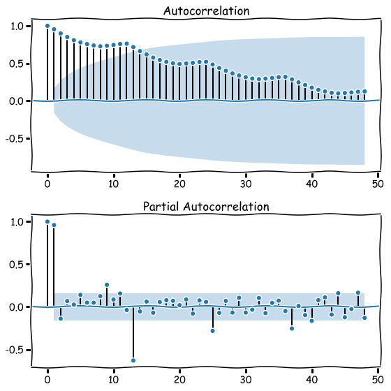
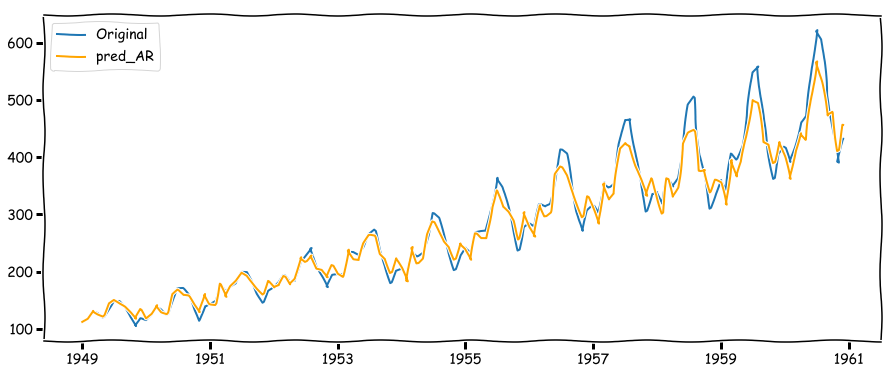
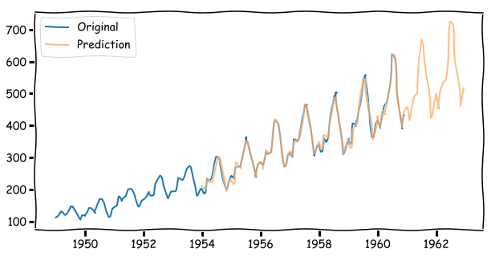

```python
%matplotlib inline
```

# 目次

- **[1.問題設定](#1.問題設定)**
- **[2.データ](#2.データ)**
- **[3.コード](#3.コード)**
- **[4.結果](#4.結果)**

# 1.問題設定

### 1949年1月から1960年12月まで、月毎の飛行機乗客数データセットAirport Passengersから時系列解析を行い、月ごとの乗客数モデルを作成する

# 2.データ

#### データ説明（Airport Passengersのデータセット）
---

Airport Passengersには、144行2列の月ごとの乗客数のデータが格納されています。

# 3.コード

[公開されているチュートリアル](https://www.analyticsvidhya.com/blog/2016/02/time-series-forecasting-codes-python/)を使用しながら、時系列解析を行う。


参考リンク

- [A comprehensive beginner’s guide to create a Time Series Forecast (with Codes in Python and R)](https://www.analyticsvidhya.com/blog/2016/02/time-series-forecasting-codes-python/)
- [時系列データに対する特徴量エンジニアリング手法のまとめ](https://yolo-kiyoshi.com/2019/03/23/post-1111/)
- [Basic Feature Engineering With Time Series Data in Python](https://machinelearningmastery.com/basic-feature-engineering-time-series-data-python/)

- [ディッキー–フラー検定](https://ja.wikipedia.org/wiki/%E3%83%87%E3%82%A3%E3%83%83%E3%82%AD%E3%83%BC%E2%80%93%E3%83%95%E3%83%A9%E3%83%BC%E6%A4%9C%E5%AE%9A)


```python
# データの読み込み
import pandas as pd
'''
# ネットワークを使用してデータを取得する場合（中身はpd.read_csvのデータと同じです）
df = pd.read_csv('https://assets.digitalocean.com/articles/eng_python/prophet/AirPassengers.csv', header=None)
'''
df = pd.read_csv('../data/AirPassengers.csv')

df.head()
```


<div>
<style scoped>
    .dataframe tbody tr th:only-of-type {
        vertical-align: middle;
    }

    .dataframe tbody tr th {
        vertical-align: top;
    }

    .dataframe thead th {
        text-align: right;
    }
</style>
<table border="1" class="dataframe">
  <thead>
    <tr style="text-align: right;">
      <th></th>
      <th>Month</th>
      <th>#Passengers</th>
    </tr>
  </thead>
  <tbody>
    <tr>
      <th>0</th>
      <td>1949-01</td>
      <td>112</td>
    </tr>
    <tr>
      <th>1</th>
      <td>1949-02</td>
      <td>118</td>
    </tr>
    <tr>
      <th>2</th>
      <td>1949-03</td>
      <td>132</td>
    </tr>
    <tr>
      <th>3</th>
      <td>1949-04</td>
      <td>129</td>
    </tr>
    <tr>
      <th>4</th>
      <td>1949-05</td>
      <td>121</td>
    </tr>
  </tbody>
</table>
</div>


```python
# データの要約
df.info()
```

    <class 'pandas.core.frame.DataFrame'>
    RangeIndex: 144 entries, 0 to 143
    Data columns (total 2 columns):
    Month          144 non-null object
    #Passengers    144 non-null int64
    dtypes: int64(1), object(1)
    memory usage: 2.3+ KB
    

1列目のMonthがobject型で、日時型に変換する必要があります


```python
df['Month'] = pd.DatetimeIndex(df['Month'])
# データ型の確認
df.dtypes
```


    Month          datetime64[ns]
    #Passengers             int64
    dtype: object


```python
df['#Passengers'].head()
```


    0    112
    1    118
    2    132
    3    129
    4    121
    Name: #Passengers, dtype: int64


乗客数に`#Passengers`と指定するのは`#`が嫌なので名称を変更します。


```python
df = df.rename(columns={'Month': 'month',
                        '#Passengers': 'y'})

df.head(5)
```


<div>
<style scoped>
    .dataframe tbody tr th:only-of-type {
        vertical-align: middle;
    }

    .dataframe tbody tr th {
        vertical-align: top;
    }

    .dataframe thead th {
        text-align: right;
    }
</style>
<table border="1" class="dataframe">
  <thead>
    <tr style="text-align: right;">
      <th></th>
      <th>month</th>
      <th>y</th>
    </tr>
  </thead>
  <tbody>
    <tr>
      <th>0</th>
      <td>1949-01-01</td>
      <td>112</td>
    </tr>
    <tr>
      <th>1</th>
      <td>1949-02-01</td>
      <td>118</td>
    </tr>
    <tr>
      <th>2</th>
      <td>1949-03-01</td>
      <td>132</td>
    </tr>
    <tr>
      <th>3</th>
      <td>1949-04-01</td>
      <td>129</td>
    </tr>
    <tr>
      <th>4</th>
      <td>1949-05-01</td>
      <td>121</td>
    </tr>
  </tbody>
</table>
</div>


```python
import matplotlib.pyplot as plt
from matplotlib.pylab import rcParams

rcParams['figure.figsize'] = 15, 6

# 乗客数データをグラフで可視化
plt.plot(df['month'], df['y'])
plt.ylabel('Monthly Number of Airline Passengers')
plt.xlabel('Date')
plt.tight_layout()
```

    To register the converters:
    	>>> from pandas.plotting import register_matplotlib_converters
    	>>> register_matplotlib_converters()
      warnings.warn(msg, FutureWarning)
    


```python
plt.xkcd()
```


    <matplotlib.pyplot.xkcd.<locals>.dummy_ctx at 0x18234267e10>


データが増加傾向にあるのはわかるけど、平均と分散が一定になっていないように見え、
定常性が無いように思える。

## 時系列の定常性チェック

以下の処理で定常性を調べる

1. moving averageやmoving distanceをとってみる<br>
今回は、季節変動的なのも吸収したいから12か月分
2. ディッキー・フラー検定を行い、定常性を調べる


- 移動平均<br>
このアプローチでは、時系列の頻度に応じて、'k'連続した値の平均を取ります。<br>ここでは、過去1年間の平均、つまり過去12回の値を取ることができます。<br>Pandasは、`rolling()`処理を行います。

- ディッキー・フラー検定[DF検定]（定常性の統計検定）<br>
定常性をチェックするための統計的検定の1つです。<br>ここでの帰無仮説は、`month`が非定常であるということである。<br>検定結果は，検定統計量と信頼度の差の臨界値で構成されます<br>検定統計量」が「臨界値」よりも小さければ、帰無仮説を棄却し、<br>系列が定常であると言えます。


DF検定には、`statsmodels`という時系列用統計ライブラリを使う<br>
そのままdfを入れるとエラーになるので、1d arrayを使う <br>(参考[I am trying to run Dickey-Fuller test in statsmodels in Python but getting error](https://stackoverflow.com/questions/43100441/i-am-trying-to-run-dickey-fuller-test-in-statsmodels-in-python-but-getting-error))


```python
# 移動平均の可視化
rolmean = df['y'].rolling(window=12).mean()

plt.plot(df['month'], df['y'],label='Original')
plt.plot(df['month'], rolmean, label='moving average')

plt.ylabel('Monthly Number of Airline Passengers')
plt.xlabel('Date')
plt.legend()
plt.tight_layout()
```


```python
from statsmodels.tsa.stattools import adfuller

array = df['y'].values
print(array[:5])

# Determing rolling statistics
# rollingを使って移動平均等の算出　Windowの幅を指定:12(12ヶ月)
rolmean = df['y'].rolling(window=12).mean()    # 移動平均
rolstd = df['y'].rolling(window=12).std()      # 分散の代わりに標準偏差をプロット 分散だと下
# rolstd = df['y'].rolling(window=12).var()    # 分散を使用すると平均から外れるから使用しない（可視化したとき見づらいから？）、平均に近い単位として、標準偏差を使用する

# Plot rolling statistics:
orig = plt.plot(df['y'], color='blue',label='Original')
mean = plt.plot(rolmean, color='red', label='Rolling Mean')
std = plt.plot(rolstd, color='black', label = 'Rolling Std')

plt.legend(loc='best')
plt.title('Rolling Mean & Standard Deviation')
plt.tight_layout()
plt.show(block=False)

# Perform Dickey-Fuller :
print('Results of Dickey-Fuller Examination:')
# dftest = adfuller(df['y'], autolag='AIC')
dftest = adfuller(df['y'])
dfoutput = pd.Series(dftest[0:4], index=['Test Statistic','p-value','#Lags Used','Number of Observations Used'])
for key,value in dftest[4].items():
    dfoutput['Critical Value (%s)'%key] = value
print(dfoutput)
```

    [112 118 132 129 121]
    


    Results of Dickey-Fuller Examination:
    Test Statistic                   0.815369
    p-value                          0.991880
    #Lags Used                      13.000000
    Number of Observations Used    130.000000
    Critical Value (1%)             -3.481682
    Critical Value (5%)             -2.884042
    Critical Value (10%)            -2.578770
    dtype: float64
    

Test StatisticとCritical Valueを見比べて結果を確認します。<br>
Test Statisticの値が、Critical Valueを下回らないと定常とはいえないようです。<br>

たとえば、Test Statisticが-3.0だったとすると、<br>
95%以上の信頼を持って定常といえると結論付けることができます。<br>
ともかく、このままだとこいつはまったく持って定常ではないデータとなります。

## 時系列データを定常状態にしたい

**トレンド**と**季節変動**をうまく取り除き、定常状態にしてやりたい。

- **トレンド**:<br>時間の経過とともに平均値が変化すること。<br>例えば、このケースでは、平均して乗客数は時間の経過とともに増加していることがわかる。<br>（小さいスケールでみると理解できないが、大きいスケールでみると変化がない）

- **季節性**:<br>特定の時間枠での変動。<br>例えば、昇給やお祭りなどの理由で、特定の月に車を購入する傾向があるかもしれません。

### トレンドを取り除く

**トレンドを減らすためのアプローチ**として**特徴量の変換を行う。**

例えば、この場合、有意な正のトレンドがあることがわかります。<br>

**トレンドをうまく取り除き、定常状態にする方法は** 以下の手順で行う。
1. **正のトレンド**の時は、大きい値にペナルティを与えるような変換をかけます。
<br>


つまり、
- logをとる
- logit変換($z_n=\log\frac{y_n}{1−y_n}$)
- 差分
- 平方根
- 立方根

などで変換することが多いようです。

2. **トレンド成分の抜き出し**


- Aggregation : 週/月ごとにまとめた平均を取る
- Rolling : windowをスライドさせながら平均を取る(移動平均)
- Polynomial Fitting : 回帰でフィッティングさせる


3. Originalからトレンド成分を引く
4. テストをする。

今回はlogをとって、移動平均にかけて、Originalから引く方法でトレンドを取り除いた。

 移動平均には、普通の平均をとるのと、<br>最近の時間ほど重みを強くかける**expweighted moving average**の二種類を取得しました。<br>
$expweighted moving average$は時間幅を厳格に設定しなくてよいため、クリティカルな窓幅が想像できないときなどに、柔軟に扱えるらしいです。


```python
import numpy as np

# 1. log
df['passengers_log'] = np.log(df['y'])
plt.plot(df.index, df['passengers_log'], color='b')
plt.show()
```


```python
# 2. eliminate noise logから移動平均を取得
df['moving_ave'] = df['passengers_log'].rolling(window=12).mean()

plt.plot(df.index, df['passengers_log'], color='b', label='original')
plt.plot(df.index, df['moving_ave'], color='orange', label="moving average")
plt.legend()
plt.tight_layout()
plt.show()
```


```python
from statsmodels.tsa.stattools import adfuller
# DF検定の関数化
def test_stationarity(timeseries):
    
    # Determing rolling statistics
    # rollingを使って移動平均等の算出　Windowの幅を指定:12(12ヶ月)
    rolmean = timeseries.rolling(window=12).mean()  # 移動平均等
    rolstd = timeseries.rolling(window=12).std()    # 分散の代わりに標準偏差をプロット 分散だと下
    # rolstd = df['y'].rolling(window=12).var()      # 分散を使用すると平均から外れるから使用しない（可視化したとき見づらいから？）、平均に近い単位として、標準偏差を使用する

    # Plot rolling statistics:
    orig = plt.plot(timeseries, color='blue',label='Original')
    mean = plt.plot(rolmean, color='red', label='Rolling Mean')
    std = plt.plot(rolstd, color='black', label = 'Rolling Std')
    plt.legend(loc='best')
    plt.title('Rolling Mean & Standard Deviation')
    plt.show(block=False)
    
    #Perform Dickey-Fuller test:
    print('Results of Dickey-Fuller Test:')
    # dftest = adfuller(timeseries, autolag='AIC')
    dftest = adfuller(timeseries)
    dfoutput = pd.Series(dftest[0:4], index=['Test Statistic','p-value','#Lags Used','Number of Observations Used'])
    for key,value in dftest[4].items():
        dfoutput['Critical Value (%s)'%key] = value
    print(dfoutput)
```


```python
# help(adfuller)
```


```python
import numpy as np

# log
df['passengers_log'] = np.log(df['y'])

# eliminate noise logをとって、移動平均にかけて、Originalから引く
df['moving_ave'] = df['passengers_log'].rolling(window=12).mean()
df['log_ave_diff'] = df['passengers_log'] - df['moving_ave']

timeseries = df['log_ave_diff']
plt.tight_layout()
test_stationarity(timeseries.dropna())
```


    Results of Dickey-Fuller Test:
    Test Statistic                  -3.162908
    p-value                          0.022235
    #Lags Used                      13.000000
    Number of Observations Used    119.000000
    Critical Value (1%)             -3.486535
    Critical Value (5%)             -2.886151
    Critical Value (10%)            -2.579896
    dtype: float64
    

このlogをとって、普通の平均をとる形で移動平均にかけて、Originalから引く方法でのトレンドを取り除く方法には、以下のような課題があります。（今回の場合ならこれでも）

**普通の平均をとる移動平均でトレンドを除去することの問題点**
このトレンド除去の問題点は、window幅に依存するところ。<br>
株価とかだったらどういう窓のサイズを使えばいいか微妙なところです。

そこで、指数移動平均(**expweighted moving average**)　$y(n)=αx(n)+(1−α)y(n−1)$を使用してトレンドを除去します


```python
# 指数移動平均(EMA)　y(n)=αx(n)+(1−α)y(n−1)の算出
df['expweighted_ave'] = df['passengers_log'].ewm(halflife=12).mean() #半減の時間

# moving averageによってトレンドを求めた結果
plt.plot(df.index, df['passengers_log'],label='original')
plt.plot(df.index, df['moving_ave'],label="moving average")
plt.plot(df.index, df['expweighted_ave'],label="exponentially weighted moving average")
plt.legend()
plt.tight_layout()
plt.show()
# トレンド成分(weighted moving average)をOriginalから引いた結果
timeseries = df['passengers_log'] - df['expweighted_ave']
test_stationarity(timeseries)
```


    Results of Dickey-Fuller Test:
    Test Statistic                  -3.601262
    p-value                          0.005737
    #Lags Used                      13.000000
    Number of Observations Used    130.000000
    Critical Value (1%)             -3.481682
    Critical Value (5%)             -2.884042
    Critical Value (10%)            -2.578770
    dtype: float64
    

[公開されているチュートリアル](https://www.analyticsvidhya.com/blog/2016/02/time-series-forecasting-codes-python/)を引用すると以下のようになり、<br>
99%以上定常状態といえ、このようにして定常性を消すと良いそうです。

> This TS has even lesser variations in mean and standard deviation in magnitude. Also, the test statistic is smaller than the 1% critical value, which is better than the previous case. Note that in this case there will be no missing values as all values from starting are given weights. So it’ll work even with no previous values.<br>（このTS（時系列データ）は、平均値と標準偏差の大きさのばらつきがさらに小さくなっています。また、検定統計量は1%の臨界値よりも小さく、前のケースよりも良いです。この場合、開始時からのすべての値に重みが与えられているので、欠損値は発生しないことに注意してください。よって、前の値がなくても動作します。）

### 季節性を取り除く

**季節性を取り除くためのアプローチ**として**特徴量の変換を行う。**


- Differencing : 差分。特定のタイムラグを持たせて引く : df.shift()
- Decomposition : トレンドと季節性をモデル化して一気に消す : statsmodels.tsa.seasonal.seasonal_deconpose


```python
df.head()
```


<div>
<style scoped>
    .dataframe tbody tr th:only-of-type {
        vertical-align: middle;
    }

    .dataframe tbody tr th {
        vertical-align: top;
    }

    .dataframe thead th {
        text-align: right;
    }
</style>
<table border="1" class="dataframe">
  <thead>
    <tr style="text-align: right;">
      <th></th>
      <th>month</th>
      <th>y</th>
      <th>passengers_log</th>
      <th>moving_ave</th>
      <th>log_ave_diff</th>
      <th>expweighted_ave</th>
    </tr>
  </thead>
  <tbody>
    <tr>
      <th>0</th>
      <td>1949-01-01</td>
      <td>112</td>
      <td>4.718499</td>
      <td>NaN</td>
      <td>NaN</td>
      <td>4.718499</td>
    </tr>
    <tr>
      <th>1</th>
      <td>1949-02-01</td>
      <td>118</td>
      <td>4.770685</td>
      <td>NaN</td>
      <td>NaN</td>
      <td>4.745345</td>
    </tr>
    <tr>
      <th>2</th>
      <td>1949-03-01</td>
      <td>132</td>
      <td>4.882802</td>
      <td>NaN</td>
      <td>NaN</td>
      <td>4.793835</td>
    </tr>
    <tr>
      <th>3</th>
      <td>1949-04-01</td>
      <td>129</td>
      <td>4.859812</td>
      <td>NaN</td>
      <td>NaN</td>
      <td>4.811785</td>
    </tr>
    <tr>
      <th>4</th>
      <td>1949-05-01</td>
      <td>121</td>
      <td>4.795791</td>
      <td>NaN</td>
      <td>NaN</td>
      <td>4.808206</td>
    </tr>
  </tbody>
</table>
</div>


```python
# differencing
df['log_diff'] = df.passengers_log - df.passengers_log.shift()
plt.plot(df.index, df.log_diff)
ts = df.log_diff.dropna()
test_stationarity(ts)
```


    Results of Dickey-Fuller Test:
    Test Statistic                  -2.717131
    p-value                          0.071121
    #Lags Used                      14.000000
    Number of Observations Used    128.000000
    Critical Value (1%)             -3.482501
    Critical Value (5%)             -2.884398
    Critical Value (10%)            -2.578960
    dtype: float64
    


```python
df['passengers_log'].head()
```


    0    4.718499
    1    4.770685
    2    4.882802
    3    4.859812
    4    4.795791
    Name: passengers_log, dtype: float64


```python
# monthをインデックとし、もともとの`month`行を削除する
df_name = df.set_index(df['month'])
df_name = df_name.drop('month', axis=1)
df_name.head()
```


<div>
<style scoped>
    .dataframe tbody tr th:only-of-type {
        vertical-align: middle;
    }

    .dataframe tbody tr th {
        vertical-align: top;
    }

    .dataframe thead th {
        text-align: right;
    }
</style>
<table border="1" class="dataframe">
  <thead>
    <tr style="text-align: right;">
      <th></th>
      <th>y</th>
      <th>passengers_log</th>
      <th>moving_ave</th>
      <th>log_ave_diff</th>
      <th>expweighted_ave</th>
      <th>log_diff</th>
    </tr>
    <tr>
      <th>month</th>
      <th></th>
      <th></th>
      <th></th>
      <th></th>
      <th></th>
      <th></th>
    </tr>
  </thead>
  <tbody>
    <tr>
      <th>1949-01-01</th>
      <td>112</td>
      <td>4.718499</td>
      <td>NaN</td>
      <td>NaN</td>
      <td>4.718499</td>
      <td>NaN</td>
    </tr>
    <tr>
      <th>1949-02-01</th>
      <td>118</td>
      <td>4.770685</td>
      <td>NaN</td>
      <td>NaN</td>
      <td>4.745345</td>
      <td>0.052186</td>
    </tr>
    <tr>
      <th>1949-03-01</th>
      <td>132</td>
      <td>4.882802</td>
      <td>NaN</td>
      <td>NaN</td>
      <td>4.793835</td>
      <td>0.112117</td>
    </tr>
    <tr>
      <th>1949-04-01</th>
      <td>129</td>
      <td>4.859812</td>
      <td>NaN</td>
      <td>NaN</td>
      <td>4.811785</td>
      <td>-0.022990</td>
    </tr>
    <tr>
      <th>1949-05-01</th>
      <td>121</td>
      <td>4.795791</td>
      <td>NaN</td>
      <td>NaN</td>
      <td>4.808206</td>
      <td>-0.064022</td>
    </tr>
  </tbody>
</table>
</div>


```python
# Decomposing
df_name['passengers_log'] =  np.log(df_name['y'])
# Decomposing
from statsmodels.tsa.seasonal import seasonal_decompose

decomposition = seasonal_decompose(df_name['passengers_log'])

trend = decomposition.trend
seasonal = decomposition.seasonal
residual = decomposition.resid    # なに

plt.subplot(411)
plt.plot(df.passengers_log, label='Original')
plt.legend(loc='best')
plt.subplot(412)
plt.plot(trend, label='Trend')
plt.legend(loc='best')
plt.subplot(413)
plt.plot(seasonal,label='Seasonality')
plt.legend(loc='best')
plt.subplot(414)
plt.plot(residual, label='Residuals')
plt.legend(loc='best')
plt.tight_layout()
```


```python
# 最初からカラム名がdataframe型になるように読み込む

# Decomposing
# seasonal_decompose()はカラムが`DateTimeIndex`のデータを使用するため
# 再度データを読み込みます

data = pd.read_csv('../data/AirPassengers.csv', 
                   index_col='Month', 
                   parse_dates=True, 
                   dtype='float')

data['passengers_log'] =  np.log(data['#Passengers'])
# Decomposing
from statsmodels.tsa.seasonal import seasonal_decompose

decomposition = seasonal_decompose(data['passengers_log'])

trend = decomposition.trend
seasonal = decomposition.seasonal
residual = decomposition.resid    # .residって何なのかわからない（残差を出すのはわかるけど）

plt.subplot(411)
plt.plot(df.passengers_log, label='Original')
plt.legend(loc='best')
plt.subplot(412)
plt.plot(trend, label='Trend')
plt.legend(loc='best')
plt.subplot(413)
plt.plot(seasonal,label='Seasonality')
plt.legend(loc='best')
plt.subplot(414)
plt.plot(residual, label='Residuals')
plt.legend(loc='best')
plt.tight_layout()
```


トレンド、季節性、残差がデータから分離され、<br>残差をモデル化できることがわかります。


```python
# 残差の定常性の確認。
ts_log_decompose = residual

ts_log_decompose.dropna(inplace=True)
test_stationarity(ts_log_decompose)
```


    Results of Dickey-Fuller Test:
    Test Statistic                -6.332387e+00
    p-value                        2.885059e-08
    #Lags Used                     9.000000e+00
    Number of Observations Used    1.220000e+02
    Critical Value (1%)           -3.485122e+00
    Critical Value (5%)           -2.885538e+00
    Critical Value (10%)          -2.579569e+00
    dtype: float64
    

[公開されているチュートリアル](https://www.analyticsvidhya.com/blog/2016/02/time-series-forecasting-codes-python/)を引用すると以下のようになり、<br>
99%以上定常状態ということができ、このようにして定常性を消すと良いそうです。

> The Dickey-Fuller test statistic is significantly lower than the 1% critical value. So this TS is very close to stationary. You can try advanced decomposition techniques as well which can generate better results. Also, you should note that converting the residuals into original values for future data in not very intuitive in this case.<br>（ディッキー・フラー検定統計量は、1%の臨界値よりも有意に低いです。したがって、このTS（時系列データ）は非常に定常に近いです。より良い結果を生成することができる高度な分解技法を試すこともできます。また、このケースでは、将来のデータのために残差を元の値に変換することはあまり直感的ではないことに注意してください。）

※この後で行っている [時系列の予測](#時系列の予測)ではこの結果は使用せず<br>
Differencingのアプローチで取り除いた季節性をもとに予測を行います。<br>
p-valueの結果から単位根過程がなさそうなので使わないのかなと<br>
単位根過程がない → 定常過程と言えない → ランダムウォークに従わない → ARIMAモデルが使えないの流れでこの結果を使用しない<br><br>

<font color="lightgrey">
※の考えを証明するには、
ADF検定で
帰無仮説：単位根がある
対立仮説：単位根がない
として検定を行い、p値＜0.05であり、帰無仮説が棄却できるため、
単位根はないと言える

</font>

[時系列データへの回帰分析](https://logics-of-blue.com/time-series-regression/)


```python
# DF検定の結果の確認
from statsmodels.tsa.stattools import adfuller

# ts_log_decompose.values ts_log_decomposeの列を抽出
res_ctt = adfuller(ts_log_decompose.values, regression="ctt") # トレンド項あり（２次）、定数項あり
res_ct = adfuller(ts_log_decompose.values, regression="ct") # トレンド項あり（１次）、定数項あり
res_c = adfuller(ts_log_decompose.values, regression="c") # トレンド項なし、定数項あり
res_nc = adfuller(ts_log_decompose.values, regression="nc") # トレンド項なし、定数項なし
# p-valueの値は2列目
print(res_ctt)
print(res_ct)
print(res_c)
print(res_nc)
```

    (-6.398489211845207, 1.8155481177889589e-06, 9, 122, {'1%': -4.468705751825043, '5%': -3.8817016730034672, '10%': -3.5836473404602147}, -513.4697940906312)
    (-6.3159918985659, 4.6495231121230924e-07, 9, 122, {'1%': -4.034959588225446, '5%': -3.44710896788718, '10%': -3.1485194734361026}, -515.3065696147953)
    (-6.332386797644868, 2.8850589033233625e-08, 9, 122, {'1%': -3.4851223522012855, '5%': -2.88553750045158, '10%': -2.5795685622144586}, -517.2642969403789)
    (-6.358925453774069, 1.5837625698338248e-09, 9, 122, {'1%': -2.5843099140016124, '5%': -1.9434105263215864, '10%': -1.6148113261462413}, -519.2408007972076)
    

### 過去の値が現在のデータにどれくらい影響しているか

自己相関分析を行い、データに相関関係があるかを確認します。

- **自己相関**:過去の値が現在のデータにどれくらい影響しているかの関係性を自分自身のデータをズラしながら確認する<br>日次データなら、一つズラして自己相関を確認することで、一日前の値が今日にどれくらい影響しているかを確認します。（値の範囲は-1～1、正負の関係や絶対値が1に近いほど相関が強い[相関関係っぽい]）

自己相関係数は共分散をもとにして計算する。式は下の通りでラグはkで表記
$$r_k=\frac{\sum_{t=k+1}^n(y_t-\overline{y})(y_{t-k}-\overline{y})}{\sum_{t=1}^n(y_t-\overline{y})^2}$$

- **偏自己相関**:ある時点同士だけの関係性。<br>日次データなら、一日前の影響を除いて今日と二日前だけの関係を確認する

リンク：[Pythonで時系列分析の練習（7）自己相関より](https://momonoki2017.blogspot.com/2018/03/python7.html)


```python
# monthをインデックとし、もともとの`month`行を削除する
df_new = df.set_index(df['month'])
df_new = df_new.drop('month', axis=1)
df_new.head()
```


<div>
<style scoped>
    .dataframe tbody tr th:only-of-type {
        vertical-align: middle;
    }

    .dataframe tbody tr th {
        vertical-align: top;
    }

    .dataframe thead th {
        text-align: right;
    }
</style>
<table border="1" class="dataframe">
  <thead>
    <tr style="text-align: right;">
      <th></th>
      <th>y</th>
      <th>passengers_log</th>
      <th>moving_ave</th>
      <th>log_ave_diff</th>
      <th>expweighted_ave</th>
      <th>log_diff</th>
    </tr>
    <tr>
      <th>month</th>
      <th></th>
      <th></th>
      <th></th>
      <th></th>
      <th></th>
      <th></th>
    </tr>
  </thead>
  <tbody>
    <tr>
      <th>1949-01-01</th>
      <td>112</td>
      <td>4.718499</td>
      <td>NaN</td>
      <td>NaN</td>
      <td>4.718499</td>
      <td>NaN</td>
    </tr>
    <tr>
      <th>1949-02-01</th>
      <td>118</td>
      <td>4.770685</td>
      <td>NaN</td>
      <td>NaN</td>
      <td>4.745345</td>
      <td>0.052186</td>
    </tr>
    <tr>
      <th>1949-03-01</th>
      <td>132</td>
      <td>4.882802</td>
      <td>NaN</td>
      <td>NaN</td>
      <td>4.793835</td>
      <td>0.112117</td>
    </tr>
    <tr>
      <th>1949-04-01</th>
      <td>129</td>
      <td>4.859812</td>
      <td>NaN</td>
      <td>NaN</td>
      <td>4.811785</td>
      <td>-0.022990</td>
    </tr>
    <tr>
      <th>1949-05-01</th>
      <td>121</td>
      <td>4.795791</td>
      <td>NaN</td>
      <td>NaN</td>
      <td>4.808206</td>
      <td>-0.064022</td>
    </tr>
  </tbody>
</table>
</div>


```python
from statsmodels.graphics.tsaplots import plot_acf, plot_pacf
#Plot ACF: 自己相関
fig = plt.figure(figsize=(8, 8))
ax1 = fig.add_subplot(211)
fig = plot_acf(
    df_new['passengers_log'],    
    lags=48,                     # 出力するラグ数（ラグ0～48まで計41個の自己相関係数を出力）
    ax=ax1)
#Plot PACF:偏自己相関
ax2 = fig.add_subplot(212)
fig = plot_pacf(df_new['passengers_log'], lags=48, ax=ax2)
plt.tight_layout()
```





薄い青の帯が95%信頼区間（`alpha`のハイパーパラメータで信頼区間の幅を変えられる）

<自己相関係数>

自己相関係数の横軸、ラグ0は常に1.0（ラグ0はデータをズラさないから）。
ラグ数が増えると自己相関係数の値が小さくなってるので、**自己相関がありそう**
※自己相関が無いときは、ラグ0を除き、自己相関係数の値が95%信頼区間にほぼ全部のデータが入る。（この時は過去の影響から良さげな予測モデルは作れない）

<偏自己相関>

95%の信頼区間を超えた有意差のある意味のある差、つまり相関がありそうなデータはラグ12、24、36で強い相関が確認でき、また周期もわかる。（グラフで周辺と比べて突出したところを「スパイク」と呼ぶらしいです）

## 時系列の予測

トレンドと季節性の推定手法を実行後、行うこととしては二通りの状況があります。

1. データが値の間に依存性の無い定常なケース。<br>
残差をホワイトノイズとしてモデル化することができる簡単なケースですが、こんなことは非常にまれらしいです。

2. データが値の間に依存性があるケース。<br>
この場合、データを予測するために**ARIMA**のような統計モデルを使用する必要があります。

予測によく使われるARIMA(Auto-Regressive Integrated Moving Average)の説明をしながら、<br>実際に使ってみます。 ARIMAは、データの差分を取ってからARモデルと、MAモデルを統合したモデルとなっています。

ARIMAには、下記のパラメータを用いる

- p (number of AR terms) : 自己回帰の窓幅を何個前まで取るか（従属変数のただのラグ）<br>例えば，pが5の場合，x(t)の予測変数は，$x(t-1)...x(t-5)$になる。
- q (number of moving average) : 移動平均の窓幅を何個前まで取るか（予測式の予測誤差を遅延させたもの）<br>例えば，qが5の場合，x(t)の予測子は$e(t-1)...e(t-5)$となる
- d (number of differences) : 一次の差分か二次の差分か（季節以外の差）<br>
この変数を渡してd=0とするか、元の変数を渡してd=1とすることができます（どちらを選んでも同じ結果になることもあるようで結果への影響はよくわからないです）

ここで重要なのは、`p`と`q`の値をどのように決定するかということのようです。<br>
<font color="Tomato">p=0だとMA、q=0だとARモデルとできます。</font>

### pとqを決めるための指標

`p`と`q`の値を決定するために2つのプロット<br>**ACF(Autoorrelation Function)自己相関**と**PACF(Partial ACF)偏自己相関**を使用します。

- p : ACFのupper confidential intervalがクロスするラインを選ぶ
- q : PACFupper confidential intervalがクロスするラインを選ぶ

トレンドと季節性をモデル化して一気に消したDecompositionの時と同様<br>
`statsmodels()`で確認することができます。


```python
from statsmodels.tsa.stattools import acf, pacf

ts = df_new['log_diff'].dropna()

lag_acf = acf(ts, nlags=20)
lag_pacf = pacf(ts, nlags=20, method="ols")

#Plot ACF: 自己相関
plt.subplot(121) 
plt.plot(lag_acf)
plt.axhline(y=0,linestyle='--',color='gray')
plt.axhline(y=-1.96/np.sqrt(len(ts)),linestyle='--',color='gray')
plt.axhline(y=1.96/np.sqrt(len(ts)),linestyle='--',color='gray')
plt.title('Autocorrelation Function')

#Plot PACF:偏自己相関
plt.subplot(122)
plt.plot(lag_pacf)
plt.axhline(y=0,linestyle='--',color='gray')
plt.axhline(y=-1.96/np.sqrt(len(ts)),linestyle='--',color='gray')
plt.axhline(y=1.96/np.sqrt(len(ts)),linestyle='--',color='gray')
plt.title('Partial Autocorrelation Function')
plt.tight_layout()
```


このプロットでは、0の両側にある2本の点線が信頼区間です。<br>
これらは、`p` と `q` の値を決定するために使用できます。

<結論>

- p - PACFチャートが初めて信頼区間の上限を横切るラグ値。<br>よく見ると、この場合は、**p=2**です。
- q - ACFチャートが初めて上層信頼区間を横切るラグ値。<br>この場合、**q=2**となります。


```python
# AR model
from statsmodels.tsa.arima_model import ARIMA
ts = df_new['log_diff'].dropna()
model1 = ARIMA(ts, order=(2, 1, 0))  
results_AR = model1.fit(disp=-1)  

plt.plot(ts)
plt.plot(results_AR.fittedvalues,'--', color='red',alpha=0.8,label='AR')
plt.legend()
plt.tight_layout()
```


```python
df_new['pred_AR'] =  pd.Series(results_AR.fittedvalues)
df_new['predict_cumsum'] = df_new.pred_AR.cumsum()

df_new['pred_AR'] = df_new.predict_cumsum.fillna(0)+df_new.passengers_log
df_new['pred_AR'] = np.exp(df_new['pred_AR'])
plt.plot(df_new['y'], label='Original')
plt.plot(df_new['pred_AR'], color='orange',label='pred_AR')
plt.legend()
```


    <matplotlib.legend.Legend at 0x1823a3faeb8>





```python
ts = df_new['y']
model1 = ARIMA(ts, order=(2, 1, 0))  
results_AR = model1.fit(disp=-1)  
```


```python
# ARIMA model
from statsmodels.tsa.arima_model import ARIMA
ts = df_new['log_diff'].dropna()
model1 = ARIMA(ts, order=(2, 1, 0))  
results_AR = model1.fit(disp=-1)  
model2 = ARIMA(ts, order=(0, 1, 2))
results_MA = model2.fit(disp=-1)
model3 = ARIMA(ts,order=(2, 1, 2))
results_ARIMA = model3.fit()

plt.plot(ts)
plt.plot(results_AR.fittedvalues,"--", color='red',alpha=0.8,label="AR")
plt.plot(results_MA.fittedvalues,"--", color="green",alpha=0.8,label="MA")
plt.plot(results_ARIMA.fittedvalues,lw=2, color="blue",label="ARIMA")
plt.xlim('1950','1960')
plt.legend()
```

    C:\Users\akahane\Anaconda3\lib\site-packages\statsmodels\tsa\base\tsa_model.py:171: ValueWarning: No frequency information was provided, so inferred frequency MS will be used.
      % freq, ValueWarning)
    C:\Users\akahane\Anaconda3\lib\site-packages\statsmodels\tsa\base\tsa_model.py:171: ValueWarning: No frequency information was provided, so inferred frequency MS will be used.
      % freq, ValueWarning)
    C:\Users\akahane\Anaconda3\lib\site-packages\statsmodels\tsa\base\tsa_model.py:171: ValueWarning: No frequency information was provided, so inferred frequency MS will be used.
      % freq, ValueWarning)
    C:\Users\akahane\Anaconda3\lib\site-packages\statsmodels\tsa\base\tsa_model.py:171: ValueWarning: No frequency information was provided, so inferred frequency MS will be used.
      % freq, ValueWarning)
    C:\Users\akahane\Anaconda3\lib\site-packages\statsmodels\tsa\base\tsa_model.py:171: ValueWarning: No frequency information was provided, so inferred frequency MS will be used.
      % freq, ValueWarning)
    C:\Users\akahane\Anaconda3\lib\site-packages\statsmodels\tsa\base\tsa_model.py:171: ValueWarning: No frequency information was provided, so inferred frequency MS will be used.
      % freq, ValueWarning)
    


    <matplotlib.legend.Legend at 0x1823acd9d30>


```python
def predict(name, results):
    df_new[name] = pd.Series(results.fittedvalues)
    df_new["predict_cumsum"] = df_new[name].cumsum()
    # 元に戻す
    df_new[name] = df_new.predict_cumsum.fillna(0)+df_new.passengers_log
    df_new[name] = np.exp(df_new[name])
    df_new.head()
    plt.plot(df_new.index, df_new.y, label="Original")
    plt.plot(df_new.index, df_new[name],color="orange",label=name)
    plt.legend()
    plt.show()
predict("ARIMA", results_ARIMA)
predict("MA", results_MA)
predict("AR",results_AR)
```


## 評価する


```python
df_new[['y','ARIMA','MA','AR']].head()
```


<div>
<style scoped>
    .dataframe tbody tr th:only-of-type {
        vertical-align: middle;
    }

    .dataframe tbody tr th {
        vertical-align: top;
    }

    .dataframe thead th {
        text-align: right;
    }
</style>
<table border="1" class="dataframe">
  <thead>
    <tr style="text-align: right;">
      <th></th>
      <th>y</th>
      <th>ARIMA</th>
      <th>MA</th>
      <th>AR</th>
    </tr>
    <tr>
      <th>month</th>
      <th></th>
      <th></th>
      <th></th>
      <th></th>
    </tr>
  </thead>
  <tbody>
    <tr>
      <th>1949-01-01</th>
      <td>112</td>
      <td>112.000000</td>
      <td>112.000000</td>
      <td>112.000000</td>
    </tr>
    <tr>
      <th>1949-02-01</th>
      <td>118</td>
      <td>118.000000</td>
      <td>118.000000</td>
      <td>118.000000</td>
    </tr>
    <tr>
      <th>1949-03-01</th>
      <td>132</td>
      <td>131.989765</td>
      <td>131.989832</td>
      <td>131.955422</td>
    </tr>
    <tr>
      <th>1949-04-01</th>
      <td>129</td>
      <td>126.554809</td>
      <td>126.480737</td>
      <td>126.618503</td>
    </tr>
    <tr>
      <th>1949-05-01</th>
      <td>121</td>
      <td>122.993791</td>
      <td>123.348445</td>
      <td>122.849497</td>
    </tr>
  </tbody>
</table>
</div>


```python
#評価値 RMSE(Root Mean Square Error)
from sklearn.metrics import mean_squared_error
print('ARIMA:', np.sqrt(mean_squared_error(df_new.y, df_new.ARIMA)))
print('MA', np.sqrt(mean_squared_error(df_new.y, df_new.MA)))
print('AR', np.sqrt(mean_squared_error(df_new.y, df_new.AR)))
```

    ARIMA: 50.2962083968194
    MA 43.96568409645876
    AR 20.41833201948712
    

値的にはARがよいモデル


```python
# SARIMAモデル（季節自己回帰和分移動平均モデル）
import statsmodels.api as sm

srimax = sm.tsa.SARIMAX(df_new['y'], order=(2,1,3),
                        seasonal_order=(0,2,2,12),
                        enforce_stationarity = False,
                        enforce_invertibility = False
                       ).fit()
```

    C:\Users\akahane\Anaconda3\lib\site-packages\statsmodels\tsa\base\tsa_model.py:171: ValueWarning: No frequency information was provided, so inferred frequency MS will be used.
      % freq, ValueWarning)
    C:\Users\akahane\Anaconda3\lib\site-packages\statsmodels\tsa\base\tsa_model.py:191: FutureWarning: Creating a DatetimeIndex by passing range endpoints is deprecated.  Use `pandas.date_range` instead.
      start=index[0], end=index[-1], freq=freq)
    C:\Users\akahane\Anaconda3\lib\site-packages\statsmodels\base\model.py:508: ConvergenceWarning: Maximum Likelihood optimization failed to converge. Check mle_retvals
      "Check mle_retvals", ConvergenceWarning)
    


```python
# 未来データ予測
pred = srimax.forecast(24) # 未来の24データ予測
pred[:10]
```

    C:\Users\akahane\Anaconda3\lib\site-packages\statsmodels\tsa\base\tsa_model.py:320: FutureWarning: Creating a DatetimeIndex by passing range endpoints is deprecated.  Use `pandas.date_range` instead.
      freq=base_index.freq)
    


    1961-01-01    457.194614
    1961-02-01    416.219408
    1961-03-01    470.270025
    1961-04-01    494.310815
    1961-05-01    500.945746
    1961-06-01    578.208062
    1961-07-01    668.973437
    1961-08-01    654.491114
    1961-09-01    552.001025
    1961-10-01    498.797889
    Freq: MS, dtype: float64


```python
# 未来データ予測
pred = srimax.forecast(24)  # 未来の24データ予測
pred2 = srimax.predict()    # 学習データの範囲を含む点の予測
# 実データと予測データのグラフ描画
plt.figure(figsize=(10, 5))
plt.plot(df_new['y'], label='Original')
plt.plot(pred, label='Prediction', linestyle='--')
plt.plot(pred2, label='Prediction2', linestyle='--')
plt.legend(loc='best')
```


    <matplotlib.legend.Legend at 0x1823f133438>


```python
#評価値 RMSE(Root Mean Square Error)
from sklearn.metrics import mean_squared_error

print('SARIMA', np.sqrt(mean_squared_error(df_new.y, pred2.values)))
```

    SARIMA 19.818468161091133
    

値的にはSARIMAがよいモデル


```python
# データ予測（期間指定）
predict_fromTo = srimax.predict('1954-01-01', '1962-12-01')

# 実データと予測データのグラフ描画
plt.figure(figsize=(10, 5))
plt.plot(df_new['y'], label='Original')
plt.plot(predict_fromTo, label='Prediction', alpha=0.5)
plt.legend(loc='best')
```

    C:\Users\akahane\Anaconda3\lib\site-packages\statsmodels\tsa\base\tsa_model.py:336: FutureWarning: Creating a DatetimeIndex by passing range endpoints is deprecated.  Use `pandas.date_range` instead.
      freq=base_index.freq)
    


    <matplotlib.legend.Legend at 0x18239fdca90>





<br><br>

## 階差系列からデータを定常化する


```python
# n周期前のlagを取得 ts_log_decompose.shift()
ts_lag1 = df_new['y'].dropna() - df_new['y'].shift()    # 階差系列データの作成(1次階差)

ts_lag1.dropna(inplace=True)
test_stationarity(ts_lag1)
```


    Results of Dickey-Fuller Test:
    Test Statistic                  -2.829267
    p-value                          0.054213
    #Lags Used                      12.000000
    Number of Observations Used    130.000000
    Critical Value (1%)             -3.481682
    Critical Value (5%)             -2.884042
    Critical Value (10%)            -2.578770
    dtype: float64
    

95%ならぎりぎり棄却でき、単位根がなさそう、定常性がなさそう
90%なら単位根がありそうで定常性ありと言えそう


```python
ts_lag1.head()
```


    month
    1949-02-01     6.0
    1949-03-01    14.0
    1949-04-01    -3.0
    1949-05-01    -8.0
    1949-06-01    14.0
    Name: y, dtype: float64


```python
#Plot ACF: 自己相関
fig = plt.figure(figsize=(8, 8))
ax1 = fig.add_subplot(211)
fig = plot_acf(
    ts_lag1,    
    lags=48,                     # 出力するラグ数（ラグ0～48まで計41個の自己相関係数を出力）
    ax=ax1)
#Plot PACF:偏自己相関
ax2 = fig.add_subplot(212)
fig = plot_pacf(ts_lag1, lags=48, ax=ax2)
plt.tight_layout()
```

    C:\Users\akahane\Anaconda3\lib\site-packages\statsmodels\regression\linear_model.py:1283: RuntimeWarning: invalid value encountered in sqrt
      return rho, np.sqrt(sigmasq)
    


```python
# 12周期前のlagを取得 ts_log_decompose.shift()
ts_lag12 = df_new['y'].dropna() - df_new['y'].shift(12)    # 階差系列データの作成(12次階差)

ts_lag12.dropna(inplace=True)
test_stationarity(ts_lag12)
```


    Results of Dickey-Fuller Test:
    Test Statistic                  -3.383021
    p-value                          0.011551
    #Lags Used                       1.000000
    Number of Observations Used    130.000000
    Critical Value (1%)             -3.481682
    Critical Value (5%)             -2.884042
    Critical Value (10%)            -2.578770
    dtype: float64
    

99%で単位根がありそうで定常性ありと言えそう


```python
ts_lag12.head()
```


    month
    1950-01-01    3.0
    1950-02-01    8.0
    1950-03-01    9.0
    1950-04-01    6.0
    1950-05-01    4.0
    Name: y, dtype: float64


```python
#Plot ACF: 自己相関
fig = plt.figure(figsize=(8, 8))
ax1 = fig.add_subplot(211)
fig = plot_acf(
    ts_lag12,    
    lags=48,                     # 出力するラグ数（ラグ0～48まで計41個の自己相関係数を出力）
    ax=ax1)
#Plot PACF:偏自己相関
ax2 = fig.add_subplot(212)
fig = plot_pacf(ts_lag12, lags=48, ax=ax2)
plt.tight_layout()
```


```python
ts_lag12.values
```


    array([ 3.,  8.,  9.,  6.,  4., 14., 22., 22., 22., 14., 10., 22., 30.,
           24., 37., 28., 47., 29., 29., 29., 26., 29., 32., 26., 26., 30.,
           15., 18., 11., 40., 31., 43., 25., 29., 26., 28., 25., 16., 43.,
           54., 46., 25., 34., 30., 28., 20.,  8.,  7.,  8., -8., -1., -8.,
            5., 21., 38., 21., 22., 18., 23., 28., 38., 45., 32., 42., 36.,
           51., 62., 54., 53., 45., 34., 49., 42., 44., 50., 44., 48., 59.,
           49., 58., 43., 32., 34., 28., 31., 24., 39., 35., 37., 48., 52.,
           62., 49., 41., 34., 30., 25., 17.,  6.,  0.,  8., 13., 26., 38.,
            0., 12.,  5.,  1., 20., 24., 44., 48., 57., 37., 57., 54., 59.,
           48., 52., 68., 57., 49., 13., 65., 52., 63., 74., 47., 45., 54.,
           28., 27.])


[$戻る$](../時系列解析.md)
